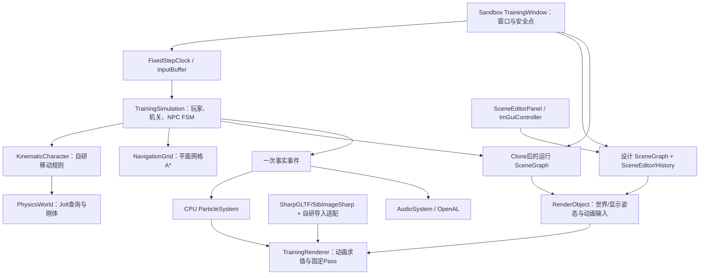
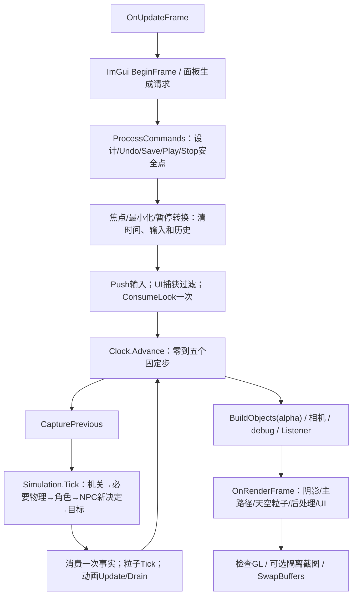
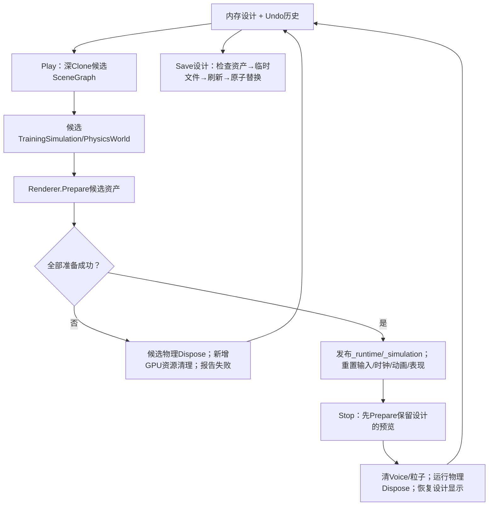

# G104Engine 实际架构与设计契约

本页解释现有Engine/Sandbox怎样连接、何处写数据，以及时间、空间和资源寿命的约定。当前接续/同步查 [status.md](status.md)；设计来源及演变查 [decisions.md](decisions.md) 和 [v1-baseline.md](plans/v1-baseline.md)。本页不是运行结果台账。

## 总体结构

项目用第三人称非战斗训练场串联输入、控制器、动画、渲染、机关、NPC 与工具，同时保留独立行为检查。短期 Gameplay/客户端求职方向影响顺序，不取消渲染、物理、动画、Gameplay、AI、工具链、资产、粒子、声音、网络和现代引擎架构的学习深度；旧 2–4 周预算不是整个项目期限。

| 项目 | 当前实际职责 | 依赖边界 |
| --- | --- | --- |
| [G104.Engine](../src/G104.Engine/G104.Engine.csproj) | Core、Scene、Editor、Assets、Animation、Physics、Navigation、Rendering、Effects、Audio、Tools 通用能力 | 不依赖 Sandbox，不持有训练场专属按钮/目标流程 |
| [G104.Sandbox](../samples/G104.Sandbox/G104.Sandbox.csproj) | 启动选项、窗口/安全点组装、训练场 C# Gameplay、NPC FSM、设计面板和演示验证 | 使用 Engine；示例布局与演示控制在此项目 |

不为架构图的每个方框建立独立程序集。当前对象由 GUID 和有限组件式设计字段组织，系统在明确阶段消费；没有完整数据导向 ECS、通用组件注册/反射框架、异步资产流或自研 Job System。所用库的工作线程也不等于引擎已有通用任务图。

选择两个项目是为了把可复用能力与训练场组装分开，同时避免为每个模块增加程序集。对象采用GUID和有限组件式字段；明确系统阶段先于完整ECS/反射/任务图，后续按真实需要局部实验。

## 实际文件入口

下表直接定位实现。它是架构导航，读懂本页不要求先读完整模块指南。

| 文件/目录 | 阅读时回答的问题 | 类型 |
| --- | --- | --- |
| [Program](../samples/G104.Sandbox/Program.cs) / [LaunchOptions](../samples/G104.Sandbox/LaunchOptions.cs) | 默认V1窗口、smoke、verify、UI/UI-input/render/contact/audio与隔离数据根如何选择，异常/退出码归谁处理？ | 启动/验证组装 |
| [TrainingWindow](../samples/G104.Sandbox/TrainingWindow.cs) | 窗口、UI、安全点、输入、固定模拟、相机/渲染、Play/Stop 和清理如何连接？ | 训练场组装 |
| [FixedStepClock](../src/G104.Engine/Core/FixedStepClock.cs) / [InputBuffer](../src/G104.Engine/Core/InputBuffer.cs) | 零步/多步帧、超时/补步、输入边沿和鼠标如何消费？ | 自研 Core |
| [SceneData](../src/G104.Engine/Scene/SceneData.cs) / [SceneGraph](../src/G104.Engine/Scene/SceneGraph.cs) | 设计身份/父关系与逻辑/显示世界矩阵是否混用？ | 自研设计/场景 |
| [TransformMath](../src/G104.Engine/Scene/TransformMath.cs) / [SceneValidator](../src/G104.Engine/Scene/SceneValidator.cs) / [SceneParameterRules](../src/G104.Engine/Scene/SceneParameterRules.cs) | TRS、剪切、父缩放、根限制、参数/引用在哪里拒绝？ | 自研数学/约束 |
| [SceneSerializer](../src/G104.Engine/Scene/SceneSerializer.cs) / [AssetPath](../src/G104.Engine/Scene/AssetPath.cs) / [TemplateCatalog](../src/G104.Engine/Scene/TemplateCatalog.cs) | JSON、资产边界、原子保存、模板实例的设计语义是什么？ | 自研适配 + .NET JSON/文件库 |
| [SceneEditor](../src/G104.Engine/Editor/SceneEditor.cs) / [EditorHistory](../src/G104.Engine/Editor/EditorHistory.cs) | UI 改动如何验证/准备/提交、失败回滚，Undo 怎样保持身份/dirty？ | 自研命令/有限快照 |
| [SceneEditorPanel](../samples/G104.Sandbox/Tools/SceneEditorPanel.cs) / [ImGuiController](../src/G104.Engine/Tools/ImGuiController.cs) | 控件如何排队命令、拖动事务怎样收束、ImGui 怎样接输入和GL？ | ImGui.NET集成 + 自研后端/设计面板 |
| [GltfModelLoader](../src/G104.Engine/Assets/GltfModelLoader.cs) / [GltfModel](../src/G104.Engine/Assets/GltfModel.cs) / [AssetRoot](../src/G104.Engine/Assets/AssetRoot.cs) | 标准格式怎样变成本项目模型，默认节点、边界、URI和skin如何处理？ | SharpGLTF集成 + 自研转换 |
| [AnimationController](../src/G104.Engine/Animation/AnimationController.cs) | Clip、速度混合、跳跃过渡、事件序列与pose如何求值？ | 自研运行时 |
| [PhysicsWorld](../src/G104.Engine/Physics/PhysicsWorld.cs) | Jolt世界/形状/query、矩阵包装边界、GUID和基础刚体寿命是什么？ | 第三方后端集成/适配 |
| [KinematicCharacter](../src/G104.Engine/Physics/KinematicCharacter.cs) | feet位置如何沿合法查询位移，坡台/墙/跳跃怎样决策？ | 自研角色规则 |
| [NavigationGrid](../src/G104.Engine/Navigation/NavigationGrid.cs) | 同一碰撞描述如何采样平面净空、A*和路径/端点怎样验空？ | 自研受控导航 |
| [TrainingSimulation](../samples/G104.Sandbox/Gameplay/TrainingSimulation.cs) | 门/目标/玩家/NPC 如何按阶段提交一次事实？ | 专属 C# Gameplay/FSM |
| [TrainingRenderer](../src/G104.Engine/Rendering/TrainingRenderer.cs) / [RenderContracts](../src/G104.Engine/Rendering/RenderContracts.cs) | 相同对象/动画/材质怎样进入两条管线、debug和透明合成？ | 自研固定 Pass |
| [GpuResources](../src/G104.Engine/Rendering/GpuResources.cs) / [PrimitiveMeshes](../src/G104.Engine/Rendering/PrimitiveMeshes.cs) / [GLSL](../assets/shaders) | GL资源、贴图/目标/Shader失败怎样清理，颜色/空间怎样一致？ | OpenTK/StbImageSharp集成 + 自研资源/几何/Shader |
| [ParticleSystem](../src/G104.Engine/Effects/ParticleSystem.cs) | 一次Burst怎样出生/推进/死亡/清理，有限容量在哪里？ | 自研 CPU 粒子 |
| [PcmWave](../src/G104.Engine/Audio/PcmWave.cs) / [AudioSystem](../src/G104.Engine/Audio/AudioSystem.cs) | WAV分块、共享Clip、独立Voice、Listener和上下文怎样管理？ | 自研解析/管理 + OpenAL |
| [初始场景](../assets/scenes/training-ground.json) / [资源清单](../assets/licenses/asset-manifest.json) | 哪些是随程序初始资源，哪些是用户设计，来源/许可在哪里？ | 设计/部署数据 |

## 数据身份与写入者

| 数据 | 当前负责者 | 消费者与限制 |
| --- | --- | --- |
| 设计 `SceneDocument` | `SceneEditor` 命令、`EditorHistory`、`SceneSerializer` | 保存 JSON、编辑预览和 Play 克隆；运行状态不能直接写回 |
| 对象持久身份 | 非空唯一 GUID；可空 ParentId/TargetId | 创建/删除撤销恢复原身份；资产不使用运行句柄作身份 |
| 输入按住态/边沿 | `InputBuffer` | Move/Sprint 持续；Jump/Interact 只在一次有效模拟步消费 |
| 水平移动参考 | 窗口每显示帧单次消费鼠标 Look 后确定 yaw | 多个补步使用相同参考；相机俯仰不产生玩家竖直移动 |
| 角色逻辑 feet/速度/接地 | `KinematicCharacter` 与 `TrainingSimulation.SubmitCharacter` | 碰撞、Gameplay、动画输入读取；动画和相机不覆盖角色位移 |
| 机关状态 | `TrainingSimulation.Interact/CheckGoal` | 先校验距离/视线/关闭占用，再提交门画面、碰撞和导航事实 |
| NPC 决策与任务 | `TrainingSimulation` FSM、`NavigationGrid` 路径 | 下一步移动意图由角色执行，区分到达/受阻/无路；与动画 FSM 分离 |
| 逻辑/显示矩阵 | `SceneGraph` 当前/前一步局部 TRS | 逻辑世界给物理；显示世界用统一 alpha，不反写逻辑 |
| 节点姿态/palette | `AnimationController`、`GltfModel` | 模型内部树独立于设计场景树；in-place 不抽取 root motion |
| 一次事实事件 | 每个 `TrainingSimulation.Tick` 生成并在当步消费 | 音效和粒子使用同一事实；Render 不重发事件 |

V1 不是把全部 Runtime 内存序列化的运行存档。GPU、Jolt、音频句柄与动画游标不进入设计 JSON；具体数据/API见 [scene-and-editor.md](guides/scene-and-editor.md)。

## 实际帧流程

`FixedStepClock` 的步长 `1/60` 秒，最多五步、输入时间上限0.25秒；完整积压丢弃，余量产生alpha。零步保存Jump/Interact边沿，多步第一次消费后清边沿，Move/Sprint继续按住。窗口当前也限制显示delta，并在加载/切换/暂停转换时丢弃下一旧delta；时钟统计不代表所有系统耗时。鼠标以显示帧更新参考yaw，同一帧各补步不重复应用 Look。

编辑命令不在物理更新或对象遍历中改集合，即使暂停/零步仍可响应。编辑态推进预览动画，运行态按固定步推进动画/粒子；`Render`只读显示输入。暂停与失焦清理不是确定性网络协议，基本恢复/最小化、连续操作和特殊组合需要各自覆盖证据，不由协议说明推定通过。

`TrainingWindow.OnLoad` 以 `new ImGuiController(this)` 绑定当前窗口；UI鼠标的位置、按钮、滚轮、焦点和文字由窗口回调按顺序入队，`BeginFrame` 开帧处理队列并同步键盘按住态。逐帧最终按钮状态不能保留帧间完整点击；这次修复没有把全部键盘采集改为回调。失焦先使鼠标位置无效再释放按钮，使用焦点事件值；`Dispose` 解除窗口事件订阅。场景点击清焦使用WantCaptureMouse，不能用IsWindowHovered代替输入归属：已激活控件会阻挡默认Hovered查询，误清焦会让松开失效。窗口捕获/命令安全点与角色InputBuffer职责分开，见 [v1-ui-mouse-fix-2026-10-04.md](reviews/v1-ui-mouse-fix-2026-10-04.md)。

固定模拟60Hz而绘制独立，使控制器/Gameplay使用稳定dt，显示用前后逻辑状态插值。五步上限和丢时避免停顿后无限追赶；这是离线V1取舍，不保证网络/回放逐位确定性。UI命令、Undo/Save/Stop与场景替换在主线程安全点处理，暂停或零模拟步仍能响应，不在系统遍历途中修改集合。

失焦、最小化、暂停、加载或Play/Stop清时间和输入；恢复丢弃旧delta，并重置SceneGraph与骨骼显示历史。音频暂停/恢复Voice；当前无单步功能。尺寸为零跳过绘制，UI输入适配与角色InputBuffer分工独立。

## 坐标、矩阵与角色边界

| 边界 | 实际约定 |
| --- | --- |
| 世界 | Y-up、右手、米/秒；局部前 -Z、右 +X |
| OpenTK CPU | 行向量，局部 S×R×T；`world=local×parentWorld` |
| GLSL | 列向量，`P×V×M×position`；OpenTK 原始行字节按 `transpose=false` 上传，GPU 数学矩阵相当于 CPU 转置 |
| glTF 蒙皮 | `palette=inverseBind×jointWorld×inverse(meshWorld)`；`drawModel=meshWorld×instanceCorrection×sceneWorld` |
| Jolt 形状查询 | 当前绑定版本在 `ToJolt` 内转置；`PhysicsWorld.QueryTransform` 将 Numerics 行 TRS 预转置一次，集中适配该公开边界 |

不能把内存行/列布局等同于向量乘法约定，也不能把 GLSL 上传策略套到 Jolt 包装层。Jolt Body 的位置/四元数参数不经过查询矩阵路径。该差异曾由原生扫掠/穿透结果异常暴露，修复后行为检查通过；推导和固定版本源码见 [physics-and-gameplay.md](guides/physics-and-gameplay.md#固定jolt版本与矩阵边界)、[rendering-and-animation.md](guides/rendering-and-animation.md#空间矩阵与蒙皮) 与 [design-reference-checks-2026-10-03.md](reviews/design-reference-checks-2026-10-03.md)。

受控场景树使用 LocalTRS、禁止环/无效父/外部缺失引用。所有接收可编辑子对象的节点要求正统一缩放；玩家/NPC 保持根和单位缩放。重挂接保持世界姿态后必须重组验证 TRS，不静默丢失剪切。活动相机由窗口单独管理，动态箱由物理验收创建；目前 DTO 没有可任意挂接的活动相机或动态刚体组件。

角色规则自研：有限穿透恢复、扫掠/迭代墙滑、接地、跳跃/撞顶、有限坡度和台阶；Jolt 提供精确查询与刚体，未用其完整角色控制器取代规则。角色 feet 与查询胶囊中心不同，Collider.Center/Size 经世界矩阵和尺度只应用一次。移动平台携带、推箱、角色互推、任意复杂网格和挤压恢复未实现。相机按显示玩家姿态跟随并用物理 raycast 限制遮挡距离，其基础操控/观感随指南第1项已获用户初步确认，特殊场景组合仍按后续反馈取证。

OpenGL投影NDC z为[-1,1]，与固定Piccolo的Vulkan 0..1及Y翻转不同。GL上传的行字节解释与Jolt查询的预转置属于两种边界，不能互相套用。非均匀缩放法线用逆转置，切线正交化；刚性实例镜像与skin内部负/零缩放合同在 [rendering-and-animation.md](guides/rendering-and-animation.md#空间矩阵与蒙皮) 中定义。

角色模型保留内部根固定旋转；默认完整蒙皮边界用于1.9m/feet对齐，实例加Y轴180°把素材+Z适配为引擎-Z。65关节完整进入128矩阵std140 UBO。场景树、模型节点树与skin关节集合分别求值，不能把设计父缩放限制施加给导入骨骼全部节点。

SetWorldPosition/SetWorldRotation只修改对应已存TRS字段，保留其余字段；通用SetWorldMatrix/保持世界重挂接才分解矩阵。稳定trace/最大对角四分支及double中间值避免近180°反求小分母，仍维持有限值、正缩放、1e-4重建容差与剪切/反射拒绝。这是合法TRS精度修复，不是放宽场景约束。

## 所有权、共享与释放

| 所有者 | 数据/资源 | 清理/失败规则 |
| --- | --- | --- |
| 窗口 | UI/renderer/audio、设计/运行组装、particles/commands | `Run`外层finally和OnUnload均调用幂等DisposeResources，GL仍在有效Context时释放 |
| 设计/History | DTO/矩阵/100条有限快照、稳定GUID/DTO身份 | 不拥有GPU/Jolt/AL句柄，不能深Clone句柄建立运行隔离 |
| renderer | 程序/primitive/天空/目标；共享模型/贴图；GUID动画实例 | Prepare失败仅清新资源；Resize完整新目标成功才替换；离场引用清理；ResetScene与Dispose明确分层 |
| PhysicsWorld | System/Body/Shape/query capsule/filters/jobs | 注销/销毁Body→Shape/System/jobs/filters→最后一个活动世界Foundation.Shutdown |
| AudioSystem | device/context、共享Buffer、独立Voice | 先停止/解绑/删Voice→Buffer→解除/销毁context→device→加载库；构造部分失败同样清理 |
| ParticleSystem | CPU个体、512容量和随机源 | 固定步推进/死亡回收，Stop/Play清Clear；不拥有渲染器粒子GPU资源 |

当前AudioSystem在窗口寿命内同步枚举并载入八个WAV：七段Kenney来源转换素材加程序生成的 `loop-test.wav`。Play/Stop只清Voice，Buffer保留到窗口关闭；这不是场景差量音频加载或进程级资源数据库。renderer共享primitive/Shader等通用资源至退出，模型/贴图按活动场景引用复用并卸载；实例删除不是释放所有共享资产。JoltFoundation按活动世界计数，双世界行为已经检查，不能用“当前活动世界”猜测别的世界所有权。

GL创建/上传/Prepare/Resize/Render/删除均在有效当前上下文所属线程；线程检查不能代替上下文有效性。Shader/FBO构造部分失败、新场景资源失败和正常退出已有清理代码，自动运行只覆盖实际经过的路径，并非全部故障注入。性能观察是FPS/帧间隔与多Pass提交统计，未做独立GPU计时或保证Deferred更快。

renderer缓存模型/贴图，但没有进程级无限资源数据库；实例删除不能销毁其他对象仍引用的共享资产。Prepare失败仅清新增项；Resize完整新目标成功才替换旧目标。Shader/FBO构造、部分初始化与场景准备各有清理路径，自动运行仅证明实际经过的路径，并非全部故障注入。

音频运行输入为整数PCM16 mono/stereo WAV。3D点声源需mono，Listener随显示相机；32 Voice满时淘汰最早登记者，不等于完整分类/优先级系统。CPU粒子是世界空间Burst/512容量、固定步生成运动死亡和alpha淡出；没有持续Emitter、GPU池、传播/混响或AI听觉。

## 设计、运行与准备提交

`SceneDocument` 保存schemaVersion=1、GUID、ParentId、LocalTRS、有限Material/Collider/参数/资产与模板信息。设计场景树、glTF默认节点树和skin关节集合是不同结构；场景编辑限制不套到导入模型全部节点。`TemplateId`是单层来源，实例保存完整有效字段与白名单覆盖，父挂接独立管理；当前没有模板变体/嵌套/Apply/Revert。

Play 不从磁盘重新覆盖当前内存设计，Stop 不用运行角色位置/机关状态写回设计。新设计 Load 先校验/Prepare 再替换编辑器，清旧历史；失败保持当前设计。候选创建期间新旧资源可能短时并存，这是安全提交的成本，同步加载仍可能停顿。

普通设计命令在同一安全点先保存快照、修改/校验场景，再经 `EditorHistory.PrepareChange` 准备资产/渲染；失败恢复设计/历史，Undo/Redo也先准备候选快照。当前编辑态没有独立物理模拟世界，Play 按最新设计世界变换建立静态碰撞；不把“编辑预览已重建Jolt”写为现成功能。运行组保持静态，门使用自己的世界姿态/Body开关，不用运动父组模拟平台。

初始资源位于应用输出assets，用户设计默认位于LocalApplicationData/G104Engine/TrainingGroundV1/Scenes。损坏设计启动时报告、保留原文件、回退seed；后续用户选择Save会先备份被拒原件。`--exercise`要求显式隔离`--user-data-root`；CPU文件检查也在指定隔离根下执行，不把真实用户Scenes当测试目录。
Undo/Redo 最多 100 条，稳定 GUID/DTO、子树事务、外部 TargetId 引用删除拒绝、拖动合并/Escape 取消、新编辑清 Redo、dirty 与成功保存状态分别实现。单层模板保存完整有效字段与白名单覆盖，不支持嵌套、变体或 Apply/Revert。运行面板只读，有限设计字段使用命令，不复制后端句柄实现 Play/Stop。

受控父子结构用于“机关组→门/按钮/灯”这类组合。普通对象保存相对TRS，重挂接保world、删除整棵子树为一次Undo；GUID不随换父变化。Player/Npc必须为根且单位缩放，角色/移动门下仅纯显示后代；所有接收设计子对象的节点要求正统一缩放。活动相机/动态刚体根原则是扩展边界，当前DTO没有对应编辑组件；场景树不是物理约束、Prefab嵌套或骨骼挂点。

## 渲染与表现合同

方向光2048² D24/3×3 PCF阴影→Forward或G-buffer/Deferred→天空/透明Billboard→曝光/Reinhard/一次Gamma→FXAA→UI。G-buffer为RGBA8线性基础色/金属度、RGBA16F世界法线/粗糙度、D24；Deferred以深度与逆ViewProjection重建位置。HDR为RGBA32F，修复GGX峰值后保留能量，较旧16F每像素增加8字节；没有通用Render Graph。

一盏方向光与最多四点光；无点光阴影/级联/IBL，天空只作背景，固定弱环境项不是间接光。透明粒子按view-space Z排序，深度测试开、写入关；一般glTF Alpha BLEND拒绝。FXAA和镜像的完整专项视觉证据仍有限，弱斜面PCF细斑属于当前bias/接触阴影取舍。

两条管线共用设计/材质/骨骼/光源，在编辑态选择、下一次Play生效，不能无缝迁移任意运行状态。FPS/帧间隔和DrawCalls/Triangles只描述显示间隔/多Pass提交，没有独立CPU/GPU计时，不证明Deferred更快。

动画配置为schema=1的Locomotion/JumpStart/JumpLoop/JumpLand有限映射；逻辑采样、跨Clip混合、相邻局部Pose显示插值是三层。SceneGraph、mesh/palette/skeleton共用alpha；暂停ResetDisplayHistory保游标/事件，成功场景提交ResetAnimations重建实例。精确字段见 [rendering-and-animation.md](guides/rendering-and-animation.md#an5有限数据配置与使用)。

## 固定参考与可选深入

Piccolo 固定参考为 [f5053707fed4d3f94d270a436fb0d3a8ae54e3e5](https://github.com/BoomingTech/Piccolo/tree/f5053707fed4d3f94d270a436fb0d3a8ae54e3e5)。借鉴对象组件、数据交换、资源分层和局部算法，不照搬 Vulkan 投影/矩阵、组件遍历时序或空清理路径。其固定物理参数不证明有本项目累计器，首 Clip/固定权重不证明完整混合，目标重叠检查不证明扫掠墙滑，模式重载不证明保留未保存设计的 Play/Stop。所查 Piccolo 不覆盖完整音频、NPC FSM/A*、网络、Lumen 或 Nanite；不能把课程目标写成参考引擎全部实现。

每个知识点保留代码—笔记—固定参考—采用/简化—证据关系；十份笔记、W/Space完整学习单元及全部未来专题在 [learning-map.md](learning-map.md#first-input-lesson)。网络/GI/GPU几何、布局/ECS/Job/Fiber、GPU粒子、IK/重定向、平台推箱、IBL等有实践目标，具体范围不由架构链接自动开工。

精确API可选查 [scene-and-editor.md](guides/scene-and-editor.md)、[physics-and-gameplay.md](guides/physics-and-gameplay.md)、[rendering-and-animation.md](guides/rendering-and-animation.md)。实际历史验证分层为构建、CPU、原生、GL、音频、用户体验与学习；相互不能替代，精确批次/本机日志见 [v1-progress.md](execution/v1-progress.md)。

可选调查来源：[v1-independent-review-2026-10-03.md](reviews/v1-independent-review-2026-10-03.md)、[v1-contact-exit-fix-2026-10-03.md](reviews/v1-contact-exit-fix-2026-10-03.md)、[v1-ui-mouse-fix-2026-10-04.md](reviews/v1-ui-mouse-fix-2026-10-04.md)、[design-reference-checks-2026-10-03.md](reviews/design-reference-checks-2026-10-03.md)。这些记录保留修前失败与修后证据，本轮文档改造没有重新运行应用。
