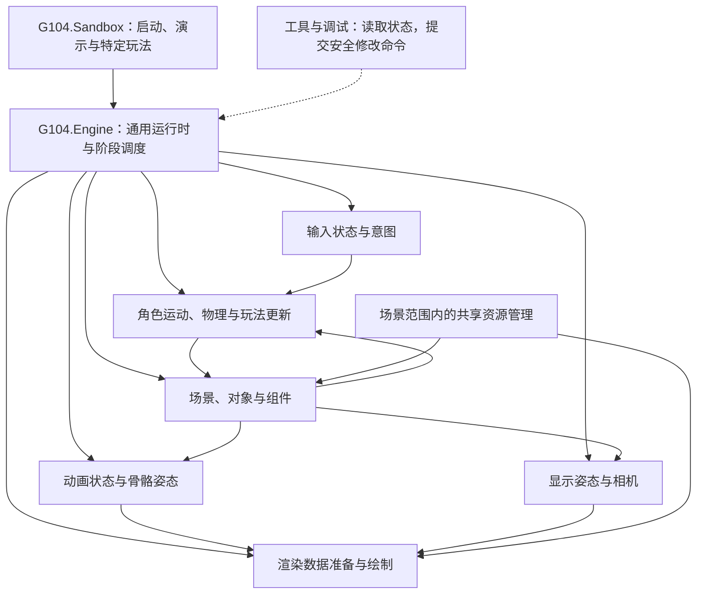
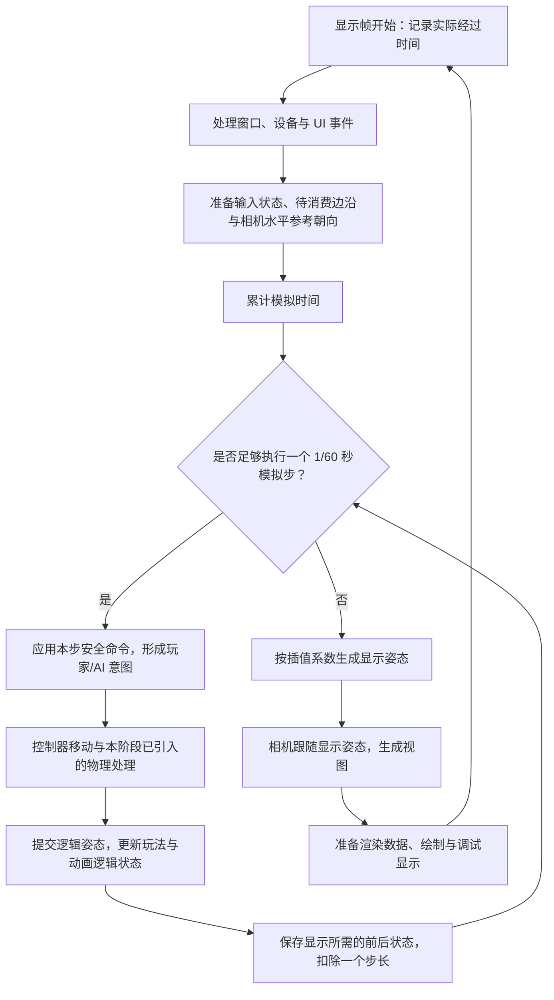
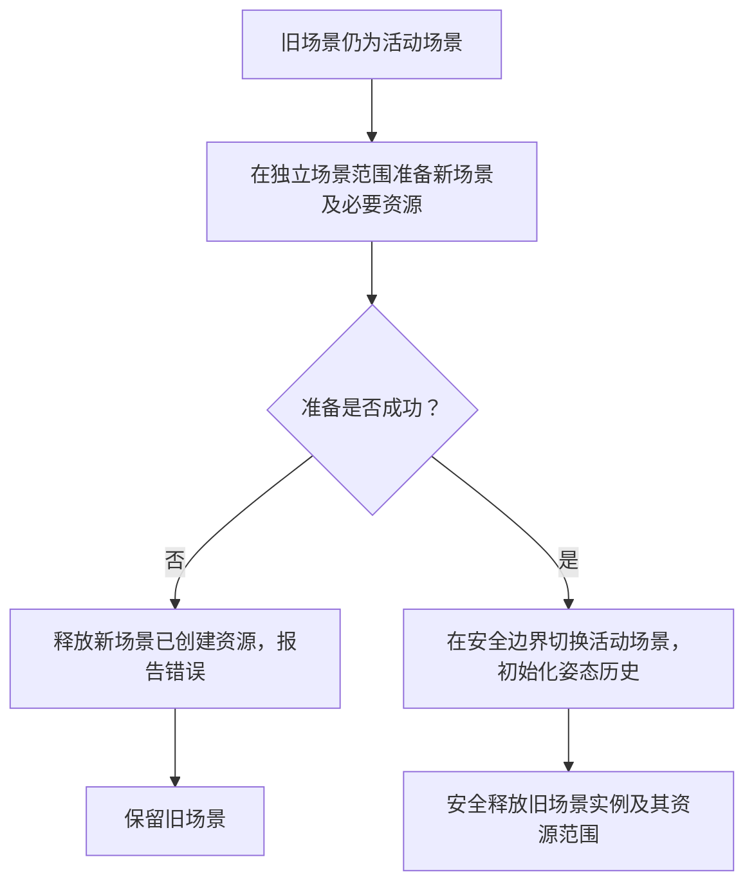

# G104Engine 基础架构：已确认设计与待细化事项

最后更新：2026-10-03。本页保存本轮架构讨论，**不是功能已经实现的说明，也不是立即开始编码的实施计划**。

当前代码仍为 Sandbox 的 OpenGL/Smoke 环境探针与 Engine 空类库模板，没有正式场景、渲染器、物理、动画或 Gameplay 模块。**原最小 3D 里程碑已确认合入 V1；当前集中收敛 V1 范围、依赖/素材、实施方案与开发节奏，尚未开始代码。** 实际进度见 [status.md](status.md)，稳定目标见 [plan.md](plan.md)。

统一目标名称为 **基础综合训练场 V1（用于面试展示）**，此前面试 Demo 指同一版本；Deferred 与有限 Undo/Redo 已进入 V1。[范围草案](plans/basic-training-ground-v1-draft.md)其余清单和具体细节待确认。以下旧“基础版终点”指此前模块能力目标，当前 V1 归属以范围草案和明确决定为准；基础职责与正确性约束仍适用。

V1 当前范围已进一步确定：IBL、平台/推箱后移，基础渲染链、有限坡台、有限创建/删除/编辑及 Play/Stop 纳入。依赖组合已选；具体契约与数据流见 [实施草案](plans/v1-implementation-draft.md)，环境/素材状态见 [准备清单](plans/v1-dependencies-and-assets.md)。这些实施建议尚未获开工弹窗批准，当前没有正式模块代码。

场景层级已由用户确认纳入V1：受控父子挂接、Local/World变换、保存与子树Undo；玩家/NPC/活动相机/动态刚体保持根。可编辑场景父节点限正统一缩放，重挂接默认保持世界姿态并校验TRS可表达性；导入模型/骨骼内部层级单独处理。具体更新、引用和恢复契约见实施草案9.1，普通实现细节由助手按用户授权定案。

## 1. 决策状态与设计目的

本文区分以下状态，后续对话不得将它们混用：

| 状态 | 含义 |
| --- | --- |
| 已确认方向 | 用户在本轮讨论中已选择的基础设计，后续细化以此为依据；需要改变时说明原因并重新讨论 |
| 技术要求 | 为使已选方案正确工作，经参考核对后需要满足的约束；不代表已实现或验证 |
| 起步建议 | 助手推荐的方式，需要纳入后续实施计划评审；不写成用户逐项批准 |
| 待细化 | 尚需决定具体行为、参数、接口或验收规则，不能默认按草案执行 |

项目以第三人称综合交互场景串联模块，同时保留独立实验。短期 Gameplay/客户端求职目标影响顺序，**不取消渲染、物理、动画、Gameplay、AI、工具链、资产、粒子、声音、网络等模块不同深度的实践与掌握**。不把基础阶段当作全部模块范围，也不按旧的 2–4 周预算完成整个引擎。

开发参考课程笔记及固定版本 Piccolo，形成自己的实现；关键原理自研，复杂能力可配合成熟库。各模块的自研、集成、原理实验与暂缓部分仍需在整体路线图中分别确认。网络、动态 GI/Lumen 相关原理、GPU 几何/Nanite 相关原理留到未来专题分支讨论；基础阶段不建设这些系统或它们的切换框架。

已确认设计围绕三件事展开：能追踪一次输入如何改变世界并成为画面；能解释状态与资源归谁管理；每个阶段有可运行结果、学习材料及明确验收点。

## 2. 项目边界与对象组织

### 2.1 已确认：继续使用 Engine 与 Sandbox 两个项目

| 项目 | 设计职责 | 不应混入的职责 |
| --- | --- | --- |
| `G104.Engine` | 通用运行时能力：时间与调度、场景对象和组件、渲染、输入、资源管理，以及逐阶段加入的物理、动画等能力 | 特定展示场景的布局、演示流程及专属玩法规则 |
| `G104.Sandbox` | 程序启动与通用能力组装、场景演示、示例资源选择、针对演示的 Gameplay | 为多个模块共享的通用引擎能力 |

依赖方向为 Sandbox 使用 Engine，Engine 不依赖 Sandbox。模块先在 Engine 内按职责组织，不因架构图中的一个方框就建立一个程序集。当前 NuGet 包归属及临时窗口类不是最终实现约束；调整依赖或工程配置仍需对应授权，不在本次文档整理中进行。

### 2.2 已确认：对象组件模型，更新由明确阶段组织

- 场景管理对象身份、生灭与实例状态；对象通过组件组合能力，而非依赖不断加深的继承层次。
- 组件表达对象拥有什么状态与能力；跨模块协作由明确阶段和对应系统协调，不依赖对象遍历顺序或组件插入顺序碰巧正确。
- 第一版不建设完整数据导向 ECS。后续已确认数据布局对比与小型 ECS 实践，再按需局部接入；对象组件主线保留，具体接入由实际规模、学习目标和测量结果决定。
- Gameplay 的特定规则留在 Sandbox，Engine 提供可复用能力。具体组件类型、接口、集合布局、事件方式尚待近期实施计划确定。

下面是**已确认职责方向的设计图，尚未实现**；其中方框表示职责，不代表已确定类名或新增项目：

图中包含后续逐步引入的能力，基础绘制先建立可用入口。输入、工具、物理、动画、渲染的最终接口与顺序需要结合 V1 实施方案继续细化。

Gameplay/AI 已进一步确认：基础玩法使用 C# 规则与数据配置，Lua/可视化脚本后续专题；基础 AI 先 FSM 再小型 BT 对比，导航先自研网格 A* 与实际跟随再加入 NavMesh。AI 产生任务/运动意图，角色控制器负责合法执行；AI FSM 与动画 FSM 职责分离。具体事件、任务、感知、导航子集及配置见 [Gameplay/AI 路线](plans/gameplay-ai-roadmap.md)，尚未形成实现接口。

## 3. 状态归属：谁能修改什么

以下表格记录已讨论的职责边界，是后续接口设计的约束，**不意味着相应类型、更新频率和全部回调已定案**。

| 状态或数据 | 负责产生或管理的职责 | 主要消费者与约束 |
| --- | --- | --- |
| 输入状态、玩家或 AI 意图 | 输入系统采集设备状态；玩家/AI 决策转换为移动、朝向、跳跃等意图 | 控制器与 Gameplay 消费意图；输入回调和 AI 不直接改最终世界位置 |
| 运动学角色移动结果 | 角色控制器根据意图、时间步及碰撞查询求得允许的移动 | 结果提交为角色逻辑 Transform；动画和相机不另行覆盖角色位移 |
| 动力学刚体姿态 | 引入动力学后由物理模拟负责 | 同步到对应对象逻辑 Transform；玩法提交力、速度或明确的瞬移命令，避免双方同帧互相写回 |
| 逻辑 Transform | 场景保存；每类对象明确其当前写入者 | 角色由控制器结果更新，动力学对象由物理结果更新；其他对象由指定玩法/工具命令更新。它是模拟状态，不是插值后的显示状态 |
| 动画逻辑与骨骼姿态 | 动画模块根据状态、播放时间及混合参数生成 | 渲染消费骨骼结果；第一版 in-place 动画不通过提取根位移驱动角色世界位置 |
| 显示姿态 | 表现阶段根据前后逻辑姿态生成插值结果 | 渲染及相机跟随读取；不写回物理或玩法逻辑状态 |
| 相机水平朝向与跟随位置 | 输入/相机控制确定用于移动参考的水平朝向；相机表现阶段确定跟随位置与最终视图 | 两者职责分开，避免“先知道角色新位置才能计算移动方向”的循环依赖；碰撞避障和具体平滑参数待定 |
| 工具修改与场景生灭命令 | 工具产生请求，由场景/调度在安全边界应用 | 不在遍历集合或物理更新中任意增删对象；编辑、暂停、单步等行为仍待工具阶段细化 |

逻辑 Transform 与显示姿态必须可分别观察。后续调试显示应能说明角色当前状态、控制器结果、物理碰撞数据、动画状态以及显示插值的来源，不把“看起来能动”当作状态流已正确。

## 4. 时间步、帧流程与第三人称控制

### 4.1 已确认：固定模拟 60 Hz，渲染随显示帧推进

模拟步长为 `1/60` 秒。一个显示帧可能没有模拟步，也可能执行多个模拟步；不能简单地在每个显示帧恰好调用一次 `1/60` 秒模拟。基础设计需要累计实际经过时间，并为显示阶段提供前后模拟状态。

下面是**设计流程示意，未实现**。固定步内部更细的事件顺序、动画求值频率及暂停策略仍需形成可执行的近期计划：

该图表达处理边界，不规定所有后续模块必须串行调用，也不宣称完整的“物理→动画→相机”生产级调度已经定案。**用户已确认基础版主线程按明确阶段更新和提交图形，同步准备场景**；不预建多线程任务图、异步资产流或独立渲染线程。它限定本工程组织的主流程，音频/物理后端、驱动或运行时仍可能有内部线程，不等于整个进程只有一条线程。

后续核心架构实践已选布局对比＋小型 ECS 实验、按需局部接入，以及先 .NET 并行库再自研有限调度原型。具体任务/数据接口和进阶 Fiber 等机制见 [核心架构路线](plans/core-architecture-roadmap.md)；线程归属、数据所有权、失败和任务完成前的生命周期必须在并行化时重新核对。详细计时在相应实验前按需加入，初版 FPS/帧耗时的范围不变。

### 4.2 已确认：控制器驱动位移，动画先使用 in-place 方案

- 移动采用镜头相对方向：将镜头水平朝向用于计算角色在地面上的前后左右移动，不把相机俯仰直接变成上下移动。
- 控制器负责角色世界位移与碰撞后的运动结果；动画根据运动和玩法状态表现动作，第一版不引入 Root Motion 驱动世界位移。
- 相机的水平朝向控制与跟随位置计算分开。模拟步使用一致的方向参考，跟随位置读取显示姿态；具体输入采样和朝向更新时机待细化。
- 首个控制器验收包括平地移动、墙面阻挡、沿墙滑动、跳跃与落地；坡道、台阶、移动平台及推箱子放到后续阶段，不隐含在首次验收中。

后续模块深度讨论已确认：已选模块目标逐步扩展到斜坡/台阶、平移平台及受控推箱，均分别验收；角色移动规则自研，物理后端提供查询与刚体能力，首块范围不变。布娃娃、布料/PBD/XPBD、破坏及车辆先独立代表实验再按需整合。后端已选 Jolt，规则契约与实测仍待实施，见 [物理/角色路线](plans/physics-character-roadmap.md)。

选择此方案是为了先理解“输入意图→碰撞允许的移动→逻辑姿态→动画与相机→画面”。Root Motion 后续可作为另一个运动驱动专题讨论；当前不需要预做开关或两套完整控制链。

动画模块已确认基础终点为 Idle/Walk/Run 速度混合、跳跃状态机、平滑过渡与基础事件，采用小型可配置运行时和状态/权重调试显示，先用同骨架动作集。Mask/Additive/脚部 IK 与重定向等后续实验，不自动建设完整节点编辑器；采样、绑定、事件、时钟和素材细则见 [动画路线](plans/animation-roadmap.md)。

### 4.3 在实施前必须继续收敛的行为

| 议题 | 需要明确的规则或验收 |
| --- | --- |
| 零步与多步帧的输入 | 持续按键、跳跃等边沿、鼠标累计量如何保留与消费；没有模拟步时不能丢失边沿，多步时不能重复触发一次动作 |
| UI 与窗口焦点 | UI 捕获输入、失焦、重新获得焦点、鼠标锁定变化时，哪些游戏输入清除或保留 |
| 补步与卡顿 | 单帧允许累计的时间、补步上限与超限处理；具体数值尚未批准 |
| 暂停与恢复 | 暂停期间时间如何累计、恢复是否补跑、是否提供单步，以及失焦是否触发暂停 |
| 显示插值 | 明确最多落后一个模拟步的显示时延、相机跟随方式、低帧率与高帧率观感；不承诺固定步自然消除所有抖动 |
| 瞬移与场景切换 | 创建、瞬移、重置、载入场景时重建姿态历史，避免从旧位置插值过来 |
| 动画细节 | 骨骼求值放在哪个阶段、动画事件如何避免重复/漏发、移动速度与播放速度如何匹配及如何观察脚滑 |
| 控制器细节 | 角色形状、接地判定、墙角滑动、跳跃边沿、碰撞容差与异常初始重叠如何处理 |

## 5. 空间、单位与 CPU/GPU 矩阵边界

### 5.1 已确认的空间约定

| 项目 | 约定 |
| --- | --- |
| 世界空间 | 右手系，`+Y` 向上 |
| 默认角色/对象局部方向 | 前方 `-Z`，右方 `+X`，上方 `+Y` |
| 单位 | 长度以米计，时间以秒计；速度和加速度据此解释 |
| 数学库 | 使用当前固定的 OpenTK.Mathematics 4.9.4，按其原生行向量用法设计 CPU 变换 |
| Shader | GLSL 使用列向量变换约定，CPU 到 GPU 的映射集中处理 |

对象局部前方、世界上轴、相机 View 空间、投影后的裁剪空间是不同概念。导入资产如果采用不同轴向或单位，应在约定的导入边界转换，不能依靠每个控制器或 Shader 各自补旋转、缩放。

### 5.2 技术要求：数学含义、存储与上传必须分别说明

CPU 行向量与 GLSL 列向量描述同一个变换时，需要保持转置关系。用数学表达式说明时，CPU 的 `p * M * V * P` 对应 Shader 的 `Pᵀ * Vᵀ * Mᵀ * p`；Shader 中矩阵变量代表的实际内容必须与上传约定一致。这里的转置关系不等于“所有调用都开启 transpose 参数”。

本轮已核对 OpenTK 4.9.4 所选矩阵工厂、`TransformRow` 与普通 `mat4` uniform 上传封装，得到以下对应关系。这是已选策略的技术推导，尚未通过本工程的真实 GPU 绘制验收：

| 同一空间变换的含义 | CPU 原生行向量表示 | 笔记/GLSL 对应列向量表示 |
| --- | --- | --- |
| 先缩放、再旋转、再平移 | `S * R * T` | `T * R * S` |
| 子局部变换累积到世界 | `local * parentWorld` | `parentWorld * local` |
| 顶点进入裁剪空间 | `p * M * V * P` | `P * V * M * p` |

两栏使用各自约定下的矩阵，不是对同一组数值随意反转乘法。逐个上传所选 OpenTK 工厂产生的原生行矩阵时，使用 `GL.UniformMatrix4(..., false, ref matrix)`，不额外执行 `Transpose()`；GLSL 按 `P * V * M * vec4(position, 1)` 计算。CPU 若先合成 MVP，仍按 `M * V * P`。原始字节按列序解释后，GPU 数学矩阵恰为 CPU 的转置，故两边表达式等价，详见 [核查与算例](reviews/design-reference-checks-2026-10-03.md)。

集中转换入口的具体接口、未来 UBO/SSBO 布局与打包规则仍待首次对应实现确定。不能在 Shader、CPU 构造和上传处分别随意转置，也不能仅凭“行主序”猜上传参数。角色旋转表示、角度输入边界、资产轴向/单位/骨架转换及缩放限制尚需在数学与资产任务中细化，不把未讨论的默认值当成已确认需求。

当前图形基线是 OpenGL 4.3 Core。Piccolo 的 Vulkan 投影深度范围和 Y 翻转不能直接照搬；后续实施应使用并验证 OpenGL 的实际裁剪/深度约定。还应明确正面绕序、剔除、法线变换、非均匀缩放、窗口逻辑尺寸与 framebuffer 像素尺寸的处理。

基础验收至少要能检查已知点的平移/旋转/缩放结果、相机前后与左右方向、近远裁剪、绕序及视口缩放；确切程序化断言和画面用例由近期实施计划确定。

## 6. 场景与共享资源生命周期

### 6.1 已确认：共享资源限定在场景范围

同一场景内，多个实例可共享网格、纹理、材质等资产；实例持有自身 Transform 和玩法状态，不能因为删除一个实例就误释放其他实例仍使用的共享资源。场景范围是第一阶段选定的共享与释放边界，不先建设进程级无限缓存。

例如三个相同箱子共享模型，删除一个只清理该实例；即使都删完，共享资源也可保留到场景卸载。基础着色器、默认资源及工具界面等引擎通用资源可由引擎作用域持有至退出；这是已说明的分层建议，具体清单待实施任务确定。修改单个实例外观与修改共享材质应区分作用范围。基础版不需要先建设通用引用计数或自动驱逐框架。

| 层次 | 保存什么 | 生命周期责任 |
| --- | --- | --- |
| 资产标识与描述 | 来源、导入设置和资源引用等描述 | 说明需要什么资产，不等于已经创建 GPU 对象 |
| CPU 资产数据 | 解码后的顶点、索引、像素、骨架和动画等数据 | 由资源加载与场景范围管理；上传后是否保留副本按后续用途决定 |
| GPU 资源 | 缓冲、纹理、着色器程序及其他图形对象 | 由引擎渲染资源管理职责创建和显式释放，组件不自行重复创建共享 GPU 对象 |
| 场景实例 | 对象身份、Transform、资产引用与运行状态 | 由场景创建、更新和删除；与共享资产的寿命分开 |

缓存键、材质实例覆盖、CPU 数据保留、资源失败提示及场景内动态卸载策略尚待具体资产阶段细化，不把 Piccolo 的材质路径组键直接当作我们的完整设计。

资产/场景的后续讨论已确认 glTF 2.0/GLB 为主要模型入口、先保存设计场景，以及单层对象模板与明确实例覆盖。运行存档另设阶段，解析库已选 SharpGLTF，对象/资产身份和覆盖字段待实施方案，见 [资产与场景路线](plans/assets-scene-roadmap.md)。外部模型格式、引擎描述与场景实例/运行状态需要分层，不能直接把 GPU 句柄等运行对象序列化为场景文件。

### 6.2 已确认：新场景准备成功后才替换旧场景

这是已确认的切换语义，尚未实现。准备失败不能使旧场景进入半卸载状态；新场景的临时对象、物理注册及 GPU 资源不得污染旧场景。资源范围在准备与替换期间可能同时存在，需要承认短时内存占用增加；不同场景之间是否进一步共享资产留到有需求时讨论。

同步准备场景已获确认，意味着准备新场景时可能暂停画面更新；“失败保留旧场景”不等于已承诺后台无卡顿加载。准备成功的判定、失败恢复细节、加载 UI 和切换安全点仍需写入对应实施计划；后台加载留到后续机制实验。

### 6.3 技术要求：GPU 资源必须有确定的清理路径

- GPU 资源采用明确的 `Dispose`/等效确定性释放责任，不依赖 C# GC 或终结器及时调用 OpenGL 删除函数。
- 创建和释放必须在正确线程且 OpenGL 上下文仍有效时执行；清理资源后再销毁相应窗口/上下文。若以后引入其他线程，需要重新讨论提交与释放调度。
- 初始化中途失败、场景准备失败和正常退出，都要清理已经成功创建的部分；按依赖逆序回收，避免重复释放。具体组织可采用 `try/finally`、作用域或其他已验证方式。
- 删除场景对象、释放共享资产、销毁整个图形上下文是不同操作；必须能检查各自是否生效，而非只确认程序退出。

上述要求来自图形资源的生命周期约束，是后续设计与验收必须覆盖的正确性内容；本轮没有实现或运行验证这些路径。

### 6.4 工具编辑与运行隔离

已确认窗口内工具做到有限场景编辑和约定操作的 Undo/Redo；运行前保留当前内存设计数据，Stop 后恢复设计预览，未保存编辑也保留。它与运行存档不同，模拟状态不自动写回设计数据，不能通过复制 GPU/物理/音频句柄实现隔离。进入运行或恢复预览的准备、失败和清理仍应符合场景生命周期约定。

推荐用面板、可编辑字段描述、编辑命令和实际运行消费者的分工落地，安全应用修改并记录约定撤销信息；具体接口、命令和暂停/单步规则待定，见 [工具/调试路线](plans/tools-debug-roadmap.md)。初版性能观察仅 FPS/帧耗时，CPU/GPU 详细计时在问题分析或对比实验时按需加入；帧耗时不等于 GPU 耗时。调试可视化随对应模块推进，完整编辑工具不作为基础绘制前置。

## 7. 学习材料、参考与验收方式

渲染模块已进一步确认先 Forward 后 Deferred 实际对比，以及 PBR/基础阴影/IBL/天空盒/HDR/色调映射/FXAA 的模块目标；扩展专题先独立实验再按需整合。具体拆分与未决算法见 [渲染路线](plans/rendering-roadmap.md)，不是要求基础绘制一次实现这些能力。

粒子已确认先 CPU 生命周期/Billboard 再 GPU Compute 对比；声音已确认基础 2D/3D 播放、方位距离、一次性/循环事件与播放管理，Listener 起步跟随相机位置与朝向。具体见 [粒子/声音路线](plans/particles-audio-roadmap.md)。粒子与声音可消费同一玩法事实，实例寿命各自管理；视觉近似碰撞不反写权威物理事实，最终混音不决定 AI 是否感知事件，60 Hz 也不是音频采样率。

每个实际实现知识点都要维护：**代码入口 → 笔记章节 → 固定版本参考 → 采用/简化方案 → 验证证据**。架构图和注释随实际实现更新，注释解释职责、原因、单位、时间步、坐标及资源生命周期，不逐行翻译代码。

每个阶段以一个可运行、可解释、可检查的结果结束，留出用户运行、观察、提问和小修改的学习时间。若画面通过但状态流仍无法解释，应停在该块继续梳理；发现范围或设计不合适时，先讨论并修订计划，再继续实现。

Piccolo 固定参考为 `f5053707fed4d3f94d270a436fb0d3a8ae54e3e5`。本轮源码核对和 OpenTK/OpenGL 技术依据统一见 [设计参考核对](reviews/design-reference-checks-2026-10-03.md)，不能从课程覆盖范围推断 Piccolo 已实现全部课程模块。尤其注意：

- Piccolo 的传统对象组件结构与数据交换边界可借鉴；其组件遍历顺序不等于我们已确认的明确更新阶段。
- Piccolo 物理调用使用固定参数，不代表其主循环已实现我们的固定模拟累计补步方案；角色控制器的目标重叠检查也不能冒充完整沿墙滑动。
- Piccolo 的世界/角色方向、行主序存储与列向量数学、Vulkan 投影处理不能直接套用本项目。
- Piccolo 可复用网格/材质缓存的分层思路；空清理函数和 `shared_ptr` 的存在不能证明 GPU 资源释放完整，不照搬其退出顺序。

### 7.1 后续专题、分支与基线比较

用户接受先完成稳定基础，再在后续专题分支开展网络、动态 GI 和 GPU 几何的方向。分支隔离开发中的变更，不消除模块依赖或未来重构；不能承诺只增加一个开关就能完成这些系统。

| 专题 | 与基础系统的关系 | 有学习价值的候选比较 |
| --- | --- | --- |
| 网络 | 新增多份世界、状态复制、时间差与裁决规则；预测、校正和插值改善该能力内部的体验 | 无本地预测/有预测并校正，远端直接显示快照/插值；观察响应、误差与带宽，不把关闭校正后的错误累积当正常实现 |
| 动态 GI | 增加或替换间接光来源；采样、缓存和历史复用在质量与成本间取舍 | 直接光/加入简化间接光，不同采样或历史方案；增加能力后耗时上升也可能是预期结果 |
| GPU 几何 | 改变筛选、LOD 与提交组织；深入后还涉及资产格式、压缩和驻留 | CPU/GPU 筛选、固定精度/LOD、全部驻留/按需加载；小场景中 GPU 方案不保证更快 |

具体开关尚未选择。已解释的两类对比是“当前场景即时切换”和“选模式后重置/重载实验”；用户没有要求全部无缝切换。联网会话、不同历史数据或资产表示可能需要重建；不能把整个世界复制成多套永久维护的引擎来满足比较。

后续候选流程是：验收基础里程碑并按 Git 确认流程保存版本；真正开始某专题时从当时的稳定版本开分支；先验证机制，再讨论接入范围和重构影响；验收后决定合并、保留对比路径或保留独立实验。尚未创建分支，也未指定分支名、合并政策或具体算法。

对比应明确共用的场景、相机/输入、质量目标及观察指标。保留简单、正确、能解释的基线；没有持续对比价值的历史实现可由版本历史和学习记录保留，不要求所有历史版本都成为运行开关。

## 8. 当前尚未定案及后续入口

1. **先完善整体路线图与各模块实现深度。** 覆盖模块、各阶段依赖、自研/集成边界、综合场景如何逐步扩展、每阶段验收及学习成果，都需要继续讨论；不能只剩首个三维场景而遗漏其余模块实践。
2. 基础绘制已合入 V1 内部工作，不再独立审批 M1；[原草案归档](archive/m1-minimal-3d-draft-2026-10-03.md)仅供追溯。当前审阅对象是完整 V1 实施方案。
3. 本轮基础设计已经确认的部分可用于后续细化；具体接口、文件拆分、参数、测试入口、阶段停止点与所有依赖选择，需由最终实施计划承接。
4. 草案中的补步上限 `5`、相机距离 `8 m`、`25°/45°` 角度、`FOV 60°`、近远平面 `0.1/100`、`--verify` 等值或入口，**均未作为用户批准值**。不得借本页将这些候选固定下来。
5. 当前仅获授权持久化本轮文档；不修改源码、项目或配置，不安装依赖，不执行 Git 暂存、提交或推送。D5 独立复现/CI 仍按用户要求整体暂缓。

历史 [架构草案](archive/architecture-draft-2026-10-01.md) 和 [决策 0002](decisions/0002-defer-implementation-architecture.md) 保留当时的阶段背景。旧草案继续不是实施依据；本页记录的新确认也不追认旧草案的全部图、模块或接口。
