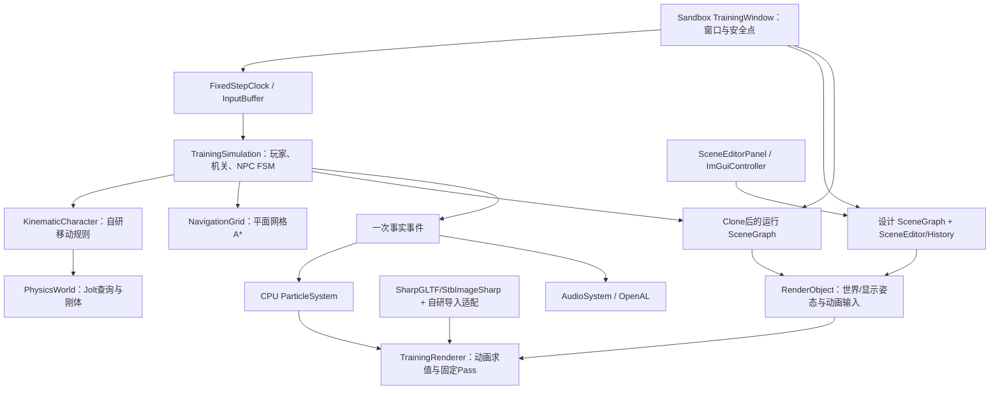

# G104Engine 实际架构与长期边界

更新：2026-10-03。基础综合训练场 V1 已通过正式弹窗获准实施，Engine/Sandbox 的正式模块主体、GLSL、场景数据、素材部署和设计工具已落地。本页记录当前结构与已确认的长期约定；逐文件数据流见 [V1 架构与学习指南](guides/v1-architecture-and-learning.md)，实际进展及验证日志见 [执行台账](execution/v1-progress.md)。

当前证据：Debug x64 `--no-restore` 构建 0 警告、0 错误，完整 `--verify` 的 Core、导航、Jolt 物理/角色、Gameplay、动画、默认场景和 WAV 检查通过；`--verify-audio` 的真实 OpenAL 上下文、2D/3D source、暂停/恢复及清理通过。本机自动图形 exercise 已运行 240 帧，Forward/Deferred、Play/Stop、保存重载和有限 resize 路径完成且无 GL 错误。**自动检查通过不等于最终画面、声音听感或用户手感已验收**；阴影、蒙皮、粒子、调试视图和交互体验仍须视觉/用户验收，详细边界见指南。

原最小 3D 工作已并入 V1，不再作为独立版本或审批目标。当前实施依据为 [完整实施方案](plans/v1-implementation-draft.md) 与明确决定；文档中的历史“待开工”“只获文档授权”不能覆盖 2026-10-03 的正式批准。长期所有模块仍需不同深度的工程实践，IBL、移动平台/推箱、网络、动态 GI、GPU 几何等后移能力未因 V1 收敛而取消。

## 1. 状态、设计目的与项目分工

| 状态 | 含义 |
| --- | --- |
| 用户已确认方向 | 基础结构和范围由明确选择确定；重大改变需要说明原因与影响 |
| 已有代码 | 可以定位实际类、方法和数据消费者，不由图或计划推断 |
| 行为验证通过 | 仅指明确入口、环境和样例得到的结果；CPU、原生、GL、听感分别记录 |
| 待用户验收 | 用户尚未实际操作、观察或确认的体验，不由助手自检替代 |
| 后续专题 | 有学习与实践目标，但当前没有该能力的实现成果 |

项目用第三人称非战斗训练场串联输入、控制器、动画、渲染、机关、NPC 与工具，同时保留独立行为检查。短期 Gameplay/客户端求职方向影响顺序，不取消渲染、物理、动画、Gameplay、AI、工具链、资产、粒子、声音、网络和现代引擎架构的学习深度；旧 2–4 周预算不是整个项目期限。

| 项目 | 当前实际职责 | 依赖边界 |
| --- | --- | --- |
| [G104.Engine](../src/G104.Engine/G104.Engine.csproj) | Core、Scene、Editor、Assets、Animation、Physics、Navigation、Rendering、Effects、Audio、Tools 通用能力 | 不依赖 Sandbox，不持有训练场专属按钮/目标流程 |
| [G104.Sandbox](../samples/G104.Sandbox/G104.Sandbox.csproj) | 启动选项、窗口/安全点组装、训练场 C# Gameplay、NPC FSM、设计面板和演示验证 | 使用 Engine；示例布局与演示控制在此项目 |

不为架构图的每个方框建立独立程序集。当前对象由 GUID 和有限组件式设计字段组织，系统在明确阶段消费；没有完整数据导向 ECS、通用组件注册/反射框架、异步资产流或自研 Job System。所用库的工作线程也不等于引擎已有通用任务图。

这是实际职责图，GL 和声音效果仍按各自验证层级评估。通用架构实验与后续拆分见 [核心路线](plans/core-architecture-roadmap.md)。

## 2. 数据身份与写入者

| 数据 | 当前负责者 | 消费者与限制 |
| --- | --- | --- |
| 设计 `SceneDocument` | `SceneEditor` 命令、`EditorHistory`、`SceneSerializer` | 保存 JSON、编辑预览和 Play 克隆；运行状态不能直接写回 |
| 对象持久身份 | 非空唯一 GUID；可空 ParentId/TargetId | 创建/删除撤销恢复原身份；资产不使用运行句柄作身份 |
| 输入按住态/边沿 | `InputBuffer` | Move/Sprint 持续；Jump/Interact 只在一次有效模拟步消费 |
| 水平移动参考 | 窗口每显示帧单次消费鼠标 Look 后确定 yaw | 多个补步使用相同参考；相机俯仰不产生玩家竖直移动 |
| 角色逻辑 feet/速度/接地 | `KinematicCharacter` 与 `TrainingSimulation.SubmitCharacter` | 碰撞、Gameplay、动画输入读取；动画和相机不覆盖角色位移 |
| 机关状态 | `TrainingSimulation.Interact/CheckGoal` | 先校验距离/视线/关闭占用，再提交门画面、碰撞和导航事实 |
| NPC 决策与任务 | `TrainingSimulation` FSM、`NavigationGrid` 路径 | 下一步移动意图由角色执行，区分到达/受阻/无路；与动画 FSM 分离 |
| 逻辑/显示矩阵 | `SceneGraph` 当前/前一步局部 TRS | 逻辑世界给物理；显示世界用统一 alpha，不反写逻辑 |
| 节点姿态/palette | `AnimationController`、`GltfModel` | 模型内部树独立于设计场景树；in-place 不抽取 root motion |
| 一次事实事件 | 每个 `TrainingSimulation.Tick` 生成并在当步消费 | 音效和粒子使用同一事实；Render 不重发事件 |

V1 不是把全部 Runtime 内存序列化的运行存档。GPU、Jolt、音频句柄与动画游标不进入设计 JSON；具体数据/API见 [场景与编辑指南](guides/scene-and-editor.md)。

## 3. 时间步、输入与安全点

主线程使用 OpenTK 窗口回调组装更新与图形提交。`FixedStepClock` 默认 `1/60` 秒，每显示帧最多五补步、输入时间上限 0.25 秒；多余完整积压步丢弃并保留不足一步余量，记录丢步/丢时。固定的是模拟时间步，不是窗口回调频率，也不承诺网络或回放确定性。

`TrainingWindow.OnUpdateFrame` 开始 ImGui 帧，收集工具请求并在 `ProcessCommands` 安全点应用；随后收集受 UI 捕获/焦点约束的输入。每个有效固定步先 `CapturePrevious`，再运行 Gameplay/角色/必要物理，消费一次事实并推进粒子/动画；最后按 alpha 生成显示对象、相机和调试数据。`OnRenderFrame` 执行图形 Pass 和 UI，绘制不推进 Gameplay/动画事件。完整顺序图见 [V1 指南](guides/v1-architecture-and-learning.md#实际帧流程)。

零步帧保留 Jump/Interact 边沿，多步帧不会重复；鼠标 Look 每显示帧消费一次。失焦、最小化、主动暂停、加载与 Play/Stop 清理时间/输入及相应姿态历史，恢复时丢弃旧 delta，避免补算停顿。UI/编辑安全点不依赖是否发生模拟步，零 framebuffer 尺寸跳过绘制。

初版性能显示为平滑 FPS/帧间隔，DrawCalls/Triangles 是多 Pass 统计；没有可靠的 CPU 分阶段/GPU 时间比较。未来布局、小型 ECS、.NET 并行库和有限自研调度实验必须同时核对数据所有权、线程归属、任务完成和资源释放，不把 `Task`、异步日志或 Jolt worker 直接称作引擎 Job System。

## 4. 坐标、矩阵与控制器边界

| 边界 | 实际约定 |
| --- | --- |
| 世界 | Y-up、右手、米/秒；局部前 -Z、右 +X |
| OpenTK CPU | 行向量，局部 S×R×T；`world=local×parentWorld` |
| GLSL | 列向量，`P×V×M×position`；OpenTK 原始行字节按 `transpose=false` 上传，GPU 数学矩阵相当于 CPU 转置 |
| glTF 蒙皮 | `palette=inverseBind×jointWorld×inverse(meshWorld)`；`drawModel=meshWorld×instanceCorrection×sceneWorld` |
| Jolt 形状查询 | 当前绑定版本在 `ToJolt` 内转置；`PhysicsWorld.QueryTransform` 将 Numerics 行 TRS 预转置一次，集中适配该公开边界 |

不能把内存行/列布局等同于向量乘法约定，也不能把 GLSL 上传策略套到 Jolt 包装层。Jolt Body 的位置/四元数参数不经过查询矩阵路径。该差异曾由原生扫掠/穿透结果异常暴露，修复后行为检查通过；推导和固定版本源码见 [物理指南](guides/physics-and-gameplay.md#固定jolt版本与矩阵边界)、[渲染动画指南](guides/rendering-and-animation.md#空间矩阵与蒙皮) 与 [参考核查](reviews/design-reference-checks-2026-10-03.md)。

受控场景树使用 LocalTRS、禁止环/无效父/外部缺失引用。所有接收可编辑子对象的节点要求正统一缩放；玩家/NPC 保持根和单位缩放。重挂接保持世界姿态后必须重组验证 TRS，不静默丢失剪切。活动相机由窗口单独管理，动态箱由物理验收创建；目前 DTO 没有可任意挂接的活动相机或动态刚体组件。

角色规则自研：有限穿透恢复、扫掠/迭代墙滑、接地、跳跃/撞顶、有限坡度和台阶；Jolt 提供精确查询与刚体，未用其完整角色控制器取代规则。角色 feet 与查询胶囊中心不同，Collider.Center/Size 经世界矩阵和尺度只应用一次。移动平台携带、推箱、角色互推、任意复杂网格和挤压恢复未实现。相机按显示玩家姿态跟随并用物理 raycast 限制遮挡距离，实际观感待用户。

## 5. 资产、表现与资源所有权

| 所有者 | 当前资源与寿命 |
| --- | --- |
| `TrainingWindow` | 设计编辑器、可选运行实例、时钟/输入、渲染器、UI、音频与 CPU 粒子；外层 finally 在窗口上下文有效时清理 |
| `TrainingRenderer` | 通用程序/primitive/天空/目标、共享模型和贴图缓存、按对象 GUID 的动画实例、128 矩阵 palette UBO |
| `PhysicsWorld` | 独立 Jolt System、Body/Shape、查询胶囊、过滤器和 JobSystem；Foundation 按活动世界计数 |
| `AudioSystem` | 窗口作用域 device/context、共享 WAV Buffer 和独立 Voice；Stop/重置清 Voice，退出再清 Buffer/context/device |
| `SceneGraph/EditorHistory` | 设计/运行 DTO、矩阵缓存和有限设计快照；没有后端句柄所有权 |

共享模型/纹理避免一个实例被删就破坏其他实例。当前渲染器按活动引用清离场模型/动画和无用贴图；`ResetScene` 明确清场景资产，通用 primitive/程序等保留至渲染器释放。`Prepare` 预加载候选资源，失败清本次新增项并保留已有缓存；Resize 完整创建新目标后才替换旧目标。它不是后台无卡顿加载或进程级无限缓存。

glTF 读取集成 SharpGLTF，PNG/JPEG 解码集成 StbImageSharp；模型空间、有限格式检查、采样/状态、GPU 蒙皮和 Pass 组织自研。实际角色 67 节点/65 关节/43 clips，角色 +Z 前向在实例边界适配为 -Z，保留模型根固定旋转；独立材质探针补 PNG/法线贴图导入。支持子集与明确拒绝项见 [渲染动画指南](guides/rendering-and-animation.md)。

固定渲染链已有代码：方向光阴影 → Forward 或 G-buffer/Deferred 光照 → 天空/透明 CPU Billboard → 曝光/Reinhard/Gamma → FXAA → UI。G-buffer 为 RGBA8 线性基础色/金属度、RGBA16F 世界法线/粗糙度、D24 深度；HDR 为 RGBA16F。光照为一盏方向光与最多四点光；方向光单张 2048 阴影及 3×3 PCF，天空只作背景，弱环境项不能称作 IBL。性能优劣和最终视觉一致性仍待实际评估。

音频使用既有 OpenTK OpenAL 与部署的 OpenAL Soft，运行时只读约定 PCM16 mono/stereo WAV；素材由已授权便携 FFmpeg 离线转换。3D 点声源要求 mono，Listener 跟随相机。当前 32 Voice 上限与 CPU 粒子 512 容量是实际有限预算，不能称为传播/混响/AI 听觉或 GPU 粒子系统。

## 6. 场景准备、编辑和 Play/Stop

Play 从当前内存设计深复制候选 `SceneGraph`，创建独立 `TrainingSimulation/PhysicsWorld` 并准备渲染资源；全部成功后才发布运行实例。失败释放候选物理/新增渲染资源，设计、历史和旧活动状态保留。Stop 先准备保留设计的预览，成功后停止 Voice、清粒子并释放运行物理，再恢复设计和插值。加载新设计也先校验/准备，再替换编辑器并清旧历史。

编辑命令通过 `EditorHistory.PrepareChange` 在历史提交前校验资产并准备渲染；失败恢复设计字段且不新增 Undo 条目。当前编辑态没有独立模拟物理世界；Play 根据编辑后的世界变换创建碰撞。设计静态组改动的世界矩阵和下一次 Play 碰撞由同一描述产生，不宣称运行中可移动父组驱动物理平台。

初始场景从输出 `assets/scenes/training-ground.json` 读取，用户设计默认保存至 LocalApplicationData/G104Engine/TrainingGroundV1/Scenes。保存使用同目录临时文件、刷新和原子替换；损坏保存文件启动时报告并保留，回退初始设计；用户选择再次 Save 时先备份被拒原件。运行验证使用隔离 `--user-data-root`，`--exercise` 强制要求此选项，不覆盖真实设计。

Undo/Redo 最多 100 条，稳定 GUID/DTO、子树事务、外部 TargetId 引用删除拒绝、拖动合并/Escape 取消、新编辑清 Redo、dirty 与成功保存状态分别实现。单层模板保存完整有效字段与白名单覆盖，不支持嵌套、变体或 Apply/Revert。运行面板只读，有限设计字段使用命令，不复制后端句柄实现 Play/Stop。

## 7. 固定参考、学习与后续专题

每个知识点仍维护：**实际代码入口 → 原笔记大章 → 固定参考 → 自研/第三方与简化 → 验证证据及限制**。十份笔记与完整分模块入口见 [learning-map](learning-map.md)；本次没有改原笔记或批量添加锚点。代码注释解释职责、空间、时间和寿命，不逐行翻译。

Piccolo 固定参考为 [f5053707fed4d3f94d270a436fb0d3a8ae54e3e5](https://github.com/BoomingTech/Piccolo/tree/f5053707fed4d3f94d270a436fb0d3a8ae54e3e5)。借鉴对象组件、数据交换、资源分层和局部算法，不照搬 Vulkan 投影/矩阵、组件遍历时序或空清理路径。其固定物理参数不证明有本项目累计器，首 Clip/固定权重不证明完整混合，目标重叠检查不证明扫掠墙滑，模式重载不证明保留未保存设计的 Play/Stop。所查 Piccolo 不覆盖完整音频、NPC FSM/A*、网络、Lumen 或 Nanite；不能把课程目标写成参考引擎全部实现。

| 后续实践 | 与当前基线的关系 | 仍需完成的学习/工程内容 |
| --- | --- | --- |
| 渲染扩展 | 保留 Forward/Deferred/PBR 基线 | IBL、地形、天空/云、AO/雾、可见性/性能等各类代表实验；按证据选择接入 |
| 动画扩展 | 保留采样/混合/跳跃 in-place | IK、Mask/Additive、重定向、Root Motion、表示/压缩与性能 |
| 物理扩展 | 保留查询自研角色与刚体后端 | 平台/推箱、布娃娃、PBD/XPBD、破坏、车辆等分别实验 |
| AI/脚本/工具 | 保留 C# FSM/A* 和有限编辑 | BT 对比、NavMesh、高级规划、Lua/可视化脚本、反射/生产工具与详细性能观察 |
| 粒子/声音 | 保留 CPU 粒子与有限声音管理 | GPU Compute 对比、预算/排序/碰撞；遮挡/混响/传播等独立机制 |
| 核心架构 | 保留明确主线程阶段 | AoS/SoA、小 ECS、.NET 并行库到有限自研调度；Fiber/无锁不能由 async 代替 |
| 网络 | 新增多份世界与裁决 | 传输/复制、预测/校正、远端插值、延迟/丢包实验；尚未选择后端/模型 |
| 动态 GI | 增加间接光/历史信息 | 简化机制实验及质量/成本/失效比较，具体方法未定，不承诺复刻 Lumen |
| GPU 几何 | 改变裁剪/LOD/提交与驻留 | CPU/GPU 筛选、LOD/精度、资产表示/流式对比，具体方法未定，不承诺复刻 Nanite |

专题先在稳定基线明确机制和验收，再按需要调整架构；即时开关或重置对照按状态/资产差异决定，不要求永久维护多套完整引擎。网络/GI/GPU 几何尚未开始，D5 独立克隆、CI、第二设备仍由用户明确暂缓。本地实现、Git 提交和远程同步是不同状态，当前任务没有自动提交/发布授权。

## 配置与显示收尾索引

有限四状态动画定义已在assets/config/character-animation.json落实，实际非默认行为经AnimationVerification验证；上一/当前局部Pose的显示插值与SceneGraph共用alpha，mesh/palette/skeleton一致，显示不推进逻辑或事件。暂停/恢复仅ResetDisplayHistory，场景成功切换ResetAnimations。Debug/Release最终--verify及delivery图形回归通过，详细结果与用户待验收项见实施复查/执行台账；声音听感和真实操控不由自动日志代替。
