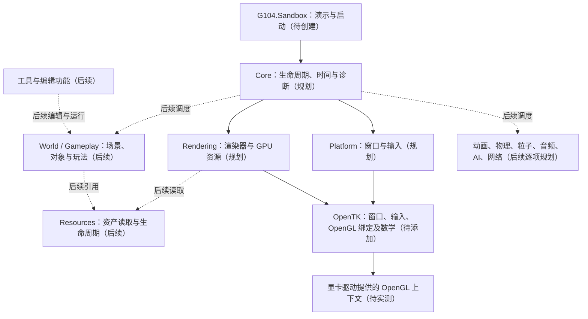
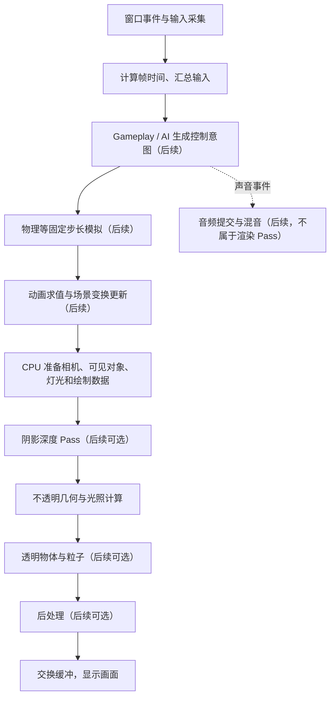

# 历史架构草案：已撤回为非执行依据

归档日期：2026-10-01。本文件仅保存此前架构草案，不是已确认设计、实现约束或验收标准。

用户已明确：当前仅搭建开发基础，具体软件实现架构与细节在后续阶段讨论。当前有效入口是 [architecture.md](../architecture.md) 和 [decisions.md](../decisions.md#legacy-0002)。

下面以文本代码块完整保留原文，原文中的相对链接和图示仅属于历史文本，不作为当前导航或设计依据。

原文件 SHA256：4FF2272565EF22689B04845749D9FDDF265DEF0D976F482ED4757F0D932C22C2

````markdown
# G104Engine 架构与运行流程

最后更新：2026-10-01。当前状态：**仅建立目录和文档，解决方案、项目、代码和渲染能力均未创建或验证。** 本文所有工程图均为规划，不代表已实现功能。

## 1. 工程边界

目标是使用 C# 编写独立运行的小型 3D 引擎，运行时不依赖 Unity。Piccolo 用于学习职责划分、算法和数据流；不逐行翻译其 C++，也不把其 Vulkan 实现直接当成 OpenGL 实现。

当前技术基线为 Windows x64、.NET 10、VS2026、OpenGL 4.3 Core、OpenTK 4.9.4。环境安装、解决方案与项目创建、NuGet 操作由用户通过界面完成；助手维护文档并在用户完成后验证。操作步骤见 [环境与操作指南](setup.md)，整体边界见 [计划](plan.md)。

计划先采用两个项目：

| 项目 | 类型与职责 | 依赖方向 | 当前状态 |
|---|---|---|---|
| `G104.Engine` | 类库；承载引擎运行、平台接口及后续各系统 | 依赖所需的 .NET 与 OpenTK 组件 | 待用户创建 |
| `G104.Sandbox` | 控制台启动程序；配置并运行演示，输出诊断信息 | 引用 `G104.Engine` | 待用户创建 |

Sandbox 中的演示规则不反向成为 Engine 的依赖。先以类库内的职责分区组织代码；当真实需求出现时再拆分程序集，不预先建立大量空项目。

## 2. 模块依赖规划

箭头表示“依赖或调用”，不是每帧执行顺序。所有节点均未实现，长期模块不属于当前基础搭建交付。



OpenTK 提供调用接口和基础工具。着色器、材质、网格、渲染 Pass 的数据与顺序仍需本工程实现；添加 NuGet 包不等于已经实现渲染系统。

长期模块只是学习与扩展方向。物理、音频等模块采用自研算法还是第三方集成，在各自进入实施阶段时记录决定及取舍。不得把尚未选择的库写成必需依赖。

## 3. 一帧如何产生画面：未来数据流

下面用于把笔记中的系统连接起来，**不是当前程序已经存在的调用链，也不是首版必须同时实现的清单**。基础阶段仅验证环境与启动链路，具体绘制在下一阶段开始。



这一图对应渲染笔记的“15.7 串联渲染流程”。前向渲染通常在绘制几何时计算光照；延迟渲染先输出几何信息再执行光照阶段，两者不能机械地套用相同 Pass 划分。后续选定实际管线时，补充资源输入、输出及真实调用顺序。

固定步长模拟与渲染帧率的关系、动画与物理的具体先后次序，都须随功能设计和验证确定。图中没有表示线程分配；不代表一帧执行一次物理更新，也不承诺一开始就建立多线程任务系统。

OpenGL 4.3 为未来计算着色器和 SSBO 实验留出能力。GPU 粒子、GPU 裁剪等进入独立任务后再实现与验证，不能仅依据版本号标记“已支持这些功能”。

## 4. 实现时必须写清楚的约定

以下约束在引入相应代码时补齐具体值、调用入口和验证记录：

- **坐标与数学：** 左右手系、世界单位、角度单位、矩阵布局和乘法顺序、CPU 到 GLSL 的数据传递方式。
- **资源归属：** 谁创建、谁持有、谁释放窗口、着色器、缓冲区和纹理；不要把托管垃圾回收等同于 GPU 资源按时释放。
- **线程与时间：** 图形上下文在哪个线程使用、关闭时如何释放；帧时间和模拟时间如何传递。
- **依赖边界：** 平台层负责输入采集，玩法层解释操作意义；资源系统管理资产，渲染器管理对应的 GPU 表示。
- **错误诊断：** 环境验证阶段记录实际 GPU 与上下文版本；后续着色器编译、链接和资源加载失败应给出可定位的信息。

上述内容写在代码中必要的简短注释以及相关设计记录中。源码注释解释原因和约束，长篇理论通过 [学习映射](learning-map.md) 导航到笔记。

## 5. 图表维护规则

每次新增模块或改变调用关系，由助手在同一任务中更新本文件与学习映射：把实际存在的代码标为“已实现”并给出入口，保留未实现内容的规划标记。项目创建后先补实际项目引用图；第一条帧循环存在后再补实际时序，不用规划图冒充运行证据。

目前可核对的证据仅为本文件和相关文档；构建、窗口、GPU、帧流程均为待验证，真实结果统一记入 [当前进度](status.md)。
````
