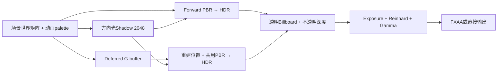

# V1 渲染、glTF 导入与动画实现

更新：2026-10-03。本文描述实际代码和采用的简化；构建、CPU自检、GPU运行和用户视觉验收是不同证据。最终验证结果统一见执行台账，不从源码存在推断画面已经通过。

## 代码入口与职责

| 入口 | 实际职责 |
| --- | --- |
| `src/G104.Engine/Assets/AssetRoot.cs` | 约束资产根目录与相对路径，拒绝逃逸和链接目录 |
| `src/G104.Engine/Assets/GltfModelLoader.cs` | 集成 SharpGLTF.Core 1.0.7，转为本引擎CPU模型、材质、节点、skin与关键帧 |
| `src/G104.Engine/Assets/GltfModel.cs` | 默认局部姿态、节点世界求值、模型空间边界与mesh局部palette |
| `src/G104.Engine/Animation/AnimationController.cs` | 自研STEP/LINEAR采样、短弧、步态混合、跳跃过渡与事件 |
| `src/G104.Engine/Animation/AnimationSettings.cs`、`assets/config/character-animation.json` | schema=1有限状态配置、clip映射/速度/时间/事件标记，校验后的共享只读定义 |
| `src/G104.Engine/Animation/AnimationVerification.cs` | 无GL上下文的真实素材和独立空间/采样样例检查 |
| `src/G104.Engine/Rendering/GpuResources.cs` | GL程序/网格/贴图/帧缓冲的确定性资源所有权 |
| `src/G104.Engine/Rendering/PrimitiveMeshes.cs` | 自有cube、plane、sphere几何与切线 |
| `src/G104.Engine/Rendering/TrainingRenderer.cs` | 固定Forward/Deferred Pass、阴影、天空、透明粒子与后处理 |
| `assets/shaders/` | GLSL 4.30；共享mesh顶点、PBR函数和材质读取 |

OpenTK 4.9.4负责OpenGL调用；StbImageSharp 2.30.16负责PNG/JPEG解码。格式读取使用第三方库，空间约定、采样/状态、蒙皮上传与Pass组织由本项目实现。

## 空间、矩阵与蒙皮

世界采用Y-up、右手、米和秒。CPU矩阵用行向量，局部TRS为`S * R * T`，节点世界为`local * parentWorld`。OpenTK的Matrix4行字节通过`UniformMatrix4(..., false, ref matrix)`或UBO上传；GLSL按列主序读取这些字节，相当于读取CPU矩阵的转置，因此shader使用`P * V * M * position`。上传时再次转置会破坏这个对应关系。

每个mesh节点分别建立：

```text
palette[j] = inverseBind[j] * displayJointWorld[j] * inverse(displayMeshWorld)
drawModel  = displayMeshWorld * instanceCorrection * interpolatedSceneObjectWorld
```

shader先在mesh局部空间加权蒙皮，再由drawModel进入世界；mesh节点的变换只应用一次。法线使用组合变换的逆转置，切线按几何变换后重新正交化，并保留切线手性。刚性mesh或整个实例的镜像由最终drawModel行列式切换CW/CCW，结束恢复CCW；蒙皮内部节点及其祖先的零/负缩放、对应动画的零/负缩放明确不支持，避免逐关节反射或插值穿零造成不可定义的法线/面朝向。容量为128个mat4的std140 UBO（8192字节），完整支持当前65关节，不截断到64。

角色场景对象的位置是脚底。导入默认姿态的完整蒙皮边界用于脚底对齐和1.9m体高缩放；Player/Npc实例在边界处加180° Y旋转，将素材+Z前向适配为引擎-Z。素材内部根节点约-90° X固定旋转保留，不能用删除根旋转来补前向。普通静态模型不自动加角色修正。cube范围[-0.5,0.5]，plane在y=0。

## 实际导入子集

支持未压缩glTF 2.0/GLB、默认场景三角形、POSITION/NORMAL、UV0/TANGENT、JOINTS_0/WEIGHTS_0、节点层级/TRS、基础金属度粗糙度材质、OPAQUE/MASK、double-sided、PNG/JPEG以及纹理Wrap/Min/Mag采样参数。缺少切线而存在UV时生成切线，退化UV采用正交回退。颜色纹理是sRGB格式，法线和金属粗糙度纹理是线性格式；金属读B、粗糙度读G。图像不额外翻转Y。

外部buffer/image URI可使用glTF标准的`../`相对路径，但最终路径必须留在资产根目录内。场景对象的模型路径本身仍服从场景资产路径规则。远程URI、根目录逃逸、链接路径、非2.0、非三角形、morph、扩展/压缩、其他顶点属性、材质实际引用UV1/纹理变换、Alpha BLEND、Occlusion/Emissive输入和CUBICSPLINE等显式报错，不静默改变解释方式。未被材质引用的额外UV集不参与当前绘制，允许存在；实际角色含此类TEXCOORD_1。每顶点最多4个影响，权重归一化；零权重槽也清为有效骨骼索引。

当前角色素材为`models/UAL1_Standard.glb`，实际67节点、65关节、43个LINEAR clip，无图片。自有`models/material-probe.glb`使用`../tests/checker.png`和`../tests/normal.png`补足贴图导入证据。

模型的设计BaseColor是乘在glTF baseColorFactor上的**实例tint**，保留同一模型内不同子材质颜色。模型M/R使用导入因素，当前DTO没有显式覆盖字段；普通primitive的设计BaseColor/Metallic/Roughness直接生效。设计BaseColorTexture/NormalTexture可替换对应模型贴图。没有把模型的默认M/R值误判成用户已选择覆盖。

## Pass与颜色处理



方向光使用单张2048² D24 Shadow Map、3×3 PCF与有限坡度偏移；没有点光阴影或级联。Caster的PolygonOffset采用factor=3、units=2：±1 texel双轴邻域加Nearest半texel残差，斜面接收深度与邻居采样中心的差可达3倍最大坡度，原factor=1.5在无遮挡材质图中产生重复的小三角自阴影。Receiver还保留有限角度偏移；偏移过大会使接触阴影脱离，画面需同时复查，不以增大bias代替无限精度。光照含一盏方向光和最多4盏点光，点光依据设计radius/intensity作距离衰减。PBR采用GGX分布、Schlick Fresnel和Smith近似；固定弱环境项用于避免完全黑暗，天空cubemap只作背景，不称为IBL。

G-buffer attachment0是**RGBA8线性基础色/金属度**，attachment1是**RGBA16F世界法线/粗糙度**，深度是D24纹理。Deferred由深度与逆ViewProjection重建世界位置，调用与Forward同一PBR/阴影函数。HDR颜色为RGBA16F；HDR使用独立D24 renderbuffer并从G-buffer blit深度，避免Deferred读取深度纹理时该纹理同时参与输出。CPU粒子按相机距离从后向前排序，深度测试开启、深度写入关闭，两条管线使用相同不透明深度。

HDR经过曝光、Reinhard和一次Gamma进入RGBA8 LDR，再作FXAA。LDR输入采用双线性过滤支持FXAA亚像素采样；G-buffer/深度保持Nearest，避免在重建位置时跨物体混合。默认帧缓冲的自动sRGB转换关闭；FXAA不再次Gamma。G-buffer/深度/阴影调试视图在后处理入口输出，调试视图跳过FXAA。Depth视图用`1 - pow(rawDepth, 50)`强调近处差异，并非线性距离单位。

阴影固定80m正交范围跟随相机目标平面，有限训练场起步使用；范围外不产生阴影。粒子最多绘制8192个，是V1上限，不是无限GPU粒子系统。DrawCalls/Triangles包含所有Pass和全屏三角形，不能等同于唯一场景几何数量或GPU时间。

## 动画求值与事件

动画有三层不同的插值。Clip采样根据逻辑游标在关键帧之间求TRS；状态/速度混合组合不同clip得到逻辑Pose；显示插值则在相邻固定逻辑步的previous/current局部Pose之间按与SceneGraph相同的alpha求TRS，再计算模型节点世界矩阵。不能把逻辑当前骨骼直接搭配身体的插值世界位置，也不直接Lerp最终世界骨骼矩阵，后者会缩短骨链并产生剪切。

AnimationController的Pose/World保持当前逻辑步，Update前复制上一逻辑局部Pose；GetDisplayWorld(alpha)用独立数组求显示层级，alpha0/1对应旧/当前，重复调用不推进FSM、clip时间或事件。Renderer的meshWorld、palette以及SkeletonDebug全部使用同一显示world和RenderObject.InterpolationAlpha，Shadow/G-buffer/Forward三条Pass一致。同一姿态版本/alpha缓存求值，避免多个Pass重复计算。

SharpGLTF提供关键帧，运行时不调用其现成曲线采样器。自研采样先复制所有节点默认TRS，再对clip中的channel覆写，避免未动画节点丢失根变换。二分查找关键帧；STEP在精确关键帧取当前帧，LINEAR对位置/缩放插值，对四元数走最短弧并归一化。

Idle/Walk/Run依据平滑速度混合；Walk/Run使用同步步态相位，Idle独立推进时间。默认Run映射`Jog_Fwd_Loop`，没有不存在的Run_Loop，但配置可改映射至`Sprint_Loop`等实际同骨架动作。Grounded→非接地且VerticalVelocity大于配置minJumpVelocity时进入JumpStart并发Jump；向下或低于阈值离地直接进入JumpLoop并发Fall，走下坡台不会伪装主动起跳。JumpStart按配置时长切JumpLoop；真正重新接地进入JumpLand并发Land，按配置落地时长回Locomotion。默认姿态过渡0.12s，起跳/落地clip压缩至0.18/0.22s以适应物理跳跃；clip时长不决定物理高度或世界位移。该节奏需实际视觉验收，脚滑/动作观感不能由CPU自检证明。

Footstep按配置marker跨越触发，默认相位0.15/0.65；跨循环处理次数，空marker列表禁用脚步事件。Jump/Fall/Land按事实边沿只发一次。每个事件有单调序列号，队列最多保留64项，调用Drain后清空。Update推进时间/事件，Render不推进动画；暂停或dt=0不产生事件。本渲染器的动画事件队列由表现使用者按需消费，不自动绑定声音或玩法系统，避免与外部事实事件重复播放。

### AN5有限数据配置与使用

配置文件为`assets/config/character-animation.json`，schemaVersion=1。它描述4个内置状态Locomotion、JumpStart、JumpLoop、JumpLand的有限映射与参数；状态条件由上面的已实现规则决定，不是任意脚本/通用节点图或拖拽编辑器。

| 字段 | 默认值与含义 |
| --- | --- |
| `clipMap.idle/walk/run` | Idle_Loop / Walk_Loop / Jog_Fwd_Loop；三路速度混合来源 |
| `clipMap.jumpStart/jumpLoop/jumpLand` | Jump_Start / Jump_Loop / Jump_Land；跳跃与落地来源 |
| `walkReferenceSpeed/runReferenceSpeed` | 2.2 / 4.8 m/s；混合阈值与步态参考速度，run必须大于walk |
| `speedResponse` | 12 s⁻¹；速度滤波系数`1-exp(-response*dt)` |
| `transitionSeconds` | 0.12s；状态切换的姿态混合时间 |
| `jumpStartSeconds/jumpLandSeconds` | 0.18 / 0.22s；状态停留及对应clip重定时 |
| `minJumpVelocity` | 0.1 m/s；离地时区分向上起跳与下落的严格大于阈值 |
| `footstepMarkers` | [0.15,0.65]；唯一有限相位[0,1)，最多32项，空列表禁用脚步 |

配置文件必须包含上述字段；未知/重复字段、未知schema、NaN/Infinity、非正的速度/响应/过渡/起落时间、非法marker或空clip名明确拒绝并报告文件/字段，不悄悄退回默认。minJumpVelocity允许0但不能负值。Player/Npc在Prepare和实例边界必须存在全部映射clip且有正时长/可用TRS轨道；同一缓存模型作为StaticMesh时保留bind pose，不被角色FSM约束，也不因角色0clips而免检。模型导入本身仍支持一般glTF子集，不要求所有静态模型携带角色动作。

TrainingRenderer启动时从assetRoot加载一次配置，所有角色引用同一AnimationSettings只读定义，markers防御复制后提供只读集合；每个AnimationController独有游标、平滑速度、Pose、过渡快照及事件队列。`new AnimationController(model, settings)`可直接用于无GL的CPU学习/测试；省略settings显式采用内存默认定义，实际图形入口不会因坏JSON而使用该默认。状态/实际映射clip名/状态时间/混合或过渡权重/步态相位仍由AnimationDebug显示。

修改工程内JSON后重新构建并重启应用，让既有assets复制规则将配置带到Debug/Release输出；只改输出目录会在之后构建时被工程源覆盖。当前没有运行中热重载；Play/Stop仅重置实例游标，使用启动时已验证的共享定义。可以将run改为Sprint_Loop、调整参考速度/时长与markers，观察相应采样、权重、状态耗时和事件变化，而非只保存无效字段。

## API、准备和生命周期

公开入口为`TrainingRenderer(assetRoot,width,height)`、`Prepare(objects)`、`Resize`、`UpdateAnimations`、`Render`、`ResetScene`、`ResetAnimations`、`ResetDisplayHistory`和幂等Dispose；额外提供Statistics、AnimationDebug、DrainAnimationEvents和SkeletonDebug。Prepare预加载候选模型与全部材质贴图，失败释放本次新增资源，保持原动画实例和原有缓存。调用者在全部场景准备成功后才提交候选，成功Play/Stop/Load提交后调用ResetAnimations，以同GUID重新建立FSM/clip时间/事件队列且保留已验证GPU资源；不要在成功Prepare后无条件ResetScene并删掉刚准备的资源。

暂停、失焦/恢复等清理固定时钟和SceneGraph姿态历史时，同时调用ResetDisplayHistory：各实例ResetInterpolation仅将current局部Pose复制到previous，避免恢复后的alpha0重新显示暂停前旧骨骼步，不重启FSM/游标/时间/事件。成功场景切换的ResetAnimations与这种显示历史重置目的不同。

每次UpdateAnimations依据当前对象引用卸载离场模型/动画实例；每次Render保留当前材质引用贴图。ResetScene用于明确丢弃全部场景模型/贴图和动画状态，共有primitive、Shader、天空和目标继续保留。窗口尺寸变化创建完整新目标后才替换旧目标；失败释放临时目标并保留旧目标，宽高为零跳过绘制并保留可恢复资源。

创建、上传、Resize、Render、Prepare及释放必须在有效当前GL上下文的创建线程调用。线程检查不能代替调用者维持当前上下文；不依赖GC/finalizer释放GPU。构造部分失败、Shader编译/链接失败和帧缓冲失败都有确定性清理路径；最后先Dispose渲染器，再关闭窗口上下文。

ShaderSource使用显式UTF8字节长度重载。真实GL初始化曾发现forward.frag展开源在尾部报EOF；核对[OpenTK 4.9.4 helper源码](https://github.com/opentk/opentk/blob/4.9.4/src/OpenTK.Graphics/OpenGL4/Helper.cs#L1387)发现单字符串重载使用UTF16字符数，而底层按UTF8编码，含中文注释时长度不一致（该展开源3821字符/3843字节）。代码已修正上传长度，保留中文注释；实际GPU修复通过情况以执行日志为准。

## 验证边界与参考

AnimationVerification检查真实角色骨骼/clip/米级高度、PNG/normal相对导入、LINEAR/STEP/短弧、独立非单位mesh空间例子、循环事件序列、跳跃/下落事实和65个有限palette矩阵；AN5检查实际JSON用于实例、非默认Run→Sprint的真实Pose/速度权重、独立响应系数/过渡/起落耗时、marker事件计数、共享定义但独立实例、防御复制以及错误配置/角色缺clip的拒绝。显示检查覆盖alpha0/1、中间局部TRS层级组合、区别世界矩阵/位置直接Lerp、重复显示不推进逻辑和事件、ResetInterpolation不丢失尚未消费事件。它不要求用户合法修改的JSON等于初始默认值；比较用已知内存默认和有效非默认定义，验证参数实际接线。需要图形窗口验证Shader编译、GL错误、Forward/Deferred一致性、阴影/调试视图、resize/最小化、蒙皮观感和粒子遮挡；用户的操作/视觉验收单独记录。

本机最终收尾验证：Debug/Release构建零警告零错误，`g104engine/.cache/execution/verify-debug.log`与`verify-release.log`记录七项动画检查全部PASS，包含AN5配置、Jump/Fall事实和局部Pose显示插值。最新`delivery-debug.log`/`delivery-release.log`记录RTX 5060 Ti/OpenGL 4.3、Forward/Deferred的Play/Stop、保存/重载/Undo/Redo、失败Play保留原预览/设计并清理部分准备资源、未保存设计及Undo历史跨Play/Stop保留；两个配置各240帧练习、2个跳跃事件、110个移动步以及未见GL错误。Release的120ms加载注入后下一raw帧138.91ms被丢弃、模拟步0，Debug相应145.74ms也被丢弃；真实Renderer还验证同一模型/GUID从character切为StaticMesh时，骨架端点与raw bind-node world一致，不误套1.9m/180°角色修正。这些是真实本机集成证据，不能替代用户手感验收。

同一帧冻结对象/骨骼/相机、分别绘制Forward/Deferred并读回RGB：最终平均绝对差异`0.0651/255`，最大`22/255`（delivery这次运行/场景/相机，已包含配置与显示插值收尾）。这验证两条实际管线的输出在本次条件下接近，RGBA8基础色、RGBA16F法线/粗糙度与D24重建允许量化差异；不声称完全像素一致，也不以该数据证明Deferred更快。

`g104engine/.cache/execution/captures-delivery-release/`保存最新Forward/Deferred/Jump/Landed/Normals/Shadow及材质对照截图；本轮复看material-probe/landed/normals，角色没有明显骨骼爆散，落地、粒子和对应阴影可见，世界法线地面+Y/背墙+Z一致；前轮腾空与阴影深度图也已检查。无遮挡`material-probe.png`清楚显示checker贴图；同相机`material-probe-no-shadow.png`移除阴影后小三角斑消失，确认原细斑来自阴影而非UV/网格接缝。PolygonOffset factor从1.5改为3后重复细斑明显减少，落地图鞋底附近阴影未见明显整块脱离；部分近看黄格仍有低对比斜面自阴影细斑，作为单张2048/3×3 PCF、有限bias与接触偏移取舍的当前限制保留，不称为工业阴影品质。自有probe的tangent.w已由素材生成端按UV/法线关系修为-1，shader完整消费手性；现有normal.png接近flat normal，这组截图本身不能证明复杂法线贴图的全部方向与滤波表现。

仍未取得FXAA开关与镜像对照的专项视觉截图；两者的评审修复已编译和进入真实GL运行，具体质量与手感/脚滑/最终观感仍由专项和用户验收分别确认。

glTF格式/蒙皮/插值依据[Khronos glTF 2.0规范](https://registry.khronos.org/glTF/specs/2.0/glTF-2.0.html)。课程对应渲染与动画章节见`docs/learning-map.md`；Piccolo学习参考固定提交`f5053707fed4d3f94d270a436fb0d3a8ae54e3e5`，本实现未照搬其render graph/资源布局，也未声明完成IBL、IK、重定向、根运动、GPU粒子或其他后续专题。
