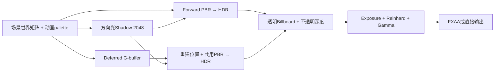

# V1 渲染、glTF 导入与动画实现

本页说明已采用的glTF子集、空间/蒙皮、固定渲染Pass、数值域、动画配置及生命周期。当前任务/验收查 [status.md](../status.md)，操作政策查 [agent-workflow.md](../agent-workflow.md)。公式修正理由就地保留，长历史日志在页末折叠为可选证据；本轮文档改造不构建或运行。

## 代码入口与职责

| 入口 | 实际职责 |
| --- | --- |
| `src/G104.Engine/Assets/AssetRoot.cs` | 约束资产根目录与相对路径，拒绝逃逸和链接目录 |
| `src/G104.Engine/Assets/GltfModelLoader.cs` | 集成 SharpGLTF.Core 1.0.7，转为本引擎CPU模型、材质、节点、skin与关键帧 |
| `src/G104.Engine/Assets/GltfModel.cs` | 默认局部姿态、节点世界求值、模型空间边界与mesh局部palette |
| `src/G104.Engine/Animation/AnimationController.cs` | 自研STEP/LINEAR采样、短弧、步态混合、跳跃过渡与事件 |
| `src/G104.Engine/Animation/AnimationSettings.cs`、`assets/config/character-animation.json` | schema=1有限状态配置、clip映射/速度/时间/事件标记，校验后的共享只读定义 |
| `src/G104.Engine/Animation/AnimationVerification.cs` | 无GL上下文的真实素材和独立空间/采样样例检查 |
| `src/G104.Engine/Rendering/GpuResources.cs` | GL程序/网格/贴图/帧缓冲的确定性资源所有权 |
| `src/G104.Engine/Rendering/PrimitiveMeshes.cs` | 自有cube、plane、sphere几何与切线 |
| `src/G104.Engine/Rendering/TrainingRenderer.cs` | 固定Forward/Deferred Pass、阴影、天空、透明粒子与后处理 |
| `src/G104.Engine/Rendering/RenderingVerification.cs` | 当前GL上下文中的独立BRDF/HDR/source-over像素参考、失败Prepare和共享mesh引用回归 |
| `assets/shaders/` | GLSL 4.30；共享mesh顶点、PBR函数和材质读取 |

OpenTK 4.9.4负责OpenGL调用；StbImageSharp 2.30.16负责PNG/JPEG解码。格式读取使用第三方库，空间约定、采样/状态、蒙皮上传与Pass组织由本项目实现。

<a id="skinning-space"></a>
## 空间、矩阵与蒙皮

世界采用Y-up、右手、米和秒。CPU矩阵用行向量，局部TRS为`S * R * T`，节点世界为`local * parentWorld`。OpenTK的Matrix4行字节通过`UniformMatrix4(..., false, ref matrix)`或UBO上传；GLSL按列主序读取这些字节，相当于读取CPU矩阵的转置，因此shader使用`P * V * M * position`。上传时再次转置会破坏这个对应关系。

每个mesh节点分别建立：

```text
palette[j] = inverseBind[j] * displayJointWorld[j] * inverse(displayMeshWorld)
drawModel  = displayMeshWorld * instanceCorrection * interpolatedSceneObjectWorld
```

shader先在mesh局部空间加权蒙皮，再由drawModel进入世界；mesh节点的变换只应用一次。法线使用组合变换的逆转置，切线按几何变换后重新正交化，并保留切线手性。刚性mesh或整个实例的镜像由最终drawModel行列式切换CW/CCW，结束恢复CCW；蒙皮内部节点及其祖先的零/负缩放、对应动画的零/负缩放明确不支持，避免逐关节反射或插值穿零造成不可定义的法线/面朝向。容量为128个mat4的std140 UBO（8192字节），完整支持当前65关节，不截断到64。

角色场景对象的位置是脚底。导入默认姿态的完整蒙皮边界用于脚底对齐和1.9m体高缩放；Player/Npc实例在边界处加180° Y旋转，将素材+Z前向适配为引擎-Z。素材内部根节点约-90° X固定旋转保留，不能用删除根旋转来补前向。普通静态模型不自动加角色修正。cube范围[-0.5,0.5]，plane在y=0。

## 实际导入子集

支持未压缩glTF 2.0/GLB、默认场景三角形、POSITION/NORMAL、UV0/TANGENT、JOINTS_0/WEIGHTS_0、节点层级/TRS、基础金属度粗糙度材质、OPAQUE/MASK、double-sided、PNG/JPEG以及纹理Wrap/Min/Mag采样参数。缺少切线而存在UV时生成切线，退化UV或无UV时采用与法线正交的回退，避免固定+X切线遇到+X法线发生normalize(0)。无UV无切线的合法未贴图模型仍可绘制。颜色纹理是sRGB格式，法线和金属粗糙度纹理是线性格式；金属读B、粗糙度读G。图像不额外翻转Y。

外部buffer/image URI可使用glTF标准的`../`相对路径，但最终路径必须留在资产根目录内。场景对象的模型路径本身仍服从场景资产路径规则。远程URI、根目录逃逸、链接路径、非2.0、非三角形、morph、扩展/压缩、其他顶点属性、材质实际引用UV1/纹理变换、Alpha BLEND、Occlusion/Emissive输入和CUBICSPLINE等显式报错，不静默改变解释方式。未被材质引用的额外UV集不参与当前绘制，允许存在；实际角色含此类TEXCOORD_1。每顶点最多4个影响，权重归一化；零权重槽也清为有效骨骼索引。

是否蒙皮由引用mesh的`node.skin`决定；同一mesh可以被有skin和无skin的节点引用。无skin节点忽略未使用的JOINTS/WEIGHTS属性，按本节点变换刚性绘制；有skin节点仍严格验证必需属性、容量、权重与索引。[ISSUES.md](https://raw.githubusercontent.com/KhronosGroup/glTF-Validator/main/ISSUES.md)将`NODE_SKINNED_MESH_WITHOUT_SKIN`列为Warning，不能据此报告不存在的“0骨骼容量越界”。

当前角色素材为`models/UAL1_Standard.glb`，实际67节点、65关节、43个LINEAR clip，无图片。自有`models/material-probe.glb`使用`../tests/checker.png`和`../tests/normal.png`补足贴图导入证据。

模型的设计BaseColor是乘在glTF baseColorFactor上的**实例tint**，保留同一模型内不同子材质颜色。模型M/R使用导入因素，当前DTO没有显式覆盖字段；普通primitive的设计BaseColor/Metallic/Roughness直接生效。设计BaseColorTexture/NormalTexture可替换对应模型贴图。没有把模型的默认M/R值误判成用户已选择覆盖。

每个导入primitive保留原始`HasUv0`及mesh内primitive序号；顶点数组中填零的UV槽不能代表模型具备UV0。Prepare和实际绘制均根据**最终有效材质**检查UV0，包含设计BaseColor/Normal贴图覆盖与导入贴图。无UV模型后来添加贴图时明确拒绝，错误包含模型、节点、primitive和`TEXCOORD_0`；失败准备释放本次新增模型/贴图，保留旧预览、动画游标及未消费事件。设计/Undo历史的事务边界由Scene/Editor调用者负责。

<a id="render-passes"></a>
## Pass与颜色处理



方向光使用单张2048² D24 Shadow Map、3×3 PCF与有限坡度偏移；没有点光阴影或级联。Caster的PolygonOffset采用factor=3、units=2：±1 texel双轴邻域加Nearest半texel残差，斜面接收深度与邻居采样中心的差可达3倍最大坡度，原factor=1.5在无遮挡材质图中产生重复的小三角自阴影。Receiver还保留有限角度偏移；偏移过大会使接触阴影脱离，画面需同时复查，不以增大bias代替无限精度。光照含一盏方向光和最多4盏点光，点光依据设计radius/intensity作距离衰减。PBR采用GGX分布、Schlick Fresnel和Smith近似；固定弱环境项用于避免完全黑暗，天空cubemap只作背景，不称为IBL。

GGX采用`alpha=perceptualRoughness²`，粗糙度下限仍为0.045。分母用`|normal×half|² + (NoH*alpha)²`，比`NoH²*(alpha²-1)+1`在高光附近更稳定；仅保留1e-20防零下限，正常输入不会触及。旧式在整个平方分母后加1e-6会改变分布：正对时roughness0.045的D从参考77624.72降到约4.10，0.15从628.76降到280.45。采用的等价式与数值原因参见[Google Filament GGX说明](https://google.github.io/filament/main/filament.html#materialsystem/standardmodel/normaldistributionfunction(speculard))，没有移植其完整光照模型。

该cross恒等式要求normal与half都是单位向量。half取`view+light`时，不能用`sum/max(length(sum),1e-6)`：近相反方向的非零sum会被缩短，仍不为单位向量。当前先除以sum的最大绝对分量，再真正归一化，避免小向量的长度平方下溢；完全零sum返回零反射。统一BRDF入口也重限roughness≥0.045，防止RGBA16F写入向下舍入后实际低于声明下限。这些是数值前提修复，没有抬高原粗糙度下限。

G-buffer attachment0是**RGBA8线性基础色/金属度**，attachment1是**RGBA16F世界法线/粗糙度**，深度是D24纹理。Deferred由深度与逆ViewProjection重建世界位置，调用与Forward同一PBR/阴影函数。HDR颜色采用**RGBA32F**：修复GGX后，roughness0.045的正对白色金属BRDF约19406.18，方向光强度10即可得到约194061.8，超过RGBA16F的65504范围。只提高HDR颜色附件精度，每像素增加8 bytes（1440×900约9.89MiB），保持实际粗糙度和高光能量；G-buffer仍为原格式。HDR使用独立D24 renderbuffer并从G-buffer blit深度，避免Deferred读取深度纹理时该纹理同时参与输出。

相机平面Billboard按view-space Z从后向前排序，右手view中越负越远。欧氏距离会被侧向偏移误导：相机位于原点朝-Z，近红粒子(1,0,-5)的距离平方26反而大于远蓝粒子(.99,0,-5.001)的25.9901，旧排序让远蓝覆盖近红。当前采用view变换后的Z，深度测试开启、深度写入关闭，两条管线使用相同不透明深度；仍是有序source-over透明绘制，未加入OIT。

Scene DTO允许任意有限非负光色/强度和基础色，而有限输入的乘积仍可能超过FP32。Renderer将两种颜色的合同分开：**最终有效反射基础色须在[0,1]**，对应物理反射和RGBA8 G-buffer；**每灯RGB radiance允许[0,1e12]**，上限为`MaximumShaderRadiance`，为最多5灯、roughness≥0.045、后处理Exposure≤20的中间运算留出范围。材质factor×tint与光色×强度先以double相乘、检查后转为float；模型factor0.5×设计tint2的最终反射色1合法，factor1×tint2明确拒绝，不能让Deferred静默截到1。灯的可见marker只在临时绘制材质中除以`max(1,最大RGB)`形成反射色，原设计RGB仍完整参与radiance，设计数据和历史不被回写。

超范围反射色报告[0,1]/G-buffer合同，超范围辐射报告FP32边界，不钳制D、粗糙度或最终光照能量；原始HDR光色2等仍合法。点灯上传预乘RGB与强度1，避免shader按原相乘次序溢出。方向长度也用double求值，使有限极大方向分量仍能归一化；这是局部颜色/辐射数值边界，不宣称任意极端世界坐标和矩阵都有足够精度。

HDR经过曝光、Reinhard和一次Gamma进入RGBA8 LDR，再作FXAA。LDR输入采用双线性过滤支持FXAA亚像素采样；G-buffer/深度保持Nearest，避免在重建位置时跨物体混合。默认帧缓冲的自动sRGB转换关闭；FXAA不再次Gamma。G-buffer/深度/阴影调试视图在后处理入口输出，调试视图跳过FXAA。Depth视图用`1 - pow(rawDepth, 50)`强调近处差异，并非线性距离单位。

阴影固定80m正交范围跟随相机目标平面，有限训练场起步使用；范围外不产生阴影。Renderer一次最多取8192个ParticleVisual进行Billboard绘制；当前训练场CPU ParticleSystem实际容量是512，两者是不同层的预算，不宣称支持8192个同时存活的训练场粒子或GPU模拟。DrawCalls/Triangles包含所有Pass和全屏三角形，不能等同于唯一场景几何数量或GPU时间。

<a id="animation-events"></a>
## 动画求值与事件

动画有三层不同的插值。Clip采样根据逻辑游标在关键帧之间求TRS；状态/速度混合组合不同clip得到逻辑Pose；显示插值则在相邻固定逻辑步的previous/current局部Pose之间按与SceneGraph相同的alpha求TRS，再计算模型节点世界矩阵。不能把逻辑当前骨骼直接搭配身体的插值世界位置，也不直接Lerp最终世界骨骼矩阵，后者会缩短骨链并产生剪切。

AnimationController的Pose/World保持当前逻辑步，Update前复制上一逻辑局部Pose；GetDisplayWorld(alpha)用独立数组求显示层级，alpha0/1对应旧/当前，重复调用不推进FSM、clip时间或事件。Renderer的meshWorld、palette以及SkeletonDebug全部使用同一显示world和RenderObject.InterpolationAlpha，Shadow/G-buffer/Forward三条Pass一致。同一姿态版本/alpha缓存求值，避免多个Pass重复计算。

SharpGLTF提供关键帧，运行时不调用其现成曲线采样器。自研采样先复制所有节点默认TRS，再对clip中的channel覆写，避免未动画节点丢失根变换。二分查找关键帧；STEP在精确关键帧取当前帧，LINEAR对位置/缩放插值，对四元数走最短弧并归一化。

Idle/Walk/Run依据平滑速度混合；Walk/Run使用同步步态相位，Idle独立推进时间。默认Run映射 `Jog_Fwd_Loop`，配置可改至 `Sprint_Loop` 等实际同骨架动作。Grounded→非接地且VerticalVelocity大于minJumpVelocity时进入JumpStart并发Jump；向下或低于阈值离地进入JumpLoop并发Fall，走下坡台不伪装主动起跳。JumpStart按配置时长切JumpLoop；真正接地进入JumpLand并发Land，再按落地时长回Locomotion。默认过渡0.12s，起跳/落地clip重定时为0.18/0.22s；clip时长不决定物理高度或世界位移。动作观感、脚滑和全部动作映射需人工专项观察，不能由CPU采样结果推定；历史体验反馈属于独立证据。

Footstep按配置marker跨越触发，默认相位0.15/0.65；跨循环处理次数，空marker列表禁用脚步事件。Jump/Fall/Land按事实边沿只发一次。每个事件有单调序列号，队列最多保留64项，调用Drain后清空。Update推进时间/事件，Render不推进动画；暂停或dt=0不产生事件。本渲染器的动画事件队列由表现使用者按需消费，不自动绑定声音或玩法系统，避免与外部事实事件重复播放。

窗口只将DrainAnimationEvents作为动画调试事件字符串；实际Voice与Burst消费TrainingSimulation.Events的一次事实。两条队列职责分开，不能因两处都有Jump/Footstep名字而双播或反写Gameplay。

### AN5有限数据配置与使用

配置文件为`assets/config/character-animation.json`，schemaVersion=1。它描述4个内置状态Locomotion、JumpStart、JumpLoop、JumpLand的有限映射与参数；状态条件由上面的已实现规则决定，不是任意脚本/通用节点图或拖拽编辑器。

| 字段 | 默认值与含义 |
| --- | --- |
| `clipMap.idle/walk/run` | Idle_Loop / Walk_Loop / Jog_Fwd_Loop；三路速度混合来源 |
| `clipMap.jumpStart/jumpLoop/jumpLand` | Jump_Start / Jump_Loop / Jump_Land；跳跃与落地来源 |
| `walkReferenceSpeed/runReferenceSpeed` | 2.2 / 4.8 m/s；混合阈值与步态参考速度，run必须大于walk |
| `speedResponse` | 12 s⁻¹；速度滤波系数`1-exp(-response*dt)` |
| `transitionSeconds` | 0.12s；状态切换的姿态混合时间 |
| `jumpStartSeconds/jumpLandSeconds` | 0.18 / 0.22s；状态停留及对应clip重定时 |
| `minJumpVelocity` | 0.1 m/s；离地时区分向上起跳与下落的严格大于阈值 |
| `footstepMarkers` | [0.15,0.65]；唯一有限相位[0,1)，最多32项，空列表禁用脚步 |

配置文件必须包含上述字段；未知/重复字段、未知schema、NaN/Infinity、非正的速度/响应/过渡/起落时间、非法marker或空clip名明确拒绝并报告文件/字段，不悄悄退回默认。minJumpVelocity允许0但不能负值。Player/Npc在Prepare和实例边界必须存在全部映射clip且有正时长/可用TRS轨道；同一缓存模型作为StaticMesh时保留bind pose，不被角色FSM约束，也不因角色0clips而免检。模型导入本身仍支持一般glTF子集，不要求所有静态模型携带角色动作。

TrainingRenderer启动时从assetRoot加载一次配置，所有角色引用同一AnimationSettings只读定义，markers防御复制后提供只读集合；每个AnimationController独有游标、平滑速度、Pose、过渡快照及事件队列。`new AnimationController(model, settings)`可直接用于无GL的CPU学习/测试；省略settings显式采用内存默认定义，实际图形入口不会因坏JSON而使用该默认。状态/实际映射clip名/状态时间/混合或过渡权重/步态相位仍由AnimationDebug显示。

修改工程内JSON后重新构建并重启应用，让既有assets复制规则将配置带到Debug/Release输出；只改输出目录会在之后构建时被工程源覆盖。当前没有运行中热重载；Play/Stop仅重置实例游标，使用启动时已验证的共享定义。可以将run改为Sprint_Loop、调整参考速度/时长与markers，观察相应采样、权重、状态耗时和事件变化，而非只保存无效字段。

<a id="renderer-lifecycle"></a>
## API、准备和生命周期

公开入口为`TrainingRenderer(assetRoot,width,height)`、`Prepare(objects)`、`Resize`、`UpdateAnimations`、`Render`、`ResetScene`、`ResetAnimations`、`ResetDisplayHistory`和幂等Dispose；额外提供Statistics、AnimationDebug、DrainAnimationEvents和SkeletonDebug。Prepare预加载候选模型与全部材质贴图，失败释放本次新增资源，保持原动画实例和原有缓存。调用者在全部场景准备成功后才提交候选，成功Play/Stop/Load提交后调用ResetAnimations，以同GUID重新建立FSM/clip时间/事件队列且保留已验证GPU资源；不要在成功Prepare后无条件ResetScene并删掉刚准备的资源。

暂停、失焦/恢复等清理固定时钟和SceneGraph姿态历史时，同时调用ResetDisplayHistory：各实例ResetInterpolation仅将current局部Pose复制到previous，避免恢复后的alpha0重新显示暂停前旧骨骼步，不重启FSM/游标/时间/事件。成功场景切换的ResetAnimations与这种显示历史重置目的不同。

每次UpdateAnimations依据当前对象引用卸载离场模型/动画实例；每次Render保留当前材质引用贴图。ResetScene用于明确丢弃全部场景模型/贴图和动画状态，共有primitive、Shader、天空和目标继续保留。窗口尺寸变化创建完整新目标后才替换旧目标；失败释放临时目标并保留旧目标，宽高为零跳过绘制并保留可恢复资源。

创建、上传、Resize、Render、Prepare及释放必须在有效当前GL上下文的创建线程调用。线程检查不能代替调用者维持当前上下文；不依赖GC/finalizer释放GPU。构造部分失败、Shader编译/链接失败和帧缓冲失败都有确定性清理路径；最后先Dispose渲染器，再关闭窗口上下文。

ShaderSource使用显式UTF8字节长度重载。真实GL初始化曾发现forward.frag展开源在尾部报EOF；核对[OpenTK 4.9.4 helper源码](https://github.com/opentk/opentk/blob/4.9.4/src/OpenTK.Graphics/OpenGL4/Helper.cs#L1387)发现单字符串重载使用UTF16字符数，而底层按UTF8编码，含中文注释时长度不一致（该展开源3821字符/3843字节）。代码已修正上传长度，保留中文注释；实际GPU修复通过情况以执行日志为准。

## 验证边界与参考

`RenderingVerification.Run(assetRoot, verificationRoot)`要求调用线程已有当前GL4.3上下文，自己创建并确定性释放Renderer；Sandbox的`--verify-render --user-data-root <隔离测试根>`用隐藏窗口调用。fixture写到隔离测试根下随机子目录，只复制需要的shader/config/UAL模型，并生成无UV三角形、带UV三角形、共享skin/rigid mesh和+X法线PNG，不修改正式素材或用户存档。失败先汇总全部检查，再抛出包含结果的异常。

正对/斜光白金属平面采用roughness0.045/0.15/0.6及光角0/0.08/0.6弧度，实际Forward和Deferred的HDR读回分别比较独立double GGX/geometry参考；这覆盖指定条件的D/geometry，不称为全部材质和角度的全面证明。Deferred参考读取实际存储roughness，再按BRDF同一0.045下限输入独立double公式，以包含驱动的Half写入舍入；相互吻合不是正确性的唯一证据。强光读回必须有限且大于65504，LDR必须有限；另外检查极值明确拒绝、double预乘可用输入、radiance支持上限、反射色2拒绝、合法tint组合与HDR灯色。透明测试在两色重叠像素独立算出粒子圆形衰减alpha和source-over参考，并交换输入顺序，验证排序不依赖枚举次序。无UV覆盖失败检查旧HDR、动画Debug和未消费Fall事件；用VerticalVelocity0离地确保不受合法可配置起跳阈值影响。共享mesh导入检查skin引用与rigid引用的不同解释。

<details>
<summary>可选：2026-10-03独立GPU评审的失败、数值对照与验回</summary>

### 2026-10-03独立评审批的历史GPU失败与验回

以下第一/第三批及“最终”均指当时的渲染独立评审批，不是2026-10-04文档审计重测；日志/读回数值保留追溯，最新UI批证据见 [v1-ui-mouse-fix-2026-10-04.md](../reviews/v1-ui-mouse-fix-2026-10-04.md)。

修复前日志 `g104engine/.cache/execution/review-render-before.log` 记录六项FAIL：Forward roughness0.045正对HDR为1.02441406而参考19406.1780572；两粒子像素R/B约0.2734/0.6221而参考0.4628/0.4328；Normal/Base覆盖被误接受；共享mesh的rigid引用报“骨骼索引无效”。这揭示既有双管线比较没有覆盖的共同错误，修复后的对应新构建/日志另行记录，没有沿用首轮delivery结果。

第一批修复后`review-render-after.log`实测七项PASS，Debug构建0警告0错误：Forward正对roughness0.045/0.15/0.6的HDR分别19406.1797/157.190079/0.614023745，与独立double参考19406.1780572/157.190042267/0.614023602604一致；强光HDR194061.797及LDR1均有限。两条管线及两种输入枚举顺序的粒子R/B约0.46279246/0.43291038，独立source-over参考约0.46283174/0.43285507。UV错误包含`no-uv.gltf/NoUvNode[0]/primitive0/TEXCOORD_0`，旧显示/动画/事件保留；共享skin/rigid导入通过。另发现GPU的RGBA16F写入舍入与System.Half转换略有不同，参考已改为读取实际存储roughness，再独立计算BRDF；补充反射色2和量化后粗糙度下限的专项检查，证据见下方专项基线和最终后验。

补充修复前`review-render-extra-before.log`已实测七PASS、两FAIL：BaseColor2的Forward/Deferred正对HDR约314.38/157.60，证明Deferred的RGBA8截断；G-buffer将0.045储存为0.04498291，未重限BRDF时HDR19435.69高于声明下限参考19406.18。已分别落实最终反射色检查和统一BRDF入口粗糙度下限，正确输出由第三次基线的前九项PASS确认。Astra独立数值复查还指出近反向V/L的half向量归一化前提，已增加直接调用生产BRDF的fullscreen float探针，先实测失败后修复，避免亚像素掠射平面无法稳定光栅覆盖的问题。

第三次有效GPU基线`review-render-grazing-before.log`为前九项PASS、探针FAIL：normal=+Z、view=(1,0,1e-8)、light=(-1,0,1e-8)、roughness0.045，GPU结果6.50519562，独立单位half参考1.04083082919e-6，约625万倍假高光。对应半角单位化修复已落实；探针覆盖epsilon=1e-8/1e-12/1e-20及完全零sum，读取生产BRDF的浮点输出并比较独立double的原GGX公式和本实现geometry防零约定。

最终版本（含稳健的VerticalVelocity0/Fall历史用例）已分别重新构建并运行Debug/Release：`review-render-final-debug.log`、`review-render-final-release.log`均实测十项PASS、GL无错误。Forward/Deferred在roughness0.045下均为HDR19406.1797；强光下均为194061.797、LDR1。Deferred实际存储roughness0.15/0.6的HDR157.600052/0.615625203，与采用实存roughness的独立double参考157.600083512/0.615625326217一致；0.045向下舍入的存储值也由统一BRDF下限恢复正确峰值。近反向探针epsilon1e-8/1e-12/1e-20分别读到1.04083097e-6/1.04083121e-14/1.04083103e-30，对应独立参考1.04083082919e-6/1.04083089935e-14/1.04083084162e-30；完全零sum输出0。Astra Ultra最终源码复核未发现本线剩余P1/P2。

该评审批整体图形回归 `review-graphics-debug.log`、`review-graphics-release.log` 均完成240帧exercise，无GL错误；同帧双管线读回RGB平均绝对差异0.0621/255、最大22/255。它只证明当时场景/相机条件下输出接近，公式正确性由独立参考补充；用户视觉/操作的首轮初步通过是2026-10-04后来取得的独立反馈，不回写成GPU运行当时已人工验收。


</details>

### 动画检查的现有覆盖

AnimationVerification检查真实角色骨骼/clip/米级高度、PNG/normal相对导入、LINEAR/STEP/短弧、独立非单位mesh空间例子、循环事件序列、跳跃/下落事实和65个有限palette矩阵；AN5检查实际JSON用于实例、非默认Run→Sprint的真实Pose/速度权重、独立响应系数/过渡/起落耗时、marker事件计数、共享定义但独立实例、防御复制以及错误配置/角色缺clip的拒绝。显示检查覆盖alpha0/1、中间局部TRS层级组合、区别世界矩阵/位置直接Lerp、重复显示不推进逻辑/事件、ResetInterpolation保留未消费事件。它不要求合法JSON等于初始默认值，使用已知默认/有效非默认定义核对接线。Shader编译/GL错误/双管线输出/阴影等有真实图形证据；人工动作/画面与学习讲解属于独立证据，实际覆盖可选查台账，不要求因本文阅读重做整轮验收。

<details>
<summary>可选：2026-10-03首轮交付与截图检查的历史证据</summary>

### 2026-10-03首轮交付的历史收尾与截图

Debug/Release构建零警告零错误，`g104engine/.cache/execution/verify-debug.log` 与 `verify-release.log` 记录七项动画PASS（AN5/Jump/Fall/显示插值）。当时delivery日志记录RTX5060Ti/OpenGL4.3、两管线Play/Stop、保存/重载/Undo/Redo、失败Play清理且保留原预览/设计、未保存设计/历史跨PlayStop；各240帧、2jump/110moving且无GL错误。Release120ms加载注入后下一raw帧138.91ms丢弃、模拟步0，Debug为145.74ms；同模型/GUID切StaticMesh时骨架与raw bind-node world一致，不误套角色修正。这些历史集成证据没有替代后来独立评审或用户体验反馈。

首轮同一帧冻结对象/骨骼/相机、分别绘制Forward/Deferred并读回RGB：当时平均绝对差异`0.0651/255`，最大`22/255`（delivery当时运行/场景/相机，已包含配置与显示插值收尾）。这仅验证当时两条实际管线的输出在该条件下接近，RGBA8基础色、RGBA16F法线/粗糙度与D24重建允许量化差异；不声称完全像素一致，也不以该数据证明Deferred更快。

`g104engine/.cache/execution/captures-delivery-release/`保存首轮Forward/Deferred/Jump/Landed/Normals/Shadow及材质对照截图；首轮复看material-probe/landed/normals，角色没有明显骨骼爆散，落地、粒子和对应阴影可见，世界法线地面+Y/背墙+Z一致；当时腾空与阴影深度图也已检查。无遮挡`material-probe.png`清楚显示checker贴图；同相机`material-probe-no-shadow.png`移除阴影后小三角斑消失，确认原细斑来自阴影而非UV/网格接缝。PolygonOffset factor从1.5改为3后重复细斑明显减少，落地图鞋底附近阴影未见明显整块脱离；部分近看黄格仍有低对比斜面自阴影细斑，作为单张2048/3×3 PCF、有限bias与接触偏移取舍的当前限制保留，不称为工业阴影品质。自有probe的tangent.w已由素材生成端按UV/法线关系修为-1，shader完整消费手性；现有normal.png接近flat normal，这组截图本身不能证明复杂法线贴图的全部方向与滤波表现。

FXAA开关与镜像对照的专项视觉截图仍未收集；相关实现/修复已编译并进入真实GL运行。用户第1–5项的整体初步体验通过保留，专项质量、全部动作/脚滑或特殊组合不因此推定穷尽覆盖，后续Bug继续反馈。


</details>

glTF格式/蒙皮/插值依据 [Khronos glTF2.0规范](https://registry.khronos.org/glTF/specs/2.0/glTF-2.0.html)。课程渲染/动画章节见 [learning-map.md](../learning-map.md)；Piccolo固定参考仍为 `f5053707fed4d3f94d270a436fb0d3a8ae54e3e5`，本实现没有照搬其render graph/资源布局。IBL、IK、重定向、根运动、GPU粒子等后续专题尚未实施，D5独立克隆/CI/第二设备仍整体暂缓。
