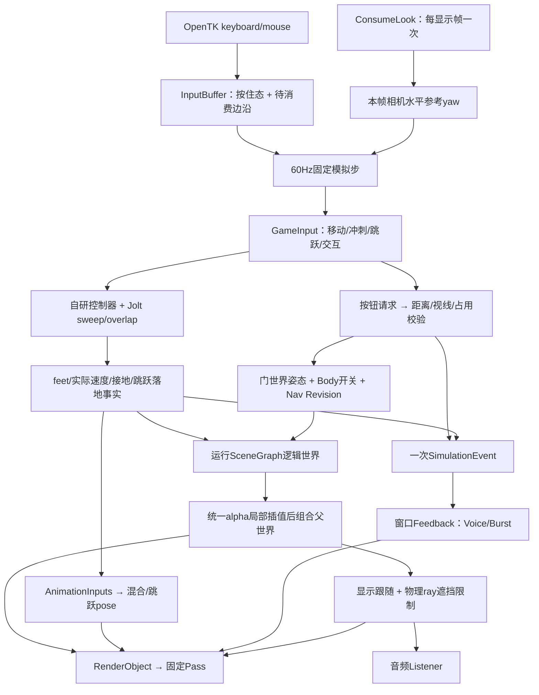
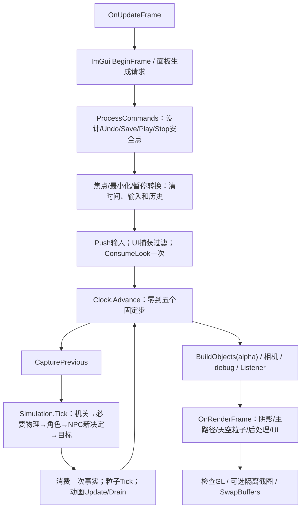
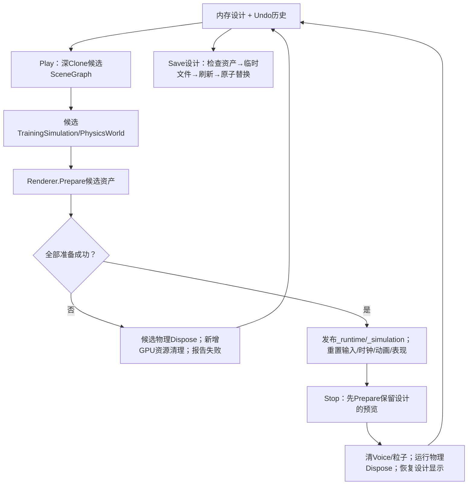

# V1 实际架构、数据流与学习入口

更新：2026-10-03。本文面向从课程笔记进入源码的阅读与解释，描述已经落地的基础综合训练场 V1，不把未来专题画成当前模块。正式范围已获用户弹窗批准；稳定约定见 [architecture](../architecture.md)，十份笔记的大章映射见 [learning-map](../learning-map.md)，操作/执行接续及最新证据见 [执行台账](../execution/v1-progress.md)。

## 当前证据先分层

| 层级 | 本机实际结果 | 不能由此推出的结论 |
| --- | --- | --- |
| 构建 | Debug/Release x64、已有依赖下 `--no-restore`，0警告/0错误 | 独立克隆、CI、第二机器已验证 |
| `--verify` | Core/Nav/Physics/Gameplay/Animation/默认场景/WAV 全部 PASS | 创建 GL 上下文、图形效果和声音输出听感已验收 |
| `--verify-audio` | OpenAL Soft 1.25.2 实际 device/context/buffer、2D/3D source、loop pause/resume/stop/cleanup PASS | 用户已听辨远近/左右，最终混音/音量合适 |
| 自动图形 exercise | 修复后 240 帧、Forward→Deferred、Play/Stop、有限 resize、保存重载/UndoRedo；无 GL 错误，2次jump事实/110个移动步（最终配置批次） | 所有阴影/蒙皮/颜色/透明遮挡画面正确，全部 UI 和失焦/最小化已人工验收 |
| 用户验收 | 本轮功能视觉、听感与操控仍待用户实际操作/反馈 | 不能写为用户已确认手感或最终交付无缺口 |

日志是本机忽略缓存：`g104engine/.cache/execution/build-debug.log`、`verify-debug.log`、`verify-audio.log`、`graphics-debug.log`。它们不是已提交或远程同步证据；权威摘要保存在执行台账。图形首轮 Shader 展开源曾因 UTF16 字符数与 UTF8 字节数不一致报 EOF，已改显式 UTF8 长度并越过初始化；这条真实修复记录不应擦掉，也不应继续把首轮失败写成当前仍不能启动。

## 两个项目与实际文件导航

Sandbox 依赖 Engine，Engine 不依赖 Sandbox。Main 函数、UI 请求、安全点和训练场专属规则在 Sandbox；复用能力按职责置于 Engine。当前不是完整 ECS、通用反射组件编辑器、通用资产数据库、Render Graph 或引擎任务图。

| 文件/目录 | 阅读时回答的问题 | 类型 |
| --- | --- | --- |
| [Program](../../samples/G104.Sandbox/Program.cs) / [LaunchOptions](../../samples/G104.Sandbox/LaunchOptions.cs) | 默认窗口、smoke、verify、audio、隔离数据根如何选择，异常/退出码归谁处理？ | 启动/验证组装 |
| [TrainingWindow](../../samples/G104.Sandbox/TrainingWindow.cs) | 窗口、UI、安全点、输入、固定模拟、相机/渲染、Play/Stop 和清理如何连接？ | 训练场组装 |
| [FixedStepClock](../../src/G104.Engine/Core/FixedStepClock.cs) / [InputBuffer](../../src/G104.Engine/Core/InputBuffer.cs) | 零步/多步帧、超时/补步、输入边沿和鼠标如何消费？ | 自研 Core |
| [SceneData](../../src/G104.Engine/Scene/SceneData.cs) / [SceneGraph](../../src/G104.Engine/Scene/SceneGraph.cs) | 设计身份/父关系与逻辑/显示世界矩阵是否混用？ | 自研设计/场景 |
| [TransformMath](../../src/G104.Engine/Scene/TransformMath.cs) / [SceneValidator](../../src/G104.Engine/Scene/SceneValidator.cs) / [SceneParameterRules](../../src/G104.Engine/Scene/SceneParameterRules.cs) | TRS、剪切、父缩放、根限制、参数/引用在哪里拒绝？ | 自研数学/约束 |
| [SceneSerializer](../../src/G104.Engine/Scene/SceneSerializer.cs) / [AssetPath](../../src/G104.Engine/Scene/AssetPath.cs) / [TemplateCatalog](../../src/G104.Engine/Scene/TemplateCatalog.cs) | JSON、资产边界、原子保存、模板实例的设计语义是什么？ | 自研适配 + .NET JSON/文件库 |
| [SceneEditor](../../src/G104.Engine/Editor/SceneEditor.cs) / [EditorHistory](../../src/G104.Engine/Editor/EditorHistory.cs) | UI 改动如何验证/准备/提交、失败回滚，Undo 怎样保持身份/dirty？ | 自研命令/有限快照 |
| [SceneEditorPanel](../../samples/G104.Sandbox/Tools/SceneEditorPanel.cs) / [ImGuiController](../../src/G104.Engine/Tools/ImGuiController.cs) | 控件如何排队命令、拖动事务怎样收束、ImGui 怎样接输入和GL？ | ImGui.NET集成 + 自研后端/设计面板 |
| [GltfModelLoader](../../src/G104.Engine/Assets/GltfModelLoader.cs) / [GltfModel](../../src/G104.Engine/Assets/GltfModel.cs) / [AssetRoot](../../src/G104.Engine/Assets/AssetRoot.cs) | 标准格式怎样变成本项目模型，默认节点、边界、URI和skin如何处理？ | SharpGLTF集成 + 自研转换 |
| [AnimationController](../../src/G104.Engine/Animation/AnimationController.cs) | Clip、速度混合、跳跃过渡、事件序列与pose如何求值？ | 自研运行时 |
| [PhysicsWorld](../../src/G104.Engine/Physics/PhysicsWorld.cs) | Jolt世界/形状/query、矩阵包装边界、GUID和基础刚体寿命是什么？ | 第三方后端集成/适配 |
| [KinematicCharacter](../../src/G104.Engine/Physics/KinematicCharacter.cs) | feet位置如何沿合法查询位移，坡台/墙/跳跃怎样决策？ | 自研角色规则 |
| [NavigationGrid](../../src/G104.Engine/Navigation/NavigationGrid.cs) | 同一碰撞描述如何采样平面净空、A*和路径/端点怎样验空？ | 自研受控导航 |
| [TrainingSimulation](../../samples/G104.Sandbox/Gameplay/TrainingSimulation.cs) | 门/目标/玩家/NPC 如何按阶段提交一次事实？ | 专属 C# Gameplay/FSM |
| [TrainingRenderer](../../src/G104.Engine/Rendering/TrainingRenderer.cs) / [RenderContracts](../../src/G104.Engine/Rendering/RenderContracts.cs) | 相同对象/动画/材质怎样进入两条管线、debug和透明合成？ | 自研固定 Pass |
| [GpuResources](../../src/G104.Engine/Rendering/GpuResources.cs) / [PrimitiveMeshes](../../src/G104.Engine/Rendering/PrimitiveMeshes.cs) / [GLSL](../../assets/shaders) | GL资源、贴图/目标/Shader失败怎样清理，颜色/空间怎样一致？ | OpenTK/StbImageSharp集成 + 自研资源/几何/Shader |
| [ParticleSystem](../../src/G104.Engine/Effects/ParticleSystem.cs) | 一次Burst怎样出生/推进/死亡/清理，有限容量在哪里？ | 自研 CPU 粒子 |
| [PcmWave](../../src/G104.Engine/Audio/PcmWave.cs) / [AudioSystem](../../src/G104.Engine/Audio/AudioSystem.cs) | WAV分块、共享Clip、独立Voice、Listener和上下文怎样管理？ | 自研解析/管理 + OpenAL |
| [初始场景](../../assets/scenes/training-ground.json) / [资源清单](../../assets/licenses/asset-manifest.json) | 哪些是随程序初始资源，哪些是用户设计，来源/许可在哪里？ | 设计/部署数据 |

上表提供逐文件入口；详细 API 和拒绝项分别读 [场景/编辑](scene-and-editor.md)、[物理/Gameplay](physics-and-gameplay.md)、[渲染/动画](rendering-and-animation.md)，不需要先通读全部历史草案。

## 一次输入怎样成为画面和声音

玩家移动速度来自控制器实际结果，动画读 Speed/Grounded/VerticalVelocity，不按 Clip 进度推世界位移。NPC 在当前步执行上一决定，感知/FSM/路径更新形成下一步意图，合法运动仍由同类控制器执行；FSM 与动画 FSM 不混用。门开关在同一模拟边界更新画面数据/碰撞/导航，关闭占用失败不发布关闭事实。完成目标只发一次，声音/粒子也只在事实消费点触发，不在绘制帧重播。

## 实际帧流程

`FixedStepClock` 的步长 `1/60` 秒，最多五步、输入时间上限0.25秒；完整积压丢弃，余量产生alpha。零步保存Jump/Interact边沿，多步第一次消费后清边沿，Move/Sprint继续按住。窗口当前也限制显示delta，并在加载/切换/暂停转换时丢弃下一旧delta；时钟统计不代表所有系统耗时。鼠标以显示帧更新参考yaw，同一帧各补步不重复应用 Look。

编辑命令不在物理更新或对象遍历中改集合，即使暂停/零步仍可响应。编辑态推进预览动画，运行态按固定步推进动画/粒子；`Render`只读显示输入。暂停与失焦清理不是确定性网络协议，实际恢复/最小化和连续人工操作仍需验收。

## 设计、运行、模板与准备提交

`SceneDocument` 保存schemaVersion=1、GUID、ParentId、LocalTRS、有限Material/Collider/参数/资产与模板信息。设计场景树、glTF默认节点树和skin关节集合是不同结构；场景编辑限制不套到导入模型全部节点。`TemplateId`是单层来源，实例保存完整有效字段与白名单覆盖，父挂接独立管理；当前没有模板变体/嵌套/Apply/Revert。

Play 不从磁盘重新覆盖当前内存设计，Stop 不用运行角色位置/机关状态写回设计。新设计 Load 先校验/Prepare 再替换编辑器，清旧历史；失败保持当前设计。候选创建期间新旧资源可能短时并存，这是安全提交的成本，同步加载仍可能停顿。

普通设计命令在同一安全点先保存快照、修改/校验场景，再经 `EditorHistory.PrepareChange` 准备资产/渲染；失败恢复设计/历史，Undo/Redo也先准备候选快照。当前编辑态没有独立物理模拟世界，Play 按最新设计世界变换建立静态碰撞；不把“编辑预览已重建Jolt”写为现成功能。运行组保持静态，门使用自己的世界姿态/Body开关，不用运动父组模拟平台。

初始资源位于应用输出assets，用户设计默认位于LocalApplicationData/G104Engine/TrainingGroundV1/Scenes。损坏设计启动时报告、保留原文件、回退seed；后续用户选择Save会先备份被拒原件。`--exercise`要求显式隔离`--user-data-root`；CPU文件检查也在指定隔离根下执行，不把真实用户Scenes当测试目录。

## 所有权、共享与清理顺序

| 所有者 | 数据/资源 | 清理/失败规则 |
| --- | --- | --- |
| 窗口 | UI/renderer/audio、设计/运行组装、particles/commands | `Run`外层finally和OnUnload均调用幂等DisposeResources，GL仍在有效Context时释放 |
| 设计/History | DTO/矩阵/100条有限快照、稳定GUID/DTO身份 | 不拥有GPU/Jolt/AL句柄，不能深Clone句柄建立运行隔离 |
| renderer | 程序/primitive/天空/目标；共享模型/贴图；GUID动画实例 | Prepare失败仅清新资源；Resize完整新目标成功才替换；离场引用清理；ResetScene与Dispose明确分层 |
| PhysicsWorld | System/Body/Shape/query capsule/filters/jobs | 注销/销毁Body→Shape/System/jobs/filters→最后一个活动世界Foundation.Shutdown |
| AudioSystem | device/context、共享Buffer、独立Voice | 先停止/解绑/删Voice→Buffer→解除/销毁context→device→加载库；构造部分失败同样清理 |
| ParticleSystem | CPU个体、512容量和随机源 | 固定步推进/死亡回收，Stop/Play清Clear；不拥有渲染器粒子GPU资源 |

当前AudioSystem在窗口寿命内同步载入七个WAV，Play/Stop只清Voice，Buffer保留到窗口关闭；这不是场景差量音频加载或进程级资源数据库。renderer共享primitive/Shader等通用资源至退出，模型/贴图按活动场景引用复用并卸载；实例删除不是释放所有共享资产。JoltFoundation按活动世界计数，双世界行为已经检查，不能用“当前活动世界”猜测别的世界所有权。

GL创建/上传/Prepare/Resize/Render/删除均在有效当前上下文所属线程；线程检查不能代替上下文有效性。Shader/FBO构造部分失败、新场景资源失败和正常退出已有清理代码，自动运行只覆盖实际经过的路径，并非全部故障注入。性能观察是FPS/帧间隔与多Pass提交统计，未做独立GPU计时或保证Deferred更快。

## 三个矩阵边界分别解释

世界Y-up右手，米秒，局部前-Z；场景字符位置是feet。CPU `TransformMath`沿OpenTK行向量：`p*local*parentWorld`，局部TRS为S×R×T。重挂接`newLocal=oldWorld*inverse(newParentWorld)`，分解/重组拒剪切；所有接收设计子对象的父节点正统一缩放，玩家/NPC根单位缩放。不能把scene TRS限制误施加给整个glTF骨骼树。

GL边界原始OpenTK行字节以`transpose=false`或std140 mat4上传，GLSL读为对应转置，用列向量`P*V*M*position`，不额外CPU转置。默认OpenGL投影NDC z范围[-1,1]与Piccolo Vulkan 0..1/Y翻转不同。非均匀缩放法线使用逆转置，切线另做正交化；刚性实例镜像与skin内部负/零缩放支持边界见 [渲染动画指南](rendering-and-animation.md#空间矩阵与蒙皮)。

glTF每个mesh节点单独构建行矩阵palette：`inverseBind*jointWorld*inverse(meshWorld)`，绘制模型为`meshWorld*instanceCorrection*sceneWorld`。CPU检查包括非单位mesh空间，不只验证节点树名称/clip数。角色实例保留模型根固定旋转，按完整默认蒙皮边界进行1.9m/feet对齐，再将素材+Z前向适配-Z；65关节完整进入128矩阵UBO。GPU观感仍须看图和实际动作验收。

JoltPhysicsSharp固定2.22.0包装层`ToJolt`内部转置，形状查询的公开Matrix4x4参数不是直接接受本项目Numerics行Translation。`PhysicsWorld.QueryTransform`在边界预转置一次，再由绑定转换；向量/四元数Body接口单独传值。原生fraction/penetration异常曾帮助定位，修正后通过查询/角色检查。源码提交与推导见 [物理指南](physics-and-gameplay.md#固定jolt版本与矩阵边界)，不能将此预转置加到SceneGraph或GL上传处。

## 学习阅读顺序与自测问题

| 阅读路线 | 原笔记大章 | 结合代码要能回答 |
| --- | --- | --- |
| Program→LaunchOptions→TrainingWindow→Core | 第20节性能/架构、第10–11节步长、第15节3C | 零步/五补步/暂停怎样消费输入？为什么Look与Jump消费点不同？ |
| SceneData→Graph→TransformMath→Serializer→History | 第13–14节Schema/实例/Command/PIE，第08–09节空间 | 设计树/模型树/skin有什么不同？保持world为什么可能拒绝？Undo如何保留身份/dirty？ |
| Simulation→Character→PhysicsWorld→NavigationGrid | 第10–11节碰撞/Controller，第15节Event，第16节FSM/A* | 角色速度、机关事实、NPC意图由谁提交？门的Body开关怎样使路径失效？ |
| GltfModelLoader→GltfModel→AnimationController | 第08–09节采样/层级/palette/Blend/In-place，第13–14节格式转换 | 默认根/mesh世界为什么不能重复应用？混合、事件序列、暂停怎样解释？ |
| RenderContracts→Renderer→GpuResources→GLSL | 第04–07节基础/PBR/阴影/后处理/管线 | 两条主路径共用什么？G-buffer格式/颜色边界是什么？无GL错误能证明哪些、缺哪些？ |
| Feedback→ParticleSystem→AudioSystem/PcmWave | 第12节生命周期/Billboard/Source-Listener/Attenuation/Voice | 同一事实怎样只播放一次？Clip/Voice寿命有何区别？CPU粒子与GPU池的差异？ |

先跟一条完整玩家输入链和一次按钮事件，再返回各模块的空间、时间、寿命/失败路径。能画图说明、定位消费者、解释一个真实修复并指出限制，比只记库名或类名更能证明理解。学习/面试自测由用户实际完成，本文不给尚未发生的自测打勾。

固定Piccolo参考为 [f5053707fed4d3f94d270a436fb0d3a8ae54e3e5](https://github.com/BoomingTech/Piccolo/tree/f5053707fed4d3f94d270a436fb0d3a8ae54e3e5)，具体已核查路径见 [来源核查](../reviews/design-reference-checks-2026-10-03.md)。本项目自研固定输入/时钟、有限场景图/命令、角色、FSM/A*、采样混合和固定Pass；第三方提供格式解码、图形绑定、Jolt与OpenAL。Piccolo所查范围没有完整音频/NPC通用FSM-A*/网络/Lumen/Nanite，首Clip/模式重载也不等同本项目混合/PlayStop；涉及homework01的原笔记仍按原版本解释。

## 仍保留的长期实践与当前限制

网络、动态GI、GPU几何尚未实施，仍要求分别有可运行机制和基线对比；具体算法/后端另收敛。布局/小ECS/并行Job/Fiber、GPU粒子、IK/重定向、平台/推箱、IBL及更多渲染/AI/声音/工具深度沿各模块路线继续。图/论文/参考研读不能替代这些工程目标，也不要求同时把全部专题塞入V1。

当前V1刻意保留有限范围：受控JSON/模板、单平面导航、有限坡台、即时门切换、in-place同骨架、单盏方向阴影、最多四点光、无IBL、CPU粒子、PCM16声音和有限编辑。自动GL/CPU/原生检查已给出真实证据；最终画面、听感、人工操作、重复恢复/失焦/最小化/文件重建后的体验仍按用户验收单独记录。D5独立克隆、CI和第二设备继续暂缓，助手没有恢复这些工作或执行Git发布。

## 配置与显示收尾索引

有限四状态动画定义已在assets/config/character-animation.json落实，实际非默认行为经AnimationVerification验证；上一/当前局部Pose的显示插值与SceneGraph共用alpha，mesh/palette/skeleton一致，显示不推进逻辑或事件。暂停/恢复仅ResetDisplayHistory，场景成功切换ResetAnimations。Debug/Release最终--verify及delivery图形回归通过，详细结果与用户待验收项见实施复查/执行台账；声音听感和真实操控不由自动日志代替。
