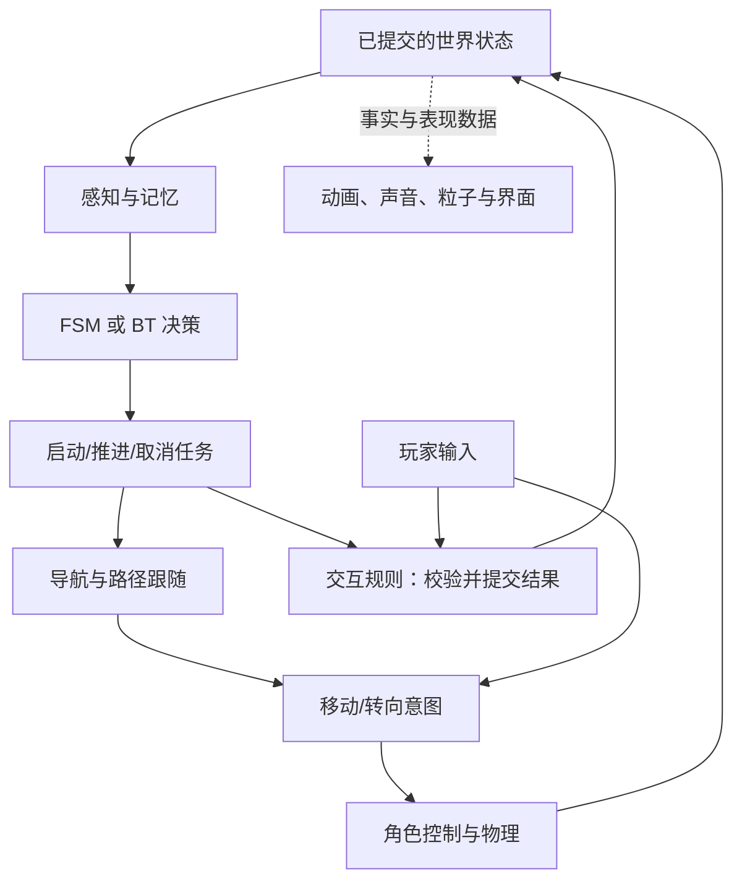

# Gameplay 与 AI：规则、交互、决策和导航

当前执行状态索引：V1完整范围已获2026-10-03正式同意并完成首轮实现；下文保留路线决策/后续专题规划，旧“未开工/待细化”不覆盖 [实施复查](../reviews/v1-implementation-review-2026-10-03.md)、[实际架构与学习](../guides/v1-architecture-and-learning.md) 和status的当前事实，不重复询问已定案事项。

更新：2026-10-03。状态：**三项规则/决策/导航路线已获用户确认；具体契约、算法细节和分期仍待收敛，未实现**。

本页细化 [总体覆盖表](../plan.md) 的 Gameplay 与 AI，连接已选的 [物理/角色](physics-character-roadmap.md)、[动画](animation-roadmap.md)、[资产/场景](assets-scene-roadmap.md) 及后续声音/粒子/工具。综合训练场不含战斗，NPC 与玩家复用角色执行能力；不把原笔记的射击案例转成新的战斗需求。

## 1. 已确认的选择

| 议题 | 助手推荐 | 另一方案 | 状态 |
| --- | --- | --- | --- |
| 玩法规则编写 | C# 规则与数据配置起步，Lua/可视化脚本后续专题 | 基础版接入脚本层，主要规则由脚本编写 | 用户选择推荐路线 |
| 基础 AI 决策 | 先 FSM，再小型 BT 对照同一巡逻/跟随/搜索场景 | 基础版先 FSM/感知/导航，BT 后续 | 用户选择 FSM 后做 BT 实际对比 |
| 导航路线 | 自研网格 A* 并实际跟随，再加入 NavMesh 对比 | 直接 NavMesh 主线，A* 另做原理实验 | 用户选择网格 A* 到 NavMesh 的路线 |

以上来自用户三项明确答复，不是由默认推荐推定。具体脚本/导航库、动作配置格式、决策节点、频率与预算仍未选择，本轮不安装或实现代码。

## 2. 核心 Gameplay 的候选范围

目标是完成一条可解释的交互链：玩家选择目标并发出请求，规则校验并改变机关状态，实际结果再被动画、音效、粒子、UI 或 NPC 消费。可以先用按钮/门/触发区等少量机关验证，不要求完整任务、背包、战斗或大型关卡内容。

| 职责 | 候选内容 | 验收方向 |
| --- | --- | --- |
| Control/输入 | 从键鼠到 Move/Look/Jump/Interact 等动作，区分持续状态和边沿，处理 UI/游戏输入上下文 | 输入可追踪；UI 捕获后不误触发玩法；一次动作不因补步重复提交 |
| 交互目标与规则 | 查询目标，检查距离、可见性/状态等适用条件，发出操作请求 | 请求被接受/拒绝都有可解释原因，不能只因按键就宣称交互完成 |
| 机关状态 | 有限按钮、门、触发区及联动；状态由规则所有者提交 | 状态、可见表现和物理形状一致；重复操作/对象删除等情况有定义 |
| 事件与反馈 | 小型明确的请求/事实通知边界，注册与解除订阅可追踪 | 结果只按约定发布/消费；场景卸载后不残留监听，不把所有局部调用都改成全局广播 |
| 参数与规则组织 | Sandbox 写训练场专属规则，Engine 提供输入、对象、查询、通知等通用能力 | 可调参数与编译代码职责清楚；不把运行中改数值叫完整代码热更新 |
| 3C 联动 | 沿用镜头相对输入、自研角色规则、动画消费实际状态；相机遮挡/恢复等按阶段细化 | 相机不改角色位置，动画不决定是否接地；输入到实际运动与反馈可跟踪 |

运行重载、事件阶段、消息类型与对象引用仍需契约。C# 与数据配置是已选起点，不是一套新的脚本 VM；后续脚本专题仍需明确绑定、调试、错误、对象寿命和重载生效范围，不把参数重载冒充代码热更新。

## 3. 请求、事实、记忆与动画各管什么

- 请求/命令表达“希望打开门”，可以失败或被拒绝；事实事件表达“规则已经提交了某个结果”。实际完成开启与开始开启动画也应按真实状态区分。
- Blackboard/感知记忆保存 NPC 当前知道的目标、最后观察位置/时间等，可重复读取且可能过期；它不是另一条 Event Bus，也不自动拥有全知世界状态。
- AI 的 FSM/BT 决定去哪里、做什么；动画 FSM 决定如何表现当前运动和动作。二者不可合成一个互相改写事实的状态机。
- NPC 产生移动/转向意图，不伪造键盘输入，也不直接沿路径写 Transform 绕过已选控制器。玩家与 NPC 可以有不同的意图来源，共用执行和物理约束。
- 任务启动、推进、成功、失败和取消需要可观察结果。旧任务被取消后不能继续写运动意图；未来规划器或学习策略同样经过这些执行入口，不直接把预测结果写成世界事实。

## 4. 基础 AI 闭环与候选分块

建议从无战斗的“巡逻 → 发现玩家后跟随 → 丢失目标后搜索 → 返回”建立闭环。G 编号只用于本模块讨论，不是全工程顺序。

下图是职责和数据方向示意，尚未实现，不规定所有节点每个固定步都执行：

任务完成/失败/受阻也要反馈给决策，不能只发出一次 MoveTo 就认为行动完成；具体事件与同步阶段仍待确定。

| 分块 / 笔记入口 | 候选深度 | 可见验收 |
| --- | --- | --- |
| G1 感知与记忆：第 16 节 2/12/15 章 | 距离/视野/遮挡与最后观察位置，必要事实通知更新记忆 | 画出感知范围和遮挡；丢失视线后不能继续无条件知道玩家实时位置 |
| G2 FSM：第 16 节 13 章 | 小型状态机表达巡逻/跟随/搜索/返回，按需要引入层次 | 显示状态、转换理由与任务；转换由感知/执行事实驱动 |
| G3 导航与执行：第 16 节 4–11 章 | 搜索路径、跟随、到达/受阻/不可达/目标改变的反馈 | 可见路径和搜索过程；无路能报告失败；路径不代替真实碰撞执行 |
| G4 行为树：第 16 节 14–15 章 | 按已选路线，在 FSM 后复用同一场景/任务做小型 BT；有限节点集的具体范围待定 | 明确 Running/成功/失败和取消；对照 FSM 决策过程，不先做完整图编辑器 |
| G5 交互整合与调试 | 将 NPC、机关、物理和动画通过已有边界整合 | 同屏或日志追踪感知、记忆、决策、路径、期望/实际运动，定位故障层次 |

具体状态名、节点集、转移条件、参数和输入集合仍需细化。AI 感知/决策/寻路不必全部每个 60 Hz 模拟步执行；后续按查询次数、搜索展开量、节点访问量和阻塞时间决定预算，不能提前承诺 Agent 数量或固定毫秒指标。

## 5. 导航不是角色控制器的替代品

- A* 是搜索算法，Grid/NavMesh 是空间表示。无论选哪条路线，都要说明可行走性怎样由角色半径、高度、坡度和台阶条件决定。
- 网格方案适合自研和可视化，但最初可限制在简单训练区域；不能把单层二维格子说成已支持所有楼层、坡台和移动平台。
- NavMesh 需要生成/导入可走表面、建立查询和路径走廊，再由控制器执行；它不自动让 NPC 会跳跃、搭乘平台或处理所有动态障碍。额外连接、动作及路径失效规则要分别验收。
- 玩家可以通过的地方，不代表当前 NPC 导航已支持；在功能范围和演示中明确限制。
- 碰撞会阻挡对象，不会替它找绕路方案；全局路径、局部 Steering/避让和角色允许的实际位移应分层。
- 两种表示可以共用目标/任务与路径结果边界；不为比较算法复制两套完整 NPC 系统。库与 C# 绑定仍未选择。

参考职责拆分可查 [Recast/Detour 官方项目](https://github.com/recastnavigation/recastnavigation)：生成导航数据与运行期查询是不同职责。这不是选择或安装 Recast 的决定；实际实现前再固定所用版本。

## 6. 进阶专题候选实践

所有专题仍按整体全模块实践目标保留，具体代表算法和深度待专题设计；不要求复刻完整商业系统。

| 主题 / 笔记 | 候选代表实验 | 边界 |
| --- | --- | --- |
| Script/可视化规则：第 15 节 4–5 章 | 小型嵌入式脚本调用引擎 API；有限机关图或事件图 | 即使基础版用 C#，也不取消这层实践；数据重载、脚本执行与完整代码热重载分别验收，不先做完整 Blueprint |
| 3C 扩展：第 15 节 6 章 | 输入重映射/设备支持、相机模式混合、遮挡恢复等选代表能力 | 键鼠基础不等于所有设备；射击/Aim Assist 等笔记例子不是当前无战斗场景需求 |
| Steering/Crowd：第 16 节 10–11 章 | 到达减速、小规模避让及一种群体/避碰方案 | 不承诺拥挤环境永不死锁；仍观察真实控制器执行反馈 |
| HTN/GOAP：第 17 节 4–6 章 | 用开门/取物/送达等小任务做分解与状态规划对比 | 要展示执行失败与重规划，不仅打印计划；不因此建设完整背包任务系统 |
| MCTS：第 17 节 7 章 | 小型棋盘/机关选择问题，有限预算模拟与动作统计 | 使用廉价状态转移，不在每次 rollout 运行整套物理世界 |
| RL：第 17 节 9–13 章 | 小网格或简化环境离线训练，加载固定策略运行并对照基线 | 训练与运行推理分开，不承诺复杂角色运动训练或 AlphaStar 规模 |
| 其他学习型方法：第 17 节 8/11 章 | 示范动作选择或轨迹聚类等代表实验 | 记录数据、输入输出和未见情形；模型建议仍经 Gameplay/运动入口验证 |

感知、执行与反馈在算法升级后仍保留。复杂策略不能用“更智能”替代可解释的失败、预算和状态归属；在线运行也不意味着每帧更新模型参数。

## 7. Piccolo 参考与后续收敛

固定 Piccolo 已核到按键到命令位的输入链、当前活动玩家的 3C、有限 Lua 字符串执行与反射桥；没有由此证明通用可绑定 Action、Gameplay EventBus、完整 hot reload 或 AI 导航/决策系统。细节见 [来源核查](../reviews/design-reference-checks-2026-10-03.md)。行为树概念可补充参考 [Epic 官方概览](https://dev.epicgames.com/documentation/en-us/unreal-engine/behavior-tree-in-unreal-engine---overview)，其特定调度和编辑器机制不直接作为本工程要求。

笔记对应见 [learning-map](../learning-map.md) 的第 15–17 节入口。具体交互规则、事件/任务契约、导航子集、决策配置和进阶实验内容须在对应实施计划前收敛；当前确认的路线不自动批准全部候选示例和节点。全局接续以 [status](../status.md) 和 [handoff](../handoff.md) 为准，V1 实施计划仍待审阅，未开始代码、依赖或配置变更。
