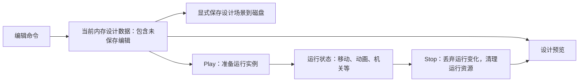

# 工具与调试：有限编辑、运行隔离与按需观察

更新：2026-10-03。状态：**编辑深度、运行/停止行为与性能观察分期已获用户确认；具体命令、UI 接入契约和阶段仍待细化，未实现**。

最新范围已确认：**V1 有限创建/删除/变换/参数编辑＋Undo/Redo＋Play/Stop**；保留未保存设计，运行状态不进入设计撤销。ImGui.NET 已选，具体字段/命令与契约见 [实施草案](v1-implementation-draft.md)，版本和未验证状态见 [准备清单](v1-dependencies-and-assets.md)。

用户后续已选V1受控基础父子层级：层级显示、挂接/重挂接与子树删除纳入有限命令，重挂接默认保持世界姿态，Undo恢复稳定ID与父子/局部变换；物理根节点和父缩放限制见实施草案9.1。这不是完整嵌套Prefab或任意骨骼编辑。

本页连接 [资产/场景路线](assets-scene-roadmap.md)、[总体计划](../plan.md) 和 [架构约定](../architecture.md)。窗口内嵌面板的形态已确认；工具随被观察的模块逐块加入，不要求基础绘制同时完成整个编辑器。

## 1. 已确认的选择与理由

| 议题 | 用户确认 | 理由与边界 |
| --- | --- | --- |
| 编辑能力 | 有限场景编辑＋约定操作的 Undo/Redo | 学习从操作到数据再到运行效果的完整链路；不要求任意操作、完整 Prefab 或通用节点编辑器 |
| 运行后停止 | 保留当前内存设计数据；停止后恢复设计预览，未保存编辑也保留 | 可以试运行未保存的摆放与配置；不强迫先写磁盘，也不把运行时变化自动写回设计场景 |
| 性能观察 | 初版仅 FPS／帧耗时，详细计时按需加入 | 用户关注初版投入，未选择一次加入 CPU/GPU 全套观察；问题分析或方案对比需要时再实现相应计时与计数 |

原先同时加入 CPU 阶段计时、GPU 计时与必要计数的建议未获采纳为初版要求。性能分析仍有后续学习价值：比较 CPU/GPU 粒子、Forward/Deferred 或数据布局时，应收集相应证据；不把详细计时提前变成基础绘制的验收门槛。完整时间线剖析工具后置，是否自制另行评估。

以下分工、拆分与验收是上述方向的**候选细化**，不代表用户逐项批准具体字段、操作方式或数字参数。ImGui.NET 已由用户安装，包及 Debug 原生文件已核对；输入/绘制适配和运行验证尚未开始。

## 2. 编辑界面与实际修改分工

| 职责 | 候选内容 | 需要解释的边界 |
| --- | --- | --- |
| 面板与交互 | 对象列表/选择、属性显示、输入与焦点状态 | 鼠标正在编辑数值时，不应同时触发相机或角色操作；选择/折叠状态不等于场景数据 |
| 可编辑字段描述 | 字段类型、单位、范围、资源类型、只读标记及允许修改的上下文 | 少量显式注册起步，按需使用 C# 反射；不默认暴露全部 public 字段 |
| 编辑命令 | 校验、应用、更改通知以及约定操作的撤销/重做 | 一个滑块拖动宜形成一次完整操作；取消应恢复原值，失败不留下半次修改 |
| 场景与运行系统 | 接受合法修改，更新实际消费者及必要的派生数据 | 改了字段值不等于物理形状、资源缓存和渲染数据都已更新；在安全边界提交 |

建议先允许约定的 Transform、组件参数与资源引用编辑，以及受支持模板对象的创建/删除/复制；具体字段和对象类型待实施前确定。对象列表不自动意味着支持任意父子层级；Gizmo、视口拾取和列表选择可分别验收，不能因为参考引擎有某个按钮就纳入首块。

Undo/Redo 只覆盖列明的设计操作。删除后撤销需恢复约定数据与有效引用，不能只生成同名空对象；资产引用或对象 ID 冲突的处理必须明确。模拟产生的移动、动画播放时间、临时生成对象及运行调参不自动进入设计撤销历史。历史容量、事务合并、保存后的撤销与未保存标记等规则仍待细化。

## 3. 保留设计数据，再创建可丢弃的运行实例

下面是**已确认语义的候选职责图，尚未实现**；不指定具体类，也不要求两个世界同时模拟。

进入运行时使用当前内存设计数据，而非只读取上次保存文件。设计数据在运行期间保持独立；停止时用它恢复预览，未保存编辑仍在。运行存档、运行中应用修改到设计、复制 GPU/音频/物理句柄都不属于这项承诺。

沿用“准备成功后再切换”的场景规则：Play 或 Stop 涉及新预览/实例准备时，失败应保留有效状态和设计数据，并清理本次临时资源。共享资产不能被运行实例无意改写；资源、订阅、循环声音及临时实例按作用域清理。确切的资源复用和失败界面待定，不能只复制一份对象引用就宣称隔离完成。

设计预览、运行、暂停和单步的状态转换留待工具阶段明确。建议单步表示一次 1/60 秒模拟步，暂停时仍能操作 UI 和刷新画面；音频、GPU 粒子、动画事件的暂停/恢复规则要逐一规定，不能把“暂停”解释成所有设备自动同步冻结或回滚。安全编辑提交也需在模拟暂停时生效，不能只放在 FixedUpdate 内。

## 4. 调试显示与性能观察分开安排

调试显示帮助判断状态是否正确，例如碰撞形状/查询、骨架/混合权重、AI 状态/路径，以及声音实例是否残留。它随对应模块加入；用户将详细性能计时后置，不取消已确认的动画等模块调试显示。

| 层次 | 安排 | 能说明什么 |
| --- | --- | --- |
| 初版 FPS／帧耗时 | 已确认的最小性能观察；窗口标题或简单显示均可，具体落点待 V1 实施计划审阅 | 观察整体帧节奏和明显停顿，不依赖先接入完整 UI 库 |
| 模块 CPU 耗时及计数 | 问题分析或方案对比时按需加入 | 分阶段耗时、对象/Draw/粒子/Voice 等与当前问题有关的数量，不一次堆满面板 |
| GPU 计时 | 需要判断绘制/Compute 成本时加入，不作为初版要求 | 用 GPU 时间查询等机制观察 GPU 工作，与 CPU 提交时间分别解释 |
| 完整时间线与高级分析 | 后置，工具及是否自制另评估 | 需要时结合合适的外部工具，不先建设通用 Profiler 产品 |

帧耗时应标明测量口径，例如包含等待的整帧间隔，并说明 VSync/限帧与平滑窗口；平滑 FPS 可能掩盖瞬时尖峰。CPU 执行、CPU 提交 GPU 命令和 GPU 执行不是同一耗时。初版统计不能据此声称已测出哪个 Pass 或哪条 Shader 最慢。

后续 GPU 查询结果应延迟读取并先检查可用性，避免为显示统计强迫 CPU 等待；尚未返回不能显示为零耗时。CPU/GPU 工作可能重叠，不能直接相加当总帧耗时。对比实验记录相同场景、输入、分辨率、质量目标及等待/限帧条件，说明观察工具本身的开销，不预设优化版一定更快。

## 5. 候选分块、可见成果与验收

T 编号仅为本模块讨论用，不是全局实施顺序。T1 的显示可很早加入；编辑、撤销和运行隔离依赖资产/场景数据契约，完整工具不阻塞基础绘制。

| 分块 | 候选能力与依赖 | 验收方向 |
| --- | --- | --- |
| T1 最小观察 | FPS/帧耗时；以后按模块增加状态和可视化 | 标明单位/口径；不能把显示刷新次数误作 60 Hz 模拟步数 |
| T2 有限编辑 | 已有场景描述、对象身份和安全修改入口；列表、少量属性、创建/删除等约定操作 | 修改确实影响实际消费者；非法输入失败可解释；UI 输入不误驱动角色/镜头 |
| T3 约定撤销/重做 | 明确命令、事务和引用恢复契约，衔接设计场景保存/重载 | 编辑→撤销→重做→保存/重载得到约定结果；连续拖动和删除恢复可解释 |
| T4 运行与设计隔离 | 当前内存设计描述、场景准备/清理；再细化暂停与单步 | 未保存编辑→Play→运行改变世界→Stop，编辑仍在、运行变化丢弃；反复切换和准备失败不泄漏资源 |
| T5 按需性能实验 | 在需要证据的模块前加入对应 CPU/GPU 计时及数量观察 | 能说明耗时口径、瓶颈证据与局限，不仅比较 FPS 数字 |

后续工具链实践候选：导入/重导入与依赖失效、Cook 与版本迁移、有限插件注册、命令日志/恢复、图编辑或地形笔刷。与资产、动画和玩法的相关专题共用实验，不重复建设多套编辑器；具体深度仍待相应阶段确认。

## 6. 笔记、参考与未决事项

笔记对应第 13–14 节：编辑事务、13.6 Command/Undo、13.7 Schema、13.8 运行中工具与 PIE、14.4 属性编辑、14.9 Reflection；准确章节导航与代码映射维护于 [learning-map](../learning-map.md)。本工程代码入口均待创建。

Piccolo 固定版本已有平面对象列表、反射属性面板、保存/重载、模式切换、拾取/轴编辑和部分调试显示；模式切换不自动恢复运行前设计，所查路径不构成完整 Undo/Profiler。某些属性由运行逻辑直接读取，另一些加载后生成派生数据，必须分别追踪，不能统一断言编辑即生效或永不生效。具体源码与原笔记适用边界见 [来源核查](../reviews/design-reference-checks-2026-10-03.md)。

[Dear ImGui 官方项目](https://github.com/ocornut/imgui)用于了解嵌入式调试界面的职责；它不替代本项目的命令、数据和 Play/Stop 设计。UI 绑定已选并安装 ImGui.NET，尚未实现接入。后续 GPU 时间查询参考 [Khronos glQueryCounter](https://github.com/KhronosGroup/OpenGL-Refpages/blob/main/gl4/glQueryCounter.xml)，不是本工程已经测量的证据。

未决：可编辑字段/具体命令、历史/事务/ID、Gizmo/拾取范围、运行调参与暂停/单步、统计口径及依赖实测；UI 组合已选，不再重问。下一步以 [status](../status.md) 与 [handoff](../handoff.md) 为准；V1 实施计划尚未获开工弹窗批准，不修改代码、配置或依赖。
