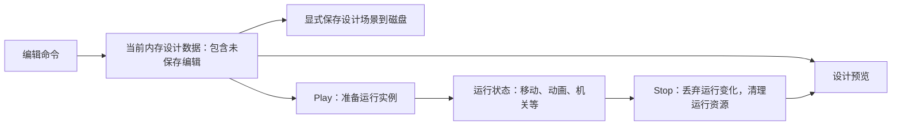

# 工具与调试：有限编辑、运行隔离与按需观察

本页维护有限编辑/运行隔离、观察需求与后续工具实践。V1范围在[v1-baseline.md](v1-baseline.md#scope)，完整编辑器、Gizmo/拾取与详细性能工具按专题收敛。

现行命令/字段/事务、输入归属及Saved基准见[scene-and-editor.md](../guides/scene-and-editor.md)。具体输入修复与覆盖证据留在评审记录，本页不重复批次状态。

V1选择有限创建/删除/变换/参数编辑、受控父子/子树Undo、Undo/Redo和保留未保存设计的Play/Stop；运行变化不入设计历史。UI依赖负责控件，编辑语义由项目定义。

受控层级包含显示、挂接/保持世界重挂接与子树删除；稳定身份、物理根节点及父缩放边界见V1基线。这不同于嵌套Prefab、任意骨骼编辑或父组驱动平台。

本页连接 [assets-scene-roadmap.md](assets-scene-roadmap.md)、[plan.md](../plan.md) 和 [architecture.md](../architecture.md)。窗口内嵌面板的形态已确认；工具随被观察的模块逐块加入，不要求基础绘制同时完成整个编辑器。

## 1. 已确认的选择与理由

| 议题 | 用户确认 | 理由与边界 |
| --- | --- | --- |
| 编辑能力 | 有限场景编辑＋约定操作的 Undo/Redo | 学习从操作到数据再到运行效果的完整链路；不要求任意操作、完整 Prefab 或通用节点编辑器 |
| 运行后停止 | 保留当前内存设计数据；停止后恢复设计预览，未保存编辑也保留 | 可以试运行未保存的摆放与配置；不强迫先写磁盘，也不把运行时变化自动写回设计场景 |
| 性能观察 | 初版仅 FPS／帧耗时，详细计时按需加入 | 用户关注初版投入，未选择一次加入 CPU/GPU 全套观察；问题分析或方案对比需要时再实现相应计时与计数 |

原先同时加入 CPU 阶段计时、GPU 计时与必要计数的建议未获采纳为初版要求。性能分析仍有后续学习价值：比较 CPU/GPU 粒子、Forward/Deferred 或数据布局时，应收集相应证据；不把详细计时提前变成基础绘制的验收门槛。完整时间线剖析工具后置，是否自制另行评估。

保留起步分工与长期路线；具体字段、历史上限/参数等普通细节由助手按授权定案，不伪称用户逐项选择。后续更广编辑/性能工具仍为候选。

## 2. 编辑界面与实际修改分工

| 职责 | V1实际职责 | 需要解释的边界 |
| --- | --- | --- |
| 面板与交互 | 对象列表/选择、属性显示、输入与焦点状态 | 鼠标正在编辑数值时，不应同时触发相机或角色操作；选择/折叠状态不等于场景数据 |
| 可编辑字段描述 | 显式控件/单位/范围、资源类型、只读上下文和设计中已声明的参数键 | 当前不使用通用C#反射字段编辑，反射Schema/注册扩展属于后续；不暴露全部public字段 |
| 编辑命令 | 校验、应用、更改通知以及约定操作的撤销/重做 | 一个滑块拖动宜形成一次完整操作；取消应恢复原值，失败不留下半次修改 |
| 场景与运行系统 | 接受合法修改，更新实际消费者及必要的派生数据 | 改了字段值不等于物理形状、资源缓存和渲染数据都已更新；在安全边界提交 |

创建/删除/属性编辑必须逐项列支持字段/对象/引用规则，不能由几个控件推为任意复制或完整组件编辑。受控场景树、列表选择与未来Gizmo/拾取分别讨论，不照搬参考引擎按钮名称当完成。

撤销覆盖约定设计命令与事务：身份/引用恢复、拖动合并/取消、非法输入回滚、新编辑清Redo、实际保存基准及PlayStop保留历史都需明确。运行位置/动画游标/临时实例不自动入栈；低级合同在场景/编辑指南。

## 3. 保留设计数据，再创建可丢弃的运行实例

下面说明设计/运行数据职责；预览不等于运行物理世界，Prepare失败保护与实际类入口见架构：

进入运行时使用当前内存设计数据，而非只读取上次保存文件。设计数据在运行期间保持独立；停止时用它恢复预览，未保存编辑仍在。运行存档、运行中应用修改到设计、复制 GPU/音频/物理句柄都不属于这项承诺。

Play从独立设计快照准备运行资源，成功才提交；Stop准备保留设计的预览并清运行资源。失败保护设计/有效旧状态并释放候选，共享资产按引用复用，快照不复制设备句柄；编辑碰撞何时重建须在现行合同写清。

编辑/Play/Stop/Pause/Resume与未来单步分别界定能力；暂停/失焦需处理时钟/输入/显示历史及声音，UI仍可响应，安全命令不依赖恰好有固定步。“暂停”不表示全部设备同步冻结或回滚。

## 4. 调试显示与性能观察分开安排

调试显示帮助判断状态是否正确，例如碰撞形状/查询、骨架/混合权重、AI 状态/路径，以及声音实例是否残留。它随对应模块加入；用户将详细性能计时后置，不取消已确认的动画等模块调试显示。

| 层次 | 安排 | 能说明什么 |
| --- | --- | --- |
| V1 FPS／帧耗时 | 初版观察帧间隔/FPS与必要有限统计，具体口径在指南 | 观察帧节奏，不等于阶段CPU/GPU耗时或正式性能比较 |
| 模块 CPU 耗时及计数 | 问题分析或方案对比时按需加入 | 分阶段耗时、对象/Draw/粒子/Voice 等与当前问题有关的数量，不一次堆满面板 |
| GPU 计时 | 需要判断绘制/Compute 成本时加入，不作为初版要求 | 用 GPU 时间查询等机制观察 GPU 工作，与 CPU 提交时间分别解释 |
| 完整时间线与高级分析 | 后置，工具及是否自制另评估 | 需要时结合合适的外部工具，不先建设通用 Profiler 产品 |

帧耗时应标明测量口径，例如包含等待的整帧间隔，并说明 VSync/限帧与平滑窗口；平滑 FPS 可能掩盖瞬时尖峰。CPU 执行、CPU 提交 GPU 命令和 GPU 执行不是同一耗时。初版统计不能据此声称已测出哪个 Pass 或哪条 Shader 最慢。

后续 GPU 查询结果应延迟读取并先检查可用性，避免为显示统计强迫 CPU 等待；尚未返回不能显示为零耗时。CPU/GPU 工作可能重叠，不能直接相加当总帧耗时。对比实验记录相同场景、输入、分辨率、质量目标及等待/限帧条件，说明观察工具本身的开销，不预设优化版一定更快。

## 5. 基础能力、后续分块与学习验收

T编号保留模块讨论顺序，不是统一排期。T1–T4描述有限基础能力，T5按实验需要建设；验收方向用于学习/定位，不从路线表推定所有DPI/极端输入覆盖。

| 分块 | 基础能力 / 后续候选 | 验收与学习方向 |
| --- | --- | --- |
| T1 最小观察 | FPS/帧耗时；以后按模块增加状态和可视化 | 标明单位/口径；不能把显示刷新次数误作 60 Hz 模拟步数 |
| T2 有限编辑 | 明确场景描述、对象身份和安全修改入口；列表、少量属性、创建/删除等约定操作 | 修改确实影响实际消费者；非法输入失败可解释；UI 输入不误驱动角色/镜头 |
| T3 约定撤销/重做 | 明确命令、事务和引用恢复契约，衔接设计场景保存/重载 | 编辑→撤销→重做→保存/重载得到约定结果；连续拖动和删除恢复可解释 |
| T4 运行与设计隔离 | 当前内存设计描述、场景准备/清理；再细化暂停与单步 | 未保存编辑→Play→运行改变世界→Stop，编辑仍在、运行变化丢弃；反复切换和准备失败不泄漏资源 |
| T5 按需性能实验 | 在需要证据的模块前加入对应 CPU/GPU 计时及数量观察 | 能说明耗时口径、瓶颈证据与局限，不仅比较 FPS 数字 |

后续工具链实践候选：导入/重导入与依赖失效、Cook 与版本迁移、有限插件注册、命令日志/恢复、图编辑或地形笔刷。与资产、动画和玩法的相关专题共用实验，不重复建设多套编辑器；具体深度仍待相应阶段确认。

## 6. 笔记、参考与未决事项

笔记对应第13–14节：Command/Undo、Schema、运行中工具/PIE、属性编辑/Reflection，精确入口在learning-map。显式有限字段起步与通用反射组件编辑器是不同深度。

Piccolo 固定版本已有平面对象列表、反射属性面板、保存/重载、模式切换、拾取/轴编辑和部分调试显示；模式切换不自动恢复运行前设计，所查路径不构成完整 Undo/Profiler。某些属性由运行逻辑直接读取，另一些加载后生成派生数据，必须分别追踪，不能统一断言编辑即生效或永不生效。具体源码与原笔记适用边界见 [design-reference-checks-2026-10-03.md](../reviews/design-reference-checks-2026-10-03.md)。

[Dear ImGui官方项目](https://github.com/ocornut/imgui)保留为界面职责参考；ImGui.NET提供控件/API绑定，OpenTK提供窗口/GL接口；项目自研ImGuiController负责输入事件与绘制适配，命令/数据/PlayStop语义由项目实现。后续GPU时间查询参考 [Khronos glQueryCounter](https://github.com/KhronosGroup/OpenGL-Refpages/blob/main/gl4/glQueryCounter.xml)，不代表已有GPU耗时证据。

后续保留Gizmo/拾取、单步/运行调参、通用反射/导入/恢复工具及详细统计，按相应模块需求收敛范围。工具验收应跟踪控件→命令→实际数据/Undo及输入归属，不只观察界面是否出现。
