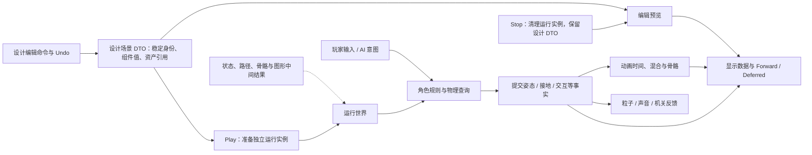

# 基础综合训练场 V1：完整实施方案草案

更新：2026-10-03。状态：**完整V1已在2026-10-03正式弹窗获准实施，首轮代码与本机验证已落地。普通细节按用户授权定案，重大取舍仍讨论；以下保留实施依据，实际代码/证据以架构指南、status和执行台账为准。**

本页是V1已批准的执行方案与设计来源入口。范围确认以 [V1 范围表](basic-training-ground-v1-draft.md) 为准；依赖准备见 [版本/素材清单](v1-dependencies-and-assets.md)。原 M1 已合入 V1，不再设置单独审批。用户希望尽快取得完整版本；未来网络/GI/GPU几何的精细设计不阻塞当前方案。

## 1. 交付目标与范围

一个可重复演示的第三人称训练场：走跑/跳跃与有限坡台，角色动作混合，按钮/门/触发区，少量能感知、寻路和跟随的 NPC，粒子/声音反馈；提供 Forward/Deferred 对比和有限编辑/Undo/Redo/Play/Stop，附运行说明、架构图与代码—笔记映射。

已确认 V1 渲染终点为基础 PBR、基础阴影、天空盒、HDR/色调映射/FXAA，IBL 后移；角色含平地/墙滑/跳跃/有限坡台，平台/推箱后移；工具含有限创建/删除/变换/参数编辑、Undo/Redo 与保留未保存设计的 Play/Stop。

以下候选实现采用 AI FSM＋网格 A*，同骨架 in-place 动画，CPU 粒子、基础 2D/3D 音频；BT/NavMesh、GPU 粒子、脚本/ECS/Job、进阶物理/动画和其他渲染专题留后续，完整清单在开工审阅时一并确认。当前无战斗、背包或大型任务系统。实现依托既有 Engine/Sandbox 两项目，不引入第三套演示工程。

## 2. 工程职责与状态流

| 所属 | 候选职责 | 实施边界 |
| --- | --- | --- |
| Engine | 生命周期/时间/输入、场景与资产、渲染、查询/角色规则、动画、音频/粒子、通用编辑命令与调试 UI | 目录按职责组织，具体类名内部确定；不依赖 Sandbox |
| Sandbox | 启动组装、训练场内容与专属机关/NPC规则、默认配置及演示操作 | 保留现有 --smoke 意义；图形入口逐步替换清屏探针 |
| 资产与描述 | 拟采用工程资产目录＋设计场景/模板 JSON，运行时按应用基目录解析 | 具体目录与复制规则在准备/实施范围中列明，不能依赖 VS 当前工作目录碰巧正确 |
| 文档与证据 | architecture/learning-map/status/handoff 及必要验收记录 | 随实现维护，标记自研/集成与未验证，实际代码入口出现后再链接 |

图为候选职责，不是已实现类图。CPU/GPU/物理/音频句柄不序列化为设计数据。运行时实体句柄与持久身份分开；系统保留明确的读写职责，不依赖组件遍历顺序。

## 3. 时间、输入与生命周期契约

已选基础主线程组织帧逻辑与图形调用，模拟 60 Hz，显示频率独立；后端内部线程按各自接口契约使用。以下规则现由助手按用户的新授权定案，作为V1起步实现；可调数值可据验证修正并记录，不再逐项提问。代码开工仍须整体弹窗确认：

- 固定步长 1/60 秒；累计器每显示帧最多补 5 步，输入时间先限制到 0.25 秒，超出的完整积压步丢弃并记录，保留不足一步的余量。它用于离线 V1，不承诺网络/回放的确定性。
- 失焦、最小化或主动暂停时停模拟，恢复/重置时清理旧时间与输入边沿；UI 仍能操作，尺寸为零时跳过绘制。同步加载可暂时停顿，结束后不补算加载时间。
- Move 等按住状态与 Jump/Interact 单次边沿分开，后者在一次有效模拟步消费；零步时保留，多步时不重复。鼠标 Look 是相对位移，收集后每显示帧仅消费一次以更新目标朝向，不在多个补步中重复应用；每个模拟步读取已确定的水平参考朝向。UI 捕获的输入不驱动角色，失焦/切换上下文时清理旧累计量。
- 编辑命令、Undo/Redo、Save、Stop 与场景替换请求在模拟循环之外的主线程安全点处理，编辑态/暂停/零模拟步也可响应；不在系统遍历途中修改集合。运行中的玩法/结构命令按规定在模拟步边界应用，再执行角色/必要物理、提交事实并推进玩法/动画事件；NPC 新意图用于明确约定的下一步。事件发生一次，表现系统消费，不在每个 Render 重发。
- 渲染读取前后逻辑姿态的显示插值；瞬移/重置清空历史。基础 in-place 动画不写角色世界位移。暂停/单步若提供，单步只推进一次模拟，音频/粒子各自定义暂停行为。
- 场景准备在独立资源作用域完成后才替换活动场景；失败清理临时资源并保留旧状态。Jolt 全局初始化与多场景实例寿命分开；组件释放使用自身所有者，不借当前活动场景猜测归属。
- 退出/重置明确停止循环声音、解绑事件、销毁实例和场景资源，最后释放引擎通用资源与窗口。GL 创建/删除发生在有效当前上下文线程，不依赖 GC。

AudioSystem 持有 device/context，场景拥有 Voice，Clip/Buffer 归明确的共享资产作用域；先停止并解绑/删除 Voice，再释放 Buffer，最后解除当前音频上下文、销毁 context、关闭 device。初始化失败也清理已成功创建的部分。窗口生命周期采用外层 finally 等确定性保护，先释放 GPU 再 Dispose 窗口，不能只依赖 OnUnload 正常回调。

## 4. 场景、导入与动画

设计场景确定使用schemaVersion=1、GUID对象ID、可空ParentId、LocalTRS、单层模板引用/白名单覆盖、资产引用和有限组件字段。资产标识限制为配置根目录内的规范化相对路径。未知版本/非法字段/资产错误需可定位，保存写临时文件成功后替换，失败保留旧设计文件；不建设完整资产数据库。

将随应用的初始场景/资产与可编辑保存数据分开：初始内容从应用基目录读取，Save 默认写到用户可写的 LocalApplicationData/G104Engine/TrainingGroundV1/Scenes；启动时优先加载该位置的已保存设计，未保存过则用初始场景，损坏时报告并保留文件。UI 显示实际保存位置；重新构建输出目录不会覆盖用户编辑。验证运行可指定工作区内独立用户数据根，不覆盖真实设计；本轮不创建这些目录。验收包含“保存→重新构建/启动→还原编辑结果”。

glTF/GLB 候选支持子集：未压缩 glTF 2.0、三角形网格、POSITION/NORMAL/UV 与需要的 tangent、基础金属度/粗糙度材质、PNG/JPEG、skin/节点层级及 TRS 动画。V1 不支持的压缩、纹理扩展和 morph 等应明确报告。格式读取交给 SharpGLTF；本项目负责导入约定、实例/资源、采样/姿态/蒙皮与运行控制。

以一套实际审核过的同骨架动作起步。四元数插值走短弧并归一化，节点求值含未动画节点的默认局部变换；逆绑定矩阵、根变换和最终 palette 必须按统一空间公式验证。V1 先支持实际素材所需的 STEP/LINEAR；若必需 CUBICSPLINE，纳入明确实现或选择可用素材，不静默当线性。关节影响数以选定资产检查结果决定，不预先假设任意文件都只有四个。

实际输入现已核对：Quaternius Standard 的 `Unreal-Godot/UAL1_Standard.glb` 含65joints、43个全LINEAR动作、最多4个正权重影响；所需Idle/Walk/Jog/Sprint与起跳/腾空/落地动作齐全。实现必须完整支持65骨骼，不能默认上限64；palette存储/上传建议采用核对布局后的UBO等合适方式。Run语义映射到Jog或Sprint，保留根节点固定变换并适配资产+Z前向；具体见 [输入核对](../reviews/v1-input-archives-check-2026-10-03.md)。模型无纹理/图片，不能单独证明贴图导入正确。

Idle/Walk/Run 混合由实际水平速度驱动；跳跃/腾空/落地状态读控制器事实，基础动画事件有播放/循环/过渡去重规则。测试绑定姿态、单 Clip、两端权重、循环和重置，再接角色状态。动画模块自身求值与 GPU 蒙皮均需可定位的骨架/权重显示。

## 5. 角色、玩法与 NPC

训练场先由静态地面、墙、有限坡台、按钮/门等受控几何组成；既定自研角色规则使用后端 ray/sweep/精确重叠信息。候选流程包括初始穿透恢复、扫掠允许位移、迭代沿墙滑动、接地/坡度限制及台阶规则；明确各查询过滤、自身排除和容差。调参不以改变物理后端内部现成控制器代替自研。

角色尺寸、坡度/台阶/速度/跳高等给出可见参数并用实测收敛，不在本稿承诺任意复杂网格都可穿行。V1 不依赖平台携带或推动态箱；选择的物理后端仍需基本刚体能力/生命周期小验证。第三人称相机实现跟随/旋转和有限遮挡处理，保留已选环绕相机作为编辑观察方式。

Gameplay 使用请求→校验→状态提交→一次事实反馈的链路。门的画面、碰撞和可走状态要同步；重复按键、关闭条件不满足、目标被删除等有明确结果。不要通过播放动画直接假定门已可穿越。

NPC 候选采用巡逻/跟随/搜索/返回的 FSM 和简单区域网格 A*。导航网格由共同场景碰撞描述生成，考虑角色占用与不可走边界；路径由角色控制器执行，报告到达/受阻/无路。动态门影响网格时使相应路径失效并重算；NPC 区域先限制在其支持的平面范围，玩家坡台区独立展示，不宣称全场景 NavMesh 能力。

## 6. 渲染与表现

先完成 Forward，再共用场景、材质、姿态/蒙皮和光源输入实现 Deferred。候选 G-buffer 使用基础色/金属度、法线/粗糙度和深度，位置由深度与逆变换重建；实际格式与空间约定在实现前写明。提供 G-buffer/深度/阴影可视化，检查贴图色彩空间、法线和坐标转换。无需通用 Render Graph 才能实现固定顺序的 Pass。

基础光照建议先一盏方向光及少量点光，方向光使用单张 Shadow Map 与有限邻域过滤；不默认点光阴影、级联阴影或无限灯光。天空盒只作背景，IBL 不进入 V1。线性 HDR 颜色经固定曝光/色调映射及 FXAA 输出，避免重复 Gamma/sRGB 转换；算法和默认分辨率作为集中方案内可调值记录。

透明/CPU Billboard 粒子继续 Forward 合成，正确衔接不透明深度；两条主路径的骨骼、材质和阴影语义一致。窗口尺寸变化时重建对应渲染目标并释放旧资源；失败路径和零尺寸都有定义。

管线对照建议在编辑态选择，下一次 Play 生效，使用相同设计场景、灯光与相机预设；不要求任意运行状态无缝切换，也不通过清除未保存设计实现对照。起步 FPS/帧耗时保持；需要声称性能变化时再补相应 CPU/GPU 测量，不宣称 Deferred 天然更快。

CPU 粒子限定少量发射器、生命周期/回收、Billboard、透明排序/限制与场景清理。声音限定约定 PCM WAV 子集、共享 Clip 与独立 Voice、2D/3D 一次性/循环事件、相机 Listener、距离/方位及基本并发管理；音频不可用时给出状态，不无声地标为测试通过。

实际Kenney输入全部为Ogg Vorbis；用户已选离线转换少量条目为PCM16 WAV，3D点声源准备mono。V1不因此加入Ogg运行时解码；转换工具/结果和试听仍待准备，不能只改文件扩展名。循环测试与最终听感分开记录。

## 7. 编辑、Undo 与 Play/Stop

候选首版可编辑操作：通过已知模板创建支持对象、删除支持对象、编辑 Transform 和白名单组件参数/资产引用。UI 不直接绕过命令改字段。一次拖拽合并一次事务，取消恢复，撤销后新编辑清空旧 Redo 分支；历史条数和未保存标记行为写清。

删除的撤销恢复同一设计身份、数据及约定引用；建议禁止删除仍被其他设计对象引用的目标，先解除引用，避免隐式级联。具体可删对象和必需玩家/相机的保护规则在界面中有清楚反馈。跨场景加载后清空旧场景历史，保存本身不当作对象编辑命令；保存后 Undo 改变设计时重新标为未保存。

Play 使用当前内存设计描述创建独立运行实例；设计 DTO 和 Undo 历史保留，运行时先只读显示组件状态，避免把临时调试写回设计。Stop 清理运行实例并从保留设计恢复预览，未保存编辑仍在；预览准备失败不丢原设计。保存写设计数据，运行存档不在 V1。

工具使用 ImGui.NET 控件，自研 OpenTK 输入/渲染适配、场景命令及调试视图；面板可展示选中对象、关键参数、动画状态、NPC 路径及必要统计。初期 UI 可采用英文标识，中文说明在学习文档维护；如加入中文字体，需有明确字体资产与来源。

## 8. 连续实施、验证与交付

建议把 V1 作为完整任务，在一次具体开工确认后连续推进；内部按依赖交错集成，不为每个类或三角形反复请求批准。拟提供“可玩角色基础”“约定功能闭环”两个预览及最终验收；预览是否必须等待反馈仍应在开工弹窗中明确，当前不将旧未答复问题视为默认同意。

2026-10-03用户补充希望批准后尽量连续完成，离开期间普通细节/修复由助手处理，完成后统一验收与学习；预览按自查留证组织。只在重大取舍、新授权或实际阻塞时请求用户处理，不能保证跨网络/额度/进程中断自动运行；当前仍未获开工批准。内部单元、每批进度保存、必要本地快照和恢复流程见 [执行台账](../execution/v1-progress.md)，不新增独立版本或逐块审批。

| 内部工作 | 必要验证/证据 | 面向用户的成果 |
| --- | --- | --- |
| 运行/资产/基础绘制 | 数学/资源、输入/时间、错误日志、尺寸与清理；原 M1 检查按功能归入 | 可观察训练场雏形，无需单独交付版本 |
| 角色与动画 | 查询过滤、墙滑/跳跃/坡台、相机、骨骼/过渡/事件、不同显示频率 | 可玩角色预览，等待实际手感反馈的项明确标记 |
| 渲染/玩法/AI/表现 | 双管线一致性、G-buffer、机关与碰撞、导航失败、效果/音频、资源重载 | 非战斗完整演示链，逐步接入工具 |
| 设计工具与收尾 | 创建/删除/参数/Undo/Redo、保存/Play/Stop、连续重置、初始化/加载失败 | V1 功能闭环、可重复演示及最终验收资料 |

测试以实际行为为目标：助手按授权确定新增 --verify 承担纯数学/时步/层级/命令历史/路径搜索等CPU检查，保留 --smoke 的原信息输出用途；GL/原生/声音与体验另需真实运行。此决定来自本轮细节收敛，不是追认历史M1草案；不为包装类机械加测试，也不用Smoke的PASS代替功能验证。

构建沿用 Debug/Release x64、已有还原完成后的 --no-restore；记录 bin/obj 产物。当前不恢复 CI、独立克隆或第二设备测试。图形/声音/手感未取得用户反馈的部分写“待验收”，不自行假定通过。

最终材料：可运行成果与启动/操作说明、实际架构/数据流图、关键代码与笔记映射、已验收和已知限制清单、真实问题修复记录。短演示视频可作为用户后续展示材料，录制/上传另按实际需求进行，不在当前自动发布范围内。

## 9. 开工前设计收敛：决策分工与助手定案

用户澄清“token不多”不代表跳过必要设计：重要决定在开工前连贯完成，普通细节由助手确定。此前提前发出的开工弹窗未获答复，已被本轮设计收敛替代，不作为开工依据。下表收敛前文的候选措辞；不是新增一轮逐项审批，也不取消开工前最终确认。

| 项目 | 当前定案 / 待决 | 依据与边界 |
| --- | --- | --- |
| 可编辑场景层级 | **用户已确认受控基础父子层级**；模型/骨骼内部层级继续保留 | 基本场景图、挂接、保存及Undo进入V1，物理根节点和父组缩放限制见9.1 |
| 版本任务与反馈 | 助手按连续实施、内部验证、两个可运行预览及最终验收准备；预览不自动成为停工闸门 | 按用户希望加快完整交付的意图组织，随最后开工范围明确；重大偏离仍沟通 |
| 主循环与输入 | 采用第3节的60Hz、最多5补步/0.25秒上限、暂停清理、鼠标增量单次消费、模拟外编辑命令安全点 | 属V1运行契约；不承诺网络确定性，参数在验证范围内调整 |
| 身份/存档结构 | schemaVersion=1；设计对象用GUID，资产用规范化根目录相对路径，运行句柄不落盘；单层模板只覆盖白名单字段 | 缺失引用、重复ID、越界路径和非法字段报错；不实现完整资产数据库 |
| 保存/Play/Stop | 沿第4/7节：初始资源与用户设计分离，临时写成功后替换；运行实例独立，Stop保留未保存设计 | 保存失败保留旧文件/内存状态，损坏设计不静默覆盖；不保存运行进度 |
| Undo/Redo | 参数与Transform事务合并，创建/删除恢复稳定ID；被外部对象引用时先拒绝删除并提示解除引用 | 不把运行位置/动画游标加入历史；跨场景加载清空历史；先采用100条可调历史上限 |
| 渲染组织 | 固定Pass顺序：阴影→Forward或G-buffer/Deferred光照→天空/透明粒子→色调映射→FXAA→UI | 不引入通用Render Graph；同一场景/材质/骨骼/光源输入共用 |
| G-buffer/颜色 | 基础色RGB＋金属度A用RGBA8（线性数据）；世界法线XYZ＋粗糙度W用RGBA16F；深度纹理D24用于位置重建；HDR颜色RGBA16F | sRGB只用于颜色贴图/最终显示边界；法线/粗糙度等不做sRGB解码；实际FBO完整性/精度须验证 |
| 光照/阴影起点 | 一盏方向光、最多4盏点光；仅方向光有单张2048阴影图和3×3 PCF；固定曝光与Reinhard色调映射 | 有限参数可调；无IBL/点光阴影/CSM，未测量前不做性能胜负结论 |
| Forward/Deferred对照 | 沿现有建议：编辑态选择，下一次Play生效；共用当前设计与相机预设 | 保留数据和资源边界，不额外要求运行中无缝切换；可在后续另扩展展示方式 |
| 骨骼与动作 | 为已核65骨骼使用专用UBO，起步容量128并检查设备/布局；完整求值全部节点；Run映射Jog_Fwd_Loop，Sprint作调试备选 | 容量超限明确报错；GLB根变换保留，+Z至-Z校正在实例边界统一处理；不做首版重定向 |
| 玩法/NPC最小内容 | 一个玩家、一个NPC、按钮联动门与目标触发区；NPC在受控平面区域巡逻/跟随/搜索/返回 | NPC用FSM与网格A*，角色与静态环境碰撞；群体避让/角色推挤后续，保持跟随间隔 |
| 基础资源与部署 | 正式素材放g104engine/assets，OpenAL实现库/许可放g104engine/third_party/openal-soft/1.25.2；Sandbox复制到约定输出位置 | 缓存ZIP保留为来源，实际资源提取与项目复制配置在最终开工范围明确后执行；不改包版本 |
| 音效离线工具 | 选用便携FFmpeg release essentials（本次核对9.0.2），仅作Ogg→PCM16转换 | 不是引擎运行时依赖；不系统安装/改PATH。获取/运行需落实操作授权，当前未下载或运行 |
| 验证入口 | 保留--smoke的原用途；新增--verify做纯CPU行为检查，真实GL/原生/音频另验证 | 两项目不新增测试框架；测试数据隔离，不把日志PASS或元数据检查当功能通过 |

FFmpeg来自 [官方列出的Windows构建入口](https://ffmpeg.org/download.html) 所链接的 [Gyan发行构建](https://www.gyan.dev/ffmpeg/builds/)，后者提供独立版本与SHA-256信息；这是工具选型，非已获取/验证的本机文件。采用这一路线无需重新询问编解码库，但实际下载/运行仍须符合当前执行边界。

类名、内部文件拆分、少量初始参数、错误文案和测试样例由助手直接处理。若验证暴露问题需要改变已选架构/范围、增添运行时依赖或影响用户设计数据语义，才升级讨论；不会为了沿用纸面默认值掩盖失败。

### 9.1 已确认：受控的基础父子层级

用户要求先解释商业引擎父子结构及平级建议的理由，随后明确选择“V1实现受控的基础父子层级”（D52）。父子层级是基础能力；初次平级建议只为缩小交付范围，现已撤回。V1纳入基本场景图、层级编辑及相应Undo，并采用下列边界。

例如“机关组→门/按钮/指示灯”：父组移动使子对象一起移动，子对象仍保存相对位置。平级对象能演示相同功能，但不能直接操作这类变换组合。[Unity Transform](https://docs.unity3d.com/6000.0/Documentation/Manual/class-Transform.html)保存父子关系及相对变换；[UE SceneComponent](https://dev.epicgames.com/documentation/en-us/unreal-engine/components-in-unreal-engine)通过挂接形成树，Actor的根组件参与其空间关系。两者不是完全相同的对象模型，也不能把场景树等同于物理约束或Prefab嵌套。

用户选择包含以下范围与限制：

- 普通场景对象支持分组/父子挂接、局部与世界变换、层级显示、保存/重载；禁止环、自挂接和无效父ID。已有GUID不因换父对象变化。
- 重挂接默认保持世界姿态，再重新计算局部变换；这与 [Unity SetParent 的常用语义](https://docs.unity3d.com/6000.0/Documentation/ScriptReference/Transform.SetParent.html)相近，具体实现沿用本工程行向量约定，不照搬其他引擎矩阵布局。
- 删除组时按整棵子树建立一个Undo事务，恢复原身份、局部变换、父子关系和约定引用；若子树有外部引用，先阻止并提示解除，不静默断开。Undo也覆盖重挂接。
- 玩家/NPC、活动相机及动态刚体保持场景根节点，避免父级变换与控制器/物理同时写姿态。静态场景对象可分组，纯显示子对象可挂接；V1运行中不通过父组运动驱动物理对象，既有门机关按自身规则更新。
- 所有带有或将接收可编辑场景子对象的节点均要求正的统一缩放，不仅限于Group类型；叶子对象是否可非均匀缩放由其组件约束决定。玩家等物理根节点采用单位缩放，体型由相应参数控制。模型/骨骼导入内部层级单独求值，不把场景编辑限制错误施加到其全部节点。

先前已选“单层模板”继续有效，模板深度与场景父子关系分别管理；不同时引入嵌套/变体Prefab、骨骼挂点编辑或载具附着系统。下列数据/更新契约由助手按已授权的细节决策职责确定，代码开始仍需最终弹窗：

- 设计对象新增可空ParentId，保存LocalPosition/LocalRotation/LocalScale；根对象的局部值等于其世界值。加载先校验全部ID/父引用与环，再构建世界，不静默丢失父子关系。
- CPU沿既定行向量约定：world=local×parentWorld；重挂接保持世界姿态时，newLocal=oldWorld×inverse(newParentWorld)。同一次命令内更新父引用与局部值，再按父先子后的顺序计算后代；矩阵不可逆、违反缩放限制或TRS分解/重组不能在容差内还原矩阵时拒绝操作，不静默丢失剪切。
- 物理、导航和渲染消费已经求得的世界变换；编辑预览改变静态组后，在安全点更新相关碰撞/边界数据。V1运行时组保持静态，门等机关只能按自身规则更新，不能用层级变换模拟平台携带。
- 玩家/NPC、活动相机、动态刚体禁止重挂至非根；其纯显示子对象可以继承变换。模型节点和骨骼树属于模型实例内部，不转成可任意删改的场景骨骼对象。
- 子树删除与恢复采用一次事务，包含所有后代的稳定ID/父引用/局部值；外部对象引用子树任一节点时拒绝删除并说明来源。重挂接/Undo后刷新后代缓存与显示历史，防止插值沿旧父路径移动。
- 新增验收：父平移/旋转/统一缩放、重挂接保持世界姿态、循环拒绝、子树Undo/Redo、层级保存重载和静态碰撞随编辑更新。普通文件/类名与UI细节由助手处理。

后代显示姿态按同一插值系数求局部姿态，再与父显示世界变换组合；碰撞/导航读取逻辑世界变换，不重复叠加父变换。重挂接、瞬移和场景切换重置相关显示历史。

## 10. 开工前的明确边界

1. 本稿及依赖/素材清单先形成可审阅版本；核对用户准备状态，收敛关键缺口，不临时以未批准库或素材替换。
2. 按用户明确要求弹窗：展示当前 V1 功能范围、所用方案、预计修改类别、验证方式和开发节奏；**收到明确同意后才写任何实现代码/Shader/实际配置数据或新的验证代码**。
3. 最终弹窗将单独列明本批素材提取、便携FFmpeg获取/离线转换和必要编译/资源复制配置；仅在用户明确同意该范围后由助手执行。不系统安装/修改PATH、不新增或升级NuGet运行时依赖、不改SDK；Git暂存/提交/推送或发布不在范围内。
4. 影响既定技术路线/范围、出现新的依赖或需要用户判断的体验问题时及时讨论；已授权范围内的常规细节和修复连续处理，文档持续更新。

开工前方案与准备历史：当时未获代码批准；随后用户正式同意，实际实现/部署及验证见 [实施复查](../reviews/v1-implementation-review-2026-10-03.md)。用户已完成NuGet与双配置原探针运行，四份外部ZIP也已静态核对；OpenAL/角色输入已识别，声音按已选路线待离线转换，持久部署未执行。新增库加载与功能尚未验证，助手未安装、构建或运行应用。

2026-10-03用户已提交推送cbce581并要求发起正式开工，见 [保存节点](../reviews/v1-start-checkpoint-2026-10-03.md)。D53明确Sol Ultra主实施、Astra Ultra评审/独立核查，所需任务使用指定Ultra模型，质量优先，不沿用此前High/额度节省建议；主对话选择由界面控制，子任务显式指定，实际调用异常如实记录。完整实施已获得明确同意，按连续推进、内部增量验证和 [执行台账](../execution/v1-progress.md) 持久化。

## b91dfe4之后的独立验收修订

原第9节HDR16F是起步定案；独立GPU数值参考确认GGX固定偏置错误，正确rough.045/强度10的HDR约194061.8超过half65504。保持粗糙度/能量，实际HDR改32F，增加8bytes/pixel，其他管线/Pass/G-buffer不变。交互和导航/朝向等同范围合同也按实测校正；详细先失败/后修复证据见 [独立评审](../reviews/v1-independent-review-2026-10-03.md)，不重新询问既定范围。
