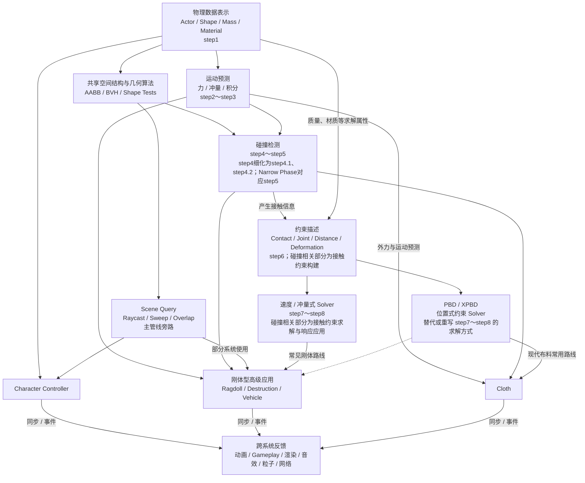

# GAMES104 第10—11节：游戏引擎物理系统详细总结

> 对应课程：第10节“游戏引擎中物理系统的基础理论和算法”、第11节“物理系统：高级应用”
> 阅读目标：不依赖视频，建立从底层物理管线到角色、布娃娃、布料、破坏、载具与 PBD/XPBD 的完整知识框架。
> 说明：正文以课程字幕为主；为了恢复字幕中缺失的公式或帮助理解而加入的内容，会明确标为“补充理解”。

---

## 0. 先建立全局视角

### 0.1 两节课分别在回答什么

第10节回答的是：**游戏引擎如何用可计算的数据和算法表示、推进一个物理世界？**

它从物理对象开始，依次讲到 Shape、质量和物理材质，接着用力和数值积分让物体运动，再处理刚体旋转、碰撞检测、碰撞响应、场景查询、性能优化和确定性。可以把它看作物理引擎的“底座”。

第11节回答的是：**有了这套底座，怎样做出玩家真正能感受到的物理功能？**

它把第10节的能力组合成角色控制器、Ragdoll、布料、破坏和载具，最后用 PBD/XPBD 展示另一种统一处理约束、碰撞和形变的思路。

两节课的关系不是“基础概念”和“零散案例”，而是：

> 第10节生产通用的物理能力；第11节把这些能力编排成面向玩法和表现的系统。

### 0.2 物理在游戏里追求的不是绝对真实

课程反复强调：物理首先是一种**让玩家相信并理解世界的表达手段**。

- 它建立直觉：箱子能推、角色会落地、物体撞墙会停下。
- 它创造玩法：可破坏墙体会改变路线和战术。
- 它增强表现：布料、头发、碎片、载具和粒子让世界显得“活着”。
- 它连接系统：一次碰撞不仅改变速度，还可能触发动画、声音、粒子和 Gameplay 事件。

因此，游戏物理通常在四个目标间取舍：

1. **可信**：结果符合玩家直觉；
2. **可控**：设计师能稳定地产生想要的手感；
3. **稳定**：长时间迭代不会爆炸、抖动或穿模；
4. **高效**：必须在每帧有限的毫秒预算内完成。

真实世界是目标参考，但“更真实”不自动等于“更好玩”。角色控制器就是典型例子：它故意违反真实动力学，换取直接、可靠的操控。

### 0.3 一帧物理模拟的概念管线

不同物理引擎在顺序和实现细节上会有差异，但可以用下面这条主线理解一帧：

主管线统一使用 **step1～step10**。后文提到“step4”时，就是在引用下面的第4步。

```text
[step1] 输入同步：把游戏/动画侧的权威状态同步到物理世界
    ↓
[step2] 收集重力、外力、冲量和运动学目标
    ↓
[step3] 预测未考虑约束的暂定速度、位置与姿态（此时允许暂时穿透）
    ↓
[step4] 碰撞过滤 + Broad Phase：筛出可能碰撞的对象对
    ↓
[step5] Narrow Phase：求接触点、法线、穿透深度
    ↓
[step6] 构建接触、关节及其他约束，并组织可独立求解的约束集合（传统刚体中通常为 Island）
    ↓
[step7] 按 Island 或约束集合迭代求解，得到冲量、位置修正等结果
    ↓
[step8] 应用求解结果，提交最终速度、位置和姿态
    ↓
[step9] Sleeping、唤醒与其他跨帧状态维护
    ↓
[step10] 结果回写：从物理世界同步回游戏/动画，并产生事件回调
```

Actor 和 Shape 通常会跨帧持久存在；step1 主要同步本帧发生的创建/销毁、Transform、Kinematic Target 和属性变化，并不是每帧重建整个物理世界。

这条管线可以浓缩成四个问题：

1. **世界里有什么？**——Actor、Shape、质量、材质（step1）。
2. **如果没有阻挡，它会怎么动？**——力、冲量、积分、刚体动力学（step2～step3）。
3. **它与谁碰撞，还必须满足哪些关系？**——step4～step5完成碰撞检测；step6～step8构建、求解并应用接触、Joint、距离和形变等约束，其中接触分支展开见0.4。
4. **结果如何交回并服务游戏？**——Sleeping/状态维护、同步与事件回调（step9～step10）；Scene Query 是主管线旁路，动画混合、破坏、布料、载具等高级应用会组合使用多段步骤。

注意，Raycast、Sweep、Overlap 这类 **Scene Query** 可以复用碰撞数据结构，但它们是 Gameplay 主动提出的问题，不必等同于每帧模拟管线。

Character Controller 是使用这条旁路的典型 Gameplay 系统。Gameplay 根据玩家输入产生期望位移，再主动执行 Raycast、Sweep 或 Overlap，并根据查询结果应用 Sliding、Stepping、Slope Limit 等规则，通常不把角色自身的移动交给 Dynamic Solver。因此，可以把它看作 **主管线外的 Gameplay 控制支路**。

这里的 **Dynamic Solver** 是指用于 Dynamic Actor 的刚体约束求解器：它主要对应 step6～step8，核心求解发生在 step7，并不等于 step1～step10 的完整物理主管线。更具体的解释见第8.0节。

这里的“主管线外”只描述控制器的核心移动决策路径，并不表示它与主管线完全分离：控制器仍会读取 step1 中的 Actor、Shape 和过滤属性；若采用 Kinematic Target 驱动，可以在 step2 提交目标；推动 Dynamic Actor 时，可以把经过 Gameplay 调校的冲量送入该物体的 step2；最终状态和需要跨系统发布的事件仍会在 step10 或等价同步阶段交给 Gameplay、动画等系统。具体的一帧流程见第8.0节。

### 0.4 碰撞子管线

这篇文章主要介绍的是 **完整的0.3主管线** ，0.4只是其中碰撞部分的重点展开。

**0.3和0.4不是前后执行的两套管线。**0.3是从输入到回写的整帧总览；0.4则像把镜头拉近，只展开其中 **step4～step8** 的“碰撞接触”分支。它补充了过滤、粗检、精检、接触约束和响应的内部细节，但不重复执行一遍0.3。

0.4不另建一套连续编号：只有当主管线中的一步在这里被拆成多个先后动作时，才使用小数编号。因此step4拆成step4.1和step4.2；step5直接复用；step6～step8只标出各自与碰撞有关的处理部分。“大量 Actor”“候选对象对”“接触信息”只是步骤的输入或输出，不另算一步。

```text
输入：来自step1和step3的 Actor、Shape、过滤属性及预测状态
    ↓
[step4.1] 碰撞分组/掩码过滤：排除无需互相检测的对象组合
    ↓
[step4.2] Broad Phase：用 AABB + BVH 或 Sweep and Prune 粗筛
    ↓
[step5] Narrow Phase：用解析法、GJK、SAT 等精确检测
    ↓
[step6（接触约束构建部分）] 根据接触点、法线、穿透深度和材质构建接触约束（未涉及step6中Joint、距离、弯曲和形变等非接触约束）
    ↓
说明（不是额外步骤）：完整的step6会汇总接触与非接触约束；传统速度/冲量路线和PBD/XPBD位置式路线原则上都能处理这两类约束。只有接触约束属于0.4的讨论范围
    ↓
[step7（接触约束求解部分）] 按选定路线与其他约束一起迭代；这里只观察同一个接触约束在两条路线中的结果：若用速度/冲量式Solver，则求接触冲量；若用PBD/XPBD，则求接触位置修正。这句话比较的是“同一接触约束的两种求解方式”，不是在限定两类Solver各自能处理的约束类型
    ↓
[step8（碰撞响应应用部分）] 应用接触约束的求解结果：速度/冲量式路线修正线/角速度及必要的位置与姿态，PBD/XPBD路线应用接触位置修正并回算速度（这里只聚焦step8中的碰撞响应）
    ↓
输出：回到step9做状态维护，最终由step10同步并派发回调
```

0.4中的碰撞处理与主管线的关系如下：

| 0.4中的碰撞处理           | 与主管线的关系    | 关系说明                                                                       |
| ------------------------- | ----------------- | ------------------------------------------------------------------------------ |
| step4.1 碰撞过滤          | step4的过滤部分   | 先排除不需要互测的对象组合                                                     |
| step4.2 Broad Phase       | step4的粗检部分   | 输出少量候选对象对                                                             |
| step5 Narrow Phase        | 与主管线step5相同 | 输出接触点、法线和穿透深度等几何信息                                           |
| step6（接触约束构建部分） | step6的一部分     | step6还会汇总Joint、距离、弯曲和形变等其他约束；传统刚体路线通常据此组织Island |
| step7（接触约束求解部分） | step7的一部分     | Solver会按所选路线与其他约束一起迭代求解                                       |
| step8（碰撞响应应用部分） | step8的一部分     | 最终状态还会汇总外力、关节等其他结果                                           |

Broad Phase 只回答“**可能撞吗**”；Narrow Phase 回答“**真的撞了吗，撞在哪里**”；Solver 回答“**撞了以后怎么办**”。三者不能混为一谈。

#### 0.4补充：step6～step8不只处理碰撞

0.4中的step4～step5负责碰撞检测；step6～step8展示的是检测之后的接触约束与碰撞响应。

但在完整的0.3主管线中，step6～step8还会处理Joint、距离、弯曲和形变等非碰撞约束。0.4只聚焦其中的接触分支，并不代表step6～step8只有碰撞工作。

首先要注意：“接触、Joint、距离、弯曲、形变”不是五个完全并列、互斥且穷尽的类别。本节只需先做一层分类：

| 第一层分类 | 产生方式                             | 典型内容                                 | 是否属于0.4 |
| ---------- | ------------------------------------ | ---------------------------------------- | ----------- |
| 接触约束   | 由碰撞检测结果动态生成               | 法向非穿透、摩擦，以及反弹所需的速度条件 | 是          |
| 非接触约束 | 由关节配置、网格拓扑或材料模型等产生 | Joint、结构距离、弯曲、形变和体积等约束  | 否          |

Joint是一个较大的工程概念，它内部可以包含位置、距离、角度、限位和马达等多个具体数学约束；距离、弯曲和形变则是更具体的约束形式。因此，本文列出它们是为了给出典型例子，而不是要建立一张彼此并列的完整分类表。

其次，必须区分两个彼此独立的维度：

1. **约束类型：** 接触还是非接触；这个维度决定内容是否属于0.4。
2. **求解路线：** 传统速度/冲量式还是PBD/XPBD位置式；这个维度决定约束如何被求解。

**0.4按约束类型划分范围，而不是按Solver划分范围。** 接触约束属于0.4，无论它由哪种Solver求解；Joint、结构距离、弯曲和形变等非接触约束不属于0.4，同样不取决于使用哪种Solver。

| 约束类型   | 传统速度/冲量式Solver                        | PBD/XPBD位置式Solver                                                                    |
| ---------- | -------------------------------------------- | --------------------------------------------------------------------------------------- |
| 接触约束   | 可以处理；属于0.4；求接触冲量                | 可以处理；属于0.4；主要通过位置或姿态修正，使物体退出穿透并满足接触约束。               |
| 非接触约束 | 可以处理；不属于0.4；例如以约束冲量维持Joint | 可以处理；不属于0.4；通过位置或姿态修正，满足 Joint、结构距离、弯曲和形变等非接触约束。 |

这张表的四个格子都是“可以处理”。判断是否属于0.4，唯一依据是它是否在处理接触约束，而不是它使用哪种Solver。

两条路线的层级关系也不完全对称：

```text
传统刚体路线
└─ 速度/冲量式约束求解（核心求解范式）
   └─ Sequential Impulse / Projected Gauss–Seidel 等（常见具体实现；两者在实时刚体中关系密切）

位置式路线
├─ PBD（位置投影求解框架）
└─ XPBD（引入柔度和约束乘子的扩展）
```

因此，“速度/冲量式Solver得到接触冲量，PBD/XPBD得到接触位置修正”的完整语义是：

```text
对同一个接触约束：
若采用传统速度/冲量式路线 → 求出接触冲量，用它修改线速度和角速度
若采用PBD/XPBD位置式路线     → 求出接触位置修正，投影位置后再回算速度
```

它不表示“速度/冲量式Solver只能处理接触约束”，也不表示“PBD/XPBD只能处理非接触约束”。

在本文的概念主管线中，可以把它们看成step6～step8的两种主要实现路线：对某个约束的某次求解，通常会选择其中一种主要表达。但这不等于整个引擎必须全局二选一；实际引擎可以让刚体使用冲量式Solver、布料使用XPBD，也可以对同一接触用位置修正消除穿透，再用速度/冲量处理反弹和摩擦。

| 主管线步骤     | 0.4重点展示                                    | 0.4之外的非接触内容                                                   | 主要位置      |
| -------------- | ---------------------------------------------- | --------------------------------------------------------------------- | ------------- |
| step6 构建约束 | 根据接触信息构建非穿透、摩擦和反弹条件         | 构建Joint、结构距离、弯曲和形变等约束，具体表达取决于求解路线         | 第9章、第13章 |
| step7 迭代求解 | 求解接触约束；结果可以是接触冲量或接触位置修正 | 传统路线可求约束冲量；PBD/XPBD路线可投影Joint、距离、弯曲和形变等约束 | 第9章、第13章 |
| step8 应用结果 | 应用接触约束产生的碰撞响应                     | 冲量式路线修改速度/状态；位置式路线提交位置/姿态修正并回算速度        | 第9章、第13章 |

可以把step6～step8理解成一个通用的“约束处理区”。下面列出两种常见组合，但不表示传统路线不能处理距离/弯曲/形变，或PBD/XPBD不能处理Joint：

```text
传统刚体路线：
接触约束（属于0.4） + Joint等非接触约束（不属于0.4）
    ↓
step6 收集约束并通常组织Island
    ↓
step7 以速度/冲量式Solver迭代：接触约束产生接触冲量；Joint产生约束冲量
    ↓
step8 应用全部求解结果

PBD / XPBD路线：
接触约束（属于0.4） + Joint/距离/弯曲/形变等非接触约束（不属于0.4）
    ↓
step6 构建位置约束
    ↓
step7 以PBD/XPBD投影各类约束：接触约束主要通过位置或姿态修正，使物体退出穿透并满足接触约束；非接触约束通过位置或姿态修正，满足 Joint、结构距离、弯曲和形变等非接触约束。
    ↓
step8 提交修正后的位置/姿态并回算速度
```

因此：

- 0.4完整、集中地讲解了step6～step8的接触分支；
- 第9章补充了传统刚体Solver中的Joint分支；
- 第13章补充了以位置投影统一处理接触与非碰撞约束的PBD/XPBD替代求解路线；
- 传统弹簧—质点布料的内部弹性主要以力的形式进入step2～step3，但其碰撞仍会使用step4～step5，并通过惩罚力、冲量或位置修正等方式响应；采用PBD/XPBD时，距离、弯曲与碰撞等约束才会被统一组织进这里所说的位置约束路线。

目前文档对接触分支讲得最完整；Joint分支主要介绍概念和应用，PBD/XPBD求解路线则形成了较完整的“构建约束→求解→提交结果”闭环。

#### 0.4补充：四种“求解路线 × 约束类型”在后文哪里展开

后文覆盖了这四种组合，但讲解深度并不相同。下表中的“接触/非接触”表示约束类型，“传统速度/冲量式、PBD/XPBD位置式”表示求解路线；二者仍是相互独立的两个维度。

| 求解路线        | 约束类型   | 后文主要位置                                   | 覆盖内容与深度                                                                                                                                                                                      |
| --------------- | ---------- | ---------------------------------------------- | --------------------------------------------------------------------------------------------------------------------------------------------------------------------------------------------------- |
| 传统速度/冲量式 | 接触约束   | 第6章，重点为6.3～6.4                          | 四种组合中讲解最完整：从接触信息和非穿透条件出发，介绍接触冲量、高斯—赛德尔式迭代、一维法向冲量示例与求解停止条件。                                                                                |
| 传统速度/冲量式 | 非接触约束 | 第9章，重点为9.2、9.5和9.6                     | 以Ragdoll Joint为例，说明自由度、Limit、Drive，以及Joint与接触约束共同进入Island并联合求解；9.6用斜坡击倒案例展开step1～step10与肘关节迭代过程，但不完整推导通用Joint Solver。                      |
| PBD/XPBD位置式  | 接触约束   | 第13章的13.1、13.3、13.5～13.6；应用补充见10.5 | 介绍“检测碰撞→汇总接触约束→投影位置/姿态→回算速度”的统一流程，以及位置投影处理接触的稳定性；第10章补充布料碰撞场景。目前没有单独完整推导接触不等式、摩擦、反弹，也没有接触约束的独立数值算例。 |
| PBD/XPBD位置式  | 非接触约束 | 第13章，重点为13.1、13.3、13.4和13.6           | 讲解较具体：包括距离等约束的表达、逐轮投影、逆质量分配、两质点距离约束数值例子，以及XPBD的Compliance与约束乘子增量公式；Joint、弯曲、形变主要作为统一框架中的约束类型出现。                         |

##### 为什么第7.3节不作为第五格列入上表

上表的两个分类维度是“约束属于接触还是非接触”和“约束采用传统速度/冲量式还是PBD/XPBD位置式路线求解”。第7.3节讲解的Island与Sleeping都不属于新的约束类型或求解路线，因此不应再增加一个与四格并列的格子。

| 第7.3节机制 | 主管线位置           | 与四格的关系                                                                                                                            | 为什么不单独占一格                                                                          |
| ----------- | -------------------- | --------------------------------------------------------------------------------------------------------------------------------------- | ------------------------------------------------------------------------------------------- |
| Island      | step6组织、step7使用 | 按约束依赖组织求解集合；在传统刚体路线中，一座Island可以同时包含接触约束和Joint等非接触约束。PBD/XPBD也可以采用类似的连通约束集合思想。 | 它横跨多种约束，是Solver之前的组织机制，不是接触/非接触中的新类别，也不是第三种Solver路线。 |
| Sleeping    | step9                | 读取求解后的速度、角速度和约束稳定性，决定整座Island是否暂停后续物理步的主动模拟。                                                      | 它发生在step8提交状态之后，已经超出0.4所展开的step4～step8范围。                            |

以传统刚体Ragdoll倒在地面为例，同一座Island中会同时出现：

```text
肢体与地面的接触约束       → 接触约束格
骨骼之间的Joint、Limit约束 → 非接触约束格
                ↓
第7.3节Island把两类约束组织到同一求解集合
                ↓
step7联合迭代，step8提交状态
                ↓
第7.3节Sleeping在step9判断整座Island能否休眠
```

因此，第7.3节的正确定位是：

- **Island是四格之外的跨格组织机制。** 它回答“哪些刚体和约束必须放在一起求解”，不会改变约束属于接触还是非接触，也不会决定使用冲量还是位置修正。
- **Sleeping是0.4之后的状态维护机制。** 它回答“这组刚体是否已经稳定到可以暂时停止主动模拟”，不属于step4～step8的碰撞子管线。

所以上表仍保持四行，不把7.3作为第五格；但阅读传统刚体的step6～step7时，应把第7.3节作为第6章接触分支与第9章Joint分支共同使用的跨格补充。若继续追踪求解结束后的运行状态，再由第7.3节的Sleeping部分衔接到step9。

因此，若要沿四个格子继续阅读，可以按“第6章→第9章→第13章”的顺序建立主干，再用第10.5节补充PBD布料接触的应用场景。第6、9、10、13章开头的管线说明也会标明各自对应的格子与讲解边界。

### 0.5 基础能力如何支撑高级应用

0.3、0.4和0.5观察的是同一套物理系统，但使用了三个不同视角：

| 部分 | 回答的问题                     | 图的性质   | 与另外两图的关系                                                                               |
| ---- | ------------------------------ | ---------- | ---------------------------------------------------------------------------------------------- |
| 0.3  | 一帧物理模拟按什么顺序执行？   | 时间流程图 | 给出从step1到step10的整帧主管线                                                                |
| 0.4  | 主管线中的碰撞部分怎样执行？   | 局部放大图 | 展开step4～step8：step4拆为step4.1和step4.2，step5直接复用，step6～step8聚焦各自的碰撞相关部分 |
| 0.5  | 哪些底层能力支撑哪些高级功能？ | 能力依赖图 | 把0.3、0.4中的步骤按能力分组，再连接到角色、布料、破坏等应用                                   |

因此，0.5中的箭头**不表示每帧按箭头顺序依次执行**。从底层能力指向高级系统的实线表示“提供能力”；虚线表示“可选的求解方法”；高级系统指向最下方反馈节点的箭头表示“把结果交给其他引擎系统”。



图中各能力块与主管线的对应关系如下：

| 0.5中的节点                     | 对应0.3/0.4的位置                                                        | 应怎样理解                                                                         |
| ------------------------------- | ------------------------------------------------------------------------ | ---------------------------------------------------------------------------------- |
| 物理数据表示                    | 主要对应step1，并为后续检测与求解提供数据                                | 描述物理世界里有什么，以及对象怎样参与碰撞和响应                                   |
| 运动预测                        | step2～step3                                                             | 根据力、冲量和积分得到尚未满足约束的暂定状态                                       |
| 共享空间结构与几何算法          | 被step4～step5和Scene Query共同复用                                      | 它是检测与查询共享的基础能力，不代表Query必须在每帧碰撞检测之后执行                |
| 碰撞检测                        | step4～step5；其中step4细化为step4.1、step4.2，Narrow Phase直接对应step5 | 过滤对象对，完成Broad/Narrow Phase并产生接触几何信息                               |
| Scene Query                     | 主管线旁路，复用step4.1、step4.2及step5所使用的精确几何检测能力          | Gameplay主动发起查询，通常不继续执行接触约束和响应                                 |
| 约束描述                        | step6；碰撞相关部分为接触约束构建                                        | 把接触、关节、距离和形变要求写成Solver能够处理的约束                               |
| 速度/冲量式 Solver              | step7～step8；碰撞相关部分为接触约束求解与响应应用                       | 传统实时刚体常用路线，通过冲量修正速度与状态                                       |
| PBD / XPBD                      | 主要替代或重写step7～step8的求解方式                                     | 直接投影位置约束；是可供高级系统采用的Solver路线，不是应用执行完后的下一步         |
| Character Controller            | 组合物理数据表示、Scene Query和Gameplay规则                              | 通常绕开Dynamic Solver，先查询路径，再按滑墙、跨步等规则决定位置                   |
| Ragdoll / Destruction / Vehicle | 组合运动预测、碰撞、约束和Solver                                         | 通常使用刚体冲量路线，也可以由统一的PBD/XPBD后端实现部分或全部求解                 |
| Cloth                           | 可走弹簧—积分路线，也可走PBD/XPBD路线                                   | PBD/XPBD是布料的一种Solver选择，不是在Cloth之后额外执行的功能                      |
| 跨系统反馈                      | 主要对应step10，也可能反过来向step1～step2提供下一帧输入                 | 物理结果驱动动画、Gameplay、渲染、音效、粒子和网络；这些系统也可能产生新的物理输入 |

三个典型读图例子：

1. **Character Controller** 主要组合Shape、Sweep/Overlap和Gameplay规则，通常不把角色移动完全交给Dynamic Solver。
2. **Ragdoll、Destruction和Vehicle** 主要走刚体运动、碰撞和冲量/约束求解路线，也可能使用统一的PBD/XPBD后端。
3. **Cloth** 既可使用弹簧—积分，也可把距离、弯曲和碰撞改写为PBD/XPBD约束；所以PBD/XPBD是Solver路线，而不是Cloth之后的下一步。

阅读时可以先在0.5找到某个高级系统依赖哪些能力，再回到0.3定位这些能力处于一帧的哪些step；若涉及碰撞，再进入0.4查看对应的碰撞处理。可以把0.3看作完整路线、0.4看作碰撞路段的放大图、0.5看作这条路线所依赖的基础设施及其服务对象。

#### 0.5补充：从能力依赖图理解后文章节层级

0.5的能力依赖图不仅说明底层能力怎样支撑高级功能，也可以用来判断后文章节处于哪个架构层级。阅读时不能只用“上层应用”和“某个step的实现”把所有章节二分。全文实际包含主管线框架、步骤实现、跨管线设施、上层功能、替代求解路线，以及案例与学习辅助等多个层次。章节的排列首先服务课程讲解顺序，不严格等于引擎的架构层级。

首先要明确，“上层功能使用0.3主管线”通常不表示它像调用一个普通函数那样，亲自依次执行step1～step10。更常见的数据关系是：

```text
上层系统创建或配置Actor、Shape和约束
    ↓
向step1～step2提交状态、目标、力或冲量
    ↓
物理世界按0.3主管线执行检测、求解和状态维护
    ↓
上层系统在step10或查询返回处读取Transform、冲量和事件
```

Scene Query是其中的例外路径：Gameplay可以主动发起Raycast、Sweep或Overlap，直接读取几何查询结果，再决定是否向主管线提交新的Kinematic Target、力、冲量或状态变化。

可以先用下面的树状关系建立整体认识：

```text
第0章：建立主管线地图
│
├─ 第1～6章：展开主管线的数据、运动、检测与传统接触求解
├─ 第7章：主管线旁路、跨步骤组织机制与全局工程保障
├─ 第13章：主管线内部的PBD/XPBD位置式替代求解路线
├─ 第8～12章：组合底层能力形成角色、布料、破坏和载具等功能
└─ 第14～18章：案例串联、集中对比、总结、术语与自测
```

##### 第0章：建立地图，而不是实现某个功能

第0章负责建立统一阅读坐标：0.3给出step1～step10的时间主管线；0.4放大其中step4～step8的接触分支；0.5把主管线步骤重新组织为可复用能力并连接到高级系统；0.6再用木箱撞墙案例验证三种视角怎样对应。它本身既不是上层玩法功能，也不是某一种Solver的具体实现。

##### 第1～6章：主管线步骤的基础与算法展开

第1～6章主要沿0.3主管线逐步解释底层原理和常见算法，但讲解深度停留在课程所需的概念、公式和算法层，并不等于某个商业引擎的完整源码实现。

| 章节                     | 主要对应0.3的位置                                      | 章节定位                                                                        |
| ------------------------ | ------------------------------------------------------ | ------------------------------------------------------------------------------- |
| 第1章 Actor与Shape       | 主要是step1                                            | 解释物理世界怎样表示Actor、Rigid Body、Shape、质量属性和物理材质                |
| 第2章 力、冲量与数值积分 | step2～step3                                           | 解释怎样收集动力学输入，并把连续运动离散为本帧的暂定状态                        |
| 第3章 刚体平动与旋转     | 主要是step2～step3，并为step6～step8提供质量和惯性数据 | 展开姿态、角速度、力矩和惯性；这些状态既参与自由运动预测，也参与碰撞与Joint响应 |
| 第4章 Broad Phase        | step4.2                                                | 展开AABB、Sweep and Prune和BVH怎样筛选候选对象对；step4.1过滤主要放在第7.2节    |
| 第5章 Narrow Phase       | step5                                                  | 展开解析法、闵可夫斯基差、GJK和SAT怎样确认相交并提供接触几何信息                |
| 第6章 接触与Solver       | step6～step8的接触分支                                 | 展开接触约束、Penalty Force的局限，以及传统速度/冲量式接触求解与响应应用        |

因此，第1～6章可以看成0.3主管线的主要“底层实现说明”。但“一章对应一个step”只是近似关系：例如第3章的惯性既影响step3的旋转预测，也影响step7计算接触或Joint响应。

##### 第7章：跨管线机制、查询旁路与工程保障

第7章不是一个上层Gameplay应用，也不能整体塞进某一个step。它收集的是主管线运行时需要的旁路、组织机制、优化机制和全链路属性。

| 小节                     | 与0.3主管线的关系                                                     | 定位                                                       |
| ------------------------ | --------------------------------------------------------------------- | ---------------------------------------------------------- |
| 7.1 Scene Query          | 主管线旁路，复用step4.1、step4.2和step5使用的过滤、空间结构与几何算法 | Gameplay主动查询环境，通常不继续生成接触约束和自动碰撞响应 |
| 7.2 Collision Group      | step4.1                                                               | 在Broad Phase之前排除不需要互相检测的对象组合              |
| 7.3 Island               | step6组织、step7使用                                                  | 把存在接触或Joint依赖的刚体组织成可独立求解的集合          |
| 7.3 Sleeping             | step9                                                                 | 在求解和状态提交之后判断整座Island能否暂停主动模拟         |
| 7.4 CCD                  | 主要跨step3～step8                                                    | 沿一帧运动寻找最早接触，避免高速物体在离散帧之间穿过障碍   |
| 7.5 Determinism          | 影响step1～step10全链路                                               | 要求输入、数据顺序、浮点、并行调度和随机状态等共同保持一致 |
| 7.6 CPU、GPU与服务器边界 | 横跨整套物理系统                                                      | 讨论各类处理适合在哪种硬件和运行环境中执行                 |
| 7.7                      | 基础章节到高级应用的过渡                                              | 总结第10节底座如何服务第11节功能                           |

##### 第8～12章：组合底层能力形成高级功能

第8～12章的主要身份是上层功能或物理子系统。它们通常组合多个step以及Scene Query旁路，而不是分别对应主管线中的某一个步骤。

| 章节                       | 怎样使用0.3主管线与旁路                                                                            | 是否会局部展开底层步骤                                                                                               |
| -------------------------- | -------------------------------------------------------------------------------------------------- | -------------------------------------------------------------------------------------------------------------------- |
| 第8章 Character Controller | 主要走Scene Query与Gameplay控制支路；可以在step2提交Kinematic Target或推动冲量，并在step10同步结果 | 会展开Sweep、Sliding、Stepping等查询与控制流程，但角色目标运动通常不交给Dynamic Solver决定                           |
| 第9章 Ragdoll              | 在step1～step2完成动画到物理的交接，随后刚体经过step3～step9，最终在step10回写骨架                 | 会从应用角度展开step6～step8中的Joint、Limit和Drive分支，但不完整推导通用Joint Solver                                |
| 第10章 Cloth               | 柔体/粒子模拟可类比step2～step8，碰撞复用或类比step4～step5，结果在step10同步到渲染                | 会展开弹簧—积分、Verlet和布料碰撞；采用PBD/XPBD时再使用第13章的约束路线，因此它是上层子系统与内部模拟算法的混合章节 |
| 第11章 Destruction         | 读取step7产生的碰撞冲量和step10回调，或由Scene Query触发破坏；碎片激活后从step1重新进入主管线      | 会展开Damage、连接图和碎片激活，但这些属于破坏管理规则，不是新的碰撞Solver                                           |
| 第12章 Vehicle             | 悬挂力和轮胎力送入step2，车身经过刚体主管线；轮下Raycast/Sweep走查询旁路                           | 会详细计算送入step2的弹簧、阻尼和轮胎力，也可能使用step6～step8的Joint或真实轮体接触                                 |

所以，“上层应用”和“展开某个step”并不矛盾。第8～12章首先回答“怎样组合底层能力实现功能”，然后为了讲清这项功能，会深入它重点依赖的查询、力、碰撞或约束步骤。这里的深入是应用语境中的局部展开，不会自动把整章变成通用底层算法章节。

##### 第13章：不是上层应用，而是主管线内部的另一种求解路线

第13章虽然排在高级应用之后，但架构位置更接近第6章的Solver层，而不是与Character Controller、Ragdoll、Destruction或Vehicle并列的玩法功能。它介绍PBD/XPBD怎样以位置投影重写主管线的求解方式，并为Cloth、Ragdoll、刚体接触、Joint、绳索和柔体等系统提供底层能力。

完整的PBD一帧可映射到step2～step8：

```text
step2：施加重力和外力，更新速度
step3：根据速度预测位置
step4～step5：检测碰撞
step6：汇总接触与非接触位置约束
step7：迭代投影位置或姿态，使约束逐步满足
step8：根据修正后的位置回算速度，并提交状态
```

其中最能体现PBD/XPBD区别的部分是step6～step8：

```text
传统速度/冲量式路线
构建约束 → 求约束冲量 → 修正速度和状态

PBD/XPBD位置式路线
构建位置约束 → 投影位置或姿态 → 回算速度并提交状态
```

因此，第13章不能概括为“某个上层应用恰好展开了step6～step8”。更准确的关系是：**第13章直接讲解一种可替代或重写step6～step8、并形成step2～step8完整闭环的底层求解路线；第8～12章中的某些功能可以选择使用它。** 它被安排在应用章节之后主要是课程的教学顺序，不代表PBD/XPBD位于这些应用的架构上层。

##### 第14～18章：案例串联、对比与学习辅助

这些章节不再引入一条新的物理主管线，也不分别对应新的上层系统：

| 章节   | 定位                                                                                                 |
| ------ | ---------------------------------------------------------------------------------------------------- |
| 第14章 | 用“角色移动”和“弹体击中可破坏墙体”两个案例把查询、检测、求解、破坏和跨系统反馈重新串成完整因果链 |
| 第15章 | 集中对比Actor、积分方法、碰撞算法和常见失败现象，帮助从画面反推问题位于哪一层                        |
| 第16章 | 汇总全章知识主线，并提供由浅入深的实践路径                                                           |
| 第17章 | 术语检索表                                                                                           |
| 第18章 | 自测题与简要答案                                                                                     |
| 附录A  | 课程主题时间索引                                                                                     |
| 附录B  | 工程观念总结                                                                                         |

最终可以用一句话记住各章层级：

> 第0章给出地图；第1～6章解释主管线的主要底层实现；第7章解释旁路、跨步骤机制和全局保障；第8～12章把底层能力编排成高级功能；第13章补充PBD/XPBD底层求解路线；第14～18章负责案例串联、对比、总结与自测。

### 0.6 用“木箱撞墙”串起0.3、0.4和0.5

假设一个已经存在的 **Dynamic木箱** 前方紧挨着一面 **Static墙**。本Tick开始前，Gameplay只向木箱施加一次向右冲量 $J_{input}$；为简化例子，暂时忽略地面、重力和其他物体，并假设木箱本Tick就会撞墙。

#### 0.6.1 按0.3主管线一步一步执行

1. **step1 输入同步**：读取木箱和墙已有的Transform、Shape、质量、惯量、物理材质与碰撞分组；不是重新创建两个Actor。
2. **step2 收集输入**：木箱接收Gameplay排队的一次性冲量 $J_{input}$；Static墙没有动力学输入。
3. **step3 预测暂定状态**：木箱获得向右速度，并预测新的位置；这个“草稿位置”暂时进入墙内也没关系，后面的约束会修正它。
4. **step4 过滤与粗检**：在0.4中展开为两个子步骤——**step4.1**检查木箱与墙的Layer/Mask是否允许互撞；**step4.2**用AABB、BVH等Broad Phase方法把“木箱—墙”筛成候选对象对。
5. **step5 精确检测**：0.4直接复用这一步。Narrow Phase确认木箱真的撞到了墙，并求出接触点、法线和穿透深度。
6. **step6 构建约束与Island**：0.4在这里聚焦step6的接触约束构建部分。系统把“不允许木箱继续进入墙内”写成接触约束，并加入摩擦、弹性等信息；Dynamic木箱进入活跃Island，Static墙作为不可移动边界参与。
7. **step7 迭代求解**：0.4在这里聚焦step7的接触约束求解部分。Solver求出墙面对木箱的接触响应冲量 $J_{contact}$，用于阻止继续穿墙；Static墙保持不动。
8. **step8 应用并提交结果**：0.4在这里聚焦step8的碰撞响应应用部分。系统把接触响应应用到木箱，提交修正后的速度、位置和姿态；木箱可能停下，也可能按恢复系数轻微反弹。
9. **step9 状态维护**：木箱刚受力并发生碰撞，所以保持Awake；以后静止足够久才可能进入Sleeping。
10. **step10 结果回写**：把木箱最终Transform同步给Gameplay和渲染，并在启用通知时派发箱—墙碰撞事件，供音效、粒子等系统使用。

因此，**step1～step10就是0.3的完整时间顺序；0.4把step4细化为step4.1和step4.2，直接复用step5，并聚焦step6～step8的碰撞相关部分，不会在step10之后再执行第二遍。**

> 木箱案例只展示了step6～step8中的接触分支，并选择传统速度/冲量式 Solver，因此step7得到的是接触冲量 $J_{contact}$。Joint等非接触约束同样可以由该路线通过约束冲量求解；若改用PBD/XPBD位置式路线，接触和非接触约束都可以通过位置投影求解。两种路线的具体关系见0.4末尾的补充说明。

这个流程里最容易混淆的是：

- step3是允许暂时出错的“草稿”，step8才是修正后的最终结果；
- step4.2只得到“可能碰撞”的候选对，step5才确认真的碰撞；
- $J_{input}$ 是Gameplay在step2提供的外部输入，$J_{contact}$ 是Solver在step7的接触约束求解部分计算出的碰撞响应，两者不是同一个冲量；
- step10的Callback只负责通知其他系统，真正的碰撞响应已经在step7～step8完成。

#### 0.6.2 同一个例子怎样对应0.5的各个节点

0.5是能力依赖图，不要求一个案例经过全部节点。这个木箱案例的对应关系如下：

| 0.5节点                         | 是否参与本例 | 在“木箱撞墙”中的含义                                                                          |
| ------------------------------- | ------------ | ----------------------------------------------------------------------------------------------- |
| 物理数据表示                    | 参与         | 木箱是Dynamic Actor + Box Shape，墙是Static Actor；质量、惯量、材质和过滤属性也属于这一层       |
| 运动预测                        | 参与         | step2的$J_{input}$ 改变木箱速度，step3积分得到暂定位置                                        |
| 共享空间结构与几何算法          | 参与         | AABB、BVH和Box-vs-Wall几何测试帮助找到并检测箱—墙对象对                                        |
| 碰撞检测                        | 参与         | step4.1、step4.2和step5从允许互测的对象中逐步确认箱—墙接触                                     |
| Scene Query                     | 未参与       | Gameplay没有主动发起Raycast、Sweep或Overlap；给木箱施加冲量也不属于Query                        |
| 约束描述                        | 参与         | step6的接触约束构建部分把非穿透、摩擦和弹性要求写成约束                                         |
| 速度/冲量式Solver               | 参与         | 本例采用的求解路线；step7的接触约束求解部分求出$J_{contact}$，step8的碰撞响应应用部分提交结果 |
| PBD / XPBD                      | 未参与       | 它可以改写step7～step8的求解方式，但不会在冲量式Solver之后再执行一次                            |
| Character Controller            | 未参与       | 场景里没有角色，Gameplay只是直接给Dynamic木箱一次冲量                                           |
| Ragdoll / Destruction / Vehicle | 未参与       | 普通木箱只是基础Dynamic Rigid Body；这些高级系统会组合使用相同的底层能力                        |
| Cloth                           | 未参与       | 本例没有布料粒子、距离约束或弯曲约束                                                            |
| 跨系统反馈                      | 参与         | step10把木箱Transform和碰撞事件交给渲染、Gameplay、音效或粒子系统                               |

所以，0.3回答“这一帧先后做什么”，0.4回答“木箱撞墙时step4～step8中的碰撞处理具体做什么”，0.5回答“完成这些工作分别使用了哪些可复用能力”。

---

## 1. 物理世界的数据表示：Actor 与 Shape

> **管线位置**：前置数据层，主要在 **step1** 被同步或读取；过滤属性用于 **step4.1**，Shape及粗包围用于 **step4.2**，精确Shape几何用于 **step5**。物理材质主要参与 **step6～step8的接触分支**；质量和惯量既参与接触响应，也参与Joint等其他约束的求解与状态更新。先决定“什么参与物理、用什么近似形状、具有哪些属性”，后面才有受力、碰撞和求解。
> **课程位置**：第10节 00:08:22 起。

### 1.1 游戏对象与物理对象是两个世界

屏幕上的角色通常包含模型、材质、骨骼和动画；物理引擎不需要拿这套高精度渲染数据直接求交，而会维护一个更简单的“物理孪生”：

- 游戏/渲染世界负责“看起来是什么”；
- 物理世界负责“占据多大空间、能否移动、会和谁交互”；
- 每帧再把物理结果同步回游戏对象。

例如，一个细节丰富的人形角色，存活时在物理世界里可能主要由一个胶囊表示；死亡后则可以切换为 **Ragdoll（布娃娃系统）**。Ragdoll 用头部、躯干、骨盆和四肢等十几个简化刚体近似人体，再用带有限位的 Joint 把它们连接起来。这里的刚体通常是不可见的球体、胶囊或盒体，并不是把渲染模型真的切成十几块；物理解算得到这些刚体的位置和姿态后，再用结果驱动完整的渲染骨架。

两种状态的典型驱动关系是：

```text
角色存活：玩家输入 → Character Controller 的整体胶囊移动 → 动画控制身体姿态
角色死亡：重力、碰撞和 Joint 约束 → Ragdoll 各部位刚体运动 → 结果回写渲染骨架
```

之所以常在死亡后启用 Ragdoll，是因为固定死亡动画无法预先知道角色会倒在平地、楼梯、墙边还是悬崖上。Ragdoll 能让身体根据当时的地形、重力和碰撞自然地跌落、翻滚并停稳，减少穿墙、悬空等问题。“出现十几个刚体”更准确地说是这些物理代理在此时被创建或激活并开始参与模拟；工程上也可能预先创建它们，平时保持禁用。死亡后使用 Ragdoll 并非强制规则，项目也可以只播放死亡动画，或先播放受击动画再逐渐混合到 Ragdoll。

因此，**渲染网格和碰撞形状不必相同，同一角色在不同状态下也可以切换不同复杂度的物理表示；这是兼顾性能、操控和环境反馈的关键。**

### 1.2 Actor、Rigid Body 与 Shape：用木箱分清三者

这三个词不是三个彼此独立、同一层级的零件，而是在从不同角度描述一个物理对象：

| 概念               | 用木箱理解                   | 主要回答的问题                           |
| ------------------ | ---------------------------- | ---------------------------------------- |
| Actor              | 物理场景中的“这只木箱”     | 是哪个对象，位于哪里，以什么方式参与物理 |
| Rigid Body（刚体） | 木箱作为不变形整体的运动状态 | 受力或碰撞后怎样平移和旋转               |
| Shape              | 套在木箱外面的不可见碰撞盒   | 占据什么空间，在何处与其他物体接触       |

“刚体”的“刚”不是不能移动，而是运动时内部不会拉伸、弯曲或压扁。一个可移动木箱可以概念性地写成：

```text
Dynamic Actor（物理世界中的这只木箱）
├─ Rigid Body 状态
│  ├─ 线速度、角速度
│  └─ 质量、质心、惯性
└─ Box Shape
   ├─ 盒体尺寸与局部位置
   └─ 物理材质、碰撞过滤属性
```

这里要特别澄清：**Actor 和 Rigid Body 不会在 Shape 之外再各自拥有一套碰撞几何（即Actor、Rigid Body一般没有外壳属性）。** 口头所说的“Actor 的形状”或“刚体的形状”，通常只是指它挂载的一个或多个 Shape 共同形成的碰撞区域。Rigid Body 的质心和惯性描述质量怎样分布、物体多难旋转，但它们不能代替 Shape 来确定接触点。

若引擎允许 Actor/Rigid Body 不挂载任何 Shape，它仍可能保存状态、受力、积分或被 Joint 约束，但通常不会参加普通碰撞、Raycast/Sweep/Overlap 或 Trigger 检测，也无法从几何自动计算质量属性。Broad Phase 使用的 AABB 等包围体同样是根据所挂载 Shape 派生的加速数据，不是 Actor 自己的另一种形状。

木箱落地时，三者按下面的方式合作：

1. Actor 表示场景中的这只木箱，并给出当前世界 Transform；
2. 重力先改变它的 Rigid Body 速度；
3. 木箱的 Box Shape 与地面的 Shape 产生接触；
4. Solver 根据接触结果修改木箱的 Rigid Body 速度和姿态；
5. Actor 提交新的世界 Transform，挂载的 Shape 随之移动。

因此可以记成：**Shape 提供检测和描述碰撞所需的几何，Rigid Body 承担运动与碰撞响应，Actor 代表完整的物理对象。** 在具体 SDK 中，Dynamic Actor 与 Rigid Body 可能通过继承或同一个运行时对象实现，并不一定真的拆成两个实例；这里的区分是为了说明职责。

一个 Actor 可以挂载多个 Shape，组成一个共享运动状态的**复合碰撞体**。例如一辆车可以表示为：

```text
Dynamic Actor（整辆车）
├─ 一套 Rigid Body 状态：整车的速度、质量和惯性
├─ Box Shape：底盘
├─ Box Shape：车头和车尾
└─ Convex Hull Shape：驾驶舱
```

任何一个 Shape 撞到环境，响应最终都作用到同一套整车 Rigid Body 状态上，所以这些 Shape 不是会独立散开的零件。相反，Ragdoll 的头、躯干和四肢需要彼此相对运动，因此每个部位通常各有一个 Dynamic Actor、Rigid Body 状态和 Shape，再由 Joint 连接。

### 1.3 四类常见物理参与方式

按照“谁决定运动、是否产生阻挡”，常见对象可先分成四种参与方式：

| 参与方式       | 谁决定位置和姿态        | 是否产生实体阻挡 | 典型用途                     |
| -------------- | ----------------------- | ---------------- | ---------------------------- |
| Static Actor   | 关卡数据，通常不再移动  | 是               | 地面、墙体、建筑             |
| Dynamic Actor  | 力、冲量、碰撞与约束    | 是               | 箱子、球、碎片、车辆车身     |
| Kinematic 模式 | 代码、动画或设计目标    | 通常是           | 角色控制器、移动平台、机关   |
| Trigger 方式   | 由它所挂载的 Actor 决定 | 否，只报告重叠   | 自动门感应区、任务区、爆炸区 |

Dynamic 的下一状态由物理引擎计算；Kinematic 则由外部直接提交目标状态，物理系统主要把它当作移动边界。若 Kinematic 对象一帧位移过大，可能向接触的 Dynamic Actor 注入巨大能量，把箱子“炸飞”。

上表是便于理解的功能分类。严格到许多 SDK 的类型层次中，Static 和 Dynamic 是主要 Actor 类型，Kinematic 是 Dynamic Actor 的特殊驱动模式，而 Trigger 通常是某个 Shape 的标记，不是独立的 Actor 类型。

### 1.4 Shape：碰撞外壳及其选型

Shape 是挂在 Actor 上的不可见碰撞外壳，保存几何类型、相对 Actor 的局部位置、物理材质和过滤属性。它为碰撞检测、Raycast/Sweep/Overlap、Trigger 区域及质量属性计算提供几何输入。Actor 移动时 Shape 会跟随；碰撞检测使用 Shape，求解结果则作用到对应的 Rigid Body 状态。

| Shape                  |   表示成本 | 优点                         | 常见用途           | 限制                           |
| ---------------------- | ---------: | ---------------------------- | ------------------ | ------------------------------ |
| Sphere 球体            |       最低 | 距离判断简单、旋转不改变形状 | 球、小型道具的近似 | 难贴合细长物体                 |
| Capsule 胶囊体         |       很低 | 没有尖角，滑动稳定           | 人形角色           | 不能表达四肢细节               |
| Box 盒体               |         低 | 门、箱子、墙块容易拟合       | 大量规则物体       | 旋转后的求交比球复杂           |
| Convex Hull 凸包       |       中等 | 能贴合不规则形状，算法成熟   | 石块、破坏碎片     | 不能直接表达凹洞               |
| Triangle Mesh 三角网格 |         高 | 能表达复杂静态表面           | 建筑、复杂场景     | 动态求交昂贵，部分引擎限制使用 |
| Height Field 高度场    | 特化且高效 | 适合连续地形                 | 山地、地表         | 适用形态有限                   |

Shape 类型与 Actor 的驱动方式没有一一对应关系。同一个 Box Shape 可以有不同用途：

```text
Static Actor + Box Shape     → 墙
Dynamic Actor + Box Shape    → 可推动的箱子
Kinematic Actor + Box Shape  → 移动平台
Actor + Trigger Box Shape    → 只报告重叠的感应区
```

选型原则是：

> 能用球就不用胶囊，能用胶囊或盒体就不用凸包，能用凸包就不要直接拿三角网格做动态碰撞。

例如，角色衣服上的扣子即使渲染得很精细，物理上用一个小球通常就够了。把视觉精度原样搬进物理世界，往往只会增加求交成本和不稳定接触。

### 1.5 质量属性属于刚体，物理材质通常属于 Shape

这些数据不在同一层：

| 数据                    | 通常归属或来源                   | 含义                                  |
| ----------------------- | -------------------------------- | ------------------------------------- |
| 几何体积$V$、局部位置 | Shape                            | 描述每部分的大小及其相对 Actor 的位置 |
| 密度$\rho$            | Shape 的质量计算输入或资产配置   | 决定每个 Shape 对整体质量的贡献       |
| 总质量、质心、惯性张量  | Dynamic Actor 的 Rigid Body 状态 | 决定整个刚体怎样平动和旋转            |
| 物理材质                | 通常绑定到 Shape                 | 决定具体接触表面的摩擦与反弹          |

#### 从多个 Shape 汇总刚体质量属性

若第 $i$ 个 Shape 的体积为 $V_i$、密度为 $\rho_i$，它贡献的质量为：

$$
m_i=\rho_iV_i
$$

整个刚体的总质量与质心分别为：

$$
M=\sum_i m_i,
\qquad
\mathbf{x}_{COM}
=\frac{\sum_i m_i\mathbf{x}_i}{\sum_i m_i}
$$

其中 $\mathbf{x}_i$ 是该 Shape 的局部质心在 Actor 空间中的位置。惯性张量也会根据各 Shape 的质量、几何和局部位置汇总：质量离旋转轴越远，通常越难转动。只有一个 Shape 时，上述计算自然退化为 $m=\rho V$。

例如车辆仍使用相同几何，如果把质量更多地分配到车身下部，整体质心会降低，车辆更不容易翻滚；把重部件放到前方，则会改变刹车、转弯和腾空姿态。Gömböc 的例子同样说明：Shape、质量分布和接触几何会共同决定物体的稳定姿态。

不同引擎既可能根据 Shape 自动计算这些质量属性，也可能允许直接覆盖 Actor 的总质量、质心和惯性。

#### 物理材质

物理材质通常绑定到 Shape，主要包含：

- **摩擦系数**：控制两个表面多容易相对滑动；
- **恢复系数/弹性（Restitution）**：控制碰撞后保留多少法向反弹速度。

同一个复合 Actor 的不同 Shape 可以使用不同材质；两个 Shape 接触时，引擎按组合规则得到有效摩擦和恢复系数。橡胶球和钢球即使几何相同，也会因为物理材质不同而表现出不同的滑动与反弹。渲染材质回答“看起来像什么”，物理材质回答“碰起来像什么”。

### 1.6 Actor、Rigid Body 与 Shape 的组合问答

#### 问：Actor、Rigid Body 与 Shape 之间应如何组合？是否可以将其理解为“Actor 类型 × 是否使用及使用哪种 Rigid Body × 是否使用及使用哪种 Shape”三个维度的组合？这些组合是否全部合法？若并非如此，哪些组合无效或受限，各类合法组合又分别会产生怎样的物理效果？

先给出结论：**不能把三者理解成“Actor 类型 × Rigid Body 类型 × Shape 类型”的任意笛卡尔积。**“Actor 类型”和“Rigid Body 类型”在这里有很大重叠，因为 Static、Dynamic、Kinematic 已经决定了对象怎样运动，以及刚体状态怎样参与。更合适的组合模型是：

```text
一个物理对象
├─ Actor：物理场景中的对象身份（Actor只是“这件东西”）
├─ 一种运动方式：Static / Dynamic / Kinematic
│  └─ 决定是否以及怎样使用 Rigid Body 状态
└─ 0～多个 Shape
   ├─ 几何类型：Sphere / Box / Capsule / Convex / Mesh...
   └─ 交互用途：实体碰撞 / Trigger / Scene Query
```

也就是说，应当先决定“对象由谁驱动”，再决定“它需要哪些空间几何”，而不是先选 Actor 类型，再随意搭配另一种 Rigid Body 类型；Actor只是“这件东西”，Actor类型是由 rigid body、shape 决定的。

**先用一个会掉落的木箱理解三者。**

```text
Dynamic Actor（物理世界中的这只木箱）
├─ Rigid Body 状态
│  ├─ 质量、质心、惯性
│  └─ 线速度、角速度
└─ Box Shape
   ├─ 盒体尺寸
   ├─ 摩擦、弹性
   └─ 碰撞过滤属性
```

- Actor 表示“场景里的这只木箱”，让引擎能够创建、查找、同步或删除这个对象；
- Rigid Body 状态决定木箱受到重力、冲量或碰撞后怎样整体平移和旋转；
- Box Shape 告诉碰撞系统木箱占据什么空间、在哪里碰到地面。

木箱落地时，重力先改变 Rigid Body 的速度；Box Shape 再与地面的 Shape 产生接触；Solver 根据接触信息和木箱的质量、惯性计算响应，最后修改 Rigid Body 的速度和姿态。因此可以通俗地记成：

> Actor 表示“是哪件东西”，Rigid Body 决定“这件东西怎样动”，Shape 决定“它拿什么外形去碰撞”。

**Static、Dynamic、Kinematic 已经选定了刚体状态的使用方式。**

| 运动方式       | Rigid Body 状态怎样参与                                | 谁决定下一状态               | 典型例子             |
| -------------- | ------------------------------------------------------ | ---------------------------- | -------------------- |
| Static Actor   | 不需要被积分的速度、质量和惯性状态；可看作固定刚性边界 | 关卡数据，通常不再移动       | 墙、地面、建筑       |
| Dynamic Actor  | 必须有速度、质量、质心和惯性等完整动力学状态           | 力、冲量、碰撞和约束         | 木箱、球、车辆、碎片 |
| Kinematic 模式 | 通常复用刚体对象，但常规外力不决定它自身的目标位置     | 代码或动画提交目标位置和姿态 | 移动平台、机关       |

因此，下面两种设想不是新的合法组合，而是概念冲突：

```text
Dynamic Actor × 不使用 Rigid Body 状态
→ 没有质量、速度和惯性，无法根据力和碰撞计算“动态”运动

Static Actor × Dynamic Rigid Body
→ 一边要求固定不动，一边要求由动力学更新，两个定义互相冲突
```

Kinematic 是中间情况：它通常使用与 Dynamic 相似的刚体对象和碰撞流程，但位置由代码或动画直接指定。Kinematic 平台可以推动 Dynamic 木箱，木箱却不能靠反作用力自由改变平台的运动目标。若平台一帧瞬移很远，还可能向木箱注入巨大能量，把木箱“炸飞”。

广义物理概念中，Static 墙同样是不会形变的刚性物体；这里只是它不需要像 Dynamic 木箱一样保存并积分完整的动力学状态。不同 SDK 的具体类名和继承层次可能不同，但上述运动职责基本一致。

**Shape 是另一个维度，可以挂零个、一个或多个，但仍有几何限制。**

| 运动方式       | 无 Shape                                     | Sphere/Box/Capsule/Convex 等简单凸形 | Triangle Mesh/Height Field           |
| -------------- | -------------------------------------------- | ------------------------------------ | ------------------------------------ |
| Static Actor   | 通常允许，但在空间中几乎没有作用             | 合法                                 | 合法且常用，适合建筑和地形           |
| Dynamic Actor  | 部分引擎允许；仍可受力或连 Joint，但不能碰撞 | 合法且推荐                           | 经常受限、不推荐或不允许             |
| Kinematic 模式 | 可以由外部移动，但没有碰撞和几何查询能力     | 合法                                 | 取决于引擎；移动复杂网格通常成本较高 |

以无 Shape 的 Dynamic Actor 为例：

```text
Dynamic Actor
└─ Rigid Body 状态
   ├─ 有质量、速度和位置
   └─ 没有任何 Shape
```

若引擎允许，它仍可能受到重力、接受冲量、更新位置或被 Joint 连接；但它没有接触几何，所以会像“幽灵刚体”一样穿过地面，也不会被 Raycast、Sweep 或 Overlap 命中。由此可见：

- “Actor/Rigid Body 没有 Shape”不一定是 API 层面的非法状态；
- “没有 Shape，却希望发生普通碰撞或被几何查询命中”一定无法实现。

Triangle Mesh 和 Height Field 更适合 Static Actor。复杂凹网格如果跟随 Dynamic Actor 运动，需要频繁维护空间结构，还会形成昂贵、复杂或不稳定的接触，因此许多引擎会限制甚至禁止这种组合。动态复杂物体通常改用若干 Convex Hull 组成复合碰撞体。

**下面是一些容易想象的合法组合。**

| 组合                                                   | 实际效果                                             |
| ------------------------------------------------------ | ---------------------------------------------------- |
| Static Actor + Box Shape                               | 一堵固定且能够阻挡物体的墙                           |
| Static Actor + Triangle Mesh Shape                     | 一栋复杂建筑或一段静态关卡                           |
| Dynamic Actor + Rigid Body 状态 + Box Shape            | 会掉落、翻滚、被推动的木箱                           |
| Dynamic Actor + Rigid Body 状态 + Sphere Shape         | 会滚动和反弹的球                                     |
| Kinematic Actor + Box Shape                            | 由代码控制运动、同时能够阻挡或推动动态物体的移动平台 |
| Static Actor + Trigger Box Shape                       | 固定任务区；只报告进入和离开，不阻挡角色             |
| Kinematic Actor + Trigger Sphere Shape                 | 跟随机关移动的感应范围                               |
| Dynamic Actor + 实体 Sphere Shape + 更大 Trigger Shape | 既能落地碰撞，又能检测附近对象的感应地雷             |

同一个 Box Shape 之所以能产生不同效果，是因为 Shape 只决定碰撞外形，Actor 的运动方式才决定谁控制它：

```text
Static   + Box Shape → 墙
Dynamic  + Box Shape → 可推动的箱子
Kinematic + Box Shape → 移动平台
Actor + Trigger Box Shape → 感应区域
```

**Trigger 不是第四种 Rigid Body，而通常是 Shape 的用途或标记。**

实体 Shape 进入接触求解，会阻止物体互相穿透；Trigger Shape 只报告重叠事件，不产生普通实体阻挡。Trigger 可以挂在 Static、Dynamic 或 Kinematic 对象上，具体运动方式由承载它的 Actor 决定。

如果希望一个地雷既有实体外壳，又能提前检测附近敌人，可以使用：

```text
Dynamic Actor（地雷）
├─ 一套 Rigid Body 状态
├─ 小型实体 Sphere Shape：负责落地和阻挡
└─ 大型 Trigger Sphere Shape：负责感应附近敌人
```

不能要求同一个只作为 Trigger 使用的 Shape 同时承担实体阻挡；若两种功能都需要，最清晰的做法是使用两个 Shape。某些引擎允许同一个 Shape 同时参与查询与实体碰撞，但具体标记组合仍应以相应 SDK 的规则为准。

**一个 Actor 挂多个 Shape，不等于存在多个 Rigid Body。**

车辆常用复合碰撞体：

```text
Dynamic Actor（整辆车）
├─ 一套 Rigid Body 状态：整车的速度、质量和惯性
├─ Box Shape：底盘
├─ Box Shape：车头和车尾
└─ Convex Hull Shape：驾驶舱
```

这些 Shape 共享同一套整车速度和姿态。无论车头 Shape 还是驾驶舱 Shape 撞墙，响应最终都作用到整辆车；这些 Shape 不会彼此独立摆动或散开。

Ragdoll 则需要多个独立刚体：

```text
头部：Dynamic Actor + Rigid Body 状态 + Shape
  │ 颈部 Joint
躯干：Dynamic Actor + Rigid Body 状态 + Shape
  │ 髋部 Joint
大腿：Dynamic Actor + Rigid Body 状态 + Shape
  │ 膝部 Joint
小腿：Dynamic Actor + Rigid Body 状态 + Shape
```

头、躯干和四肢需要拥有不同速度并彼此相对运动，所以必须拆成多个 Dynamic Actor/Rigid Body，再用 Joint 限制它们不能分离或反向弯曲。这正是“一个刚体挂多个 Shape”与“多个刚体由 Joint 连接”的核心区别。

**常见非法、受限或职责矛盾的组合如下。**

| 组合或预期                                  | 判断与原因                                                  |
| ------------------------------------------- | ----------------------------------------------------------- |
| Dynamic Actor 没有动力学状态                | 概念矛盾，无法根据力、冲量和约束计算动态运动                |
| Static Actor 每帧直接移动                   | 使用方式错误，应改用 Kinematic                              |
| 没有 Shape，却希望与地面碰撞                | 不可能，没有接触几何                                        |
| Trigger Shape 阻挡其他物体                  | 职责矛盾，应另挂实体 Shape                                  |
| 一个 Actor 挂多个 Shape，却希望它们独立运动 | 不可能，它们共享同一运动状态；应拆成多个刚体并用 Joint 连接 |
| Dynamic Actor 使用复杂凹三角网格            | 常被限制或不支持；即使支持也可能昂贵、不稳定                |
| Kinematic 同时由代码目标和常规外力决定位置  | 两个运动权威冲突，需要明确主驱动方式或设计混合控制          |

实际建模时可以按下面的顺序选择：

1. **是否会形变？**布料、软体会形变，不属于普通 Rigid Body；木箱、车辆等不形变物体继续下一步。
2. **谁决定运动？**固定不动选 Static；由力、冲量和碰撞驱动选 Dynamic；由代码或动画驱动选 Kinematic。
3. **需要什么空间交互？**需要阻挡就挂实体 Shape；只需重叠事件就挂 Trigger Shape；只需查询则启用相应 Query 几何或标记。
4. **选择什么几何？**动态物体优先 Sphere、Box、Capsule 或 Convex；复杂静态环境可以使用 Triangle Mesh 或 Height Field。
5. **各部分是否需要相对运动？**不需要就让一个 Actor 挂多个 Shape；需要就拆成多个 Rigid Body，并用 Joint 或其他约束连接。

最终可以把整套关系记成：

> Actor 给对象身份；Static、Dynamic、Kinematic 选定运动方式以及刚体状态怎样参与；Shape 再以 0～多个组件的形式提供碰撞、Trigger 和查询所需的空间几何。它们不是三个集合的任意组合。

### 1.7 这一层向后传递什么

完成对象表示后，后续管线已经知道：

- 哪些对象会动，哪些只是边界；
- 用什么几何形状做碰撞；
- 质量、质心和转动惯量如何计算；
- 接触时使用怎样的摩擦和弹性；
- 哪些对象只触发事件而不阻挡。

下一步才是向 Dynamic Actor 施加力和冲量，预测它们的运动。

---

## 2. 力、冲量与数值积分：把连续运动塞进离散帧

> **管线位置**：对应 **step2～step3**。根据当前状态和外部输入，先计算“如果没有碰撞，物体下一步会到哪里”。
> **课程位置**：第10节 00:28:57—00:50:53。

### 2.1 力与冲量不是同一种输入

牛顿第二定律：

$$
\mathbf{F}=m\mathbf{a}
$$

- $\mathbf{F}$：合力，单位 N；
- $m$：质量，单位 kg；
- $\mathbf{a}$：加速度，单位 m/s²。

重力、空气阻力和持续推力通常每个时间步都参与计算。若力持续时间很短，更方便使用**冲量（Impulse）**：

$$
\mathbf{J}=\int_{t_0}^{t_1}\mathbf{F}(t)\,dt=\Delta\mathbf{p}
$$

而线动量为：

$$
\mathbf{p}=m\mathbf{v}
$$

因此在质量固定时：

$$
\Delta\mathbf{v}=\frac{\mathbf{J}}{m}
$$

**例子：** 同样受到 $10\ \text{N·s}$ 的爆炸冲量：

- 质量 $2\ \text{kg}$ 的木箱速度变化 $5\ \text{m/s}$；
- 质量 $20\ \text{kg}$ 的铁箱速度变化 $0.5\ \text{m/s}$。

这解释了为什么“同一场爆炸”不能给所有碎片直接设置相同速度：冲量相同，质量越大，速度改变越小。

| 对比     | 力 Force               | 冲量 Impulse         |
| -------- | ---------------------- | -------------------- |
| 时间特征 | 一段时间持续作用       | 极短事件的累计效果   |
| 常见接口 | 每帧 AddForce          | 一次 ApplyImpulse    |
| 游戏例子 | 重力、发动机推力、阻力 | 枪击、爆炸、碰撞瞬间 |
| 结果     | 改变加速度             | 直接改变动量/速度    |

#### 补充问答：`AddForce` 与 `ApplyImpulse`

> **问一：在 2.1 节的对比表中，冲量的常见接口被描述为“一次 `ApplyImpulse`”。然而，冲量的定义中包含对时间的积分，为什么仍可以通过一次接口调用来施加？它与每个物理步持续施加的力之间有什么关系？**

**答：** 关键点是：冲量里的 $dt$ 没有消失，而是已经被积进了 $\mathbf{J}$ 里面：

$$
\mathbf{J}=\int_{t_0}^{t_1}\mathbf{F}(t)\,dt
$$

`ApplyImpulse(J)` 接收的不是力 $\mathbf{F}$，而是已经累计完成的“力—时间面积” $\mathbf{J}$。因此引擎可以直接计算：

$$
\Delta\mathbf{v}=\frac{\mathbf{J}}{m}
$$

这里不需要再乘一次 $dt$。

假设质量 $m=2\ \mathrm{kg}$，物理步长 $dt=0.02\ \mathrm{s}$。在一个物理步内施加 $500\ \mathrm{N}$ 的力，本步产生的冲量为：

$$
J_{\text{本步}}=Fdt
=500\times0.02
=10\ \mathrm{N\cdot s}
$$

于是：

$$
\Delta v=\frac{Fdt}{m}
=\frac{10}{2}
=5\ \mathrm{m/s}
$$

如果直接调用一次 `ApplyImpulse(10 N·s)`，则：

$$
\Delta v=\frac{J}{m}
=\frac{10}{2}
=5\ \mathrm{m/s}
$$

所以在这个时间步结束时，两种做法可以产生相同的速度变化：

```text
AddForce(500 N)，持续 0.02 s
             ↓ 对力积分
        J = Fdt = 10 N·s

ApplyImpulse(10 N·s)
             ↓ 直接使用
        J = 10 N·s
```

**为什么爆炸可以只调用一次？**

因为这里不关心爆炸力在极短时间内的具体变化，只关心它最终传递了多少动量。真实爆炸产生的力可能持续时间极短、峰值极大，而且在一个物理帧内已经发生完毕。

如果物理步长是 $20\ \mathrm{ms}$，而撞击只持续 $1\ \mathrm{ms}$，游戏通常没有必要解析这 $1\ \mathrm{ms}$ 中的力曲线，只需把整个过程压缩成：

$$
\text{爆炸前速度}
\xrightarrow{\quad J\quad}
\text{爆炸后速度}
$$

因此，一次 `ApplyImpulse` 表示的是“一次事件的累计效果”，并不是说冲量在物理上没有持续时间。

**什么时候需要每个物理步施力？**

如果效果确实持续一段可感知的时间，就应该在每个物理步提供力：

```text
发动机持续推动   → 每个物理步 AddForce
角色持续被风吹   → 每个物理步 AddForce
火箭燃料持续燃烧 → 每个物理步 AddForce
枪击的瞬间后坐   → 一次 ApplyImpulse
爆炸冲击         → 一次 ApplyImpulse
碰撞响应         → Solver 计算接触冲量
```

持续力在每个物理步都产生一小段冲量：

$$
J_{\text{total}}
=\sum_k F_k\Delta t
$$

所以“持续施力”和“一次性冲量”并不是两套互不相关的物理，它们只是对不同时间尺度的两种表达。原表中的“一次 `ApplyImpulse`”容易让人以为冲量天然没有 $dt$，更准确的理解是：

| 输入                | 调用者提供              | 引擎在本步做什么                                     |
| ------------------- | ----------------------- | ---------------------------------------------------- |
| `AddForce(F)`     | 力，单位 N              | 计算$J_{\text{step}}\approx F\Delta t$，再改变速度 |
| `ApplyImpulse(J)` | 已累计的冲量，单位 N·s | 直接用$\Delta v=J/m$ 改变速度                      |

一句话总结：`AddForce` 是“给出力，让引擎乘 $dt$”；`ApplyImpulse` 是“直接给出已经包含时间累计效果的 $J$”。

> **问二：`AddForce` 与 `ApplyImpulse` 是否都可以用于表示单个物理步内的瞬时作用，以及跨多个物理步的持续作用？如果经过换算后两者能够产生相同的速度变化，为什么工程实践中通常使用 `AddForce` 表示持续力，而使用 `ApplyImpulse` 表示瞬时作用？**

**答：** 基本正确，但要加一个关键条件：

$$
\boxed{\mathbf{J}=\mathbf{F}\Delta t}
$$

只有每一步都满足这个关系，两者造成的速度变化才相同：

$$
\Delta\mathbf{v}_{\text{Force}}
=\frac{\mathbf{F}}{m}\Delta t
$$

$$
\Delta\mathbf{v}_{\text{Impulse}}
=\frac{\mathbf{J}}{m}
$$

例如，当 $dt=0.02\ \mathrm{s}$ 时：

```text
AddForce(500 N)
等价于
ApplyImpulse(10 N·s)
```

因为 $500\times0.02=10$。注意，不能给两个接口传入相同的数值进行比较，因为力的单位是 N，冲量的单位是 N·s。

**为什么仍然要区分两种接口？**

因为它们表达的是两种不同的意图。

**1. 持续作用：使用 `AddForce`**

假设发动机持续产生 $500\ \mathrm{N}$ 推力，每个物理步调用 `AddForce(500 N)`。如果时间步变成原来的一半，本步速度增量也会自动减半：

$$
\Delta v=\frac{500}{m}\Delta t
$$

但是一秒内物理步数会加倍，所以一秒后的总效果基本不变：

$$
\Delta v_{\text{1秒}}
=\frac{500}{m}\times1
$$

这正符合持续力的含义：作用时间越长，累计效果越大。

如果改用 `ApplyImpulse` 模拟，就必须在每个物理步自行计算 `ApplyImpulse(500 × dt)`。这当然可行，但等于手动完成 `AddForce` 本来会替你做的积分。

更危险的是，如果每个物理步都错误地调用 `ApplyImpulse(10 N·s)`，那么物理更新频率越高，一秒内施加的总冲量就越大：

$$
J_{\text{1秒}}
=10\times\frac{1}{dt}
$$

于是结果会依赖物理帧率。

**2. 瞬时事件：使用 `ApplyImpulse`**

假设爆炸需要给木箱 $10\ \mathrm{N\cdot s}$ 的冲量，直接调用一次 `ApplyImpulse(10 N·s)`。不论当前物理步长是 $0.02\ \mathrm{s}$ 还是 $0.01\ \mathrm{s}$，速度变化都是：

$$
\Delta v=\frac{10}{m}
$$

这符合瞬时事件的含义：这次爆炸传递的总动量不应因为物理帧长度不同而变化。

当然也可以用 `AddForce` 模拟：

$$
F=\frac{J}{\Delta t}
$$

当 $dt=0.02\ \mathrm{s}$ 时：

$$
F=\frac{10}{0.02}=500\ \mathrm{N}
$$

当 $dt=0.01\ \mathrm{s}$ 时：

$$
F=\frac{10}{0.01}=1000\ \mathrm{N}
$$

这意味着每次时间步变化，都必须重新计算一个不同的、可能非常大的力。这样既麻烦，也不能直接表达“我已经知道这次事件要改变多少动量”。

两者的本质区别可以总结为：

| 情况                       | 已知量                      | 合适接口            |
| -------------------------- | --------------------------- | ------------------- |
| 发动机、风、重力、阻力     | 每单位时间产生多大作用$F$ | `AddForce(F)`     |
| 爆炸、枪击、跳跃起步、碰撞 | 整个事件要传递多少动量$J$ | `ApplyImpulse(J)` |

所以，更准确的结论是：**两者在满足 $J=F\Delta t$ 时可以相互换算，但 `AddForce` 让引擎负责时间积分，适合持续过程；`ApplyImpulse` 直接描述事件的累计结果，适合瞬时事件。**

还有一个细节：这里的“每帧”应当指固定步长的**物理帧**，而不是不稳定的渲染帧。持续按渲染帧施加未缩放的冲量，很容易造成帧率相关的问题。

### 2.2 为什么必须做数值积分

真实运动是连续的，但游戏只在离散时刻更新。例如 60 FPS 时，每隔约 $1/60$ 秒更新一次。已知：

$$
\frac{d\mathbf{x}}{dt}=\mathbf{v},\qquad
\frac{d\mathbf{v}}{dt}=\mathbf{a}
$$

如果加速度一直不变，解析公式很简单：

$$
\mathbf{x}(t+\Delta t)
=\mathbf{x}(t)+\mathbf{v}(t)\Delta t
+\frac12\mathbf{a}\Delta t^2
$$

但弹簧力、摩擦、碰撞力往往随位置和速度变化。此时很难每帧求精确解析解，只能用有限步长近似连续积分。

### 2.3 显式、隐式与半隐式 Euler

#### 显式 Euler（Explicit Euler）

使用当前速度更新位置，再用当前加速度更新速度：

$$
\mathbf{x}_{n+1}=\mathbf{x}_n+\mathbf{v}_n\Delta t
$$

$$
\mathbf{v}_{n+1}=\mathbf{v}_n+\mathbf{a}_n\Delta t
$$

它简单、便宜，但“永远拿旧状态猜未来”。在弹簧、圆周运动等状态相关系统中，经常凭空增加能量，使轨迹逐渐向外发散。

#### 隐式 Euler（Implicit Euler）

概念上使用下一时刻的状态：

$$
\mathbf{x}_{n+1}=\mathbf{x}_n+\mathbf{v}_{n+1}\Delta t
$$

$$
\mathbf{v}_{n+1}=\mathbf{v}_n+\mathbf{a}(\mathbf{x}_{n+1},\mathbf{v}_{n+1})\Delta t
$$

它通常更稳定，但右边包含未知的未来状态，需要解方程。它还常表现为数值耗散：系统不会炸掉，却可能像有额外阻力一样逐渐损失能量。

#### 半隐式 Euler（Semi-implicit/Symplectic Euler）

先用当前受力得到新速度，再用新速度更新位置：

$$
\mathbf{v}_{n+1}=\mathbf{v}_n+\mathbf{a}_n\Delta t
$$

$$
\mathbf{x}_{n+1}=\mathbf{x}_n+\mathbf{v}_{n+1}\Delta t
$$

它几乎与显式 Euler 一样便宜，却在很多游戏物理问题上稳定得多，因此是课程重点推荐的折中。

#### 数值例子：小球受恒力一秒

设一维小球从 $x_0=0$、$v_0=0$ 出发，恒加速度 $a=2\ \text{m/s}^2$，用两个 $\Delta t=0.5\ \text{s}$ 的步长计算。

精确解在 1 秒时为：

$$
v=2\ \text{m/s},\qquad x=\frac12at^2=1\ \text{m}
$$

显式 Euler：

| 时刻  |       先用旧速度更新位置 |    新速度 |
| ----- | -----------------------: | --------: |
| 0.5 s |                $x_1=0$ | $v_1=1$ |
| 1.0 s | $x_2=0+1\times0.5=0.5$ | $v_2=2$ |

半隐式 Euler：

| 时刻  | 先得到新速度 | 用新速度更新位置 |
| ----- | -----------: | ---------------: |
| 0.5 s |    $v_1=1$ |      $x_1=0.5$ |
| 1.0 s |    $v_2=2$ |      $x_2=1.5$ |

两者速度相同，但位置一个低估、一个高估；减小步长后都更接近精确解。这个恒力例子只展示离散误差，真正能拉开稳定性差距的是弹簧、摆和轨道等“受力随状态变化”的系统。

#### 补充问答：进一步理解三种 Euler 方法

> **问一：为什么“数值例子：小球受恒力一秒”没有单独列出隐式 Euler？**

**答：** 因为该例中的加速度恒为 $2\ \mathrm{m/s^2}$，不依赖位置和速度，所以

$$
\mathbf{a}(\mathbf{x}_{n+1},\mathbf{v}_{n+1})=2
$$

此时，本文定义的隐式 Euler 会退化为与半隐式 Euler 相同的更新：先得到新速度，再用新速度更新位置。因此二者在 $t=1\ \mathrm{s}$ 时都得到 $v=2\ \mathrm{m/s}$、$x=1.5\ \mathrm{m}$，单独列出只会重复。只有弹簧、阻尼等受力依赖位置或速度时，两者才会表现出明显区别。

> **问二：公式 $\mathbf{a}(\mathbf{x}_{n+1},\mathbf{v}_{n+1})$ 中的括号表示什么运算？**

**答：**括号表示**函数调用**，不是乘法。它表示将下一时刻的位置 $\mathbf{x}_{n+1}$ 和速度 $\mathbf{v}_{n+1}$ 作为输入，计算下一时刻的加速度：

$$
\mathbf{a}_{n+1}
=\mathbf{a}(\mathbf{x}_{n+1},\mathbf{v}_{n+1})
$$

之所以把加速度写成位置和速度的函数，是因为很多力会随状态变化。例如带阻尼弹簧满足：

$$
\mathbf{a}(\mathbf{x},\mathbf{v})
=-\frac{k}{m}\mathbf{x}-\frac{c}{m}\mathbf{v}
$$

隐式 Euler 将未知的未来状态代入这个函数，因此通常需要把位置和速度方程联立求解。

> **问三：可以把显式 Euler 理解为使用旧状态，隐式 Euler 理解为使用新状态，半隐式 Euler 理解为用旧状态得到速度、再用新速度得到位置吗？**

**答：**基本正确，但更准确地说，半隐式 Euler 是**用旧状态计算加速度，由此得到新速度，再用新速度更新位置**：

| 方法         | 加速度依据                                    | 更新位置使用               |
| ------------ | --------------------------------------------- | -------------------------- |
| 显式 Euler   | 旧状态$(\mathbf{x}_n,\mathbf{v}_n)$         | 旧速度$\mathbf{v}_n$     |
| 隐式 Euler   | 新状态$(\mathbf{x}_{n+1},\mathbf{v}_{n+1})$ | 新速度$\mathbf{v}_{n+1}$ |
| 半隐式 Euler | 旧状态$(\mathbf{x}_n,\mathbf{v}_n)$         | 新速度$\mathbf{v}_{n+1}$ |

可以简记为：**显式是“旧加速度＋旧速度”，隐式是“新加速度＋新速度”，半隐式是“旧加速度＋新速度”**。这里的“旧/新加速度”是指用旧状态或新状态计算出来的加速度；三种方法的更新仍都从已知的 $\mathbf{x}_n$、$\mathbf{v}_n$ 出发。

> **问四：为什么显式 Euler 会“凭空增加能量”，而隐式 Euler 看起来像“有阻力”？**

**答：** 这不是显式 Euler 主动制造了能量，也不是隐式 Euler 真正加入了阻力。系统的物理模型没有改变，变化来自**用有限时间步近似连续运动时产生的数值误差**：在振荡系统中，显式 Euler 的误差通常表现为“反阻尼”，隐式 Euler 的误差通常表现为“数值阻尼”。

用一个无阻尼弹簧可以直接看出差异。令质量和弹簧刚度均为 $1$：

$$
m=1,\qquad k=1,\qquad a=-x
$$

系统的总能量是动能与弹性势能之和：

$$
E=\frac12v^2+\frac12x^2
$$

因为没有摩擦和物理阻尼，真实运动只会让动能与势能相互转换，总能量应保持不变。设初始状态和时间步为：

$$
x_0=1,\qquad v_0=0,\qquad \Delta t=0.5
$$

初始能量为：

$$
E_0=\frac12v_0^2+\frac12x_0^2=0.5
$$

真实运动经过 $0.5\ \mathrm{s}$ 后，位置约为 $0.878$、速度约为 $-0.479$，但总能量仍为 $0.5$。

**1. 显式 Euler 为什么增加能量**

显式 Euler 使用旧速度更新位置，并使用旧位置产生的加速度更新速度：

$$
x_1=x_0+v_0\Delta t,\qquad
v_1=v_0-x_0\Delta t
$$

代入数据：

$$
x_1=1+0\times0.5=1,\qquad
v_1=0-1\times0.5=-0.5
$$

新能量为：

$$
E_1
=\frac12(-0.5)^2+\frac12(1)^2
=0.625
$$

能量从 $0.5$ 增加到了 $0.625$。原因可以按这一帧的计算顺序理解：

- 弹簧力使小球获得了速度，因而增加了动能；
- 但位置更新使用的是旧速度 $v_0=0$，所以这一帧算出的 $x_1$ 仍为 $1$；
- 位置没有靠近平衡点，弹性势能便没有相应减少；
- 结果变成“势能没有减少，却多出了动能”，总能量因此被数值误差抬高。

对这个弹簧，显式 Euler 每一步都满足：

$$
E_{n+1}^{\text{显式}}
=\left(1+\Delta t^2\right)E_n
$$

只要 $\Delta t>0$，能量就会持续增加，振幅也会越来越大，最终可能发散或“爆炸”。

**2. 隐式 Euler 为什么损失能量**

隐式 Euler 使用新速度更新位置，并使用新位置计算弹簧加速度：

$$
x_1=x_0+v_1\Delta t,\qquad
v_1=v_0-x_1\Delta t
$$

代入初始状态和 $\Delta t=0.5$：

$$
x_1=1+0.5v_1,\qquad
v_1=-0.5x_1
$$

联立求解得到：

$$
x_1=0.8,\qquad v_1=-0.4
$$

新能量为：

$$
E_1
=\frac12(-0.4)^2+\frac12(0.8)^2
=0.4
$$

能量从 $0.5$ 降到了 $0.4$。这一次，位置确实靠近了平衡点，弹性势能减少了；但算法得到的动能增量不足以补偿势能的减少，于是有一部分能量在离散计算中“消失”。对这个弹簧，隐式 Euler 每一步满足：

$$
E_{n+1}^{\text{隐式}}
=\frac{1}{1+\Delta t^2}E_n
$$

所以振幅会不断衰减，看起来就像存在额外阻力；但模型中其实没有加入阻力，这种由算法导致的能量损失就是**数值耗散**。

**3. 从状态空间理解“向外”和“向内”**

这个弹簧的能量也可以写成：

$$
x^2+v^2=2E
$$

在以 $x$ 和 $v$ 为坐标轴的状态空间中，能量不变的真实运动沿圆周前进：圆的半径不变，就表示总能量不变。

- 显式 Euler 根据圆上当前点的切线向前走一步，切线上的新点会落在圆外，因此状态半径增大、能量增加；
- 隐式 Euler 要求新点的切线能够反推回旧点，求得的新点会落在圆内，因此状态半径减小、能量损失；
- 半隐式 Euler 先更新速度、再立即用新速度更新位置，避免了显式 Euler 中“动能增加而势能完全没减少”的严重脱节。在合适的步长下，它的能量通常会在真实值附近波动，而不是持续单向增加或减少。

| 方法         | 无阻尼弹簧中的典型能量变化 | 视觉表现           |
| ------------ | -------------------------- | ------------------ |
| 显式 Euler   | 持续增加                   | 越振越大，可能爆炸 |
| 隐式 Euler   | 持续减少                   | 像有阻力，逐渐停下 |
| 半隐式 Euler | 通常在一定范围内波动       | 长时间运动更稳定   |

因此，文档中的“凭空增加能量”和“像有额外阻力”描述的是弹簧、轨道等振荡或保守系统中的典型数值行为，并不表示显式 Euler 在所有问题中都一定增加能量，也不表示隐式 Euler 在所有问题中都一定损失能量。减小 $\Delta t$ 可以减轻单步误差，但不会改变三种方法各自的基本误差倾向。

### 2.4 步长、稳定性与 Tick

积分误差会随时间累计。常见控制手段包括：

- 使用固定物理步长，避免帧率直接改变模拟规律；
- 帧率降低时执行多个 Physics Substep，而不是突然使用一个超大步长；
- 对渲染位置做插值，让较低频率的物理结果看起来连续；
- 设置阻尼、最大速度或最大角速度；
- 对关键高速对象启用 CCD。

课程课后问答指出，渲染、动画和物理不一定以同样频率 Tick。物理更接近 Gameplay/Logic，可以固定在例如 30 或 60 Hz，渲染再对相邻状态插值。这里的关键不是某个固定数字，而是**步长必须可预测，并与稳定性、成本和确定性要求一起设计**。

---

## 3. 从质点到刚体：平动之外还要处理旋转

> **管线位置**：旋转输入与自由运动预测对应 **step2～step3**；接触冲量引起的旋转修正对应 **step7～step8**，即先在step7的接触约束求解部分计算响应，再在step8的碰撞响应应用部分修正状态。
> **课程位置**：第10节 00:50:53—01:09:27。

### 3.1 为什么质点模型不够

质点只有位置、速度和质量，能描述“球整体向前飞”，却不能描述“球一边飞一边转”。刚体（Rigid Body）假设内部任意两点距离不变，因此除了平动状态，还需要：

- 姿态 $R$ 或四元数 $q$；
- 角速度 $\boldsymbol{\omega}$；
- 转动惯量 $I$；
- 角动量 $\mathbf{L}$；
- 力矩 $\boldsymbol{\tau}$。

平动与转动有一组很好用的对应关系：

| 平动               | 转动                          | 直觉                  |
| ------------------ | ----------------------------- | --------------------- |
| 位置$\mathbf{x}$ | 姿态$R/q$                   | 物体在哪里 / 朝哪里   |
| 速度$\mathbf{v}$ | 角速度$\boldsymbol{\omega}$ | 移动多快 / 转动多快   |
| 质量$m$          | 转动惯量$I$                 | 改变平动 / 旋转有多难 |
| 动量$\mathbf{p}$ | 角动量$\mathbf{L}$          | 当前运动状态          |
| 力$\mathbf{F}$   | 力矩$\boldsymbol{\tau}$     | 改变运动状态的原因    |

### 3.2 姿态与角速度

三维刚体的朝向可用旋转矩阵或四元数表示。不能只存一个“旋转角”，因为旋转轴也会变化，而且绕不同轴旋转的先后顺序通常不能交换。

角速度 $\boldsymbol{\omega}$ 是一个向量：

- 方向表示瞬时旋转轴；
- 模长表示转动快慢，常用单位 rad/s；
- 刚体上相对质心位置为 $\mathbf{r}$ 的点，其旋转产生的线速度为：

$$
\mathbf{v}_{rot}=\boldsymbol{\omega}\times\mathbf{r}
$$

离旋转轴越远，线速度越大，这也为后面的转动惯量提供直觉。

> **补充理解：** 引擎会用角速度在每个时间步积分四元数，并在更新后重新归一化，避免浮点误差让四元数逐渐偏离单位长度。具体左右乘顺序取决于引擎采用的坐标和四元数约定。

### 3.3 力矩：同样的力，作用位置不同，结果不同

力矩公式：

$$
\boldsymbol{\tau}=\mathbf{r}\times\mathbf{F}
$$

- $\mathbf{r}$：从质心指向受力点的向量，单位 m；
- $\mathbf{F}$：作用力，单位 N；
- $\boldsymbol{\tau}$：力矩，单位 N·m；
- 叉积方向按右手法则给出旋转轴。

如果力的作用线穿过质心，$\mathbf{r}$ 与 $\mathbf{F}$ 平行，叉积为零，主要产生平动；如果从侧面击打，力臂增大，就同时产生旋转。

**桌球例子：**

球杆偏离球心击球，可以把作用分成：

1. 指向质心的分量——改变线动量，让球整体前进；
2. 沿球面的切向分量——产生力矩，让球旋转。

若忽略台面摩擦，球心仍按总冲量方向平动；旋转则由角冲量决定。真实桌球还要加入球杆接触摩擦、台面摩擦和滚动/滑动转换，问题会迅速变复杂。

### 3.4 转动惯量：旋转版本的“质量”

简单情况下：

$$
\mathbf{L}=I\boldsymbol{\omega}
$$

持续力矩形成角冲量：

$$
\Delta\mathbf{L}=\int\boldsymbol{\tau}\,dt
$$

若简化为固定轴标量：

$$
\Delta\omega=\frac{\tau\Delta t}{I}
$$

转动惯量不仅取决于总质量，还取决于质量相对旋转轴如何分布。质量离轴越远，$I$ 越大，越难改变角速度。

**芭蕾舞者例子：**

外力矩很小时角动量近似守恒：

$$
L=I\omega\approx\text{常量}
$$

舞者收拢手臂后，质量更靠近旋转轴，$I$ 变小，所以 $\omega$ 增大，转得更快；张开手臂后相反。

在三维空间里，转动惯量不是单个数字，而是 $3\times3$ 的**惯性张量（Inertia Tensor）**。同一长方体绕长轴和短轴旋转的困难程度不同；物体姿态改变时，世界空间中的惯性张量也要随之变换。实际引擎通常依据 Shape、密度和姿态自动计算。

#### 补充问答：转动相关概念

> **问一：刚体转动涉及姿态、角速度、力矩、转动惯量和角动量等多个概念。这些物理量分别描述什么，又如何共同决定刚体的旋转运动？**

**答：** 最核心的理解是：**平动描述质心怎样移动，转动描述物体朝向怎样变化。** 一个真实刚体通常会同时发生两者。

可以想象一本书漂浮在无重力空间中：

- 从书的正中心推一下：书整体移动，基本不旋转；
- 从书角推一下：书既移动又旋转；
- 在书的两侧施加大小相等、方向相反且作用线错开的力：合力为零，书基本不移动，但会旋转。

这三个现象说明，描述刚体运动时只有位置、线速度和质量还不够，还必须描述姿态、角速度、力矩、转动惯量和角动量。

**1. 姿态：物体目前朝向哪里**

位置 $\mathbf{x}$ 只能说明物体在哪里，不能说明它朝哪里。例如两个木箱的质心位于同一个位置，但一个正放、一个侧放，二者的位置相同，姿态不同。

三维引擎通常使用旋转矩阵 $R$ 或四元数 $q$ 保存姿态，因为三维旋转不仅有旋转角，还有旋转轴，而且绕不同轴旋转的先后顺序通常不能交换。可以简单理解为：

- 位置描述物体的中心在哪里；
- 姿态描述物体的各个面朝向哪里。

**2. 角速度：物体绕哪根轴、转得多快**

角速度 $\boldsymbol{\omega}$ 是一个向量：

- 方向表示物体当前绕哪根轴旋转，按右手定则确定；
- 模长表示转动快慢，单位通常为 $\mathrm{rad/s}$。

刚体上相对于旋转中心的位置为 $\mathbf{r}$ 的点，会因为旋转产生线速度：

$$
\mathbf{v}_{\mathrm{rot}}
=\boldsymbol{\omega}\times\mathbf{r}
$$

旋转木马可以提供直觉：内圈和外圈在相同时间内都转一圈，所以角速度相同；但外圈离旋转轴更远，实际走过的路程更多，因此线速度更大。

角速度并不直接说明物体现在朝哪里，而是说明姿态正在怎样变化。物理引擎会在每个时间步根据角速度更新旋转矩阵或四元数。

**3. 力矩：什么使物体开始旋转**

力改变线动量，力矩改变角动量。力矩为：

$$
\boldsymbol{\tau}
=\mathbf{r}\times\mathbf{F}
$$

其大小为：

$$
\tau=rF\sin\theta
$$

这里的 $\mathbf{r}$ 是从质心或固定转轴指向受力点的向量，$\theta$ 是 $\mathbf{r}$ 与力 $\mathbf{F}$ 的夹角。

用推门最容易理解：

- 在门把手处垂直于门面推门：距离门轴远、方向合适，力矩很大；
- 在靠近门轴的位置推：力臂很短，即使力相同，门也很难转动；
- 沿着指向门轴的方向施力：$\mathbf{r}$ 与 $\mathbf{F}$ 近似平行，叉积接近零，因而几乎不能把门转开。

所以旋转效果不仅取决于力有多大，还取决于力施加在哪里、方向是什么，以及物体绕哪根轴旋转。

**4. 转动惯量：物体有多难被转动**

质量 $m$ 表示物体有多难改变平动速度；转动惯量 $I$ 表示物体有多难改变角速度。固定轴情况下：

$$
\alpha=\frac{\tau}{I}
$$

相同力矩下，$I$ 越小，角速度改变得越快；$I$ 越大，角速度改变得越慢。

转动惯量不仅取决于总质量，还取决于质量离旋转轴有多远。例如两个总质量相同的哑铃，配重靠近中心的更容易转动，配重远离中心的更难转动。这也是花样滑冰运动员收拢手臂后会转得更快的原因。

三维物体绕不同轴旋转的困难程度也不同。例如一本书绕长轴翻滚、绕短轴翻转以及绕垂直书面的轴旋转时，转动惯量都不相同。因此三维物理使用 $3\times3$ 的惯性张量，而不是只使用一个固定数字。

**5. 角动量：物体当前具有多少旋转运动**

平动中的动量为：

$$
\mathbf{p}=m\mathbf{v}
$$

在简单的固定轴情况下，转动中对应：

$$
\mathbf{L}=I\boldsymbol{\omega}
$$

可以把角动量理解为物体当前积累了多少旋转运动。力矩与角动量的关系是：

$$
\boldsymbol{\tau}
=\frac{d\mathbf{L}}{dt}
$$

也就是说，力矩不是角动量，而是改变角动量的原因。

如果外力矩很小，角动量近似守恒：

$$
L=I\omega\approx\text{常量}
$$

花样滑冰运动员收拢手臂时，质量向旋转轴靠近，转动惯量 $I$ 变小；为了保持角动量 $L$ 近似不变，角速度 $\omega$ 就会增大。

**6. 一次偏心碰撞怎样同时产生平动和转动**

假设木箱的一角撞到地面，地面在接触点施加冲量 $\mathbf{J}$。冲量首先改变木箱的线速度：

$$
\Delta\mathbf{v}
=\frac{\mathbf{J}}{m}
$$

因为接触点不在质心上，它还会产生角冲量：

$$
\Delta\mathbf{L}
=\mathbf{r}\times\mathbf{J}
$$

继而改变角速度：

$$
\Delta\boldsymbol{\omega}
=I^{-1}\Delta\mathbf{L}
$$

完整因果关系可以概括为：

- 接触冲量 $\mathbf{J}$ 直接改变线动量，使质心速度发生变化；
- 同一个冲量通过力臂 $\mathbf{r}\times\mathbf{J}$ 改变角动量；
- 角动量变化再根据转动惯量产生角速度变化；
- 角速度经过时间积分，最终改变物体姿态。

因此，木箱底面中心平稳落地时，力臂较小，主要产生向上的速度修正；只有一个角先着地时，力臂较大，木箱便会弹起并翻滚。桌球正中击打时主要产生平动，偏心击打时还会产生旋转。

可以把这些概念总结为：

> 姿态和角速度描述“现在怎样转”，转动惯量和角动量描述“当前旋转状态及其改变难度”，力矩描述“是什么在改变旋转状态”。

> **问二：转动惯量与质量之间存在怎样的关系？为什么转动惯量常被称为“旋转版本的质量”，而具有相同质量的物体仍可能表现出不同的旋转特性？**

**答：**转动惯量不是一种独立于质量的新东西，而是**质量关于某根旋转轴的分布结果**。

最直观地说：

> 质量回答“这个物体整体有多难推动”；转动惯量回答“这些质量绕指定轴有多难转动”。

**1. 为什么能和质量类比**

平动满足：

$$
F=ma
$$

同样的力 $F$ 下，质量 $m$ 越大，线加速度 $a$ 越小。

固定轴转动满足：

$$
\tau=I\alpha
$$

同样的力矩 $\tau$ 下，转动惯量 $I$ 越大，角加速度 $\alpha$ 越小。

对应关系是：

| 平动          | 转动               |
| ------------- | ------------------ |
| 力$F$       | 力矩$\tau$       |
| 质量$m$     | 转动惯量$I$      |
| 线加速度$a$ | 角加速度$\alpha$ |
| $F=ma$      | $\tau=I\alpha$   |

所以转动惯量常被称为“旋转版本的质量”：两者都表示物体对运动状态改变的抗拒程度。

**2. 转动惯量与质量的具体关系**

对于绕固定轴旋转的多个质点：

$$
I=\sum_i m_i r_i^2
$$

连续物体则写成：

$$
I=\int r_\perp^2\,dm
$$

其中 $r_\perp$ 不是物体到世界原点的距离，而是每一小块质量到旋转轴的垂直距离。这个公式说明：

- 质量越大，转动惯量通常越大；
- 相同质量离轴越远，转动惯量越大；
- 距离以平方 $r^2$ 计入，因此质量分布的影响非常明显。

所以仅知道物体的总质量，还不能知道它有多难旋转。

**3. 为什么距离是平方**

假设一个质量为 $m$ 的小球距离旋转轴为 $r$，希望它产生角加速度 $\alpha$。

小球需要的切向加速度为：

$$
a_t=r\alpha
$$

所以需要的切向力为：

$$
F_t=ma_t=mr\alpha
$$

这个力产生的力矩还要再乘一次力臂 $r$：

$$
\tau=rF_t
=r(mr\alpha)
=mr^2\alpha
$$

与 $\tau=I\alpha$ 比较可得：

$$
I=mr^2
$$

出现两个 $r$ 的原因是：

1. 离轴越远，要获得相同角加速度，就需要更大的线加速度；
2. 计算对应力矩时，又需要乘一次力臂。

因此最终得到距离的平方 $r^2$。

**4. 哑铃例子**

假设一根质量可以忽略的杆两端各有一个 $1\ \mathrm{kg}$ 的球。

两球距离旋转轴都是 $0.2\ \mathrm{m}$ 时：

$$
I_{\text{近}}
=2\times1\times0.2^2
=0.08\ \mathrm{kg\cdot m^2}
$$

如果把两球移到距离旋转轴 $1\ \mathrm{m}$ 的位置：

$$
I_{\text{远}}
=2\times1\times1^2
=2\ \mathrm{kg\cdot m^2}
$$

两种哑铃的总质量都是 $2\ \mathrm{kg}$，但后者的转动惯量是前者的 $25$ 倍。

若对它们施加相同的 $1\ \mathrm{N\cdot m}$ 力矩：

$$
\alpha_{\text{近}}
=\frac{1}{0.08}
=12.5\ \mathrm{rad/s^2}
$$

$$
\alpha_{\text{远}}
=\frac{1}{2}
=0.5\ \mathrm{rad/s^2}
$$

质量靠近轴时很容易转起来；质量远离轴时就很难转起来。这也是花样滑冰运动员收拢手臂后转得更快的根本原因。

**5. 转动惯量还取决于旋转轴**

质量只需要回答“物体有多重”，而转动惯量必须同时回答：

> 围绕哪根轴旋转？

例如同一根长杆：

- 绕中心并垂直于杆的轴旋转时，大量质量离轴很远，$I$ 较大；
- 绕杆自身的长轴旋转时，质量普遍离轴很近，$I$ 较小。

因此，同一个物体具有相同质量，但绕不同轴旋转时，转动惯量可能完全不同。在三维物理中，这种方向差异由惯性张量表示。

最后可以这样记：

$$
m=\int dm
$$

只统计“有多少质量”；而

$$
I=\int r_\perp^2\,dm
$$

不仅统计质量，还给离旋转轴较远的质量更大的权重。也就是说，**转动惯量就是带有“到旋转轴距离平方权重”的质量。**

### 3.5 刚体状态如何进入碰撞响应

碰撞点若不在质心上，接触冲量会同时：

- 改变刚体线速度；
- 通过力臂产生角速度变化。

这就是箱子一角撞地后会翻滚，而不是只垂直弹起的原因。Narrow Phase 因而不能只返回“碰撞了”，还必须提供接触点、法线和穿透深度。

---

## 4. Broad Phase：先从海量对象中筛候选

> **管线位置**：对应主管线 **step4** 的粗检部分、碰撞子管线 **step4.2**；输入通常已经过 **step4.1** 的碰撞过滤，输出是少量候选对象对。
> **课程位置**：第10节 01:09:27 起，Broad/Narrow 两阶段从 01:11:55 展开。

若场景中有 $N$ 个物体，暴力检查所有两两组合约为 $O(N^2)$。一万个对象将产生近五千万对，显然不能每帧都做精确几何求交。

Broad Phase 的策略是：宁可保留一些“最终没有碰撞”的假阳性，也要非常快地排除绝大多数“不可能碰撞”的对象对。

### 4.1 AABB：最便宜的粗包围

AABB（Axis-Aligned Bounding Box，轴对齐包围盒）的边始终与世界坐标轴对齐。三维中只要比较三个轴上的区间是否都重叠：

$$
[A_{\min}^x,A_{\max}^x]\cap[B_{\min}^x,B_{\max}^x]\neq\varnothing
$$

并对 $y,z$ 轴做同样判断。任意一轴分离，就不可能相撞。

AABB 会随物体旋转变松，但区间比较非常便宜，适合作为第一层筛选。

> **注意：** AABB还是会双重遍历，所以复杂度还是 $O(N^2)$；它只是把一次碰撞判断变得很便宜；必须配合 BVH、Sweep and Prune、空间网格等数据结构，才能避免枚举全部对象对。

### 4.2 Sweep and Prune：利用“相邻帧变化很小”

**直觉：把每个 AABB 在坐标轴上的起点和终点排好序；区间没有重叠的对象不可能碰撞。**

一维例子：

- A：$[0,2]$
- B：$[1.5,3]$
- C：$[4,5]$

排序事件为：

$$
A_{\min}, B_{\min}, A_{\max}, B_{\max}, C_{\min}, C_{\max}
$$

A 尚未结束时 B 已开始，所以 A/B 是候选；A、B 都结束后 C 才开始，因此 A/C、B/C 都可排除。三维中只有在所有轴上都重叠的对象对才进入 Narrow Phase。

游戏世界大部分对象静止，动态物体一帧通常只移动一点，所以端点顺序只是局部改变。使用适合近乎有序数据的增量排序，可以低成本维护候选集合。这就是 Sweep and Prune 高效的根本原因。

### 4.3 BVH：把空间包成一棵树

BVH（Bounding Volume Hierarchy，包围体层次结构）把多个对象的包围盒逐层合并：

- 根节点包围整个场景；
- 中间节点包围一组子节点；
- 叶节点对应具体对象或少量几何体。

若查询体与一个高层节点不相交，它下面整棵子树都可跳过。动态物体移动时，只需更新其叶节点到根路径上的包围盒，并在必要时调整树结构。

| 方法            | 优势                             | 更适合的情形                          | 代价                         |
| --------------- | -------------------------------- | ------------------------------------- | ---------------------------- |
| Sweep and Prune | 利用时间连续性，增量维护快       | 大量对象变化较小                      | 高速大范围移动时排序变化增多 |
| BVH             | 空间层次清晰，查询和复杂场景通用 | 空间分布复杂、还要支持 Raycast 等查询 | 需要维护树的质量             |

Broad Phase 结束后，只得到候选对，不应立即触发“碰撞发生”事件。

---

## 5. Narrow Phase：精确判断凸体是否相交

> **管线位置**：对应主管线 **step5**，0.4直接复用这一步；输入是 Broad Phase 候选对，输出是是否相交及接触信息。
> **前后关系**：前接空间筛选，后接接触约束与冲量求解。

Narrow Phase 要回答：

1. 两个 Shape 是否真的相交；
2. 接触点在哪里；
3. 接触法线朝哪里；
4. 穿透深度是多少。

### 5.1 简单形状优先使用解析方法

两个球心距离为 $d$，半径为 $R_1,R_2$。若：

$$
d < R_1+R_2
$$

则发生穿透，穿透深度为：

$$
\delta=R_1+R_2-d
$$

法线可取从球心1指向球心2的单位向量。这类解析解快速稳定，也再次说明为何应优先使用简单 Shape。

### 5.2 闵可夫斯基差：把“两物体相交”变成“是否包含原点”

对集合 $A,B$，闵可夫斯基差定义为：

$$
A-B=\{\mathbf{a}-\mathbf{b}\mid \mathbf{a}\in A,\mathbf{b}\in B\}
$$

对两个凸体，有一个关键结论：

> $A$ 与 $B$ 相交，当且仅当它们的闵可夫斯基差包含原点。

**通俗理解：** 如果两物体存在同一个空间点，那么一定存在 $\mathbf{a}=\mathbf{b}$，于是 $\mathbf{a}-\mathbf{b}=\mathbf{0}$。几何问题因此被转换为“一个凸体是否包住原点”。

不需要真的生成 $A-B$ 的所有点。给定方向 $\mathbf{d}$，只需求支持点：

$$
\operatorname{support}_{A-B}(\mathbf{d})
=\operatorname{support}_A(\mathbf{d})
-\operatorname{support}_B(-\mathbf{d})
$$

支持点就是形体沿某方向最远的点。

#### 补充理解：用一维区间理解“差集包含原点”

> 两个连续区间之差还是连续区间。

闵可夫斯基差不是普通的集合减法 $A\setminus B$，也不是只将两个形体的中心相减。它收集的是所有可能的点对差值 $\mathbf{a}-\mathbf{b}$，可以理解为两个形体全部可能的“相对位置向量”。

例如数轴上的两个相交区间：

$$
A=[1,3],\qquad B=[2,4]
$$

所有 $a-b$ 的最小值为 $1-4=-3$，最大值为 $3-2=1$，所以：

$$
A-B=[-3,1]
$$

该区间包含 $0$。这意味着存在 $a-b=0$，也就是存在 $a=b$，两个原区间拥有公共点。

如果改成两个分离区间：

$$
A=[1,2],\qquad B=[4,5]
$$

则：

$$
A-B=[1-5,\ 2-4]=[-4,-2]
$$

差集不包含原点，因此不存在来自两个区间的相同位置。由此可以直接看出：

$$
A\cap B\neq\varnothing
\quad\Longleftrightarrow\quad
\mathbf{0}\in A-B
$$

这个等价关系本身并不要求形体为凸体；凸性的重要作用是保证闵可夫斯基差仍为凸体，使 GJK 能用少量支持点高效搜索原点。

#### 补充理解：两个圆盘的差集为何“圆心相减、半径相加”

这里的“圆”指包含内部区域的圆盘。圆盘 $A$、$B$ 中的任意点可以分别写成：

$$
\mathbf{a}=\mathbf{c}_A+\mathbf{u},
\qquad
\|\mathbf{u}\|\le r_A
$$

$$
\mathbf{b}=\mathbf{c}_B+\mathbf{v},
\qquad
\|\mathbf{v}\|\le r_B
$$

两点相减得到：

$$
\mathbf{a}-\mathbf{b}
=
(\mathbf{c}_A-\mathbf{c}_B)
+
(\mathbf{u}-\mathbf{v})
$$

第一项说明新圆盘的中心是 $\mathbf{c}_A-\mathbf{c}_B$。第二项决定它能从新中心向外延伸多远。沿任意单位方向 $\hat{\mathbf{d}}$，取：

$$
\mathbf{u}=r_A\hat{\mathbf{d}},
\qquad
\mathbf{v}=-r_B\hat{\mathbf{d}}
$$

就有：

$$
\mathbf{u}-\mathbf{v}
=
r_A\hat{\mathbf{d}}
-(-r_B\hat{\mathbf{d}})
=
(r_A+r_B)\hat{\mathbf{d}}
$$

因为减去了一个朝反方向的偏移，所以半径相加而不是相减。于是：

$$
A-B
=
\operatorname{Disk}
\left(
\mathbf{c}_A-\mathbf{c}_B,\,
r_A+r_B
\right)
$$

例如：

$$
\mathbf{c}_A=(4,1),\quad r_A=1,
\qquad
\mathbf{c}_B=(1,1),\quad r_B=2
$$

差集圆盘的圆心和半径为：

$$
\mathbf{c}_A-\mathbf{c}_B=(3,0),
\qquad
r_A+r_B=3
$$

新圆心到原点的距离正好也是 $3$，所以原点位于差集圆周上，对应原来的两个圆盘刚好接触。一般地：

$$
\begin{cases}
\|\mathbf{c}_A-\mathbf{c}_B\|<r_A+r_B
&\Rightarrow \text{相交}\\
\|\mathbf{c}_A-\mathbf{c}_B\|=r_A+r_B
&\Rightarrow \text{刚好接触}\\
\|\mathbf{c}_A-\mathbf{c}_B\|>r_A+r_B
&\Rightarrow \text{分离}
\end{cases}
$$

#### 补充理解：如何直接求闵可夫斯基差的支持点

形体 $A$ 沿方向 $\mathbf{d}$ 的支持点定义为：

$$
\operatorname{support}_A(\mathbf{d})
=
\underset{\mathbf{a}\in A}{\arg\max}
\left(\mathbf{d}\cdot\mathbf{a}\right)
$$

也就是在 $A$ 中寻找沿 $\mathbf{d}$ 投影最远的点。当 $\mathbf{d}=(1,0)$ 时，点积只等于点的 $x$ 坐标，所以支持点就是最右边的点；当 $\mathbf{d}=(-1,0)$ 时，支持点就是最左边的点。

闵可夫斯基差沿 $\mathbf{d}$ 的最远点需要最大化：

$$
\mathbf{d}\cdot(\mathbf{a}-\mathbf{b})
=
\mathbf{d}\cdot\mathbf{a}
+
(-\mathbf{d})\cdot\mathbf{b}
$$

$\mathbf{a}$ 和 $\mathbf{b}$ 可以独立选择，因此只需分别取：

- $A$ 沿 $\mathbf{d}$ 最远的点；
- $B$ 沿 $-\mathbf{d}$ 最远的点；
- 将两个点相减。

这就得到：

$$
\operatorname{support}_{A-B}(\mathbf{d})
=
\operatorname{support}_A(\mathbf{d})
-
\operatorname{support}_B(-\mathbf{d})
$$

例如：

$$
A=[1,3],\qquad B=[5,7],\qquad d=1
$$

$A$ 沿右方最远的点是 $3$，$B$ 沿左方最远的点是 $5$，所以：

$$
\operatorname{support}_{A-B}(1)=3-5=-2
$$

这正是 $A-B=[-6,-2]$ 最右边的点，不需要枚举所有 $a-b$。

对于圆盘，令 $\hat{\mathbf{d}}=\mathbf{d}/\|\mathbf{d}\|$，可以直接得到：

$$
\operatorname{support}_A(\mathbf{d})
=
\mathbf{c}_A+r_A\hat{\mathbf{d}}
$$

$$
\operatorname{support}_B(-\mathbf{d})
=
\mathbf{c}_B-r_B\hat{\mathbf{d}}
$$

所以差集支持点为：

$$
\operatorname{support}_{A-B}(\mathbf{d})
=
(\mathbf{c}_A-\mathbf{c}_B)
+
(r_A+r_B)\hat{\mathbf{d}}
$$

它正是差集圆盘沿该方向的边界点。

不同凸 Shape 可以利用自身结构寻找支持点：

| Shape         | 支持点的直接求法                                   |
| ------------- | -------------------------------------------------- |
| Circle/Sphere | 圆心加“半径 × 单位方向”                         |
| AABB          | 根据方向各分量的正负，逐轴选择$\min$ 或 $\max$ |
| OBB/Box       | 把方向变到局部空间，选择对应角点，再变回世界空间   |
| Capsule       | 先选轴线两端中投影更大的端点，再沿方向增加半径     |
| Convex Hull   | 比较各顶点与方向的点积，选择点积最大的顶点         |

因此，“直接计算”是指不显式构造 $A-B$：球、盒等基本形状通常能以 $O(1)$ 得到支持点；普通凸包可以扫描顶点，以 $O(V)$ 得到支持点，还可利用顶点邻接关系继续优化。

### 5.3 GJK：让单纯形不断逼近原点

GJK（Gilbert–Johnson–Keerthi）用少量支持点构造单纯形：

- 2D 中依次可能是点、线段、三角形；
- 3D 中依次可能是点、线段、三角形、四面体。

简化流程：

```text
选择一个初始方向 d
取得闵可夫斯基差在 d 上的支持点，加入 simplex
令新方向指向原点
循环：
    取得新支持点 p
    若 p 在 d 上仍无法越过原点，则判定不相交
    把 p 加入 simplex
    保留最可能包围原点的点/边/面，并更新 d
    若 simplex 包含原点，则判定相交
```

**二维直觉例子：**

想象两个矩形先做“所有 A 点减所有 B 点”，得到一个新的凸多边形。GJK 不枚举这个多边形，而是每次沿“最想靠近原点”的方向问一次最远点。若三角形最终把原点圈住，原矩形相交；若在某个方向已取不到更靠近原点的点，就不相交。

#### 补充理解：模拟一次二维 GJK

设正方形 $A$、$B$ 分别为：

$$
A:\quad -1\le x\le1,\quad -1\le y\le1
$$

$$
B:\quad 0.5\le x\le2.5,\quad -0.5\le y\le1.5
$$

它们在原空间中确实存在重叠。下面不直接使用这个结论，而是模拟 GJK 如何通过支持点发现相交。

**第一轮：用一个点建立 Simplex**

任选非零初始方向：

$$
\mathbf{d}_1=(1,1)
$$

$A$ 沿右上方向最远的点，以及 $B$ 沿左下方向最远的点分别为：

$$
\mathbf{a}_1=(1,1),
\qquad
\mathbf{b}_1=(0.5,-0.5)
$$

差集支持点为：

$$
\mathbf{p}_1
=\mathbf{a}_1-\mathbf{b}_1
=(0.5,1.5)
$$

当前 Simplex 只有 $\mathbf{p}_1$。下一轮直接从该点朝原点搜索：

$$
\mathbf{d}_2=-\mathbf{p}_1=(-0.5,-1.5)
$$

**第二轮：把 Simplex 扩展成线段**

沿 $\mathbf{d}_2$ 查询得到：

$$
\mathbf{a}_2=(-1,-1),
\qquad
\mathbf{b}_2=(2.5,1.5)
$$

$$
\mathbf{p}_2
=\mathbf{a}_2-\mathbf{b}_2
=(-3.5,-2.5)
$$

当前 Simplex 是线段 $\overline{\mathbf{p}_1\mathbf{p}_2}$。原点不在线段上，因此选择垂直于该线段、并指向原点所在一侧的方向。该线段所在直线为 $y=x+1$，原点位于右下侧，可以选择：

$$
\mathbf{d}_3=(1,-1)
$$

实际实现通常使用二维垂线或三重积求这个方向，不必显式写出直线方程。

**第三轮：把 Simplex 扩展成三角形**

沿 $\mathbf{d}_3$ 查询得到：

$$
\mathbf{a}_3=(1,-1),
\qquad
\mathbf{b}_3=(0.5,1.5)
$$

$$
\mathbf{p}_3
=\mathbf{a}_3-\mathbf{b}_3
=(0.5,-2.5)
$$

三个支持点为：

$$
\mathbf{p}_1=(0.5,1.5),\qquad
\mathbf{p}_2=(-3.5,-2.5),\qquad
\mathbf{p}_3=(0.5,-2.5)
$$

它们组成的三角形包含原点，因此：

$$
\mathbf{0}\in A-B
\quad\Longrightarrow\quad
A\text{ 与 }B\text{ 相交}
$$

整个过程只查询了三个闵可夫斯基差支持点，没有生成完整的差集多边形。

Simplex 也不会无限累积旧点。若原点位于三角形某条边的外侧，就删除与该边相对的顶点，将 Simplex 退回线段并继续搜索；只有当前最可能包围原点的点、边或面会被保留。

**不相交时如何提前结束**

仍令：

$$
A:\quad -1\le x,y\le1
$$

但把 $B$ 移到右侧：

$$
B:\quad 3\le x\le5,\quad -1\le y\le1
$$

沿右方 $\mathbf{d}=(1,0)$ 查询，可以选择：

$$
\mathbf{a}=(1,1),
\qquad
\mathbf{b}=(3,1)
$$

于是：

$$
\mathbf{p}=\mathbf{a}-\mathbf{b}=(-2,0)
$$

它在搜索方向上的投影为：

$$
\mathbf{p}\cdot\mathbf{d}=-2<0
$$

这说明即使取到 $A-B$ 沿右方最远的点，它仍位于原点左侧；整个差集都不可能包含原点，所以可立即判定不相交。若投影恰好为零，则可能是刚好接触，工程实现通常结合误差容限处理。

这也给出 GJK 每轮工作的直觉：

1. 从当前 Simplex 选择一个指向原点的搜索方向；
2. 查询差集沿该方向的支持点；
3. 若最远点仍无法越过原点，则判定分离；
4. 否则更新 Simplex，保留最可能包围原点的点、边或面；
5. Simplex 包含原点时判定相交。

输入是两个支持映射和初始方向；核心输出是是否相交。

> **补充理解：** 基础 GJK 主要做相交/距离判断。若还要从已经相交的凸体求穿透方向和深度，工程实现常继续使用 EPA 等算法；这不是课程展开重点。

#### 补充问答：GJK 能否生成完整的接触信息

> **问：第 5 节开头指出，Narrow Phase 需要判断 Shape 是否相交，并给出接触点、接触法线和穿透深度。5.2 的闵可夫斯基差与 5.3 的 GJK 能否独立计算出这些信息？**

**答：**不能全部独立完成。开头描述的是 **Narrow Phase 整个阶段的最终职责**，不是其中每一种方法都必须单独输出全部结果。

| 方法或阶段                          | 主要作用与输出                                                                     |
| ----------------------------------- | ---------------------------------------------------------------------------------- |
| 闵可夫斯基差                        | 把“两凸体是否相交”转换为“差集是否包含原点”；它是几何变换思想，不是完整接触算法 |
| 基础相交版 GJK                      | 主要判断原点是否位于差集内，也就是两个凸体是否相交                                 |
| Distance GJK                        | 物体分离时还可求距离、分离方向及两个最近点                                         |
| EPA 或 SAT                          | 物体已经穿透时，进一步估计接触法线和穿透深度                                       |
| 特征选择、面裁剪与 Contact Manifold | 根据参考面和入射面生成一个或多个稳定接触点                                         |

GJK 的支持点通常不只保存差集点 $\mathbf{p}=\mathbf{a}-\mathbf{b}$，还会保留它来自原形体的点对 $(\mathbf{a},\mathbf{b})$。这样，Distance GJK 或 EPA 可以用 Simplex 上的重心坐标映射回两个 Shape，得到最近点或一对接触见证点。但盒子平放在地面等面—面接触往往需要多个接触点，仍要继续做面裁剪和接触流形生成。

因此，常见的凸体 Narrow Phase 管线可以概括为：

$$
\text{GJK 判断相交}
\ \longrightarrow\
\text{EPA/SAT 求法线与深度}
\ \longrightarrow\
\text{特征裁剪生成接触点或接触流形}
$$

球—球、胶囊—平面等简单 Shape 组合通常会采用解析方法，一次直接算出相交、法线、深度和接触点；GJK/EPA 主要用于统一处理一般凸体。

### 5.4 SAT：只要找到一根分离轴，就能证明不相交

分离轴定理（Separating Axis Theorem，SAT）：

> 两个凸体不相交，当且仅当存在一根轴，使二者在该轴上的投影区间互不重叠。

二维矩形例子：把两个矩形的顶点投影到候选轴 $\mathbf{n}$ 上，得到：

- A 的投影区间 $[0,2]$
- B 的投影区间 $[2.4,4]$

两区间中间有空隙，因此仅凭这根轴就能确定不相交，不必继续检查。

若一个轴上重叠，不能立即说明相交；必须检查全部必要候选轴：

- 2D 凸多边形：各边的法线；
- 3D 凸多面体：两物体各面的法线，以及必要的边叉乘方向。

所有候选轴都无法分开时，才能判相交。投影重叠最小的轴还可帮助估计接触法线与穿透量。

#### 补充问答：为什么候选轴来自法线与边叉乘

> **问：SAT 为什么在二维中检查凸多边形各边的法线，而在三维中检查凸多面体各面的法线以及边的叉乘方向？为什么候选方向是“法线”？**

**答：**因为 SAT 所说的“分离轴”，本质上是**分离直线或分离平面的法线方向**。分离直线或平面描述两个物体之间的边界，而沿其法线投影，才能看见两个物体之间的间隙。

**1. 投影轴与分离边界的关系**

沿方向 $\mathbf{n}$ 投影空间点 $\mathbf{x}$，得到标量：

$$
s=\mathbf{n}\cdot\mathbf{x}
$$

凸体 $A$ 在该轴上的投影区间为：

$$
\left[
\min_{\mathbf{a}\in A}(\mathbf{n}\cdot\mathbf{a}),
\quad
\max_{\mathbf{a}\in A}(\mathbf{n}\cdot\mathbf{a})
\right]
$$

$B$ 的投影区间同理。如果两个区间满足：

$$
\max_{\mathbf{a}\in A}(\mathbf{n}\cdot\mathbf{a})
<
\min_{\mathbf{b}\in B}(\mathbf{n}\cdot\mathbf{b})
$$

就可以在两个区间之间选择一个数 $c$，构造：

$$
\mathbf{n}\cdot\mathbf{x}=c
$$

二维中它是一条直线，三维中它是一个平面，并且会把 $A$ 和 $B$ 分开。$\mathbf{n}$ 正是这条直线或这个平面的法线。

所以，“沿某轴投影后区间分离”和“存在一个以该轴为法线的分离边界”是同一件事：

$$
\text{投影区间不重叠}
\quad\Longleftrightarrow\quad
\text{存在法线为 }\mathbf{n}\text{ 的分离直线或平面}
$$

如果沿分离边界本身的切向方向投影，两个物体的投影仍可能重叠；真正显示间隙的是垂直于分离边界的法线方向。

**2. 二维例子：为什么检查边法线**

设两个轴对齐矩形：

$$
A:\quad x\in[0,2],\quad y\in[0,2]
$$

$$
B:\quad x\in[0.5,1.5],\quad y\in[3,4]
$$

沿水平方向 $\mathbf{n}_x=(1,0)$ 投影：

$$
A_x=[0,2],\qquad B_x=[0.5,1.5]
$$

两个区间重叠，不能证明分离。沿竖直方向 $\mathbf{n}_y=(0,1)$ 投影：

$$
A_y=[0,2],\qquad B_y=[3,4]
$$

两个区间不重叠，因此可以确定矩形分离。

此时两个矩形之间存在一条水平分离线。水平边的方向是：

$$
\mathbf{e}=(1,0)
$$

它的法线正是：

$$
\mathbf{n}=(0,1)
$$

**也就是说，间隙位于水平边的外侧，所以要沿水平边的法线，也就是竖直方向投影，才能看到间隙。**

对于二维边向量：

$$
\mathbf{e}=(e_x,e_y)
$$

可以取它的一个法线：

$$
\mathbf{n}=(-e_y,e_x)
$$

因为：

$$
\mathbf{e}\cdot\mathbf{n}
=e_x(-e_y)+e_y e_x
=0
$$

法线反向 $-\mathbf{n}$ 不会产生新的分离判断，因此两个相反方向只需保留一个。测试投影区间是否重叠时，法线不一定要归一化；若还要把最小重叠量解释为实际穿透深度，则应使用单位法线。

**3. 为什么有限条边法线足够**

空间中虽然有无穷多个投影方向，但对于两个分离的二维凸多边形，总能找到一条支撑分离线，使其平行于其中一个多边形的某条边。直观上，可以把一条分离线向某个多边形平移，直到它刚好贴住多边形而仍未穿过内部；该支撑方向由多边形的边或顶点邻接边决定。

因此，只要两个凸多边形能够分离，至少存在一根有效分离轴，它是 $A$ 或 $B$ 某条边的法线。SAT 只需检查：

$$
\boxed{
A\text{ 的全部边法线}
+
B\text{ 的全部边法线}
}
$$

平行边会产生相同的法线，可以去重。

**4. 旋转矩形为什么必须检查双方的边法线**

如果矩形 $A$ 与世界坐标轴对齐，而矩形 $B$ 旋转了一个角度，只检查世界空间的 $x$、$y$ 方向可能发现二者投影都重叠，但沿 $B$ 某条斜边的法线投影时却可能出现间隙。

因此，二维 OBB 需要检查：

- $A$ 的两个独立边法线；
- $B$ 的两个独立边法线。

矩形的相对边平行，法线重复，所以通常共有四根独立候选轴，而不是只检查世界坐标的两根轴。

**5. 三维中为什么检查面法线**

二维的分离边界是一条直线，三维的分离边界是一个平面。如果分离平面与某个凸多面体的面平行，那么沿该面的法线投影就可以显示两物体之间的间隙。

所以三维 SAT 首先检查：

$$
\boxed{
A\text{ 的全部面法线}
+
B\text{ 的全部面法线}
}
$$

这些轴覆盖面—面、面—顶点等常见分离情况。

例如 AABB 的面始终与坐标平面平行，其独立面法线只有：

$$
(1,0,0),\qquad
(0,1,0),\qquad
(0,0,1)
$$

因此两个 AABB 只需要检查 $x$、$y$、$z$ 三个投影方向。

**6. 三维中为什么还需要边叉乘方向**

三维比二维多出一种重要情况：两个凸多面体最接近的特征可能是两条方向不同的边。可以想象两根从不同方向经过的细长木条，它们非常接近但没有相交；两条边之间的最短连接方向同时垂直于两条边。

设两条边的方向分别为：

$$
\mathbf{e}_A,\qquad\mathbf{e}_B
$$

叉乘：

$$
\mathbf{n}
=
\mathbf{e}_A\times\mathbf{e}_B
$$

同时垂直于两条边，因为：

$$
\mathbf{n}\cdot\mathbf{e}_A=0,
\qquad
\mathbf{n}\cdot\mathbf{e}_B=0
$$

这个方向正是检测边—边间隙所需的投影轴。它不一定等于任意一个已有面的法线，所以只检查面法线可能漏掉这种分离情况。

因此三维凸多面体的完整候选集合通常为：

$$
\boxed{
\begin{aligned}
&A\text{ 的全部面法线}\\
{}+{}&B\text{ 的全部面法线}\\
{}+{}&A\text{ 的每条边与 }B\text{ 的每条边的非零叉乘方向}
\end{aligned}
}
$$

如果两条边平行，则：

$$
\mathbf{e}_A\times\mathbf{e}_B=\mathbf{0}
$$

不会产生新的有效方向，可以跳过。实际实现也会对近似平行的边使用数值容差，避免归一化极小向量。

**7. 两个 OBB 为什么通常检查 15 根轴**

一个三维 OBB 有三根相互垂直的局部轴：

$$
A_1,A_2,A_3
$$

另一个 OBB 同样有：

$$
B_1,B_2,B_3
$$

候选分离轴包括：

- $A$ 的三个面法线：3 根；
- $B$ 的三个面法线：3 根；
- 两组边方向两两叉乘：$3\times3=9$ 根。

总计：

$$
3+3+9=15
$$

其中平行或接近平行的组合可能退化，需要跳过或特殊处理。

**8. 从闵可夫斯基差统一理解**

SAT 也可以理解成寻找一根轴，把闵可夫斯基差 $A-B$ 与原点分开。

二维凸多边形的闵可夫斯基差仍是凸多边形，其边方向来自 $A$ 与 $B$ 的边，因此差集的边法线也来自两个原多边形的边法线。

三维凸多面体的闵可夫斯基差中，边界面可能来自：

- 原物体的某个面与另一物体的顶点组合，对应原物体的面法线；
- 两物体的一对边共同形成的新面，对应两条边方向的叉乘。

这正好得到“双方的面法线＋边叉乘方向”这一候选轴列表。

最后可以记成：

> SAT 寻找的是物体之间的“间隙方向”。间隙方向垂直于分离边界，所以二维检查边法线，三维检查面法线；三维还可能存在边—边分离，因此还要检查两边方向的叉乘。

### 5.5 GJK、SAT 与 Broad Phase 的区别

| 方法         | 所属阶段     | 核心问题                  | 典型输入     | 特点                 |
| ------------ | ------------ | ------------------------- | ------------ | -------------------- |
| AABB/BVH/SAP | Broad Phase  | 哪些对象值得精算          | 粗包围盒     | 快，允许假阳性       |
| GJK          | Narrow Phase | 两个凸体是否相交/距离如何 | 支持映射     | 对通用凸体统一       |
| SAT          | Narrow Phase | 是否存在分离投影轴        | 凸体的边、面 | 几何直觉强，盒体常用 |

它们不是互相替代的同级选项：一个引擎可能先用 BVH 找候选，再针对某种 Shape Pair 使用 GJK 或 SAT。

---

## 6. 从“检测到碰撞”到“让世界稳定”

> **管线位置**：对应主管线 **step6～step8**；0.4聚焦这三步中的碰撞相关部分，依次完成接触约束构建、迭代求解和响应应用。
> **0.4四格对应**：本章是“**传统速度/冲量式Solver × 接触约束**”的主要具体展开，尤其是6.3～6.4；这里会讲接触冲量和迭代求解，但不负责完整讲解Joint等非接触约束，也不完整展开PBD/XPBD的接触投影。
> **课程位置**：第10节约 01:41:23 起。

这一节承接第5节的碰撞检测结果，讨论的核心问题是：已经知道两个物体发生接触之后，怎样阻止它们继续互穿，并让多接触、堆叠等场景保持稳定。各小节形成下面的逻辑链：

1. **6.1**：明确响应所需的接触点、法线、穿透深度和相对速度等信息；
2. **6.2**：考察“根据穿透深度直接施加惩罚力”这一直觉方案及其稳定性问题；
3. **6.3**：把“不允许穿透”改写成约束，通过迭代求解协调各个接触；
4. **6.4**：说明实时求解器怎样在误差和计算预算之间停止迭代。

因此，6.2与6.3不是一个物理帧中必须先后执行的两个管线步骤，而是针对同一个碰撞响应问题的两种思路。这里把它们相邻安排，是为了形成“直觉方案暴露问题，再引出约束式方案”的教学关系。

### 6.1 接触信息为什么必须完整

假设一个旋转箱子的左下角先撞地。若只知道“箱子撞地”，就无法判断应该怎样反弹和旋转；需要至少知道：

- 接触点；
- 接触法线；
- 穿透深度；
- 两个物体在接触点的相对速度；
- 摩擦和恢复系数。

接触法线约束负责阻止继续互穿，切向约束负责摩擦，恢复系数控制反弹。

### 6.2 Penalty Force 为什么容易“炸”

Penalty Force（惩罚力）的基本思想是：允许“不穿透”条件被暂时违反，再根据违反程度施加恢复力作为“惩罚”。在接触问题中，可以把穿透近似成弹簧被压缩——穿得越深，施加的分离力越大：

$$
|\mathbf{F}_{penalty}|\approx k\delta
$$

- $k$：人为设定的刚度；
- $\delta$：穿透深度；
- 力的方向：沿接触法线、指向消除穿透的方向。

若把 $\mathbf n$ 约定为物体继续穿入的方向，可以写成 $\mathbf F_{penalty}\approx-k\delta\mathbf n$；若 $\mathbf n$ 本身表示分离方向，则应写成正号。符号取决于法线方向以及正在计算哪个物体受到的力，核心始终是“力必须消除穿透”。

这种方法本质上是一种**软约束**：它不是严格保证物体不穿透，而是在发生穿透之后通过力和数值积分间接把物体推开。实际模型还可能加入法向阻尼。沿用“$\mathbf n$ 指向继续穿入方向”的约定，并令 $v_n$ 表示该方向上的相对速度，可以写成

$$
\mathbf F_{penalty}\approx-k\delta\mathbf n-cv_n\mathbf n
$$

其中 $v_n$ 是法向相对速度，$c$ 是阻尼系数。阻尼可以减轻来回振荡，但不会消除刚度、时间步长与稳定性之间的根本矛盾。

问题在于：

- $k$ 太小，物体软绵绵地继续穿透；
- $k$ 太大，离散积分会把微小误差变成巨大能量；
- 多物体堆叠时，各接触点相互影响，箱堆可能突然爆开。

这不是“检测没做好”，而是响应方式不稳定。

### 6.3 把碰撞改写成约束

6.2与本节使用相同的输入——接触点、法线、穿透深度和相对速度，也服务于相同的目标——阻止物体继续互穿；区别在于怎样执行这个目标：

- Penalty Force问的是：“已经穿透了多深，应该施加多大的恢复力？”它通过力和积分近似执行不穿透条件；
- 约束式方法问的是：“需要多大的约束冲量或位置修正，才能满足不穿透条件？”它把条件交给求解器直接处理。

所以这里不是先施加Penalty Force，再进行约束求解；在当前叙述中，6.2主要作为对照和动机，引出更适合多接触协调的约束求解路线。不过从更广义的数学角度看，Penalty Force本身也可以视为近似执行约束的一种方法，实际引擎还可能采用柔性约束、阻尼或位置偏置等混合方案。

下面先以传统速度/冲量式路线说明接触约束的求解。现代实时刚体引擎常把“不允许穿透”表达为约束，例如在接触处要求法向间距不能为负，或要求沿接触法线的相对速度不能继续靠近：

$$
\mathbf v_{rel}\cdot\mathbf n\ge 0
$$

求解器不尝试一次算出完美答案，而是：

1. 为一个接触估计一个小的接触冲量；
2. 立即用该冲量更新相关刚体的线速度和角速度；
3. 转到下一个接触或其他约束；
4. 一轮结束后重新检查各个约束；
5. 重复迭代，直到误差足够小或达到迭代次数上限。

课程用**高斯—赛德尔式迭代**描述这种“逐个修一点、反复回看”的过程。实时引擎更关心在固定预算内得到足够可信的结果，而不是无限迭代到数学上的精确解。

这里求出的直接结果是接触冲量，但这不表示速度/冲量式 Solver 只能处理接触约束。同一个 Solver 也可以通过约束冲量维持 Joint、限位和马达等非接触约束。反过来，如果采用 PBD/XPBD，接触约束的直接求解结果通常是接触位置修正；PBD/XPBD 也可以同时投影 Joint、距离、弯曲和形变等非接触约束。

**下落箱体例子：**

箱子两个底角都略微进入地面。若只在左角施加一次很大冲量，箱子会向右翻；迭代求解会先修左角、再修右角，再回到左角检查。多轮后，两侧得到彼此协调的小冲量，箱子稳定地落在表面。

> **补充理解：简单的一维法向冲量**
>
> 忽略旋转和摩擦时，可用下面的式子理解碰撞冲量：
>
> $$
> j=-\frac{(1+e)(\mathbf{v}_{rel}\cdot\mathbf{n})}
> {\frac1{m_A}+\frac1{m_B}}
> $$
>
> $e$ 是恢复系数，$\mathbf{v}_{rel}\cdot\mathbf{n}$ 是法线相对速度。实际刚体接触还需计入接触点力臂、惯性张量、摩擦和多个接触之间的耦合。

#### 问答：两种路线的区别是“施加一次”与“循环施加”吗

**问：Penalty Force是计算并施加一次力来阻止穿透，而速度/冲量式路线是多次循环判断并施加力来阻止穿透。这样理解对吗？**

**答：不完全对。** 两种路线的核心区别并不是“施加一次”与“施加多次”，而是**碰撞响应量怎样计算，以及它怎样改变物体状态**。

Penalty Force通常也不是只计算一次。系统可以在每个物理帧或每个子步根据当前穿透深度重新计算恢复力，再通过时间积分间接改变速度：

$$
\Delta\mathbf v=\frac{\mathbf F_{penalty}}{m}\Delta t
$$

如果下一帧或下一个子步仍然存在穿透，系统还会继续施力。只是在一个物理步内，它常被当作普通力积分，不一定像约束求解器那样反复协调所有接触。

速度/冲量式路线则根据“不允许继续靠近”等约束条件，反求满足条件所需的接触冲量。在一次物理步内，求解器通常对已有接触约束进行多轮迭代，每次施加增量冲量并立即更新速度：

$$
\Delta\mathbf v=\mathbf M^{-1}\mathbf J^T\Delta\lambda
$$

这里的循环通常不是重新执行完整的Broad Phase和Narrow Phase，而是用检测阶段已经生成的接触点反复检查当前约束误差或相对速度，再修正相关刚体。求解器施加的也是**冲量**而非普通意义上的力；冲量直接改变速度，不需要再乘一次时间步长。

| Penalty Force                      | 速度/冲量式约束路线              |
| ---------------------------------- | -------------------------------- |
| 根据穿透量直接计算恢复力           | 根据约束条件反求所需冲量         |
| 通过时间积分间接改变速度           | 通过冲量直接修正速度             |
| 每帧或每个子步都可以重新计算       | 一个物理步内通常进行多轮约束迭代 |
| 多个接触容易像多个弹簧一样互相干扰 | 通过迭代逐渐协调多个接触的影响   |

因此，更准确的说法是：

> Penalty Force通常在每个物理步或子步根据穿透深度计算恢复力，再通过积分把物体推开；速度/冲量式路线则在一个物理步内对已有接触约束进行多轮迭代，逐次施加增量冲量，使多个接触共同趋向于满足不穿透条件。“单次与多次”只是典型实现上的现象，并不是两种方法的本质分界；Penalty Force同样可以配合子步或迭代计算。

### 6.4 求解器的两个现实终止条件

- 约束误差已经小于容许阈值；
- 达到最大迭代次数，即使仍有少量误差也必须结束。

增加迭代次数通常更稳定，却会直接增加 CPU 成本。角色卡住、布娃娃抖动、箱堆慢慢下陷，都可能与约束建模、初始穿透、迭代顺序和次数有关。

---

## 7. 跨管线的查询、运行优化与工程保障

> **章节定位**：本章不是第6章之后继续执行的一个新管线阶段，也不是一条从7.1依次执行到7.7的子管线。它沿用课程第10节末尾的讲授顺序，把核心碰撞响应之后出现的若干跨管线工程专题集中收尾。
> **组织原则**：下面各小节分别属于功能旁路、局部管线机制、全流程质量要求、执行平台与系统架构，以及课程过渡。它们会在各自开头单独标明管线位置或系统层级。
> **课程位置**：第10节 01:44:42—01:57:14。

| 类别               | 对应小节                     | 与主管线的关系                                                                                                        |
| ------------------ | ---------------------------- | --------------------------------------------------------------------------------------------------------------------- |
| 功能旁路           | 7.1 Scene Query              | 不固定属于主管线某一步；Gameplay主动发起查询，只复用step4.1、step4.2及step5所使用的过滤、空间加速与精确几何检测能力。 |
| 局部管线机制       | 7.2 Collision Group          | 对应step4的过滤部分，即step4.1，在Broad Phase和Narrow Phase之前排除无须互测的对象组合。                               |
| 约束组织与状态维护 | 7.3 Island与Sleeping         | Island用于组织step6～step7的约束构建和求解；Sleeping对应step9的状态维护。二者都能减少无效计算，但处于不同阶段。       |
| 检测扩展           | 7.4 CCD                      | 扩展step3～step5：沿预测运动寻找最早碰撞，检测部分对应step4.2和step5；命中后仍继续进入step6～step8的碰撞相关处理。    |
| 全流程质量要求     | 7.5 Deterministic Simulation | 约束step1～step10全流程，包括step4.1、step4.2以及step5～step8中的碰撞检测、约束构建、求解与响应。                     |
| 执行平台与系统架构 | 7.6 CPU、GPU与服务器         | 不对应单一管线步骤；讨论计算放在哪里执行、哪些数据需要同步，以及谁对影响Gameplay的物理结果负责。                      |
| 课程过渡           | 7.7 第10节到第11节的桥梁     | 不属于物理管线步骤；汇总前文基础能力，并说明它们如何被第11节的高级系统重新组合。                                      |

### 7.0 阅读深度说明：这些小节是否只介绍概念

总体上是，但“都只是概念介绍”并不完全准确。第7章多数小节停留在“**概念、用途、工程直觉和典型取舍**”这一层：7.2给出了过滤配置例子，7.3列出了睡眠条件，7.4包含隧穿的数值例子并提到最早碰撞时刻与保守推进，7.5列出了破坏确定性的原因和常见措施；它们已经超过单纯的术语定义，却普遍没有达到“读完即可从零实现”的粒度。现在在各小节的“补充”中增加具体的实现举例。

这里把“具体讲解实现”理解为至少给出以下内容中的大部分：

- 明确的数据结构与输入、输出；
- 可以逐步执行的核心算法或伪代码；
- 必要的公式与状态更新方法；
- 关键边界情况、失败模式及其处理；
- 若涉及并行或联网，还需要说明任务划分、同步与权威状态。

按这个标准，第7章各小节的覆盖情况如下：

| 小节                         | 本节已经讲到的内容                                                                                             | 其他章节提供的相关内容                                                                                                                                                                                         | 仍未完整讲解的实现                                                                                                                                       | 当前更新情况                                                                                                                                                                                                         |
| ---------------------------- | -------------------------------------------------------------------------------------------------------------- | -------------------------------------------------------------------------------------------------------------------------------------------------------------------------------------------------------------- | -------------------------------------------------------------------------------------------------------------------------------------------------------- | -------------------------------------------------------------------------------------------------------------------------------------------------------------------------------------------------------------------- |
| 7.1 Scene Query              | Raycast、Sweep、Overlap的用途，Any-hit、Closest-hit、Multi-hit等返回方式，以及角色不应只用脚底射线的工程判断。 | 第4章讲AABB、Sweep and Prune与BVH等粗筛基础；第5章讲解析法、GJK、SAT等精确检测基础；第8章与14.1把Sweep、Overlap用于角色滑墙、跨步、斜坡和站起检测；12.7给出车辆轮下Raycast/Sweep的应用；15.4集中对比三类查询。 | 尚未把这些积木串成通用查询系统：查询输入组织、BVH遍历、Ray/Shape Cast、候选预过滤与后过滤、Closest/Multi-hit收集、初始重叠和命中结果结构等仍未系统展开。 | 本轮已追加流程级实现说明：沿Query输入、step4.1、step4.2、step5、命中收集和返回Gameplay展开；step4.1的具体实现仍指向7.2。                                                                                             |
| 7.2 Collision Group          | Layer/Group与Mask的概念、碰撞矩阵示例，以及尽早过滤的性能意义。                                                | 0.4把它定位为step4.1；第8章和14.1展示角色查询怎样选择Static、Dynamic、平台层并忽略视觉对象或Trigger。                                                                                                          | 尚未给出位掩码判定、双向过滤规则、查询与模拟过滤的差异、Pre-filter/Post-filter回调及Trigger特殊处理的完整流程。                                          | 本轮已追加step4.1流程级实现说明：补充Shape过滤数据、双向模拟过滤与查询过滤的区别、Ignore/Contact/Trigger和Ignore/Touch/Block输出、Pre-filter/Post-filter时机、运行时重过滤，并用Dynamic子弹与角色Sweep串联完整流程。 |
| 7.3 Island与Sleeping         | 说明如何按接触或Joint形成可独立求解的物理岛，列出进入Sleeping的典型条件、唤醒原因和阈值取舍。                  | 0.3说明Island对应step6～step7、Sleeping对应step9；第9章说明Ragdoll的Joint与接触共同进入Island；第11章与14.2展示碎片形成新Island并在低速后逐渐Sleeping。                                                        | 尚未讲解接触图的构建、DFS/BFS或并查集划岛、增量维护、并行调度，以及Sleep计时器、状态机和整岛唤醒传播。                                                   | 本轮已追加流程级实现说明：补充约束图与连通分量、DFS/BFS或并查集的划岛直觉、Static边界处理、按岛并行与增量维护、Sleep Timer和整岛睡眠/唤醒传播，并用两堆箱子、高速球撞醒箱堆和Ragdoll串联流程。                       |
| 7.4 CCD                      | 用数值例子解释隧穿，介绍最早碰撞时刻、保守推进、Sweep及选择性开启CCD的原则。                                   | 2.4把CCD列为大步长和高速运动的补救手段；14.2用高速弹体案例说明何时启用CCD或沿位移Sweep；15.3和15.6补充CCD的适用问题与失败现象。                                                                                | 尚未推导Time of Impact，未给出Swept AABB、Conservative Advancement迭代、凸体或网格连续求交，以及命中后如何消费剩余时间并避免重复碰撞的完整算法。         | 本轮已追加流程级实现说明：补充CCD启用判定、Swept AABB、TOI与保守推进、最早命中处理、step6～step8响应和剩余时间消费、零时间重复命中防护、Speculative Contact、旋转边界，并用高速小球撞薄墙串联完整流程。              |
| 7.5 Deterministic Simulation | 说明确定性的目标、误差来源及固定步长、稳定排序、控制浮点路径、定点数和权威服务器等常见措施。                   | 2.4详细讨论固定时间步及Tick；11.5和14.2说明破坏与联网中的同步困难；15.6和附录B从失败模式和工程观念再次强调确定性。                                                                                             | 尚未形成完整的确定性实现方案，例如稳定ID与容器顺序、确定性任务调度、跨平台浮点或定点策略、随机数管理、状态哈希、录制回放、差异定位及Rollback验证。       | 本轮未修改。                                                                                                                                                                                                         |
| 7.6 CPU、GPU与服务器         | 说明哪些物理任务适合GPU、刚体约束并行的依赖难点，以及客户端表现物理与服务器权威物理的边界。                    | 11.5补充破坏系统的性能与联网问题；13.5提到PBD并行化中的写冲突、图着色和Jacobi式批处理；14.2展示Gameplay相关破坏结果为何需要权威处理。                                                                          | 尚未给出任务图、数据布局与驻留、CPU/GPU同步、批处理、服务器物理Tick、快照同步、客户端预测和校正等系统级实现。                                            | 本轮未修改。                                                                                                                                                                                                         |
| 7.7 课程桥梁                 | 汇总第10节已经建立的基础能力，并把它们连接到第11节的高级系统。                                                 | 第8～13章分别展开Character Controller、Ragdoll、Cloth、Destruction、Vehicle与PBD/XPBD。                                                                                                                        | 本节本来就是总结和课程过渡，不对应一个需要单独实现的物理模块。                                                                                           | 本轮未修改；本节无需独立实现。                                                                                                                                                                                       |

出现这种讲解深度，主要有三个原因：

1. **课程在这里采用快速横向扫过。** 从Scene Query开始到第10节结束只有十余分钟，却连续覆盖查询、过滤、Island、Sleeping、CCD、确定性以及CPU/GPU和服务器边界，每个主题得到的时间有限。
2. **每个主题本身都足以单独成章。** 例如CCD涉及连续几何求交，确定性涉及数值、数据顺序、并行和网络，CPU/GPU与服务器又属于更高层的系统架构；它们无法像一个简单冲量公式那样在几段文字内讲完。
3. **本文以课程字幕为主要依据。** 为恢复字幕中缺失的公式或帮助理解会加入补充内容，但不会默认把课程只概览的每个方向都扩写成完整物理引擎实现手册。因此，前文已经详细讲过的通用积木会在这里复用，课程未展开的专题实现则仍然保留为知识缺口。

所以，第7章不是“这里只作介绍，因为其他地方都已经详细实现”。更准确的结论是：**部分底层积木和应用案例分散在其他章节，其中Scene Query获得的支撑最多；但Collision Filter、Island/Sleeping、CCD、确定性与异构/联网架构的完整实现，目前在本文中都没有被另一章完全补齐。** 阅读时应把第7章看成跨管线工程专题的地图，而不是这些系统的完整实现教程。

### 7.1 Scene Query：Gameplay 主动询问物理世界

> **管线位置**：Scene Query是主管线旁路，由Gameplay按需发起，不固定属于step1～step10中的某一步。它只复用step4.1的过滤、step4.2的空间加速结构及step5使用的精确几何检测能力；查询得到命中结果后通常直接返回调用方，不自动进入接触约束构建和碰撞响应。

| 查询    | 问的问题                                | 典型用途                         |
| ------- | --------------------------------------- | -------------------------------- |
| Raycast | 一条无体积射线打到了什么                | 子弹、视线、选取、地面检测       |
| Sweep   | 一个有体积的 Shape 沿路径移动会撞到什么 | 胶囊角色移动、高速球体           |
| Overlap | 某个体积当前与哪些对象重叠              | 爆炸范围、触发区域、站起空间检测 |

课程在这里主要介绍三类查询的概念与用途，并没有展开内部实现。第4～5章提供粗筛和精确检测的部分底层积木，第8、12和14章给出Gameplay应用案例，但从Gameplay请求、候选遍历和过滤到命中结果收集的通用查询实现仍是本文缺口，详见7.0的覆盖说明。

Raycast 常见返回策略：

- **Any-hit**：找到任意命中就停止，最便宜；
- **Closest-hit**：返回最近命中；
- **Multi-hit**：返回沿途多个命中，通常还需要整理结果。

角色不能只用脚底一点做 Raycast 来替代整个碰撞体。角色有宽度和高度，移动时应让胶囊做 Sweep，否则头部屋檐、侧面墙体和台阶都可能漏检。

#### 7.1补充：沿主管线理解Scene Query的实现

Scene Query不是重新执行一遍完整物理管线，而是把主管线中的碰撞检测能力抽出来，组成一条由Gameplay主动调用的查询旁路：

```text
主管线：
step1 → step2 → step3
      → step4.1 碰撞过滤
      → step4.2 Broad Phase
      → step5 Narrow Phase
      → step6～step8 约束与响应
      → step9～step10 状态维护与同步

Scene Query：
Gameplay构造查询
      → 复用step4.1的过滤能力
      → 复用step4.2的空间粗筛能力
      → 复用step5的精确几何检测能力
      → 按Any/Closest/Multi-hit整理结果
      → 返回Gameplay
```

因此，Scene Query可以理解为：

> Gameplay临时借用物理管线的“过滤—粗检—精检”能力询问物理世界，但查询结束后通常不进入约束构建和Solver。

这里的“复用”主要表示复用相同的数据和算法能力，不要求引擎内部一定调用完全相同的函数或使用同一棵空间树。有些引擎会让Scene Query与模拟碰撞共享空间结构，有些引擎会单独维护查询结构，但从概念能力上看，它们复用的都是过滤、空间粗筛和精确几何检测这三层。

##### 阅读这一流程需要哪些前置知识

Scene Query用到的主要前置内容已经在文档中建立：

| 前置知识                   | 文档位置 | 在Scene Query中的作用                    |
| -------------------------- | -------- | ---------------------------------------- |
| Actor、Shape、Transform    | 第1章    | 提供被查询对象的身份、几何与世界空间位置 |
| AABB、BVH与Broad Phase     | 第4章    | 从大量世界Shape中粗筛查询候选            |
| 解析法、GJK、SAT等精确检测 | 第5章    | 判断查询几何与候选Shape是否真正命中      |
| 接触点、法线及后续Solver   | 第6章    | 帮助区分Query Hit和真实碰撞响应          |
| Collision Group与Mask      | 7.2      | 负责Scene Query复用的step4.1过滤         |

其中还有三项是Scene Query特有的连接逻辑，其他章节没有完整讲过，因此需要直接在7.1说明：

1. Raycast、Sweep和Overlap怎样使用step4.2的空间结构；
2. 三种查询进入step5后分别要求什么精确结果；
3. Any-hit、Closest-hit和Multi-hit怎样收集Query Hit。

若对step4.1过滤具体怎样执行有疑问，可以先阅读7.2再返回本节；7.1只说明Scene Query在流程中怎样使用过滤结果，不在这里重复展开过滤实现。

##### Query输入：Gameplay构造一个临时几何问题

Scene Query的输入不是主管线中的某个模拟步骤，而是Gameplay临时提出的问题：

| 查询    | 输入                            | 问题                                    |
| ------- | ------------------------------- | --------------------------------------- |
| Raycast | 起点、方向、最大距离            | 射线路径上命中了什么                    |
| Sweep   | Shape、起始Pose、移动方向和距离 | 这个有体积的Shape沿路径移动会先碰到什么 |
| Overlap | Shape及其当前Pose               | 这个体积现在覆盖了哪些对象              |

例如角色移动时，可以构造一次临时的胶囊Sweep：

```text
查询Shape：角色胶囊
起点：角色当前位置
路径：本帧期望位移
过滤条件：查询墙、地面和Dynamic物体，忽略角色自身
```

这里描述的是“假设胶囊这样移动，会发生什么”，并没有真的执行step3的位置积分，也没有立即移动角色。

查询用的Shape也不一定是物理世界中已经注册的Actor。例如角色站起前，可以临时用站立高度的胶囊做Overlap，而不必先把角色的真实Collider变大。

##### 复用step4.1：排除不需要查询的Shape

step4.1负责根据Layer、Mask、Actor类型、Trigger标记和忽略列表排除无关对象。

主管线过滤的是：

```text
世界Shape A ↔ 世界Shape B
```

Scene Query过滤的是：

```text
查询条件 ↔ 世界Shape
```

例如角色Sweep可以规定：

- 忽略角色自身；
- 查询Static墙体和Dynamic箱子；
- 忽略纯视觉碎片；
- Trigger可以报告命中，但不作为阻挡。

step4.1的具体数据和过滤判断统一放在7.2讲解。7.1只需要知道：

> 过滤完成后，后续空间查询和精确检测只考虑这次查询允许命中的Shape。

实际引擎可以在遍历BVH叶节点时执行过滤，不一定先生成一个完整列表再过滤；这里描述的是逻辑顺序。

##### 复用step4.2：从大量世界Shape中粗筛候选

第4章的Broad Phase用于从大量对象中找出少量候选。主管线和Scene Query的区别在于输出形式：

```text
主管线Broad Phase：
大量世界Shape
    → 候选对象对(A,B)

Scene Query Broad Phase：
一个临时查询
    ＋大量世界Shape
    → 可能被查询命中的候选Shape
```

物理世界中的Shape已经通过AABB组织进BVH或其他空间结构。Scene Query根据自己的几何范围遍历这些结构。

**Raycast怎样粗筛：** Raycast只访问射线路径穿过的BVH节点。假设射线穿过一条走廊，走廊外的房间、地下物体和背后的区域都可以直接跳过。粗筛后可能只剩门框、敌人和尽头墙壁。此时只能确定这些Shape的包围盒可能被射线穿过，不能确定射线真的命中了它们。

**Sweep怎样粗筛：** Sweep使用移动Shape从起点到终点扫过的大致空间进行查询。例如胶囊向前移动2米，粗筛得到这段路径附近的地面、斜墙和木箱。远处物体不需要进入下一阶段。

这里的Sweep查询与第4.2节的Sweep and Prune不是同一个概念：

- **Sweep查询**：让一个有体积的Shape沿路径移动；
- **Sweep and Prune**：通过排序AABB区间维护Broad Phase候选对。

两者只是英文单词相同，作用和算法层级不同。

**Overlap怎样粗筛：** Overlap先用查询Shape的AABB寻找包围盒重叠对象。例如爆炸使用一个球形Overlap，BVH先返回爆炸范围附近的角色、墙体和碎片。AABB进入爆炸球范围并不代表实际Collider一定进入，只表示它们值得继续精确检测。

所以，step4.2仍然只回答：

> 哪些世界Shape可能被这次查询命中？

##### 复用step5：对候选Shape进行精确检测

step4.2得到的只是候选Shape。Scene Query接着复用step5层级的精确几何能力，判断是否真正命中。

不过主管线与查询需要的输出不同：

```text
主管线Narrow Phase：
候选对象对
    → 接触点、法线、穿透深度等接触信息

Scene Query精确检测：
查询几何与候选Shape
    → Query Hit
```

**Raycast在step5求什么：** 系统对候选Shape执行精确的射线—Shape检测，求出射线是否真正进入Shape、沿射线多远发生命中、命中点在哪里以及命中表面的法线。Raycast使用与Shape类型匹配的射线求交方法；第5章已经解释为什么简单Shape应优先使用解析方法，以及复杂凸体怎样使用统一的几何表示，这里不继续推导每一种射线求交公式。

**Sweep在step5求什么：** 系统计算移动Shape沿路径第一次接触目标的位置。假设胶囊前方0.8米处有墙、1.4米处有木箱，精确检测会分别求出可能的接触距离，然后由Closest-hit保留0.8米处的墙。它不是只检查起点和终点是否重叠，而是检查整条运动路径。实现时可以针对简单Shape使用专门方法，也可以利用第5章的距离和相交能力沿路径寻找最早接触；当前只需理解其目标是“找到路径上的第一次接触”。

Sweep与CCD也要区分：

- Sweep是Gameplay主动提出的假想路径查询；
- CCD属于主管线，用来防止真实Dynamic物体高速穿墙。

它们会使用相近的连续几何思想，但是否改变物理世界、由谁发起以及结果流向不同。

**Overlap在step5求什么：** 系统对查询Shape和候选Shape执行精确重叠检测。例如角色站起前，step4.2发现站立胶囊的AABB与天花板AABB重叠，step5再用胶囊和天花板的真实几何判断是否确实相交。如果只是AABB重叠而真实Shape没有相交，就不应阻止角色站起。Overlap最直接地复用了第5章的解析法、GJK和SAT等Shape—Shape检测能力。

##### Query输出：按Any、Closest或Multi-hit整理结果

精确检测可能得到多个命中，系统要根据查询模式决定保留什么：

- **Any-hit**：找到任意有效对象便停止，适合只问“前方是否被遮挡”；
- **Closest-hit**：保留距离最近的命中，适合子弹、地面检测和角色移动；
- **Multi-hit**：返回沿途多个命中，适合穿透射击或收集范围内对象。

典型命中结果包括：

- 命中的Actor与Shape；
- 命中距离；
- 世界空间命中点；
- 表面法线；
- 是否命中Trigger；
- Triangle Mesh的面编号或物理材质等可选信息。

这些信息与第6.1节的接触信息有相似之处，但用途不同。主管线中的接触信息要交给Solver；Query Hit只用于回答Gameplay的问题。物理引擎负责返回几何事实，Gameplay决定这些事实意味着什么。

##### 完整例子：角色胶囊向前移动并滑墙

假设角色本帧希望向前移动2米，但前方0.8米处有一堵斜墙，墙后还有一个木箱。

**Query输入：** Character Controller构造一次胶囊Sweep，起点为角色当前位置，查询Shape为角色胶囊，移动路径为向前2米，模式为Closest-hit。

**复用step4.1：** 按照7.2的过滤规则，忽略角色自身、不阻挡移动的Trigger和纯视觉碎片，保留墙、地面与可推动Dynamic物体。

**复用step4.2：** 胶囊扫过范围的AABB进入BVH，粗筛得到斜墙、墙后木箱及附近其他可能相交的Shape，远处物体被直接排除。

**复用step5：** 系统检查胶囊沿路径与候选Shape的真实几何关系，发现斜墙在0.8米处形成最早命中；木箱位于更远处；另外一些候选只是AABB靠近，真实几何并未命中。

**Closest-hit收集：** 结果收集阶段比较命中距离，保留0.8米处的斜墙，并返回墙面法线。

**返回Gameplay：** 查询到这里结束，不进入step6～step8。Character Controller根据结果：

1. 把角色移动到墙前，并保留Skin；
2. 去掉剩余位移中指向墙内的分量；
3. 保留沿墙方向的位移；
4. 对剩余位移再次Sweep。

因此：

```text
Sweep负责：
在哪里第一次碰撞？
碰撞表面的法线是什么？

Character Controller负责：
移动多远？
是否滑墙？
是否跨步？
是否推动对方？
```

滑墙的具体Gameplay规则见8.3。

##### Raycast和Overlap的简短例子

**Raycast子弹：**

```text
Gameplay发出射线
→ step4.1忽略射手自身和无关Trigger，具体见7.2
→ step4.2从空间结构找出射线路径附近的敌人、木箱和墙
→ step5计算射线与这些Shape的精确命中距离
→ Closest-hit返回最前方目标
→ Gameplay决定扣血、弹孔或火花
```

Raycast命中敌人不会自动扣血，命中木箱也不会自动施加冲量。如果Gameplay决定调用ApplyImpulse，该冲量才会作为新的物理输入进入主管线step2。

**Overlap爆炸：**

```text
Gameplay构造爆炸球
→ step4.1过滤不受爆炸影响的Layer，具体见7.2
→ step4.2找出爆炸范围附近的候选Actor
→ step5确认哪些Collider真正进入爆炸球
→ Multi-hit返回对象列表
→ Gameplay计算伤害与衰减
```

Overlap只说明“范围内有谁”，不会自动造成伤害，也不会自动创建接触约束。

##### 为什么Scene Query在step5之后离开主管线

主管线在step5之后继续处理真实物理状态：

```text
step6 构建接触约束
→ step7 迭代求解
→ step8 应用响应
→ step9 状态维护
→ step10 同步结果
```

Scene Query只是询问，不应自动改变世界，因此在得到Query Hit后就返回Gameplay：

```text
Query输入
→ 复用step4.1
→ 复用step4.2
→ 复用step5
→ 收集命中
→ 返回Gameplay
```

如果Gameplay根据查询结果决定移动角色、施加冲量或触发爆炸，这些是查询之后的新行为，可能在随后重新进入主管线，而不是Scene Query自身继续执行step6～step10。

一句话总结：

> Scene Query以Gameplay构造的临时查询代替主管线中的真实对象对，然后复用step4.1过滤、step4.2粗筛和step5精确检测，最后把接触几何整理成Query Hit返回；step4.1的具体实现见7.2，step4.2和step5的通用基础分别见第4章和第5章，而三类查询如何使用这些能力则在7.1内部说明。

### 7.2 Collision Group：先问“需要互相检测吗”

> **管线位置**：对应主管线step4的过滤部分，即step4.1。它发生在Broad Phase和Narrow Phase之前，目的是尽早排除不需要互相检测的对象组合。

可以用 Layer/Group 与 Mask 建立碰撞矩阵。例如：

- 子弹检测 Pawn、Static、Dynamic；
- 子弹忽略只负责逻辑的 Trigger；
- 角色检测地面和墙，但可以忽略某些视觉碎片；
- 同一角色的某些 Ragdoll 部位可以选择不互撞。

过滤发生得越早，后续 Broad/Narrow Phase 和 Solver 的负担越小。错误过滤则会表现为“明明有碰撞体却穿过去”或“本应只是 Trigger 却把角色挡住”。

#### 7.2补充：step4.1怎样完成一次过滤

step4.1不是根据两个物体当前是否接触来判断，而是先根据它们的身份、用途和配置回答：

> 即使这两个Shape处于同一位置，它们之间是否有必要继续做空间粗筛、精确检测或事件处理？

它位于精确几何计算之前，使用的是成本很低的分类数据和规则。可以把通用流程理解成：

```text
读取Shape或Query的过滤数据
    ↓
检查是否启用Simulation或Scene Query
    ↓
比较Layer/Group与Mask
    ↓
检查所属Actor、忽略列表和特殊关系
    ↓
确定本次交互类型
    ↓
Ignore / Contact / Trigger / Query Touch / Query Block
```

这里仍然是逻辑顺序。实际引擎不一定先运行一个独立的“过滤循环”：有些规则可以在建立空间代理时应用，有些在遍历BVH叶节点时应用，还有些只能在step5得到命中信息后执行。但从管线职责看，它们共同决定某个对象对或查询候选是否值得继续处理。

##### 每个Shape需要保存哪些过滤信息

第1章已经说明过滤属性通常属于Shape。同一个Actor可以挂载多个Shape，每个Shape也可以具有不同过滤配置。例如车辆底盘可以参与普通碰撞，某个额外Shape则只作为Trigger检测范围。

典型过滤信息包括：

| 过滤信息          | 回答的问题                                                  |
| ----------------- | ----------------------------------------------------------- |
| Layer或Group      | 这个Shape属于World、Pawn、Projectile、Trigger还是其他类别？ |
| Mask              | 它愿意与哪些Layer或Group继续检测？                          |
| Simulation Flag   | 是否参加每帧模拟碰撞？                                      |
| Query Flag        | 是否允许被Raycast、Sweep或Overlap查询？                     |
| Trigger Flag      | 命中后是建立实体接触，还是只报告进入、离开或重叠？          |
| Actor类型         | 它属于Static、Dynamic还是Kinematic对象？                    |
| Owner或Ignore信息 | 是否应忽略自己、发射者、相邻Ragdoll部位或其他指定对象？     |
| Notify等附加标记  | 是否需要接触、Trigger或其他事件回调？                       |

Layer/Group描述“我是谁”，Mask描述“我愿意检测谁”。工程上通常会把类别表示成若干位，使“是否包含目标类别”可以非常便宜地判断；编辑器中看到的碰撞矩阵，本质上是在帮助生成或配置这些规则。

##### 模拟碰撞：两个Shape通常要双向同意

主管线处理的是两个已经存在于物理世界中的Shape。最直观的双向规则是：

```text
A愿意检测B：A的Mask包含B的Layer
B愿意检测A：B的Mask包含A的Layer

两边都同意
    → 才继续处理
任意一边拒绝
    → Ignore
```

例如：

```text
子弹Shape
Layer = Projectile
Mask  = Pawn + Static + Dynamic

敌人Shape
Layer = Pawn
Mask  = Projectile + World + Pawn
```

子弹愿意检测Pawn，敌人也愿意检测Projectile，所以这对Shape可以继续进入后续处理。若视觉碎片的Layer不在子弹Mask内，或者碎片明确拒绝Projectile，这对Shape就直接忽略。

不同引擎可能把双向规则封装成碰撞矩阵、Channel Response或Filter Shader，具体数据布局并不完全相同；这里需要掌握的是“双方类别和意愿共同决定结果”，而不是记住某个SDK的字段名称。

Layer与Mask通过后，还要检查一些不适合只用类别表达的关系：

- 两个Shape是否属于同一个Actor；
- 子弹是否正在检测自己的发射者；
- 相邻Ragdoll肢体是否配置为不互撞；
- 两个Static对象是否根本不需要模拟接触；
- 某个对象对是否被Gameplay临时加入忽略列表；
- 是否需要生成接触或Trigger事件。

这些规则可以减少不必要的候选对，也能避免角色自己的武器、胶囊或Ragdoll部位不断互相碰撞。

##### 过滤通过后还要决定交互类型

“过滤通过”不一定表示两个Shape要产生实体碰撞。模拟碰撞通常至少需要区分：

| 结果           | 后续行为                                                                             |
| -------------- | ------------------------------------------------------------------------------------ |
| Ignore         | 不再做这对Shape的精确检测或接触处理                                                  |
| Contact        | 继续step4.2和step5；确认接触后进入step6～step8构建和求解接触约束                     |
| Trigger/Notify | 继续检测是否重叠，但不建立阻挡物体运动的接触约束；满足条件后报告进入、停留或离开事件 |

因此，Trigger并不是“没有Shape”或“完全不检测”。它仍然需要几何范围，通常也会经过粗筛和精确重叠检测；区别在于命中后走事件分支，而不是实体接触Solver。

例如一个任务Trigger与玩家发生重叠时：

```text
step4.1：允许玩家与该Trigger互测，并标记为Trigger交互
    ↓
step4.2：AABB/BVH确认二者可能重叠
    ↓
step5：真实Shape确认确实重叠
    ↓
不进入实体接触约束求解
    ↓
向Gameplay报告进入或离开事件
```

现有“子弹忽略只负责逻辑的Trigger”例子则在step4.1就把该组合判为Ignore，因此连后续重叠事件也不会为这次子弹交互生成。

##### Scene Query：查询过滤通常是一次查询对一个世界Shape

7.1中的Raycast、Sweep和Overlap也复用step4.1，但查询不是一个持续存在于物理世界中的Actor。它会携带本次调用自己的过滤条件：

```text
Query Mask、需要查询的Actor类型、Trigger策略、忽略Actor列表
    ↕
世界Shape的Layer、Query Flag和其他过滤属性
```

查询过滤往往表现为单次请求对世界Shape的判断，不一定采用模拟碰撞完全相同的双向规则。例如角色Sweep可以查询World和Dynamic，忽略角色自身，并规定Trigger只作为可报告命中而不阻挡移动。

查询结果常分为：

| 查询结果 | 含义                                             |
| -------- | ------------------------------------------------ |
| Ignore   | 完全忽略这个Shape，不进入精确检测或结果列表      |
| Touch    | 可以报告命中，但不把它当作阻挡查询继续前进的表面 |
| Block    | 作为阻挡命中；Closest-hit通常需要比较其距离      |

具体引擎对Touch和Block的命名、优先级以及Multi-hit返回方式可能不同，但核心问题相同：某个Shape是完全无关、只需报告，还是会阻挡这次查询？

##### Pre-filter与Post-filter分别解决什么

大部分条件在精确检测前已经能判断，适合放入Pre-filter：

- Layer、Mask和Actor类型；
- 是否为Trigger；
- 是否为发起查询的Actor自身；
- 是否位于忽略列表；
- Shape是否允许Scene Query。

Pre-filter越早拒绝候选，越能节省step4.2遍历和step5精确检测成本。

少数条件必须等step5产生Query Hit后才能判断，适合放入Post-filter。例如Gameplay可能需要根据命中材质、三角形面、命中法线或其他结果字段，最终决定这是Touch、Block还是Ignore。

所以在概念管线中，step4.1代表可以提前完成的主要过滤；Post-filter则是Scene Query在step5之后、命中收集之前的补充判断。二者使用同一套查询策略，但执行时机不同。

##### 完整例子一：Dynamic子弹参与模拟碰撞

假设一颗真实Dynamic子弹拥有Projectile Shape，场景中同时存在发射者、敌人、墙、任务Trigger和纯视觉碎片。

1. **读取过滤数据**：子弹属于Projectile，只愿意检测Pawn、Static和指定Dynamic对象。
2. **忽略发射者**：虽然发射者可能属于Pawn，但Owner规则把“子弹—发射者”判为Ignore。
3. **忽略视觉碎片**：碎片Layer不在子弹Mask中，直接排除。
4. **处理任务Trigger**：本例规定子弹不触发任务区域，因此“子弹—任务Trigger”判为Ignore。
5. **保留敌人和墙**：双方Layer/Mask允许交互，这两类组合标记为Contact，并可根据需要开启碰撞事件通知。
6. **进入后续阶段**：敌人和墙的Shape才会继续参与step4.2、step5以及命中后的接触约束与响应。

step4.1只决定“是否检测以及按什么方式处理”，不会在这里判断子弹最终先击中敌人还是墙，也不会在这里计算伤害。空间先后关系由step4.2和step5确定，伤害仍由Gameplay处理。

##### 完整例子二：角色胶囊Sweep

假设Character Controller用胶囊向前Sweep，路径附近有角色自身、任务Trigger、斜墙、Dynamic木箱和视觉碎片。

1. **构造查询过滤条件**：查询World、Dynamic和指定平台层，忽略角色自身与视觉层。
2. **Pre-filter角色自身**：Owner或忽略列表命中，结果为Ignore。
3. **Pre-filter视觉碎片**：其Layer不在Query Mask中，结果为Ignore。
4. **处理Trigger**：若控制器需要知道进入了任务区域，可将其标为Touch；它可以出现在结果中，但不阻挡角色移动。
5. **处理斜墙和木箱**：二者允许查询且应阻挡移动，标为Block。
6. **交给7.1后续流程**：允许的Shape进入step4.2粗筛和step5精确检测；查询再从Block命中中选择最近表面，并把Touch结果作为附加信息返回。

这说明7.1所说的“复用step4.1”并不是一个抽象黑盒。它实际完成的是：

```text
角色Sweep的临时过滤条件
    ＋世界Shape的过滤属性
    ↓
自己、视觉碎片 → Ignore
任务Trigger      → Touch
斜墙、木箱       → Block
    ↓
只有仍有意义的候选继续进入step4.2和step5
```

##### 过滤规则变化时要发生什么

Layer、Mask或Trigger状态可能在运行时改变。例如一扇门从实体墙切换为幽灵状态，角色从普通状态切换为无敌状态，或Ragdoll开始忽略相邻肢体碰撞。

引擎需要让已有空间代理和缓存对象对重新检查过滤规则：原来允许的接触可能被移除，原来忽略的组合可能开始生成候选。具体是立即重新过滤、标记为Dirty后延迟处理，还是更新Broad Phase代理，取决于引擎实现；但不能只修改编辑器字段而让旧接触永久沿用旧规则。

##### step4.1的输入与输出总结

```text
输入：
Shape或Query的Layer/Group、Mask、Flag、Actor关系和忽略规则
    ↓
低成本分类判断
    ↓
模拟碰撞输出：Ignore / Contact / Trigger-Notify
Scene Query输出：Ignore / Touch / Block
    ↓
仍有意义的对象或查询候选继续进入step4.2和step5
```

因此，step4.1的核心并不是判断“是否已经碰撞”，而是在昂贵的空间和几何计算之前决定：**这两个参与者是否值得互测，命中后应该走实体接触、Trigger事件还是查询结果分支。**

### 7.3 Island 与 Sleeping

> **管线位置**：本小节包含两个处于不同阶段、但都服务于运行效率的机制。Island根据接触和关节依赖组织step6～step7的约束构建与求解；Sleeping则属于step9的状态维护，停止稳定物理岛的持续积分与求解，并在受到碰撞或外力时唤醒。

把由接触或关节连接的一组动态刚体看成一个 **Island（物理岛）**。不同岛之间没有约束依赖，可以独立求解，甚至并行处理。

若一个岛长时间：

- 速度和角速度都很小；
- 没有新外力或冲量；
- 约束已稳定；

就可进入 **Sleeping**，停止每帧积分与求解。受到碰撞或外力时再唤醒。

场景里可能有上万个物理对象，但真正活跃的常常只在玩家附近。高质量 Sleeping 能把预算集中到“正在发生的事情”上。阈值太敏感会频繁唤醒，太宽松又可能让本应移动的对象睡死。

#### 7.3补充：怎样构建Island并管理Sleeping

Island和Sleeping不是同一个算法：Island先根据约束依赖把本帧需要共同求解的刚体分组，主要服务step6～step7；Sleeping再根据一段时间内的运动和约束状态决定哪些组可以暂停模拟，属于step9。二者连接起来的典型流程是：

```text
step5确认接触＋已有Joint等非接触约束
    ↓
step6把动态刚体看成节点、把约束看成边
    ↓
找出彼此独立的连通分量，形成Island
    ↓
step7分别迭代求解各个Island
    ↓
step8提交刚体状态
    ↓
step9累计稳定时间，决定Island继续Awake还是进入Sleeping
```

##### Island的输入：哪些关系会连接两个刚体

Island不是按照“物体离得近不近”划分，而是按照“本帧的求解结果会不会互相影响”划分。

典型输入包括：

| 输入                            | 在Island中的作用                                                                                        |
| ------------------------------- | ------------------------------------------------------------------------------------------------------- |
| Dynamic Rigid Body              | 作为需要更新和求解的图节点                                                                              |
| 接触约束                        | 把发生实体接触的两个刚体连接起来                                                                        |
| Joint、Limit、Motor等非接触约束 | 把由关节或其他规则关联的刚体连接起来                                                                    |
| Static或Kinematic边界           | 作为不可移动或外部驱动的约束端点参与求解，但通常不会像普通Dynamic节点一样把所有对象合并成一个巨大Island |
| Trigger与Scene Query            | 不产生实体接触约束，因此通常不会成为Island连接边                                                        |

step4.1的过滤会直接影响Island：被7.2判为Ignore的Shape组合不会生成接触边；Trigger即使在step5确认重叠，也只走事件分支，不会因为重叠本身建立实体接触Island。

例如两个箱子空间上相距很近但没有接触，也没有Joint，它们仍属于两个Island。反过来，两段骨骼即使没有互相碰撞，只要由Joint连接，它们就必须位于同一个Island，因为一段骨骼的修正会通过Joint影响另一段。

##### 把刚体与约束看成一张图

可以把step6得到的数据画成：

```text
箱子A ── 接触约束 ── 箱子B ── Joint ── 箱子C

箱子D ── 接触约束 ── 箱子E

箱子F
```

这张图包含三个彼此独立的连通分量：

```text
Island 1：A、B、C及它们之间的约束
Island 2：D、E及它们之间的约束
Island 3：F
```

实现时可以从一个尚未归组的Dynamic刚体出发，沿接触和Joint逐层访问所有相连刚体，直到不能继续扩展；这相当于使用DFS或BFS寻找连通分量。也可以在遍历约束时不断合并两端所属集合，使用并查集得到各个分组。

本文不继续展开DFS、BFS或并查集的代码细节，只需抓住共同目标：**凡是会通过约束互相传递速度、冲量或位置修正的Dynamic刚体，都要归入同一个求解集合。**

##### 为什么Static地面通常不会把全场景连成一个Island

假设场景中有两堆相距很远的箱子，它们都站在同一块Static地面上。如果把地面也当作能够传递依赖的普通图节点，两堆箱子会通过地面间接连通，甚至全场所有接触地面的物体都会被合并成一个巨大Island。

但Static地面不会因左侧箱堆受到冲量而移动，也不会把状态变化传给右侧箱堆。因此，引擎通常让多个Island都引用同一个Static边界，却不借助Static对象把这些Island合并：

```text
左侧箱堆 Island ── 接触 ── Static地面

右侧箱堆 Island ── 接触 ── Static地面
```

左右箱堆仍可独立求解。Kinematic对象由外部指定运动，具体是否参与合并以及怎样传播唤醒由引擎策略决定；核心原则仍是不要创建没有真实动态依赖的巨大Island。

##### step7怎样使用Island

不同Island之间没有动态约束依赖，因此可以分别求解：

```text
Island 1 → Solver任务1
Island 2 → Solver任务2
Island 3 → Solver任务3
```

多个Island可以放到不同工作线程并行处理。某个Island内部仍需要协调多个接触与Joint，因此第6章介绍的迭代顺序和约束耦合问题仍然存在。

Island并不保证大小均匀。一条很长的关节链、大型箱堆或多个Ragdoll互相压在一起时，原本独立的小岛会因为新接触合并成大岛。大Island内部依赖更多、并行空间更少，求解成本也会明显上升；接触断开后，它又可能在后续物理步分裂成多个小岛。

##### Island为什么需要每帧维护

Joint通常持续存在，接触却会随运动不断产生和消失：

- 两个箱子撞在一起时，两个Island可能合并；
- 箱子彼此分离后，原Island可能拆分；
- 破坏系统激活碎片后，会出现新的Dynamic节点和接触边；
- 约束被删除或Joint断裂后，图结构也会改变。

最直接的实现可以根据本帧有效约束重新遍历并划分Island；更复杂的引擎会跨帧保存Island和对象对，只对新增、删除或变脏的连接做增量维护。两种方案的目标相同，只是在实现复杂度和运行成本之间取舍。

##### Sleeping不是一帧速度小就立即停止

如果物体只要某一帧速度低于阈值就立刻Sleeping，它可能在摆动最低点、碰撞瞬间或箱堆尚未稳定时被错误冻结。因此通常需要持续观察一段时间。

可以把状态变化理解为：

```text
Awake
    ↓ 线速度、角速度和约束误差低于阈值
Sleep Candidate
    ↓ 连续稳定时间达到要求，并且整个Island都可睡眠
Sleeping

任意唤醒事件
    → 清空稳定计时
    → 回到Awake
```

每个刚体或Island通常会维护一个Sleep Timer或稳定分数。满足以下条件时累计稳定时间：

- 线速度低于阈值；
- 角速度低于阈值；
- 没有新的外力、冲量或目标运动；
- 接触和Joint误差处于可接受范围；
- 没有持续工作的Motor或其他主动约束。

任何条件被破坏时，计时器通常会清零或降低。只有连续稳定足够久，才真正进入Sleeping。

##### 为什么通常让整个Island一起Sleeping

同一个Island中的刚体通过约束互相影响。如果箱堆底部还在移动，却单独让顶部箱子睡眠，Solver可能一边修改底部状态，一边把顶部当作冻结对象，导致约束不一致、穿透或突然跳动。

因此常见策略是：

> 只有当Island内所有需要模拟的Dynamic刚体都满足睡眠条件时，才让整个Island一起Sleeping。

这也意味着一个持续抖动的关节、不断工作的Motor或速度略高于阈值的刚体，可能让整个Island无法睡眠。Ragdoll“安静不下来”往往不是单个骨骼的问题，而是某个接触或Joint不断向整座Island传递微小运动。

##### Sleeping停止了什么，又保留了什么

进入Sleeping后，系统可以暂时跳过：

- 外力积分和速度更新；
- 本岛大部分约束求解；
- 不必要的Transform更新；
- 与运动状态相关的重复计算。

但Sleeping对象并没有从物理世界删除：

- Shape和AABB仍需保留在空间结构中；
- Raycast、Sweep和Overlap仍然应该能够查询到它；
- Awake物体撞到它时，系统仍要发现新接触；
- Gameplay仍可对它施加力、冲量或直接唤醒。

因此Sleeping的含义是“状态暂时稳定，无须主动推进”，不是“对象不存在或无法碰撞”。

##### 哪些事件会唤醒Island

常见唤醒来源包括：

- Gameplay施加力或冲量；
- Awake物体与Sleeping物体产生新的实体接触；
- Kinematic平台开始移动并推动其上的Dynamic物体；
- Joint目标、Limit或Motor配置发生变化；
- Gameplay直接修改Transform或调用Wake；
- 新增、删除或改变会影响当前Island的约束。

唤醒通常需要沿约束连接传播。若Ragdoll的一只手受到冲量，只唤醒手部刚体而让躯干和其他关节继续Sleeping，会让Joint两端状态不一致；更合理的做法是唤醒手部所属的整座Island，再让step7统一求解。

##### 完整例子一：两堆箱子独立求解并进入Sleeping

假设Static地面上有左右两堆互不接触的箱子。

1. **step5确认接触**：左侧箱子只与左侧相邻箱子和地面接触，右侧同理。
2. **step6建立约束图**：左侧接触形成一个连通分量，右侧形成另一个；Static地面作为两边共同引用的固定边界，不把它们合并。
3. **形成Island**：得到左箱堆Island和右箱堆Island。
4. **step7独立求解**：两个Island可以分别迭代，甚至在不同线程上并行执行。
5. **step9累计稳定时间**：两个箱堆的线速度、角速度和约束误差逐渐降低，各自累计Sleep Timer。
6. **分别Sleeping**：若右侧先稳定，它可以先睡眠；左侧仍有轻微晃动则继续模拟，不会因为共享地面而被迫与右侧同步。

如果后来用一根Joint把左右箱堆连接起来，或中间倒下的木板同时接触两侧，两座Island就会合并；此时两边的求解和睡眠状态需要共同考虑。

##### 完整例子二：高速球撞醒睡眠箱堆

假设一堆箱子已经Sleeping，一颗Awake高速球飞来。

```text
球与Sleeping箱堆的Shape仍保留在Broad Phase中
    ↓
step4～step5发现新的实体接触
    ↓
接触成为新的约束边
    ↓
Sleeping箱堆与球形成新的活跃Island
    ↓
唤醒整座箱堆并清空稳定计时
    ↓
step7联合求解球、箱子接触和箱堆内部接触
    ↓
运动再次稳定足够久后，新的Island才重新Sleeping
```

这说明Sleeping不会让物体漏碰撞。它只是省去稳定时期的主动模拟；新的碰撞仍能通过空间结构和接触检测把对象唤醒。

##### Ragdoll例子：Joint让全身成为同一Island

Ragdoll的头、躯干和四肢是多个Dynamic刚体，虽然部分相邻肢体可能通过7.2过滤掉自碰撞，但它们仍由Joint连接。因此一个完整Ragdoll通常形成一座Island：

```text
头 ─ Joint ─ 躯干 ─ Joint ─ 骨盆
             ├─ Joint ─ 左臂
             ├─ Joint ─ 右臂
             ├─ Joint ─ 左腿
             └─ Joint ─ 右腿
```

手臂撞墙产生的新接触会加入这座Island，墙作为Static边界参与约束；冲量和姿态修正再通过Joint影响全身。这就是为什么只撞到一只手也可能让整个Ragdoll重新运动，以及为什么某个关节持续抖动会使全身难以Sleeping。

##### 常见失败现象怎样对应实现环节

| 现象                            | 常见原因                                                 |
| ------------------------------- | -------------------------------------------------------- |
| 两个无关区域被合并成巨大Island  | Static或无效连接被错误当成可传播依赖，或约束没有及时删除 |
| 箱堆永远无法Sleeping            | 接触抖动、阈值过严、稳定计时不断被清零                   |
| 物体还在缓慢移动却突然冻结      | 速度阈值过宽或稳定时间过短                               |
| Sleeping物体被击中后不响应      | Shape从Broad Phase错误移除，或唤醒事件没有传播           |
| Ragdoll只唤醒一条手臂并剧烈抽搐 | 没有沿Joint唤醒整座Island                                |
| 大型箱堆求解突然变慢            | 多个小Island因接触合并成一个约束密集的大Island           |

##### 输入、输出与主管线关系总结

```text
Island阶段
输入：Dynamic刚体＋接触约束＋Joint等非接触约束
处理：寻找约束图的连通分量
输出：可独立求解的Island
位置：step6组织、step7使用

Sleeping阶段
输入：Island求解后的速度、角速度、约束稳定性和外部事件
处理：累计或重置稳定时间，按Island判断睡眠与唤醒
输出：Awake或Sleeping状态
位置：step9维护，并影响后续物理步是否继续积分与求解
```

因此，Island解决的是“**哪些刚体必须放在一起求解**”，Sleeping解决的是“**这组刚体是否已经稳定到可以暂时不求解**”。前者通过约束图隔离依赖，后者通过持续稳定判定节省跨帧成本；两者结合，才形成实时物理引擎中可扩展的活跃对象管理机制。

### 7.4 CCD：避免高速物体跨帧穿墙

> **管线位置**：CCD扩展主管线step3～step5。它从step3得到的预测运动出发，沿路径执行连续式粗检与精检，对应step4.2和step5；若找到碰撞，仍会生成接触信息并继续进入step6～step8的接触约束构建、求解和响应应用。

离散碰撞检测（Discrete Collision Detection）只看每个 Tick 的位置。若子弹在第 $n$ 帧位于薄墙左侧，第 $n+1$ 帧已到右侧，两个采样时刻都不重叠，于是出现**隧穿（Tunneling）**。

**数值例子：**

- 墙厚 $0.1\ \text{m}$；
- 子弹速度 $100\ \text{m/s}$；
- $\Delta t=1/60\ \text{s}$；
- 一帧移动约 $1.67\ \text{m}$。

子弹一步跨过十几倍墙厚，只检查端点显然不够。

CCD（Continuous Collision Detection）会沿运动轨迹寻找最早碰撞时刻，或用保守推进估计当前安全移动距离：离障碍远时迈大步，接近时缩小步长。简单球体、胶囊还可用 Sweep；复杂动态网格需要更昂贵的专门处理。

CCD 不应对所有对象无脑开启。常见做法是只用于高速、小尺寸或与核心玩法直接相关的对象。

#### 7.4补充：CCD怎样沿一帧运动寻找并处理最早碰撞

离散检测只比较本物理步开始与预测结束时的状态；CCD则把step3产生的整段预测运动作为检测输入。典型流程可以写成：

```text
step3得到起始Pose与预测结束Pose
    ↓
判断本对象或对象对是否需要CCD
    ↓
step4.1过滤无须互测的组合，具体见7.2
    ↓
step4.2用Swept AABB等范围粗筛路径上的候选Shape
    ↓
step5对候选对象求最早碰撞时刻TOI
    ↓
把物体推进到TOI附近并生成接触信息
    ↓
step6～step8构建、求解并应用接触响应
    ↓
根据碰撞后的速度处理本物理步剩余时间
```

因此，CCD不是独立于主管线的第二套物理模拟。它主要改写step3～step5之间“怎样发现本步碰撞”，命中后仍回到step6～step8的接触约束与响应流程。

##### CCD需要什么输入

对一个可能高速运动的Shape，系统至少需要：

| 输入                           | 作用                                       |
| ------------------------------ | ------------------------------------------ |
| 本步起始Pose                   | 连续运动的起点                             |
| step3预测结束Pose              | 连续运动的终点                             |
| Shape几何与尺寸                | 决定扫掠体积和精确接触条件                 |
| 线速度与角速度                 | 判断相对运动以及是否需要CCD                |
| 时间步$Delta t$              | 把速度转换成本步位移，并计算剩余时间       |
| 过滤和CCD标记                  | 决定哪些对象对允许连续检测，具体见7.2      |
| Contact Offset、容差和迭代上限 | 避免刚好贴面时无限重复检测，并限制最坏成本 |

对两个都在运动的Dynamic物体，真正重要的是相对运动，而不是只看其中一个物体的绝对速度。两辆同向同速高速列车相对速度很小，不一定需要昂贵的连续检测；两个迎面高速运动的小物体则更容易在一帧内互相穿过。

##### 先判断是否值得启用CCD

CCD比离散检测昂贵，因此系统通常先比较本步位移与物体的有效尺寸：

```text
本步位移很小，相对Shape尺寸也很小
    → 使用普通离散检测

本步位移接近或超过Shape最薄尺寸
    → 启用CCD候选流程
```

例如大型卡车每帧移动0.2米时，0.2米相对车身尺寸并不夸张；半径2厘米的弹丸每帧移动1.67米时，移动距离已经远大于自身尺寸，隧穿风险很高。

常见工程策略包括：

- 只给子弹、飞刀、高速小球等关键对象开启CCD；
- 只有速度超过阈值时才进入连续检测；
- 只对World、Pawn等重要Layer执行CCD，过滤掉粒子和视觉碎片；
- 为不同对象设置最大CCD迭代次数和最小推进距离；
- 对不影响Gameplay的对象接受偶尔穿透，以换取性能。

##### step4.2：用Swept AABB粗筛整条路径

普通Broad Phase主要使用物体当前或预测状态的AABB。CCD需要包住本步运动经过的空间，最直观的方法是把起点AABB和终点AABB合成一个更大的Swept AABB：

```text
起点AABB ────────── 终点AABB
         本步扫过范围

二者的包围盒并集 → Swept AABB
```

系统用Swept AABB遍历BVH或其他空间结构，只保留位于运动路径附近的候选Shape。这样，即使弹丸的起点和终点都没有与薄墙重叠，只要运动路径穿过墙体，墙仍会进入step5的连续精确检测。

Swept AABB仍然只是保守粗筛。它可能把路径附近但实际没有被Shape扫到的物体一起留下，因此不能直接认定发生碰撞。

###### 补充问答：理解Swept AABB的保守性与取舍

> **问一：为什么Swept AABB会留下实际没有被Shape扫到的物体？**

关键在于：Swept AABB是包住整段运动范围的轴对齐长方体，而不是Shape在运动过程中真正占据过的精确体积。

以二维小球斜向移动为例，小球真正扫过的区域类似一条沿对角线延伸的胶囊形走廊；把起点AABB和终点AABB合并后得到的Swept AABB，则是包住整条走廊的轴对齐矩形：

```text
Swept AABB
┌──────────────────┐
│              ╱●  │
│            ╱     │
│          ╱       │
│        ╱         │
│  ●   ╱           │
└──────────────────┘
   起点          终点

对角线附近的胶囊形走廊：小球真正扫过的区域
矩形左上角、右下角等区域：位于Swept AABB内，但小球从未经过
```

例如半径为$0.5$的小球从$(0,0)$移动到$(4,4)$，其Swept AABB大致覆盖：

$$
[-0.5,4.5]\times[-0.5,4.5]
$$

位于$(0,4)$附近的小物体落在这个AABB内，所以step4.2会暂时把它保留为候选；但它离小球的对角线路径很远，step5连续精确检测会确认两者并没有真正碰撞。

这正是Broad Phase允许的**假阳性**：实际没有碰撞，但被便宜的粗筛暂时留下。它不能产生**假阴性**：实际会碰撞，却被粗筛错误排除。因此Swept AABB宁可包得稍大，也必须完整覆盖Shape可能扫过的区域：

```text
Swept AABB相交
    → 可能碰撞，保留候选
    → 交给step5精确检测

Swept AABB不相交
    → 肯定不会碰撞
    → 直接排除
```

当轴对齐盒体只沿一个坐标轴平移且不旋转时，Swept AABB可能与真实扫过区域很接近；当Shape沿斜线移动、几何本身是球体或胶囊、起终点相距很远，或者Shape发生旋转时，多包进去的角落区域通常会更明显。

> **结论：Swept AABB包围的是整段运动的轴向范围，不是真实扫掠体积；多余区域产生假阳性，最终由step5排除。**

> **问二：如果Shape斜着运动，为什么不用沿路径倾斜的盒子？**

可以这样做，而且通常会比Swept AABB更紧；但“倾斜的AABB”严格来说已经不是AABB，而是OBB（Oriented Bounding Box，带方向包围盒）：

```text
AABB：边始终平行于世界坐标轴
OBB：盒子可以旋转，例如让长轴沿运动方向
```

对于斜向移动的小球，三种范围可以直观地比较为：

```text
轴对齐Swept AABB：包住整段运动的较大矩形
路径对齐OBB：      沿路径倾斜的较窄矩形
真实扫掠范围：     沿路径形成的胶囊形区域
```

路径对齐OBB确实能减少很多位于AABB角落的假阳性，但没有普遍取代AABB，主要有以下原因。

第一，**OBB相交检测更贵**。两个AABB是否重叠，只需比较世界$x、y、z$三个轴上的区间；OBB带有自己的旋转方向，判断它是否与另一个OBB或BVH节点AABB相交，通常需要检查更多候选分离轴并进行额外投影计算。

第二，**场景BVH的节点通常也是AABB**。如果CCD查询范围使用OBB，遍历每个节点时就要执行OBB—AABB检测；如果查询范围同样使用AABB，节点测试只需便宜的逐轴区间比较。父节点AABB也很容易由子节点合并：逐轴取所有子节点的最小值和最大值即可。多个OBB怎样合并成方向合理、体积又足够紧的父OBB则复杂得多，动态物体移动后维护树结构的成本也更高。

第三，**斜盒仍不是真实扫掠体积**。小球沿直线运动时，真实扫掠区域是胶囊形，不是斜矩形；路径对齐OBB仍会在两端和边角包含一部分小球从未经过的区域。盒体沿斜线平移时，真实扫掠区域是原盒体与运动线段组合出的凸形区域，也不一定刚好是一个OBB。

从松到紧，可以选择不同的粗筛或精确表示：

| 表示                | 紧密程度     | 检测与维护成本 | 常见位置                         |
| ------------------- | ------------ | -------------- | -------------------------------- |
| Swept AABB          | 较松         | 最低           | 通用Broad Phase粗筛              |
| 路径对齐OBB         | 更紧         | 较高           | 需要减少候选的特殊查询或局部优化 |
| k-DOP或多个分段AABB | 更紧         | 更高           | 对特定场景进行折中优化           |
| 胶囊或扫掠凸体      | 接近真实路径 | 更高           | 更精细的路径检测                 |
| 精确Shape Cast      | 最精确       | 最高           | step5连续精确检测                |

因此需要比较两种总成本：

```text
使用Swept AABB：
每次节点测试便宜
＋候选Shape略多

使用路径对齐OBB：
每次节点测试更贵
＋候选Shape可能更少
```

Broad Phase并不追求零假阳性，只要求快速排除绝大多数不可能碰撞的对象。多数实时场景中，“便宜的AABB测试＋少量额外候选”的总成本通常更低，因此通用step4.2更常使用Swept AABB，再把留下的候选交给step5的精确Shape Cast排除。对于候选特别密集、运动方向稳定或查询价值很高的特殊情况，引擎仍可以选择路径对齐OBB或其他更紧的包围体。

> **结论：路径对齐OBB更紧，但单次检测和BVH维护更贵；通用Broad Phase通常选择Swept AABB，以少量额外候选换取更低的总体成本。**

**回到step4.2主线：旋转运动的包围范围。**

旋转会让扫掠范围更复杂。例如一根细长刀片在一帧内快速旋转，起点和终点可能都没有覆盖中间扫过的区域。引擎需要使用更保守的角运动包围范围、限制单步旋转量或增加Substep；只合并两个端点AABB可能不足以覆盖高速旋转的中间姿态。

##### step5：对每个候选对象求最早碰撞时刻

CCD精确阶段要寻找的是Time of Impact（TOI）。可以把本步时间归一化为：

$$
0\le\tau\le1
$$

- $\tau=0$：本物理步开始；
- $\tau=1$：step3预测的本步结束；
- $0<\tau<1$：物体在本步中途第一次接触。

系统要从所有候选对象中找出最小有效$\tau$，因为最早碰撞会改变物体速度，后面原本预测的路径可能不再成立。

**简单Shape：** 球体、胶囊、平面或盒体的某些组合可以使用专门的连续求交方法。例如移动球体撞静止球体时，可以把目标球体扩大两个球半径之和，再检查移动球心什么时候第一次进入扩大后的范围。

**一般凸体：** 常见思路是Conservative Advancement（保守推进）：

1. 计算当前两个Shape之间还相隔多远；
2. 计算它们沿分离方向的接近速度；
3. 只向前推进一段确定不会越过接触的安全时间；
4. 在新位置重新计算距离；
5. 距离小于容差时认为到达TOI，否则继续迭代；
6. 若物体已经不再接近、时间超过本步末尾或达到迭代上限，则结束本次检测。

“保守”的含义是每次宁可少前进一点，也不要一步跨过真实接触。离障碍很远时可以迈大步，接近表面时推进量会逐渐减小。

对于Triangle Mesh，通常还会先用Mesh内部的空间结构筛出路径附近的三角形，再对少量候选三角形执行连续检测。复杂动态凹网格的CCD成本很高，因此实时引擎常限制可参与高速连续检测的Shape类型。

##### 为什么必须先处理最早TOI

假设弹丸沿路径依次可能穿过玻璃、敌人和墙。如果系统先处理更远的墙，再回头处理玻璃，墙产生的反弹可能已经让原路径失效。

因此常见顺序是：

```text
收集本步路径上的CCD候选
    ↓
分别求可能的TOI
    ↓
选择最小TOI
    ↓
只把状态推进到最早接触
    ↓
先处理这次碰撞，再重新考虑后续运动
```

这与7.1的Closest-hit Sweep在“寻找路径上最早命中”这一几何目标上相似，但CCD会真正修改模拟对象，并继续处理剩余物理时间。

##### 命中TOI后怎样回到step6～step8

找到最早TOI后，系统不会把物体直接提交到step3原先预测的终点，而是：

1. 把相关物体推进到TOI或略早于接触的位置；
2. 在该时刻生成接触点、法线和相对速度等信息；
3. 进入step6构建非穿透、摩擦和反弹等接触约束；
4. 在step7按传统冲量式或PBD/XPBD位置式路线求解；
5. 在step8应用响应，得到碰撞后的速度和姿态；
6. 使用新的运动状态处理本步剩余时间。

如果撞到的是Sleeping箱堆，新接触还会按7.3的规则唤醒相关Island，再与高速物体联合求解。

##### 怎样处理本物理步剩余时间

若碰撞发生在$\tau=0.6$，说明本物理步还有约40%的时间没有模拟。碰撞响应可能让物体停止、反弹或沿表面滑动，因此不能继续使用碰撞前的原预测终点。

```text
本步开始
    ↓ 模拟到TOI
第一次碰撞并求解
    ↓ 使用碰撞后的速度
模拟剩余时间
    ↓ 若又发生碰撞，再求下一个TOI
本步结束
```

例如球撞墙后停止，剩余时间内它应留在墙前；若球反弹，剩余时间应沿反弹方向继续运动；若沿墙滑动，剩余路径则沿切向重新计算。

同一物理步内可能发生多次CCD碰撞，因此引擎通常设置最大TOI事件数或最大迭代次数。达到预算后，可以停止继续推进、退回保守位置或转为近似处理，避免物体在狭窄空间内反复碰撞导致单帧成本失控。

##### 怎样避免在接触面上无限重复命中

物体被推进到接触位置后，浮点误差可能让下一次连续检测立即得到$\tau\approx0$。如果不断重复“零时间命中”，本物理步就无法继续前进。

常见措施包括：

- 在TOI前保留很小的Contact Offset或安全间距；
- 设置最小时间推进量；
- 把已经建立且仍在分离或稳定接触的对象对暂时排除重复TOI；
- 限制同一物理步的TOI次数；
- 让Solver先修正法向速度，再计算剩余运动；
- 对持续贴面滑动改用稳定接触约束，而不是每次都当作新的高速撞击。

这些容差会影响“离墙多近停止”和高速碰撞稳定性，需要与Shape尺寸、时间步和Contact Offset一起调节。

##### 另一种思路：Speculative Contact

除了精确推进到TOI，一些实时引擎还会使用Speculative Contact（推测接触）：根据当前距离和预测位移，提前判断两个Shape是否可能在本步内相撞，并在真正穿透之前生成限制继续靠近的约束。

它的直觉是：

```text
当前尚未接触
＋按当前速度本步内会越过表面
    ↓
提前建立“本步不能跨过该表面”的约束
```

这种方式容易与现有约束Solver结合，也能减少反复TOI推进的成本；但保守范围过大时可能产生Ghost Collision——物体实际会从障碍旁边擦过，却因为预测包围过宽而提前减速或改变方向。

精确TOI、保守推进、推测接触和Substep可以组合使用。不同引擎会根据Shape类型、速度、平台预算和稳定性目标选择方案。

##### 完整数值例子：高速小球撞薄墙

沿用前面的条件，并补充：

- 小球半径$r=0.02\ \text{m}$；
- 本步开始时球心距离墙体前表面$1.00\ \text{m}$；
- 速度$100\ \text{m/s}$；
- $\Delta t=1/60\ \text{s}$，预测位移约$1.67\ \text{m}$；
- 墙厚$0.1\ \text{m}$。

若只做离散检测：

```text
本步开始：小球在墙前
本步结束：小球已经到墙后
两个端点都没有与薄墙重叠
→ 发生隧穿
```

启用CCD后：

1. **启用判断**：1.67米远大于小球直径，进入CCD流程。
2. **step4.1过滤**：小球与墙的Layer/Mask允许碰撞，具体规则见7.2。
3. **step4.2粗筛**：起点和终点形成的Swept AABB穿过墙体，因此墙成为候选。
4. **step5求TOI**：球心移动约0.98米时，半径2厘米的小球前端首次接触距离1米的墙面；碰撞约发生在本步的$\tau\approx0.59$处。
5. **推进到接触**：系统把小球推进到墙前，而不是提交到墙后预测位置。
6. **step6～step8响应**：构建接触约束并求解。若墙吸收冲击，小球停止；若恢复系数较高，小球可能反弹。
7. **处理剩余时间**：本步还剩约41%的时间。停止的小球留在墙前；反弹的小球沿反方向继续运动，并可能再次触发CCD。

这样，CCD修正的不是“墙后面的穿透位置”，而是在运动真正越过墙面之前找到最早接触，并让后续响应从正确时刻开始。

##### CCD、Sweep Query与Substep的区别

| 方法              | 谁发起                             | 是否改变模拟状态                    | 主要作用                               |
| ----------------- | ---------------------------------- | ----------------------------------- | -------------------------------------- |
| Scene Query Sweep | Gameplay主动调用                   | 默认不改变，只返回Query Hit         | 询问一个Shape沿假想路径会先碰到什么    |
| CCD               | 物理主管线为真实模拟对象执行       | 会推进到TOI、求解碰撞并处理剩余时间 | 防止本物理步内的真实高速隧穿           |
| Substep           | 物理系统把一个大时间步拆成多个小步 | 每个小步都实际积分和检测            | 通过缩短单步位移降低积分误差和隧穿概率 |

Substep能降低CCD压力，却不能自动保证永不穿透；极高速、极薄障碍或旋转运动仍可能需要连续检测。CCD也不能替代合理时间步、简单稳定的Shape和正确过滤。

##### 常见失败现象怎样对应实现环节

| 现象                             | 常见原因                                                                                    |
| -------------------------------- | ------------------------------------------------------------------------------------------- |
| 高速物体仍然穿墙                 | 没有启用CCD、step4.1过滤掉目标、Swept AABB未覆盖路径、Shape组合不支持连续检测或迭代提前终止 |
| 物体贴墙后卡住或单帧耗时暴涨     | 反复得到接近0的TOI，没有最小推进量、接触容差或事件次数上限                                  |
| 从障碍旁经过却被提前弹开         | Swept范围或Speculative Contact过于保守，产生Ghost Collision                                 |
| 直线高速运动正常，快速旋转仍穿透 | 只处理平移，没有覆盖角运动扫过的中间姿态                                                    |
| 命中后仍沿原方向穿过墙           | 求得TOI后没有用碰撞后的速度重算剩余时间                                                     |
| CCD对象撞到睡眠物体却无响应      | Sleeping Shape未保留在空间结构中，或7.3的唤醒传播失败                                       |
| 开启CCD后性能骤降                | 对过多对象、复杂动态网格或过多候选对启用连续检测                                            |

##### 输入、输出与主管线关系总结

```text
输入：
step3的起始/预测Pose、Shape、相对运动、时间步与CCD配置
    ↓
step4.1过滤＋step4.2 Swept AABB粗筛
    ↓
step5求所有候选中的最早TOI
    ↓
输出：
TOI处的Pose、接触点、法线、相对速度及剩余时间
    ↓
step6～step8正常构建、求解和应用碰撞响应
    ↓
按新速度继续剩余时间，直到本步结束或达到CCD预算
```

因此，CCD的核心不是“发现穿透后把物体拉回来”，而是：**利用step3的整段预测运动，在step4.2～step5提前找出本物理步内的最早接触，把模拟推进到正确时刻，再让step6～step8处理响应，并用碰撞后的状态完成剩余时间。**

### 7.5 Deterministic Simulation：相同输入能否得到相同结果

> **管线位置**：确定性不是某一步执行的功能，而是step1～step10的全流程质量要求。它既约束输入、时间步和状态回写，也约束step4.1的过滤顺序、step4.2的候选对顺序，以及step5～step8中几何算法、约束遍历、迭代和响应应用的顺序与数值路径。

确定性要求：相同初始状态、输入和时间步，模拟结果逐步一致。它对联网游戏尤其重要，因为多个客户端若能独立得到相同结果，就可能只同步输入而不必同步每块碎片的完整状态。

困难来自：

- 不同帧率或时间步；
- 浮点精度、指令和硬件差异；
- Broad Phase 候选对和约束遍历顺序不同；
- GJK/SAT 等算法的候选选择顺序不同；
- 多线程调度导致累加顺序变化；
- 微小误差在混沌系统中逐帧放大。

常见措施包括固定时间步、固定迭代次数和顺序、稳定排序、控制浮点路径，以及必要时使用定点数或权威服务器。即使如此，复杂商业物理引擎做到严格跨平台确定性仍很困难。

### 7.6 CPU、GPU 与服务器的边界

> **系统层级**：本小节不对应某个固定管线步骤，而是在管线之外决定各类计算由CPU还是GPU执行，以及物理结果由客户端还是服务器负责。这个选择会反过来影响并行方式、数据同步成本、确定性要求和Gameplay权威性。

课程问答补充了两个工程结论。

**GPU 物理：**布料、粒子、水体等存在大量结构相似、可并行的局部计算，很适合 CUDA 或 Compute Shader。刚体接触和关节约束之间往往有依赖，虽然也能并行，但数据同步、约束着色和 CPU/GPU 往返会让实现更复杂。因此“物理能否上 GPU”的答案是能，但应选择并行收益明显且数据能长期留在 GPU 的模块。

**服务器物理：**很多联网游戏把只影响观感的碎片和粒子留在客户端，服务器用规则完成战斗结算。若物理真正影响掩体、弹道和角色生死，服务器就必须成为权威，或各端采用足够严格的确定性模拟。否则每个客户端独立算出的墙洞和碎片位置不同，Gameplay 会发生矛盾。

### 7.7 第10节到第11节的桥梁

> **章节性质**：本小节是课程内容的总结与过渡，不是物理管线中的执行阶段。它把第1～7章建立的基础能力整理成“积木”，供第8～13章的角色、Ragdoll、布料、破坏、载具和PBD/XPBD系统组合使用。

现在已经具备以下积木：

- Kinematic Actor、Capsule、Sweep 和 Overlap；
- Dynamic Rigid Body、Joint 与迭代约束；
- 弹簧、阻尼、积分；
- 碰撞冲量、回调和碰撞分组；
- 质心、力矩、摩擦；
- PBD 所需的约束思维。

第11节的所有高级系统，本质上都是选择并组织这些积木。

---

## 8. Character Controller：用“反物理”换取好操作

> **管线位置**：Character Controller 是主管线外的 Gameplay 控制支路，主要通过 Scene Query 获取环境信息，并由 Gameplay 规则决定角色移动，通常绕开 Dynamic Solver；它仍可在 step2 提交 Kinematic Target 或向 Dynamic Actor 施加冲量，并在 step10 或等价阶段同步结果。具体流程见第8.0节。
> **复用基础**：Kinematic Actor、Capsule、Sweep、Raycast、Overlap、碰撞法线、冲量和回调。
> **课程位置**：第11节 00:10:43—00:22:00。

### 8.0 管线位置与一帧流程

Character Controller 是主管线外的 Gameplay 控制支路。它的核心工作不是把玩家角色的目标运动交给 Dynamic Solver，让刚体的碰撞与约束求解结果主导角色怎样移动，而是由 Gameplay 先提出期望位移，再通过 Scene Query 了解环境，最后按玩法规则计算可接受的位置。

“主管线外”不等于“物理系统外”。控制器会读取物理世界的数据，复用碰撞检测底层能力，还会在必要时把 Kinematic Target 或冲量送入主管线。

#### 8.0.1 术语说明：Dynamic Solver

本文所说的 **Dynamic Solver** 是用于 Dynamic Actor 的刚体约束求解器。它接收刚体的质量与惯量、预测速度和姿态，以及接触、Joint等约束，计算为了满足这些约束而需要施加的冲量或位置修正，从而决定动态刚体在碰撞和约束作用后的运动状态。

在0.3的主管线中，约束在step6构建，Dynamic Solver的核心迭代求解发生在step7，求解结果在step8应用。因此可以把它定位在step6～step8这一段，但严格来说Solver本身的核心是step7。传统速度/冲量式Solver主要计算约束冲量，再用它修正线速度和角速度；若动态刚体采用PBD/XPBD等位置式路线，则主要计算位置或姿态修正，并据此回算速度。

Dynamic Solver不是step1～step10的完整物理管线，也不负责step4～step5的Broad Phase和Narrow Phase、step1的输入同步或step10的结果回写。Character Controller“通常绕开Dynamic Solver”，是指角色自身的目标位置主要由Scene Query和Gameplay规则决定，而不是由刚体约束求解器自由决定；控制器仍然可以参与碰撞检测、以Kinematic Actor影响Dynamic Actor，或者向Dynamic Actor施加冲量。

#### 8.0.2 Character Controller的三条数据路径

明确Dynamic Solver的含义后，可以把Character Controller的一帧理解成三条相互连接的数据路径。

**A. 控制器自身移动**

```text
玩家输入
    ↓
计算期望位移
    ↓
主动执行 Sweep / Raycast / Overlap
    ↓
根据命中位置、法线和可行走性应用 Gameplay 规则
Sliding / Stepping / Slope Limit / 落地吸附等
    ↓
提交安全位置，或把它作为 Kinematic Target 送入 step2
```

**B. 与 Dynamic Actor 交互**

```text
控制器查询命中 Dynamic Actor
    ↓
产生 Hit Callback 或等价命中信息
    ↓
Gameplay 根据角色速度、物体质量和设计手感计算有限冲量
    ↓
把冲量送入该 Dynamic Actor 的 step2
    ↓
该物体继续经过 step3～step10
```

**C. 状态与事件同步**

```text
控制器最终位置、地面状态和需要发布的命中事件
    ↓
step10 或等价同步阶段
    ↓
动画 / Gameplay / 渲染 / 音效 / 粒子 / 网络
```

#### 8.0.3 一次控制器更新的七个阶段

更具体地说，一次控制器更新通常包含下面七个阶段。

1. **读取控制器状态**：读取当前 Transform、Capsule、Skin Width、碰撞分组，以及站立、下蹲、落地和所处平台等跨帧状态。这些信息主要来自 step1 所表示的物理世界，但控制器不会每帧重新创建 Actor 或 Shape。
2. **产生期望位移**：Gameplay 根据玩家输入、角色移动参数、项目自定义的重力规则和移动平台位移，得到本帧“想移动多少”。它只是候选位移，不是已经可以提交的最终位置。
3. **主动查询环境**：用 Capsule Sweep 检测移动路径，用 Raycast 或向下 Sweep 检测地面，用 Overlap 检查站立净空。Scene Query 会复用 step4.1、step4.2及step5所使用的过滤、空间结构与精确几何检测能力，但不等于在主管线中重新执行一遍step4～step5。
4. **应用控制规则**：根据查询得到的命中时间、位置和法线，处理 Sliding、Stepping、Slope Limit、落地吸附、凹角和剩余位移。一次移动可能执行多轮 Sweep，但必须限制迭代次数。
5. **提交控制器状态**：把规则计算出的安全位置直接写入控制器，或者将其作为 Kinematic Target 送入 step2，具体方式取决于引擎实现。若采用 Kinematic Actor，它仍可参与后续碰撞检测并影响 Dynamic Actor，但角色自身的目标运动不是由 Dynamic Solver 自由决定的。
6. **处理动态物体交互**：控制器命中 Dynamic Actor 时，可以根据回调计算经过调校的推动冲量，并把冲量提交给该物体。真正沿主管线执行运动预测、约束求解和响应的是被推动的 Dynamic Actor；控制器是否以及如何推动它仍由 Gameplay 规则决定。
7. **同步结果与反馈**：查询命中结果可以立即供本次控制器计算使用；最终 Transform、地面对象和需要跨系统发布的事件，则在 step10 或等价同步阶段交给 Gameplay、动画及其他系统。

#### 8.0.4 查询命中不等于碰撞响应

这里最容易混淆的是：**查询到命中不等于已经完成碰撞响应。** 普通 Dynamic Actor 通常依靠接触约束和 Solver 决定怎样修正速度与位置；Character Controller 则读取查询结果，由 Gameplay 规则修改期望位移。它复用了碰撞检测能力，却没有把角色自身的移动完全交给传统 Dynamic 刚体求解路线。

### 8.1 为什么不直接把主角做成 Dynamic Actor

真实动力学角色会受到质量、摩擦、惯性和碰撞冲量支配，但玩家通常期待：

- 松开摇杆就能迅速停下，而不是继续滑；
- 贴墙斜走时沿墙滑动，而不是卡住；
- 几厘米高的台阶无需跳跃；
- 可以精确站在平台边缘；
- 输入与响应之间几乎没有延迟。

这些需求意味着角色脚底摩擦近似“无限”、加减速可以人为控制，甚至允许瞬间转向。Character Controller 因而通常是 Kinematic 的：**Gameplay 决定它想去哪里，物理系统负责告诉它哪些位置不能去。**

角色仍会与世界交互，但这种交互是有选择的。墙不能把主角随便弹飞，主角却可以通过回调向箱子施加一个经过调校的冲量。

### 8.2 为什么常用胶囊体和 Skin Width

胶囊体没有盒体的尖角，贴墙、过拐角和跨越小起伏时不容易挂住。课程展示了内外两层：

- 内层是实际控制器 Shape；
- 外层是由 Skin Width 定义的控制器安全余量，提前留出安全距离。

这层余量能降低高速移动后卡入墙体的概率，也避免第一人称相机近平面过度靠近墙面而看到墙后内容。

这里的 **Skin是Skin Width的简称，不是动画或渲染中的角色皮肤**。动画语境中的Skin/Skinned Mesh是由骨骼驱动变形的可见网格，通常不会自动参与角色移动碰撞，只是渲染用的；即使项目为角色配置了Ragdoll Shape或其他碰撞代理，它们也是另外建立的物理表示。Character Controller的Skin Width则只是一个碰撞容差数值，不是一张网格，也不是第二个独立的碰撞Shape。

Skin Width太薄容易数值穿透，太厚则会让玩家感觉角色与墙之间有一层“空气墙”。

#### 8.2补充：Skin Width、Contact Offset与可见Skin的边界

需要把三个同名或相近的概念分开：

1. **Skin/Skinned Mesh**属于动画与渲染，表示角色可见表面，通常不直接承担Character Controller的移动碰撞；
2. **Skin Width**属于Character Controller，表示控制器查询和移动使用的安全余量；
3. **Contact Offset**通常属于碰撞Shape或接触生成配置，表示两个Shape距离多近时开始生成接触。部分引擎也会把控制器的安全余量命名为Controller Contact Offset，所以它在控制器语境中可能承担与Skin Width相近的职责，但这不表示二者在所有引擎中都是同一个参数。

**“提前发现接触并保留数值余量”是通用的碰撞处理思想**，Character Controller、Dynamic/Static/Kinematic Shape、CCD、布料或粒子都可能使用某种碰撞余量。不过，不同系统使用的参数名称、作用阶段和具体语义并不一定相同，也不一定共享同一个数值。可以先做下面的区分：

| 使用位置                                                    | 余量的典型作用                                                                                                 | 是否直接决定最终静止距离                              |
| ----------------------------------------------------------- | -------------------------------------------------------------------------------------------------------------- | ----------------------------------------------------- |
| Character Controller的Skin Width或Controller Contact Offset | 膨胀Sweep等查询使用的控制器形状，或者让控制器停在命中点前的安全距离；随后由Gameplay处理Sliding、Stepping等规则 | 可能表现为控制器与墙面的微小间距，取决于具体实现      |
| 普通Dynamic/Static/Kinematic Shape的Contact Offset          | 在两个Shape真正穿透之前提前生成接触，使Solver有时间阻止接近并提高箱堆等场景的稳定性                            | 通常不直接决定；还要看Rest Offset或引擎的目标分离距离 |
| CCD中的安全余量                                             | 在TOI之前保留很小的距离，避免刚好贴面时重复检测或由于误差再次穿入                                              | 通常不是静止间距的唯一决定因素                        |
| 布料、粒子等系统的碰撞厚度                                  | 给没有真实体积或体积很小的模拟元素增加有效碰撞厚度                                                             | 由对应模拟器的厚度和约束定义决定                      |

普通刚体接触中还应区分两个相关概念：

- **Contact Offset**：两个Shape距离多近时开始生成接触；
- **Rest Offset**：接触约束希望两个Shape不要继续压缩超过的目标表面间距。对于没有黏附力的普通接触，它更接近一个允许的间距下界，而不是会把物体主动拉向该位置的弹簧目标。并非所有引擎都会以这个名称单独开放该参数。

##### Contact Offset和Rest Offset怎样共同工作

设两个Shape表面之间的有符号间距为$s$：

```text
s > 0：两个表面之间还有空隙
s = 0：两个表面恰好贴合
s < 0：两个表面已经发生几何穿透
```

再假设某个引擎把两个Shape各自的Offset相加后，得到对象对的Contact Offset总阈值$c=0.04\,\text{m}$，Rest Offset总目标值$r=0$。可以按下面几个区间理解：

| 表面间距       | 接触系统的典型状态                                                                                                                   |
| -------------- | ------------------------------------------------------------------------------------------------------------------------------------ |
| $s>c$        | 距离还较远，通常不为这对Shape生成接触点或接触约束；CCD等其他机制除外                                                                 |
| $r<s\le c$   | 已进入接触生成范围，可以提前建立或缓存接触；若物体正在快速靠近，Solver也可能提前响应以避免下一步越过$r$，但不会把物体主动吸向$r$ |
| $s\approx r$ | 若重力或其他外力持续把两个物体压向彼此，Solver提供法向响应并与这些作用平衡，使间距稳定在$r$附近                                    |
| $s<r$        | 已经越过希望保持的间距，Solver会通过冲量、位置修正或二者结合减小违反约束的程度                                                       |

这里最重要的是：**Contact Offset只负责让接触“提前进入准备状态”，Rest Offset也不会产生吸引力。** 对没有黏附效果的普通接触，法向约束通常是单边的，只阻止两个物体继续互相压入，不会因为它们仍有一小段正间隙就把它们拉到一起。

例如，一个箱子已经处在Contact Offset范围内，但它没有向下速度，也不受重力或其他向下外力，那么它可以继续停在当前有间隙的位置；“已经生成接触”本身不会把箱子吸到地面。箱子之所以在常见场景中继续靠近地面，是因为重力不断让它获得向下速度：

```text
重力使箱子向地面靠近
    ↓
进入Contact Offset范围，系统提前建立接触
    ↓
系统可根据接近速度提前响应；重力仍持续尝试使表面间距s减小
    ↓
当s接近Rest Offset时，Solver的法向响应与向下作用逐渐平衡
    ↓
阻止s继续减小，箱子在多帧迭代和能量耗散后稳定
```

因此，在$r=0$且存在重力等持续压向地面的作用时，箱子通常会稳定在$s\approx0$的位置，看起来与地面贴合。这里是重力负责“让箱子靠近”，接触Solver负责“到达目标间距后不再继续穿入”；不能理解成Rest Offset把箱子拉到了地面。

Rest Offset取不同值时，目标效果也会变化：

- $r>0$：在持续压紧的条件下，两个表面可能稳定在一个可见的正间距；
- $r=0$：通常希望两个表面在视觉上恰好贴合；
- $r<0$：如果引擎允许，表示可以接受少量几何重叠后再阻止继续压入，常用于某些需要紧密贴合或减少可见缝隙的场景。

可以把Contact Offset类比为倒车雷达的报警距离，把Rest Offset类比为不能继续越过的停车线：雷达会提前提醒系统准备响应，停车线规定最多能靠到哪里，但二者都不会主动把汽车吸到停车线上。汽车自身的运动对应重力、外力或已有速度，刹车和挡块才对应Solver的接触响应。

**例子一：Character Controller斜着撞墙。**

假设控制器胶囊的实际半径为$0.40\,\text{m}$，Skin Width为$0.03\,\text{m}$。可以概念性地把Sweep使用的有效半径理解为$0.43\,\text{m}$；有些引擎也可能不真正放大胶囊，而是在命中位置前退让$0.03\,\text{m}$，效果相似。

```text
玩家期望向右前方移动
    ↓
带Skin Width余量的胶囊Sweep提前命中右侧墙面
    ↓
移动到命中点前的安全位置
    ↓
删除朝向墙内的位移分量，保留沿墙位移
    ↓
角色不穿墙，并继续沿墙滑动
```

若没有这层余量，控制器可能恰好停在墙面上；下一帧只要浮点误差使胶囊进入墙内极小距离，查询就可能从初始重叠状态开始，进而出现推出、抖动或卡角。Skin Width太大则会产生明显空气墙，并可能使原本足够宽的门洞被判定为无法通过。

**例子二：Dynamic箱子接近Static地面。**

假设箱子表面距离地面还有$0.01\,\text{m}$。在采用“两Shape的Contact Offset相加作为接触生成阈值”的引擎中，若箱子和地面的Contact Offset各为$0.02\,\text{m}$，总阈值为$0.04\,\text{m}$，Narrow Phase就可以在尚未发生几何穿透时生成接触约束：

```text
箱子距离地面0.01 m
    ↓
距离小于Contact Offset总阈值0.04 m
    ↓
提前生成接触约束
    ↓
Dynamic Solver计算接触冲量或位置修正
    ↓
减速并稳定落地，而不是深穿透后再被猛烈推出
```

如果Rest Offset为0或接近0，那么在重力持续使箱子靠近地面的前提下，Solver会阻止箱子越过这个目标间距，箱子最终可以在视觉上贴着地面静止，而不会悬浮$0.04\,\text{m}$。这说明普通刚体的Contact Offset主要控制“何时开始建立接触”，不等同于Character Controller为了安全移动而保留的最终退让距离；真正使箱子从$0.01\,\text{m}$继续靠近地面的是重力，而不是Rest Offset产生了吸引力。

还要注意，普通Raycast或Sweep不一定自动使用被查询Collider的Contact Offset。Raycast通常针对实际几何表面，Sweep是否额外膨胀Shape则取决于查询API及其Inflation、Skin Width等参数；Character Controller内部的Sweep往往会显式采用自己的安全余量。因此，看到Skin Width或Contact Offset时，必须同时确认它属于哪个组件、在哪个阶段生效，以及引擎对它的具体定义。

### 8.3 Sliding：撞墙后保留沿墙运动

设玩家本帧期望位移为 $\mathbf{d}$，Sweep 得到墙面单位法线 $\mathbf{n}$。把指向墙内的法向分量去掉：

$$
\mathbf{d}_{slide}
=\mathbf{d}-(\mathbf{d}\cdot\mathbf{n})\mathbf{n}
$$

这就是把位移投影到墙面切平面。

**二维例子：**

- 玩家想向右上移动：$\mathbf{d}=(1,1)$；
- 右侧竖墙法线指向左：$\mathbf{n}=(-1,0)$；
- $\mathbf{d}\cdot\mathbf{n}=-1$；
- 去掉朝墙的分量后，只剩 $(0,1)$。

画面表现就是：角色无法继续进入墙，却仍能向上沿墙滑。

一个实用的概念流程：

```text
remaining = desired_displacement
重复有限次数：
    用胶囊 Sweep remaining
    若没有命中：移动全部 remaining，结束
    先移动到命中点前的安全距离
    从 remaining 中去掉朝向接触法线的分量
    把剩余切向位移作为新的 remaining
```

为什么要重复？角色可能先撞一面墙，滑动后又撞到第二面墙。迭代次数必须有限，否则凹角处可能耗费过多计算。

### 8.4 Stepping：把小障碍解释成台阶

一个两米高的人不应被五厘米凸起完全挡住。课程给出的直觉是：移动时让控制器尝试“抬高一点再向前”。

常见概念流程是：

1. 正常向前 Sweep，发现前方低矮障碍；
2. 向上尝试不超过 Step Height 的距离；
3. 在抬高后的位置向前 Sweep；
4. 再向下 Sweep，寻找可站立表面；
5. 表面坡度合法且空间无阻挡，才接受这次跨步。

只做“向上再向前”会产生门框和低顶卡死问题。因此 Step Height、角色高度、头顶空间和落脚坡度必须一起检查。关卡门洞往往会额外留余量，也是工程上避免边界 Bug 的手段。

### 8.5 Slope Limit：不是能碰到就代表能站住

设地面法线为 $\mathbf{n}$，世界向上方向为 $\mathbf{u}$，最大可行走坡度为 $\theta_{\max}$。坡面可站立的条件可写成：

$$
\mathbf{n}\cdot\mathbf{u}\ge \cos\theta_{\max}
$$

例如最大坡度为 $45^\circ$，则要求点积至少约为 $0.707$。更陡的表面不应作为稳定地面，可以让角色滑落，或只允许通过攀爬、跳跃等专门状态通过。

Slope Limit 还应连接动画状态机：上坡、下滑、攀爬不一定继续播放普通走路动画。若不限制，玩家可能沿接近垂直的碰撞面“蹭”上地图边界。

### 8.6 站、蹲、趴的形状切换

姿态变化意味着胶囊高度变化。蹲在管道里时若直接把胶囊放大为站立高度，新 Shape 可能瞬间与顶部重叠，求解器随后把角色判定为卡死。

正确的状态转换至少要：

1. 用目标站立 Shape 做 Overlap 或向上 Sweep；
2. 确认头顶有足够空间；
3. 再更新控制器尺寸和角色姿态；
4. 若空间不足，保持蹲姿而不是先放大再尝试回滚。

这里的关键是**先查询、后提交状态**。

### 8.7 推动物体与跟随移动平台

#### 推 Dynamic Actor

控制器命中动态箱子后，物理引擎产生 Hit Callback。Gameplay 根据角色速度、箱子质量和设计手感计算有限冲量，再施加给箱子。这样主角仍是 Kinematic，却能看起来“有重量”。

必须限制冲量，尤其要避免直接从一次不连续的 Kinematic 位移推导出巨大速度。

#### 移动平台

仅靠逐帧碰撞，平台上升时角色可能被一帧帧顶起，水平移动时又可能原地掉下。课程给出的工程做法是：

1. 用向下 Raycast/Sweep 确定角色站在哪个对象上；
2. 记录角色相对平台的 Transform；
3. 没有新输入或离地事件时，把平台位移带给角色；
4. 平台加速度过大、角色跳起或地面检测失败时解除绑定。

这不是纯粹的真实动力学，而是为稳定体验加入的 Gameplay 规则。

### 8.8 控制器的本质总结

Character Controller 没有一个对所有游戏都正确的参数集：

- 魂系游戏强调起步、转身和停步的重量；
- 写实游戏强调与动画和地形的自然衔接；
- 高速平台游戏强调立即响应和强力纠错。

因此引擎应该开放步高、坡限、Skin Width、滑动、落地吸附、推力和平台跟随等接口，让项目定义自己的操作感。

---

## 9. Ragdoll：让动画角色真正服从环境

> **管线位置**：动画到物理的交接位于 **step1～step2**；Ragdoll刚体随后经过 **step3～step9**，其中关节与接触重点位于 **step6～step8**，碰撞依次经过 **step4.1、step4.2、step5以及step6～step8的碰撞相关处理**；结果于 **step10** 回写骨架。
> **章节层级**：第9章是组合0.3主管线多个步骤形成的上层刚体应用，不是对某一个step的通用实现；它为了说明Ragdoll如何维持骨骼关系，会在应用语境中重点展开step6～step8的Joint非接触约束分支相关步骤。
> **0.4四格对应**：本章是“**传统速度/冲量式Solver × 非接触约束**”的主要应用性展开，重点见9.2、9.5和9.6；它以Ragdoll Joint说明自由度、Limit、Drive及多约束协同，并用斜坡击倒案例展示Joint与接触怎样联合迭代，但不完整推导通用Joint Solver。
> **主管线补充**：Ragdoll的Joint不属于0.4展开的接触约束，却与接触共享 **step6～step8**：step6根据关节类型、Limit和Drive生成本帧关节约束，并与接触一起组织Island；step7联合迭代求解；step8统一提交刚体状态。Joint不是在碰撞求解之后另跑的一套Solver。本章主要从概念和应用层讲解该分支，不完整推导通用Joint Solver。
> **复用基础**：Dynamic Rigid Body、质心与惯性、碰撞 Shape、Joint Constraint、迭代求解、动画 Retargeting。
> **课程位置**：第11节 00:23:29—00:35:45。

### 9.1 它解决动画无法预知环境的问题

动画师可以制作一套精美的“被刺倒地”动作，却无法预先知道角色死亡时是在平地、斜坡还是悬崖边。若动画播到最后一帧后僵住，角色可能悬空或斜插进地面。

Ragdoll 的核心做法是：

> 用少量刚体近似人体主要部位，用受限关节连接；需要时由物理引擎接管运动。

一个角色渲染骨架可能有几十到上百根骨骼，但 Ragdoll 常只保留十几个关键刚体，例如骨盆、躯干、头、上/下臂和上/下腿。简化越强，性能和稳定性越好，但动作细节越少。

### 9.2 Joint 约束决定它像不像人

每个刚体理论上有六个自由度：三个平移、三个旋转。人体关节并非全部开放：

- 肘部近似铰链，主要绕一个轴弯曲；
- 膝盖不能向反方向大幅折叠；
- 肩和髋自由度较多，但仍有角度限制；
- 相邻肢体还要避免不合理互穿。

若只把刚体“连起来”而不设解剖学约束，物理引擎会产生夸张扭曲。Joint Limit、驱动强度和阻尼通常需要技术美术反复调校。

### 9.3 从 Ragdoll 刚体映射回完整 Skeleton

物理解算只产生少量刚体姿态，渲染却需要完整骨架。课程把骨骼分为：

- **Active Joint**：直接对应 Ragdoll 刚体，姿态来自物理；
- **Intermediate Joint**：位于两个 Active Joint 之间，通过插值/Retargeting 得到；
- **Leaf Joint**：超出末端 Ragdoll 刚体的骨骼，继承末端姿态或继续播放局部动画。

因此数据流是：

```text
Ragdoll 刚体 Transform
    ↓
Active Joint
    ↓
Intermediate Joint 插值/Retargeting
    ↓
Leaf Joint 继承或动画
    ↓
完整渲染 Skeleton
```

### 9.4 动画与物理不应只有硬切换

若某一帧完全由动画驱动，下一帧突然变成物理驱动，初始速度不连续，Ragdoll 很容易抽搐或爆开。较自然的切换会：

1. 由动画 Pose 初始化刚体位置与姿态；
2. 根据相邻动画帧估计线速度和角速度；
3. 逐步提高物理权重、降低动画权重；
4. 在需要时保留部分动画驱动或关节马达。

可用概念式表示混合：

$$
T_{final}=(1-w)T_{anim}+wT_{physics}
$$

其中 $w$ 从 0 逐渐过渡到 1。真实旋转应使用四元数插值，公式仅表达权重思想。

**Powered Ragdoll** 更进一步：动画给出期望姿态，物理关节像“肌肉”一样努力追随目标，但仍会被环境、重力和外力扰动。角色被超能力举起时可以继续挣扎，身体又会随移动产生自然摆动。

### 9.5 为什么 Ragdoll 容易抖动或“鬼畜”

- 动画切换时注入了过大的初速度或角速度；
- Joint 限制彼此冲突；
- 初始姿态已经穿入墙体或狭窄空间；
- 多个接触和关节约束在有限迭代内无法同时满足；
- 阻尼不足，数值误差形成持续振荡；
- Static/Kinematic 环境相当于无限质量边界，Ragdoll 无法把它推开。

修复往往不是单独增加一个参数，而要同时检查初始穿透、约束质量、迭代次数、碰撞过滤和动画—物理交接。

### 9.6 贯穿案例：敌人在斜坡上被击倒时，Ragdoll怎样运行

假设一个敌人正在斜坡上向前跑，胸口突然受到一次向后上方的重击。普通死亡动画只能播放预先制作好的倒地动作，不知道角色脚下是斜坡、旁边有石阶，头部还可能撞到墙。Ragdoll则把角色转换为一组受物理控制的刚体，让环境参与决定最终姿态。

下面的例子采用本章主要讨论的 **传统速度/冲量式Solver**。若使用PBD/XPBD后端，整体数据关系相似，但step7主要产生位置或姿态修正，而不是约束冲量。

#### 9.6.1 模拟开始前：先制作一套简化的物理骨架

渲染角色可能有上百根骨骼，但Ragdoll不会给每根手指都创建一个Dynamic Actor。资产制作阶段通常只选择主要身体部位：

```text
渲染Skeleton：上百根骨骼
    ↓ 选择主要部位
Ragdoll物理骨架：
骨盆、胸腔、头、左右上臂、前臂、大腿和小腿等十几个刚体
    ↓
用Joint连接相邻刚体
```

可以把其中一条手臂简化为：

```text
胸腔刚体
    │ Shoulder Joint：允许多轴旋转，但限制最大摆角
上臂刚体
    │ Elbow Joint：主要允许单轴弯曲，例如约0°～145°
前臂刚体
```

Joint不是一根真正存在的金属杆，而是一组数学条件。例如肘关节至少要表达：

1. 上臂和前臂的两个肘部锚点应处在同一位置，避免手臂断开；
2. 只开放允许的旋转自由度；
3. 肘部角度不能越过Limit；
4. 若使用Powered Ragdoll，还要用Drive尝试追随动画目标角度。

碰撞过滤也在这个阶段配置。直接相邻的上臂和前臂常常不互相碰撞，以免它们一边被Joint要求连接，一边又被接触约束持续推开；但手与躯干、左右腿等非相邻部位是否自碰撞，可以根据质量和性能预算选择。**关闭相邻Shape之间的碰撞不会关闭Joint**：Collision Filter控制是否生成接触，Joint是另一条独立的非接触约束来源。

#### 9.6.2 被击中的切换帧：不能只复制Pose

受到攻击之前，角色由动画驱动。切换到Ragdoll时，系统首先读取当前奔跑Pose，把每个主要骨骼映射到对应刚体的Transform。这保证切换前后的位置和姿态连续。

但只复制Transform还不够。敌人正在向前奔跑，手臂也在摆动；如果新激活的刚体速度全部被设为0，画面会像整个人突然失去原有动量，然后再被重力重新拉动。常见做法是使用相邻动画帧估计初速度：

$$
\mathbf{v}\approx
\frac{\mathbf{x}_{current}-\mathbf{x}_{previous}}{\Delta t}
$$

旋转也要根据相邻帧的姿态差估计角速度。随后再把攻击产生的额外冲量施加到胸腔刚体：

```text
动画当前Pose → 初始化各Ragdoll刚体的位置和姿态
相邻动画帧差 → 初始化各刚体的线速度和角速度
攻击方向与强度 → 给胸腔刚体额外施加命中冲量
动画权重下降，物理权重上升
```

这里要区分两类运动来源：估计出的初速度负责继承“敌人原本正在奔跑和摆臂”的运动，攻击冲量负责增加“胸口突然被打向后方”的新动量。

#### 9.6.3 切换后的一帧怎样对应step1～step10

Ragdoll激活后，不是另起一套与0.3无关的流程，而是作为一组Dynamic Actor进入主管线。

| 主管线步骤              | 斜坡击倒案例中发生的事情                                                                                                                              |
| ----------------------- | ----------------------------------------------------------------------------------------------------------------------------------------------------- |
| step1 输入同步          | 激活骨盆、胸腔、头和四肢刚体，提交由动画Pose得到的初始Transform、速度、Shape、质量、碰撞分组和Joint配置；动画不再直接覆盖完全物理驱动部位的Transform  |
| step2 收集输入          | 所有肢体受到重力；胸腔接收攻击冲量；Powered Ragdoll还会提交Joint Drive的动画目标                                                                      |
| step3 预测暂定状态      | 每个刚体先按自身速度和外力独立预测位置与姿态。此时胸腔可能进入斜坡，肘部锚点可能暂时分离，关节角度也可能越过Limit，这些都是尚未满足约束的“草稿状态” |
| step4 过滤与Broad Phase | 过滤掉被配置为不互撞的相邻肢体，再用AABB/BVH等找出胸腔—斜坡、手臂—石阶、头—墙面等候选对象对                                                        |
| step5 Narrow Phase      | 确认哪些候选真的接触，并为它们求接触点、法线和穿透深度；Joint不由Narrow Phase产生，它来自资产中的关节配置                                             |
| step6 构建约束与Island  | 同时构建地面非穿透、摩擦等接触约束，以及肩、肘、髋、膝等Joint锚点、角度Limit和可选Drive约束；通过这些依赖把整套Ragdoll组织成一个或少数几个Island      |
| step7 迭代求解          | Solver在同一Island中反复求接触冲量和Joint约束冲量：地面阻止胸腔穿入斜坡，肩关节阻止上臂脱离躯干，肘关节限制反向弯折，各种修正互相传播                 |
| step8 应用结果          | 把求出的冲量应用到各刚体，提交修正后的线速度、角速度、位置和姿态                                                                                      |
| step9 状态维护          | 刚被击倒时整座Island保持Awake；落地滚动并逐渐稳定后，速度和约束误差持续低于阈值，整座Ragdoll才可能Sleeping                                            |
| step10 结果回写         | 将主要刚体Transform映射到Active Joint，再计算Intermediate Joint和Leaf Joint，最终驱动完整渲染Skeleton，并向Gameplay、音效和粒子等系统发布需要的事件   |

这张表里最关键的是step3与step6～step8的关系：**step3允许各刚体暂时像散架一样独立预测，step6～step8再用Joint把它们约束回“仍然是一具人体”的状态。** Joint的工作不是阻止预测发生，而是修正预测结果中违反骨骼关系的部分。

#### 9.6.4 一个肘关节怎样被Solver“拉回去”

假设step3预测之后，上臂的肘部锚点与前臂的肘部锚点相距$0.04\,\text{m}$，而Joint要求二者重合。可以把位置误差直观地写成：

```text
上臂肘部锚点 ● ←── 0.04 m ──→ ● 前臂肘部锚点
                     应该重合
```

step6把“两个锚点必须重合”转换为Solver能够处理的Joint约束。step7不会简单地只把前臂瞬移$0.04\,\text{m}$，而是根据两个刚体的逆质量、惯量和当前速度计算一对方向相反的约束冲量：

- 质量较小、转动更容易的前臂通常承担更多修正；
- 质量较大、惯量更大的上臂承担较少修正；
- 两边得到大小对应、方向相反的作用，使锚点相互靠拢；
- 若肘部同时越过角度Limit，还会再生成角度约束冲量阻止继续反折。

一次修正通常不能让所有约束同时精确满足，因为前臂还可能压在石阶上：

```text
肘Joint要求：前臂靠近上臂
石阶接触要求：前臂不能进入石阶
肩Joint要求：上臂不能脱离胸腔
胸腔接触要求：胸腔不能进入斜坡
```

Solver因此会在同一Island中依次处理这些约束，并重复若干轮：

```text
第1轮：修正胸腔—斜坡接触
     → 修正肩Joint
     → 修正肘Joint
     → 修正前臂—石阶接触

第2轮：重新处理被其他修正影响的约束
     → ……

达到误差阈值或迭代上限后停止
```

这就是为什么Joint和接触不能完全分开、各自只求一次。若先把所有Joint精确拉好，再单独把前臂推出石阶，推出动作可能再次拉开肘部；反过来也一样。联合迭代的目标是在有限预算内找到一个同时尽量满足所有条件的状态。

Static斜坡和石阶的逆质量可视为0，所以它们不会被Ragdoll推开，修正主要由肢体承担。这也解释了角色卡入墙体时为什么可能剧烈抖动：Joint要求身体保持连接，Static墙又绝不退让；若初始穿透过深或约束彼此冲突，Solver只能在有限迭代中来回折中。

#### 9.6.5 物理结果怎样重新变成完整角色

step8得到的是十几个Ragdoll刚体的Transform，渲染系统却需要几十到上百根骨骼。step10会按预先保存的刚体—骨骼映射完成回写：

```text
胸腔、骨盆、头和主要肢体刚体
    ↓ 直接映射
Active Joint获得物理姿态
    ↓ 插值或Retargeting
Intermediate Joint补出脊柱等中间骨骼
    ↓ 继承末端姿态或保留局部动画
Leaf Joint补出手指、脚趾、饰品挂点等末端骨骼
    ↓
完整渲染Skeleton更新蒙皮网格
```

刚体Shape只是模拟代理，不需要与渲染网格完全贴合。只要映射偏移正确，胶囊或盒形肢体的物理姿态就可以驱动外观复杂得多的角色网格。

如果不是完全死亡，而是使用Powered Ragdoll，动画每帧还会给Joint Drive提供期望角度。Drive作为step6中的非接触约束或马达目标进入同一个Island，并在step7与重力、外部冲击、Joint Limit和地面接触共同求解。它不是在物理完成后直接用动画覆盖结果，而更像“肌肉施力”：角色想回到动画Pose，但环境仍可以阻止它。

#### 9.6.6 用一句因果链记住整个流程

```text
动画Pose、动画速度和命中冲量
    ↓
初始化并激活一组Dynamic Ragdoll刚体
    ↓
各刚体先独立预测运动
    ↓
碰撞检测产生接触约束，资产配置产生Joint约束
    ↓
Island把互相影响的肢体、接触和Joint组织到一起
    ↓
Solver反复求接触冲量与Joint约束冲量
    ↓
提交稳定后的刚体状态
    ↓
把少量刚体姿态回写成完整Skeleton
```

因此，Ragdoll不是“给骨骼加一点随机晃动”，而是把角色转换为一个由刚体和Joint组成的约束网络：0.3主管线负责让这个网络在重力、碰撞和外力下运动，第9章则负责动画—物理交接、人体化Joint配置和结果回写等上层编排。

---

## 10. Cloth Simulation：从骨骼近似到网格物理

> **管线位置**：柔体/粒子模拟可类比 **step2～step8**；与人体或环境的碰撞发现复用或类比 **step4.1、step4.2和step5**，结果于 **step10** 同步到渲染。
> **0.4四格对应**：本章为“**PBD/XPBD位置式Solver × 接触约束**”提供应用场景补充，重点见10.5的布料自碰撞、角色碰撞与位置投影；距离、弯曲等非接触内容在这里主要由传统弹簧—质点模型说明，PBD/XPBD形式的系统推导集中在第13章。
> **路线区分**：传统弹簧—质点模型把拉伸、弯曲等弹性项作为力送入 **step2**，再由 **step3** 积分；碰撞响应可以把惩罚力/SDF推出力作为step2的力输入，也可以走step6～step8的传统接触路线。若采用PBD/XPBD，则把距离、弯曲和形变写成 **step6的一般位置约束**，把非穿透写成 **step6的接触约束**，再在 **step7～step8** 统一投影这些约束、回算速度并提交状态。
> **复用基础**：质点受力、阻尼、数值积分、碰撞检测、约束求解和渲染插值。
> **课程位置**：第11节 00:35:45—00:57:50。

### 10.0 本节总览

本节介绍游戏中的布料模拟，以及如何在性能、稳定性、可控性和真实感之间选择实现方案。首先比较 Animated Bone、Dynamic Bone 和 Mesh-based Cloth 三种常见做法，随后重点展开 Mesh-based Cloth：使用低分辨率模拟网格表示布料，通过固定权重将部分区域附着在角色或场景上，利用弹簧、阻尼和数值积分计算布料运动，并通过角色碰撞与自碰撞避免穿模。它主要解决布料“如何挂住、如何保持形状、如何随重力和风运动、如何稳定推进，以及如何避免穿透”等问题。相关技术可用于角色衣服、披风、裙摆、旗帜、窗帘、帐篷和其他片状柔性物体；不同规模和平台可以根据效果及性能预算，在预制骨骼动画、动态骨骼和网格物理之间选择。

### 10.1 三代常见做法

1. **Animated Bone**：披风内埋几根骨骼，播放预制动画。最便宜、最可控，移动端仍很实用。
2. **Dynamic Bone**：用少量受物理控制的骨骼产生摆动，成本和真实感居中。
3. **Mesh-based Cloth**：把布料离散为粒子网格，逐点模拟，能对风、碰撞和角色动作作出动态响应。

高保真渲染网格可能有数千到数万顶点，不能直接全部参与模拟。通常制作低分辨率 **Simulation Mesh**，再把模拟位移插值到渲染网格。

### 10.1补充：10.2～10.5与三种做法的关系

10.1先给出布料实现方式的总体分档；**10.2～10.5主要是在展开第三种 Mesh-based Cloth**，说明一张质点网格要真正运行起来，需要依次解决哪些问题：

```text
10.1 三种布料实现方式
├── Animated Bone：播放预制骨骼动画
├── Dynamic Bone：用少量物理骨骼产生摆动
└── Mesh-based Cloth：把布料离散为质点网格
    ├── 10.2 哪些质点固定、哪些质点可以自由移动
    ├── 10.3 质点之间怎样维持距离、形状并消耗振动
    ├── 10.4 怎样把受力和运动推进到下一帧
    └── 10.5 怎样避免布料穿过角色、环境或自身
```

| 后续小节                | 在 Mesh-based Cloth 中回答的问题               | 与另外两种做法的关系                                                                                                        |
| ----------------------- | ---------------------------------------------- | --------------------------------------------------------------------------------------------------------------------------- |
| 10.2 固定权重           | 领口等区域怎样绑定角色，其余区域具有多大自由度 | Dynamic Bone也常固定骨骼链根部，但模拟对象是骨骼而非网格质点；Animated Bone虽有蒙皮权重，但那不等同于这里的布料模拟约束权重 |
| 10.3 弹簧质点模型       | 怎样用弹簧、阻尼和外力描述布料内部作用         | Dynamic Bone也可能使用弹性、阻尼等相似思想，但不会建立完整的布料质点网络                                                    |
| 10.4 Verlet Integration | 怎样根据位置历史与加速度预测质点的新位置       | Verlet原则上也能用于其他粒子或骨骼模拟，但本节语境是网格布料质点                                                            |
| 10.5 碰撞               | 怎样处理与角色、环境以及布料自身的穿透         | Dynamic Bone也可以做简化碰撞；Animated Bone通常依赖预制结果或额外修正，缺少完整的实时布料碰撞响应                           |

因此，10.2～10.5不是把三种做法各讲一遍，而是**选取 Mesh-based Cloth 继续向下展开**。其中10.3的弹簧—质点模型与10.4的Verlet积分是一条经典实现路线，并非所有网格布料都必须采用这两个具体算法。采用PBD/XPBD时，同一组问题会换成位置约束的表达：

```text
传统弹簧—质点路线
弹簧力、阻尼和外力 → 数值积分 → 得到新位置 → 处理碰撞

PBD/XPBD位置式路线
根据外力预测位置 → 投影距离、弯曲和碰撞约束 → 回算速度
```

两条路线都属于 Mesh-based Cloth。10.2的固定区域和10.5的碰撞是它们共同需要面对的工程问题，主要区别在于10.3～10.4所代表的内部运动与约束怎样求解。

### 10.2 固定权重：衣服不能从角色身上飞走

布料并非所有点都自由移动。例如披风领口必须固定在肩颈附近。资产制作阶段会给顶点绘制约束权重：

- 固定点逆质量为 0，不参与位移修正；
- 靠近固定处自由度较低；
- 远端权重更大，可以明显飘动。

固定区域过少，披风会脱离角色；过多则像硬纸板。权重还影响穿模风险：靠身体的点移动范围越大，越容易进入角色碰撞体。

### 10.3 弹簧质点模型

把布料顶点当作质量点，相邻点用弹簧连接。最基本弹力来自胡克定律：

$$
\mathbf{F}_{spring}
=-k(\ell-\ell_0)\mathbf{n}
$$

- $k$：弹簧刚度；
- $\ell$：当前长度；
- $\ell_0$：静止长度；
- $\mathbf{n}$：从伸长方向指回平衡位置的单位向量。

仅有弹力时，理想弹簧会永远振荡，因此加入沿弹簧方向的阻尼：

$$
\mathbf{F}_{damp}
=-c\left((\mathbf{v}_i-\mathbf{v}_j)\cdot\mathbf{n}\right)\mathbf{n}
$$

- $c$：阻尼系数；
- $\mathbf{v}_i-\mathbf{v}_j$：两质点相对速度。

一个内部质点的合力通常包含：

$$
\mathbf{F}_{total}
=\mathbf{F}_{gravity}
+\mathbf{F}_{wind}
+\mathbf{F}_{air}
+\sum\left(\mathbf{F}_{spring}+\mathbf{F}_{damp}\right)
$$

低速游戏模拟常把空气阻力简化为：

$$
\mathbf{F}_{air}\approx-c_a\mathbf{v}
$$

其中 $c_a$ 是空气阻力系数。更真实的高速阻力常与速度平方相关，但线性模型更便宜、也更容易调稳定。

弹簧网络不只连接横向和纵向邻点，还可跨越更多点抵抗折弯。跨距越多、刚度越高，布料越像厚皮革；连接稀疏、刚度低，则更像轻薄丝绸。

阻尼不仅模拟空气阻力和内部摩擦，也在数值层面消耗误差产生的多余能量。没有阻尼时，布料可能越抖越厉害直至“爆炸”。

### 10.4 Verlet Integration：直接用位置历史推下一帧

课程给出的 Verlet 位置形式：

$$
\mathbf{x}_{t+\Delta t}
=2\mathbf{x}_t-\mathbf{x}_{t-\Delta t}
+\mathbf{a}_t\Delta t^2
$$

它不显式保存速度，而用当前与上一帧位置差隐含速度：

$$
\mathbf{v}_t\approx
\frac{\mathbf{x}_t-\mathbf{x}_{t-\Delta t}}{\Delta t}
$$

**数值例子：**

某质点上一帧高度 $y_{t-\Delta t}=0\ \text{m}$，当前为 $y_t=0.01\ \text{m}$，说明它仍在向上运动。取 $\Delta t=1/60\ \text{s}$、重力 $a=-9.8\ \text{m/s}^2$：

$$
y_{t+\Delta t}
=2(0.01)-0-9.8(1/60)^2
\approx0.0173\ \text{m}
$$

它下一帧仍上升，但增量从 $0.01$ m 降到约 $0.0073$ m，体现重力正在减速。

Verlet 只需缓存两帧位置，位置约束也容易直接修正，因此很适合布料。但它不是自动无条件稳定：大步长、高刚度、碰撞和约束仍可能要求 Substep、迭代和阻尼。

#### 补充问答：10.3的弹簧模型与10.4的Verlet积分是否冲突

**问：** 10.3使用弹簧模型计算位置，10.4又根据当前帧和历史帧计算位置，两者都是计算位置，会不会冲突？

**答：** 不会冲突。关键在于：10.3的弹簧模型并不直接计算新位置，它计算的是“力”；10.4的Verlet才负责根据这些力产生的加速度计算新位置。

两节分别回答不同问题：

```text
10.3：这个质点现在受到多大的力、朝哪个方向？
10.4：知道加速度以后，下一帧的位置在哪里？
```

完整的数据流是：

$$
\text{弹簧形变量}
\rightarrow
\mathbf F_{\text{spring}}
\rightarrow
\mathbf F_{\text{total}}
\rightarrow
\mathbf a
\rightarrow
\mathbf x_{t+\Delta t}
$$

##### 10.3先计算合力和加速度

弹簧力为：

$$
\mathbf F_{\text{spring}}
=-k(\ell-\ell_0)\mathbf n
$$

再加上重力、风、阻尼等：

$$
\mathbf F_{\text{total}}
=
\mathbf F_{\text{gravity}}
+\mathbf F_{\text{wind}}
+\sum(\mathbf F_{\text{spring}}+\mathbf F_{\text{damp}})
$$

根据牛顿第二定律得到加速度：

$$
\mathbf a_t=\frac{\mathbf F_{\text{total}}}{m}
$$

到这里还没有得到下一帧位置，只知道质点现在应该怎样加速。

##### 10.4再用Verlet计算下一帧位置

Verlet公式是：

$$
\mathbf x_{t+\Delta t}
=
2\mathbf x_t-\mathbf x_{t-\Delta t}
+\mathbf a_t\Delta t^2
$$

可以改写为：

$$
\mathbf x_{t+\Delta t}
=
\mathbf x_t
+
(\mathbf x_t-\mathbf x_{t-\Delta t})
+
\mathbf a_t\Delta t^2
$$

三项分别表示：

- $\mathbf x_t$：从当前位置出发；
- $\mathbf x_t-\mathbf x_{t-\Delta t}$：根据上一帧运动趋势继续前进；
- $\mathbf a_t\Delta t^2$：加入弹簧、重力、风等力造成的运动变化。

因此，“使用历史位置”并没有取代弹簧力。历史位置只是在隐式表达质点原有的运动速度；弹簧力则通过加速度项改变这一运动趋势。

##### 一个简单例子

某披风质点：

- 上一帧位置是$0$；
- 当前帧位置是$0.01$；
- 说明它上一帧向上移动了$0.01$；
- 弹簧和重力共同产生向下加速度$a=-20\ \text{m/s}^2$；
- $\Delta t=1/60\ \text{s}$。

那么：

$$
x_{t+\Delta t}
=
2(0.01)-0
-20\left(\frac1{60}\right)^2
\approx0.0144
$$

如果没有任何力，它会依靠惯性从$0.01$继续移动到$0.02$。现在弹簧和重力把下一帧位置拉回了$0.0144$。

所以一帧布料模拟可以写成：

```text
读取当前及历史位置
    ↓
根据当前弹簧长度计算弹簧力
    ↓
根据历史位置差估算速度并计算阻尼
    ↓
合并重力、风和其他外力
    ↓
计算加速度 a = F/m
    ↓
用 Verlet 得到下一帧位置
    ↓
处理碰撞和其他位置修正
```

真正需要警惕的是两个数值问题，而不是概念冲突：

- 弹簧刚度很高、时间步长很大时，“弹簧力+Verlet”仍可能振荡甚至爆炸，需要增加Substep、阻尼或减小刚度。
- 如果已经用胡克定律计算弹簧力，又对同一根弹簧使用PBD硬距离约束进行一次完整的位置修正，就可能重复纠正。混合使用可以，但必须明确各自负责什么。

因此，当前10.3和10.4描述的是一条连续路线：

> 10.3用弹簧模型计算力，10.4用Verlet把力产生的加速度积分成位置。

### 10.5 自碰撞和与角色碰撞

布料一旦穿过自己或身体，可能停在错误一侧，形成新的“稳定状态”。课程列出几类工程手段：

- 给物理布料设置有效厚度；
- 增加 Substep，减少单步穿透；
- 限制最大速度，避免一次穿得过深；
- 使用角色的简化胶囊/圆柱/球体做碰撞；
- 借助 SDF（Signed Distance Field）判断内外，并在进入内部时施加推出冲量；
- 使用 PBD 的碰撞约束直接投影位置。

难点还包括多层衣物互撞，以及模拟碰撞体与渲染皮肤不完全贴合。物理认为布料已在腿部碰撞体外侧，渲染时仍可能看到皮肤穿出。这是资产、碰撞代理和 Solver 共同决定的问题。

---

## 11. Destruction：预先切碎，再在运行时决定何时断

> **管线位置**：碰撞驱动的破坏通常读取主管线 **step7的接触约束求解部分** 得到的碰撞冲量，在 **step8的碰撞响应应用部分** 应用响应后，由 **step10** 的碰撞回调触发；爆炸也可由Scene Query旁路触发。碎片激活后从 **step1** 重新进入后续步骤，碰撞依次经过 **step4.1、step4.2、step5以及step6～step8的碰撞相关处理**。
> **复用基础**：冲量、凸包 Shape、刚体、Chunk连接图与断裂阈值、碰撞回调、Island/Sleeping 与确定性。
> **课程位置**：第11节 00:57:50—01:14:00。

### 11.0 本节总览

本节介绍游戏中可破坏物体的实现，重点讨论如何用“离线预分割、运行时触发断裂”代替昂贵的实时几何切割。首先说明如何将完整物体预先划分为 Chunk，并通过层级和连接图组织碎片；随后介绍如何把碰撞冲量或爆炸转换为 Damage，根据 Hardness 和断裂阈值决定哪些连接断开，以及如何利用 Voronoi Diagram 自动生成自然碎片。本节还会讨论断口材质、碰撞体、粒子、声音、碎片回收、性能控制和网络同步等跨系统问题。它主要解决物体“怎样破坏、从哪里断、断成什么形状、碎片如何继续参与物理，以及怎样控制运行成本和多人结果”等问题。相关技术可用于可破坏墙体、建筑、玻璃、木箱、岩石、掩体、载具部件和爆炸场景，也可以根据玩法需求区分真正参与碰撞的 Gameplay 碎片与只负责表现的视觉碎片。

#### 11.0补充：11.1～11.5的关系与执行顺序

11.1～11.5共同描述了一套“离线准备碎片、运行时决定何时破坏”的系统。小节编号是讲解顺序，不完全等于实际执行顺序。

##### 离线制作阶段

```text
完整模型
    ↓
11.3 使用Voronoi或手工方式生成Chunk
    ↓
11.1 建立Chunk层级和连接图
    ↓
11.2 设置材料Hardness和连接断裂阈值
    ↓
11.4 准备断口材质、碰撞体和碎裂模型
    ↓
11.5 根据性能预算限制碎片数量和层级
```

其中，11.1和11.3虽然都涉及“切碎”，但含义不同：

- 11.1介绍预分割破坏的整体方案：为什么预先切碎、怎样组织Chunk，以及运行时如何释放碎片。
- 11.3介绍预分割过程中生成碎片形状的一种具体方法：Voronoi分割。

因此，11.3通常也在离线阶段执行，并不是运行时实时切割。它可以看作11.1中“预先切成Chunk”这一步的算法展开。

##### 运行时破坏阶段

```text
碰撞或爆炸发生
    ↓
11.2 取得冲量J，根据Hardness计算Damage
    ↓
Damage超过连接阈值，连接断开
    ↓
11.1 检查连接图，激活失去支撑的Chunk
    ↓
碎片作为Dynamic Actor参与刚体模拟
    ↓
11.4 触发断口渲染、粒子、声音和Gameplay事件
    ↓
11.5 控制碎片数量、Sleeping、回收和网络同步
```

运行时主要做的是：

- 计算撞击伤害；
- 断开预先建立的连接；
- 激活预先生成的碎片。

通常不会实时重新切割原始网格、生成断口、UV、法线和碰撞体，因为这些操作成本很高。

##### 各小节一句话定位

```text
11.1：为什么预先切，以及碎片怎样组织和激活
11.2：根据什么条件决定连接断开
11.3：预先切碎时，怎样生成自然的碎片形状
11.4：破坏结果怎样交给物理、渲染、声音和粒子系统
11.5：怎样控制性能成本并保证联网结果
```

整节可以记成：

> 离线阶段决定物体“能怎样碎”，运行时根据冲击决定“这次碎哪里”，然后让物理和表现系统处理“碎片怎样运动和呈现”，最后由性能及网络策略限制“模拟多少、同步多少”。

### 11.1 为什么常用预分割

实时从任意网格计算真实断裂面、材料应力和新碰撞体非常昂贵。游戏通常采用：

1. 离线把完整物体切成多个 **Chunk**；
2. 用 Chunk Hierarchy 表示从大块到小块的层级；
3. 用连接图记录相邻碎片；
4. 每条连接设置可承受的阈值；
5. 运行时冲击超过阈值，断开连接并激活碎片刚体。

层级能让弱冲击只掉一小块，强冲击再展开更细碎片，而不是每次整栋建筑同时变成上千刚体。

### 11.2 Hardness/Damage 是工程代理量

课程描述了一种常用但不完全物理严格的做法：用碰撞冲量和“硬度”得到 Damage，再与连接阈值比较。可用概念式表示：

$$
D\propto\frac{J}{H}
$$

- $J$：冲击冲量；
- $H$：项目定义的 Hardness；
- $D$：用于断裂判断的工程伤害量。

若 $D$ 超过连接容忍度，连接断开。

这里的 Hardness 往往不是材料科学中严格定义的硬度、韧性或断裂应力，而是方便美术和设计师调参的 Gameplay 量。它很好用，但必须通过真实武器、撞击和爆炸案例校准，不能把“100”误认为有明确物理单位。

这里的Chunk连接默认属于Damage/Threshold驱动的破坏逻辑，不自动等同于step6中的Solver约束；只有将连接实现为Breakable Joint等物理约束时，它才会作为非碰撞约束进入step6～step8。

爆炸可构造径向冲量场。一个简单衰减例子：

$$
J(r)=J_0\max\left(0,1-\frac{r}{R}\right)
$$

中心冲量最大，距离 $R$ 之外为零。每个 Chunk 根据位置取得冲量，再进行连接断裂判定。

#### 补充问答：结合实例理解Hardness、Damage与断裂阈值

**问：** 11.2中的Hardness、Damage与断裂阈值分别是什么，它们怎样共同决定物体是否破坏？

**答：** 11.2讲的并不是严格的材料断裂力学，而是一套方便游戏运行和调参的“破坏结算规则”。

核心公式是：

$$
D\propto\frac{J}{H}
$$

可以先把三个量理解为：

- $J$：这次撞击有多猛烈；
- $H$：这种材料有多难破坏；
- $D$：本次撞击产生的“游戏伤害分数”。

然后再用$D$与碎片连接处的断裂阈值比较。

##### 用一堵预先切好的砖墙举例

假设一堵墙在制作阶段已经切成了四块：

```text
A —— B
|    |
C —— D
```

线条表示碎片之间的连接。墙在没有受到攻击时仍显示为一个完整物体，但系统已经知道它可以沿哪些位置断开。

假设：

- 墙体材料的Hardness为$H=4$；
- 普通连接的断裂阈值为$T=6$；
- 为方便说明，暂时取$D=J/H$。

现在角色用锤子撞击墙壁，物理求解器得到碰撞冲量：

$$
J=16
$$

那么本次伤害为：

$$
D=\frac{J}{H}
=\frac{16}{4}
=4
$$

因为：

$$
D=4<T=6
$$

所以连接没有断开。墙可能播放一点灰尘、声音或裂纹效果，但不会真的掉落碎片。

如果换成威力更大的攻城锤：

$$
J=40
$$

则：

$$
D=\frac{40}{4}=10
$$

此时：

$$
D=10>T=6
$$

连接断开，对应Chunk被激活为Dynamic Actor，开始受重力、碰撞和其他刚体约束影响。

完整过程是：

```text
物体已经被离线切成Chunk
    ↓
碰撞求解器得到冲量J
    ↓
结合材料Hardness计算Damage
    ↓
Damage与连接阈值比较
    ↓
超过阈值：删除连接
    ↓
失去连接的Chunk变成动态碎片
```

##### $J$、$H$和阈值分别负责什么

这三个量很容易混淆，可以把它们分别理解成“攻击、材料、局部结构”。

###### $J$：这一次攻击有多强

冲量可以写成：

$$
J=\int F\,dt
$$

它表示一段接触时间内力的累计，也等于物体动量的变化：

$$
J=\Delta p
$$

碰撞求解器本来就会计算接触冲量，因此破坏系统可以直接读取它，不需要重新模拟一次撞击。

例如：

- 小球轻轻撞墙：$J$很小；
- 汽车高速撞墙：$J$很大；
- 爆炸给碎片施加径向冲量：距离中心越近，$J$越大。

###### $H$：材料整体有多难破坏

相同的冲量打在不同材料上，结果应该不同。

假设同一次撞击：

$$
J=40
$$

木墙的Hardness为：

$$
H_{\text{wood}}=2
$$

则：

$$
D_{\text{wood}}=\frac{40}{2}=20
$$

混凝土墙的Hardness为：

$$
H_{\text{concrete}}=10
$$

则：

$$
D_{\text{concrete}}=\frac{40}{10}=4
$$

所以相同撞击可能打碎木墙，却不能打碎混凝土墙。

这里的$H$更像设计师设置的“伤害抗性”，而不一定是材料学中有严格单位和测量方法的硬度。

###### 连接阈值：具体位置有多结实

即使材料相同，不同连接也可以有不同强度。

例如：

```text
A —— B    普通连接：阈值6
|    |
C —— D    已有裂缝：阈值3
```

某次撞击产生：

$$
D=4
$$

那么：

- 阈值为6的正常连接不会断；
- 阈值为3的裂缝连接会先断。

因此：

- Hardness描述整种材料的整体抗性；
- 连接阈值描述某个具体连接的局部强度。

这使设计师能够控制建筑的倒塌方式。例如可以让承重柱很难断，而装饰墙面很容易脱落。

##### 爆炸是怎样计算的

爆炸不是只有一个接触点，而是向周围碎片施加径向冲量。文档给出的简单模型是：

$$
J(r)=J_0\max\left(0,1-\frac rR\right)
$$

其中：

- $J_0$：爆炸中心的最大冲量；
- $r$：碎片距离爆炸中心的距离；
- $R$：爆炸半径。

假设：

$$
J_0=100,\qquad R=10
$$

距离中心2米的碎片得到：

$$
J(2)=100\left(1-\frac2{10}\right)=80
$$

距离中心8米的碎片得到：

$$
J(8)=100\left(1-\frac8{10}\right)=20
$$

距离中心12米的碎片在爆炸半径之外：

$$
J(12)=0
$$

然后每个碎片再根据材料Hardness计算Damage，并检查附近连接是否断开。因此通常是爆炸中心附近碎得最严重，外围只掉落少量碎片。

##### 为什么称它为“工程代理量”

真实材料断裂会涉及：

- 应力和应变；
- 冲击方向；
- 接触面积；
- 裂纹扩展；
- 材料韧性；
- 内部结构；
- 能量如何传播。

而简单的

$$
D\propto\frac{J}{H}
$$

把这些复杂因素压缩成几个方便调节的数字。

因此，它可能产生不真实的情况：一颗尖锐子弹和一个宽大的锤子，只要冲量相同，在最简单的模型中就可能产生相同Damage。实际游戏通常还会加入武器类型、接触位置、方向、伤害倍率和衰减规则。

但它的优势也很明显：

- 计算便宜；
- 结果容易预测；
- 美术和策划容易调参；
- 能稳定地产生符合玩法需求的破坏效果。

所以11.2的核心不是“准确算出材料什么时候发生物理断裂”，而是：

> 利用碰撞冲量衡量攻击强度，用Hardness调节材料抗性，再用连接阈值决定预制碎片什么时候断开。

### 11.3 Voronoi 如何生成自然碎片

Voronoi Diagram 的直觉是：

1. 在物体包围空间内撒一组种子；
2. 每个空间点归给离它最近的种子；
3. 种子之间的等距边界形成分割面；
4. 将分区与原始模型相交，得到碎片。

均匀随机种子产生较均匀碎片；聚类种子产生大小分层；围绕撞击点组织种子可以产生径向裂纹。三维实现还会涉及 Delaunay 四面体化等几何工具。

Voronoi 只是自动生成手段。美术手工预切仍很常见，因为它能保证关键建筑按设计方式倒塌。

### 11.4 破坏不仅是物理问题

一个模型切开后会露出原来不存在的内部表面，需要：

- 为断口生成法线、材质和纹理；
- 在完整模型与碎裂模型间切换；
- 为激活碎片创建 Shape、质量和惯性；
- 在碎片碰地或互撞时触发灰尘、火花和声音；
- 一段时间后让小碎片 Sleep、转成纯粒子或回收。

物理引擎通过 Callback 提供碰撞点、法线、冲量等数据，声音和粒子系统据此决定效果。它们是独立系统，但由游戏引擎在事件层连接。

### 11.5 性能与联网为何困难

一堵墙瞬间生成上千碎片，意味着：

- 上千 Dynamic Actor；
- 大量碎片—碎片与碎片—环境候选对；
- 新的接触及其Solver约束；
- 新的渲染实例、断口材质、粒子和声音；
- 多客户端间潜在的结果差异。

常见策略是限制活跃碎片数、小碎片不参与 Gameplay 碰撞、尽快 Sleep/回收、只同步关键大块，或由服务器给出权威破坏结果。可交互碎片比纯视觉碎片昂贵得多。

---

## 12. Vehicle：一个刚体、四组悬挂和复杂轮胎力

> **管线位置**：油门/转向输入以及悬挂力、轮胎力在 **step2** 汇入，**step3** 预测运动；车身或真实轮体Collider的接触与求解对应 **step4～step8**，其中碰撞依次经过 **step4.1、step4.2、step5以及step6～step8的碰撞相关处理**，最终经 **step9～step10** 维护并同步。
> **查询旁路**：轮下Raycast/Sweep只复用 **step4.1、step4.2及step5所使用的精确几何检测能力**；查询返回地面距离和法线后，Gameplay/Vehicle系统据此计算悬挂力与轮胎力，再把这些力送回 **step2**。只有真实Collider接触才进入step6～step8的接触分支。
> **实现补充**：若悬挂或车轴改用Joint/约束实现，它们会进入 **step6～step8的非接触约束处理**，而不是0.4展开的接触分支。
> **复用基础**：刚体、质心、转动惯量、力矩、弹簧阻尼、摩擦、Raycast/Sweep 和接触。
> **课程位置**：第11节 01:14:00—01:29:38。

### 12.1 最简车辆模型

课程用一个非常实用的简化：

- 车身是一个 Dynamic Rigid Body；
- 每个车轮通过悬挂弹簧连接车身；
- 车轮与地面产生接触；
- 发动机和传动系统给驱动轮扭矩；
- 轮胎纵向/侧向力推动车辆和转向。

这已经足以做出可玩的车辆，但距离专业赛车模拟仍有很大差距。

### 12.2 从油门到牵引力

动力链可以写成：

```text
油门与发动机转速
    → 发动机扭矩曲线
    → 变速箱齿比
    → 差速器分配
    → 车轮扭矩
    → 轮胎接地点牵引力
```

忽略损耗时，车轮半径为 $r$，轮上扭矩为 $\tau_w$，接地点可提供的理想纵向力约为：

$$
F_{traction}\approx\frac{\tau_w}{r}
$$

但它不能无限增大，受轮胎与地面的摩擦上限限制：

$$
|F|\le\mu N
$$

- $\mu$：摩擦系数；
- $N$：该轮法向载荷。

超过上限，轮胎打滑。差速器决定扭矩如何分给各轮；复杂车辆还会区分开放式、限滑和主动差速器等，但课程重点是理解“发动机扭矩不会直接等于车身向前的力”。

### 12.3 悬挂是弹簧—阻尼系统

可用近似式理解单轮悬挂：

$$
F_s=-k(x-x_0)-c\dot{x}
$$

- $x-x_0$：相对静止长度的压缩/拉伸；
- $k$：弹簧刚度；
- $c$：阻尼；
- $\dot{x}$：悬挂伸缩速度。

刚度太低，车身像船一样摇；太高则颠簸并可能导致接地不稳定；阻尼不足会持续上下振荡，过大又显得僵硬。

### 12.4 轮胎纵向力与侧向力

- **Longitudinal Force**：沿车轮滚动方向，负责驱动和制动；
- **Lateral Force**：垂直于车轮滚动方向，负责把车辆拉向转弯轨迹。

方向盘转动车轮后，车辆当前速度方向与轮胎朝向出现夹角。轮胎侧向形变产生侧向力，车身才会转弯。如果需求超过摩擦极限，就出现推头、甩尾或漂移。

真实轮胎模型会用 Slip Ratio、Slip Angle 和经验曲线描述非线性。课程在这里主要建立力的分解和摩擦上限直觉。

### 12.5 质心、转动惯量与载荷转移

质心位置决定各轮法向载荷和车身旋转趋势：

- 重心高：加速、刹车和转弯时载荷转移明显，更容易翻滚；
- 重心靠前：前轮负载大，车辆腾空时更易车头下栽；
- 重心靠后：后轮负载大，动力与转向特性随驱动布局改变。

加速时车头抬起、刹车时点头，是悬挂、惯性和力矩共同造成的 **Weight Transfer（载荷转移）**。它进一步改变各轮的 $N$，从而改变可用摩擦力。

### 12.6 Ackermann Steering：内外轮不应转同一角度

车辆转弯时，内侧前轮走的圆半径更小，应该转得更大；外侧轮角度略小。两轮朝向应尽量指向同一个瞬时转动中心。

如果内外轮角完全相同，其中至少一个轮胎会被横向拖拽，增加滑动和不稳定。Ackermann 几何通过车宽和轴距计算角度差，使低速转弯更自然。

> 字幕中一处把该概念口误为 Camber；结合课程大纲和后续说明，此处应为 Ackermann Steering。Camber 通常指车轮相对竖直方向的外倾角，是另一个概念。

### 12.7 轮胎接触不能永远只用一根射线

简单车辆可用 Raycast 得到轮下地面高度和法线，成本低。但轮胎有半径和宽度，在台阶、棱角和坑洼处，一根射线可能产生跳变。更精细的方法使用球体/圆形 Sweep 或专门 Wheel Contact，求出更合理的接触点。

最终驾驶手感来自参数组合，而非单个“真实度”开关：发动机曲线、齿比、轮胎摩擦、悬挂、重心、空气阻力和辅助控制共同决定车辆是街机风格还是模拟风格。

### 12.8 贯穿案例：从起步、越障到转弯串联整套车辆系统

第12节的核心不是“做四个会转的轮子”，而是：

> 把车身看成一个刚体，在四个车轮位置计算悬挂力和轮胎力，再把这些力施加到车身上。

下面用“一辆后驱汽车从静止起步、压过减速带，再进入弯道”的过程，把12.1～12.7串起来。

#### 12.8.1 先建立最简车辆：对应12.1

游戏中可以把汽车简化成：

```text
              车身：一个Dynamic Rigid Body
                   │
       ┌───────────┼───────────┐
       │           │           │
   左前悬挂     右前悬挂    左后/右后悬挂
       │           │           │
      车轮        车轮         车轮
       │           │           │
                 地面
```

其中：

- 车身负责整体平移和旋转；
- 四个车轮位置负责查询地面；
- 悬挂负责支撑车身和吸收颠簸；
- 发动机和传动系统给驱动轮扭矩；
- 轮胎把扭矩转换成驱动力，并产生转弯所需的侧向力。

车轮不一定是四个完整的Dynamic Actor。很多游戏只把它们当作四组“地面查询＋悬挂＋轮胎力”的计算点，最后将所有力施加到车身刚体上。

#### 12.8.2 车辆首先要知道轮下有没有地面：对应12.7

每一帧，每个车轮先向下进行Raycast或Sweep：

```text
车轮安装点
    ↓
向下查询地面
    ↓
得到命中距离、接触点和地面法线
```

这些结果会告诉车辆系统：

- 车轮是否接地；
- 悬挂当前压缩了多少；
- 地面朝向是什么；
- 轮胎力应该作用在哪里、沿哪个平面计算。

最简单的方法是一根Raycast，但它没有体积：

```text
       轮胎实际有半径
          ○
─────────┐  台阶
         │

一根射线可能突然从“没命中台阶”
跳变成“命中台阶顶部”
```

在台阶、尖角和坑洼处，射线结果可能突然跳变，导致车辆弹起。Sphere Sweep、圆形Sweep或专门的Wheel Contact会更接近有半径的轮胎。

所以12.7看似在最后，实际上它通常是每轮计算的前置步骤：

> 先知道轮胎接触了什么，后面才能计算悬挂和轮胎力。

#### 12.8.3 悬挂根据地面距离支撑车身：对应12.3

车辆悬挂可以通俗地理解成：

> 连接车身和车轮的一套“弹簧＋减震器”，允许车轮相对车身上下运动。

基本结构是：

```text
车身
  │
弹簧＋阻尼器   ← 悬挂
  │
车轮
  │
地面
```

##### 为什么需要悬挂

如果车轮刚性固定在车身上，车轮压到一块石头时，石头产生的位移会直接传给整个车身：

```text
车轮上升10 cm
→ 车身也突然上升10 cm
→ 车辆剧烈颠簸，甚至弹离地面
```

有悬挂以后，车轮可以先向车身方向收缩，弹簧再逐渐把力传递给车身，使车辆不会突然跳起来。

悬挂主要解决四个问题：

- 支撑车身重量；
- 吸收路面颠簸；
- 尽量让轮胎保持接地；
- 控制车辆的俯仰、侧倾和载荷转移。

##### 弹簧负责什么

文档中的近似公式是：

$$
F_s=-k(x-x_0)-c\dot{x}
$$

先只看弹簧部分：

$$
F_{spring}=-k(x-x_0)
$$

其中：

- $x_0$：悬挂正常静止长度；
- $x$：当前长度；
- $k$：弹簧刚度。

假设悬挂正常长度为：

$$
x_0=0.4\ \text{m}
$$

车轮压上减速带后，悬挂压缩到：

$$
x=0.3\ \text{m}
$$

压缩量为：

$$
x_0-x=0.1\ \text{m}
$$

若弹簧刚度为：

$$
k=30000\ \text{N/m}
$$

弹簧产生的恢复力大小约为：

$$
F=30000\times0.1=3000\ \text{N}
$$

这股力试图把悬挂重新撑开：

- 对车身产生向上的支撑力；
- 对车轮产生向下的力，让它贴向地面。

所以弹簧可以理解成：

> 压得越深，反抗得越强。

##### 阻尼负责什么

如果只有弹簧，车辆经过减速带后会不断上下振荡：

```text
压缩 → 弹起 → 再压缩 → 再弹起……
```

因此需要阻尼器，也就是现实车辆中的减震器：

$$
F_{damp}=-c\dot{x}
$$

其中：

- $c$：阻尼系数；
- $\dot{x}$：悬挂伸长或压缩的速度。

阻尼总是反对当前的伸缩运动：

- 悬挂正在快速压缩，阻尼阻止它继续压缩；
- 悬挂正在快速回弹，阻尼阻止它弹得过快。

所以：

```text
弹簧：把悬挂拉回正常长度
阻尼：防止悬挂在正常长度附近反复振荡
```

这和前面布料中的“弹簧＋阻尼”思想相同。

##### 用车辆压过减速带串起来

车辆前轮碰到减速带时：

1. 地面接触点升高；
2. 悬挂长度缩短；
3. 弹簧因为被压缩而产生恢复力；
4. 阻尼根据压缩速度产生阻力；
5. 合力作用在车身的前轮安装位置；
6. 车身被平缓地抬高，并可能产生轻微抬头；
7. 越过减速带后弹簧开始回弹；
8. 阻尼限制回弹速度，防止车辆持续上下跳动。

##### 参数不合适会怎样

- $k$太小：悬挂太软，车身像船一样摇晃，容易侧倾或触底；
- $k$太大：悬挂太硬，路面冲击直接传给车身，车辆容易颠跳；
- $c$太小：阻尼不足，车辆会持续上下振荡；
- $c$太大：悬挂伸缩困难，表现得像被锁死一样僵硬。

##### 游戏中不一定真的模拟完整机械结构

现实车辆有控制臂、弹簧、减震器和复杂的车轮连接结构。游戏通常使用更便宜的近似方法。

每个车轮向地面做一次Raycast或Sweep：

```text
车轮安装点
    ↓ Raycast/Sweep
检测到地面
    ↓
根据命中距离计算悬挂当前长度
    ↓
根据长度变化计算伸缩速度
    ↓
计算弹簧力和阻尼力
    ↓
在车轮安装位置向车身施力
```

因为力施加在车身四个不同位置，所以不仅能托起车身，还会产生：

- 前后俯仰；
- 左右侧倾；
- 加速时抬头；
- 刹车时点头；
- 转弯时向外侧倾斜。

最后还要区分悬挂和轮胎力：

- 悬挂主要处理车轮与车身之间的竖直支撑和减震；
- 轮胎力主要处理驱动、制动和转弯需要的纵向力与侧向力；
- 悬挂决定每个轮胎承受多少载荷，因此会间接影响轮胎能提供多少抓地力。

因此，悬挂本质上就是：

> 在每个车轮位置使用弹簧支撑车身，再使用阻尼消耗振动，使轮胎尽量贴地，同时让车身对路面起伏产生平滑且可控的反应。

这也把12.3与后面的轮胎力连接起来：悬挂力近似决定该轮承担的法向载荷$N$，而$N$又会影响轮胎最大抓地力。

#### 12.8.4 油门先产生扭矩，再变成牵引力：对应12.2

玩家踩下油门，并不是直接给车身施加一个向前的力，而是经过动力链：

```text
油门
→ 发动机扭矩
→ 变速箱齿比放大或缩小
→ 差速器分配给驱动轮
→ 车轮扭矩
→ 轮胎接地点的牵引力
```

假设后轮得到的扭矩为：

$$
\tau_w=600\ \text{N·m}
$$

车轮半径为：

$$
r=0.3\ \text{m}
$$

那么理想牵引力约为：

$$
F_{traction}
\approx\frac{\tau_w}{r}
=\frac{600}{0.3}
=2000\ \text{N}
$$

但地面不一定能提供这么大的摩擦力。轮胎力受到上限约束：

$$
|F|\leq\mu N
$$

假设该后轮当前法向载荷为：

$$
N=3500\ \text{N}
$$

在干燥地面上取$\mu=1$，最大抓地力约为：

$$
F_{max}=3500\ \text{N}
$$

需要的$2000\ \text{N}$没有超过上限，因此车辆可以正常加速。

如果到了湿滑地面，取$\mu=0.3$：

$$
F_{max}=0.3\times3500=1050\ \text{N}
$$

发动机希望产生$2000\ \text{N}$，但地面只能提供约$1050\ \text{N}$，多余部分不能继续推动车身，而会表现为驱动轮打滑。

因此：

> 发动机决定“想输出多大牵引力”，轮胎与地面的抓地力决定“实际能输出多少”。

#### 12.8.5 轮胎不仅要向前推，还要把车拉进弯道：对应12.4

轮胎力可以分成两个方向：

```text
轮胎朝向
    ↑ 纵向力：驱动或刹车
    │
←───┼───→ 侧向力：控制转弯
```

##### 纵向力

纵向力沿轮胎滚动方向：

- 加速时向前推动车辆；
- 刹车时反向阻止车辆前进。

##### 侧向力

当驾驶员转动方向盘以后，前轮朝向已经改变，但车身由于惯性仍沿原方向运动：

```text
轮胎朝向：↗
车辆速度：→
```

轮胎朝向和实际速度方向之间出现夹角，即Slip Angle。轮胎发生侧向形变，地面产生侧向力，把车辆拉向弯道内部。

所以汽车转弯不是因为系统直接把车身“旋转过去”，而是因为：

```text
前轮改变朝向
    ↓
产生侧向轮胎力
    ↓
侧向力作用在车身前部
    ↓
产生横向加速度和绕质心的力矩
    ↓
车身进入转弯
```

如果所需侧向力超过摩擦极限，轮胎就会横向滑动：

- 前轮先失去抓地力：车辆推头，转不过去；
- 后轮先失去抓地力：车尾甩出，产生甩尾或漂移。

纵向力和侧向力还要共享轮胎的抓地预算。可以用简化的“摩擦圆”理解：

$$
\sqrt{F_x^2+F_y^2}\leq\mu N
$$

如果轮胎已经把大部分抓地力用于加速或刹车，就只剩较少抓地力用于转弯。这就是为什么弯中猛踩油门或急刹车更容易失控。

#### 12.8.6 质心和载荷转移会改变每个轮胎的抓地力：对应12.5

前面轮胎力的上限是：

$$
F_{max}=\mu N
$$

其中$N$不是固定不变的。车辆加速、刹车和转弯时，各轮承担的载荷会重新分配。

##### 加速

后驱车加速时：

```text
后轮向前推动车身
    ↓
车身惯性与悬挂产生俯仰
    ↓
车头抬起，车尾下沉
    ↓
载荷向后轮转移
```

后轮的$N$增大，因此驱动轮可能获得更多牵引能力。

##### 刹车

刹车时：

```text
轮胎向后作用于车身
    ↓
车身点头
    ↓
载荷转移到前轮
```

前轮的$N$增大，因此很多车辆主要依靠前轮提供制动力。

##### 转弯

向左转时，车身会向右侧倾，载荷向外侧车轮转移。外侧轮承担更多法向载荷，内侧轮载荷减小，严重时内侧轮甚至可能离地。

质心位置决定这种变化有多明显：

- 质心越高，载荷转移越强，更容易侧倾或翻车；
- 质心越低，车辆通常更稳定；
- 质心靠前，前轮静态载荷更大；
- 质心靠后，后轮静态载荷更大。

因此12.5会反过来影响12.2和12.4：

```text
加速、刹车或转弯
    ↓
载荷发生转移
    ↓
各轮法向载荷N变化
    ↓
各轮最大摩擦力μN变化
    ↓
牵引、制动和转向能力随之变化
```

这是一个逐帧反馈循环。

#### 12.8.7 左右前轮需要不同转角：对应12.6

汽车转弯时，内侧轮走的小圆，外侧轮走的大圆：

```text
        瞬时转动中心
              ●
             /|
            / |
     内侧轮 /  | 外侧轮
       小圆    大圆
```

因此内侧前轮应该转得更大，外侧前轮转得稍小。两只前轮的朝向延长线应尽量指向同一个瞬时转动中心，这就是Ackermann Steering。

如果左右轮使用完全相同的转角，它们希望沿不同的圆运动，其中至少一个轮胎会被横向拖拽，从而产生额外滑动。

Ackermann主要改善低速和中低速转弯的自然程度。高速时，轮胎侧偏、悬挂变形和车辆动态会让真实关系更复杂。

#### 12.8.8 把12.1～12.7放进一次完整驾驶过程

假设一辆后驱车起步、压过减速带并进入左弯。

##### 起步

```text
玩家踩油门
    ↓
12.2 发动机扭矩经过变速箱和差速器传给后轮
    ↓
根据车轮扭矩和半径计算期望纵向力
    ↓
12.3 悬挂与当前载荷近似决定后轮N
    ↓
12.4 用μN限制实际牵引力
    ↓
牵引力作用在车身后部，使车辆向前加速
```

##### 加速产生载荷转移

```text
车辆向前加速
    ↓
12.5 车头抬起、车尾下沉
    ↓
后轮载荷N增加，前轮载荷N减小
    ↓
后轮可用牵引力发生变化
```

##### 压过减速带

```text
12.7 前轮Raycast/Sweep检测到地面升高
    ↓
12.3 前悬挂压缩，弹簧和阻尼力增大
    ↓
力作用在车身前部
    ↓
车身被抬起并产生俯仰
    ↓
越过障碍后阻尼抑制反复振荡
```

##### 进入左弯

```text
玩家向左转动方向盘
    ↓
12.6 内侧前轮转角较大，外侧前轮转角较小
    ↓
12.4 前轮产生向左的侧向力
    ↓
车身绕质心旋转并进入弯道
    ↓
12.5 载荷转移到右侧外轮
    ↓
各轮N变化，纵向和侧向抓地力重新分配
```

如果驾驶员此时猛踩油门，后轮需要同时提供较大的纵向力和侧向力。一旦总需求超过$\mu N$，后轮就会先滑动，车尾向弯道外侧甩出。

#### 12.8.9 一帧车辆模拟的核心循环

章节顺序是知识讲解顺序，但运行时可以整理成下面的循环：

```text
读取油门、刹车和方向盘输入
    ↓
12.6 计算内外转向轮角度
    ↓
12.7 查询每个车轮下面的地面
    ↓
12.3 根据接触距离计算悬挂力和法向载荷
    ↓
12.2 根据发动机、变速箱和制动计算期望纵向力
    ↓
12.4 根据轮胎滑动计算纵向力和侧向力，并受μN限制
    ↓
把四个轮胎位置的力施加到12.1的车身刚体
    ↓
12.5 车身产生平移、俯仰、侧倾和载荷转移
    ↓
进入下一帧，重新计算四轮接触和载荷
```

因此，第12节真正想表达的是一条相互反馈的因果链：

> 地面接触决定悬挂状态，悬挂和质心决定车轮载荷，载荷限制轮胎抓地力，发动机与转向决定如何使用这些抓地力，轮胎力再推动和旋转车身，而车身运动又会改变下一帧的悬挂与载荷。

---

## 13. PBD 与 XPBD：直接把位置拉回满足约束的地方

> **管线位置**：对应 **step2～step8** 的位置式求解路线：**step2** 更新外力，**step3** 预测位置，**step4～step5** 发现碰撞，**step6** 汇总接触约束，以及Joint、结构距离、弯曲和形变等非接触约束，**step7** 迭代投影这些约束，**step8** 反推速度并提交状态；其中只有接触约束部分对应0.4。
> **0.4四格对应**：本章同时展开“**PBD/XPBD位置式Solver × 接触约束**”和“**PBD/XPBD位置式Solver × 非接触约束**”。13.1与13.3给出两类约束共享的完整流程；13.4用距离约束具体演示非接触约束投影；13.5～13.6说明稳定性与XPBD柔度。接触分支讲到统一流程和位置投影思想，但没有单独完整推导接触不等式、摩擦、反弹或给出接触数值算例。
> **主管线补充**：PBD/XPBD主要以位置投影重写 **step7～step8** 的求解方式，而不是在传统速度/冲量式 Solver 之后自动追加一遍。它和传统路线原则上都能处理接触与非接触约束，区别主要在于直接求解的是冲量还是位置修正。这里的“两条路线”是概念上的主要求解范式，不表示整个引擎必须全局二选一；不同物理子系统甚至同一接触的不同处理阶段都可以混合使用两种方法。
> **复用基础**：半隐式积分、约束、迭代、Jacobian、阻尼和碰撞检测。
> **课程位置**：第11节 01:29:38—01:48:13。

### 13.1 从“算力”转向“解约束”

在传统实时刚体路线中，需要区分自由运动预测和约束求解：

```text
外力 → 积分得到暂定速度
    → 构建接触与非接触约束
    → 速度/冲量式 Solver 求接触冲量或其他约束冲量
    → 修正线速度和角速度
    → 提交最终位置、速度和姿态

(力 → 加速度 → 速度 → 位置)
```

PBD（Position-Based Dynamics，基于位置的动力学）的核心路线是：

```text
外力 → 更新速度并预测位置
    → 构建接触与非接触约束
    → 直接投影位置和姿态以满足约束
    → 根据修正后的位置回算速度
    → 提交最终状态

(预测位置 → 找出不满足的约束 → 直接修正位置 → 反推速度)
```

因此，两条路线的主要区别不是各自负责不同类型的约束，而是约束求解时直接修改的状态量不同：传统路线主要求约束冲量并修正速度，PBD/XPBD主要求位置或姿态修正并回算速度。

例如一个点必须在半径 2 的圆上，可以写成：

$$
C(\mathbf{x})=\|\mathbf{x}\|-2=0
$$

两质点间距离必须为 $d$：

$$
C(\mathbf{x}_1,\mathbf{x}_2)
=\|\mathbf{x}_1-\mathbf{x}_2\|-d=0
$$

布料不可过度拉伸、不能穿进人体、刚体不能互相穿透，都可以写成某种 $C(\mathbf{x})=0$ 或不等式约束。

### 13.2 Jacobian/梯度的直觉

约束梯度 $\nabla C$ 回答：

> 如果当前位置稍微动一点，约束误差朝哪个方向变化最快？

这和 IK 很相似：末端够不到目标时，Jacobian 告诉每个关节怎样微调会让末端更接近。PBD 则让每个粒子沿约束梯度方向移动一小步。

由于约束通常是非线性的，一步修正未必完美，所以要“修一点—重算误差—再修一点”，直到误差小于阈值或达到迭代上限。

### 13.3 PBD 的一帧流程

```text
1. 对速度施加重力和外力
2. 根据速度预测所有位置 p
3. 检测碰撞，并把接触约束与既有的距离、形变、关节等约束汇总到约束集合
4. 重复若干轮：
       逐个投影距离、形变、关节和碰撞约束
5. 用修正后的位置反推速度
6. 施加阻尼
7. 提交新位置
```

对照0.3主管线：上述第1项对应step2，第2项对应step3，第3项覆盖step4～step6，第4项对应step7，第5～7项对应step8；其中0.4只展开接触约束这一支。

对应公式可概括为：

$$
\mathbf{v}_i^*=\mathbf{v}_i+\Delta t\,\mathbf{a}_i
$$

$$
\mathbf{p}_i=\mathbf{x}_i+\Delta t\,\mathbf{v}_i^*
$$

约束投影后：

$$
\mathbf{v}_i^{new}
=\frac{\mathbf{p}_i-\mathbf{x}_i}{\Delta t},
\qquad
\mathbf{x}_i^{new}=\mathbf{p}_i
$$

这里 $\mathbf{p}_i$ 是预测位置，经过多轮约束投影后才成为最终位置。

### 13.4 两质点距离约束的数值例子

设两点质量相同，期望距离 $d=1$：

$$
\mathbf{p}_1=(0,0),\qquad
\mathbf{p}_2=(1.2,0)
$$

当前距离为 1.2，约束误差：

$$
C=1.2-1=0.2
$$

两点质量相同，应各承担一半修正：

$$
\Delta\mathbf{p}_1=(0.1,0),\qquad
\Delta\mathbf{p}_2=(-0.1,0)
$$

修正后：

$$
\mathbf{p}_1'=(0.1,0),\qquad
\mathbf{p}_2'=(1.1,0)
$$

距离重新变为 1。

如果点1固定在墙上，它的逆质量为 0，就不移动；全部 0.2 m 误差由点2承担。这说明 PBD 用**逆质量**分配修正量：越轻的点移动越多，固定点完全不动。

> **补充理解：距离约束的一般修正**
>
> 令 $w_i=1/m_i$、$\mathbf{n}=(\mathbf{p}_1-\mathbf{p}_2)/\|\mathbf{p}_1-\mathbf{p}_2\|$，则可写为：
>
> $$
> \Delta\mathbf{p}_1
> =-\frac{w_1}{w_1+w_2}C\mathbf{n}
> $$
>
> $$
> \Delta\mathbf{p}_2
> =+\frac{w_2}{w_1+w_2}C\mathbf{n}
> $$

### 13.5 PBD 为什么稳定，也为什么会“迭代次数决定软硬”

PBD 直接消除位置误差，不必先产生巨大弹簧力再积分，所以对高刚度布料、链条和接触通常很稳定。每个约束的局部修正简单，也有并行化空间；但共享同一粒子的约束会发生写冲突，工程上仍需图着色、Jacobi 式批处理或同步策略。

但传统 PBD 的约束效果会依赖：

- 时间步长；
- Solver 迭代次数；
- 约束处理顺序。

同一块“不可拉伸”的布，迭代 2 次可能很软，迭代 20 次就明显更硬。改变帧率或性能预算，材料手感也可能改变。

### 13.6 XPBD：给约束明确的柔度

XPBD（Extended Position-Based Dynamics）为约束引入 **Compliance（柔度）**：

- 柔度 $\alpha=0$：理想硬约束；
- $\alpha$ 越大：越允许形变，约束越软；
- 刚度可直观理解为 $k\approx1/\alpha$。

> 字幕在 stiffness、其倒数和 compliance 的口头描述上有混用。理解时应抓住：**Compliance 越大越软，越接近 0 越硬。**

> **补充理解：XPBD 的典型增量形式**
>
> $$
> \Delta\lambda
> =\frac{-C(\mathbf{p})-\tilde{\alpha}\lambda}
> {\sum_i w_i\|\nabla C_i\|^2+\tilde{\alpha}},
> \qquad
> \tilde{\alpha}=\frac{\alpha}{\Delta t^2}
> $$
>
> $$
> \Delta\mathbf{p}_i
> =w_i\nabla C_i\,\Delta\lambda
> $$
>
> $\lambda$ 累计约束强度，$\tilde{\alpha}$ 把柔度与时间步关联起来。这使材料软硬不再完全依赖迭代次数和帧率。

同一个 Solver 中可以让硬币接触近似刚性，让布料和软木允许明显形变。它提供了把刚体、柔体、布料和碰撞放进统一约束框架的可能。

### 13.7 Newton、PBD 与 XPBD 对比

| 方法             | 主要状态路径                 | 优点                           | 局限                     | 常见用途                   |
| ---------------- | ---------------------------- | ------------------------------ | ------------------------ | -------------------------- |
| 传统 Newton/力法 | 力→加速度→速度→位置       | 物理量直观，适合刚体与力驱动   | 高刚度和大步长可能不稳定 | 刚体、载具                 |
| PBD              | 预测位置→投影约束→反推速度 | 快、稳、约束直观               | 软硬受步长和迭代数影响   | 布料、绳索、粒子约束       |
| XPBD             | PBD + 柔度/乘子累计          | 材料参数更一致，可统一软硬约束 | 数学与实现更复杂         | 高质量布料、统一多物理求解 |

PBD 不是“完全没有速度”。它在约束阶段主要操作位置，但仍需速度预测、位置反推速度和阻尼。课程说“不算速度和力”是在强调 Solver 的思维转变，而非整个引擎彻底删除这些状态。

### 13.8 贯穿对比：传统、PBD与XPBD怎样求解接触和非接触约束

先给出最重要的结论：

> 传统刚体、PBD和XPBD并不是分别负责不同约束。三者都可以处理接触约束和非接触约束，区别是“约束求解时直接修改什么”。

- 传统速度/冲量式路线：求冲量，直接修改速度和角速度；
- PBD：求位置/姿态修正，直接把物体投影到满足约束的位置；
- XPBD：外层流程和PBD相同，但用Compliance与累计乘子计算修正量，使约束可以具有更稳定的软硬程度。

而“接触/非接触”是另一个分类维度：

- 接触约束：碰撞检测动态产生，主要是不允许穿透；
- 非接触约束：由关节、绳索、布料拓扑等预先建立，例如距离、角度和弯曲约束。

#### 13.8.1 先区分两条求解路线

##### 传统速度/冲量式刚体路线

传统刚体并不是只做：

```text
力 → 加速度 → 速度 → 位置
```

完整过程更接近：

```text
外力
→ 得到暂定速度
→ 构建接触和Joint等约束
→ Solver计算约束冲量
→ 修改线速度和角速度
→ 根据最终速度更新位置和姿态
```

例如两个球迎面碰撞，Solver计算一个接触冲量：

$$
\mathbf J=j\mathbf n
$$

然后修改速度：

$$
\mathbf v_A'
=
\mathbf v_A-\frac{\mathbf J}{m_A}
$$

$$
\mathbf v_B'
=
\mathbf v_B+\frac{\mathbf J}{m_B}
$$

如果接触点不在质心上，冲量还会修改角速度。

所以传统路线的核心是：

> 先修正速度，让物体接下来不会继续违反约束。

##### PBD位置式路线

PBD的流程是：

```text
根据外力更新速度
→ 用速度预测位置
→ 检查预测位置是否违反约束
→ 直接移动位置和姿态
→ 反复投影约束
→ 根据修正后的位置回算速度
```

例如预测后两个球穿透了0.2米，PBD不会先计算接触冲量，而是直接把两个球分别推出0.1米。

所以PBD的核心是：

> 先预测会到哪里，再把错误的位置直接拉回去。

##### XPBD位置式路线

XPBD不是PBD之后再执行的第二套Solver，它替换的是PBD内部“每条约束应该修正多少”的计算方式。

```text
PBD：
根据当前误差直接计算位置修正

XPBD：
根据当前误差、Compliance、时间步长和累计λ
计算位置修正
```

XPBD仍然采用：

```text
预测位置
→ 投影约束
→ 回算速度
```

只是约束投影公式不同。

#### 13.8.2 接触约束和非接触约束有什么区别

##### 非接触约束

非接触约束通常来自预先存在的结构关系。

例如：

- 两个质点必须保持1米距离；
- Ragdoll肘关节不能随意分开；
- 布料相邻顶点不能过度拉伸；
- 绳子的每一段具有固定长度；
- 关节角度必须在限位范围内。

两质点距离约束可以写成：

$$
C(\mathbf p_1,\mathbf p_2)
=
\|\mathbf p_2-\mathbf p_1\|-d=0
$$

它通常是等式约束：目标是让$C=0$。

##### 接触约束

接触约束由碰撞检测临时产生。

假设两个球的半径和为$R$，球心距离为：

$$
\|\mathbf p_B-\mathbf p_A\|
$$

可以定义非穿透约束：

$$
C_n
=
\|\mathbf p_B-\mathbf p_A\|-R
\geq0
$$

三种情况分别是：

- $C_n>0$：两个球分离，不需要处理；
- $C_n=0$：两个球刚好接触；
- $C_n<0$：两个球发生穿透，需要修正。

它是单边不等式约束，因为接触只能推开物体，不能像胶水一样把两个已经分离的物体吸回来。

因此两类约束最重要的区别是：

```text
非接触距离约束：
通常一直存在，希望距离等于目标值

接触约束：
碰撞时动态生成，只在发生穿透或即将碰撞时生效
```

下面用同一个非接触例子和同一个接触例子，分别比较传统、PBD和XPBD。

#### 13.8.3 例子一：两质点由一根长度为1的杆连接

假设：

- 两个质点质量都是$1$，所以逆质量都是$w_1=w_2=1$；
- 初始位置为$x_1=0,\ x_2=1$；
- 杆的目标长度为$d=1$；
- 质点1速度为$-0.1$，质点2速度为$+0.1$；
- 为方便计算，暂取$\Delta t=1$。

两个质点正在相互远离：

```text
← 质点1        质点2 →
   0 ------------ 1
       目标长度1
```

##### 传统路线怎样求解这个非接触约束

距离当前是正确的，但相对速度会让它们下一帧分开。

约束的速度误差为：

$$
\dot C
=
\mathbf n\cdot(\mathbf v_2-\mathbf v_1)
$$

在一维中$\mathbf n=1$，所以：

$$
\dot C
=
0.1-(-0.1)
=
0.2
$$

Solver需要产生一个约束冲量，消除这个分离速度。两个质点逆质量之和为2，因此标量约束冲量为：

$$
\lambda
=
-\frac{\dot C}{w_1+w_2}
=
-\frac{0.2}{2}
=
-0.1
$$

这个冲量让质点1获得向右的速度变化，让质点2获得向左的速度变化：

$$
v_1'=0
$$

$$
v_2'=0
$$

然后再根据修正后的速度更新位置，两点仍然停留在0和1，距离保持为1。

因此传统路线是：

```text
发现两个点正在以错误速度分离
→ 求约束冲量
→ 修改两个点的速度
→ 用新速度更新位置
```

如果位置本身已经产生误差，纯速度约束不一定会自动消除历史误差。传统引擎通常还需要Baumgarte Bias、Split Impulse或额外的位置修正，把位置误差转换成目标闭合速度或直接修正位置。

##### PBD怎样求解这个非接触约束

PBD先不阻止速度，而是按照原速度预测位置：

$$
p_1=0+(-0.1)\times1=-0.1
$$

$$
p_2=1+(0.1)\times1=1.1
$$

预测距离变成：

$$
|p_2-p_1|=1.2
$$

约束误差为：

$$
C=1.2-1=0.2
$$

两个质点质量相同，所以各承担一半位置修正：

$$
\Delta p_1=+0.1
$$

$$
\Delta p_2=-0.1
$$

修正后：

$$
p_1'=0
$$

$$
p_2'=1
$$

最后根据修正后的位置回算速度：

$$
v_1^{new}
=
\frac{p_1'-x_1}{\Delta t}
=
0
$$

$$
v_2^{new}
=
\frac{p_2'-x_2}{\Delta t}
=
0
$$

因此PBD是：

```text
先允许两个点预测到错误位置
→ 发现距离变成1.2
→ 直接把两个点各拉回0.1
→ 根据拉回后的结果重新计算速度
```

传统路线和PBD得到了相同结果，但求解路径不同：

```text
传统：阻止错误速度产生位置错误
PBD：先产生预测位置错误，再直接修正位置
```

##### XPBD怎样求解这个非接触约束

XPBD仍然从PBD的预测位置开始：

$$
p_1=-0.1,\qquad p_2=1.1
$$

约束误差仍为：

$$
C=0.2
$$

XPBD使用：

$$
\Delta\lambda
=
\frac{-C-\tilde\alpha\lambda}
{w_1+w_2+\tilde\alpha}
$$

其中：

$$
\tilde\alpha=\frac{\alpha}{\Delta t^2}
$$

假设：

- 当前累计乘子$\lambda=0$；
- 为方便演示，取$\tilde\alpha=2$。

那么：

$$
\Delta\lambda
=
\frac{-0.2-2(0)}
{1+1+2}
=
-0.05
$$

位置修正为：

$$
\Delta p_1=+0.05
$$

$$
\Delta p_2=-0.05
$$

修正后：

$$
p_1'=-0.05
$$

$$
p_2'=1.05
$$

新距离为：

$$
1.05-(-0.05)=1.1
$$

这次没有把误差完全消除，而是允许杆保留0.1的伸长。

这是因为Compliance表达了：

> 这根杆不是完全刚性的，可以像弹性材料一样发生一定形变。

如果取：

$$
\alpha=0
$$

那么：

$$
\tilde\alpha=0
$$

XPBD修正量就会退化为硬约束形式：

$$
\Delta\lambda
=
-\frac{0.2}{2}
=
-0.1
$$

结果与刚性PBD一致。

因此对于非接触距离约束：

```text
PBD：
倾向于把距离直接投影回目标值
软硬程度容易受迭代数和步长影响

XPBD：
通过Compliance允许明确的形变
Compliance为0时接近硬约束
Compliance越大，允许的形变越大
```

#### 13.8.4 例子二：两个球发生接触

假设：

- 两个球的半径和为$R=2$；
- 两个球质量都是1；
- 初始球心位置为$x_A=0,\ x_B=2$，刚好接触；
- 球A向右运动，$v_A=+0.1$；
- 球B向左运动，$v_B=-0.1$；
- 为方便计算，仍取$\Delta t=1$。

```text
球A →  ○○  ← 球B
       刚好接触
```

##### 传统路线怎样求解接触约束

接触法线从A指向B，取：

$$
\mathbf n=1
$$

相对法向速度为：

$$
v_{rel}
=
(\mathbf v_B-\mathbf v_A)\cdot\mathbf n
$$

代入：

$$
v_{rel}
=
-0.1-0.1
=
-0.2
$$

负值表示两个球正在靠近。

如果完全非弹性，恢复系数$e=0$，接触冲量大小为：

$$
j
=
-\frac{(1+e)v_{rel}}
{w_A+w_B}
$$

所以：

$$
j
=
-\frac{(1+0)(-0.2)}
{1+1}
=
0.1
$$

把冲量施加给两个球：

$$
v_A'
=
0.1-0.1
=
0
$$

$$
v_B'
=
-0.1+0.1
=
0
$$

它们不再相互靠近，因此下一步积分不会产生穿透。

如果完全弹性，取$e=1$：

$$
j
=
-\frac{2(-0.2)}{2}
=
0.2
$$

则：

$$
v_A'=-0.1
$$

$$
v_B'=+0.1
$$

两个球会反向弹开。

传统接触路线是：

```text
发现两个物体正在靠近
→ 求法向接触冲量
→ 修改速度
→ 根据恢复系数决定停止还是反弹
```

但如果两个球已经穿透0.2，而且速度都是0，单纯根据相对速度计算会得到$j=0$，无法把它们推出去。因此传统引擎还会加入位置偏置、Split Impulse或位置修正解决已有穿透。

##### PBD怎样求解接触约束

PBD先根据速度预测位置：

$$
p_A=0+0.1=0.1
$$

$$
p_B=2-0.1=1.9
$$

预测后的球心距离是：

$$
p_B-p_A=1.8
$$

但半径和为2，所以穿透深度为：

$$
2-1.8=0.2
$$

定义接触约束：

$$
C_n
=
\|p_B-p_A\|-R
\geq0
$$

当前：

$$
C_n=1.8-2=-0.2
$$

因为$C_n<0$，约束被违反，需要投影。

两个球质量相同，各承担一半修正：

$$
\Delta p_A=-0.1
$$

$$
\Delta p_B=+0.1
$$

修正后：

$$
p_A'=0
$$

$$
p_B'=2
$$

穿透被完全消除。

随后回算速度：

$$
v_A^{new}
=
\frac{p_A'-x_A}{\Delta t}
=
0
$$

$$
v_B^{new}
=
\frac{p_B'-x_B}{\Delta t}
=
0
$$

因此PBD接触路线是：

```text
先预测位置
→ 发现两个球穿透0.2
→ 沿接触法线把它们各推出0.1
→ 根据修正后的位置回算速度
```

需要特别注意，接触是单边约束。只有：

$$
C_n<0
$$

时才需要推出。如果两个球已经分离，即：

$$
C_n>0
$$

就不能再把它们拉回来。

##### XPBD怎样求解接触约束

XPBD使用相同的接触约束：

$$
C_n\geq0
$$

外层流程也完全相同：

```text
预测位置
→ 检测穿透
→ 构造接触约束
→ 使用XPBD公式计算位置修正
→ 回算速度
```

区别仍然在修正量：

$$
\Delta\lambda
=
\frac{-C_n-\tilde\alpha\lambda}
{w_A+w_B+\tilde\alpha}
$$

###### 硬接触

普通刚体通常不希望明显互相压入，因此接触法向Compliance一般取0或非常小。

若：

$$
\tilde\alpha=0
$$

则：

$$
\Delta\lambda
=
-\frac{-0.2}{2}
=
0.1
$$

两个球各移动0.1，结果与硬PBD接触相同。

###### 软接触

如果模拟软垫、橡胶或可压缩物体，可以取：

$$
\tilde\alpha=2,\qquad\lambda=0
$$

那么：

$$
\Delta\lambda
=
\frac{0.2}{4}
=
0.05
$$

两个球各向外修正0.05，总距离从1.8变成1.9，仍保留0.1的压缩量。

这表示接触不是理想坚硬表面，而是允许一定形变。

###### 接触乘子必须限制方向

距离约束可以拉也可以推，因此其$\lambda$可以为正或负。

接触约束只能推开，不能吸引，所以通常需要限制累计法向乘子：

$$
\lambda_n^{new}
=
\max(0,\lambda_n+\Delta\lambda)
$$

然后使用实际变化量：

$$
\Delta\lambda_{actual}
=
\lambda_n^{new}-\lambda_n
$$

这样当物体已经分离时，Solver不会产生把它们重新吸在一起的接触力。

#### 13.8.5 接触中的摩擦和反弹怎么办

“沿法线推出穿透”只解决非穿透，还没有完整解决摩擦和反弹。

##### 传统速度/冲量式路线

传统Solver通常把接触拆成：

```text
法向约束：防止继续穿透，并处理反弹
切向约束：处理摩擦
```

先求法向冲量$j_n$，再根据切向相对速度求摩擦冲量$j_t$，并限制：

$$
|j_t|\leq\mu j_n
$$

恢复系数$e$则直接进入法向冲量公式，决定碰撞后是停下还是反弹。

因此反弹和摩擦天然适合在速度层处理。

##### PBD/XPBD路线

PBD/XPBD可以：

- 沿接触法线修正位置，解决穿透；
- 根据接触点的切向位移构造摩擦位置约束；
- 用法向位置修正或法向乘子限制切向修正；
- 在回算速度后增加速度层修正，处理反弹和动态摩擦。

纯粹的位置投影通常只能自然地产生“不要穿透”的效果，不能自动得到正确的反弹速度。因此实际系统经常采用混合做法：

```text
位置投影：消除穿透
速度修正：处理反弹和摩擦
```

这不是“重复求解”，因为二者负责不同目标。

#### 13.8.6 换成真正刚体后有什么不同

前面的例子把物体简化成一维质点，只需要修正位置或线速度。

真正刚体的接触点通常不在质心上：

```text
       接触点●
             |
       [ 刚体 ]
          × 质心
```

接触作用还会产生旋转。

传统冲量路线会同时修改：

- 质心线速度；
- 刚体角速度。

大致关系为：

$$
\Delta\mathbf v
=
\frac{\mathbf J}{m}
$$

$$
\Delta\boldsymbol\omega
=
\mathbf I^{-1}
(\mathbf r\times\mathbf J)
$$

其中$\mathbf r$是质心到接触点的向量。

PBD/XPBD刚体路线则会同时修正：

- 质心位置；
- 刚体旋转姿态。

两者仍然是同一个区别：

```text
传统刚体：
接触点产生冲量
→ 修改线速度和角速度

PBD/XPBD刚体：
接触点产生位置/姿态修正
→ 修改质心位置和旋转
→ 回算线速度和角速度
```

#### 13.8.7 四种“约束类型×位置式方法”的完整过程

##### PBD求解非接触约束

```text
读取预先存在的距离、弯曲或Joint约束
→ 根据预测位置计算约束误差C
→ 计算约束梯度
→ 按逆质量分配位置/姿态修正
→ 直接投影到满足约束的位置
→ 多轮迭代
→ 回算速度
```

##### XPBD求解非接触约束

```text
读取预先存在的距离、弯曲或Joint约束
→ 根据预测位置计算约束误差C
→ 读取Compliance和累计λ
→ 计算Δλ
→ 按逆质量分配位置/姿态修正
→ 累计λ并多轮迭代
→ 回算速度
```

##### PBD求解接触约束

```text
碰撞检测动态生成接触
→ 构造非穿透不等式Cn≥0
→ 只有Cn<0时才激活约束
→ 沿接触法线计算位置/姿态修正
→ 按逆质量分配修正
→ 多轮投影消除穿透
→ 回算速度
→ 额外处理摩擦和反弹
```

##### XPBD求解接触约束

```text
碰撞检测动态生成接触
→ 构造非穿透不等式Cn≥0
→ 设置接触Compliance
→ 用Cn、Compliance和累计λ计算Δλ
→ 将法向累计λ限制为非负
→ 修正位置和姿态
→ 多轮迭代
→ 回算速度
→ 额外处理摩擦和反弹
```

#### 13.8.8 最终对照

| 方法 | 非接触距离约束 | 接触非穿透约束 | 直接修改什么 |
|---|---|---|---|
| 传统速度/冲量式 | 求约束冲量，消除错误相对速度 | 求接触冲量，阻止靠近并处理反弹 | 线速度、角速度 |
| PBD | 直接把距离投影回目标值 | 直接把物体推出穿透 | 位置、姿态 |
| XPBD | 用Compliance和累计乘子计算允许形变的距离修正 | 用Compliance和单边乘子计算接触修正 | 位置、姿态，随后回算速度 |

最简记忆方式是：

```text
传统路线：
“别再以错误速度运动了”
→ 修速度

PBD：
“你已经预测到错误位置了，我直接把你拉回来”
→ 修位置

XPBD：
“我把你拉回来，但允许按材料柔度保留一定形变”
→ 带Compliance和累计λ地修位置
```

而接触与非接触的区别是：

```text
非接触约束：
关系预先存在，通常要求C=0

接触约束：
碰撞时临时生成，通常要求Cn≥0，只能推不能拉
```

因此，PBD/XPBD处理接触和非接触约束时使用的是同一个“预测—构建约束—投影—回算速度”框架；真正变化的是约束的来源、数学形式，以及接触约束需要额外满足单边性、摩擦和反弹规则。

---

## 14. 两个贯穿案例：把零散知识接成完整管线

### 14.1 案例一：角色走上斜坡、跨台阶并站上移动平台

假设玩家推动摇杆，角色希望在本帧向前移动 $\mathbf{d}$。

#### 阶段1：Gameplay 产生期望，而不是直接改位置

输入系统根据摇杆、角色状态和移动参数得到目标速度，再乘 $\Delta t$ 得到期望位移。动画状态机同时知道角色正处于走、跑、跳或下滑状态，但此时位置尚未提交。

#### 阶段2：用碰撞分组和 Capsule Sweep 查询路径

控制器只查询 Static、Dynamic 和指定平台层，忽略纯视觉粒子和不阻挡的 Trigger。胶囊沿 $\mathbf{d}$ Sweep：

- 没命中：接受全部位移；
- 命中普通墙面：移动到安全距离，再做 Sliding；
- 命中低矮障碍：进入 Stepping；
- 命中 Dynamic 箱子：记录 Hit Callback，稍后给箱子有限冲量。

#### 阶段3：判断地面能否站立

向下 Sweep 得到表面法线 $\mathbf{n}$。通过：

$$
\mathbf{n}\cdot\mathbf{u}\ge\cos\theta_{\max}
$$

判断坡度：

- 合法：把它作为 Ground，允许角色继续上坡；
- 太陡：不建立稳定站立状态，沿坡面向下滑；
- 没命中：进入 Falling。

动画系统据此切换上坡、滑落、腾空或落地状态，而不是只看输入键。

#### 阶段4：处理台阶

向前路径被一个低于 Step Height 的凸起挡住。控制器尝试：

1. 向上 Sweep，确认头顶有空间；
2. 抬高后向前 Sweep；
3. 向下 Sweep 寻找落脚点；
4. 检查落脚面坡度；
5. 全部通过才提交跨步。

如果角色正从蹲姿站起，还要先对目标高度做 Overlap，避免胶囊在低顶空间内瞬间变大。

#### 阶段5：识别移动平台

落脚对象不是 Static，而是一个 Kinematic/Dynamic Platform。控制器记录相对 Transform。下一帧先应用平台位移，再处理玩家输入；角色跳起、平台加速度超限或向下检测失败时解除绑定。

#### 阶段6：同步与反馈

最终控制器 Transform 同步回游戏对象：

- 动画根据实际速度和坡度调整步态；
- 相机使用安全位置避免穿墙；
- 命中的箱子获得调校后的冲量；
- 进入 Trigger 时派发 Gameplay Event；
- 脚步系统依据地面物理材质选择音效。

这条链说明：角色移动不是“位置加速度”，而是**输入、查询、规则、物理交互、动画和事件共同组成的系统**。

### 14.2 案例二：高速弹体击中可破坏墙体

#### 阶段1：产生高速运动

弹体是小尺寸高速对象。若仅按离散帧更新，它一帧可能跨越整面薄墙，因此启用 CCD 或沿位移做 Sweep。

#### 阶段2：过滤与 Broad Phase

碰撞 Mask 指定弹体只关心 Pawn、Static、Dynamic 和 Destructible，忽略 Trigger 与纯视觉碎片。BVH/AABB 先筛出墙体候选，避免与整张地图逐一精确求交。

#### 阶段3：Narrow Phase

根据弹体和墙体 Chunk 的 Shape Pair 使用解析法、GJK 或 SAT，求出：

- 最早接触时刻；
- Impact Point；
- 法线；
- 相对速度；
- 穿透或安全推进距离。

#### 阶段4：碰撞响应

弹体的速度和质量形成动量，短时接触形成冲量。Solver 给弹体和墙体相应的速度修正；若弹体应停留或嵌入墙体，Gameplay 还会覆盖部分纯物理解。

#### 阶段5：破坏判定

破坏系统收到 Impact Callback：

1. 根据冲量、命中点、武器类型和墙体 Hardness 计算 Damage；
2. 沿连接图传播衰减后的 Damage；
3. 超过阈值的 Chunk Connection 断开；
4. 只激活受影响层级的碎片，不展开整棵 Chunk Tree。

#### 阶段6：碎片继续参与物理

被激活的 Chunk 变为 Dynamic Rigid Body：

- 继承爆炸或弹体传来的冲量；
- 进入 Broad/Narrow Phase；
- 与环境和其他碎片产生接触；
- 形成新的 Island；
- 速度降低后逐渐 Sleeping。

小碎片可以只做视觉粒子，不参与 Gameplay 碰撞，以控制成本。

#### 阶段7：跨系统反馈与网络处理

碰撞和断裂回调驱动：

- 断口模型和内部材质显示；
- 灰尘、火花和碎屑粒子；
- 枪击、断裂、落地音效；
- 弹孔、伤害和任务逻辑。

联网时由权威端决定关键 Chunk 的断裂结果，或要求模拟严格确定；否则不同客户端可能看到不同洞口，从而影响遮挡与射击判定。

这条链把 CCD、碰撞检测、冲量、约束、破坏、回调、Sleeping 与 Determinism 串在了一起。

---

## 15. 集中对比与常见失败模式

### 15.1 四类 Actor 快速对照

| 问题         | Static   | Dynamic     | Kinematic      | Trigger        |
| ------------ | -------- | ----------- | -------------- | -------------- |
| 会不会移动   | 通常不动 | 会          | 会，由外部指定 | 可静可动       |
| 谁控制       | 关卡     | 物理 Solver | 代码/动画      | 逻辑           |
| 接受力和冲量 | 否       | 是          | 通常否         | 否             |
| 产生实体阻挡 | 是       | 是          | 是             | 否，只报告重叠 |
| 典型例子     | 墙、地面 | 箱子、碎片  | 主角、移动平台 | 自动门感应区   |

### 15.2 积分方法快速对照

| 方法                | 更新依据           | 能量倾向         | 成本           | 课程中的定位           |
| ------------------- | ------------------ | ---------------- | -------------- | ---------------------- |
| Explicit Euler      | 旧速度、旧加速度   | 易增加能量并发散 | 低             | 直观但不推荐高刚度系统 |
| Implicit Euler      | 未来状态           | 常数值耗散       | 高，需要解方程 | 稳定但实现昂贵         |
| Semi-implicit Euler | 先新速度、后新位置 | 很多系统中较稳定 | 低             | 游戏刚体常用折中       |
| Verlet              | 当前/上一帧位置    | 位置约束方便     | 低             | 布料和粒子常见         |

### 15.3 碰撞相关算法快速对照

| 名称             | 回答的问题                  | 不负责什么                      |
| ---------------- | --------------------------- | ------------------------------- |
| Collision Filter | 这两类对象需要检查吗        | 不判断几何相交                  |
| AABB/BVH/SAP     | 哪些对象可能相撞            | 不提供精确接触                  |
| GJK/SAT          | 两个凸体是否相交            | 不直接完成最终动力学响应        |
| CCD/Sweep        | 运动路径中何时首次接触      | 不自动决定断裂、伤害等 Gameplay |
| Contact Solver   | 怎样修正速度/位置以满足约束 | 不负责找全场候选                |

### 15.4 Scene Query 快速对照

| 查询    | 几何对象           | 适合                     | 常见误用                     |
| ------- | ------------------ | ------------------------ | ---------------------------- |
| Raycast | 无体积射线         | 瞄准、视线、快速地面检测 | 用一条射线代替有宽度的角色   |
| Sweep   | 沿路径移动的 Shape | 角色移动、高速简单物体   | 对所有复杂网格无脑开启       |
| Overlap | 固定位置的 Shape   | 爆炸范围、站起净空       | 把重叠结果误当作已有接触响应 |

### 15.5 动画驱动、物理驱动和混合驱动

| 驱动方式            | 优点                       | 缺点                       | 典型用途                   |
| ------------------- | -------------------------- | -------------------------- | -------------------------- |
| Animation/Kinematic | 可控、可重复、符合表演设计 | 不会自然适应未知环境       | 普通角色动作               |
| Dynamic Physics     | 对环境响应自然             | 难精确控制、可能不稳定     | 死亡 Ragdoll、碎片         |
| Blended/Powered     | 兼顾意图与环境反馈         | 调参、同步和 Solver 更复杂 | 高品质受击、挣扎、携带角色 |

### 15.6 典型失败现象：看到画面就反推管线

| 现象                     | 优先怀疑        | 原因链                                |
| ------------------------ | --------------- | ------------------------------------- |
| 弹簧越振越大             | 积分与阻尼      | 显式积分/大步长增加能量，阻尼不足     |
| 箱堆突然爆开             | 接触求解        | 深穿透产生大惩罚力，约束迭代不足      |
| 高速物体穿墙             | CCD             | 单帧位移大于障碍厚度                  |
| 角色斜撞墙卡住           | Controller      | 没有 Sliding 或剩余位移处理错误       |
| 角色卡在门框/管道        | Step 与形状切换 | 未做头顶净空查询，状态提交时序错误    |
| 角色在移动平台上抖       | 平台跟随        | 只依赖逐帧接触，存在一帧延迟          |
| Ragdoll 抽搐             | Joint/初始状态  | 动画速度不连续、约束冲突、初始穿透    |
| 布料穿过身体后不回来     | Collision       | 步长太大，穿透后落入错误稳定态        |
| 布料持续抖动             | 阻尼/约束       | 能量未耗散或迭代顺序不稳              |
| 碎片瞬间拖垮帧率         | Destruction     | Dynamic Actor、接触和渲染实例同时爆增 |
| 多客户端墙洞不同         | Determinism     | 浮点、顺序、步长或随机种子不一致      |
| Kinematic 物体把箱子炸飞 | 能量注入        | 外部位移不连续，被换算成巨大冲量      |

一个通用排查顺序是：

1. 数据是否正确：Shape、质量、质心、材质、Layer；
2. 时间是否正确：固定步长、Substep、状态切换时序；
3. 检测是否正确：是否漏碰、法线和接触点是否合理；
4. 约束是否可满足：是否初始深穿透、Joint 是否冲突；
5. 求解预算是否足够：迭代、阻尼、Sleep 阈值；
6. Gameplay 是否又覆盖了物理结果。

---

## 16. 全章知识回顾与实践路径

### 16.1 用一句因果链记住整套系统

> 游戏对象先映射为Actor和Shape；外力与输入冲量经积分预测自由运动；Broad Phase筛选候选对象对，Narrow Phase生成接触信息；step6汇总碰撞产生的接触约束，以及Joint、结构距离、弯曲和形变等非接触约束；step7～step8再按所选求解路线迭代并提交状态——传统速度/冲量式路线主要求约束冲量，PBD/XPBD位置式路线主要求位置或姿态修正。查询、回调和同步把结果交回Gameplay；角色、Ragdoll、布料、破坏和载具只是这些能力的不同组合。约束是接触还是非接触，与它采用哪种Solver求解，是两个彼此独立的维度。

### 16.2 学完后应能回答的五个层次

1. **表示层（step1）**：为什么角色不用渲染网格碰撞？Static/Dynamic/Kinematic/Trigger如何选择？
2. **运动层（step2～step3）**：力和冲量怎样改变速度？为什么需要数值积分？步长为何影响稳定性？
3. **检测层（step4～step5）**：Broad与Narrow为什么分开？GJK/SAT的几何直觉是什么？
4. **约束与求解层（step6～step8）**：接触约束与Joint、结构距离、弯曲和形变等非接触约束怎样汇总、迭代求解并应用？同一类约束采用传统速度/冲量式路线或PBD/XPBD位置式路线时，分别会得到什么直接求解结果？
5. **维护与应用层（step9～step10及主管线旁路）**：Sleeping、同步、回调和Scene Query怎样服务角色、布料、破坏、载具等高级系统？

### 16.3 推荐的动手练习

课程作业提出动画状态机和基础 Character Controller。若按由浅入深实践，可采用：

1. 实现一个固定步长的二维小球积分器，对比 Explicit 与 Semi-implicit Euler；
2. 实现一维 Sweep and Prune，输出候选区间对；
3. 实现胶囊/圆形角色的 Sweep + Sliding；
4. 加入 Step Height、Slope Limit、蹲站净空检测；
5. 用几个刚体和 Hinge/Angular Limit 搭一个简化 Ragdoll；
6. 用 $4\times4$ 粒子网格实现 Verlet 布料；
7. 把距离约束改为 PBD 投影，再比较不同迭代次数；
8. 最后尝试 XPBD 柔度，让材料软硬对步长更不敏感。

每一步都应记录：时间步、迭代数、误差、能量变化和失败案例。物理系统的学习价值很大一部分来自观察“不稳定时发生了什么”。

---

## 17. 术语表

| 术语                    | 中文与含义                                                                                                 |
| ----------------------- | ---------------------------------------------------------------------------------------------------------- |
| Actor                   | 物理世界中的对象容器                                                                                       |
| Shape                   | 用于碰撞和质量属性计算的几何外壳                                                                           |
| Static Actor            | 不参与常规动力学更新的静态物体                                                                             |
| Dynamic Actor           | 由力、冲量和约束驱动的动态物体                                                                             |
| Kinematic Actor         | 由动画或代码直接指定运动的物体                                                                             |
| Trigger                 | 只报告进入、离开或重叠事件的感应体                                                                         |
| Physics Material        | 定义摩擦、恢复系数等接触属性的物理材质                                                                     |
| Center of Mass          | 质心，质量分布的等效中心                                                                                   |
| Inertia Tensor          | 惯性张量，描述绕不同轴旋转的难易                                                                           |
| Force                   | 力，决定加速度                                                                                             |
| Impulse                 | 冲量，一段时间内力的累计，等于动量变化                                                                     |
| Torque                  | 力矩，力对旋转状态的作用                                                                                   |
| Angular Momentum        | 角动量，旋转运动状态量                                                                                     |
| Numerical Integration   | 用离散时间步近似连续运动                                                                                   |
| Broad Phase             | 快速筛选潜在碰撞对                                                                                         |
| Narrow Phase            | 对候选 Shape 做精确求交                                                                                    |
| AABB                    | 轴对齐包围盒                                                                                               |
| BVH                     | 包围体层次结构                                                                                             |
| Sweep and Prune         | 通过轴向区间排序维护碰撞候选                                                                               |
| Minkowski Difference    | 把两凸体相交转为差集是否包含原点                                                                           |
| GJK                     | 用支持点和单纯形判断凸体相交/距离                                                                          |
| SAT                     | 通过寻找分离投影轴判断凸体不相交                                                                           |
| Contact Normal          | 接触法线，碰撞分离的主要方向                                                                               |
| Penetration Depth       | 穿透深度                                                                                                   |
| Constraint              | 物理状态必须满足的数学条件                                                                                 |
| Contact Constraint      | 接触约束；由碰撞接触产生的非穿透、摩擦和反弹等条件                                                         |
| Non-contact Constraint  | 非接触约束；由关节配置、拓扑或材料模型产生的Joint、结构距离、弯曲和形变等条件                              |
| Solver                  | 迭代修正状态以满足约束的求解器                                                                             |
| Velocity/Impulse Solver | 速度/冲量式求解器；通过求约束冲量来修正线速度和角速度                                                      |
| Position-based Solver   | 位置式求解器；通过投影位置或姿态满足约束，并据此回算速度                                                   |
| Raycast                 | 射线查询                                                                                                   |
| Sweep                   | 有体积 Shape 的路径查询                                                                                    |
| Overlap                 | 固定体积的重叠查询                                                                                         |
| Collision Group/Mask    | 决定对象类别是否互相检测的过滤规则                                                                         |
| Island                  | 由接触或关节连接、可独立求解的刚体集合                                                                     |
| Sleeping                | 暂停稳定物体的模拟以节省性能                                                                               |
| CCD                     | 连续碰撞检测，用于避免高速隧穿                                                                             |
| Determinism             | 相同输入和初始状态得到一致结果                                                                             |
| Character Controller    | 以 Gameplay 规则驱动的角色碰撞与移动系统                                                                   |
| Skin / Skinned Mesh     | 动画与渲染中的角色可见表面，由骨骼驱动变形，通常不会自动承担Character Controller的移动碰撞                 |
| Skin Width              | Character Controller查询和移动使用的外层安全余量，是容差数值而不是可见网格或第二个独立Shape                |
| Contact Offset          | 普通Shape提前生成接触的距离阈值；部分引擎也用Controller Contact Offset表示与Skin Width作用相近的控制器余量 |
| Rest Offset             | Solver希望接触Shape最终保持的表面间距；与“何时开始生成接触”的Contact Offset不同                          |
| Ragdoll                 | 由关节连接刚体构成的角色物理代理                                                                           |
| Powered Ragdoll         | 用物理关节追随动画目标的混合系统                                                                           |
| Simulation Mesh         | 低分辨率物理模拟网格                                                                                       |
| Mass-Spring Model       | 弹簧质点模型                                                                                               |
| Damping                 | 阻尼，用于模拟能量耗散并提高稳定性                                                                         |
| Verlet Integration      | 依据当前和上一帧位置预测新位置的积分                                                                       |
| Self-collision          | 布料或柔体与自身的碰撞                                                                                     |
| SDF                     | 有符号距离场，可用于判断点在形体内外                                                                       |
| Chunk                   | 可破坏物体预分割后的碎片单元                                                                               |
| Voronoi Diagram         | 按最近种子划分空间的分区方法                                                                               |
| Suspension              | 车辆悬挂，连接车轮与车身的弹簧—阻尼系统                                                                   |
| Ackermann Steering      | 使内外转向轮指向共同转动中心的几何关系                                                                     |
| PBD                     | 基于位置的动力学，通过投影位置约束求解                                                                     |
| XPBD                    | 扩展 PBD，引入柔度以改善步长和迭代依赖                                                                     |
| Compliance              | 柔度；越大约束越软，0 表示理想硬约束                                                                       |
| Jacobian                | 描述约束对状态变量局部变化趋势的导数矩阵                                                                   |

---

## 18. 自测题与简要答案

### 18.1 问题

1. 为什么渲染网格越精细，越不应该直接拿来做动态碰撞？
2. Dynamic Actor 和 Kinematic Actor 的根本区别是什么？
3. 力与冲量分别怎样改变物体状态？
4. 为什么显式 Euler 在弹簧或圆周运动中容易能量发散？
5. Broad Phase 为什么允许假阳性，却不能允许假阴性？
6. GJK 为什么要构造闵可夫斯基差？
7. SAT 找到一个分离轴后为什么可以立即结束？
8. 为什么检测出穿透后施加巨大 Penalty Force 容易让箱堆爆炸？
9. Raycast、Sweep、Overlap 各适合回答什么问题？
10. 为什么 Character Controller 被称为“反物理”？
11. Ragdoll 从动画切换到物理时为什么要初始化速度？
12. 布料只有胡克弹力而没有阻尼会怎样？
13. 可破坏墙体为什么通常预分割，而不是命中后才实时切割？
14. 车辆转弯为什么不仅需要前向驱动力，还需要轮胎侧向力？
15. 传统速度/冲量式约束路线和PBD位置式约束路线的核心数据流有何不同？它们是否分别只能处理接触约束和非接触约束？
16. XPBD 中 Compliance 增大意味着什么？
17. 为什么固定步长仍不足以自动保证跨平台确定性？

### 18.2 答案

1. 精细网格会显著增加求交、质量属性和动态更新成本，还更容易产生不稳定接触；物理只需足以支持玩法的近似。
2. Dynamic 的下一状态由力和 Solver 计算；Kinematic 的目标状态由动画或代码直接指定。
3. 力先产生加速度并随时间改变速度；冲量直接表示动量变化，质量固定时可直接得到速度增量。
4. 它用旧状态预测未来，在状态相关受力下存在相位滞后，数值上可能不断注入能量。
5. 假阳性还可由 Narrow Phase 排除；假阴性会把真实碰撞永久漏掉。
6. 它把两个凸体相交问题转成一个凸体是否包含原点，使算法只需迭代查询支持点。
7. 凸体在某根轴上的投影不重叠，就存在把它们分开的平面，已足以证明不相交。
8. 穿透深度和刚度会产生很大的离散力，多接触相互影响时误差会被放大成额外能量。
9. Raycast 查射线路径；Sweep 查有体积 Shape 的移动路径；Overlap 查某个体积当前覆盖的对象。
10. 它由 Gameplay 直接指定目标运动，并用规则得到符合玩家直觉的结果，而不是完全服从质量、摩擦和惯性。
11. 若位置姿态连续而速度不连续，Solver 会把突变解释成巨大动量，造成抖动或炸飞。
12. 理想系统会长时间振荡，数值误差还可能积累成能量爆炸。
13. 实时求断裂面、新网格、新 UV 和新碰撞体太昂贵；预分割能让运行时只做阈值和激活判断。
14. 车轮朝向改变后，轮胎侧向力把车身拉向弯道；只有纵向力只会继续沿原速度方向运动。
15. 传统路线先由外力积分得到暂定速度，再由Solver求接触冲量或其他约束冲量，用它们修正线速度和角速度并提交状态；PBD先预测位置，再直接投影接触与非接触约束，最后根据修正位置回算速度。两条路线原则上都能处理接触和非接触约束，区别主要在于直接求解的是冲量还是位置修正，而不是各自只能处理某一类约束。
16. 约束更软，允许更大形变；Compliance 为 0 表示理想硬约束。
17. 浮点实现、遍历顺序、并行调度、随机数和算法分支都可能不同，微小差异还会逐帧放大。

---

## 附录 A：课程主题时间索引

### 第10节

| 主题                       |               时间 |
| -------------------------- | -----------------: |
| 物理系统的作用与两节课结构 |           00:05:07 |
| Actor 与 Shape             |           00:08:22 |
| Shape 与物理属性           | 00:16:26—00:28:57 |
| 力、冲量与运动方程         |           00:28:57 |
| Euler 数值积分             |           00:39:42 |
| 刚体动力学与旋转           |           00:50:53 |
| 碰撞检测总览               |           01:09:27 |
| Broad/Narrow Phase         |           01:11:55 |
| GJK、闵可夫斯基差与 SAT    |        约 01:20 后 |
| 碰撞响应与迭代约束         |        约 01:41:23 |
| Raycast、Sweep、Overlap    |           01:44:42 |
| Collision Group            |           01:47:36 |
| Island 与 Sleeping         |           01:48:40 |
| CCD                        |           01:50:45 |
| Deterministic Simulation   |           01:52:54 |

### 第11节

| 主题                           |     时间 |
| ------------------------------ | -------: |
| 高级应用总览                   | 00:09:16 |
| Character Controller           | 00:10:43 |
| Ragdoll                        | 00:23:29 |
| Cloth Simulation               | 00:35:45 |
| Destruction                    | 00:57:50 |
| Vehicle                        | 01:14:00 |
| PBD/XPBD                       | 01:29:38 |
| PBD 一帧算法流程               | 01:40:37 |
| XPBD                           | 01:43:26 |
| Ragdoll 抖动、爆炸与回调等问答 | 01:52:33 |

---

## 附录 B：阅读时应保留的工程观念

1. **简单 Shape 优先**：精度只需要服务玩法，不需要复制渲染模型。
2. **稳定比瞬时精确更重要**：玩家更容易注意到爆炸、抖动和穿模，而不是微小数值耗散。
3. **物理预算是有限的**：过滤、Island、Sleeping、LOD 和回收与算法本身同样重要。
4. **高级功能都是跨系统功能**：物理必须和动画、Gameplay、渲染、声音、粒子、网络协作。
5. **Hack 不等于低质量**：角色移动、破坏阈值和车辆手感都需要有意偏离真实，以获得可控体验。
6. **先保证状态连续**：Kinematic 移动、动画—Ragdoll 切换、姿态变形和平台绑定都要特别关注时序。
7. **确定性是一项全链路属性**：固定步长只是起点，数据顺序、浮点和并行策略都在范围内。
8. **PBD 是约束求解视角，不是魔法**：它提高稳定性和统一性，但仍需要碰撞检测、迭代预算、阻尼和合理参数。

学完整章后，最重要的不是记住每个公式，而是看到一个物理现象时，能够判断它处于“表示、运动、检测、求解、查询/优化还是应用编排”的哪一层，并沿管线定位问题。
