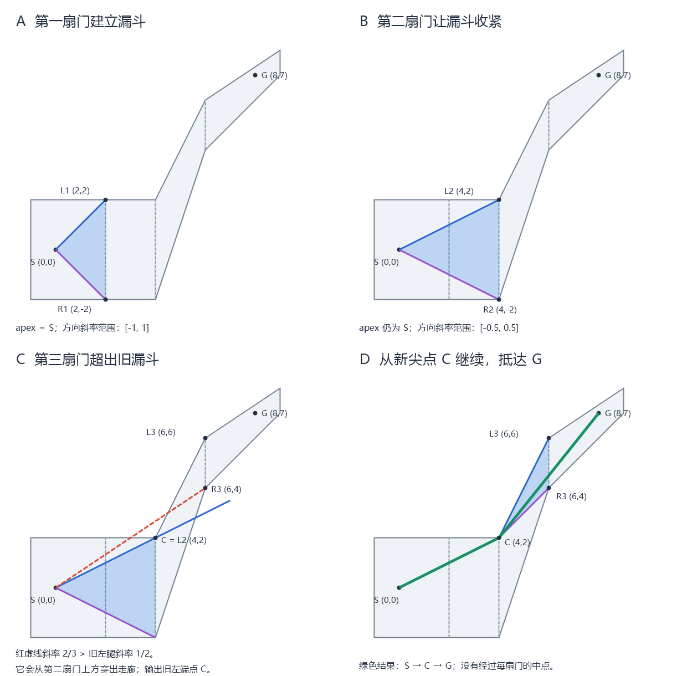

# GAMES104 第15–17节：Gameplay玩法系统完整梳理

<a id="combined-start"></a>

本合订本依次完整收录总览、第15节、第16节和第17节。建议先用总览建立依赖，再顺读分章；已有具体问题时，可直接使用总览中的问题与术语索引。分章显式锚点均原样保留，目录及章内链接都跳转到本文内部。

- [全景总览：课程地图、运行闭环与索引](#g00-start)
- [第15节：Gameplay玩法基础设施](#g15-position)
- [第16节：基础AI感知、决策与运动闭环](#g16-position)
- [第17节：规划、搜索与学习型决策](#g17-position)

---

## 总览：Gameplay 与 AI 全景-从玩法基础设施到可学习决策

<a id="g00-start"></a>

### 0. 从这里开始

**一句话总论：第15节建立“世界怎样接收意图并提交事实”，第16节建立“Agent 怎样有限地感知、选择行为并可靠执行”，第17节只升级“怎样产生更复杂的目标、计划与策略”；无论决策多高级，最终都必须通过 Task 与相应 Gameplay 接口落实效果，并从实际结果获得反馈。**

这组三章适合需要理解游戏引擎 Gameplay 架构、角色 AI、导航与规划、或准备把学习模型接入真实游戏的读者。它讨论的是运行时角色和策略 AI，不把内容生成、推荐系统或通用机器学习课程混入主线。读者可以顺读，也可把本页当作依赖导航：先定位问题，再跳到分章首次详解。

材料分为两层：

- **课程主料**来自 GAMES104 第15–17节原始字幕，经删除闲聊、合并 Part、恢复 ASR 术语后组织；
- **工程校正**补足生命周期、时序、A* 条件、POMDP、训练／推理边界等严格结论。各章的校正框不冒充讲师原话，集中入口为[第15节工程校正](#g15-corrections)、[第16节工程校正](#g16-corrections)和[第17节事实校正](#g17-corrections)。

三章不是“脚本课、寻路课、深度学习课”的并列合集。它们按依赖递进：AI 若没有 Gameplay 事实和角色接口，就无法作用于世界；高级规划若没有有限感知、Task 生命周期和运动反馈，就只是一张脱离运行时的算法图。

**流程图标记约定**：`【总览2.1-01】`表示总览2.1的第01个节点，`【15节1.2-01】`表示第15节1.2的第01个节点；分区代号统一使用“总览”“15节”“16节”“17节”。同一小节有多张编号图时，在小节号与节点号之间增加A／B／C等图标识。连续节点用`【15节1.2-03～05】`表示，跨图引用标明“对应”；原有`【15】`、`【16】`、`【17】`仍表示能力的章节归属。

---

<a id="g00-course-map"></a>

### 1. 课程为什么按第15→16→17节组织

#### 1.1 三章递进图

**读图提示：下图前半段的第15→16→17节，表示课程知识的依赖和能力的递进；后半段“回到第16／15节”，表示决策产物交给已有能力执行。它不是游戏每轮都要依次“运行完整个第15节→运行完整个第16节→运行完整个第17节”的时间流程。**

第16节本身已经介绍了能独立工作的基础 AI 闭环。第17节进一步扩展其中的决策与规划能力，既不整体替代第16节，也不是第16节执行完毕后必须追加的一站。首次阅读时，可以先看[三章概念与职责](#g00-chapter-roles)、[守卫受伤后求援的逐步案例](#g00-guard-alarm-example)，再对照[三种运行流程](#g00-basic-vs-advanced-loop)理解图中的箭头。

```text
已有引擎底座
GameObject/Component、Update、反射、物理、动画、渲染、音频、UI
        │
        ▼
┌─ 第15节 Gameplay 基础设施 ─────────────────────────────┐
│ Event：跨对象/系统传播请求与事实                        │
│ Script / Visual Scripting：开放可变规则与作者编排        │
│ 3C：Character、Control、Camera 把意图闭合为体验           │
└─────────────────┬──────────────────────────────────────┘
                  │ 世界事实、查询、语义 Action、角色接口
                  ▼
┌─ 第16节基础 AI 闭环 ───────────────────────────────────┐
│ Perception → Memory/Blackboard → FSM/BT → Task         │
│ 移动 Task → Navigation/Funnel → Steering/Crowd         │
│ 各类 Task → 相应 Character/Gameplay 接口 → 结果反馈    │
└─────────────────┬──────────────────────────────────────┘
                  │ 有限 Observation、成本、Task 与执行结果
                  ▼
┌─ 第17节高级决策 ───────────────────────────────────────┐
│ HTN：层级任务分解；GOAP：目标/动作搜索                   │
│ MCTS：采样模拟；MDP/RL/Policy：从数据和奖励学习          │
└─────────────────┬──────────────────────────────────────┘
                  │ Plan / macro action
                  ▼
           回到第16节 Task 执行链
                  │
           回到第15节提交 Gameplay 事实与反馈
                  └────────────► 下一 Tick / 下一决策
```

这里强调的是依赖关系和职责边界。第17节的 policy 输出 Attack 并不等于玩家受伤：它先成为受控 Action／Task，经第16节瞄准、移动或攻击任务，再由第15节武器和伤害规则提交事实。第16节的 A* 也不决定“为什么去那里”；它只在决策已经给出目标后，于特定图与成本上寻找 corridor。第15节 Event 则不替任何 Agent 思考，只传递已经定义的事实和请求。

#### 1.2 每章输入、加工和交付

| 章节                                     | 接收的输入                                                          | 本章加工                                                                         | 向下一层交付                                                                  |
| ---------------------------------------- | ------------------------------------------------------------------- | -------------------------------------------------------------------------------- | ----------------------------------------------------------------------------- |
| [第15节：Gameplay基础设施](#g15-position) | 对象、组件、Update、反射和物理/动画/渲染等服务                      | Event 数据契约与阶段；Script/VM/绑定；Visual Scripting；Character/Control/Camera | 可查询的权威世界、有类型事实、项目规则、语义 Action、合法角色执行与多模态反馈 |
| [第16节：基础AI闭环](#g16-position)       | 第15节世界事实、查询、角色和运动接口                                | 有限 Perception 与记忆；Blackboard；FSM/BT；导航表示、A*、Funnel、Steering/Crowd | Observation、主观认知、基础行动意图、可取消 Task、路径/运动服务与执行反馈     |
| [第17节：高级决策](#g17-position)         | 第16节有限认知、Action/Task、成本查询和执行反馈；可选 replay/模拟器 | HTN、GOAP、MCTS；MDP/RL；AlphaStar式编码、训练和部署                             | 动态 Plan、宏观 Action 或 policy 分布；仍交给第16、15节合法执行               |

上述交付涉及三种不同语义：**事实**说明世界已经发生什么，**认知**说明某 Agent 目前相信什么，**意图**说明它希望尝试什么。它们不与三个章节一一对应：第16节既形成认知，也通过基础决策产生意图。混为一体会造成 Event 被当状态库、Blackboard 被当权威世界、或模型预测被当真实结果。

#### 1.3 授课顺序与运行顺序

**授课顺序是“先建立玩法基础，再建立基础 AI，最后讨论复杂决策”；运行顺序则是“获取认知→作出决策→推进执行→落实结果→再次获取认知”。** 三个章节讲到的能力会在同一个运行闭环中协作，不是三个依次运行一次的独立程序。

第16节为了讲清基础，会先铺 Navigation，再讲 Steering、Crowd、Perception 和决策；真实运行时却是 Perception 先提供当前认知，Brain 才产生移动目标，Navigation 和 Steering 随后执行。类似地，第17节先讲传统规划再讲学习，不表示运行时必须串行调用 HTN→GOAP→MCTS→网络；项目只选择必要模块，或把它们放在不同时间尺度。

图中的章节编号表示“这项能力主要在哪一节学习”，不是强制的软件模块划分。例如，Character 在第15节介绍，第16节的运动链会继续使用它；交互 Task 可以由第16节的任务机制推进，而拾取物品、开门、触发警报的规则通过第15节的 Gameplay 接口实现。项目不需要真的建出三个名为“第15节系统”“第16节系统”“第17节系统”的模块。

<a id="g00-chapter-roles"></a>

#### 1.4 三章的职责与协作关系

**第15节建立玩法基础设施；第16节在其上形成完整的基础 AI；第17节按需扩展决策与规划。**

##### 1.4.1 先分清职责边界

| 章节                      | 回答的问题与职责                                                                        | 主要内容                                                            |
| ------------------------- | --------------------------------------------------------------------------------------- | ------------------------------------------------------------------- |
| 第15节：Gameplay 基础设施 | **行动怎样生效？** 组织引擎服务，检查条件、落实规则、修改状态并协调反馈           | Event、Script、Visual Scripting、3C，与物理、动画、音频等服务的协作 |
| 第16节：基础 AI           | **角色怎样感知、选择并执行？** 从有限认知、基础决策到任务执行和结果反馈，形成闭环 | Perception、Blackboard、FSM／BT、Task、导航与运动                   |
| 第17节：高级 AI           | **复杂目标怎样达成？** 生成行动计划，或通过搜索、学习选择策略                     | HTN、GOAP、MCTS、MDP／强化学习、学习型 Policy                       |

**Gameplay 同时提供世界信息和行动接口。** 它向 AI 提供可读取的世界状态、事件与查询，也负责组织引擎服务、验证规则、落实效果和反馈。玩家角色、被动机关与可破坏物件即使没有主动 AI，也依赖这些能力。

**Gameplay 规则与 AI 决策各有职责。** AI 选择“现在想尝试什么”，Gameplay 约束“允许做什么、实际产生什么结果”。AI 决定攻击，不等于直接扣除玩家生命值；弹药与冷却、命中和伤害仍由武器、物理及伤害等Gameplay规则处理。玩家发起同类行动也使用这些接口。

**基础 AI 已能独立工作。** 第16节让角色获得有限信息、保存认知，经 FSM／BT 选择行为、启动 Task 并根据成功、失败或受阻结果继续行动。例如“巡逻→发现玩家后追击→进入范围后攻击→丢失目标后到最后看见的位置搜索”，已经能构成可用的敌人，无须等第17节加入。

**高级方法按需加入。** 第17节使用已有认知和行动能力，补充或替换部分决策逻辑，不整体替代第16节；感知、记忆、Task、按需使用的导航／运动与结果反馈仍由已有能力承担。规划器或模型只提出意图、预测效果，生命、库存、门和警报的真实状态仍由 Gameplay 规则验证并修改。

“高级”不表示对所有项目更合适：行为简单、强调作者控制时，FSM／BT 可能已经足够；组合复杂时再考虑规划、搜索或学习。HTN、GOAP、MCTS、强化学习可单独选用或组合，不是必须依次运行的阶段。

##### 1.4.2 用守卫案例预览三种配置

同样是“玩家打伤守卫”，配置 A 只落实射击与受伤，配置 B 加入守卫主动求援的基础 AI，配置 C 再加入求援计划的生成。1.4 的职责、1.5 的案例与 1.6 的通用配置对应如下：

| 1.4 的职责                           | 1.5 的案例落点                                                                 | 1.6 的配置                                 |
| ------------------------------------ | ------------------------------------------------------------------------------ | ------------------------------------------ |
| 第15节：让行动合法生效并提交事实     | 玩家开火，命中结算使守卫生命值100→20，并产生表现反馈                          | A：Gameplay 执行闭环                       |
| 第16节：有限感知、基础决策与可靠执行 | 守卫得知受伤，行为树选择求援，Task 驱动前往警钟并敲钟                          | B：A + 基础 AI                             |
| 第17节：为复杂目标选择和组合行动     | 根据门、钥匙、警钟和同伴的已知状态，生成求援计划                               | C：B + 高级规划                            |
| 计划回到已有能力执行                 | “取钥匙→开门→敲钟”逐项经过 Task 和 Gameplay 验证，失败后反馈并按需调整计划 | C 复用 B 的执行能力和 A 的 Gameplay 权威链 |

下面用流程图连接这些职责；1.5 再逐步展开每个阶段。【15／16／17】表示能力主要在哪一章介绍。

```text
外部意图【15】（玩家按下开火键）
    ↓
形成语义Action / Gameplay请求【15】（Control形成“开火”意图）
    ↓
Gameplay验证并执行【15】（检查弹药/冷却、判定命中、结算伤害）
    ↓
权威事实与Event【15】（生命值100→20、发布受伤事实）
    ├─ 表现反馈【15】（受伤动画、音效、特效与UI）
    ├─ 配置A：没有主动AI，继续处理后续外部触发与世界更新
    └─ 配置B/C：经感知、记忆形成有限认知【16】（自身生命值为20、已知警钟位置等）
                         ↓
          ┌─ 配置B：基础决策【16】（行为树直接选择前往警钟）
          └─ 配置C：高级规划【17】（生成取钥匙→开门→敲钟等计划）
                         ↓
             执行控制与Task【16】（逐项交互；需要移动时调用导航与运动）
                         ↓
             回到Gameplay验证并落实【15】（物品、门和警钟真实状态）
                         ↓
             ├─ 实际世界变化与Event【15】→有限感知、更新认知【16】
             ├─ 表现反馈【15】（动画、音效、UI等）
             └─ Task执行反馈【16】→继续行为、推进计划或按需重新决策
```

图中表达职责之间的依赖、复用和反馈。学习上的“第15→16→17节”不等于每轮运行都按章节串行调用：配置 B 从基础决策直接进入 Task；配置 C 在认知与执行之间加入规划，参与决定下一步行动，再交给已有执行链推进。表现、感知与任务反馈各自消费相关事实或执行通知，不要求先播放完受伤动画，AI 才能得知受伤或处理任务结果。分支也不表示必须同时启动多个线程。

<a id="g00-guard-alarm-example"></a>

#### 1.5 逐步增加能力：从受伤到主动求援

以下沿用同一个守卫，依次增加 Gameplay、基础 AI 和高级规划能力。先关注每一步由谁负责，行为树与 GOAP 的内部算法留到分章展开。

**编号对照**：三个完整案例图保留本节编号，并以[1.6的通用配置](#g00-basic-vs-advanced-loop)为统一对照基准；下表两侧按相同尾号逐项对应。案例到1.6的跨图对应集中列在本表；同组配置之间的关系直接标在B／C的流程节点后，区分“新增”“读取结果”与“复用”。A提供基础能力，复用表示共享职责、机制和接口，不表示完整再执行一遍A或B；射击、开门、敲钟仍由各自的具体规则实现。短候选计划和1.5.4的单步回落图保持简洁。

| 本节完整案例流程            | 对应1.6基准流程      |
| --------------------------- | -------------------- |
| 配置A：【总览1.5.1-01～05】 | 【总览1.6-A-01～05】 |
| 配置B：【总览1.5.2-01～09】 | 【总览1.6-B-01～09】 |
| 配置C：【总览1.5.3-01～10】 | 【总览1.6-C-01～10】 |

##### 1.5.1 配置 A：先让射击与受伤生效【15】

守卫起初有100点生命，玩家的一次攻击造成80点伤害。即使守卫只是站在原地的被动对象，也需要完成：

```text
【总览1.5.1-01】 玩家意图 / Script触发 / 网络命令 / 世界变化【15】
（案例：玩家按下开火键）
    ↓
【总览1.5.1-02】 形成语义Action / Gameplay请求【15】
（案例：Control形成“开火”意图）
    ↓
【总览1.5.1-03】 Gameplay规则验证请求，并组织Character、物理等能力执行【15】
（案例：检查弹药与冷却→物理判定命中→结算伤害）
    ↓
【总览1.5.1-04】 提交新的权威世界状态与Event【15】
（案例：守卫生命值100→20，发布受伤事实）
    ↓
【总览1.5.1-05】 动画、音效、特效、UI、Camera等呈现反馈【15】
（案例：播放受伤动画、音效和特效，更新UI）
    └────────→ 下一次外部意图、脚本触发或世界更新
```

输入系统检测按键，Control 把设备信号转换为“开火”意图；Gameplay 按规则组织物理、动画、音频等能力。Event 传播请求和事实，Script 或原生规则检查与结算，3C 参与控制、执行和反馈。图中的“按键与 Control→武器、物理和伤害规则→生命变化与受伤事件→动画等表现”，分别落实意图、执行、事实与反馈。**此时“守卫已经受伤”是世界事实，受伤动画本身还不代表它决定逃跑或求援。**

##### 1.5.2 配置 B：守卫选择求援并执行【16＋15】

为守卫加入感知、记忆、行为树、Task 和导航。假设它预先知道警钟位置，警钟可用、路线可通行，作者给出规则：

> 如果生命值低于30，就前往警钟求援；否则继续战斗。

守卫依据受伤后的状态作出选择，并完成移动与敲钟：

```text
【总览1.5.2-01】 世界状态与事件【15】（读取【总览1.5.1-04】的结果）
（守卫生命值为20，受伤事实已经发布）
    ↓
【总览1.5.2-02】 感知、记忆，形成当前认知【16】（新增）
（知道自身受伤，并记得警钟位置）
    ↓
【总览1.5.2-03】 基础决策与执行控制，例如行为树【16】（新增）
（行为树选择“前往警钟求援”）
    ↓
【总览1.5.2-04】 启动并推进Task；需要移动时调用导航与运动【16】（新增）
（推进MoveTo；沿路移动由下方Gameplay执行链反复落实，到达后再交互）
    ├─ 寻路失败／取消等：转【总览1.5.2-09】
    ↓ 需要向世界发起行动时
来源1：AI Task形成语义Action请求【16】（运动意图或尝试敲钟；新增AI来源）
    │
    │  来源2：玩家／Script／网络／世界触发形成请求【15】（沿用【总览1.5.1-01～02】，独立到达）
    │      │
    └──┬───┘
       ↓
【总览1.5.2-05】 请求接入相应Gameplay接口【15】（接入【总览1.5.1-03】前的请求入口，A图未单列）
    ↓
【总览1.5.2-06】 Gameplay规则验证请求，并组织Character、物理等能力执行【15】（复用【总览1.5.1-03】的执行职责）
（移动时由Character／物理落实位移；敲钟时检查交互距离和警钟状态）
    ├─ 拒绝／执行失败：转【总览1.5.2-09】，不提交未发生的成功效果
    ↓ 实际效果生效时
【总览1.5.2-07】 提交新的权威世界状态与Event【15】（复用【总览1.5.1-04】的提交职责）
（案例：成功后提交“警报已触发”）
    ├─ 世界反馈：相关事实可供后续感知更新认知
    ├─ 表现分支
    │  【总览1.5.2-08】 动画、音效、特效、UI、Camera等呈现反馈【15】（复用【总览1.5.1-05】的反馈职责）
    │  （案例：播放钟声并呈现关卡反馈）
    └─ 有对应AI Task时，按其完成条件反馈，无须等待上述表现播放完毕
       【总览1.5.2-09】 Task处理执行反馈：Running，或Success / Failure / Cancelled等结果【16】（新增；可附Blocked等原因）
           └────────→ 继续推进任务，或再次感知、继续／调整行为
```

按图逐步看，每一步新增或调用的能力是：

1. **得知自身状态**：通过自身状态接口和受伤通知，得知生命值为20；只读取玩法允许的信息。
2. **形成当前认知**：保存自身状态与已知警钟位置，不复制世界中的全部隐藏信息。
3. **作出基础决策**：行为树检查“生命值低于30”，选择预写的求援分支。
4. **启动移动任务**：Task 接收“到达警钟交互范围”的目标，管理开始、持续执行、完成或失败。
5. **实际前往警钟**：导航找路，运动控制处理转向与避让，Character 和物理落实移动。
6. **发起敲钟交互**：到达交互范围后，Task 调用警钟接口。
7. **让求援生效**：警钟规则验证交互条件（如距离）与警钟状态，成功后更新警报、播放钟声，并按关卡规则通知附近守卫。
8. **接收结果**：Task 报告成功或失败，守卫据此选择后续行为。

这8个讲解步骤覆盖图中职责，编号不与图中节点一一对应：第1–2步展开【总览1.5.2-02】的认知形成，第3步对应【总览1.5.2-03】的决策，第4–6步展开Task、导航与请求，第7步覆盖【总览1.5.2-05～08】的交互执行和反馈，第8步对应【总览1.5.2-09】。第5步的实际移动同样要反复经过Gameplay执行链，不能在调用Character／物理之前就算作已经到达；第7步的钟声播放完毕也不是第8步接收任务结果的默认前提。

AI Task 成为新增的请求来源，与玩家、Script 等复用已有 Gameplay 规则。**选择求援是 AI 的决定；警报真正触发，仍以警钟交互成功为准。** 到这里，基础 AI 的感知、决策、执行与反馈已经闭合，第17节不是它运行的必要下一站。

##### 1.5.3 配置 C：根据环境生成求援计划【17＋16＋15】

现在加入更多可能性：

- 警钟损坏，敲钟无法求援；
- 门被锁住，需要先取得钥匙；
- 附近有可直接通知的同伴；
- 钥匙可能在执行期间被别人拿走。

这些情况仍可用行为树增加分支处理；组合增多时，可以考虑用规划减少逐条编排行动顺序的工作。以 GOAP 为例，作者提供：

> **目标**：让援军得知这里发生了战斗。
> **可用行动**：前往目标位置、取得钥匙、打开门、敲响警钟、直接通知同伴。
> **行动信息**：每项行动需要什么条件、预期会产生什么结果、付出什么代价。

规划器依据已知条件组合行动。若守卫知道警钟完好、门已锁、钥匙位置已知，可能生成：

```text
前往钥匙处并拾取
    → 前往门口并开门
    → 前往警钟
    → 敲响警钟
```

若已知警钟损坏，但同伴的位置已知且可到达，则可能选择：

```text
前往同伴的位置
    → 直接通知同伴
```

计划接入原有执行链后的完整流程如下：

```text
【总览1.5.3-01】 世界状态与事件【15】（沿用【总览1.5.2-01】的世界事实输入）
（门已锁、钥匙仍在、警钟完好、同伴位置等实际状态）
    ↓
【总览1.5.3-02】 感知、记忆，形成当前认知【16】（复用【总览1.5.2-02】）
（守卫只知道权限与感知允许获得的条件）
    ↓
【总览1.5.3-03】 高级规划，例如 GOAP【17】（新增规划）
（GOAP生成“取钥匙→开门→敲钟”）
    ↓
【总览1.5.3-04】 执行控制接收当前计划步骤，并处理中断与fallback【16】（复用【总览1.5.2-03】的执行控制职责，可保留基础反应）
（推进当前步骤，并处理遇袭中断与fallback）
    ↓
【总览1.5.3-05】 启动并推进Task；需要移动时调用导航与运动【16】（复用【总览1.5.2-04】）
（逐项MoveTo、拾取、开门和交互）
    ├─ 寻路失败／取消等：转【总览1.5.3-10】
    ↓ 需要向世界发起行动时
来源1：AI Task形成语义Action请求【16】（运动、拾取、开门或敲钟；沿用B的AI来源）
    │
    │  来源2：玩家／Script／网络／世界触发形成请求【15】（沿用【总览1.5.1-01～02】，独立到达）
    │      │
    └──┬───┘
       ↓
【总览1.5.3-06】 请求接入相应Gameplay接口【15】（复用【总览1.5.2-05】）
    ↓
【总览1.5.3-07】 Gameplay规则验证请求，并组织Character、物理等能力执行【15】（复用【总览1.5.2-06】及【总览1.5.1-03】的执行职责）
（重新检查物品、门和警钟的真实状态）
    ├─ 拒绝／执行失败：转【总览1.5.3-10】，不提交未发生的成功效果
    ↓ 实际效果生效时
【总览1.5.3-08】 提交新的权威世界状态与Event【15】（复用【总览1.5.2-07】及【总览1.5.1-04】的提交职责）
（案例：实际修改库存、门或警报状态）
    ├─ 世界反馈：相关事实可供后续感知更新认知
    ├─ 表现分支
    │  【总览1.5.3-09】 动画、音效、特效、UI、Camera等呈现反馈【15】（复用【总览1.5.2-08】及【总览1.5.1-05】的反馈职责）
    │  （案例：呈现拾取、开门、敲钟及关卡响应）
    └─ 有对应AI Task时，按其完成条件反馈，无须等待上述表现播放完毕
       【总览1.5.3-10】 Task处理执行反馈：Running，或Success / Failure / Cancelled等结果【16】（复用【总览1.5.2-09】；可附Blocked等原因，并可反馈给规划层）
           └────────→ 继续推进任务、更新认知、推进计划或按需重新规划【16／17】
```

本阶段新增的是**根据目标和已知条件选择求援方式、组合行动计划**。门、钥匙、警钟和同伴的已知状态仍由第16节的感知与记忆提供；规划器只使用允许的认知或玩法知识，不会自动获得墙后或战争迷雾中的实时状态。第17节参与“接下来做什么”的决策，不是守卫敲完钟后的追加处理；后续仍通过配置 B 的请求与执行链，由配置 A 的 Gameplay 规则落实。

##### 1.5.4 计划怎样逐项落地：回到第16／15节执行

生成“取钥匙→开门→敲钟”时，守卫可能仍站在受伤的位置。计划只是安排和预测，实际效果需要逐项落实：

| 计划中的要求 | 第16节侧的任务与运动能力                             | 第15节侧的规则与实际效果                                         |
| ------------ | ---------------------------------------------------- | ---------------------------------------------------------------- |
| 取得钥匙     | 移动到钥匙附近，启动并等待拾取交互任务               | 检查距离和物品是否仍存在，成功后把钥匙加入库存并更新场景物品状态 |
| 打开锁着的门 | 移动到门附近，推进开门交互任务                       | 检查钥匙与门的规则，修改门状态，并协调碰撞与动画等变化           |
| 前往警钟     | 根据当前可通行情况寻路，推进移动任务，处理受阻和到达 | Character、物理与动画等已有接口落实实际运动                      |
| 敲响警钟     | 到达交互范围，启动敲钟任务并等待结果                 | 检查警钟是否完好、交互是否有效，成功后触发警报、声音及关卡响应   |

表中按课程重点拆分职责，实际执行时两侧持续协作，并非先运行完整个第16节再一次性调用第15节。走路时，Task 推进与 Character／物理执行反复发生；每个交互生效后，相关世界状态就按项目规定的阶段更新。

如果钥匙已被拿走，拾取会失败，规则不会凭空生成钥匙。执行链反馈失败后，守卫更新认知，规划器才可能改选“直接通知同伴”。**预测效果必须经过实际执行验证，不能直接写成世界事实。** 单个计划步骤的执行与反馈如下：

```text
执行控制取出当前Plan步骤【16】（Plan由第17节规划器生成）
    ↓
执行控制启动并推进Task【16】
    ↓
AI Task形成语义Action请求【16】
    ↓
Gameplay入口重新验证并落实真实结果【15】
    ↓
Task依据执行反馈和完成条件更新状态【16】
    ├─ Running：继续推进；暂时受阻时可等待或局部恢复【16】
    ├─ Success：检查后续步骤是否仍适用，再推进；全部完成则结束计划【16】
    ├─ Failure／持续受阻：更新认知，按策略重试、重新寻路或重新规划【16／17】
    └─ Cancelled：清理当前任务，由执行控制切换到新的行为【16】
```

这里“回到第16节”是交给任务与运动能力执行，“回到第15节”是通过规则和引擎接口落实实际效果；“下一 Tick／下一决策”则表示结果再次成为感知与选择的依据。

<a id="g00-basic-vs-advanced-loop"></a>

#### 1.6 三种运行流程：Gameplay、基础 AI 与加入高级规划后的 AI

下面三图保留 1.5 案例图中的抽象节点与分支关系，去掉括号中的守卫、钥匙和警钟细节，便于逐行对照、迁移到其他玩法。每条链可以跨帧完成；章节标记表示知识归属，不是独立模块名称。

**本节是跨图对应的统一基准。** 三图分别使用`【总览1.6-A-01】`、`【总览1.6-B-01】`、`【总览1.6-C-01】`等节点编号。案例、技术展开和分章从各自节点指向本节；本节不挂回各图的节点编号。编号用于定位职责，不表示必须按尾号串行执行全部节点；例如B的08与09分别属于表现和执行反馈分支。“来源1／来源2”是独立到达的请求来源，汇入箭头不要求二者同时产生或彼此等待；来源标签与回边不另算步骤。

B／C图中的行末标注直接说明相对A或B的关系：“新增”是本配置增加的能力，“读取结果”表示消费已有事实，“复用”表示沿用相应职责或接口。同一行列出B和A，是沿用B及其A基础，不表示依次完整执行两套配置。

**配置 A：Gameplay 执行闭环，没有主动 AI（对应 1.5.1）。**

Script、网络等来源不必经过设备采样与Control。

```text
【总览1.6-A-01】 玩家意图 / Script触发 / 网络命令 / 世界变化【15】
    ↓
【总览1.6-A-02】 形成语义Action / Gameplay请求【15】
    ↓
【总览1.6-A-03】 Gameplay规则验证请求，并组织Character、物理等能力执行【15】
    ↓
【总览1.6-A-04】 提交新的权威世界状态与Event【15】
    ↓
【总览1.6-A-05】 动画、音效、特效、UI、Camera等呈现反馈【15】
    └────────→ 下一次外部意图、脚本触发或世界更新
```

配置B／C复用其中“验证执行→事实提交→表现反馈”的职责；敲钟、拾取等行动调用相应交互规则，不照搬射击的武器与伤害链。

配置 A 已能把外部意图或触发变成合法的世界结果与体验反馈，独立完成玩法闭环。Script 预设“受伤时播放动画”或“受伤立即触发机关”属于规则响应，还没有形成角色基于认知自主选择行动的 Agent 闭环。

**配置 B：A + 基础 AI，主动选择并推进任务（对应 1.5.2）。**

```text
【总览1.6-B-01】 世界状态与事件【15】（来源包括【总览1.6-A-04】的结果及后续世界更新）
    ↓
【总览1.6-B-02】 感知、记忆，形成当前认知【16】（新增）
    ↓
【总览1.6-B-03】 基础决策与执行控制，例如行为树【16】（新增）
    ↓
【总览1.6-B-04】 启动并推进Task；需要移动时调用导航与运动【16】（新增）
    ├─ 寻路失败／取消等：转【总览1.6-B-09】
    ↓ 需要向世界发起行动时
来源1：AI Task形成语义Action请求／运动意图【16】（新增AI来源）
    │
    │  来源2：玩家／Script／网络／世界触发形成请求【15】（沿用【总览1.6-A-01～02】，独立到达）
    │      │
    └──┬───┘
       ↓
【总览1.6-B-05】 请求接入相应Gameplay接口【15】（接入【总览1.6-A-03】前的请求入口，A图未单列）
    ↓
【总览1.6-B-06】 Gameplay规则验证请求，并组织Character、物理等能力执行【15】（复用【总览1.6-A-03】的执行职责）
    ├─ 拒绝／执行失败：转【总览1.6-B-09】，不提交未发生的成功效果
    ↓ 实际效果生效时
【总览1.6-B-07】 提交新的权威世界状态与Event【15】（复用【总览1.6-A-04】的提交职责）
    ├─ 世界反馈：相关事实可供后续感知更新认知
    ├─ 表现分支
    │  【总览1.6-B-08】 动画、音效、特效、UI、Camera等呈现反馈【15】（复用【总览1.6-A-05】的反馈职责）
    └─ 有对应AI Task时，按其完成条件反馈，无须等待上述表现播放完毕
       【总览1.6-B-09】 Task处理执行反馈：Running，或Success / Failure / Cancelled等结果【16】（新增；可附Blocked等原因）
           └────────→ 继续推进任务，或再次感知、继续／调整行为
```

配置 B 新增感知、认知、基础决策、Task 与结果反馈，使 AI Task 成为新的请求生产者【16】；玩家意图、Script 触发、网络命令与世界变化仍由原有 Gameplay 能力形成请求【15】。两类来源按行动接入相应 Gameplay 接口，复用配置 A 的规则验证、角色执行、事实提交和表现反馈，加入 AI 不会把这些职责改归第16节。Task 状态与结果由第16节侧依据执行通知和完成条件判定，也可以来自寻路失败、超时或取消等任务内部过程。

**配置 C：B + 高级规划，生成计划后复用已有执行能力（对应 1.5.3–1.5.4）。**

```text
【总览1.6-C-01】 世界状态与事件【15】（沿用【总览1.6-B-01】的世界事实输入）
    ↓
【总览1.6-C-02】 感知、记忆，形成当前认知【16】（复用【总览1.6-B-02】）
    ↓
【总览1.6-C-03】 高级规划，例如 GOAP【17】（新增规划）
    ↓
【总览1.6-C-04】 执行控制接收当前计划步骤，并处理中断与fallback【16】（复用【总览1.6-B-03】的执行控制职责，可保留基础反应）
    ↓
【总览1.6-C-05】 启动并推进Task；需要移动时调用导航与运动【16】（复用【总览1.6-B-04】）
    ├─ 寻路失败／取消等：转【总览1.6-C-10】
    ↓ 需要向世界发起行动时
来源1：AI Task形成语义Action请求／运动意图【16】（沿用B的AI来源）
    │
    │  来源2：玩家／Script／网络／世界触发形成请求【15】（沿用【总览1.6-A-01～02】，独立到达）
    │      │
    └──┬───┘
       ↓
【总览1.6-C-06】 请求接入相应Gameplay接口【15】（复用【总览1.6-B-05】）
    ↓
【总览1.6-C-07】 Gameplay规则验证请求，并组织Character、物理等能力执行【15】（复用【总览1.6-B-06】及【总览1.6-A-03】的执行职责）
    ├─ 拒绝／执行失败：转【总览1.6-C-10】，不提交未发生的成功效果
    ↓ 实际效果生效时
【总览1.6-C-08】 提交新的权威世界状态与Event【15】（复用【总览1.6-B-07】及【总览1.6-A-04】的提交职责）
    ├─ 世界反馈：相关事实可供后续感知更新认知
    ├─ 表现分支
    │  【总览1.6-C-09】 动画、音效、特效、UI、Camera等呈现反馈【15】（复用【总览1.6-B-08】及【总览1.6-A-05】的反馈职责）
    └─ 有对应AI Task时，按其完成条件反馈，无须等待上述表现播放完毕
       【总览1.6-C-10】 Task处理执行反馈：Running，或Success / Failure / Cancelled等结果【16】（复用【总览1.6-B-09】；可附Blocked等原因，并可反馈给规划层）
           └────────→ 继续推进任务、更新认知、推进计划或按需重新规划【16／17】
```

这里采用一种混合架构：高级决策在认知与执行之间生成 Plan／宏观行动（macro action），图中以 GOAP 计划为例；BT 或其他执行控制继续推进 Task、处理中断与 fallback。玩家突然近身攻击时，可以先暂停或取消原计划并格挡，随后继续或重新规划。项目也可由 Planner 替换部分基础决策，不必保留 BT；有限认知、Task 生命周期（含取消）、按需调用导航／运动和接收结果反馈的能力仍需保留。

三种配置都按行动需要调用服务：原地使用物品、呼叫或等待交互结果可直接调用相应接口；需要移动时才调用导航与运动能力。

**读这些流程时，还要保留四个执行约定：**

- **共用规则按行动理解。** “Gameplay入口”是职责上的概括，可以由Character、武器、物品、门等多个接口实现；玩家和AI的同类行动复用相应规则，不要求全项目只有一个入口函数，也不要求每种触发都包装成排队的Command。同一角色的冲突请求还要按控制权和动作资源仲裁。执行反馈按请求／Task句柄回到相应发起者；图中的AI Task结果分支只处理与该任务关联的执行，玩家或脚本的独立请求不会凭空产生一个AI任务结果。
- **主路径展示会产生世界效果的行动。** 请求可被拒绝，任务也可在发出请求前失败或取消；这些路径直接反馈，不提交未发生的成功效果。已发生的部分效果是否保留由规则决定，失败不自动回滚整个计划。纯等待或查询任务可以按自身契约完成，无须修改世界或发布Event。
- **世界更新与任务结束是两回事。** MoveTo跨帧反复提交运动意图，Character／物理落实位移，Task仍可保持Running；感知可以读取中途提交的世界事实。请求被接受也不等于Task成功：例如“发出一枪”和“击败目标”的完成条件不同。暂时受阻可以等待或局部恢复，持续失败再按策略重试、重新寻路或重新规划；Blocked可作为扩展状态或失败原因，不是所有BT通用的第四种返回值。
- **表现与执行反馈分别推进。** 纯音画反馈不构成AI感知、Task完成的默认前提。若任务确实要等待开门动画的通行时刻、攻击命中窗口或指定动画结束，应把该通知明确纳入任务与Gameplay规则契约；图中的“呈现反馈”指表现职责，动画参与动作执行则归在“组织Character、物理等能力执行”阶段。

上述职责拆分也可对照具体引擎：UE的[Gameplay Ability System说明](https://dev.epicgames.com/documentation/en-us/unreal-engine/understanding-the-unreal-engine-gameplay-ability-system)区分Ability Task的执行生命周期与Gameplay Cue的纯音画反馈；[Behavior Tree总览](https://dev.epicgames.com/documentation/en-us/unreal-engine/behavior-tree-in-unreal-engine---overview)说明条件观察器可以触发中断。这些是工程实现的例证，不表示所有引擎必须使用UE的类名或调度方式。

**公共Gameplay阶段的等价位置**如下。其他图可以主要引用配置A的公共阶段；B／C对应位置保留各自编号，感知、决策与Task结果则引用相应的B／C节点。

| 公共阶段           | 配置A            | 配置B            | 配置C            |
| ------------------ | ---------------- | ---------------- | ---------------- |
| 规则验证与实际执行 | 【总览1.6-A-03】 | 【总览1.6-B-06】 | 【总览1.6-C-07】 |
| 权威状态与事件提交 | 【总览1.6-A-04】 | 【总览1.6-B-07】 | 【总览1.6-C-08】 |
| 表现反馈           | 【总览1.6-A-05】 | 【总览1.6-B-08】 | 【总览1.6-C-09】 |

#### 1.7 对三个常见疑问的直接回答

| 疑问                                                                           | 应怎样理解                                                                                                                                                           |
| ------------------------------------------------------------------------------ | -------------------------------------------------------------------------------------------------------------------------------------------------------------------- |
| “第15节获取各系统的数据，第16节根据这些数据做 AI 决策并驱动游戏”，是否准确？ | 只概括了一部分。第15节还负责组织玩法规则、执行接口和反馈；第16节不只决策，还覆盖感知、认知、任务、导航、运动与结果反馈。没有 AI 时，玩家操作和被动玩法同样可以运行。 |
| 第17节是第16节的扩展，还是第16节结束后的下一个流程？                           | **是对决策与规划能力的扩展。** 它可以补充或替换部分基础决策方法，不是第16节整个流程结束后的必经步骤，也不整体替代第16节。                                      |
| 为什么第17节之后又回到第16、15节？                                             | **因为决定和计划还不是实际效果。** 第17节选出行动，第16节的执行链推进任务，第15节的 Gameplay 规则验证并落实结果；实际结果再反馈给下一轮决策。                  |

第一次阅读时，能把下面三个问题分开即可：**第15节讲“行动怎样生效”，第16节讲“角色怎样感知、选择和执行”，第17节讲“复杂决策和行动组合怎样产生”。** 后续分章再逐步解释每项技术如何实现这些职责。

---

<a id="g00-runtime-loop"></a>

### 2. 完整运行时闭环

#### 2.1 从输入或世界刺激到下一次决策

**本图与 1.4–1.6 的职责和闭环一致，区别在于起点与展开粒度。** [1.4 的总图](#g00-chapter-roles)预览“外部行动生效→AI 作出反应”，[1.5 的守卫案例](#g00-guard-alarm-example)逐步解释射击、受伤与求援，[1.6 的三种配置](#g00-basic-vs-advanced-loop)提取通用节点。本图把它们接成连续的信息流，并进一步展开 Perception、Memory、Task、Navigation 和 Steering。

图中【总览2.1-01～12】是本节的节点编号，【15／16／17】仍表示知识归属。【总览2.1-03】先处理外部请求，所得世界事实就是配置 B／C 的起点；【总览2.1-09～12】再展开 AI 或其他后续请求的执行与反馈。两处复用同一套 Gameplay 能力，每条链可以跨帧推进。

本图用自身编号定位步骤，用章节标签表示能力归属；与1.6的完整对应关系集中列在图后表格。一个本图节点可以合并多个基准步骤，多个本图节点也可以共同展开一个基准步骤。

```text
【总览2.1-01】 外部触发【15】
   玩家设备输入 / Script触发 / 网络命令 / 定时与世界变化
        │
        ▼
【总览2.1-02】 形成语义请求【15】
   Control 与 Gameplay 规则：语义 Action / Command / Request
   （案例：玩家按键被映射成“开火”请求）
        │
        ▼
【总览2.1-03】 Gameplay处理请求，形成当前世界状态与事件【15】
   公共Gameplay入口：规则验证 → 组织Character/物理等执行
   → 提交Gameplay State，通过Event发布对象、属性、门、声音、命中等事实
   （案例：检查弹药/冷却、判定命中、结算伤害，生命值100→20）
        ├─ 呈现本次表现反馈（与【总览2.1-11】相同的能力；案例：受伤动画、音效、UI）
        ├─ 配置A：等待下一次外部触发 → 【总览2.1-01】
        └─ 配置B/C：世界事实成为AI外部刺激，继续向下
                    （若刺激已经发生，可从当前世界状态开始）
        │
        ▼
【总览2.1-04】 感知【16】
   Perception：视听/自身/空间查询，只产生合法Observation
   （案例：从自身状态接口和受伤通知得知生命值为20）
        │
        ▼
【总览2.1-05】 记忆与当前认知【16】
   Memory / Blackboard / subjective WorldState / observation history
   （案例：保留自身状态、已知警钟位置；规划时还需已知门、钥匙等条件）
        │
        ▼
【总览2.1-06】 决策层：按配置选用或组合
   配置B：FSM / BT基础决策【16】（生命值低于30 → 选择求援）
   配置C：HTN / GOAP / MCTS / learned Policy扩展决策【17】
          （案例：GOAP生成“取钥匙→开门→敲钟”）
        │
        ▼
【总览2.1-07】 执行控制与Task推进【16】
   Action / Plan → Task Runner：启动、持续执行、处理中断与fallback
   （配置B推进选中的行为；配置C接收当前计划步骤；可由BT等承担）
        ├─ 取消／任务内部失败等 → 【总览2.1-12】
        │
        ▼
【总览2.1-08】 按Task需要调用能力，形成执行请求【16】
   ├─ 非运动Task：使用物品、交互、武器、建造、发消息
   │              → 相应语义Action请求（案例：拾取、开门或敲钟）
   └─ 运动Task：Navigation投影 → 图搜索/A* → polygon corridor → Funnel corners
                  → Steering / Crowd：preferred velocity、加减速、转向、局部避碰
                  → 运动意图（案例：沿路径前往警钟交互范围）
        ├─ 寻路失败等 → 【总览2.1-12】
        │ 两类Task按需要向Gameplay提交请求或运动意图
        ▼
【总览2.1-09】 请求接入相应Gameplay接口，验证并落实实际执行【15】
   请求来源：AI Task（【总览2.1-07～08】）；玩家/Script/网络/世界触发也可独立进入（【总览2.1-02】）
   Gameplay规则重新检查条件；Character / Animation / Physics落实合法运动与动作
   （案例：移动时落实碰撞约束；交互时检查距离、物品、门或警钟的真实状态）
   ※ 与【总览2.1-03】使用同一套公共入口和执行能力，此处展开后续请求的处理
        ├─ 拒绝／执行失败 → 【总览2.1-12】，不提交未发生的成功效果
        │ 实际效果生效时
        ▼
【总览2.1-10】 提交新的权威世界状态与Event【15】
   Script/Gameplay transaction：生命、库存、资源、占位等权威提交
   （案例：钥匙进入库存、门被打开，或警报真正触发）
        ├─ 世界反馈 → 【总览2.1-04～05】（Task仍在运行时也可更新认知）
        ├─ 表现分支
        │  【总览2.1-11】 呈现反馈【15】
        │     Animation / VFX / Audio / UI / Camera / Haptics：消费事实并形成体验
        │     （案例：拾取/开门/敲钟动画、钟声与关卡反馈）
        └─ 有对应AI Task时，按其契约反馈，不默认等待表现分支完成
           【总览2.1-12】 任务状态、结果与下一轮反馈【16／17】
              Running / Success / Failure / Cancelled，可附Blocked等原因
              → 继续推进Task【总览2.1-07】；或按结果再次感知【总览2.1-04】、更新认知【总览2.1-05】、调整决策【总览2.1-06】或推进下一Task
              → 按需记录reward、遥测与离线日志
```

**从本图查1.6基准流程，并对照1.5案例：**

| 本图节点                                                                         | 对应1.6基准节点                                                                                            | 原流程环节                                       | 1.5中的守卫案例与步骤                                                          |
| -------------------------------------------------------------------------------- | ---------------------------------------------------------------------------------------------------------- | ------------------------------------------------ | ------------------------------------------------------------------------------ |
| 【总览2.1-01】 外部触发                                                          | 【总览1.6-A-01】                                                                                           | 外部意图／Script／网络／世界变化                 | 1.5.1：玩家按下开火键                                                          |
| 【总览2.1-02】 形成语义请求                                                      | 【总览1.6-A-02】                                                                                           | 形成语义Action／Gameplay请求【15】               | 1.5.1：Control把按键转换为“开火”                                             |
| 【总览2.1-03】 初次请求处理及其表现分支；后续请求展开为【总览2.1-09～11】        | 【总览1.6-A-03～05】                                                                                       | Gameplay验证执行→提交事实→表现反馈             | 1.5.1：弹药与冷却检查、命中、生命值100→20、受伤表现                           |
| 【总览2.1-03】或【总览2.1-10】提交的世界事实，以及其他已发生的世界更新           | 【总览1.6-B-01】／【总览1.6-C-01】                                                                         | 世界状态与事件【15】                             | 配置B／C从这里接入：受伤已成立，随后AI才据此选择行动；不依赖表现完成           |
| 拆成【总览2.1-04】 Perception与【总览2.1-05】 Memory／Blackboard                 | 【总览1.6-B-02】／【总览1.6-C-02】                                                                         | 感知、记忆，形成当前认知【16】                   | 1.5.2第1–2步：得知自身状态，记住已知警钟位置                                  |
| 配置B的【总览2.1-06】，加上【总览2.1-07】执行控制与Task启动                      | 【总览1.6-B-03～04】                                                                                       | 基础决策、执行控制与Task启动【16】               | 1.5.2第3–4步：选择求援、启动移动Task                                          |
| 配置C的【总览2.1-06】 → 【总览2.1-07】                                          | 【总览1.6-C-03～04】                                                                                       | 高级规划【17】→执行控制接收计划【16】           | 1.5.3：生成“取钥匙→开门→敲钟”；1.5.4逐步执行                               |
| 【总览2.1-07】管理Task，【总览2.1-08】展开非运动与运动分支                       | 【总览1.6-B-04】／【总览1.6-C-05】                                                                         | 启动并推进Task；需要移动时调用导航与运动【16】   | 1.5.2第4–6步：启动、找路与跟随、发起交互；第5步的实际位移由【总览2.1-09】落实 |
| 【总览2.1-07～08】产生请求，送往【总览2.1-09】                                   | 【总览1.6-B-04】／【总览1.6-C-05】及其后的“来源1”                                                        | AI Task形成语义Action请求【16】                  | 1.5.2第6步：尝试敲钟；1.5.4还包括拾取与开门请求                                |
| 【总览2.1-09】，也可独立接收来自【总览2.1-02】的外部请求                         | 【总览1.6-B-05～06】／【总览1.6-C-06～07】                                                                 | 各来源按行动接入相应Gameplay接口并验证执行【15】 | 1.5.2第7步、1.5.4职责表：检查真实条件，通过规则与角色接口执行                  |
| 【总览2.1-10】                                                                   | 【总览1.6-A-04】                                                                                           | 提交新的权威世界状态与Event【15】                | 1.5.2第7步、1.5.4：实际修改警报、库存、门等状态                                |
| 【总览2.1-11】；【总览2.1-03】也调用同样的表现能力                               | 【总览1.6-A-05】                                                                                           | 动画、音效、特效、UI、Camera等反馈【15】         | 1.5.2第7步：播放钟声并呈现结果；本图还列出Haptics（触觉反馈）                  |
| 【总览2.1-12】 → 【总览2.1-04】／【总览2.1-05】／【总览2.1-06】／【总览2.1-07】 | 【总览1.6-B-09】／【总览1.6-C-10】                                                                         | Task结果→再次感知、决策或规划【16／17】         | 1.5.2第8步、1.5.4末图：根据实际结果继续行为、推进计划或处理失败                |
| 【总览2.1-07～09】的失败／取消分支 → 【总览2.1-12】                             | 【总览1.6-B-04】／【总览1.6-B-06】→【总览1.6-B-09】；【总览1.6-C-05】／【总览1.6-C-07】→【总览1.6-C-10】 | 任务或执行失败直接反馈                           | 钥匙已被拿走时拾取失败，不提交“得到钥匙”的成功效果                           |

读配置 A 时，从 **【总览2.1-01】→【总览2.1-02】→【总览2.1-03】** 查看外部请求的执行及其表现反馈；后续输入与世界更新继续到来，不必等待音画播放完毕。读配置 B／C 时，从 **【总览2.1-03】的世界事实→【总览2.1-04～10】** 查看认知、决策和成功执行的主路径；【总览2.1-10】可分别触发表现分支【总览2.1-11】、世界认知更新以及Task反馈【总览2.1-12】，不要求依次执行10→11→12。失败／取消也可从【总览2.1-07～09】直接反馈至【总览2.1-12】。B与C的区别主要在【总览2.1-06】怎样产生行动或计划。后续外部请求可以从【总览2.1-02】独立进入【总览2.1-09】，无需经过AI决策。【总览2.1-03】与【总览2.1-09～11】是同一套Gameplay能力在不同请求上的使用，不是“第15节执行两遍才生效”。

【总览2.1-07～10】在长时任务中会反复协作：MoveTo推进时持续提交运动意图、更新实际位置；到达交互范围后再发起敲钟请求。图中的编号用于定位职责，不要求先完成所有导航和移动，再统一执行Gameplay。来自【总览2.1-09】的执行反馈应回到相应请求发起者；只有与AI Task关联的反馈才进入【总览2.1-12】的任务处理。该节点列出的reward与离线日志用于学习、评估或调试，普通配置A／B／C不必启用，也不会自动触发在线训练。

BT 的 MoveTo 不是速度，A* corridor 不是可直接应用的位移，policy logits 也不是世界状态。决定经Task与相应服务推进，实际运动由Character/Physics约束，生命、库存等结果由Gameplay事务提交；这些边界与1.4–1.6相同。

#### 2.2 同一闭环有多个频率

运行并非所有模块每渲染帧重算：

| 时间尺度           | 常见模块                                        | 触发与目的                       |
| ------------------ | ----------------------------------------------- | -------------------------------- |
| 高频固定步／每帧   | Character、物理、Steering、近身避碰、活跃动画   | 连续控制、碰撞和可见反馈         |
| 每数帧／Event 唤醒 | 近处 Perception、Blackboard merge、BT 活跃 Task | 对新敌人、伤害、路径结果及时反应 |
| 中低频             | HTN/GOAP replan、目标评分、远处 Agent           | 生成或更新较长计划，避免每帧搜索 |
| 决策点／回合点     | MCTS、战略 policy                               | 在明确候选上投入较多预算         |
| 离线               | replay 学习、RL/self-play、模型评估             | 更新模型参数，不属于每帧主循环   |

每项异步结果应携带 source tick、world/nav/model version 和 generation。否则旧路径、旧推理或旧目标可能在新状态上生效。关键 Event 可以唤醒 Brain，但昂贵规划仍要排队；此时由 BT/FSM 的格挡、制动、Idle 等安全分支接管。

#### 2.3 三条反馈不要漏

1. **执行反馈**：Task 的运行状态、Success／Failure／Cancelled与Blocked等原因，供执行控制决定继续、结束、局部恢复或按需replan；受阻不必立即触发目标层重规划。
2. **世界反馈**：门被毁、目标死亡、物品被别人拿走会使原计划假设过期。
3. **体验反馈**：相关事实与通知也驱动 VFX、Audio、UI、Camera，让玩家读懂结果；纯表现不拥有生命或库存的写权限，涉及动作时序的动画通知则应通过明确的Gameplay规则接口处理。

若链路只从 Brain 向下，没有结果回传，HTN/GOAP 会机械执行过期计划，BT 的旧 MoveTo 可能与新 Attack 抢控制权，学习模型也无法形成可靠训练轨迹。

---

<a id="g00-authoring-runtime"></a>

### 3. 作者层、运行层与机器学习离线环

**总览1、2主要解释游戏运行时的职责与信息流；本节补充这些流程靠什么实现、内容怎样制作，以及学习模型怎样产生并参与运行。** 下面三个概念描述制作、执行与训练的过程；3.1中的C++、脚本、图和数据资产则是实现或配置能力的形式。

| 概念           | 是什么                                                   | 与总览1、2流程图的关系：是其中一个环节吗？                                               |
| -------------- | -------------------------------------------------------- | ---------------------------------------------------------------------------------------- |
| 作者层         | 程序员、策划等编写代码、定义规则、编辑图和配置数据的工作 | 不是运行主链中的一个环节；它为各节点提供实现和配置，例如移动接口、决策规则、交互逻辑     |
| 运行层         | 游戏执行代码、读取资产，根据当前状态推进处理的过程       | 就是前面流程图主要描述的运行过程本身，包括感知、决策、Task、Gameplay执行与反馈等         |
| 机器学习离线环 | 使用数据或模拟经历反复训练、评估模型，得到可部署版本     | 位于普通游戏运行主链之外；产出的模型可供【总览2.1-06】决策层使用，该节点执行的是模型推理 |

例如，开发者写好“检查交互距离后才能敲钟”的脚本，属于作者层的工作；游戏中守卫敲钟时执行它，属于运行层。两者观察的是同一份逻辑的定义与使用。因此，标题中的三个概念不是三个平级的运行步骤。

**把本节放在这里，是为了接着回答“前面的能力怎样实现和修改，以及模型从哪里来”。** 3.1介绍代码、脚本、图与数据资产的分工；3.2区分训练模型和运行时使用模型。若接到[总览2.1流程图](#g00-runtime-loop)，作者层应以“提供代码与资产”支撑各节点，离线训练应以“提供模型”连接【总览2.1-06】，而不是在原有运行主链之后再增加一个步骤。

#### 3.1 C++、文本 Script、Visual Scripting 与数据资产的分工

以下几项是实现或配置能力的不同形式，不是必须依次执行的流程步骤。之所以区分它们，是为了说明开发者怎样兼顾基础能力、规则修改、可视化编排、AI配置与模型训练。

| 作者入口         | 是什么、适合定义什么                                                                                                                      | 运行时用途与流程对应                                                                                                                       | 详细入口                                                       |
| ---------------- | ----------------------------------------------------------------------------------------------------------------------------------------- | ------------------------------------------------------------------------------------------------------------------------------------------ | -------------------------------------------------------------- |
| C/C++ 原生代码   | 用C/C++编写的原生程序，实现基础能力与玩法逻辑；常见内容包括对象/句柄、物理、动画、事件队列、Character Motor、Nav查询、VM/绑定及性能热路径 | 提供稳定API与执行能力，也可实现感知、决策、Task和规则结算等多个节点；语言本身不是流程步骤                                                  | [第15节Gameplay运行闭环](#g15-runtime-loop)                     |
| 文本 Script      | 用文本编写的脚本程序，例如Lua脚本；适合编写、测试和调整武器、伤害、任务、交互、数值等逻辑，按项目需要支持热更新                           | 可实现决策、Task或Gameplay规则。例如敲钟规则参与【总览2.1-09】的验证执行与【总览2.1-10】的事实提交，但脚本并不只用于这两个节点             | [第15节Script与热更新](#g15-scripting)                          |
| Visual Scripting | 用节点和连线表达程序逻辑的可视化编程方式，可编排关卡触发、镜头/VFX、短状态机和常用逻辑组合                                                | 可实现任务、交互或表现逻辑。例如钟声与UI编排服务【总览2.1-11】；这里的图表达程序逻辑，前面的总览图说明系统职责，用途不同                   | [第15节Visual Scripting](#g15-visual-scripting)                 |
| AI 数据资产      | AI系统读取的结构与配置，例如BT、HTN Domain、GOAP Goal/Action与成本、感知和导航参数                                                        | 行为配置主要供【总览2.1-06】使用，感知与导航参数分别供【总览2.1-04】和【总览2.1-08】使用；资产是环节读取的内容，Plan与Task请求在运行时产生 | [第16节Behavior Tree](#g16-behavior-tree)、[第17节HTN](#g17-htn) |
| 训练配置/数据    | 配置规定模型结构、observation/action schema、reward、训练参数等；数据提供示范、轨迹、replay等学习材料，也可配置opponent pool              | 主要供离线训练环使用，经训练、评估和导出得到模型，再用于【总览2.1-06】；运行日志也可整理成后续训练数据                                     | [第17节游戏ML五步](#g17-game-ml-pipeline)                       |

这些形式可以组合使用，也不与流程节点一一对应。例如，行为树保存为AI资产，其中的敲钟Task用脚本实现，脚本再调用C++交互接口。对这次敲钟而言，【总览2.1-09】检查距离和警钟状态、执行交互，【总览2.1-10】更新“警报已触发”的状态并发布事件；采用哪种代码或资产形式，不改变这两个节点的职责。

稳定 API 应同时服务人和 AI。玩家的 Control 把键鼠／手柄变成 Move、Aim、Shoot、Interact；AI 不必伪造键盘，而是产生同层或更下游的语义 Action/Task。二者最终共用 Character、武器、动画、物理和 Event，所以 AI 不会获得另一套穿墙移动或无成本伤害系统。（简单理解，玩家手柄操作 和 AI决策操作 都是调用同一个api，如手柄操作角色移动 和 AI决策时角色移动 都是调用同一个原生层api执行。）

```text
作者时
C++ primitives/API
   ├─ text Script：规则、Task实现
   ├─ Visual Graph：关卡/表现编排
   └─ AI assets：怎样选择意图的配置（学习模型另经3.2训练与评估）
               │ 构建、验证、版本化
               ▼
运行时
玩家 Control ─┐
              ├→ semantic Action / Task → Character/Gameplay
AI Brain ─────┘
```

#### 3.2 离线训练不在每帧调用栈里

**一句话总结理解：离线训练负责调整模型参数，让 AI 学会怎样选择行动；运行时推理负责使用已经训练好的参数，根据当前局面作出选择，再交给任务与 Gameplay 执行。**

这里主要讨论采用机器学习模型的 AI。前面介绍的行为树、HTN、GOAP 等，并不要求先进行这种模型训练。第17节介绍学习型决策时，才需要进一步分清“怎样得到一个能用的模型”和“怎样在游戏中使用这个模型”。

本小节同时涉及“机器学习离线环”和“运行层”：训练部分产出模型，推理部分使用模型参与【总览2.1-06】的决策，后续仍由已有Task与Gameplay执行。因而只有模型的运行时使用主要对应这一决策节点，不能把整个总览3都理解成该节点。

##### 3.2.1 训练：通过数据和试错，调整模型的决策能力

继续使用守卫案例：希望守卫根据自己的生命值、玩家位置、附近掩体和同伴情况，在“攻击、寻找掩体、求援”等行动之间选择。

采用强化学习时，开发者可以准备许多训练对局，让 AI 反复尝试：

1. **提供局面**：训练环境向模型提供守卫能够获得的信息，例如“生命值20，玩家正在接近，附近有掩体”。
2. **选择行动**：模型根据当前参数选择一个行动，例如继续攻击。
3. **执行并产生结果**：游戏模拟实际执行这个行动，例如守卫攻击后，随后被玩家击败。
4. **评价经历**：训练程序依据预先设计的奖励规则，评价行动经历和任务结果。奖励应围绕设计目标制定，例如守住区域、成功求援等，并不意味着所有守卫都只追求存活。
5. **调整模型**：训练程序结合许多这样的经历，调整模型内部参数，使其逐步改善行动选择。一次失败只是学习数据的一部分，不等于从此禁止在所有类似局面下攻击。
6. **继续尝试**：换一个局面或重新开始对局，重复选择、执行、评价和调整。

**模型参数，也叫权重**，可以先理解成控制模型如何处理输入、计算输出的大量数值。训练的核心是利用数据调整这些数值；不是简单地把每个局面对应的答案保存成一张查找表。

```text
训练环境提供局面
    ↓
模型根据当前参数选择行动
    ↓
游戏模拟执行，得到结果和奖励
    ↓
收集多段经历，训练程序调整模型参数
    ↓
继续尝试更多局面
    └────────→ 反复训练、评估，保存合适的模型版本
```

这个过程通常需要大量尝试，也允许模型反复失败。训练并通过评估后，开发者保存一个合适的模型版本，供实际游戏使用。

图中的 `human replay` 是另一种数据来源：模型也可以先从玩家示范中学习“人在这些局面下如何行动”，不必完全从随机尝试开始。示范学习和强化学习的训练目标不同，但都涉及利用数据调整模型参数。

##### 3.2.2 推理：玩家游玩时，使用已有模型作决定

实际游戏中，守卫再次受到攻击。此时通常使用已经训练、评估并部署的模型：

```text
感知与记忆提供当前信息【第16节】
“生命值20，玩家正在接近，附近有掩体”
    ↓
把这些信息整理成模型输入【第17节的推理接口】
    ↓
已训练模型使用现有参数，计算各个行动的倾向【第17节】
    ↓
排除或拒绝不合法行动，选择例如“前往掩体”
    ↓
任务、导航与运动推进执行【第16节】
    ↓
Character、物理与 Gameplay 规则落实实际结果【第15节】
    ↓
更新世界与当前认知，必要时再次决策
```

这一轮中，模型是在**使用已有参数计算输出**，通常不会因为守卫刚刚受伤，就当场重新训练并修改参数。

这个计算过程叫“推理（Inference）”。这里的“推理”不特指人类逐步进行逻辑论证，而是机器学习里“把输入交给模型，计算输出”的名称。原图的 `forward` 指前向计算，可以先理解为“用模型算一次结果”；训练中的 `backward/optimizer` 则用于计算如何调整参数并实施更新。

模型输出“前往掩体”也不等于角色已经进入掩体。它仍然只是行动建议，需要经过合法性检查、任务执行、导航与角色运动。这与前面“第17节作决定，第16节推进执行，第15节落实效果”的关系一致。

##### 3.2.3 “不在每帧调用栈里”是什么意思

游戏运行时会不断更新输入、角色、物理、动画等。“每帧调用栈”在这里可以先理解成：**游戏一帧更新过程中调用的那一串处理步骤。** 标题强调，游戏通常不会在每一帧里都完成“收集训练样本→评价表现→调整模型参数”的整套训练工作。

模型推理可以参与游戏运行时的决策，训练则由单独的流程承担。前者需要在游戏允许的时间预算内给出行动建议，后者需要处理大量数据、反复更新参数和评估效果，工作目标与资源安排都不同。

**推理本身也不一定每帧进行。** 角色可以按一定间隔，或在需要重新决策时调用模型；移动、动画等执行过程继续更新。例如，守卫选定“前往掩体”后，可以连续多帧执行移动任务，无需每帧重新训练，也未必需要每帧重新调用模型。

##### 3.2.4 先用中文读懂两条流程，再对照原图

```text
训练流程：
收集玩家示范或模拟对局
    → 整理行动经历
    → 调整模型参数
    → 保存版本并测试效果
    → 导出可以部署的模型
                    ↓
游戏运行流程：
取得当前认知
    → 使用模型计算行动倾向
    → 检查并选择合法行动
    → 执行任务，产生实际结果
    → 记录必要日志
                    ↓
日志经过整理、筛选，可用于未来的训练与评估
    → 得到经过验证的新模型版本后，再按发布流程更新
```

两条流程之间交付的是模型版本和经过整理的数据。记录一次运行结果，并不会自动触发当前游戏里的参数更新。原图把这些环节进一步写成了工程术语：

```text
离线训练环
human replay / self-play actors / headless game environments
  → trajectories(o,a,r,version)
  → learner + backward/optimizer
  → checkpoint / league / hidden evaluation
  → export、裁剪、量化、签名
                         │
                         ▼
运行时推理环
Perception → observation → frozen model forward
  → logits/distribution → mask/validator → Task
  → Nav/Character/Gameplay → telemetry
                         │
                         └─ 日志可进入未来离线数据集，不当场改权重
```

训练可以用 GPU/TPU、大量 CPU 模拟和数百万次失败；运行时面对帧 deadline、功耗、网络权威和可复现要求，通常只做前向推理。训练期 critic 可用额外信息时，也必须保证部署 actor 只读取合法 observation。完整双环见[第17节训练与运行时推理](#g17-training-vs-runtime)。

##### 3.2.5 原图中的关键术语

首次阅读时先理解下面的用途即可，具体算法和部署细节留到第17节展开。

| 原文术语                         | 当前可以怎样理解                                                                                                                                      |
| -------------------------------- | ----------------------------------------------------------------------------------------------------------------------------------------------------- |
| `human replay`                 | 玩家对局记录，可用于学习玩家在不同局面下的行动方式。                                                                                                  |
| `self-play actors`             | 使用策略进行自我博弈、产生训练经历的运行实例。这里的 actor 不是指美术角色资产。                                                                       |
| `headless game environments`   | 不依赖画面展示来推进模拟的游戏环境，便于批量运行训练对局；必要的玩法和模拟规则仍要保留。                                                              |
| `trajectories(o,a,r,version)`  | 一段行动经历：`o` 是观察信息，`a` 是行动，`r` 是奖励，`version` 记录相关版本，以便解释和复现数据。                                            |
| `learner + backward/optimizer` | 训练程序利用数据计算参数应如何调整，并实际更新模型参数。                                                                                              |
| `checkpoint`                   | 保存下来的模型参数及相关训练状态，可用于继续训练、评估或选择部署版本。                                                                                |
| `league / hidden evaluation`   | 使用多样的训练对手，并在未用于当前训练的测试条件下检查效果，避免只适应少数对手或训练场景。                                                            |
| `export、裁剪、量化、签名`     | 将模型整理成适合部署的产物：按需要移除训练专用部分、降低计算与存储成本，并支持完整性和来源验证。具体步骤按项目选择。                                  |
| `frozen model forward`         | 参数保持不变，用当前输入进行前向计算，得到输出。                                                                                                      |
| `logits/distribution`          | 模型给候选行动的原始分数或概率分布；原始分数本身不等于概率。                                                                                          |
| `mask/validator`               | 排除或拒绝当前不允许的行动，例如没有弹药时不能开枪。                                                                                                  |
| `telemetry`                    | 记录运行数据，供调试、评估或后续训练使用。                                                                                                            |
| `actor / critic`               | 在 actor-critic 语境中，actor 负责行动策略，critic 负责估计价值并帮助训练。训练期评价模块即使使用额外信息，也不能把这些信息泄漏给实际部署的行动策略。 |

##### 3.2.6 四个容易混淆的地方

**模型参数不变，不意味着每次都选同一个动作。** 相同模型可以在满血时选择攻击、残血时选择求援，因为输入不同，输出就可能不同；采用随机策略时，行动还可能按输出分布采样。冻结参数只是保持当前决策模型的参数版本稳定。

**更新本局记忆，不等于重新训练模型。** 守卫可以记住玩家最后出现的位置，也可以让模型的循环记忆状态随新观察更新。这是在改变“当前知道什么、记住什么”；训练修改权重，则是在改变模型本身如何处理信息和作出选择。两者都可能影响行动，但属于不同的状态变化。

**离线训练不等于断网训练。** 本节的“离线”强调训练与玩家游玩时的实时执行流程分开。训练可以使用联网的服务器和许多并行环境，也可以在游戏上线后持续进行；这不意味着每个正在运行的守卫都在自己的每帧更新中调整模型权重。

**记录日志不等于当前模型立即学会新策略。** 实际游戏的日志可以经过整理、筛选、训练和评估，用来得到未来的新模型版本，再按发布流程更新。单纯把一次失败记录下来，并不会自动改变当前模型参数。若项目专门设计在线学习，那是另一套需要明确设计的更新机制，不是本图默认的流程。

---

<a id="g00-running-example"></a>

### 4. 玩家—守卫案例怎样贯穿三章

[1.5 的警钟求援案例](#g00-guard-alarm-example)用同一件事说明配置 A、B、C 各自增加的能力。本节进一步索引分章中的扩展情境：第15节展开射击结算，第16节展开追击与搜索，第17节用守桥、解毒及号角求援说明不同决策方法。它们沿用同一个守卫及相同的职责边界；号角与警钟都是“通过交互通知援军”的具体实现。

#### 4.1 第15节：守卫是被动 Gameplay 对象

玩家按下开火，Control 形成 Shoot；武器 Script 检查弹药／冷却，物理查询命中；伤害规则提交生命变化并发布事实；动画、VFX、Audio、UI 与 Camera 响应。守卫尚未主动决策。按顺序细读：

1. [第15节玩家射击守卫的事实链](#g15-running-example)；
2. [第15节Event发布、订阅、时序与生命周期](#g15-event-system)；
3. [第15节Script规则和热更新边界](#g15-scripting)；
4. [第15节3C如何闭合控制与反馈](#g15-3c)。

#### 4.2 第16节：守卫成为能感知、选择和执行的 Agent

Perception 在视野、遮挡、听觉与公平规则下产生玩家 Observation；Blackboard 保存 Target、HasLOS、LastSeenPos 与置信度；BT 在 Attack、Chase、Search、Patrol 中选择；MoveTo 经 A* corridor、Funnel、Steering 和 Character 执行。玩家转墙后，守卫只追最后所见位置，不偷读实时坐标：

1. [第16节守卫基础AI全链案例](#g16-running-example)；
2. [第16节有限Perception与记忆](#g16-perception)；
3. [第16节Blackboard共享认知](#g16-blackboard)；
4. [第16节Behavior Tree与Task中断](#g16-behavior-tree)；
5. [第16节A*](#g16-astar)→[第16节Funnel](#g16-funnel)→[第16节Steering](#g16-steering)。

#### 4.3 第17节：守卫能为高层目标生成策略

第16节的 FSM／BT 已能围绕目标选择和组合作者编排的行为。第17节进一步讨论“守住桥头、解除中毒、呼叫增援”等目标的行动组合与策略选择：HTN 可按 Method 分解，GOAP 可从 precondition/effect/cost 搜索，MCTS 可比较高层战术，learned policy 可从 observation 产生宏观动作分布。无论选择买药还是吹号，都交给执行控制／Task Runner 推进，按需调用导航、运动和交互能力，并通过 Gameplay 规则落实结果：

1. [第17节目标驱动守卫案例](#g17-running-example)；
2. [第17节HTN层级任务分解](#g17-htn)与[第17节GOAP目标搜索](#g17-goap)；
3. [第17节MCTS采样未来](#g17-mcts)；
4. [第17节混合架构](#g17-hybrid)。

三章对同一角色逐步增加三层能力：第15节让动作“有真实效果”，第16节让 Agent“能感知、能选择、能执行、能中断”，第17节让它“能为目标生成计划，或通过搜索与学习选择策略”。

---

<a id="g00-dependency-map"></a>

### 5. 概念依赖图：上游产物由谁消费

#### 5.1 依赖主干

```text
对象/组件/属性 ───────────────┐
Script/规则 ──► Gameplay提交 ─┼─► Event/State snapshot
Control/网络命令 ──────────────┘            │
                                           ▼
                               Perception / queries
                                           │
                               Observation + memory
                                           ▼
                           Blackboard / subjective WorldState
                                           │
             ┌───────────────┬─────────────┼──────────────┐
             ▼               ▼             ▼              ▼
          FSM/BT          HTN/GOAP        MCTS         learned Policy
             └───────────────┴─────────────┴──────────────┘
                                           │
                             Plan / Action → Task Runner
                                           │ 按任务需要选用
                    ┌──────────────────────┴───────────────────┐
                    ▼                                          ▼
         移动 Task：Nav → A* → Funnel              武器 / 物品 / 交互 Task
              → Steering / Crowd                     → 相应 Gameplay 接口
              → Character / Physics                            │
                    └──────────────────────┬───────────────────┘
                                           ▼
                    Gameplay事实 + 表现反馈 + Task结果 + reward/log
                                           └────► 闭环
```

图中的决策方法可以单独选用或组合，Task Runner 可由 BT 或其他执行控制承担。两条执行分支表示按任务选择服务；需要先移动再交互的行动，可以由多个 Task 或一个复合 Task 依次推进。

#### 5.2 上游产物→下游消费者

| 上游产物                           | 语义                                 | 主要消费者                                     | 不应被误用为                    |
| ---------------------------------- | ------------------------------------ | ---------------------------------------------- | ------------------------------- |
| Event/Payload                      | 某 Tick 已发生的请求或事实           | Script、表现、Perception/Blackboard 更新、遥测 | 当前世界的永久数据库            |
| Gameplay State/Snapshot            | 对象与属性的权威提交版本             | Perception、物理、网络、规则                   | 某个 Agent 的主观认知           |
| Observation                        | 经信息权限和传感器裁剪的证据         | Memory、Blackboard、policy                     | 隐藏环境完整 state              |
| Blackboard                         | Agent 当前共享认知与任务摘要         | BT、Planner、Observer                          | Event 历史或 Gameplay 权威      |
| HTN WorldState/GOAP state          | 供规划的符号化主观状态               | HTN/GOAP Planner                               | 可直接写回真实世界的副本        |
| BT/Planner/policy 输出             | 意图、Action 分布或 Plan             | Task Runner、Validator                         | 已经成功的效果                  |
| Navigation corridor/Funnel corners | 可通行拓扑与必要几何拐点             | Steering                                       | 最终速度、动画或无碰撞保证      |
| Steering/Crowd intent              | 期望速度、加速度、朝向与局部避让     | Character/Physics                              | 可绕开物理验证的 Transform 写入 |
| Character/Gameplay result          | 实际位姿、命中、库存、生命、Task结果 | Event、表现、下一轮感知/决策、训练日志         | Planner 先验假设                |
| Reward/trajectory                  | 离线优化和评估信号                   | learner、数据与评估管线                        | 运行时的直接世界命令            |

依赖方向允许反馈，却不允许所有权倒流：Camera 可读 DamageApplied 产生震屏，但不拥有生命；Planner 可预测 hasPotion=true，但库存只有交易事务能提交；模型可建议 Build，资源和 placement 系统仍可拒绝。

---

<a id="g00-reading-routes"></a>

### 6. 三种阅读路线

#### 6.1 路线 A：按课程依赖顺读

适合第一次建立完整体系，建议不要跳过每章开头和交接：

1. 从[第15节本章位置](#g15-position)理解 Gameplay 为什么是引擎系统之上的组织层。
2. 顺读[Event系统](#g15-event-system)→[文本Script](#g15-scripting)→[Visual Scripting](#g15-visual-scripting)→[3C](#g15-3c)，建立事实、规则、作者工具和体验执行的底座。
3. 进入[第16节完整AI闭环](#g16-ai-loop)，先记住运行主线；再按 Navigation 表示→A*→Funnel→Steering/Crowd→Perception→BT/Blackboard 细读。
4. 在[第16节Behavior Tree边界](#g16-behavior-tree)看清“作者预写反应”为何会遇到组合膨胀。
5. 进入[第17节决策梯度](#g17-decision-ladder)，按 HTN→GOAP→MCTS→MDP/RL→AlphaStar 阅读。
6. 最后用[第17节混合架构](#g17-hybrid)和[算法选型矩阵](#g17-selection-matrix)回看：真实项目为何不以单一算法统治所有层。

顺读时只需反复问三件事：本模块读取谁的产物？输出是事实、认知还是意图？失败后向哪一层反馈？能回答这三问，细节不会散成孤立名词。

#### 6.2 路线 B：按当前工程问题跳读

适合正在实现或排错。先在[问题索引](#g00-problem-index)找症状，再回到本页[依赖表](#g00-dependency-map)确认上下游。几个典型组合：

- “命中了却没反馈”先查 Event/Payload、阶段与对象生命周期，再查 Script 结算和 3C 表现；
- “AI 明知玩家隔墙位置”先查 Perception 信息权限、Observation/Blackboard 是否泄漏，再查 policy 输入；
- “有路径却卡角／撞人”不要继续调 A*；查 Funnel、Steering、Crowd 与 Character 参数是否一致；
- “守卫不断换目标”查 BT abort、HTN/GOAP replan 阈值、目标切换成本和感知置信度；
- “模型离线很强、上线失效”查训练／推理 schema、隐藏信息、模型版本、推理 deadline 与 Action Validator。

#### 6.3 路线 C：考前或设计评审速览

时间有限时按以下闭环复习：

```text
1. 本页课程图 + 运行闭环
2. 本页边界表：先排除概念混淆
3. 第15节：Event时序、热更状态迁移、3C职责
4. 第16节：A*条件、Funnel边界、Perception公平、BT生命周期
5. 第17节：HTN/GOAP差异、MCTS四步+UCT、MDP/POMDP、训练/推理
6. 本页算法速查 + 自测题
```

复习不要求背所有类名，应能从玩家输入或 AI 刺激一路画到新世界事实；能指出每个箭头的所有者、时间语义和失败路径，比复述定义更重要。

---

<a id="g00-problem-index"></a>

### 7. 问题导向索引：遇到什么，去哪里看

#### 7.1 Gameplay 与作者工具

| 我现在的问题                         | 首选入口                                       | 重点检查                                         |
| ------------------------------------ | ---------------------------------------------- | ------------------------------------------------ |
| 多个系统怎样响应一次命中而不互相持有 | [第15节Event发布—订阅](#g15-event-system)      | Payload 契约、订阅生命周期、Immediate/Queue/阶段 |
| Event 为什么乱序、延迟或丢失         | [第15节Event时序与队列](#g15-event-system)      | 阶段 DAG、事务、Tick/sequence、容量和溢出        |
| 玩法为何要脚本化                     | [第15节Script运行时](#g15-scripting)            | VM/绑定、原生 API 边界、对象句柄、性能跨界       |
| 热更后旧对象、协程或订阅怎么办       | [第15节Script热更新](#g15-scripting)            | schema 迁移、安全点、原子切换、验证和回滚        |
| Blueprint/图为何难合并、难维护       | [第15节Visual Scripting](#g15-visual-scripting) | 稳定 GUID、语义 diff、子图、资产所有权、自动测试 |
| Character、Control、Camera 怎样协同  | [第15节3C](#g15-3c)                             | 语义 Action、合法位移、Camera Manager、反馈延迟  |
| 逻辑和表现能否完全分离               | [第15节Gameplay责任切片](#g15-handoff)          | 权威分离、时序协作、表现消费事实                 |

#### 7.2 基础 AI、导航与运动

| 我现在的问题                         | 首选入口                                  | 重点检查                                                |
| ------------------------------------ | ----------------------------------------- | ------------------------------------------------------- |
| 一条 AI 从感知到行动的总链是什么     | [第16节完整AI闭环](#g16-ai-loop)           | Observation→Blackboard→Brain→Task→运动→反馈        |
| 不同角色为什么不能共用一张“能走图” | [第16节Walkable Area](#g16-walkable-area)  | 半径、高度、坡度、行为能力、设计禁区                    |
| Waypoint/Grid/NavMesh/Octree 怎样选  | [第16节导航表示](#g16-nav-representations) | 地表或体积、分辨率、动态更新、查询规模                  |
| A* 为什么没得到最短路或过慢          | [第16节A*](#g16-astar)                     | g/h 尺度、可采纳/一致、终止、重开、成本函数             |
| NavMesh 找到通路为何还是锯齿         | [第16节Funnel](#g16-funnel)                | polygon corridor、portal 左右、corner 只是几何路径      |
| NavMesh 怎样从场景生成和动态更新     | [第16节Recast式烘焙](#g16-navmesh-build)   | 体素、过滤、region、contour、tile、off-mesh link        |
| 有 path 为什么 Character 仍卡角      | [第16节Steering](#g16-steering)            | preferred velocity、加减速、转弯半径、blocked 反馈      |
| 大量 Agent 怎样互让且不死锁          | [第16节Crowd](#g16-crowd)                  | Boids/lane/flow field、VO/RVO/ORCA、预约和重规划        |
| AI 怎样看见、听见并公平遗忘          | [第16节Perception](#g16-perception)        | 宽相、遮挡、听觉 Event、时间、置信度、LOD               |
| BT 为什么不切换、抖动或旧任务还在跑  | [第16节Behavior Tree](#g16-behavior-tree)  | Success/Failure/Running、Observer、abort 清理、迟到回调 |
| Blackboard 与 Event 怎样配合         | [第16节Blackboard](#g16-blackboard)        | 当前认知 vs 瞬时事实、写权限、时间/版本                 |

#### 7.3 规划、采样与学习

| 我现在的问题                          | 首选入口                                      | 重点检查                                                     |
| ------------------------------------- | --------------------------------------------- | ------------------------------------------------------------ |
| 怎样把“守桥/解毒”分成可控长计划     | [第17节HTN](#g17-htn)                          | Root、Compound、Method、Primitive、WorldState副本、replan    |
| 怎样让同一 Goal 自由复用 Action       | [第17节GOAP](#g17-goap)                        | Goal conjunction、pre/effect/cost、regression、A*            |
| 怎样在巨大未来空间中按预算选战术      | [第17节MCTS](#g17-mcts)                        | 四步循环、N/Q、UCT、rollout、根动作规则                      |
| MCTS 为什么泄漏迷雾或统计不稳         | [第17节MCTS工程边界](#g17-mcts)                | belief/information set、transposition、随机性、实时 deadline |
| state/action/reward/policy 是什么关系 | [第17节MDP](#g17-mdp)                          | 转移概率、折扣回报、V/Q、observation/POMDP                   |
| RL 为什么学不会或钻奖励漏洞           | [第17节强化学习](#g17-rl)                      | 探索利用、稀疏延迟、credit assignment、shaping               |
| 游戏 ML 从哪里开始设计                | [第17节游戏ML五步](#g17-game-ml-pipeline)      | observation→action→reward→network→training               |
| AlphaStar 三类输入怎样进入网络        | [第17节AlphaStar网络](#g17-alphastar-network)  | scalar/MLP、map/CNN、entity/Transformer、LSTM、自回归 head   |
| replay、自我博弈和 league 怎样衔接    | [第17节AlphaStar训练](#g17-alphastar-training) | 模仿预训练、KL、Main/历史/LE/ME、策略脆弱                    |
| 传统 AI 与学习 policy 怎样混合        | [第17节混合架构](#g17-hybrid)                  | 宏观决策、计划生成、BT护栏、执行回落                         |
| 最终应该选择哪种算法                  | [第17节算法选型矩阵](#g17-selection-matrix)    | 可控性、作者量、运行/训练成本、动态性、可调试性              |

---

<a id="g00-term-index"></a>

### 8. 全局中英术语索引

术语定义只给足以导航的最小语义；链接指向首次系统详解，而非每次出现。

#### 8.1 Gameplay、脚本与角色

| 中文 / English                | 本总览中的统一含义                                     | 详解                                           |
| ----------------------------- | ------------------------------------------------------ | ---------------------------------------------- |
| Gameplay                      | 组织对象、规则和引擎服务，使输入产生有意义体验的项目层 | [第15节本章位置](#g15-position)                 |
| 事件 / Event                  | 带类型 Payload 和时间语义的请求或事实通知              | [第15节Event](#g15-event-system)                |
| 载荷 / Payload                | 随 Event 传递的最小、有 schema 的数据，不是裸指针袋    | [第15节Event定义](#g15-event-system)            |
| 脚本 / Script                 | 稳定引擎服务之上的可变规则执行边界                     | [第15节Script](#g15-scripting)                  |
| 虚拟机 / VM                   | 执行 bytecode/托管中间表示并通过绑定访问引擎的运行时   | [第15节Script执行](#g15-scripting)              |
| 热更新 / Hot Reload           | 替换代码并迁移已有状态、验证、切换和回滚的完整过程     | [第15节热更新](#g15-scripting)                  |
| 可视化脚本 / Visual Scripting | 用节点、数据流和执行流表达规则的语言前端               | [第15节Visual Scripting](#g15-visual-scripting) |
| 蓝图 / Blueprint              | 代表性的图式资产/作者工具；不是“无需工程”的同义词    | [第15节Blueprint式图](#g15-visual-scripting)    |
| 3C                            | Character、Control、Camera 的体验闭环                  | [第15节3C](#g15-3c)                             |
| Character                     | 接收行动意图，由碰撞、动画和物理落实合法角色状态       | [第15节Character](#g15-3c)                      |
| Control                       | 原始设备信号到 Move/Aim/Shoot 等语义 Action 的映射     | [第15节Control](#g15-3c)                        |
| Camera                        | Gameplay 构图、跟随、碰撞、Rig 混合与效果仲裁          | [第15节Camera](#g15-3c)                         |

#### 8.2 导航、运动与基础决策

| 中文 / English                | 本总览中的统一含义                                                 | 详解                                      |
| ----------------------------- | ------------------------------------------------------------------ | ----------------------------------------- |
| 智能体 / Agent                | 在有限认知下选择意图、通过世界接口行动的实体                       | [第16节AI闭环](#g16-ai-loop)               |
| 可通行区域 / Walkable Area    | 特定 Agent 的物理能力、行为能力和设计约束共同允许的空间            | [第16节Walkable Area](#g16-walkable-area)  |
| 导航网格 / NavMesh            | 用相邻凸多边形表示可层叠的 2.5D 可行走表面                         | [第16节导航表示](#g16-nav-representations) |
| 离网连接 / Off-mesh Link      | 跳跃、攀爬、电梯等非连续表面动作的特殊图边                         | [第16节NavMesh烘焙](#g16-navmesh-build)    |
| 图搜索 / Graph Search         | 在节点、边和成本上寻找可达路径的统一抽象                           | [第16节图搜索](#g16-graph-search)          |
| A* / A-star                   | 用 f=g+h 引导的最短路搜索；最优性依启发式和实现条件                | [第16节A*](#g16-astar)                     |
| 多边形走廊 / Polygon Corridor | A* 在 NavMesh 上返回的相邻 polygon 序列                            | [第16节Funnel前置](#g16-funnel)            |
| 门边 / Portal                 | 相邻 NavMesh polygon 之间可穿越的共享边                            | [第16节Funnel](#g16-funnel)                |
| 漏斗算法 / Funnel             | 扫描 portal 左右端点，抽取必要 corner 的 string pulling            | [第16节Funnel](#g16-funnel)                |
| 转向行为 / Steering           | 把参考路径变成受速度、加速度和朝向约束的运动意图                   | [第16节Steering](#g16-steering)            |
| 群体 / Crowd                  | 宏观导流与局部互让的群体运动层                                     | [第16节Crowd](#g16-crowd)                  |
| ORCA                          | 在速度空间构造半平面约束并求接近期望速度的可行解                   | [第16节ORCA对照](#g16-crowd)               |
| 感知 / Perception             | 把权威世界裁剪成带来源、时间和置信度的 Observation                 | [第16节Perception](#g16-perception)        |
| 观察 / Observation            | Agent 合法取得的当前证据，不等于隐藏世界完整 state                 | [第16节Perception](#g16-perception)        |
| 黑板 / Blackboard             | 决策节点共享的当前认知和任务摘要                                   | [第16节Blackboard](#g16-blackboard)        |
| 有限/层级状态机 / FSM/HFSM    | 用显式状态、转换、OnEnter/Update/Exit 组织少量行为                 | [第16节FSM/HFSM](#g16-fsm-hfsm)            |
| 行为树 / Behavior Tree        | 以 Condition/Action 和 Success/Failure/Running 组合反应与长时 Task | [第16节Behavior Tree](#g16-behavior-tree)  |
| 任务 / Task                   | 有 Start/Tick/Finish/Abort、成功/失败/取消契约的执行单位           | [第16节Behavior Tree](#g16-behavior-tree)  |

#### 8.3 规划、采样与学习

| 中文 / English                       | 本总览中的统一含义                                                    | 详解                                          |
| ------------------------------------ | --------------------------------------------------------------------- | --------------------------------------------- |
| 层次任务网络 / HTN                   | 依据主观 WorldState，把 Root/Compound 经 Method 分解为 Primitive 序列 | [第17节HTN](#g17-htn)                          |
| 原子任务 / Primitive Task            | HTN 不再分解的叶；声明 Action、precondition、effect                   | [第17节HTN任务类型](#g17-htn)                  |
| 复合任务/方法 / Compound Task/Method | 抽象任务及其有条件、有优先级的子任务分解方案                          | [第17节HTN任务类型](#g17-htn)                  |
| 目标导向行动规划 / GOAP              | 从 Goal、Action 前后置与 cost 搜索可执行计划                          | [第17节GOAP](#g17-goap)                        |
| 后向回归 / Backward Regression       | 从未满足 Goal 倒推支持 Action 及其前置条件                            | [第17节GOAP回归](#g17-goap)                    |
| 蒙特卡罗树搜索 / MCTS                | 反复选择、扩展、模拟、回传来统计评估根动作                            | [第17节MCTS](#g17-mcts)                        |
| UCT                                  | MCTS 中用平均价值加探索项平衡利用与探索的树策略                       | [第17节UCT](#g17-uct)                          |
| 状态 / State                         | MDP 中足以预测未来的环境描述；不要与 observation 混同                 | [第17节MDP](#g17-mdp)                          |
| 策略 / Policy                        | 从 state/history 到动作或动作分布的规则，可确定或随机                 | [第17节机器学习范式](#g17-ml-overview)         |
| 马尔可夫决策过程 / MDP               | 由 S、A、P、R、γ 表示的序列决策模型                                  | [第17节MDP](#g17-mdp)                          |
| 部分可观察 MDP / POMDP               | Agent 只见 observation，需历史、belief 或记忆决策                     | [第17节MDP与POMDP](#g17-mdp)                   |
| 奖励/回报 / Reward/Return            | 环境即时标量反馈，以及未来折扣累积目标                                | [第17节MDP](#g17-mdp)                          |
| 状态值/动作值 / V/Q                  | 从 state，或先做 action 后的期望长期回报                              | [第17节V/Q关系](#g17-mdp)                      |
| 强化学习 / Reinforcement Learning    | 通过环境试错与 reward 改进长期 policy                                 | [第17节强化学习](#g17-rl)                      |
| 监督/无监督/半监督学习               | 分别依标签、无标签结构、少量标签加大量无标签训练                      | [第17节ML范式](#g17-ml-overview)               |
| 自回归动作 / Autoregressive Action   | 后一个动作参数条件化于此前已选参数                                    | [第17节AlphaStar动作](#g17-alphastar-action)   |
| LSTM                                 | 门控循环网络，用 recurrent state 汇总时间历史；不是 attention         | [第17节AlphaStar网络](#g17-alphastar-network)  |
| Transformer                          | 用 self-attention 建模变长实体之间关系的架构                          | [第17节AlphaStar网络](#g17-alphastar-network)  |
| 联赛训练 / League Training           | Main、历史快照和 Exploiter 共同形成多样对手分布                       | [第17节AlphaStar训练](#g17-alphastar-training) |
| 推理 / Inference                     | 冻结或版本化模型在 deadline 内做前向计算并输出建议                    | [第17节训练与推理](#g17-training-vs-runtime)   |

---

<a id="g00-boundaries"></a>

### 9. 最易混淆的系统边界

| 容易混淆的两者                     | 前者回答                                   | 后者回答                                         | 判断口诀/入口                                                                     |
| ---------------------------------- | ------------------------------------------ | ------------------------------------------------ | --------------------------------------------------------------------------------- |
| Event vs Blackboard                | “某时发生了什么”，可一次消费、有顺序     | “Agent 现在相信什么”，可重复查询、有过期策略   | 事实流不是当前状态库；[Event](#g15-event-system) / [Blackboard](#g16-blackboard)    |
| BT vs HTN                          | 执行期按返回状态选择/推进预写子树          | 规划期把抽象任务经 Method 分解为 Primitive Plan  | Running/abort 属执行，effect 副本属规划；[BT](#g16-behavior-tree) / [HTN](#g17-htn) |
| HTN vs GOAP                        | 作者给任务层次与可接受分解                 | 作者给 Goal/Action 因果，搜索器自由连接          | 一个问“怎样拆”，一个问“哪些效果能达成”；[同题对照](#g17-htn-goap-compare)      |
| A* vs MCTS                         | 在给定带权图上按 g+h 找路径/最低成本       | 在巨大未来中用 rollout 统计估计动作价值          | A* 不是模拟，MCTS 不是 BFS；[A*](#g16-astar) / [MCTS](#g17-mcts)                    |
| path vs motion                     | corridor/corner 说明经过哪里               | Steering/Character 决定速度、转向与实际碰撞      | 找到通路不等于角色能执行；[Funnel](#g16-funnel) / [Steering](#g16-steering)         |
| environment state vs observation   | 世界预测未来所需的真实状态                 | Agent 经信息权限取得的证据                       | 迷雾下二者不相等；[POMDP辨析](#g17-mdp)                                            |
| training vs inference              | 多环境试错、loss、反传、optimizer 更新参数 | 运行时 frozen/versioned forward、mask、validator | 训练不在每帧调用栈；[双环](#g17-training-vs-runtime)                               |
| model output vs Gameplay authority | logits、动作分布或 Action 建议             | 验证并提交生命、库存、Transform 等事实           | 建议必须经 Task 和事务；[混合架构](#g17-hybrid)                                    |
| Command/Request vs Fact            | 想做/请求做，可能被拒绝                    | 权威系统已经提交的结果                           | 表现优先消费事实；[第15节Event](#g15-event-system)                                 |
| NavMesh vs 任意3D空间              | 2.5D 可层叠可走表面                        | 飞行/水下体积需 Voxel/Octree 等                  | 有高度不等于自由三维；[导航表示](#g16-nav-representations)                         |

边界不是为了禁止模块合作，而是防止写权限、时间和语义互相渗透。Event 可以更新 Blackboard，BT 可以启动 HTN 计划，policy 可以给 MCTS prior；只要输入输出契约仍清楚。

---

<a id="g00-review"></a>

### 10. 算法选型速查与自测

#### 10.1 高密度选型速查

| 需求/约束                               | 首先考虑           | 原因                                  | 何时升级或混合                                       |
| --------------------------------------- | ------------------ | ------------------------------------- | ---------------------------------------------------- |
| 少量明确状态、硬规则、Boss阶段          | FSM/HFSM           | 便宜、当前状态清楚、易 trace          | 正交状态/转换膨胀时拆层或用 BT                       |
| 攻击/追击/搜索等反应和长时 Task         | BT                 | 统一 Success/Failure/Running 与 abort | 目标组合需动态计划时接 HTN/GOAP                      |
| 作者知道合理步骤，需长计划和叙事控制    | HTN                | Domain/Method 强剪枝、可读            | 局部获得资源可嵌 GOAP                                |
| 同一 Action 服务多个 Goal，环境路径多变 | GOAP               | pre/effect/cost 自动连接              | 候选未来有随机性时交 MCTS 评分                       |
| 回合/准回合、可快模拟、巨大未来分支     | MCTS               | anytime 采样并平衡探索利用            | policy 提供 prior/rollout，BT 负责 deadline/fallback |
| 有大量高质量玩家示范                    | 监督/模仿 policy   | 快速进入合理行为分布                  | 用 RL 突破或修正分布偏移                             |
| 有高速模拟器、长期目标明确、预算充足    | RL/league          | 可从 reward 与对手分布发现策略        | 外套规则护栏，宏观输出接 Planner/BT                  |
| 大量单位共同到同一方向                  | flow field + Crowd | 共享宏观场，局部再互让                | 单体特殊目标才单独 A*                                |
| 只需可靠产品行为                        | 最简单可验收方案   | 自主性并非免费，工具/QA也算成本       | 只有明确瓶颈才增加复杂层                             |

完整比较可控性、作者量、运行成本、训练成本、动态性和可调试性，见[第17节算法选型矩阵](#g17-selection-matrix)。

#### 10.2 自测题与简答

1. **为什么高级决策输出仍需要经过任务执行和 Gameplay 验证？**因为 Planner/policy 只产生意图和预测效果；第16节介绍的执行控制与 Task 管理跨帧过程和结果反馈，需要移动时再调用导航与局部运动。第15节介绍的 Character／物理及 Gameplay 规则落实合法结果。章节编号表示能力的主要讲解位置，具体接口可按项目组织。答案图见[混合架构](#g17-hybrid)。
2. **Event 与 Blackboard 都按类型存数据，为什么不能互换？**Event 是带时间的一次事实/通知，Blackboard 是当前可反复读取的 Agent 认知；过期、顺序和所有权不同。见[边界表](#g00-boundaries)。
3. **队列化 Event 是否必然下一帧执行？**否。可在本帧指定阶段 drain，也可跨帧；关键是阶段 DAG、事务和延迟契约。见[第15节Event](#g15-event-system)。
4. **A* 第一次发现目标时为何不能总是停止？**另一 frontier 分支可能给出更小 g；标准最优实现通常在目标以最小 f 出队时结束，并处理启发式一致性/重开。见[第16节A*](#g16-astar)。
5. **为什么 A* 已找到路径，车辆仍可能卡角？**A* 只给图上 corridor；Funnel 给 corner，也没处理转弯半径、加速度、邻居与碰撞。见[第16节Steering](#g16-steering)。
6. **失去玩家视线后，公平 AI 应保存什么？**保存带时间和置信度的 last seen/heard observation，而非继续读取玩家真实 Transform。见[第16节Perception](#g16-perception)。
7. **HTN 规划时为什么复制 WorldState？**为在候选分支上假设 Primitive effect，使后续前置可检查；分支失败必须回滚，预测不能写真实世界。见[第17节HTN](#g17-htn)。
8. **HTN 与 GOAP 都能得到“去商店→买药→用药”，核心差别是什么？**HTN 的顺序来自作者 Method；GOAP 的连接来自 Goal 与 Action 的 pre/effect/cost 搜索。见[HTN/GOAP同题对照](#g17-htn-goap-compare)。
9. **MCTS 四步是什么，为什么它不是 BFS？**Selection→Expansion→Simulation→Backpropagation；选择由动态价值/访问统计驱动而非按深度 FIFO。见[第17节MCTS](#g17-mcts)。
10. **战争迷雾下为什么 observation 不能直接叫完整 state？**环境真实 state 隐藏；Agent 只能依据 observation history、memory 或 belief 决策，更接近 POMDP。见[第17节MDP](#g17-mdp)。
11. **Reward shaping 越密集是否越好？**否。它能缓解 credit assignment，也可能压过终局目标、被循环刷取或形成错误风格；需消融与对抗测试。见[第17节强化学习](#g17-rl)。
12. **AlphaStar 为什么把 scalar、map、entity 分路编码？**三者分别是定长向量、二维空间和变长集合，MLP、CNN/ResNet、Transformer 提供不同归纳偏置；融合后再进 LSTM 与自回归 heads。见[AlphaStar网络](#g17-alphastar-network)。
13. **LSTM 与 attention 是否同一种机制？**否。LSTM 递归更新门控记忆；attention 按 query-key 关系聚合表示。二者可在同一网络中组合。见[第17节事实校正](#g17-corrections)。
14. **训练好的模型为什么不能直接把 Attack 变成伤害？**Attack 只是结构化请求；还要经目标/资源/权限验证、武器和命中规则，伤害由 Gameplay 权威提交。见[训练与推理双环](#g17-training-vs-runtime)。
15. **若只能记住整组三章的一条原则，应记什么？**
    事实、认知、意图和执行必须分层：高级决策仍受有限感知约束，输出 Task，复用统一 Character/Gameplay 管线，并从真实结果闭环。

#### 10.3 复习验收

若能不看正文画出[完整运行时闭环](#g00-runtime-loop)，解释[八组核心边界](#g00-boundaries)，用守卫案例从 Shoot 讲到 Event、Perception、Blackboard、Plan、Task、Nav、Steering、Character 和反馈，并能依据[选型速查](#g00-review)说明为何某层选 BT/HTN/GOAP/MCTS/policy，就已经掌握三章的系统骨架。细节忘记时，使用[问题索引](#g00-problem-index)和[术语索引](#g00-term-index)回到分章，而不是把所有算法硬塞进一条运行链。

---

本总览的作用到此结束：它负责定位依赖和阅读入口；实现细节、公式、逐步案例、工程陷阱与校正以三个分章为准。

<a id="combined-to-g15"></a>

## 从总览进入基础设施

总览给出了完整依赖，接下来从最上游开始：第15节先建立 Event、Script、Visual Scripting 与 3C，使玩家或 AI 的意图能够通过统一规则作用于世界，并产生可消费、可反馈的权威事实。

---

## 第15节：Gameplay 玩法系统基础

<a id="g15-position"></a>

### 0. 本章位置：把“能运行的引擎”变成“能做玩法的引擎”

#### 前置背景

在进入 Gameplay 之前，我们已经默认引擎能够完成几件底层工作：以 GameObject/Entity 与 Component 表达世界对象；按帧运行 Tick/Update；由物理、动画、渲染、粒子、音频、UI 等子系统提供各自的能力；通过反射描述类型与数据；并且有基本的资源和对象生命周期管理。它们回答的是“世界由什么组成、每个系统能做什么”。Gameplay 要回答的是另一组问题：**谁在何时调用这些能力，什么规则把一次输入变成一次有意义的游戏体验，以及设计师怎样快速改变这套规则。**

Gameplay 没有渲染管线那样明确的边界：角色、战斗、任务、交互、镜头、UI 乃至内嵌小游戏都可属于它。它是所有引擎系统之上的组织层；玩法工程师要理解动画、物理、特效、音频、输入、网络和 UI 的接口，却不必亲自实现每个底层系统。

#### 本章输入

本章接收以下前置能力，并把它们视为可调用的服务：

- 可标识、可创建/销毁的世界对象和组件数据；
- Update 阶段，以及物理、动画、渲染、音频、VFX、UI、输入等服务；
- 能描述类型/字段/大小的反射和可保存数据资产的工具链；
- 能完成单点功能的 API，以及需要共同创作的程序、设计师和艺术家团队。

#### 能力组织与后续章节的关系

**下图是能力组织与章节关系图，箭头不表示运行时的固定调用顺序。** 它对应[总览1.4的职责划分](#g00-chapter-roles)，说明第15节提供哪些基础设施，以及第16、17节如何使用它们。具体行动的运行流程在本章1.2展开。

```text
资源 / GameObject / Component / Update / 反射等底座
                         │
                         ▼
        Event：横向连接对象与各个引擎系统
                         │
                         ▼
        Script：纵向开放项目自己的规则与迭代
                         │
                         ▼
 Visual Scripting：把规则创作能力交给更多工种
                         │
                         ▼
 Character + Control + Camera：把能力汇成可感知体验
                         │
                         ▼
 第16、17节 AI：感知世界、选择行为、驱动同一套玩法接口
```

“横向”指一次命中通知属性、动画、特效、音频、UI、镜头等同级系统；“纵向”指项目在稳定底座上扩展武器、任务、关卡与战斗规则。Event 与 Script 分别解决二者，Visual Scripting 降低作者门槛，3C 把它们落实为体验。

读图时把各项理解为相互协作的能力：

- **Event贯穿请求、事实通知与反馈**，不是每次行动必须先执行的一站；Script与Visual Scripting承载规则和编排，也不要求先后各运行一次。
- **3C分布在不同执行环节**：Control把设备输入转换为意图，Character参与角色执行，Camera参与体验反馈。
- **末尾的AI表示后续章节使用这些能力**：总览配置B／C在Gameplay底座上增加感知、决策、Task和规划。配置A已经能独立运行，玩家行动结束后不必再经过AI。

#### 本章输出给第16节什么

第16节复用本章的对象生命周期、Event、脚本规则和角色运动接口。本章守卫只被动响应命中与伤害；下一节为它增加**感知、决策与移动**，使之成为 AI Agent，而无需重写物理、动画和反馈管线。

> **阅读约定**：正文基于 00:07–01:56 原始字幕；“工程补充/校正”为编辑说明，不等同于讲师原话。

---

<a id="g15-runtime-loop"></a>

### 1. Gameplay 面对的三重压力与运行闭环

#### 1.1 三重压力不是三个孤立需求

第一重压力是**跨系统协作**。哪怕只是“子弹打中守卫”，也可能同时牵涉输入映射、武器状态、物理查询、属性结算、动画受击、粒子火花、材质或后处理、音效、UI 命中标记、手柄震动和镜头效果。如果让武器代码依次持有所有系统并直接调用，最初很直观，后来会形成难以替换、难以测试的依赖网。

第二重压力是**玩法多样性**。RTS、FPS、ACT、RPG 的规则不同；同一款游戏里也可能同时存在战斗、卡牌、竞速、解谜、对话和小游戏。引擎不可能预先枚举所有 `if/else`。它能做的是提供稳定的通信、数据、执行和工具接口，让项目层扩展自己的语义。

第三重压力是**快速迭代**。渲染或动画底层特性通常要经过较长时间的算法和生产管线打磨，而玩法经常在数天、数周的小 Sprint 中经历“试玩—判断—修改—再试玩”。课程用《堡垒之夜》模式快速转向说明这种压力：无论具体项目历史细节如何，工程结论是一样的——如果每改一点数值或规则都重编、重链整个引擎，反馈周期就会拖垮玩法探索。

三者会相互放大：多样性带来更多规则，更多规则跨越更多系统，跨系统改动又必须快速验证。所以 Gameplay 底座不能只追求“现在能跑”，还要追求**通信边界清楚、可扩展、可观测、能快速重新装载**。

<a id="g15-shooting-loop"></a>

#### 1.2 玩家射击的运行闭环：对应总览配置 A

**下面是运行流程图，具体展开[总览1.5.1的射击案例](#g00-guard-alarm-example)与[1.6配置A的Gameplay闭环](#g00-basic-vs-advanced-loop)。** 总览1.4中的“外部意图→Gameplay验证执行→权威事实→反馈”，在这里细化为设备采样、Control、武器规则、物理命中和伤害结算。图中【15节1.2-01～07】是本节的节点编号，均属于第15节讲解的Gameplay能力或其调用的引擎服务。具体对应统一使用1.6配置A的基准编号，完整关系集中列在图后对照表。

这仍是帮助理解信息流的抽象，不是所有引擎唯一的固定顺序；具体引擎会把动画、物理、脚本和事件drain安排在不同阶段。投射物飞行、动画等过程可以跨帧，完整行动不要求在同一帧内结束。图中展开的是有效射击命中并结算的主路径：弹药不足时可在规则检查处拒绝，未命中时不会进入目标的伤害结算。末尾的玩家反馈表示体验闭环，后续输入不必等待当前音画播放完毕。

```text
【15节1.2-01】 设备采样
  键鼠 / 手柄 / 方向盘 / VR
        │
        ▼
【15节1.2-02】 Control：归一化、上下文判断、Action 映射、组合输入
        │  “ShootPressed / AimChanged”
        ▼
【15节1.2-03】 Script / Visual Graph：检查武器、弹药、冷却与规则
        │  发起射击、调用物理查询
        ▼
【15节1.2-04】 Character + Physics：姿态、枪口、射线/投射物、碰撞命中
        │  “Hit / DamageRequest” Event + Payload
        ▼
【15节1.2-05】 Gameplay Rules：伤害、暴击、护甲、生命、死亡状态
        │  “DamageApplied / GuardDied” Event
        ▼
【15节1.2-06】 Animation / VFX / Audio / UI / Camera / Haptics
        │
        ▼
【15节1.2-07】 玩家看到、听到、触到结果，并产生下一次输入
```

**从本图查总览1.6的基准阶段（同样适用于1.4的概括与1.5的案例）：**

| 第15节1.2节点                                                                        | 对应总览1.6基准阶段                                                    | 对应说明                                                                 |
| ------------------------------------------------------------------------------------ | ---------------------------------------------------------------------- | ------------------------------------------------------------------------ |
| 【15节1.2-01】 设备采样                                                              | 【总览1.6-A-01】：外部意图／触发                                       | 玩家按下开火键；这里展开配置A中的玩家输入来源                            |
| 【15节1.2-02】 Control                                                               | 【总览1.6-A-02】：形成语义Action／Gameplay请求                         | 将设备信号转换为ShootPressed等语义动作                                   |
| 【15节1.2-03】武器规则 → 【15节1.2-04】命中判断 → 【15节1.2-05】伤害计算与结算规则 | 【总览1.6-A-03】：Gameplay验证请求，并组织Character、物理等执行        | 检查武器、弹药、冷却，通过射线或投射物确定命中，再计算伤害               |
| 【15节1.2-05】中的状态修改与事实发布                                                 | 【总览1.6-A-04】：提交新的权威世界状态与Event                          | 按总览案例将生命值100→20，发布DamageApplied；生命归零时才发布GuardDied  |
| 【15节1.2-06】 表现系统                                                              | 【总览1.6-A-05】：动画、音效、特效、UI、Camera等呈现反馈               | 呈现受伤、命中提示、镜头与触觉反馈                                       |
| 【15节1.2-07】 → 后续输入                                                           | 【总览1.6-A-05】→【总览1.6-A-01】：下一次外部意图、脚本触发或世界更新 | 玩家感受到结果后继续操作；总览还包含Script、网络命令与世界变化等触发来源 |

【15节1.2-03】与【15节1.2-05】都在执行Gameplay规则：【15节1.2-03】侧重“当前能否开火”，【15节1.2-05】侧重“命中后怎样结算伤害、修改生命”。Script／Visual Graph说明规则的实现与编排方式，【15节1.2-05】的Gameplay Rules则说明伤害结算职责。【15节1.2-05】同时覆盖总览中的规则执行和状态提交，因此两图并非每个节点一一对应。【15节1.2-04】后的DamageRequest属于请求，【15节1.2-05】后的DamageApplied才表示伤害已经提交；Event可以出现在这些不同环节。

若继续查[总览2.1的完整闭环](#g00-runtime-loop)，沿相同的1.6基准节点查看其对照表即可：本图前两步分别对应【总览1.6-A-01～02】，本图【15节1.2-03～06】展开【总览1.6-A-03～05】；总览2.1先概括初次请求与表现，再展开后续请求中同样的验证、提交与反馈职责。本图【15节1.2-07】表示玩家根据反馈继续输入，对应配置A从表现反馈回到外部触发的箭头；它与【总览1.6-B-09】／【总览1.6-C-10】的AI任务结果反馈含义不同。

**配置B／C复用的是这里的Gameplay执行能力。** AI在感知、决策和Task推进后发出同类射击请求，就可接入【15节1.2-03～06】，无需模拟玩家设备输入。若AI执行的是拾取、开门或敲钟，则在总览同一“Gameplay验证并执行”的位置调用相应交互规则，而非照搬武器与伤害链。本图展示配置A的玩家射击，以及B／C可以复用的执行部分；完整AI闭环仍见总览1.5.2–1.5.4与1.6。

闭环中的关键不是把所有步骤塞进一个函数，而是区分：哪些结果必须同步确定，哪些通知可以排队；哪些规则属于引擎稳定代码，哪些属于项目脚本；哪些参数该暴露给设计师；反馈需要在哪一帧出现。Event、Script、Visual Scripting 和 3C 分别承担这些问题的一部分。

#### 1.3 稳定底座与可变项目层

引擎侧应稳定事件标识与阶段、VM/绑定和错误边界、图的类型/编译/调试框架，以及设备抽象、角色马达和 Camera Manager；项目侧则扩展 Payload、规则、图资产、状态与手感参数。不要追求“一招通吃”：卡牌与高速动作游戏对确定性、延迟、动画同步和工具的要求本来就不同。通用引擎的目标是保留选择并让代价可见。

三重压力导出三类能力：Event 管横向协作，Script/Visual Scripting 承载变化，3C 把结果闭合为体验。

---

<a id="g15-running-example"></a>

### 2. 贯穿案例：玩家向守卫射击

本章围绕一个最小场景展开：玩家在第三人称状态中瞄准一名守卫并射击。守卫本章尚无主动 AI，只能被命中、扣血、受击和死亡。后续分章沿用这个角色，再扩展追击、搜索、守桥和求援等情境。

#### 2.1 参与者和已有输入

- `PlayerCharacter`：持有移动、瞄准、武器与动画状态；
- `GuardCharacter`：持有生命、护甲、受击区域、动画与表现引用；
- `Control`：把鼠标左键、手柄扳机等映射成统一 `Shoot` Action；
- `WeaponRule`：脚本规则，检查弹药、射速、阵营与伤害公式；
- `Physics`：执行射线或投射物碰撞查询，返回命中对象、位置、法线和部位；
- `Event Dispatcher`：按类型和阶段把事实通知给订阅者；
- Animation、VFX、Audio、UI、Camera、Haptics：消费事实并产生反馈。

#### 2.2 一次射击的事实链

1. Control 读取设备并产生语义动作 `ShootPressed`，而不是把“鼠标左键”直接写进武器。
2. 武器脚本检查弹药、冷却和当前角色状态；通过后扣除弹药并发起物理查询。
3. 物理返回守卫被命中，Gameplay 建立 `HitConfirmed`/`DamageRequest` Payload。
4. 伤害脚本根据基础伤害、命中部位、护甲和暴击规则计算结果，原子地修改生命值。
5. 系统发布 `DamageApplied`；若生命降至零，再发布一次且仅一次 `GuardDied`。
6. 守卫动画播放受击或死亡，VFX 在命中点生成火花/血效，Audio 播放枪声与命中声，UI 显示命中标记和伤害数字。
7. Camera 施加短促震动或 FOV/位移脉冲，手柄输出触觉反馈；这些反馈应与命中事实足够接近。

注意“请求”和“事实”的区别：`DamageRequest` 可能因无敌、友军规则或服务器拒绝而不成立；`DamageApplied` 表示结算已经成功。表现订阅者通常应消费事实事件，避免先播放“守卫死亡”再发现伤害被拒绝。

#### 2.3 可测试的契约

案例还要覆盖：守卫在 drain 前销毁、同一子弹去重、伤害/死亡顺序、队列溢出、热更状态迁移，以及相机反馈的执行时机。后文取舍都回到这些可测试问题。

---

<a id="g15-event-system"></a>

### 3. Event：横向解耦对象与系统

#### 3.1 它位于哪里，解决什么问题

Event 位于“某处发生了一件事实”和“所有关心这件事的系统作出响应”之间。没有 Event 时，武器可能直接调用 `guard.TakeDamage()`、`vfx.Spawn()`、`audio.Play()`、`ui.ShowHit()` 和 `camera.Shake()`。这条路径短，却让发布者知道所有接收者；增加录像、成就或网络同步时还要继续修改武器。

发布—订阅把关系反过来：武器只发布具有稳定语义的数据，订阅者自行声明兴趣，Dispatcher 负责索引与投递。它降低的是**结构耦合**，并不会自动消除时间顺序、生命周期和数据契约上的耦合。

```text
Publisher                    Event Dispatcher                 Subscribers
武器/物理 ── HitConfirmed ──► 类型索引 + 阶段队列 ───────────► 伤害规则
                                 │                            动画
                                 │                            VFX / Audio
                                 │                            UI / Camera
                                 └── trace：谁发、何时发、谁收、耗时
```

上图概括发布—订阅的连接关系，并不表示伤害、动画、血条都应该无条件消费同一个 `HitConfirmed`。只依赖“已经命中”的反馈可以订阅命中事实；需要最终扣血数值的反馈，应消费结算后的结果。下面沿用“玩家开枪，守卫受伤，血条更新”的例子，展开说明这些边界。

“耦合”可以先理解为：**两个模块之间存在依赖，一方发生变化，另一方可能就需要跟着调整。** 所谓 Event 降低结构耦合，是让发送方不必认识每一个接收方；各方仍然需要配合，约定先做什么、对象还在不在，以及消息究竟是什么意思。

##### 3.1.1 Event 降低结构耦合：发送方不必认识具体接收方

**引入 Event 后，减少的是发布方对具体接收方及其接口的直接依赖。** 接收方通过订阅接入，发布方不必逐个调用它们，因此增加接收方或修改其内部实现时，更少需要连带修改发布方。下面对比引入 Event 前后的代码关系。

不使用事件时，武器代码可能这样写：

```cpp
// 示意代码：武器直接调用多个对象和系统。
guard.TakeDamage(80);
healthBar.Refresh(guard);
audio.PlayHitSound();
achievement.RecordHit();
```

武器需要知道守卫、血条、音效、成就系统，以及它们各自提供什么接口。以后新增“命中录像”，可能还要修改武器代码，加一个 `recorder.RecordHit()` 调用。如果某个接收方的接口变化，武器中的相应调用也可能需要修改。

改成发布—订阅后，武器只负责发布具有明确语义的事件：

```text
// 伪代码：只描述事件类型及其数据。
events.Publish(HitConfirmed{target: guard_handle, base_damage: 80});
```

伤害系统订阅 `HitConfirmed`，接到命中事实后按规则结算；伤害结算后再发布 `DamageApplied`，让需要受伤结果的血条、音效、成就等系统订阅。新增录像功能时，录像系统可以按需要订阅命中或伤害结果事件。

**武器不再需要逐个持有这些系统的引用，也不用直接调用它们的方法。** 只要已有事件提供了录像所需的数据，新增这个接收方就可以无须修改武器。这就是降低结构耦合：接收方的增减和内部变化，更少地影响发布方的代码。

注意，武器仍然依赖事件接口和 `HitConfirmed` 的定义，伤害系统仍然需要通过目标句柄找到受击对象。事件把部分直接调用关系转成了对共同事件接口的依赖，所以这里说的是“降低”，不是让所有模块之间再无依赖。

##### 3.1.2 Event 不自动消除时间顺序耦合：业务先后关系仍需安排

**引入 Event 后，血条和伤害系统不再需要直接互相调用，但“先完成扣血，再显示结果”的业务依赖仍然存在。** Event 改变了它们的连接方式，没有自动替它们安排正确的执行顺序；这个顺序仍需要通过事件语义、发布时机和分发规则明确表达。

假设守卫原来有100点生命，这次没有护甲减免，受伤后应剩20点。为了方便，我们让伤害系统和血条都订阅 `HitConfirmed`：伤害系统收到事件就扣血，血条收到事件就读取守卫的当前生命值并刷新显示。

如果执行顺序是：

```text
收到 HitConfirmed：确认命中
    → 血条先读取生命值：100，显示100
    → 伤害系统再扣血：100 → 20
```

血条就读到了旧数据。如果没有其他刷新机制，它还可能一直显示100，直到下一次收到刷新通知。虽然血条和伤害系统没有互相调用，**血条的正确性仍然依赖“扣血已经完成”这个时间条件。**

这就是时间顺序上的耦合。删除两者之间的直接调用，并不会删除业务上的先后关系；仅仅把它们注册到同一个事件，也不会自动保证伤害回调先于血条回调执行。

一个清楚的安排是：

```text
HitConfirmed：确认命中
    → 伤害系统按规则完成扣血：100 → 20
    → 发布 DamageApplied：确认伤害已结算，hp_after = 20
    → 血条根据结算结果显示20
```

这里把“命中已经确认”和“伤害已经结算”分成两种事实。血条订阅后者，就不必依赖它与伤害系统在同一张订阅表中的偶然注册顺序。`hp_after` 也让血条可以直接使用本次结算结果，不必为了获得这个数值再查询守卫对象。

**Event 可以帮助表达顺序，但不会自动理解“必须先扣血，再更新血条”。** 发布方仍要保证状态提交后才发布结果，分发机制仍要定义处理阶段；若连续多次受伤，还要避免旧结果晚到后覆盖新显示。这里增加一个结果事件，也不意味着必须多等一帧，两个阶段可以在同一帧内完成，具体见3.3与3.4。

##### 3.1.3 Event 不自动消除生命周期耦合：对象有效性与订阅关系仍需管理

**引入 Event 后，发送方不必持有每个接收方，但执行回调仍然依赖接收对象在调用时有效。** 发布—订阅的连接方式本身，不保证对象一直存在，也不保证对象销毁后所有订阅和排队回调都会自动清理；这些行为仍需要生命周期管理机制来保证。

假设守卫的血条订阅了受伤事件，事件采用队列分发：

```text
血条创建 → 向事件系统注册回调
受伤事件 → 进入队列，等待处理
切换关卡 → 血条被销毁
队列处理 → 准备调用血条的回调
```

注册回调时血条还存在，不代表真正执行回调时它仍然存在。如果回调保存的是已经失效的对象指针，此时调用就可能访问无效内存，甚至崩溃。

**武器虽然不用认识血条，事件系统却仍然要处理“订阅者可能已经消失”的问题。** 对象何时创建、禁用、销毁，仍然影响事件能否正确处理；队列只是让发布和处理分开，并不会自动延长接收者的有效生命周期。

常见做法是让血条保存订阅时返回的 token，在销毁或不再需要接收事件时取消订阅；调用前再通过弱引用或安全句柄检查对象是否有效。两者各有作用：取消订阅负责清理关系和资源，有效性检查防止残留或已经排入队列的回调访问失效对象。

同样，事件数据中的 `target` 也可能指向已经销毁的守卫。即使血条对象仍然存在，回调也不能假设受击对象必然还在。需要访问目标时应校验句柄；只需要显示本次伤害数值时，可以使用事件携带的结算结果。3.2的回调注册部分会进一步讨论强引用、弱引用和显式取消订阅的取舍。

##### 3.1.4 Event 不自动消除数据契约耦合：双方仍需遵守共同的数据定义

**引入 Event 后，发送方和接收方可以不依赖彼此的具体类，但仍然共同依赖事件的类型、字段和语义。** 接收方能正确处理消息，前提是双方对消息含义的理解一致；把数据放进 Event，并不会自动建立这种一致性，也不会自动解决契约变化后的兼容问题。

假设事件里只有一个字段：

```text
damage = 80
```

发送方认为它表示“护甲减免前的基础伤害”；接收方却认为它表示“最终实际扣掉的生命值”。现在给守卫加入护甲：它原来有100点生命，基础伤害仍为80，但经过护甲减免，实际只扣了50点。

如果伤害数字直接把 `damage` 当作实际扣血量，就会显示80；如果血条也自行用100减去80，就会显示20，而守卫真实生命值其实是50。**事件成功送到了，程序也没有崩溃，结果仍然错误，因为双方对数据含义的理解不同。**

因此需要明确区分事件语义和字段含义，例如：

```text
HitConfirmed
    target        = guard_handle
    base_damage   = 80    // 护甲等规则结算前的基础伤害

DamageApplied
    target        = guard_handle
    actual_damage = 50    // 本次实际扣除的生命值
    hp_after      = 50    // 结算后的生命值
```

伤害系统根据 `base_damage` 和护甲等规则结算，伤害数字读取 `actual_damage`，血条使用 `hp_after`。表现层消费已经确定的结果，不必各自重复实现护甲规则。

**接收方可以不认识发送方的具体类，但必须理解共同的事件定义。** 这种约定不仅包括字段名称，还包括类型、单位、必填项，以及事件表示“请求执行”还是“已经完成”。例如，生命值从“0～100的点数”改成“0～1的比例”，即使字段仍叫 `hp_after`，接收方也可能必须调整。

这就是数据契约上的耦合：发布方和订阅方共同依赖一份事件定义。Event 不会消除这份依赖；设计时应让它清楚、稳定，使实现变化尽量留在各自模块内部，确实需要改变契约时再显式处理兼容。

**“不自动消除”不等于 Event 对这些问题没有帮助。** 区分命中事实与伤害结算结果，可以帮助表达先后关系；为订阅提供 token 和有效性检查，可以帮助管理生命周期；定义明确的事件类型和字段，可以让数据契约更清楚。这些效果都来自具体设计，不能仅凭“已经使用 Event”就认为顺序、生命周期和数据语义已经得到保证。

#### 3.2 发布—订阅的三个阶段

##### 阶段一：定义 Event 与 Payload

Event Definition 至少要给出唯一类型标识和 Payload 模式。Payload 是随事件携带的数据，不是随手塞入的无类型袋子。一次命中可包含：

```text
HitConfirmed
  event_id        : 稳定类型 ID
  source          : 玩家/武器的安全句柄
  target          : 守卫的安全句柄
  hit_position    : Vector3
  hit_normal      : Vector3
  hit_bone/region : 命中部位
  base_damage     : 数值
  damage_type     : 弹道/爆炸/元素……
  shot_id         : 去重与追踪 ID
  timestamp/tick  : 时间或模拟 Tick
```

类型 ID 可来自枚举、字符串哈希、反射类型或资产生成的稳定 ID。项目事件可由数据、脚本、模块或可视化工具声明并注册，避免每次扩展都重编核心；ID 要稳定且可检测冲突，Payload 要验证版本与必填字段。

Payload 太瘦会迫使订阅者查询发布者内部状态，太肥又会复制昂贵对象、暴露内部结构。应传递“响应所需的最小事实”：安全句柄、命中点/法线和已结算结果，而非裸指针、整个物理世界或让表现层重复计算。

##### 阶段二：注册 Callback

订阅者把 `event type → callback` 关系登记到 Dispatcher。注册结果最好返回可撤销的 subscription token，包含事件类型、订阅者身份、优先级/阶段和回调入口。这样卸载关卡、禁用组件或销毁对象时可以明确解除订阅。

注册和执行在时间上分离，是最危险的地方：守卫这一帧注册受伤回调，下一帧可能已经死亡并被销毁；排队中的事件仍可能试图访问它。裸 `this` 指针会变成悬空指针。常见办法如下：

| 关系         | 语义                                  | 优点                                 | 风险与适用场景                                                     |
| ------------ | ------------------------------------- | ------------------------------------ | ------------------------------------------------------------------ |
| 强引用       | 订阅关系保活目标                      | 回调期间目标一定存在                 | 可能因订阅表形成隐式所有权、循环引用或无法卸载；只适合明确拥有关系 |
| 弱引用/句柄  | 不阻止目标销毁，调用前校验代数/有效性 | 适合观察者、目标列表和大多数对象回调 | 每次要校验；失效订阅若不清理仍会堆积                               |
| 显式取消订阅 | 生命周期结束时移除关系                | 表意清楚，能释放表项与捕获资源       | 每条销毁路径都必须可靠执行，需 RAII/作用域 token 辅助              |

稳健实现经常同时使用弱句柄与显式取消：弱句柄是最后一道内存安全防线，subscription token 负责保持索引干净。回调执行前还应确认组件是否 Enabled、世界/关卡代数是否一致，以及事件是否已经过期。

> **工程校正｜弱引用不是解除订阅的替代品**：弱引用只能使目标销毁后“安全地不调用”。它不会自动移除 Dispatcher 中的表项，也不会释放回调闭包捕获的其他资源。大量死订阅会拖慢遍历并隐藏生命周期错误，因此对象销毁、组件禁用和关卡卸载仍应撤销订阅。

##### 阶段三：分发与执行

Dispatcher 根据事件类型快速找到订阅表，并依据执行策略调用 Callback。朴素做法是让每个对象扫描每条消息，复杂度近似“事件数 × 对象数 × 回调数”，且缓存局部性很差。实际系统通常建立 `type → subscribers` 索引，再把事件按域或阶段分队列。

分发还要定义发布权限、递归发布、FIFO/订阅者顺序、失败策略、每帧预算、跨线程转交和 trace。缺少这些契约，“解耦”只是把直接调用的问题搬进黑盒。

#### 3.3 立即、队列与分阶段分发

立即分发在 `Publish()` 调用栈内完成回调，优点是结果立刻可用、顺序直观；缺点是调用链可能像连锁爆炸一样无限加深，一个粒子创建或磁盘/网络误调用就能阻塞主线程，而且嵌套依赖不利于任务并行和故障定位。

队列把事件移入缓冲区并在约定阶段 drain，便于批处理、测量、限流和并行准备；代价是延迟、所有权和顺序更复杂。通常仅让少数同步事务立即完成，其余通知在本帧稍后或下一 Tick 处理。

```text
同一模拟帧 N
│ Input/PreUpdate │ Gameplay Update │ Physics │ PostUpdate │ Render Submit │
       ▲                  ▲              ▲          ▲
       │                  │              │          └─ drain(Post)：表现通知
       │                  │              └─ 产生 Hit；可在 Physics 后 drain
       │                  └─ Immediate：必须立刻确定“能否开火/扣弹”
       └─ drain(Pre)：消费上一阶段/上一帧输入事件

跨帧策略
帧 N  enqueue ─────────────────────────────► 帧 N+1 PreUpdate drain
```

| 策略               | 适合                                          | 主要收益                       | 主要风险                                 | 例子                                                                                                                |
| ------------------ | --------------------------------------------- | ------------------------------ | ---------------------------------------- | ------------------------------------------------------------------------------------------------------------------- |
| Immediate          | 返回值/事务必须立刻确定、极短且受控的核心操作 | 无排队延迟，调用者立即看到结果 | 深栈、重入、长尾回调、难并行             | 武器确认开火并扣弹后，立即发布`ShotFired`；回调在 `Publish()` 返回前更新相机的后坐力目标值。                    |
| 本帧指定阶段 drain | 物理后结算、PostUpdate 表现收集等             | 切断调用栈但不必多等一帧       | 必须把阶段依赖写清，阶段错用会读到旧状态 | 帧N的物理阶段产生`HitConfirmed`，本帧后续战斗阶段结算并发布 `DamageApplied`，再由本帧UI阶段消费结果、更新血条。 |
| 下一帧/Tick drain  | 非关键通知、跨线程转交、批处理                | 隔离和吞吐较好                 | 可见延迟，链式事件可能逐帧放大           | 帧N将一次已确认命中的非关键统计通知入队，帧N+1统一消费，批量整理命中率等遥测数据。                                  |

> **工程校正｜Event Queue 不等于必然延后一帧**：课程为了说明问题，以“本帧收集、下一帧处理”为主模型。真实引擎可以在同一帧的 Physics 后、PostUpdate 等指定阶段 drain。决定延迟的是调度契约，不是“用了队列”四个字。

> **工程校正｜多帧延迟必须换算帧率**：两帧在 60 FPS 约为 33.3 ms，在 30 FPS 约为 66.7 ms，在 20 FPS 才约为 100 ms。不能脱离帧率断言“两帧就是 100 ms”。不过反馈链逐事件跨帧，确实会显著破坏打击感。

回到案例：伤害规则应先完成本次结算所要求的生命值、生死状态等更新，再对外发布结果，避免接收者观察到更新中的不一致状态。各类反馈应根据其表达的事实选择事件：开火反馈依据开火结果，碰撞反馈依据命中与材质信息，伤害反馈依据结算结果，击杀反馈依据死亡或击杀确认。对响应速度敏感的反馈，可以在所需事实产生后的本帧适当阶段处理；不影响即时玩法的统计、遥测和日志可以稍后处理。事件队列不必固定延迟一帧，应根据依赖关系安排处理阶段，避免多层通知无意中累积延迟。

#### 3.4 顺序依赖：队列最容易被忽略的契约

假设同一帧同时出现 `DamageApplied` 和 `GuardDied`。如果动画队列先 drain，战斗队列后 drain，动画可能仍读取“活着”；若死亡回调再次发布伤害或销毁对象，后续回调可能访问失效句柄。分类队列提高效率，却也让全局顺序不再由发布时间自然决定。

常见治理方法包括：

- 固定阶段 DAG，例如 Physics → Combat Commit → Animation/VFX → UI，而不是依赖偶然的系统注册顺序；
- 区分 Command、Request 与已提交 Fact，只有拥有状态的系统可以提交事实；
- 同一事务内直接完成不可拆分的不变量，再用事件广播结果；
- 给事件带 Tick、sequence、shot id，订阅者可去重、拒绝过期数据；
- 禁止或限制 drain 期间向同一队列无限回灌，设置每帧预算和递归深度；
- 对确需优先级的事件显式编码，但不要把所有逻辑都塞进一个难维护的全局 priority 数字。

这些方法不是六种互斥方案，而是分别治理六个不同问题：**阶段顺序、消息语义、状态一致性、消息身份、事件链上限和局部竞争关系**。可以继续沿用“玩家一枪击杀剩余20点生命的守卫”来理解：

```text
玩家开枪
  ↓
物理系统确认命中
  ↓
战斗系统结算：HP 20→0，Alive→Dead
  ↓
动画播放死亡、UI更新、掉落生成、遥测记录
```

##### 3.4.1 固定阶段 DAG：明确谁必须看到谁的结果

DAG 是 Directed Acyclic Graph，即有向无环依赖图。这里不必把它想成复杂的图算法，它首先是一份明确的帧内调度契约：哪些阶段必须先完成，哪些阶段在依赖满足后可以并行。例如：

```text
Physics
   ↓
Combat Commit
   ├──→ Animation/VFX
   └──→ UI
```

在击杀案例中，一帧内可以规定：

1. `Physics` 判断子弹是否命中、命中哪个碰撞体，并提交命中结果；
2. `Combat Commit` 消费命中结果，计算护甲、无敌、队友伤害和最终伤害，更新生命与死亡状态；
3. `Animation/VFX` 在战斗状态提交后，决定播放受击还是死亡表现；
4. `UI` 读取已经提交的最终生命，更新血条和击杀提示。

如果动画系统先运行只是因为“它恰好注册得早”，就可能出现下面的偶然顺序：

```text
Animation drain：读取守卫状态，仍然是 Alive，播放普通受击
Combat drain：随后才把 HP 改为0并设置 Dead
```

这样代码在当前机器和当前模块加载顺序下也许正常，换一次注册顺序、并行策略或插件组合就会出错。固定阶段 DAG 把真正的业务依赖从注册顺序中提取出来：动画和 UI 必须在 Combat Commit 后消费结果，但二者如果互不依赖，可以在 Combat Commit 完成后并行。**阶段图表达的是数据何时可靠，不是简单地给所有系统排一条越来越长的串行队列。**

##### 3.4.2 区分 Command、Request 与 Fact：想做、请求处理和已经发生不是一回事

三种消息最重要的区别是它们对世界状态作出了什么承诺：

| 类型    | 典型含义                                           | 是否说明事情已经发生         |
| ------- | -------------------------------------------------- | ---------------------------- |
| Command | “执行这个意图”，通常发给明确执行者               | 否，仍可能因条件不满足而失败 |
| Request | “请权威系统检查并处理”，通常期待接受、拒绝或结果 | 否，只说明有人提出请求       |
| Fact    | “权威系统已经完成提交，这是实际结果”             | 是，订阅者可把它当已发生事实 |

项目对 Command 和 Request 的命名习惯可能不同，但必须稳定地区分“尚未落实的意图”和“已经提交的结果”。射击链可以写成：

```text
FireCommand
“玩家想让武器开火”
       ↓
武器系统检查弹药与冷却，真正发射并获得物理命中
       ↓
ApplyDamageRequest
“战斗系统，请处理这次候选伤害”
       ↓
战斗系统检查护甲、无敌、阵营和当前生命
       ↓
DamageApplied
“实际造成20点伤害，HP 20→0”

GuardDied
“守卫死亡状态已经正式提交”
```

如果消息只笼统地命名为 `DamageEvent`，不同订阅者很容易赋予它不同含义：武器系统认为它是“请求扣30点血”，UI 却认为目标“已经实际损失30点”，成就系统直接累计伤害，动画系统也立即播放受击。但目标可能拥有护盾、无敌帧或者已经死亡，实际伤害可能为0；把 Request 当成 Fact 会让表现、统计和权威状态相互矛盾。

“只有拥有状态的系统可以提交事实”是在规定写权限和事实来源：

- 物理系统拥有碰撞查询结果，可以提交 `HitConfirmed`；
- 战斗／生命系统拥有 HP 和生死状态，可以提交 `DamageApplied`、`GuardDied`；
- 背包系统拥有物品数量，可以提交 `ItemConsumed`；
- 任务系统拥有任务进度，可以提交 `ObjectiveCompleted`；
- 动画系统可以表现死亡，却不能因为死亡动画开始播放就宣布角色已经在 Gameplay 上死亡。

多个系统都可以提出意图，但对应状态的权威拥有者才有资格验证规则、修改状态并发布已提交事实。这也让调试有清晰入口：生命值错误先查战斗系统，而不是怀疑每一个订阅伤害事件的对象都可能偷偷改血。

##### 3.4.3 同一事务内先维护不变量，再广播结果

“不可拆分的不变量”是指外部观察者无论何时读取，都不应该看到被破坏的状态关系。例如：

```text
HP > 0  ⇒ Alive
HP = 0  ⇒ Dead
Dead    ⇒ 不能移动、不能被再次正常击杀
```

错误流程可能先把 HP 改为0，立即发布 `DamageApplied`，等回调执行后再设置 `Dead`：

```text
HP = 0
发布 DamageApplied
    ↓
某个立即回调读取守卫
    ↓
看到 HP = 0，但 Alive 仍为 true
    ↓
战斗系统稍后才设置 Dead
```

此时 AI 可能继续选择攻击，Character 可能继续移动，动画系统也可能播放普通受击。更危险的是某个回调在这个中间状态中再次造成伤害，导致重复击杀、重复掉落或重复计分。

正确做法是先在一次由战斗系统拥有的事务中完成所有必须同步成立的状态：

```text
oldHP = 20
newHP = 0
Alive = false
Dead = true
deathGeneration += 1
```

状态整体提交完成后，再广播不可变的结果描述：

```text
DamageApplied {
    oldHP: 20,
    newHP: 0,
    actualDamage: 20,
    shotId: 135
}

GuardDied {
    killer: Player,
    shotId: 135,
    deathGeneration: 4
}
```

这样，即使 `DamageApplied` 与 `GuardDied` 位于不同分类队列、稍后才被消费，订阅者读取到的权威对象也已经处于一致的死亡状态。事件负责通知“事务产生了什么结果”，不应靠一串外部回调共同拼装权威事务本身。掉落、音效、UI 和遥测可以响应结果；HP、生死标记以及防重复击杀所需的核心状态应先由拥有者一次性提交。

##### 3.4.4 Tick、sequence 与 shot id：标出时间、顺序和因果归属

三个标识解决的问题不同：

| 字段                    | 回答的问题                          | 典型用途                           |
| ----------------------- | ----------------------------------- | ---------------------------------- |
| Tick                    | 事件属于哪个世界时间点              | 判断数据新旧，关联某次世界快照     |
| sequence                | 同一 Tick、生产者或领域内的先后顺序 | 在同一时间点恢复稳定顺序、发现缺失 |
| shot id／transaction id | 哪些事件源自同一次业务操作          | 去重、串联因果链、追踪整次事务     |

同一次射击可以产生：

```text
HitConfirmed {
    tick: 1000,
    sequence: 17,
    shotId: 135
}

DamageApplied {
    tick: 1000,
    sequence: 18,
    shotId: 135
}

GuardDied {
    tick: 1000,
    sequence: 19,
    shotId: 135
}
```

它们至少有三类实际价值：

1. **去重**：网络重传、任务重试或错误回灌让 `ApplyDamageRequest(shotId=135)` 到达两次时，战斗系统发现该射击已处理，就不会再次扣血或生成第二份掉落；
2. **拒绝过期数据**：守卫在 Tick 1010 已经复活，异步线程此时才送来 Tick 1000、旧 `deathGeneration` 的死亡表现，动画订阅者可以拒绝它，避免刚复活又播放死亡；
3. **串联因果链**：调试工具可以按 `shotId=135` 找到“开火→命中→扣血→死亡→动画→UI→遥测”，判断链条在哪一步丢失或重复。

`Tick` 不能完全替代 `sequence`，因为同一 Tick 内可以有很多事件；`sequence` 也不能替代 `shotId`，因为先后相邻的两个事件不一定来自同一次射击。对象会销毁和复用时，还常给目标句柄附加 entity generation／life id，避免一条旧事件误作用于复用同一索引的新对象。

##### 3.4.5 限制 drain 期间回灌：避免一条事件链吃掉整帧

`drain` 是系统从队列中不断取出事件并调用订阅者的过程。如果规则是“必须一直处理到队列为空”，而回调又可以向同一队列继续发布，就可能永远无法结束：

```text
取出 GuardDied
  ↓
错误回调再次发布 GuardDied
  ↓
取出新的 GuardDied
  ↓
再次发布……
```

更隐蔽的循环可能跨多个事件名称：

```text
DamageApplied
  → HealthChanged
      → CharacterStateChanged
          → DamageApplied
```

即使没有真正的无限循环，一个回调发布十个事件、每个事件又发布十个，也会形成指数式事件风暴。常见防线包括：

- 当前 drain 中产生的新事件写入第二个缓冲区，只在下一轮或指定阶段处理；
- 限制单条因果链的最大递归深度，例如最多8层，并记录 parent event id；
- 限制某队列每帧最多处理的事件数，例如 Combat Queue 最多2,000条；
- 限制某队列每帧最多消耗的时间，例如最多1 ms；
- 达到上限时记录发布者、订阅者和完整事件链，避免只有“本帧超时”而没有原因；
- 对事件按可靠性分级：脚步粒子等装饰通知可以合并或丢弃，死亡、库存和交易等权威消息不能静默丢弃，应延后到可靠路径、触发报警或让上层降级。

预算不只是性能优化，也是错误隔离边界。它阻止一个有缺陷的 Script、Mod 或回调把整帧耗尽，但不能成为随意丢弃关键 Gameplay 事实的借口。

##### 3.4.6 优先级只表达局部竞争，不代替阶段和事务

有些消费者内部确实需要明确仲裁。例如动画系统在同一帧收到：

```text
HitReact
Stunned
GuardDied
```

死亡表现应该覆盖普通受击，便可以在动画领域显式定义：

```text
Death > Stun > HitReact
```

或者直接写成可读的领域规则：

```text
if Dead:
    取消其他反应，进入死亡状态
else if Stunned:
    播放眩晕
else:
    播放普通受击
```

同样，网络发送队列可以让输入确认高于遥测上传，音频系统可以在声道不足时让关键对白高于环境杂音。这些都是**某个领域、某项资源竞争中的局部优先级**。

不推荐给整个引擎所有事件分配一个全局数字：

```text
GuardDied       = 1000
DamageApplied   = 900
DoorOpened      = 730
QuestUpdated    = 615
Footstep        = 200
```

`DoorOpened` 和 `DamageApplied` 往往根本不存在可比较的全局先后关系。全局数字会带来几个问题：新增事件不知道该插在615还是616；不同团队不断抬高自己的数字以保证先运行；真正的依赖隐藏在神秘常量里；修改一个值还可能影响完全无关的系统。

因此，跨领域的数据依赖应交给阶段 DAG，核心状态的一致性应交给事务，事实合法性应交给状态所有权；只有同一消费者或同一有限资源中的竞争，才使用局部优先级或显式仲裁规则。

##### 3.4.7 把六条规则合成一次可靠击杀

综合起来，一次可追踪、不会依赖偶然顺序的击杀可以这样运行：

```text
Physics 阶段
  提交 HitConfirmed(tick=1000, sequence=17, shotId=135)
        ↓
Combat Commit 阶段
  接收 ApplyDamageRequest
  在同一事务内完成：
      HP 20→0
      Alive→Dead
      更新 deathGeneration 和防重复提交记录
  再提交 DamageApplied 与 GuardDied 两个 Fact
        ↓
Animation/VFX 阶段
  局部仲裁：Death 覆盖 HitReact
        ↓
UI 阶段
  根据已提交事实更新血条和击杀提示
        ↓
Telemetry 队列
  下一帧批量记录，不阻塞当前玩法
```

其中，阶段 DAG 保证消费者何时能看到可靠结果；Command／Request／Fact 防止把意图误当现实；事务保证 HP 与生死状态不会暴露半成品；Tick、sequence 和 shot id 提供去重、过期检查与因果追踪；drain 预算限制错误事件风暴；局部优先级解决死亡与普通受击等确实存在的竞争。六者一起工作，才把“发布—订阅”从一个方便的回调机制变成可维护的 Gameplay 基础设施。

> **易误解｜队列不自动保证业务顺序**：FIFO 最多保证某一个生产者/某一条队列的入队次序。跨线程、跨分类队列、回调内再发布以及并行 drain 后，全局业务顺序必须由阶段图、依赖或事务边界建立。任何依赖顺序的规则都应被测试，而不是靠“目前碰巧先注册

假设同一帧同时出现 `DamageApplied` 和 `GuardDied`。如果动画队列先 drain，战斗队列后 drain，动画可能仍读取“活着”；若死亡回调再次发布伤害或销毁对象，后续回调可能访问失效句柄。分类队列提高效率，却也让全局顺序不再由发布时间自然决定。

常见治理方法包括：

- 固定阶段 DAG，例如 Physics → Combat Commit → Animation/VFX → UI，而不是依赖偶然的系统注册顺序；
- 区分 Command、Request 与已提交 Fact，只有拥有状态的系统可以提交事实；
- 同一事务内直接完成不可拆分的不变量，再用事件广播结果；
- 给事件带 Tick、sequence、shot id，订阅者可去重、拒绝过期数据；
- 禁止或限制 drain 期间向同一队列无限回灌，设置每帧预算和递归深度；
- 对确需优先级的事件显式编码，但不要把所有逻辑都塞进一个难维护的全局 priority 数字。

> **易误解｜队列不自动保证业务顺序**：FIFO 最多保证某一个生产者/某一条队列的入队次序。跨线程、跨分类队列、回调内再发布以及并行 drain 后，全局业务顺序必须由阶段图、依赖或事务边界建立。任何依赖顺序的规则都应被测试，而不是靠“目前碰巧先注册”。

#### 3.5 分类队列、反射、内存与 Ring Buffer

事件量达到每帧数百、数千后，把所有东西塞进一个异构容器再反复过滤既慢又难查。可按领域拆成 Combat、Animation、Network、UI 等队列，也可按执行线程和阶段拆分。分类带来更好的缓存局部性、独立预算与调试过滤；过度分类则增加跨队列依赖，因此边界应对应真正不同的消费阶段或性能特征。

异构 Payload 连续存放时要知道类型 ID、大小、对齐、构造/析构和字段布局。反射可辅助序列化、检查与回放，但知道大小不等于能无条件 `memcpy`：字符串、容器和对象引用仍需所有权策略；网络/存盘还要考虑版本与兼容性。

内存上常预分配块、对象池或 Ring Buffer，避免每条事件都走通用堆分配。Ring Buffer 维护读写游标，处理完的空间循环复用；满时必须有可观测策略：扩容、丢弃最低优先级、背压、降级，或在开发版直接报警。对于伤害/死亡这类权威事件，静默截断会破坏游戏状态；对装饰性脚步粒子，受控丢弃可能合理。

> **工程校正｜Ring Buffer 只是内存策略**：它不是 Event Queue 的定义，也不天然解决线程安全、优先级、可靠性和溢出。固定容量适合可估计峰值、希望无分配的实时路径；动态块池、双缓冲、每线程队列或无锁 MPSC 队列也可能更合适。课程中的 Ring Buffer 是重要方案，不是唯一答案。

工程上至少应记录每类队列的容量、高水位、入队/出队数、丢弃数、最老事件年龄、单回调耗时和发布链路。这样案例中“守卫扣血了但没有动画”才能被定位为未发布、入错队列、目标失效、被丢弃，还是回调失败，而不是在整个世界里盲查。

---

#### 3.6 事件层的下游价值、取舍与检查清单

事件层向脚本提供稳定的“订阅世界事实/发布项目语义”接口，向 Visual Scripting 提供 Event 节点，向 3C 提供输入动作与反馈事件，也会成为第16节 AI 感知和状态变化的通道。但 Event Bus 不应替代所有函数调用：纯局部计算、必须返回结果的查询、明确所有者内部的不变量，直接 API 往往更清晰。

在玩家—守卫案例中检查：

这份清单正对应标题中的三层含义：Script、Visual Scripting、3C 与 AI 是事件层的**下游消费者**；是否使用 Event 而非直接 API、哪些消息可靠或可丢是**取舍**；下面的问题则用于验收这种设计是否真的能为下游提供正确、及时且可追踪的数据。

##### 3.6.1 `HitConfirmed` 与 `DamageApplied` 是否分清：物理命中不等于实际伤害

假设玩家瞄准守卫头部开枪。物理系统做射线查询后得到：

```text
射线击中 Guard_42 的 HeadCollider
命中位置 = (10, 3, 7)
表面材质 = Helmet
```

此时可以提交 `HitConfirmed`，但它只确认空间和碰撞意义上的命中，不能直接推出“守卫损失了多少生命”。守卫可能正处于无敌帧，头盔可能吸收伤害，友军伤害可能关闭，或者服务器可能判定这发子弹已经过期。命中之后仍需向战斗系统提出伤害请求：

```text
HitConfirmed：物理上命中头部
       ↓
ApplyDamageRequest：候选基础伤害50，请战斗系统结算
       ↓
战斗规则：头部×2，头盔吸收70，最终伤害30
       ↓
DamageApplied：实际伤害20，HP 20→0
```

最后只有拥有 HP 的战斗／生命系统可以修改生命并提交 `DamageApplied`；物理系统拥有命中查询，武器系统拥有弹药和开火状态，动画与 UI 只消费结果。若把前两种消息都含糊地叫 `DamageEvent`，UI 可能把候选100点显示成实际伤害，成就系统也可能累计100点，而权威 HP 实际只减少20点。这个检查因此同时验证**消息语义是否准确**和**状态写权限是否唯一**。

##### 3.6.2 target 和订阅者是否仍有效：事件两端都有生命周期

事件可能在本帧稍后阶段或下一帧才被消费。假设 Tick 1000 发布了指向守卫的伤害事件，但同一帧关卡流送系统卸载了该区域：

```text
Tick 1000 Physics：事件入队，target = Guard_42
Tick 1000 Streaming：守卫对象被销毁
Tick 1001 Combat：队列开始处理旧事件
```

如果 Payload 保存裸 `Guard*`，此时访问它可能崩溃。即使地址仍可读，该内存也可能已经被其他对象复用。更安全的引用是可校验句柄：

```text
旧守卫：EntityHandle(id=42, generation=7)
新木箱：EntityHandle(id=42, generation=8)
```

消费时既检查 id 是否存在，也检查 generation 是否匹配；旧事件就不会误伤后来复用42号槽位的木箱。若事件需要表达“命中当时的信息”，还应把命中位置、当时 HP 等不可变快照直接放进 Payload，而不是稍后重新读取可能已变化的对象。

另一端的订阅者也可能失效。例如守卫 AI 曾注册：

```text
Subscribe<DamageApplied>(guardAI.OnDamaged)
```

守卫销毁后如果没有撤销订阅，Event Bus 仍可能调用已经释放的 `guardAI`。常见做法是让订阅句柄跟随组件自动析构、用弱引用在调用前校验，或在实体销毁协议中统一退订。因此这条检查包含两个问题：**消息指向的目标还在不在，以及接收回调的对象还在不在。**

##### 3.6.3 Damage 与 Death 是否处于同一提交边界，死亡是否幂等

守卫有20 HP，收到50点候选伤害。错误实现可能先写 `HP=0` 并立即发布 `DamageApplied`，等外部回调跑过之后才设置 `Dead=true`：

```text
HP 20→0
发布 DamageApplied
    ↓
AI 回调读取：HP=0，但 Alive=true，仍选择移动
    ↓
另一发伤害进入，再次触发死亡和掉落
    ↓
战斗系统最后才设置 Dead=true
```

正确实现应在 Combat Commit 中先完成不可拆分的权威状态：

```text
HP 20→0
Alive→Dead
记录 killer 与 deathGeneration
标记本次死亡已经提交
```

全部完成后再对外广播 `DamageApplied` 和 `GuardDied`。它们可以是两个不同 Fact，甚至由不同下游队列消费，但订阅者看到它们时，权威对象不能仍处于“零血却活着”的半成品状态。

幂等表示同一次或等价的死亡提交被执行多次，最终效果仍只发生一次。例如网络重传了 `shot_id=135`，或者同一 Tick 两发子弹几乎同时把守卫打到零血：第一个成功把 `Alive` 转成 `Dead` 的事务发布死亡事实；后续事务发现目标已经死亡，就不能再次增加击杀数、再掉一把钥匙或重复完成任务。可以用生命状态转换、death generation、transaction id 和已处理 shot id 共同防重，而不是指望上游永远只调用一次。

##### 3.6.4 关键反馈能否本帧出现，遥测能否延后

下游对时效的要求不同。玩家直接感知到的反馈包括枪口火光、后坐力、命中标记、命中音效、守卫死亡动画和血条变化；它们如果沿着多级“下一帧队列”逐层传递，就会累积明显延迟：

```text
帧 N：开火入队
帧 N+1：命中入队
帧 N+2：伤害入队
帧 N+3：死亡动画才开始
```

更合理的安排是在所需事实产生后的本帧指定阶段处理：

```text
帧 N Input/Weapon：成功开火，设置后坐力与枪口反馈
       ↓
帧 N Physics：提交 HitConfirmed
       ↓
帧 N Combat Commit：提交 DamageApplied/GuardDied
       ↓
帧 N Presentation/UI：死亡动画、音效、命中标记和血条
```

这不要求所有回调都 Immediate；本帧稍后的 Presentation 阶段 drain 既能切断深调用栈，又不会额外多等一帧。反馈还应依据正确事实触发：枪口火光依据成功开火，弹着火花依据命中材质，红色 Hit Marker 依据实际伤害，死亡动画依据已提交死亡，而不是一按按键就假定后面全部成功。

另一方面，`shot_id=135` 的武器命中率、交战距离和关卡平衡统计不会改变当前玩法，可以下一帧批量整理或交给后台线程上传。这个检查的目的不是追求“所有事件越快越好”，而是把**手感关键路径**与**吞吐优先的非关键路径**分开。

##### 3.6.5 队列满时哪些可丢，哪些必须保留

队列容量总是有限的。一次爆炸同时命中50名守卫时，可能瞬间产生伤害、血条、声音、碎片、尘土、脚步和遥测等大量消息。如果没有预先定义溢出策略，队列满时随便丢掉尾部事件，恰好被丢的可能是死亡或任务奖励。

不同消息可以采用不同策略：

```text
远处脚步粒子、重复尘土特效  → 可丢弃或降频
同一守卫本帧多次血条刷新    → 可合并，只保留最终 HP
高频命中率遥测                → 可采样或下一帧批处理
伤害请求、死亡、物品交易      → 不可静默丢弃
任务奖励、存档事务            → 必须可靠处理或能够恢复
```

例如 HP 在一帧内经历 `100→80→50→20`，UI 通知可以合并成一次最终刷新；但如果守卫死亡会掉落任务钥匙，`GuardDied` 不能因为 VFX 太多而消失。关键队列可以预留容量、设置背压、延后到下一批、写入可靠日志，或允许消费者从权威状态重新同步。权威 HP 和生死也不应只存在于通知队列中：状态已经由 Combat Commit 保存，即使非关键表现通知丢失，世界真相仍在；但掉落、奖励等一次性副作用必须有可靠交付或事务恢复机制。

因此，“可丢”不是由事件体积或当前方便程度决定，而是由它是否影响权威状态、是否可以从最新状态重建、丢失后是否影响体验来决定。

##### 3.6.6 trace 能否用 `shot_id` 串起完整因果链

不同阶段、线程和队列各有自己的日志，仅凭时间接近很难判断哪些记录来自同一发子弹。可以在开火成功时分配 `shot_id=135`，让后续消息携带同一因果标识：

```text
InputAction         shot_id=135  accepted
ShotFired           shot_id=135  ammo 8→7
HitConfirmed        shot_id=135  target=Guard_42, bone=Head
ApplyDamageRequest  shot_id=135  candidate=100
DamageApplied       shot_id=135  actual=20, HP 20→0
GuardDied           shot_id=135  deathGeneration=4
DeathAnimation      shot_id=135  skipped: target handle invalid
KillUIShown         shot_id=135  completed
```

当测试报告“守卫已经扣血，UI 也显示击杀，却没有死亡动画”时，这条 trace 立即说明输入、开火、物理、伤害和死亡都成功，故障发生在动画回调，而且原因是目标句柄失效。没有 `shot_id` 时，只能分别翻查输入、物理、战斗、动画和 UI 日志，还无法确定它们是不是同一次射击。

表现回调最好不只记录“调用过”，还记录 received、started、completed、skipped，以及跳过原因、事件年龄和耗时。结合 Tick 和 sequence，`shot_id` 负责说明因果归属，Tick 说明世界时间，sequence 说明同一来源内的先后顺序。这样 trace 才能区分事件未发布、入错队列、排队过久、目标失效、预算降级和回调内部失败。

六项分别验收数据语义与所有权、生命周期、事务一致性、时间语义、容量与可靠性、可观测性；它们通过后，事件层才真正能作为 Script、Visual Scripting、3C 和 AI 共享的横向骨架，而不只是一个全局消息箱。

小结：Event 的本质不是“大家互相发字符串”，而是**有类型的数据契约 + 生命周期安全的订阅 + 有明确时间语义的分发**。它建立横向骨架，却还没有回答项目规则怎样快速改变；这正是脚本层的任务。

<a id="g15-scripting"></a>

### 4. Script：纵向开放规则、迭代与热更新

#### 4.1 为什么不能把所有 Gameplay 写死在 C++

脚本位于稳定服务与高频变化规则之间。C/C++ 适合物理、渲染、动画内核；但上层玩法每次修改若都触发编译链接，会拖慢验证和线上修复，也阻挡非程序工种。脚本的价值是缩短“改规则—运行—观察”并建立受控边界。

玩家—守卫案例中，物理查询、对象句柄、动画播放器和 Event Dispatcher 可以稳定在原生引擎；“头部倍率为多少、护甲如何吸收、哪种难度允许 Aim Assist、死亡后是否掉落钥匙”更适合脚本或数据驱动规则。这样同一套底层可支持不同武器和关卡，而无需修改引擎核心。

#### 4.2 从文本到 bytecode/VM：脚本实际怎样跑

“解释型”不等于运行时逐字符读源文件。常见路径是先解析文本、做语法和名字检查，再生成该运行时定义的 bytecode；VM 解释 bytecode，或用 JIT 把热点进一步编译为本机代码。有些运行时直接生成中间表示，有些使用 AOT；具体路径依语言与平台而变。

```text
weapon_rule.lua / C# assembly / other source
        │
        ├─ lexer/parser：文本 → 语法树
        ├─ name/type/bytecode verifier：发现可提前发现的错误
        ▼
   VM bytecode / managed IL / runtime IR
        │
        ├─ interpreter：逐条解释虚拟指令
        └─ optional JIT/AOT：热点或部署前转成本机代码
        ▼
   Script Runtime / VM
        │  binding / FFI / generated wrapper
        ▼
 Engine API：FindObject、Raycast、PublishEvent、PlayAnimation……
```

> **工程校正｜bytecode 不等于 machine code**：bytecode 是为某个虚拟机定义的指令格式，通常与 CPU 的 x86/ARM 指令不同。它可以被 VM 解释，也可以再经 JIT/AOT 变成本机机器码。把“图编译成 bytecode”和“图直接编译成机器码”混为一谈，会误判部署、性能和平台限制。

VM 便于捕获错误和控制资源，却不天然隔离故障：失效句柄、原生断言、死循环和内存耗尽仍会伤及主程序。可靠边界还需参数校验、异常捕获、执行预算和稳健的原生 API。

#### 4.3 两条执行方向：引擎调脚本，或脚本编排引擎

脚本与引擎不只有一种主从关系：

```text
模式 A：引擎拥有主循环                 模式 B：脚本编排主流程

Engine Tick                           Script Main/Tick
  ├─ Physics                            ├─ Engine.TickPhysics()
  ├─ ScriptComponent.Update()            ├─ Engine.TickAnimation(set)
  ├─ Animation                          ├─ Spawn/Destroy gameplay objects
  └─ Render                             └─ Engine.SubmitFrame()

引擎在扩展点调用脚本                   引擎更像一组 SDK/service
```

模式 A 容易保护固定阶段和底层不变量，常见于组件式引擎：引擎决定 Tick，脚本实现 `OnStart/OnUpdate/OnEvent`。模式 B 给上层玩法更大编排权，适合业务逻辑极重或服务化设计，但暴露 API、错误恢复、性能预算与阶段合法性必须更严谨。实际项目常是混合模式：主帧循环由引擎拥有，任务、关卡或服务器业务流程由脚本编排。

案例采用混合模式：引擎决定 Input、Physics、Combat Commit、Presentation 的阶段；`WeaponRule.OnShoot` 与 `DamageRule.Resolve` 由引擎在合法点调用；脚本可调用 `Raycast`、发布项目 Event、请求动画，却不能任意在 Render Submit 中销毁物理世界。把“能调用什么、何时能调用、线程归属是什么”写成 API 契约，比单纯绑定大量函数更重要。

#### 4.4 GameObject 的生命周期到底归谁

接入脚本后会出现两个世界：原生侧有 GameObject/Entity，脚本侧也持有代表它的对象。玩家离开区域、守卫被杀、关卡卸载时，究竟谁决定对象死亡？课程给出两种取向，工程上通常再加一个混合方案：

| 方案         | 生命周期权威                                            | 优点                                 | 代价                                       | 更适合                                        |
| ------------ | ------------------------------------------------------- | ------------------------------------ | ------------------------------------------ | --------------------------------------------- |
| 引擎管理     | C/C++ 世界、场景或 ECS                                  | 阶段可控、性能和内存布局稳定         | 脚本每次访问要校验；玩法创建销毁需跨边界   | 对象数量较可控、角色表现细节重的项目          |
| 脚本/VM 管理 | 脚本对象与 GC                                           | 玩法可自然创建临时对象，业务表达直接 | GC 成本、原生资源释放时机和双向引用复杂    | 业务对象多、规则频繁产生对象的 RPG/MMO 类项目 |
| 句柄混合     | 引擎拥有实体，脚本拥有代理/组件；双方用带世代编号的句柄 | 权威清楚，灵活性和控制性折中         | 需要完善绑定、失效传播、所有权图与清理协议 | 大多数需要长期维护的通用项目                  |

混合方案中，脚本代理被 GC 不应自动等于游戏实体立即销毁；反过来，实体销毁必须让代理变成可检测的 Tombstone/Invalid Handle。原生 GPU、音频、物理资源往往需要在正确线程和阶段释放，不能任由 GC 终结器在不可预测时刻直接操作。

守卫死亡时，Gameplay 先提交 `Dead` 状态并阻止重复伤害，按玩法需要保留死亡动画或尸体；到达销毁时机后，使对象对后续调用不可用，并在安全阶段清理碰撞、动画等组件，保证脚本侧能检测失效。仍排队的 UI 或遥测事件可保留值类型快照或稳定 ID，减少对已结束生命周期对象的依赖。回调保留强引用时，可能留下代理及其关联数据；是否还会延长原生实体或关卡资源的存续，取决于具体所有权协议，不能一概而论。下面用 Unity 区分这些情况。

##### 4.4.1 用 Unity 看“两个世界”：C# 包装对象与原生对象

**工程补充｜以下用 Unity 的公开行为解释本节概念，不作为课程原话，也不把 Unity 的具体实现推广到所有引擎。**

**在 Unity 中，C# 脚本可以决定何时请求销毁，但场景对象的销毁由 Unity 引擎执行；C# 对象占用的托管内存，则由 GC 回收。这是两件不同的事。**

先从一段熟悉的代码开始。假设 `guardPrefab` 是已配置的守卫预制体引用：

```csharp
GameObject guard = Instantiate(guardPrefab);
```

脚本里只看到 `guard`，背后却涉及两部分：

```text
【15节4.4.1-01】C# 侧                    【15节4.4.1-02】Unity 的 C++ 引擎侧

guard 变量
    ↓
C# GameObject 包装对象 ─────────────────→ 原生 GameObject
                                           │
                                           └─ 场景、组件等引擎侧信息

托管内存由 C# GC 回收                       存续由 Unity 引擎管理
```

这里的“包装对象（wrapper）”就是本节所说的脚本侧代理：通过它，可以用 C# 操作引擎里的对象。它们表示同一个 Unity 对象，但不是同一块内存，生命周期也不必同步结束。

`MonoBehaviour` 同样继承自 `UnityEngine.Object`，也有原生侧对应部分，同时可以持有自己定义的 C# 字段。例如 `Guard : MonoBehaviour` 中的生命值、列表和业务引用可以存放在托管侧；不能把“引擎对象有原生部分”理解成“脚本中所有数据都存在 C++ 中”。另外，`Guard` 是附着于 GameObject 的组件，它与所属的 GameObject 是不同对象，并非 GameObject 包装对象的另一个名字。参见 [Unity Object 手册](https://docs.unity3d.com/6000.0/Documentation/Manual/class-Object.html)。

##### 4.4.2 例子一：把变量设为 null，场景里的守卫会消失吗

```csharp
GameObject guard = Instantiate(guardPrefab);
guard = null;
```

**不会。场景里的守卫仍然存在。**

第二句只切断了这个变量与 C# 对象的引用关系，没有向 Unity 请求销毁场景对象。如果还有其他引用，包装对象当然也不能仅因为这一句就被 GC 回收；即使之后满足回收条件，包装对象的回收也不能理解成 `Destroy`。

这体现了“引擎管理”的含义：**场景对象是否继续存在，不由某个 C# 变量是否还引用它决定。** 引擎仍然把守卫作为场景中的对象管理，不能因为某段脚本暂时不再保存引用，就自动把它从游戏世界删掉。Unity 官方关于包装对象与原生对象的说明也明确区分了两侧的生命周期，参见 [Custom == operator, should we keep it?](https://unity.com/blog/engine-platform/custom-operator-should-we-keep-it)。

##### 4.4.3 例子二：调用 Destroy，C# 引用会自动清空吗

下面是另一个独立例子，重新创建守卫后请求销毁：

```csharp
GameObject guard = Instantiate(guardPrefab);
Destroy(guard);
```

这里发生的是：

```text
【15节4.4.3-01】C# 脚本调用 Destroy，提出销毁请求
    ↓
【15节4.4.3-02】Unity 在规定阶段销毁原生 GameObject
    ↓
【15节4.4.3-03】它的组件和子对象也随之被销毁
```

`Destroy` 的实际销毁会延迟到当前 Update 循环之后、渲染之前执行，并不是执行这行代码时立即完成。如果传入的是组件，则只销毁该组件；传入 GameObject 时，会销毁该 GameObject、它的组件及其 Transform 子对象。因此，在 `Guard : MonoBehaviour` 中，`Destroy(this)` 和 `Destroy(gameObject)` 的作用范围不同。参见 [Object.Destroy 官方说明](https://docs.unity3d.com/6000.0/Documentation/ScriptReference/Object.Destroy.html)。

但原生对象销毁完成后，**`guard` 变量仍然可能引用着那个 C# 包装对象，只是包装对象对应的原生对象已经没了。**

这就是 Unity 中常说的“假 null”。把下面代码保存为 `LifetimeDemo.cs`，挂在另一个空 GameObject 上，进入 Play Mode 即可观察；承载实验脚本的对象应保持启用，不要把它本身销毁：

```csharp
using System.Collections;
using UnityEngine;

public class LifetimeDemo : MonoBehaviour
{
    IEnumerator Start()
    {
        GameObject guard = new GameObject("Guard");

        Destroy(guard);
        yield return null; // 等到下一帧，销毁已完成

        Debug.Log(guard == null);                       // True
        Debug.Log(object.ReferenceEquals(guard, null)); // False

        guard = null; // 最后才显式清空这个变量
    }
}
```

两个结果并不矛盾：

- **`guard == null`** 使用 Unity 重载的比较，除了检查 C# 引用，还能识别“对应的原生对象已销毁”。所以这里输出 `True`，表示不能再把它当成有效的场景对象使用。
- **`object.ReferenceEquals(guard, null)`** 只检查 C# 引用本身。变量仍然指向包装对象，所以输出 `False`；此时并没有发生一次自动的 `guard = null` 赋值。
- **最后的 `guard = null`** 才显式移除这个变量持有的引用。托管对象不再可达后，GC 才可能在之后回收它；这一行也不代表立即执行了一次 GC。

这正对应本节的“实体销毁必须让代理变成可检测的 Tombstone / Invalid Handle”：**代理可以暂时留下，但必须让调用者识别它已经不能代表有效实体。** Unity 对外提供的一种检测方式，就是上述 `== null` 行为。参见 [Unity 对象相等比较说明](https://docs.unity3d.com/6000.0/Documentation/ScriptReference/Object-operator_eq.html)。

这里展示的是公开可观察的行为，不要求使用者自己实现句柄表，也不能据此推定 Unity 内部一定使用本节所举的“槽位＋世代编号”结构。

##### 4.4.4 例子三：守卫被打死，究竟是谁结束了哪一层生命周期

假设守卫 GameObject 上挂有 `Guard` 组件。下面保留受伤、死亡标记和延迟销毁的核心代码；停止攻击、关闭相应碰撞与播放动画等项目逻辑在注释位置接入：

```csharp
using UnityEngine;

public class Guard : MonoBehaviour
{
    public int hp = 100;
    private bool dead;

    public void TakeDamage(int damage)
    {
        if (dead) return;

        hp -= damage;

        if (hp <= 0)
        {
            dead = true;
            // 此处停止攻击、播放死亡动画等

            Destroy(gameObject, 2f);
        }
    }
}
```

这里有三个不同层次：

| 时刻                               | 发生了什么                                     | 谁负责      |
| ---------------------------------- | ---------------------------------------------- | ----------- |
| `dead = true`                    | 守卫进入玩法上的死亡状态；后续伤害不再重复处理 | C# 玩法规则 |
| 延时到期，Unity 执行销毁           | GameObject 及其组件从场景中移除                | Unity 引擎  |
| 残留的 C# 对象不再可达，之后被回收 | 释放包装对象、自定义托管数据等内存             | C# GC       |

**脚本决定“这个守卫现在应该死、两秒后应该移除”，引擎负责执行场景对象销毁，GC 负责后续托管内存回收。** 生命周期的“权威”不等于只有引擎代码才能发起操作；脚本可以提出创建和销毁请求，但原生对象不会因此改成按 C# 引用可达性自动存亡。

`Destroy(gameObject, 2f)` 是示例采用的固定延时，受 `Time.timeScale` 影响；它不会自动判断死亡动画是否已经播放完。项目也可以根据动画完成、尸体保留时间或关卡规则决定何时请求销毁。`dead = true` 本身同样不会自动停止其他攻击、移动或碰撞逻辑，相关系统需要读取死亡状态或接受显式停止请求。延时行为参见 [Object.Destroy 官方说明](https://docs.unity3d.com/6000.0/Documentation/ScriptReference/Object.Destroy.html)。

`OnDestroy` 是引擎销毁过程中的生命周期回调，不是 C# GC 的终结器，也不能把收到 `OnDestroy` 理解成“GC 正在回收这个 C# 对象”。对于曾经激活的场景对象，正常销毁时可以在此处理需要随组件生命周期结束而执行的清理；订阅也可以根据设计选择在 `OnDisable` 撤销。参见 [MonoBehaviour.OnDestroy 官方说明](https://docs.unity3d.com/6000.0/Documentation/ScriptReference/MonoBehaviour.OnDestroy.html)。

##### 4.4.5 回到三种方案：Unity 分别能帮助理解什么

有了上述例子，再读本节开头的表格：

| 方案          | 用 Unity 建立的参照                                                                                   | 应注意的边界                                                      |
| ------------- | ----------------------------------------------------------------------------------------------------- | ----------------------------------------------------------------- |
| 引擎管理      | 场景 GameObject 通过`Instantiate`、`Destroy` 等接口创建、销毁；把脚本变量设为 `null` 不会删除它 | C# 可以请求销毁，但原生对象的存续不由 C# GC 判断                  |
| 脚本／VM 管理 | 普通 C# 业务类可以展示对象由托管运行时回收的情况，例如下面的`QuestData`                             | 这是纯托管业务对象的例子，不能把场景 GameObject 也当成同一种对象  |
| 混合方案      | 原生实体由引擎管理，C# 包装对象由 GC 管理，通过绑定和有效性检测协调                                   | 这是职责上的对照，不表示 Unity 必然采用表格中的某一种具体句柄实现 |

例如，一个不继承 `MonoBehaviour`、`ScriptableObject` 或其他 `UnityEngine.Object` 类型的普通业务类：

```csharp
public class QuestData
{
    public int progress;
}

// 以下语句放在某个方法内：
QuestData quest = new QuestData();
quest.progress = 10;
quest = null;
```

这里的 `QuestData` 只是普通 C# 对象，没有因为 `new QuestData()` 就在 Unity 场景里生成一个原生 GameObject。它不再可达后，由 GC 在之后回收，也不需要调用 `Destroy(quest)`。

真正的“脚本／VM 主导实体生命周期”架构还需要把业务对象与原生资源的清理协议连接起来；以上普通 C# 类仅帮助理解托管所有权，不能单凭这个例子就认定 Unity 场景对象采用了该架构。普通 `System.Object` 与 `UnityEngine.Object` 的区别可参见 [Unity Object 手册](https://docs.unity3d.com/6000.0/Documentation/Manual/class-Object.html)。

**三种方案不是完全互斥的标签。** “引擎管理”侧重谁拥有实体的生命周期，“混合方案”进一步说明脚本侧的表示与原生实体如何协调。理解 Unity 时，可以先明确“原生对象归引擎管理，托管对象归 GC 管理”，再看绑定层如何处理两边生命周期不同步的问题。

##### 4.4.6 强引用到底会留下什么：不要把托管残留等同于场景实体还活着

假设一个长期存活的管理器或静态事件，仍保存着某个 `Guard` 组件的 C# 引用：

```text
【15节4.4.6-01】长期存活的管理器／静态事件
    │ 保留引用或实例回调
    ▼
【15节4.4.6-02】Guard 的 C# 对象
    │ 继续引用
    ▼
【15节4.4.6-03】该脚本持有的列表、业务数据等托管对象
```

**这些引用不能阻止已经请求的 `Destroy(gameObject)` 销毁原生 GameObject。** 原生实体可以已经从场景移除，而上图中的 C# 对象及其仍然引用的托管数据继续留在内存里。

所以，“有脚本强引用，尸体就一定无法从 Unity 场景删除”是不准确的说法。需要检查的是：

- 原生对象是否已按玩法规则调用并完成 `Destroy`；
- 长期存活的管理器是否仍保存已经失效的 C# 包装对象；
- 静态事件或其他长寿命发布者是否还持有该组件的实例回调；
- 这些残留引用是否继续保留不再需要的托管数据。

引擎销毁、移除集合引用、撤销事件订阅、GC 回收分别解决不同问题；具体清理应与对象的启用、禁用和销毁协议配合。Unity 官方的 [ZombieObjectDetector](https://github.com/Unity-Technologies/ZombieObjectDetector) 就用于帮助定位原生对象已销毁、C# 实例仍被引用的情况。这也把本节接回第3节的事件订阅生命周期，以及下一节的 GC：**GC 能回收不可达的托管对象，但不会替玩法判断何时该让守卫死亡、移出场景或撤销订阅。**

#### 4.5 GC：便利背后的帧预算

Garbage Collection 通过追踪可达性或其他策略回收无人使用的对象，减少手工释放造成的泄漏与悬空指针。代价不是简单一句“GC 很慢”，而是分配率、对象图、堆规模、算法和调度共同决定的 CPU、内存与停顿。全堆扫描、循环引用、跨 VM/原生双向引用都可能把开销放大；增量、分代、并发回收、对象池和减少临时分配可以改善情况，但各自有复杂度。

应观测每帧脚本分配、GC 步进/最长停顿、存活对象和跨边界句柄。若每发子弹都创建表和闭包，激战会放大分配；复用对象或让短命事件进入连续缓冲区，往往比事后只调 GC 参数更有效。

易错点是把 GC 当成生命周期设计的替代品。GC 只能判断托管内存是否可达，不能理解“守卫已经在 Gameplay 上死亡”“这个订阅必须撤销”“物理 Actor 要在物理阶段删除”。业务生命周期仍需显式状态机和清理协议。

#### 4.6 热更新：先区分启动加载与运行中替换

**核心结论：启动时先加载新版 Lua、再创建玩法对象的方案，不需要承担这一整套旧内存状态迁移流程。** 前提是上次进程已经结束，或相关旧玩法环境及对象已经完整清理，本次角色、怪物等按新版代码创建。仍需检查的旧存档、数据库和协议兼容，是另一层问题，不能与“内存里的旧对象仍在运行”混为一谈。

以下用 Unity Lua 方案补充工程解释，不作为课程原话。“热更新”需要分别说明**用什么技术更新**和**更新何时生效**；Lua 可以支持启动时加载新版本，也可以用于运行中替换逻辑，不强制要求玩家打到一半时更新。

##### 4.6.1 三种生效方式：是否保留旧玩法对象决定了问题范围

| 生效方式                             | 更新时是否保留相关旧玩法对象                   | 状态处理重点                                                                 |
| ------------------------------------ | ---------------------------------------------- | ---------------------------------------------------------------------------- |
| 启动时加载新版 Lua，再进入游戏       | 角色、怪物等尚未创建                           | 验证新版初始化、文件与接口版本兼容；按需兼容旧存档，不迁移上次运行的内存对象 |
| 结束当前玩法，清理旧环境，再加载新版 | 已按协议清理的对象不保留；部分常驻系统可能保留 | 检查清理是否完整，以及常驻对象、回调和引用是否仍依赖旧代码                   |
| 保留当前玩法状态，运行中替换代码     | 保留旧实例、部分全局量或任务等                 | 检查新旧代码与状态是否兼容；不兼容时迁移、适配或重建相应状态                 |

这里的“退出后重新进入”也要明确范围：**真正结束进程，或完整重建相关玩法运行环境**，才能据此排除那部分旧内存状态。只退回登录界面、切换场景，不一定清除了常驻管理器、Lua 环境和事件订阅。

下载时机和生效时机也可以分开：项目可以在游玩期间下载更新文件，等下一次启动或当前玩法结束后才使用。不能仅凭“运行时下载了脚本”就认定“正在运行的角色立即换用了新逻辑”。

##### 4.6.2 Unity Lua 的启动更新：先加载新版，再创建角色和怪物

一个启动阶段更新方案可以这样组织：

```text
【15节4.6.2-01】启动游戏，进入更新界面
    ↓
【15节4.6.2-02】检查版本，下载并校验新版 Lua 文件及依赖
    ↓
【15节4.6.2-03】选定本次运行使用的脚本版本
    ↓
【15节4.6.2-04】初始化玩法 Lua 环境，加载新版入口与模块
    ↓
【15节4.6.2-05】登录、加载场景
    ↓
【15节4.6.2-06】按新版代码创建角色、怪物，开始游戏
```

Unity 安装包提供引擎、Lua 运行环境和必要的 C# 接口，项目负责更新文件、加载路径与启动顺序。例如，xLua 提供 Lua 文件加载能力，其教程给出了从 `main.lua` 进入其他模块的方式；具体何时加载、从哪里取得脚本，由项目组织。参见 [xLua 加载教程](https://github.com/Tencent/xLua/blob/master/Assets/XLua/Doc/XLua_Tutorial_EN.md)。

假设新版守卫初始化代码增加了护甲：

```lua
function CreateGuard()
    return {
        health = 100,
        armor = 10
    }
end
```

**只要守卫是在加载新版代码之后创建的，它一开始就有 `armor`，不存在“给内存里的旧守卫补字段”的问题。** 如果上次游戏进程已经结束，上次运行的怪物实例、Lua 调用栈和协程也不再存在，不需要把它们逐项迁移到本次运行中。

更新界面或启动器本身可能已经存在一些 Unity 对象，但这不表示旧版本的战斗角色、怪物也已经创建。这里应检查更新所影响的对象，而不是因为场景中存在任何 GameObject，就套用运行中迁移流程。

> **工程校正｜启动加载不等于运行中换码**：当相关旧玩法状态已结束，新版 Lua 在玩法对象创建前生效时，应按新版规则初始化对象，不需要捕获上次运行的旧实例、冻结旧协程、迁移旧定时器，再切换函数入口。旧存档或服务器数据是否需要兼容，另按数据版本判断。

##### 4.6.3 运行中替换：旧对象继续存在时，才需要讨论旧内存状态适配

本节原先所说的“在线对象已经存在”，准确含义应是：**更新生效时，内存中仍然存活、并且需要继续使用的旧版本对象。** 这里的“存活”不要求联网；关键在于替换代码时是否保留旧运行状态。

例如，一只守卫已经被打到20血，当前 Lua 环境中保留着：

```lua
guard = {
    health = 20
}
```

如果此时保留 `guard`，只把 `CreateGuard` 换成上一小节带 `armor` 的新版函数，已有对象不会自动重新初始化：

| 对象                         | `health` | `armor` |
| ---------------------------- | ---------- | --------- |
| 更新前已存在、继续保留的守卫 | 20         | `nil`   |
| 更新后调用新版函数创建的守卫 | 100        | 10        |

新受伤逻辑如果开始读取 `guard.armor`，就需要兼容旧对象。可以按业务规则给缺失字段补默认值，也可以让新逻辑兼容旧格式；不能为了获得新字段，就不加区分地把旧守卫重新初始化成100血，抹掉已经发生的战斗结果。

这种运行中替换能力可以由 Unity Lua 方案提供。例如 xLua 官方 `HotfixTest` 示例通过运行中的按钮，把既有组件的 `Update` 从 C# 实现切换为 Lua 实现，并继续使用原来的 `tick` 字段。它展示的是保留既有对象的热补丁能力，不意味着所有客户端项目都必须在对局中应用补丁。参见 [xLua 运行中热补丁示例](https://github.com/Tencent/xLua/blob/master/Assets/XLua/Examples/08_Hotfix/HotfixTest.cs)。

还要区分“用 Lua 编写并更新玩法”与“用 Lua 给预先支持补丁的 C# 方法打补丁”。xLua 同时提供相关能力，但它们的接入方式不同，不能把所有 Lua 热更都概括为直接替换一个 C# 函数指针。参见 [xLua 项目说明](https://github.com/Tencent/xLua/blob/master/README.md)。

**对于保留旧状态的运行中替换**，最小模型可以理解为新的函数实现加载后，后续调用转入新实现；工程上还需检查旧实例、全局量、闭包、回调、协程和网络状态是否兼容。只修正无状态计算、且调用约定不变时，可能无需迁移对象；增加字段、修改状态枚举或改变任务语义时，则可能需要适配。

下面是一套需要状态适配时的示意流程，具体步骤按项目与补丁范围确定：

```text
【15节4.6.3-01】收到更新包，校验签名、版本和依赖
    ↓
【15节4.6.3-02】预加载并验证新代码，评估旧状态兼容性
    ↓
【15节4.6.3-03】到达安全点，控制受影响的调用与写入
    ↓
【15节4.6.3-04】按需捕获旧状态，执行迁移或兼容处理，验证不变量
    ↓
【15节4.6.3-05】按切换协议使新入口生效，处理旧回调与任务
    ↓
【15节4.6.3-06】恢复执行并监控；失败时按预案回滚或隔离
```

其中要回答：旧栈帧是否允许跑完？协程何时结束或重建？定时器、闭包、订阅表是否还引用旧函数？如果保留状态，应怎样保留已经发生的伤害、交易或任务结果？若实施迁移，应记录状态版本，验证迁移结果，并设计相应的恢复办法。

> **工程校正｜状态迁移有适用条件**：替换调用入口只解决后续执行哪段代码。对于仍然保留的旧对象和任务，还要检查新代码能否正确使用它们；只有存在相关不兼容时，才需要迁移、适配或重建。不能把“所有热更都必须迁移内存状态”当作统一流程。

##### 4.6.4 重启后仍可能有旧数据：存档兼容与内存迁移分开讨论

假设旧存档只保存了 `health = 20`。重新启动后，旧守卫实例已经不存在，但新版代码读取存档时，仍需决定缺失的 `armor` 如何处理。可以在读取时补默认值、先按新版结构初始化再恢复已保存字段，或按版本迁移存档；具体策略应保留需要延续的玩法结果。

| 问题           | 旧内容在哪里                     | 重新启动是否自动排除               |
| -------------- | -------------------------------- | ---------------------------------- |
| 运行中状态兼容 | 当前进程中的旧对象、协程、回调等 | 真正结束旧进程会结束这部分内存状态 |
| 持久化数据兼容 | 存档、数据库或其他持久化记录     | 不会；仍需检查新版读取逻辑是否兼容 |

**没有相关格式或语义变化时，也不必为了“做了热更”就额外迁移一次存档。** 应根据实际版本差异决定兼容方式。

联网项目还要分清客户端与服务器：退出客户端不意味着服务器上的角色状态已经清空。如果服务器选择不停服替换代码，它需要检查自己保留的旧对象与任务；这不能反过来证明客户端启动加载也需要迁移上一局的内存对象。客户端与服务器之间仍需保证相应协议兼容。

##### 4.6.5 按生效方式安排验证、恢复与部署

热更方案应处理**代码加载或替换、版本兼容和失败恢复**，再根据是否保留旧状态决定是否增加迁移步骤：

- **启动加载**：检查文件完整性与版本一致性、Lua 入口加载、新对象初始化，以及涉及的旧存档和接口兼容；加载失败时使用项目规定的恢复版本或重新获取文件。
- **清理后重载**：在上述检查之外，确认旧对象、Lua 引用、订阅和回调已按协议处理，检查保留的常驻系统能否与新版协作。
- **保留状态的运行中替换**：额外验证旧对象、旧任务和新代码的组合，检查安全切换、按需迁移以及失败恢复。

脚本回调失败时，可记录 `script version + entity id + event id + stack`，按项目策略停止该组件、隔离错误或恢复到兼容版本。保留状态的方案不能只回退函数入口而忽略已经改变的数据。服务器也可把不同服务或场景拆进进程或实例，通过监督者重启；客户端则可降级到安全行为。课程提到脚本有利于服务重启和恢复，工程结论应理解为“脚本便于建立隔离”，不是“用了脚本就天然隔离”。

平台还可能限制运行时下载和执行新代码，尤其在审核、安全和签名严格的移动/主机生态。团队必须遵守目标平台当期政策；数据更新、受限脚本、预置模块切换与原生代码更新的允许范围并不相同。因此热更能力既是运行时技术问题，也是部署与合规问题。

#### 4.7 混合语言，以及 Lua、Python、C# 的取舍

现代引擎往往是语言复合体：C/C++ 承担核心运行时，Lua/C#/其他脚本承载玩法，Python 常用于离线工具与内容管线，服务器还可能使用 Go、Java 等。选择标准应是目标平台、团队能力、生态、绑定成本、内存预算、调试工具、热更政策和真实性能数据，而不是语言排行榜。

| 语言/运行时取向 | 典型优势                                                      | 典型代价                                                | 常见定位                                       |
| --------------- | ------------------------------------------------------------- | ------------------------------------------------------- | ---------------------------------------------- |
| Lua             | VM 小、嵌入容易、C API 成熟、语法和运行模型轻量               | 标准库与大型工程工具相对精简；项目常需自建类型/模块规范 | 客户端玩法、服务器业务、嵌入式规则层           |
| Python          | 库与工具生态丰富、表达力强、内容人员熟悉                      | 运行时与依赖较重，嵌入、打包、并发和实时帧预算需谨慎    | 资产管线、编辑器、自动化；少数项目也用于运行时 |
| C#/.NET/Mono    | 静态类型与 IDE/调试体验强，库和社区成熟，托管运行时性能较均衡 | 运行时、GC、AOT/平台适配和程序集热更需系统设计          | 组件脚本、工具、完整托管玩法层                 |

> **工程校正｜动态类型不等于简单的“弱类型”**：动态类型描述类型检查主要发生在运行时；弱/强类型描述隐式转换和类型纪律，定义本身也常有争议。Lua 的值有明确运行时类型，表可以灵活承载结构，这不等于“对象没有任何类型”。讨论反射、错误发现和维护成本时，应说清具体机制。

> **易误解｜性能比较依实现与工作负载**：不能笼统断言 Lua、Java、C# 谁必然最快。解释器、LuaJIT、不同 .NET/Mono、AOT/JIT、绑定层调用频率、GC 压力和平台都会改变结果。JIT 能利用运行时路径做优化，但也有预热和平台限制；是否超过 AOT C++ 必须用目标代码和目标设备测量。

绑定跨界会发生参数封送、字符串转换、句柄校验和异常桥接。应以批量查询代替循环中上万次 `GetPosition()`，并做 API 权限/线程分层，禁止脚本随意持有原生指针。

#### 4.8 案例落地与向下游交付

案例中，脚本收到 `Shoot` 后验证状态、调用物理查询、计算伤害，由属性系统提交生命变化并发布 `DamageApplied`/`GuardDied`。它不直接操作 GPU 粒子或相机内部对象，只请求稳定表现 API 或发布事实。

单元测试可直接构造 Payload 验证伤害；集成测试再验证 Event 阶段与表现。热更测试应按4.6的生效方式组织：启动加载验证新版守卫初始化及涉及的旧存档兼容；保留旧对象的运行中替换，则用旧版本半血守卫验证属性、订阅、协程与新代码的兼容，并按需验证迁移。

脚本层向 Visual Scripting 输出类型、函数、Event 和调试接口；向 3C 输出可调的武器、移动、输入上下文、Aim Assist 与 Camera 参数；向第16节输出 Agent 能调用的感知、移动和行为服务。小结：脚本真正提供的是**项目可变规则的执行边界**，而不只是某一种语法。

---

<a id="g15-visual-scripting"></a>

### 5. Visual Scripting：降低作者门槛，而不是取消编程

#### 5.1 在管线中的角色

文本脚本已经缩短迭代，但变量声明、作用域、语法、类型错误、调用栈和调试器仍会阻挡没有编程背景的设计师与艺术家。Visual Scripting 把程序的结构变成节点、管脚和连线：可连接性本身就能过滤一部分错误，运行中的节点高亮和实时数值让执行过程可见。它的核心价值是**生产力与可达性**。

它并没有改变问题本质。图仍然需要变量、类型、表达式、语句、控制流、函数、事件和类/模块；复杂图仍然会有状态、顺序、生命周期和性能问题。把图称为“无代码”容易让团队低估其软件工程成本。

#### 5.2 一张 Blueprint 式图包含哪些语言要素

| 语言要素   | 图中的表达                                         | 玩家—守卫案例                                     |
| ---------- | -------------------------------------------------- | -------------------------------------------------- |
| 变量与类型 | 有颜色/形状/标签的数据管脚，局部、实例或世界作用域 | `BaseDamage: float`、`Target: GuardHandle`     |
| 表达式     | 无副作用或显式标注的计算节点                       | 头部倍率、护甲减免、夹角计算                       |
| 语句/动作  | 带执行入口和出口的节点                             | `ApplyDamage`、`PublishEvent`、`PlayMontage` |
| 控制流     | Branch、Sequence、Loop、Gate、Delay 等             | 弹药是否大于零、守卫是否已死亡                     |
| 函数       | 明确输入/输出，把子图折叠为可复用单元              | `ResolveDamage(hit, stats) -> result`            |
| 类/图资产  | 把实例数据、公开参数和行为封装在一起               | `BP_Guard`、`BP_Rifle`                         |
| Event      | 执行流入口，可带 Payload 数据管脚                  | `OnShoot`、`OnDamageApplied`                   |

数据流与执行流应视觉区分。`float`、`Vector3`、对象句柄不能随意互连；允许的转换应由显式转换节点或清楚可见的自动转换完成。执行管脚说明“何时做”，数据管脚说明“用什么值”。作用域也不能因图形化而消失：角色的 health 属于实例，世界难度属于全局/World Context，函数临时量属于局部。

```text
[Event: Shoot]
       │ exec
       ▼
[Branch: CanFire?] ◄── Ammo / Cooldown / CharacterState
   true│                         false ──► [DryFire Feedback]
       ▼
[Engine.Raycast]
       │ hit?
       ▼
[ResolveDamage Function] ◄── HitRegion / Armor / BaseDamage
       │ result
       ▼
[Publish DamageApplied] ──► Animation / VFX / Audio / UI / Camera
       │
       └─ if health == 0 ──► [Publish GuardDied]
```

函数和宏/子图用于收缩复杂度。一个函数应有清晰输入输出和可理解的副作用，而不是把任意远处变量都作为隐式依赖。类式 Blueprint 可把公开参数交给关卡设计师，把内部临时变量隐藏；但继承层级太深同样会造成“某个值究竟从哪里改掉”的问题。

#### 5.3 图如何编译与执行

Visual Scripting 可以编译到既有文本脚本，也可以先生成自己的 IR/bytecode，再交给 VM 或本机后端。一个可靠管线通常是：读取图资产和稳定节点 ID → 校验管脚类型与必连输入 → 建立控制流图 → 检查不可达、循环与潜在空引用 → 降低为 IR → 优化/生成目标 → 保存调试映射。调试映射把运行时指令重新对应到节点和连线，才能在编辑器里高亮当前节点、显示管脚值并打断点。

> **工程校正｜Visual Scripting 是语言前端，不必等同某一种后端**：图可以生成 Lua/C#，也可以生成 VM bytecode、托管 IL 或本机代码。性能由节点粒度、VM、编译器、绑定跨界和运行模式决定，不能因为“是图”就断言必慢，也不能把 bytecode 直接叫机器码。

编译前的自动提示同样重要：从一个 `GuardHandle` 管脚拖线时，只显示可接收该类型的方法；上下文菜单按当前对象和阶段过滤；危险节点标注线程/阶段限制；未连接必填输入立即报错。运行时应支持节点断点、单步、调用栈、执行次数、耗时热度和数据快照。引擎是一件生产力工具，成熟度往往体现在这些“不神秘却费功夫”的细节上。

#### 5.4 原型很快，工业化为何会痛

图资产最常见的工程问题是可读性和协作。文本 diff 能较容易展示哪几行语义变化；图中移动节点、重新布线、删除后重建若只序列化为二进制或位置数据，会产生巨大噪声。两个作者各自添加节点后，即便工具机械合并成功，也不代表合并后的控制流有正确语义。

治理措施包括：

- 图和节点使用稳定 GUID，序列化时字段排序稳定，单纯移动位置不应污染逻辑 diff；
- 提供语义 diff：新增/删除节点、管脚默认值变化、连线变化、公开接口变化，而非只比二进制；
- 大图拆成职责单一的函数、组件、状态机或子图，限制 Event Graph 尺寸和交叉连线；
- 核心图设所有者或短期锁，修改公开接口走 Review；多人可并行在不同子图而非同一巨图；
- 自动化编译全部图，做循环、空句柄、阶段非法、弃用节点和性能预算检查；
- 把稳定、复用、高性能逻辑下沉为经过测试的文本脚本/原生节点，让图负责组合与参数。

图变成“一团意大利面”并非视觉媒介必然失败，而是缺少模块化、接口和治理的结果；不过二维布局确实比线性文本更占空间，复杂算法和大规模数据处理通常仍更适合文本。商业项目从原型进入生产后，常把热路径和共享核心改写为 C++/文本脚本，同时保留图做关卡编排、一次性互动和艺术表现。

#### 5.5 与文本脚本的共存边界

课程问答明确给出：Visual Scripting 与传统脚本不是简单替代关系。推荐先建立脚本/运行时和稳定 API，再让图复用相同的类型、Event、函数和调试设施；即使图系统成熟，也保留文本路径。

| 更偏向 Visual Scripting            | 更偏向文本脚本/原生代码                |
| ---------------------------------- | -------------------------------------- |
| 快速原型、关卡触发、镜头与特效编排 | 复杂算法、大量循环、底层数据结构       |
| 需要艺术家/设计师直接调参并观察    | 多人频繁并行修改、需要清晰 code review |
| 执行路径短、节点语义贴近领域       | 跨项目复用、自动测试和静态分析要求高   |
| 状态机、剧情流、一次性互动         | 性能热路径、网络权威与安全敏感逻辑     |

玩家—守卫案例可以这样分工：C++ 提供 Raycast、属性提交和事件队列；文本脚本实现可测试的伤害公式；图把 `OnDamageApplied` 组合到受击动画、命中 VFX、音频、UI 和相机反馈，并暴露设计参数。若该图被数十种武器复用，就把公共部分提炼为函数库或文本模块，不要复制几十张几乎相同的图。

它向 3C/AI 交付可编辑状态、Camera Rig、Event 与行为入口。易错点包括把颜色当完整类型安全、每帧无界循环、隐式全局量、用 Delay 掩盖顺序，以及不测发布构建。Visual Scripting 的本质是**带领域工具和调试体验的语言前端**。

---

<a id="g15-3c"></a>

### 6. 3C：Character、Control、Camera 的共同落地

3C 共同组织玩家与游戏世界的交互：Control 把按键、摇杆等输入转成玩法意图，Character 将意图落实为角色行动，Camera 决定玩家从什么视角观察角色与世界。三者贯穿“操作→行动→感知→再次操作”的闭环，直接影响操控体验与手感；例如瞄准时，输入灵敏度、角色姿态和镜头会一起调整。前面的 Event 负责联络，Script/Visual Scripting 负责定义这些规则与组合。

```text
玩家意图
  ▼
设备采样 → Control 映射/上下文/Aim Assist → Character 状态/物理/动画
  ▲                                                │
  │                                                ▼
触觉 + 声音 + RGB/画面提示 ← Camera 构图/碰撞/效果 ← 世界与命中结果
  └──────────────── 玩家感知并修正下一次输入 ────────────────┘
```

#### 6.1 Character：不只是模型，而是可行动的世界对象

Character 接收的是移动、瞄准、开火、交互等语义意图，输出的是合法的世界状态和动画/反馈依据。商业角色移动绝非 `position += direction * speed`：要处理加减速、转身、坡度、台阶和小坎、地面吸附、墙与门、跳跃落地、冰面摩擦、水中运动、攀爬/悬挂、滑翔，以及不同材质的脚步声和粒子。角色马达/Character Controller 通常通过 sweep、接触法线与地面检测约束位移；物理系统提供碰撞和受力，Gameplay 决定“这次碰撞意味着滑、停、攀还是受伤”。

角色还组合属性、技能、武器、交互和生命状态。脚本或状态机把 Idle、Move、Aim、Fire、Hit、Dead 等状态连接起来；动画图负责姿态和混合，却不能独自拥有全部 Gameplay 真相。比如 `Dead` 应由权威属性规则提交，动画消费该事实，而不是由死亡动画是否播放到某一帧反推生命状态。

动画与位移有两类常见配合：一类由 Gameplay/物理产生位移，动画按速度匹配；另一类使用 **Root Motion**，从动画根骨骼提取位移并交给角色运动验证/应用。Root Motion 适合翻滚、处决、跨越等动作对位，但仍要处理碰撞、网络同步和中断，不能让动画无条件穿墙。动画事件可在开火帧发布枪口时机，脚本再协调射线、音效和 VFX。

案例中，玩家进入 Aim 后上半身动画、转向速度和移动速度变化；射击产生后坐；守卫收到 `DamageApplied` 后根据方向和部位选受击动画，`GuardDied` 后禁用主动碰撞并进入死亡状态。地面材质同时驱动脚步音和尘土 VFX。这说明 Character 是物理、动画、属性、Event 和脚本的交汇点。

工程取舍在“物理真实性、响应性、动画质量”之间。完全物理化可能难以精准控制，完全运动学可能缺少自然交互；Root Motion 对位好但网络预测更复杂。下游 AI 将复用同一个 Character 移动接口：AI 给出移动/转向意图，角色层仍负责坡地、碰撞与动画。易错点是把动画状态当权威业务状态、直接写 Transform 绕开碰撞、或让多个系统同时拥有速度。

#### 6.2 Control：设备输入不是玩法动作

Control 的前置输入是键鼠、手柄、方向盘、飞行摇杆、VR 手势等原始信号；输出应是 `Move`、`Look`、`Aim`、`Shoot`、`Interact` 这类 Action。中间需要设备归一化、死区、灵敏度和响应曲线、按下/释放/长按、组合键与按键序列、重映射、无障碍设置，以及输入上下文。相同按键在步行、载具、菜单和处决状态可以有不同含义，因此映射应由当前上下文选择，而不是散落在角色代码里。

瞄准展示了 Control 和其他 C 的联动：进入 Aim 后 Camera 改变位置并减小 FOV，Character 切换瞄准姿态；Look 输入经过灵敏度曲线。手柄摇杆很难像鼠标一样精确，Aim Assist 可在候选目标集合中根据距离、屏幕角度、遮挡和阵营评分，在可配置角度/范围内施加减速、黏滞或有限吸附。吸附应有进入/退出阈值、平滑时间和最大修正，保留玩家主导权，并针对 PvE/PvP、键鼠/手柄分别平衡。它是玩法工具，不是把准星瞬移到任意敌人。

输入只有形成反馈才闭环。手柄震动、自适应扳机或方向盘力反馈提供触觉；扬声器和空间音频提供声音；屏幕闪烁、准星、命中标记以及键盘/设备 **RGB** 灯效提供视觉。案例中按下扳机立即得到枪口声和轻后坐震动，确认命中后再给短促命中脉冲、UI 标记与相机反馈，死亡事件可叠加更强但受限幅的反馈。把“尝试开火”和“确认命中”做成不同反馈，玩家才不会误读世界状态。

工程上要记录从设备采样到可见/触觉反馈的端到端延迟，并避免多系统无限叠加震动。Action 映射和辅助参数应能由脚本/图编辑，但底层设备线程、焦点丢失和热插拔由引擎保证。下游 AI 不需要伪造键盘按键；它直接产生与玩家 Control 同层或更下游的行动意图。易错点是硬绑键码、帧率相关灵敏度、Aim Assist 穿墙选目标，以及只做输入不做反馈。

#### 6.3 Camera：从渲染参数上升为主观表达

渲染相机只需视图 Transform、投影和 **FOV** 等参数；Gameplay Camera 还要追踪角色、避免遮挡、响应状态、混合多个 Rig，并表达速度、恐惧、瞄准和打击。第三人称相机常从角色枢轴沿“弹簧臂”取得期望位置，对这条线/体积做碰撞查询：遇墙缩短距离，离墙后平滑恢复；近距离遮挡还可让角色或墙体淡化。若只把相机固定在角色背后，就容易穿墙、抖动，并把角色运动显得僵硬。

设计师可为走、跑、瞄准、狙击、载具、滑道、剧情等状态定义 Camera Rig/Track：跟随点、偏肩、距离、俯仰范围、阻尼、FOV 和构图约束。状态变化时不是瞬移，而由 Camera Manager 决定优先级、切换条件和 Blend 曲线。瞄准相机、第三人称相机、载具相机和过场相机可以同时存在为候选，最终只有一个合成后的视图提交渲染。

Camera Effect 位于基础跟随之上：震屏、冲击位移、FOV 脉冲、运动模糊和色调/曝光瞬变能强化速度与打击，但应分频、限幅并支持舒适度选项，否则多次命中叠加会眩晕。FOV 变小会让视野更集中，常用于 Aim/Zoom；它是镜头参数变化，不应与现实瞳孔变化作字面等同。

玩家射击时，Aim 状态使 Manager 混合到偏肩相机；弹簧臂保证靠墙时不穿模；`DamageApplied` 触发与武器方向一致的短震，`GuardDied` 可触发更明显但可取消的脉冲。Camera 读取 Character 速度和状态，却不应直接改生命；它消费 Gameplay 事实、输出观察体验。

相机系统向项目开放脚本/图接口：选 Rig、设置目标、请求可叠加效果、读角色速度、调 FOV，但最终仲裁归 Manager，防止十个脚本同时写 Camera Transform。易错点是把所有模式塞进一台相机的分支、用硬切导致视角跳变、相机碰撞直接读单点射线而漏过体积，以及让震屏强度随帧率变化。

#### 6.4 三者如何在一发子弹里闭环

Control 把扳机映射为 `Shoot`；Character/武器确定枪口，Physics 给出命中；脚本结算并发布事实；守卫转入受击/死亡；Camera、触觉、音频、VFX、UI 在合适阶段消费同一 `shot_id`。全链路可追踪，图可调反馈，公式可热更，底层碰撞和相机仲裁保持稳定。

3C 把“功能存在”变成“响应顺滑”。第16节的守卫即使会决策，也必须经 Character 合法移动/攻击并用 Event 通知世界；AI 因而站在本章底座之上。

---

### 7. 把四层合成可维护的 Gameplay

#### 7.1 逻辑与表现：能分层，不一定能割裂

课程末尾问答讨论了逻辑与表现是否能分离。数值驱动的传统 RPG 往往可把伤害结算、掉落和任务逻辑与表现资产明显分层，设计师配置结果，表现系统按结果播放；这有利于大团队并行。现代动作/主机游戏则强调动作对位、环境互动、镜头和触觉，玩法与表现的时间关系非常密切。

合理做法不是二选一，而是保持**权威分离、时序协作**：属性系统拥有伤害与死亡真相，动画/VFX/Camera 不反写结算；但事实 Payload 带足命中位置、方向、部位和强度，表现能在正确阶段精确响应。拾取重物可能同时改变背包数据、移动参数、姿态、音效和发光效果——模块仍有所有权边界，却通过显式状态与事件共同完成体验。

#### 7.2 责任切片

Control 拥有“设备到 Action”，Character/Physics 拥有合法位移和碰撞，脚本规则拥有开火许可、伤害与死亡结算，Event 只传播已定义的请求/事实，Visual Graph 负责领域编排，Presentation/Camera 负责反馈。任何表现都不应反过来成为生命值权威，脚本也不应持有底层裸指针。不同类型项目可以强化不同模块，但应保留统一句柄、事件追踪、脚本边界和工具规范。

---

<a id="g15-corrections"></a>

### 8. 工程校正与易误解汇总

下表集中校正字幕识别错误和容易被过度概括的技术结论；它是编辑补充，不冒充讲师原话。

| 字幕/常见误读                            | 校正后的理解                                                                                                                                                           |
| ---------------------------------------- | ---------------------------------------------------------------------------------------------------------------------------------------------------------------------- |
| Pica、Pico、Coola、Picol 等              | 课程小引擎名统一为**Piccolo**。这些写法来自 ASR 漂移。                                                                                                           |
| roller 效果                              | 动画语境应为**Root Motion（根运动）**；它从根骨骼提取运动，不是某种“滚轮效果”。                                                                                |
| Controller/trol 被当成第二个 C           | 本章统一使用**Control**；3C 为 **Character、Control、Camera**。Controller 可指具体角色控制器类，但不是这里要强调的概念拆分。                               |
| viroscripting 等                         | 应为**Visual Scripting（可视化脚本）**，Blueprint 是代表性图式系统。                                                                                             |
| GB 灯效                                  | 应为设备**RGB** 灯效。它属于视觉反馈的一种。                                                                                                                     |
| OV、相机张角识别混乱                     | 应为**FOV（Field of View，视场角）**；通常 FOV 变小会让画面更聚焦。                                                                                              |
| Event Queue 就是下一帧处理               | 队列可在同帧指定阶段 drain，也可跨帧；必须明确 PreUpdate、Physics 后、PostUpdate 等契约。                                                                              |
| 入队顺序就是业务顺序                     | 分类队列、并行生产和回调再发布会打破全局顺序；依赖应写入阶段 DAG/事务并测试。                                                                                          |
| Ring Buffer 是事件系统必选结构           | 它只是固定容量、复用内存的一种策略；溢出、可靠性和线程安全仍需另行设计。                                                                                               |
| 弱引用解决了订阅清理                     | 弱引用防悬空访问，不会自动解除订阅；仍需 token/RAII 清理关系。                                                                                                         |
| bytecode 就是 machine code               | bytecode 面向 VM；只有经 JIT/AOT 等后端后才可能成为 CPU 本机代码。                                                                                                     |
| 动态类型就是“没有类型/弱类型”          | 值仍有运行时类型；动态与强弱类型是不同维度，应讨论具体转换、检查和工具能力。                                                                                           |
| 某脚本/图一定比另一语言快或慢            | 性能依运行时、JIT/AOT、GC、跨界频率、平台和负载，必须实测。                                                                                                            |
| 热更只需替换函数，或每次都必须迁移旧对象 | 先区分生效方式：启动加载新版再创建玩法对象，无需迁移上次运行的内存状态；保留旧状态的运行中替换需检查兼容、按需迁移，并设计安全切换与恢复。旧存档兼容另按数据版本判断。 |
| 两帧约等于 100 ms                        | 只在约 20 FPS 时成立；60/30 FPS 下两帧约 33.3/66.7 ms。延迟必须同时报告帧数与时间。                                                                                    |

另外两点也应保持克制：VM 不是天然安全沙箱，隔离依赖绑定检查和错误边界；Visual Scripting 不是“无需工程”的无代码工具，仍需类型、编译、测试、性能预算和 diff/merge 治理。

---

<a id="g15-handoff"></a>

### 9. 本章交接

本章建立了从玩家输入到世界事实再到多模态反馈的完整骨架：Event 以有类型 Payload 和明确阶段横向连接系统；Script 以 VM、绑定和生命周期协议承载项目规则与热迭代；Visual Scripting 把相同能力开放给更多作者并接受工程治理；3C 把这些机制汇成玩家能直接感知的控制、角色和镜头体验。

贯穿案例此时停在“玩家射击，守卫被动受伤/死亡”。第16节将在不改写这条管线的前提下，为守卫加入感知输入、内部状态、决策与导航/移动请求：它会从普通 Gameplay 对象变成能观察玩家、选择追击或攻击、再通过 Character 与 Event 作用于世界的 AI Agent。第17节则会把决策提升到更复杂的行为组织与协作层。

<a id="combined-to-g16"></a>

## 第15→16节过渡

Event、Script 与 3C 已让守卫能够被作用、结算并反馈；第16节在这套底座上加入 Perception、Blackboard、FSM/BT、Navigation 与 Steering/Crowd，使它从被动 Gameplay 对象变成能有限感知、选择 Task、合法移动并根据结果中断或重规划的自主闭环。

## 第16节：基础 AI——从感知、决策到可执行运动

<a id="g16-position"></a>

### 0. 本章位置：先分清“授课顺序”与“运行时闭环”

阅读本章前，必须先分清两种都正确、但用途不同的顺序。

课程为了便于解释，先讲 Navigation，再讲 Steering、Crowd、Perception，最后讲 FSM 与 Behavior Tree。这是**授课顺序**：先把 AI 能够移动所需的地基铺好，最后才打开“它为什么这样做”的决策盒子。真实游戏中的 Agent 却不会先把导航课完整跑一遍，再去感知玩家；它在每个 Tick 中不断交换信息，形成一个有反馈、有中断、有重规划的**运行时闭环**。

**下面文本块的上半部分是授课顺序，下半部分是运行流程，具体展开[总览1.6配置B的基础AI闭环](#g00-basic-vs-advanced-loop)。** 它与[总览1.5.2的守卫求援案例](#g00-guard-alarm-example)具有相同的职责关系，重点展开移动Task如何调用Navigation与Steering。图中【16节0-01～12】是本节运行流程的节点编号，【15／16】表示能力归属；具体对应统一使用1.6配置B的基准编号，完整关系集中列在图后对照表。上半部分的授课顺序不参与运行节点对应。

这仍是帮助理解职责、请求与反馈的抽象，每条链可以跨帧推进。导航与运动只在Task需要时调用；移动Task会反复提交运动意图，由Gameplay落实实际位移，再根据结果继续推进。图中同时补出请求接入、表现反馈和Task结果，使其与配置B的完整闭环对应。

```text
授课顺序
Navigation
  ├─ World Representation / Walkable Area
  ├─ Path Finding：图搜索、Dijkstra、A*
  └─ Path Smoothing：Corridor、Portal、Funnel
        ↓
Steering → Crowd Avoidance → Perception → FSM / Behavior Tree / Blackboard

运行时主线：对应总览1.6配置B，重点展开移动Task
【16节0-01】 Gameplay世界状态 / Event【15】
   已发生的世界事实，包括外部行动结果与后续世界更新
        ↓
【16节0-02】 Sensors / Queries：感知与查询【16】
   按信息权限产生有限Observation
        ↓
【16节0-03】 感知记忆 / Blackboard：形成当前认知【16】
        ↓
【16节0-04】 FSM / Behavior Tree：基础决策与执行控制【16】
        ↓
【16节0-05】 启动并推进Action / Task【16】
   ├─ 取消／任务内部失败等 → 【16节0-12】
   ├─ 纯等待／查询等任务可按自身条件反馈 → 【16节0-12】
   ├─ 非运动Task：武器、物品、交互等请求 → 【16节0-08】
   ↓ 移动Task：下方展开导航与运动
【16节0-06】 全局Navigation：表示 → 搜索 → Corridor → Funnel【16】
   ├─ 寻路失败等 → 【16节0-12】
   ↓
【16节0-07】 局部Steering / Crowd Avoidance【16】
   形成受约束的运动意图；实际位移由后续Character／物理落实
        ↓
【16节0-08】 请求接入相应Gameplay接口【15】
   AI来源：【16节0-05】的语义请求或【16节0-07】的运动意图
   其他来源：玩家／Script／网络／世界触发的请求也可独立接入
        ↓
【16节0-09】 Gameplay规则验证，并组织Character / 动画 / 物理等执行【15】
   ├─ 拒绝／执行失败 → 【16节0-12】（仅对关联的AI Task反馈）
   ↓ 实际效果生效时
【16节0-10】 提交新的权威世界状态 / Event【15】
   ├─ 世界反馈 → 【16节0-02～03】更新认知，Task此时仍可处于Running
   ├─ 表现分支
   │  【16节0-11】 Animation / VFX / Audio / UI / Camera等呈现反馈【15】
   └─ 有对应AI Task时，按其完成条件反馈，无须等待表现分支播放完毕
      【16节0-12】 Task处理执行反馈【16】
         Running / Success / Failure / Cancelled，可附Blocked等原因
         → 继续推进Task【16节0-05】；或再次感知、更新认知、调整行为【16节0-02～04】
         → 按需中断任务或重新寻路
```

**从本图查总览1.6配置B的基准阶段（同样适用于1.4的基础AI分支与1.5.2的案例）：**

| 第16节0运行节点                                                                             | 对应总览1.6配置B基准阶段                                   | 对应说明                                                                                                      |
| ------------------------------------------------------------------------------------------- | ---------------------------------------------------------- | ------------------------------------------------------------------------------------------------------------- |
| 【16节0-01】 Gameplay世界状态／Event                                                        | 【总览1.6-B-01】：世界状态与事件                           | AI从已经成立的事实开始，例如守卫受伤后生命值为20；无需先等待受伤表现播放完毕                                  |
| 【16节0-02】感知与查询 → 【16节0-03】记忆／Blackboard                                      | 【总览1.6-B-02】：感知、记忆，形成当前认知                 | 将一个基准节点拆成信息获取与认知保存两步；认知只包含该Agent允许获得的信息                                     |
| 【16节0-04】 FSM／BT基础决策与执行控制                                                      | 【总览1.6-B-03】：基础决策与执行控制                       | 根据当前认知选择行为，并组织任务与中断；例如选择“前往警钟求援”                                              |
| 【16节0-05】Task推进；移动分支再展开为【16节0-06】Navigation → 【16节0-07】Steering／Crowd | 【总览1.6-B-04】：启动并推进Task；需要移动时调用导航与运动 | 本章重点展开的基准节点。导航产生通路与参考拐点，局部运动形成意图；非运动任务按需调用相应接口，不必经过导航    |
| 【16节0-08】 请求接入相应Gameplay接口                                                       | 【总览1.6-B-05】：请求接入相应Gameplay接口                 | 接收AI Task产生的请求／运动意图；总览中的玩家、Script等独立来源也可接入，两个来源不要求同时到达               |
| 【16节0-09】 Gameplay验证与Character／动画／物理等执行                                      | 【总览1.6-B-06】：Gameplay规则验证请求，并组织实际执行     | 实际移动由Character／物理落实；交互由相应Gameplay规则检查条件，不能把导航成功或请求被接受当作任务已经成功     |
| 【16节0-10】 权威状态与Event提交                                                            | 【总览1.6-B-07】：提交新的权威世界状态与Event              | 提交实际发生的位移、物品或机关等变化；移动过程中也会持续产生世界更新，不必等整个Task结束                      |
| 【16节0-11】 表现反馈                                                                       | 【总览1.6-B-08】：动画、音效、特效、UI、Camera等呈现反馈   | 单列音画与体验分支；例如表现敲钟结果。它不构成Task结果反馈的默认前置步骤                                      |
| 【16节0-12】 Task状态、结果与后续处理                                                       | 【总览1.6-B-09】：Task处理执行反馈，并继续／调整行为       | 任务可继续Running，也可成功、失败或取消；结果既可来自Gameplay执行，也可来自寻路失败、超时或取消等任务内部过程 |

【16节0-05～07】共同展开配置B的【总览1.6-B-04】，但并非所有Task都会完整经过这三步。需要移动时，Navigation／Steering提供路径与运动意图，经【16节0-08】接入Gameplay，再由【16节0-09】验证并执行。这个过程可以跨帧反复协作，不能理解成先在AI侧完成全部实际移动，再交给Character执行。原地开火、使用物品或交互可从【16节0-05】直接形成请求；纯等待、查询任务则按自身契约完成，不要求修改世界或发布Event。

【16节0-10】后的世界认知更新、【16节0-11】的表现反馈和【16节0-12】的Task结果分别推进，不要求依次执行10→11→12。任务或执行失败也可从【16节0-05】／【16节0-06】／【16节0-09】直接进入【16节0-12】，不提交未发生的成功效果；只有与AI Task关联的执行通知才进入该任务结果节点，其他来源的请求按各自契约反馈。若任务确实需要等待某个动画时刻，应把它明确纳入任务的完成条件；【16节0-09】中参与动作执行的动画与【16节0-11】的纯表现职责应区分。

若继续查[总览2.1的完整闭环](#g00-runtime-loop)，可沿相同的1.6配置B基准节点查看其对照表。本图对应其中采用FSM／BT基础决策的路径；这里的重新寻路与行为调整不要求调用第17节高级规划。后文保留课程的知识组织方式，但每个模块都会标出自己的输入、输出以及它在运行时闭环中的位置。这样既能理解算法，也不会误以为“找到一条最短路径”就已经完成了AI。

#### 前章已经解决什么

[第15节](#g15-position)已经建立 Gameplay 的执行底座：GameObject/Component 表达对象，[Event](#g15-event-system)传播有类型的世界事实，[Script](#g15-scripting)承载可变规则，Visual Scripting 让设计师编排行为，[3C](#g15-3c)中的 Character、Control、Camera 把意图变成合法位移、动画与玩家反馈。上一章的守卫能够被射击、受伤和死亡，但它只是在被动响应。

#### 本章输入

本章把上一章交付的能力当作服务来调用：可查询的世界对象和属性；带 Tick、阶段与 Payload 的事件；脚本/图公开的规则；Character Controller、动画和物理接口；以及关卡几何、设计标记和对象生命周期。AI 不另造一套“假世界”，而是在这些真实 Gameplay 数据之上建立有限、可计算的认知。

#### 本章在总管线中的位置

```text
第15节：对象 / 属性 / Event / Script / Character / 动画 / 物理
     │     世界事实与查询                 ▲ 运动、攻击等意图
     ▼                                    │
┌──────────────── 第16节基础 AI ────────────────┐
│ Sensors → Memory/Blackboard → FSM/BT → Task   │
│                  ↓                             │
│  Navigation → Corridor/Funnel → Steering/ORCA │
└───────────────────────────────────────────────┘
     │  可解释、可执行的基础行为
     ▼
第17节：目标、规划、搜索、学习与更复杂的协作智能
```

#### 本章输出给第17节什么

本章输出的不是一个“万能聪明人”，而是一条可靠的 Agent 执行链：它能在有限感知下形成记忆，用 FSM/BT 选择并持续执行任务，经全局路径与局部运动抵达目标，并在世界改变时取消、恢复或重规划。第17节可以在此之上讨论 HTN、GOAP、MCTS、学习策略等目标驱动方法，而不用重复解决“怎么看见、怎么走、动作怎样落到角色身上”。

> **材料边界**：正文以 Part 1 的 00:11:42–01:07:47 和 Part 2 的 00:00–01:12 技术字幕为主；开场社区内容已删除，只保留与前章直接相连的三项技术问答。标为“工程补充/校正”的内容用于修正转写或补齐现代实现，不冒充讲师原话。

---

### 1. 第15→16节接口：三项技术问答怎样落到 AI

三项课前问答并不是游离的闲谈，它们恰好说明基础 AI 为什么必须站在 Gameplay 架构之上。

#### 1.1 Component 与并行：组合方便，不等于自动并行

这里提到并行，是在讨论性能与调度：场景中有很多守卫时，可以尝试把感知、寻路等计算分配到多个CPU核心同时处理。拆成多个Component后，引擎仍可在一个线程里依次调用它们；组件数量不等于线程数量，AI也不必使用多线程才能运行。

组件化把一个守卫拆成 Transform、Character、Health、Weapon、Perception、Brain 等能力，也让同类组件有机会批量调度。例如，多个守卫读取同一份只读世界快照、分别写自己的感知结果时，可以安排并行；但同一守卫的Perception若还在更新目标列表，Behavior Tree就可能读到不完整结果。决策、导航等工作的读写仍需通过阶段、快照、Job依赖或双缓冲协调。

```text
Guard Entity
  ├─ Transform / Character      ← 执行后写入的位置与速度
  ├─ Health / Weapon            ← Gameplay 权威状态
  ├─ Perception                 ← 读世界快照，写感知记忆
  ├─ Blackboard                 ← 受控键值与版本
  ├─ Brain (FSM / BT)           ← 读记忆，提交 Task
  └─ Navigation / Steering      ← 读 Task，提交运动意图

可并行准备：多守卫的感知候选、A*请求、局部邻居查询
必须建依赖：世界提交 → 感知快照 → 决策 → 运动意图 → Character执行
```

**组件化把职责和数据边界拆清楚 → 为批量处理、并行计算提供条件 → 真正并行时仍要处理数据依赖。**

图中的箭头表示数据依赖，不表示每个节点都要切换线程。调度可以等待本轮感知完成后再决策，也可以让决策读取上一份完整快照，同时准备下一份；关键是明确读写对象与数据版本，而不是仅把类命名为`Component`。

#### 1.2 蓝图协作：可视化可读，不代表可合并

行为树、蓝图和关卡图都属于图资产。它们适合让设计师看到当前激活节点、条件值和行动路径，却天然比文本更难 diff/merge：移动节点会产生布局噪声，两个分支分别加线即使机械合并也可能改变控制语义。工程上应使用稳定节点 GUID、确定性序列化、语义 diff、小树/子树拆分、资产所有权、自动编译与测试；公共感知查询、导航任务和高频逻辑下沉为经过测试的原生或文本节点。

本章的守卫树只负责组合“攻击、追击、搜索、巡逻”，A*、ORCA、射线遮挡和 Character Motor 都是稳定服务。这样设计师能调整优先级和参数，多个程序员也不必同时编辑一张巨图。

#### 1.3 Event 顺序：AI 要响应事实，但正确性不能靠偶然优先级

前章已经说明 Event Queue 的顺序契约。AI 常被 `PlayerSpotted`、`DamageApplied`、`DoorDestroyed`、`NavTileChanged` 唤醒，但不应假设订阅注册得早就一定先运行。必须先在拥有状态的系统中提交事实，再按阶段让 AI 读取一致快照。例如伤害与死亡在 Combat Commit 中完成，感知/决策看到的是提交后的 `health`；动态障碍改变后标脏导航 Tile，查询在版本切换前继续读旧的完整数据或明确失败，不能读半烘焙结构。

```text
Physics / Gameplay Commit
        ↓  已提交世界事实（带 tick / sequence / object id）
Event Queue / dirty flags
        ↓
Perception 更新记忆 ──→ Brain 请求中断/重规划
        ↓
AI Task 与运动意图提交
```

> **承接校正｜Event Queue 顺序**：课程问答强调减少对消息优先级的依赖，这个方向有利于并行和解耦；但“任意顺序结果都完全相同”不是所有业务都能做到。需要顺序的地方应写成阶段 DAG、事务与数据依赖，而不是藏在全局优先级或注册次序中。队列也不必固定延后一帧，可在本帧约定阶段 drain。详见前章的 [Event](#g15-event-system)。

---

<a id="g16-ai-loop"></a>

### 2. 完整 AI 闭环：事实、认知、意图、执行与反馈

基础 AI 的关键不是某一个算法，而是不同时间尺度的系统能否闭合。下面这张图索引感知、基础决策与执行反馈，并展开需要移动时的导航和运动分支。原地攻击、使用物品等 Task 则直接调用相应 Gameplay 接口，按各自的完成条件反馈结果。

```text
┌────────────── 权威 Gameplay 世界 ──────────────┐
│ Transform、Health、Weapon、Door、声音、阵营、Event │
└──────────────────┬────────────────────────────┘
                   │ 只读快照 / 空间查询 / 事实通知
                   ▼
       ┌──── Sensors / Queries ────┐
       │ 视觉锥、遮挡、听觉、属性、战术/影响力图 │
       └──────────┬────────────────┘
                  │ observation：带来源、时间、置信度
                  ▼
       感知记忆 / Blackboard
       target、last_seen_pos、heard_at、ammo、threat...
                  │
                  ▼
       FSM / Behavior Tree
       选择 Attack / Chase / Search / Patrol
                  │ Task + 目标 + 完成/失败/中断契约
                  ▼
       移动分支：Global Navigation
       投影 → A* polygon corridor → Funnel corners
                  │ 局部参考路径 / preferred velocity
                  ▼
       Steering + Crowd Avoidance
       加速度、角速度、速度约束、ORCA 可行速度
                  │ move / face intent
                  ▼
       Character + Animation + Physics（第15节）
                  │ 实际位姿、碰撞、命中、失败原因
                  ▼
       世界变化 + Event ───────────────┐
                  └──── 下一 tick ─────┘
```

这条链有三种常见反馈：目标位置的已知变化可能使路径过时，需要更新目标或重新寻路；局部避障长期无解，Task 应报告受阻状态或带 `Blocked` 原因的失败，而不是永远抖动；玩家开枪或门被破坏等 Event 经感知权限与范围过滤后，可更新相关记忆并唤醒决策。只有变化影响当前任务条件或使更高优先级分支成立时，才按配置触发 BT abort，不是每个世界事件都让所有守卫中断。AI 的“反应快”来自这类显式反馈，而不是把所有模块强行每帧全算一次。

运行频率也不必相同：Character/Steering 可能以高频固定步执行，近处视觉每数帧一次，远处 Agent 的决策更低频，静态战术信息只在加载或局部重建时更新。每层都要带版本/时间，避免 Brain 把旧目标位置和新路径混在一起。

---

<a id="g16-running-example"></a>

### 3. 贯穿案例：守卫从被动对象升级为 AI Agent

沿用第15节同一场景：玩家在第三人称状态中靠近并射击守卫。不同之处是守卫不再只消费伤害事件，它现在拥有 `PerceptionComponent`、记忆/Blackboard、FSM 或 Behavior Tree、Navigation Agent 与 Steering Controller。

#### 3.1 一次“看见玩家并追击”的全链输入输出

| 层                  | 输入                                                | 本层工作                                        | 输出给下一层                                          |
| ------------------- | --------------------------------------------------- | ----------------------------------------------- | ----------------------------------------------------- |
| Gameplay 世界       | 玩家/守卫 Transform、阵营、门、掩体、枪声、伤害事实 | 提交权威状态并建立查询快照                      | 对象句柄、空间索引、Event                             |
| Perception          | 候选对象、视野参数、射线遮挡、声音事件              | 验证可见/可听，更新带时间的记忆                 | `target_id`、`last_seen_pos`、置信度、威胁        |
| Blackboard          | Observation、守卫自身血量/弹药、任务结果            | 校验类型、合并新旧事实、设置版本                | 决策可查询的稳定键值                                  |
| BT/FSM              | Blackboard 与当前运行任务                           | 按优先级选攻击、追击、搜索或巡逻                | `MoveTo(last_seen_pos)`、`FireAt(target)` 等 Task |
| Navigation          | Agent 参数、起终点、区域成本、动态版本              | 投影到表示；A* 得走廊；Funnel 得拐点            | 可行走 Corridor 与局部参考折线                        |
| Steering/ORCA       | 拐点、当前位置/速度、邻居与障碍                     | 产生满足速度/加速度/转向约束的意图              | 期望线速度、角速度、朝向/制动                         |
| Character/动画/物理 | 运动与攻击意图                                      | Sweep、坡台处理、动画匹配、开火与碰撞           | 实际位置、命中/受阻/到达 Event                        |
| 反馈                | 实际结果与世界变化                                  | 目标重感知、Task 完成/失败、必要时 abort/replan | 下一 Tick 的新输入                                    |

#### 3.2 四种基础行为：攻击、追击、搜索与巡逻

**3.1解释内部系统如何配合，3.2展示这些系统配合后，守卫表现出什么行为。** “可观察”指玩家或调试者能够看到的行动表现，不是守卫能够感知的四类信息。

| 基础行为         | 触发情境                                     | 外部可观察的表现                                                 |
| ---------------- | -------------------------------------------- | ---------------------------------------------------------------- |
| `Attack`：攻击 | 玩家可见，处于武器射程内且满足攻击条件       | 守卫朝玩家攻击                                                   |
| `Chase`：追击  | 玩家仍然可见，但超出武器射程                 | 守卫向玩家靠近                                                   |
| `Search`：搜索 | 玩家转过墙角，守卫失去视线，但仍保留目标记忆 | 守卫前往`last_seen_pos` 附近搜索，不继续读取隐藏玩家的真实坐标 |
| `Patrol`：巡逻 | 目标记忆过期，且没有新的声音线索             | 守卫放弃搜索，恢复巡逻                                           |

例如，玩家躲到墙后，Perception确认失去视线，Blackboard保留最后看见的位置，BT选择搜索，再由Task、导航与角色执行共同完成行动；玩家看到的就是“守卫到墙角附近找人”。四种行为按认知和状态切换，不要求每次依次经历。

**扩展分支**：上述四种是案例中的基础行为。若守卫残血、弹药为空或高威胁区挡路，还可能选择撤退、换弹、取掩体或代价更高的绕路。

**执行边界**：行为选择仍需通过Task与相应服务落实。BT的 `MoveTo` 不直接改Transform，A*输出也不是角色速度；每层只提交下一层能理解的契约。

---

<a id="g16-walkable-area"></a>

### 4. Agent-specific Walkable Area：能走的地方因“谁在走”而变

Walkable Area 是某类 Agent 在当前玩法规则下可合法通过的空间，不是“渲染出来的地面”，也不是一张对所有角色通用的绿色贴图。它由三类约束共同求交。

#### 4.1 物理能力

物理能力包含 Agent 半径、高度、碰撞形状、最大坡度、可跨台阶高度、头顶净空、最小通道宽度、最大落差以及载具转弯半径。半径较大的坦克即使几何中心能通过门，也可能因车体膨胀后的自由空间不足而不可走；士兵能上 45° 斜坡，不代表马或履带车使用同一坡度；低矮无人机能穿窗，但高大人形角色会撞到窗框。

导航烘焙常把障碍按 Agent 半径向外“侵蚀”可走区域，本质等价于把 Agent 近似成点、把障碍做 Minkowski 膨胀。高度、台阶和坡度则在 span 过滤中决定相邻表面是否连通。它们必须与第15节 Character Controller 的真实参数相符，否则导航说能过，物理执行却卡住。

#### 4.2 行为能力

“走”只是运动模式之一。Agent 是否会跳沟、翻越、攀墙、游泳、开门、破墙、乘电梯或传送，会改变可达图。普通士兵可以走、蹲、短跳和攀爬指定梯子；骑马守卫可能越过更宽的沟，却不能安全上窄梯；坦克能碾过低障碍或破坏木墙，但无法侧移通过狭窄拐角；无人机可在自由体积中升降，却可能受禁飞区、最大高度、续航和洞口尺寸限制。

**跳跃通常可以继续使用地面 NavMesh，再补上 off-mesh link；自由飞行则需要能描述空中通路的导航表示。** 关键在于：角色是在地面路线中穿插特殊动作，还是把整个三维空间都当作活动范围。下面先用跳沟说明特殊连接，再讨论飞行。这里先建立直观理解，NavMesh、Voxel 与 Octree 的结构会在[第5节：世界表示](#g16-nav-representations)继续展开。

<a id="g16-off-mesh-link"></a>

##### 4.2.1 Off-mesh link：给导航图补一条特殊通行连接

**Off-mesh link 可以理解为导航图中的一条“特殊通行连接”。** NavMesh 描述可行走表面，普通连接表示角色可以从一个相邻表面走到另一个表面。有些动作可以让角色到达另一处，但沿途并没有连续的可行走表面，此时就需要额外表达这种通行关系。

例如，一条沟把左右两岸隔开。两岸都有可以站立和行走的地面，因此都可以生成 NavMesh；沟中间没有供角色直接走过去的表面，所以两岸不能靠普通地面邻接关系连通。如果角色具备跳过这条沟的能力，可以在左岸起跳点 B 和右岸落地点 C 之间建立一条连接：

```text
【16节4.2.1-01】 左岸出发点 A
    │ 沿左岸 NavMesh 行走
    ▼
【16节4.2.1-02】 左岸起跳点 B
    │ off-mesh link：通过跳跃到达对岸
    │ 沟的上方没有连续可行走表面
    ▼
【16节4.2.1-03】 右岸落地点 C
    │ 沿右岸 NavMesh 行走
    ▼
【16节4.2.1-04】 右岸目的地 D
```

这条连接告诉寻路系统：**“虽然这里不能一路走过去，但满足条件的角色可以通过某种动作从 B 到 C。”** 寻路时就能把“走到 B→跳到 C→继续走到 D”作为一条完整候选路线，无须把沟上方的空气烘焙成地面。Unity 的官方说明也用跳沟、翻越围栏和开门来说明这类连接。[Unity：OffMesh Link](https://docs.unity3d.com/cn/2022.3/Manual/class-OffMeshLink.html)

这里的 `off-mesh` 指这段通行超出了普通网格表面的行走连接；它仍然会参与整个导航图的路径搜索。连接两端可以属于同一份导航数据中的不同区域，也可以属于原本断开的网格片区，不要求一定是两套独立的 NavMesh。图中 B→C 的箭头表示可达关系，单靠这条连接并没有描述角色身体在空中的完整轨迹。

##### 4.2.2 为什么行为能力会改变可达图

一条特殊连接除了起点和终点，还需要让系统知道“谁能用、怎样用、使用代价是多少”。下表是游戏可以记录或关联的信息；具体引擎可能把它们分散在连接属性、查询过滤器和对应的动作配置中，并非所有字段都由 off-mesh link 自带。

| 信息       | 跳沟或其他通行的例子                         | 对导航与执行的意义                         |
| ---------- | -------------------------------------------- | ------------------------------------------ |
| 起点、终点 | 左岸起跳点 B、右岸落地点 C                   | 确定在哪里进入特殊动作、在哪里接回后续路线 |
| 所需动作   | 跳跃、翻越、爬梯、乘电梯、传送               | 执行时选择相应的 Task／Traversal 逻辑      |
| 使用条件   | 角色有足够跳跃能力，落点可用；开门时需要钥匙 | 条件不满足时，不能把这条边当作当前可用通路 |
| 方向       | 允许双向跳沟；或只允许从高台跳下             | A 能到 B，不意味着 B 一定能回到 A          |
| 代价       | 时间、体力、风险，或用于比较路线的综合成本   | 在跳沟和绕桥之间选择更合适的路线           |
| 当前状态   | 梯子是否可用、电梯是否停用、传送点是否开启   | 世界变化可能使连接暂时失效，或改变等待成本 |

假设同一条沟宽两米：普通守卫只能跳一米，因此不能使用这条跳跃连接；另一种角色能跳三米，在高差、净空和落点等条件也满足时，可以使用它。**地形没有变化，角色能力不同，可使用的边就不同。** 这就是“行为能力改变可达图”的含义。

方向与代价同样来自具体能力。角色可能能从高台跳下，却无法从下方跳回高台；向上爬墙与向下滑落也可能是两个动作，拥有不同条件和成本。如果远处另有一座桥，寻路系统就可以比较“直接跳沟”和“绕路过桥”：不会跳的角色只能选后者，会跳的角色则有更多候选路线。Unity 的连接属性提供了方向、启用状态、区域过滤和代价等机制，可用于表达其中一部分约束。[Unity：OffMesh Link 属性](https://docs.unity3d.com/cn/2022.3/Manual/class-OffMeshLink.html)

##### 4.2.3 从“路线允许跳跃”到“角色真正跳过去”

**连接负责表达通路，跳跃动作由执行系统完成。** 寻路阶段通常把 B→C 当作一条可用的特殊边，不会仅凭这条边就自动赋予角色跳跃能力，也不会自动求出完整的起跳、空中运动和落地过程。

沿用前面的跳沟案例，一次完整执行可以分为五步：

1. **选出路线。** 寻路系统根据当前能力与连接状态，选出“沿左岸走到 B→跳到 C→沿右岸走到 D”的路线。
2. **到达入口。** 地面路径跟随把角色带到 B 附近，执行系统按动作要求调整起跳位置与朝向；如果动作需要助跑，也要安排助跑条件。
3. **进入特殊动作。** 跳跃 Task 接管这一段通行，重新检查必要条件。Character 的运动逻辑处理起跳速度、空中运动、碰撞和落地，动画配合表现；具体实现可以使用受控运动、物理模拟或与动画配合的方案。
4. **确认结果并恢复地面移动。** 成功落到 C 附近的有效区域后，特殊动作结束，继续沿右岸 NavMesh 前往 D。
5. **失败时反馈。** 如果起跳前落点被占用、途中受到干扰，或没有落到预期区域，应返回实际结果，由任务或决策层选择重试、恢复位置或重新寻路，不能只因计划中存在这条边就报告成功。

这对应“导航提供路线→Task 推进动作→Character 落实运动→实际结果反馈”的职责链。Unity 的导航说明同样区分了“用链接告诉寻路器路线存在”和“跟随路径时执行特殊动作”。[Unity：导航系统内部机制](https://docs.unity3d.com/ja/2022.1/Manual/nav-InnerWorkings.html)

**建立连接时，也要验证连接代表的动作确实可行。** 两个端点都能站立，并不意味着中间一定跳得过去：头顶可能有横梁，轨迹可能撞墙，角色可能没有足够助跑距离。检查应考虑角色碰撞体、距离、高差、沿途净空、动作能力和落点条件，并与实际 Character 参数一致。

这些连接可以由设计师放置，也可以由算法根据候选起落点和通行检查生成；具体支持哪些自动生成方式取决于工具与项目。手工放置适合指定梯子、翻越点或关卡控制点；如果角色可以在大量位置自由跳跃，就需要更广泛的候选生成、动态连接或专门的运动规划。**“有跳跃动作”并不等于每次按下跳跃键都必须事先有一条连接；当 AI 要把这次跳跃纳入完整路线时，导航才需要能够表达并评估这段转移。**

因此，对大部分时间在地面活动、偶尔跳沟或爬梯的角色，常见组合就是：**地面 NavMesh 处理普通路线，off-mesh link 衔接特殊通行，Task／Character 完成对应动作。**

<a id="g16-flight-navigation"></a>

##### 4.2.4 飞行：先区分沿地面悬浮与自由三维运动

飞行是否还能使用地面导航，要看玩法允许角色怎样运动。假设角色前面有一堵墙：

- **地面角色**需要找门或绕墙，路线主要由地面通行关系决定。
- **自由飞行角色**可能直接升高，从墙顶飞过去，即使地面上找不到可用路线也能到达另一侧。
- **如果墙上方还有天花板**，飞行角色就需要检查墙顶与天花板之间是否有足够净空；若空间不足，还要寻找侧面的通道或空中的洞口。

普通地面 NavMesh 主要记录“哪些表面可以走”，没有完整描述这些空中体积的通行关系。仅仅把地面路径的高度加上一个常数，也不能自动得到合法飞行路线：地面能过的地方，上方可能有横梁；地面被墙挡住的地方，空中却可能可以越过。

**NavMesh 可以有高度，支持斜坡、楼层、桥上和桥下；有高度不等于支持自由三维运动。** 它主要表达贴附在表面上的通行，因此[5.4：NavMesh](#g16-nav-representations)将其称为“2.5D 表示”。自由飞行还需要表达角色可以在表面之间的空气中怎样升降和绕障。

| 运动方式                                    | 可以怎样表示导航                               | 需要特别确认什么                                     |
| ------------------------------------------- | ---------------------------------------------- | ---------------------------------------------------- |
| 走路，偶尔跳沟、翻越或爬梯                  | 地面 NavMesh + off-mesh link                   | 特殊连接与实际动作能力一致                           |
| 在地面上方固定高度悬浮，路线仍受地面约束    | 可复用地面导航，另行处理悬浮高度与避障         | 悬浮高度处也有足够净空，实际允许的通路与地面路线匹配 |
| 只在指定位置间飞行，例如从平台 A 飞到平台 B | 特殊连接，或预先验证的空中航路点图             | 平台间确有可执行的飞行过程，途中障碍得到处理         |
| 在空中自由升降、绕墙、穿洞                  | 三维体素、八叉树，或能覆盖所需通路的空中航路图 | 记录空中自由空间、洞口尺寸、禁飞区及运动约束         |
| 既能走又能自由飞行                          | 组合地面导航与空中导航，用起飞、降落等转移衔接 | 路线能够跨运动模式规划，模式切换与执行结果可验证     |

“从指定平台飞到另一平台”和“能在任意允许的空中位置之间选路”是不同规模的问题。前者可以把一段已知可执行的飞行封装成特殊连接；后者需要足够的空中空间或航路信息，不能仅靠给地面补几条连接就获得完整的自由飞行导航。

##### 4.2.5 自由飞行怎样建立导航表示

可以先把地面导航中的问题“哪些表面可以通过”改成“哪些空间容得下角色，彼此怎样连通”。文档第5节会展开三类相关表示：

- **三维体素（Voxel Grid）**：把空间划分为小立方格，记录哪些格子被障碍占据，哪些格子对当前角色可通行，再建立可行的相邻转移。角色可以在不同高度的格子之间寻找路线。
- **八叉树（Octree）**：用大块单元表示空旷区域，在障碍边界附近继续细分。它适合“大片空中区域夹杂复杂洞穴或建筑”的场景，能减少对均匀空旷空间的细密划分。
- **空中航路点图（Waypoint Network）**：在空中设置关键位置，例如洞口、建筑转角外侧或巡航点，用经过通行检查的边连接它们。它适合沿已覆盖航路移动，但能否找到路线取决于点与边是否覆盖所需通路。

例如，无人机需要穿过山洞，可以在三维表示中寻找“洞口→洞内自由空间→另一端出口”的路线，并检查洞口与途中空间是否容得下自身。这里的可通行体积还要扣除角色尺寸与玩法禁区，不能只检查一个几何点是否位于空气中。

《Game AI Pro 3》介绍了《Warframe》使用稀疏体素八叉树进行三维飞行导航的方案，并讨论了在这种表示上使用 A* 的方法。[3D Flight Navigation Using Sparse Voxel Octrees](https://www.gameaipro.com/GameAIPro3/GameAIPro3_Chapter21_3D_Flight_Navigation_Using_Sparse_Voxel_Octrees.pdf)

**换成空中导航后，A* 这类图搜索方法仍然可以使用。** 地面 NavMesh 的节点通常对应可走多边形；三维体素或八叉树的节点可以对应可通行空间单元；航路图的节点对应空间中的关键位置。表示方式改变后，需要相应定义邻接、通行条件、代价和启发式，核心仍是[第6节的图搜索抽象](#g16-graph-search)。

##### 4.2.6 既能走又能飞：把两种导航接成完整路线

角色既能走又能飞时，可以保留各自适合的表示，再在允许的起飞点与降落区域之间建立运动模式的转移。例如，一名守卫要从院子前往墙外的平台，可以形成以下路线：

```text
【16节4.2.6-01】 院子内的地面起点
    │ 地面 NavMesh：走到允许起飞的位置
    ▼
【16节4.2.6-02】 起飞点
    │ 起飞 Task：验证能力、空间与资源条件，切换运动模式
    ▼
【16节4.2.6-03】 空中路线
    │ 空中导航：升高、越墙，或沿允许的空中通道绕障
    ▼
【16节4.2.6-04】 墙外平台上方的降落区域
    │ 降落 Task：验证落点并完成接地
    ▼
【16节4.2.6-05】 平台地面上的目的地
    │ 接回地面 NavMesh，继续地面移动
    └─ 各段实际结果反馈给 Task／路线规划
```

高层路线规划需要知道地面区域、空中区域及起降转移怎样连接，才能比较“从地面绕路”与“起飞越墙”等完整方案；各段再交给相应的导航与执行服务。跨表示的衔接需要项目明确实现，不能仅靠同时启用两套互不相知的导航查询。地面 NavMesh 仍负责步行部分，空中导航负责自由飞行部分，起飞与降落 Task 负责完成两种运动方式之间的切换。

游泳也可以按相同思路判断：只在水面附近移动，可以使用面上的导航；如果角色能在水下自由升降、穿过立体洞穴，就需要描述水中自由体积。**选择导航表示时，应依据实际允许的通行方式和空间范围，而不是只看动作名称叫“走”“飞”还是“游”。**

#### 4.3 设计约束

设计师还会主动改变“可走”的含义：空气墙、剧情封锁、阵营禁区、潜行路线、Boss 阶段门、危险水域、道路偏好都不是纯几何事实。某片浅水对两栖怪物可走且低成本，对士兵可走但高成本，对坦克直接禁止；一扇门在钥匙未取得时断开，在可破坏武器存在时则是高成本条件边。

| Agent     | 物理能力                 | 行为能力                        | 设计约束后的典型可行域                     |
| --------- | ------------------------ | ------------------------------- | ------------------------------------------ |
| 步兵守卫  | 小半径，可上台阶与中等坡 | 走、跑、蹲、指定攀爬、短跳      | 城内道路、门、掩体间；避开深水与禁区       |
| 马匹/骑兵 | 更长更宽，转弯半径较大   | 可高速跨较宽沟，不适合梯子/急转 | 开阔道路与缓坡；窄巷即使几何可见也禁行     |
| 坦克      | 大半径、重量大、坡度受限 | 碾压/破坏特定障碍，不能原地侧移 | 宽路、桥梁承重区；避开窄门、弱桥和陡坡     |
| 无人机    | 体积小，可三维转向       | 升降、悬停、穿洞                | 体积自由空间减去禁飞区；不依赖地面 NavMesh |

> **易误解｜Walkable Area 的字幕转写**：原字幕出现 `workable area`、`work area` 等写法，这里统一为 **Walkable Area（可通行区域）**。它必须带 Agent 类型、能力和玩法上下文；“地图上有没有面”不能单独决定可达性。

---

<a id="g16-nav-representations"></a>

### 5. 世界表示：Waypoint、Grid/Voxel、NavMesh 与 Spatial Octree

世界几何面向渲染和碰撞，导航表示面向“从这里能否到那里、代价是多少”的查询。表示一旦选定，就决定图节点数量、动态更新成本、路径精度和能表达的运动维度。

#### 5.1 Navigation 的三阶段

```text
输入：start、goal、agent profile、area filter、nav version
  │
  ▼
[1 世界表示 / Projection]
  找到起终点所在节点、cell、polygon 或 free-volume leaf
  │ 输出：图上的 start_ref / goal_ref
  ▼
[2 Path Finding]
  在邻接图上用 BFS / Dijkstra / A* 搜索
  │ 输出：node path / polygon corridor
  ▼
[3 Path Smoothing / Extraction]
  Portal + Funnel，或网格 line-of-sight shortcut
  │ 输出：corner list / reference path
  ▼
交给 Steering；它仍不是最终可执行位移
```

#### 5.2 Waypoint Network：点—边骨架

Waypoint 把门口、桥头、岔路、走廊端点等关键位置建成节点，用边记录能否直达、距离、方向或动作要求。查询时先把起点/终点接到附近可见节点，在网络上搜索，再从末端节点离网走向目标，类似“步行到地铁站—乘线路—出站步行”。

它的图小、搜索快、易调试，设计师还能精确控制路线；代价是维护强、地图变化容易使点网过期，稀疏网络会让所有人挤在中线。它适合固定巡逻、道路/轨道、回合制节点或高层分区图；自由横移仍需密集撒点或叠加局部表示。

#### 5.3 Grid 与 Voxel Grid：规则离散单元

**二维 Grid 将平面划分为规则的方格或六边格，并用数组等结构保存各格的占用状态、地形代价等信息。方格通常采用四邻接或八邻接，六边格通常采用六邻接。** 邻接关系可以根据坐标规则计算，不一定要在每个格子中重复保存所有邻居。动态障碍覆盖哪些格子，就更新对应记录，因此可视化和增量修改比较直接。

这里需要区分三个层次：**格子的几何形状、格子之间的连接关系、格子数据的存储方式**。世界中画出来的是六边形，并不要求内存也排成六边形；数组的行列排列，也不意味着地图只能使用正方形格子。

<a id="g16-hex-grid"></a>

##### 5.3.1 六边格是什么，为什么这里会提到它

**六边格就是把平面铺成蜂窝状，每个格子都是一个正六边形。** 它和方格一样，都能把连续的游戏世界划分成离散区域。文档在这里提到它，是因为 Grid 表示一类规则网格，既可以使用正方形单元，也可以使用六边形单元。

如果角色每次从当前格子移动到相邻格子，常见规则如下：

| 网格方式         | 内部格子的几何邻居数量 | 可以怎样移动                           |
| ---------------- | ---------------------- | -------------------------------------- |
| 方格，四向移动   | 4                      | 上、下、左、右，穿过一条边进入邻格     |
| 方格，八向移动   | 8                      | 上下左右，再加四个斜向，允许进入对角格 |
| 六边格，跨边移动 | 6                      | 穿过六条边中的任意一条，进入对应邻格   |

这就是“四向、八向或六向”的来源。这里统计的是规则网格内部的几何邻居；地图边缘、障碍物、单向通行和角色能力还会减少实际可用的邻居。对方格的斜向移动，也需要明确是否允许从两个障碍的夹角间穿过。

六边格的一个特点是：**在规则六边格中，当前格中心到六个邻格中心的距离都相同。** 方格如果允许八向移动，就要区分直走和斜走。假设方格边长为1，到上下左右邻格中心的距离是 $1$，到斜向邻格中心的距离是 $\sqrt{2}$。如果两者都算“一步且同样代价”，斜走就能以相同成本跨过更远的几何距离；这可以是游戏有意采用的规则，但需要明确。

六边格的六个跨边方向没有这种直向与斜向的距离差别，因此适合按格计算移动、距离和范围的玩法。例如，角色在均匀地形上可以向周围六个方向各走一步，每一步跨过相同的中心距离。地形仍然可以改变移动代价：进入沼泽的成本可以高于进入平地，六个几何方向等距并不要求所有玩法代价相同。

对导航而言，每个格子都可以记录是否允许进入、进入或经过的代价，以及额外的通行限制。寻路把格子当作节点，把允许的相邻移动当作边；方格与六边格主要改变空间划分和邻接规则，图搜索的基本过程仍然适用。

<a id="g16-hex-grid-storage"></a>

##### 5.3.2 六边格怎样存入二维数组

**数组中的一个元素保存“某个格子的记录”，不负责保存这个格子在世界中的排列形状。** 例如，一张3行、4列的六边格地图，可以用下面的 C++ 数据结构表示：

```cpp
struct Cell {
    bool blocked = false; // 是否阻挡当前示例中的移动
    float moveCost = 1.0f; // 进入该格的代价
};

Cell cells[3][4]; // cells[row][col]，行号和列号均从0开始

cells[1][2].blocked = true;  // 将第1行、第2列的格子设为障碍
cells[2][1].moveCost = 3.0f; // 将第2行、第1列设为高成本地形
```

这份数组在逻辑上的索引仍然整齐排列：

```text
数组中的索引；括号内统一为 (row, col)：

row=0    (0,0)    (0,1)    (0,2)    (0,3)
row=1    (1,0)    (1,1)    (1,2)    (1,3)
row=2    (2,0)    (2,1)    (2,2)    (2,3)
```

把它映射到世界中时，可以采用 **odd-r 偏移坐标布局：奇数行向右错开半个格宽**。以下仅画格子中心的排列，省略六边形边界；行号向图的下方增加，列号向右增加：

```text
世界中的六边格中心排列；每个坐标对应一个六边格：

row=0    (0,0)    (0,1)    (0,2)    (0,3)
row=1        (1,0)    (1,1)    (1,2)    (1,3)
row=2    (2,0)    (2,1)    (2,2)    (2,3)
```

**错开的是世界中的位置，数组没有增加“半列”，也不需要为错开的空白额外插入元素。** 图中的 `(1,2)` 仍然访问 `cells[1][2]`。六边格的存储问题首先就是：为每个格子分配一个稳定编号，再规定编号怎样对应空间位置和邻居。

也可以把二维数组展平成连续的一维数组。对于宽度为 `width`、按行存储的地图：

```text
index = row * width + col
row   = index / width       // 非负整数除法
col   = index % width

width = 4 时，格子 (1,2) 对应 index = 1 * 4 + 2 = 6。
```

三行四列仍然只需12条 Cell 记录。一个格子的占用状态和成本，通过索引访问；绘制、碰撞查询与导航定位，则使用坐标映射。上述 Cell 只是存储示例，项目还可以增加地形类型、高度、动态占用等信息，并在查询时结合 Agent 能力判断是否可通行。

##### 5.3.3 数组行列怎样变成蜂窝状的空间位置

为了把前面的“错开半格”说精确，以下使用**尖顶六边形**：上下方向各有一个顶点，左右方向各有一条竖直边。设正六边形的中心到顶点距离为 $R$，它也等于边长，则六边形的水平宽度为 $\sqrt{3}R$，上下相邻行的中心间距为 $\frac{3}{2}R$。

在前述 odd-r 布局中，以第0行、第0列的中心为原点，平面横轴向右、纵轴沿行号增加方向，可以使用：

$$
x=\sqrt{3}R\left(col+\frac{row\bmod 2}{2}\right),\qquad
y=\frac{3}{2}R\cdot row
$$

例如，取 $R=1$，`(0,0)` 的中心是 `(0,0)`，`(0,1)` 的中心是 `(√3,0)`，下一行的 `(1,0)` 则位于 `(√3/2, 3/2)`。奇数行比偶数行多出半个水平格宽，六边形因此能沿边互相拼接。[Red Blob Games：六边格坐标与几何](https://www.redblobgames.com/grids/hexagons/)

这里的 $x,y$ 是所选平面上的坐标。如果网格铺在三维游戏的水平地面上，可以映射到世界的 XZ 平面，并另行提供高度；平移、旋转和缩放则由网格到世界的变换处理。

**格子编号到世界位置、世界位置到格子编号，是一对需要配套设计的查询。** 鼠标点击或角色定位时，需要找出世界位置落在哪个六边形中，不能直接套用方格的逐轴取整。实现可以先转换为连续的六边格坐标，再使用相应的取整规则确定格子；定位方法和地图采用的坐标约定必须一致。具体实现可参考[Red Blob Games：Hex Grid 实现中的布局与取整](https://www.redblobgames.com/grids/hexagons/implementation.html)。

##### 5.3.4 邻居怎样计算：odd-r 布局要区分奇偶行

**数组上下相邻的元素，不一定就是世界中正上方的格子；六边格的邻居必须按其布局计算。** 对前面的尖顶 odd-r 布局，奇数行向右偏移，偶数行不偏移，因此两种行的左右斜邻居落在不同列。

下表固定以 `(Δrow, Δcol)` 表示索引变化；方向名称对应前图，上方是行号减小，下方是行号增大：

| 邻居方向 | 当前位于偶数行时的偏移 | 当前位于奇数行时的偏移 |
| -------- | ---------------------- | ---------------------- |
| 右       | `(0, +1)`            | `(0, +1)`            |
| 左       | `(0, -1)`            | `(0, -1)`            |
| 右上     | `(-1, 0)`            | `(-1, +1)`           |
| 左上     | `(-1, -1)`           | `(-1, 0)`            |
| 右下     | `(+1, 0)`            | `(+1, +1)`           |
| 左下     | `(+1, -1)`           | `(+1, 0)`            |

例如，格子 **`(1,1)` 位于奇数行**，六个邻居按表中顺序是：

```text
右：(1,2)    左：(1,0)
右上：(0,2)  左上：(0,1)
右下：(2,2)  左下：(2,1)
```

而格子 **`(2,1)` 位于偶数行**，相同六个方向的候选邻居是：

```text
右：(2,2)    左：(2,0)
右上：(1,1)  左上：(1,0)
右下：(3,1)  左下：(3,0)
```

前面的示例地图只有第0～2行，因此 `(3,1)` 和 `(3,0)` 越界，必须丢弃。格子 `(1,1)` 的右邻居 `(1,2)` 虽然在数组中存在，但已被示例代码标为障碍，不能作为当前可走的下一步。**几何邻居、地图中存在的格子、当前允许进入的格子，需要逐层筛选。** 若还有边上的门、单向通行或高度限制，也应继续检查对应转移。

运行时可以先用 `row & 1` 选择奇数行或偶数行的偏移表，再给当前 `(row,col)` 加上六个偏移，检查边界并读取 Cell 状态。规则网格因此通常不必为每格存六个邻居指针；如果某条边有特殊状态，可以另存边数据。

这也修正了“六向固定偏移”容易造成的误解：**odd-r 这种偏移坐标需要两套固定表；只有选对当前行的表，结果才正确。** 换用其他六边格布局时，表也要相应改变，不能把这份 odd-r 表直接套给所有六边网格。坐标转换如何导出邻居规则，可参考[Red Blob Games：邻居公式推导](https://www.redblobgames.com/grids/hexagons/derive-hex-neighbor-formula.html)。

##### 5.3.5 另一种编号方式：Axial 坐标与存储选择

**同一张六边格地图，可以用 odd-r 偏移坐标 `(row,col)` 编号，也可以用 Axial（轴向）坐标 `(q,r)` 编号；换坐标后，每个格子的位置、邻接关系和已有数据都不变。** 如果算法经常要计算方向、范围或距离，Axial 可以让运算更统一；实际数据仍然可以保存在前面的数组中。

**（1）同一张地图，两套坐标标签**

以下继续使用**尖顶六边形、奇数行向右错开半个格宽的 odd-r 布局**。地图仍为3行4列，给12个格子取名 A～L，方便在两张图之间逐格对照。图中只画格子中心，省略六边形边界；左侧 `row` 标明地图第几行，图的下方是行号增加方向。

先按数组的行列编号。每行从左到右的 `col` 都从0开始，奇数行只在世界位置上右移半格：

```text
图A：括号内统一为 (row, col)

row=0    A( 0, 0)      B( 0, 1)      C( 0, 2)      D( 0, 3)

row=1           E( 1, 0)      F( 1, 1)      G( 1, 2)      H( 1, 3)

row=2    I( 2, 0)      J( 2, 1)      K( 2, 2)      L( 2, 3)
```

现在保持格子位置不动，只把标签换成本文约定的 Axial 坐标：

```text
图B：括号内统一为 (q, r)；左侧 row 仅帮助对照图A

row=0    A( 0, 0)      B( 1, 0)      C( 2, 0)      D( 3, 0)

row=1           E( 0, 1)      F( 1, 1)      G( 2, 1)      H( 3, 1)

row=2    I(-1, 2)      J( 0, 2)      K( 1, 2)      L( 2, 2)
```

例如，**J 在图A中是 `(row=2,col=1)`，在图B中是 `(q=0,r=2)`，它们指向同一个格子。** 两套括号中的坐标顺序不同：数组写“行、列”，Axial 写“q、r”；不能只比较数字而忽略含义。

**（2）Axial 的两条轴：向右与向右下**

Axial 沿六边格的两条网格轴编号。在这里的约定下，**保持 `r` 不变、让 `q+1`，表示向右走一格；保持 `q` 不变、让 `r+1`，表示向右下走一格。** 这两条轴在世界平面上斜交，并非普通方格的水平、垂直轴。

```text
括号内统一为 (q, r)：

A(0,0) ───→ B(1,0) ───→ C(2,0)       +q：向右
   ╲
    ↘
     E(0,1)
        ╲
         ↘
          J(0,2)
             ╲
              ↘                       +r：向右下
```

图B中的 A、E、J 都满足 `q=0`，沿右下方向排成直线。因此，J 左边一格的 I 是 `q=-1`。虽然本布局中 `r=row`，但**只增加 `r`、保持 `q` 不变，对应斜着向右下走，不能理解成在屏幕上垂直向下走。**

用“角色从 A 连续向右下走两步，到 E，再到 J”比较两套坐标：

```text
实际移动：       A       ↘       E       ↘       J

(row,col)：    (0,0)           (1,0)           (2,1)
每步变化：          (+1, 0)          (+1,+1)

(q,r)：        (0,0)           (0,1)           (0,2)
每步变化：          ( 0,+1)          ( 0,+1)
```

在 `(row,col)` 中，第一步列号不变，第二步列号加1；相同方向的坐标变化取决于起点所在行的奇偶性。在 `(q,r)` 中，两步都只是 `r+1`，方向偏移保持一致。这就是 Axial 能简化方向运算的原因。

在这里采用的轴向约定下，六个邻居可以统一写成下表。第二列始终按 `(Δq,Δr)` 排列，**所有格子共用这一套偏移，无须判断奇偶行**：

| 邻居方向 | Axial 偏移`(Δq,Δr)` | 邻居坐标      |
| -------- | ----------------------- | ------------- |
| 右       | `(+1, 0)`             | `(q+1,r)`   |
| 左       | `(-1, 0)`             | `(q-1,r)`   |
| 右上     | `(+1,-1)`             | `(q+1,r-1)` |
| 左上     | `(0,-1)`              | `(q,r-1)`   |
| 右下     | `(0,+1)`              | `(q,r+1)`   |
| 左下     | `(-1,+1)`             | `(q-1,r+1)` |

例如，“右上”的位移等于“向右”的位移加上“向左上”的位移，所以是 `(q+1,r-1)`；这是坐标向量的相加，实际目标就是右上相邻的一格。得到几何邻居后，仍需检查地图边界、障碍和通行限制。

**（3）两套坐标怎样互相转换**

沿用前面的 odd-r 数组时，非负数组行号与轴向坐标可以这样转换：

```text
数组坐标 → Axial：
    r = row
    q = col - (row - (row & 1)) / 2

Axial → 数组坐标：
    row = r
    col = q + (r - (r & 1)) / 2
```

`row & 1` 取出行号的奇偶性。对于这里的非负行号，`(row - (row & 1)) / 2` 就是 `floor(row / 2)`，即行号除以2后向下取整。因此也可以先把公式读成：

```text
r = row                         row = r
q = col - floor(row / 2)         col = q + floor(r / 2)
```

| 所在行   | `floor(row / 2)` | 该行的`q` 与 `col` 的关系 |
| -------- | ------------------ | ----------------------------- |
| 第0、1行 | 0                  | `q = col`                   |
| 第2、3行 | 1                  | `q = col - 1`               |
| 第4、5行 | 2                  | `q = col - 2`               |

原因可以从两条轴的图中看出来：**沿 `q=0` 的方向向右下走，每下移一行就右移半个格宽，两行累计右移一个格宽。** 因而第0、1行中 `q=0` 的格子是第0列的 A、E；到第2行，`q=0` 已经是第1列的 J。计算 `q` 时，就要从该行的数组列号中减去这个起点对应的列号。

**（4）完整查询例子：算法用 Axial，数据仍存数组**

假设角色站在 J，要读取右上邻居 F 的数据，查询链如下：

```text
J 的记录保存在 cells[2][1]
    │
    ▼
数组坐标 → Axial：
    r = 2
    q = 1 - floor(2 / 2) = 0
    得到 J(q=0,r=2)
    │
    ▼
计算右上邻居：
    (q+1,r-1) = (1,1)
    │
    ▼
Axial → 数组坐标：
    row = 1
    col = 1 + floor(1 / 2) = 1
    │
    ▼
检查边界后，读取 cells[1][1]，也就是 F 的记录
再根据该格状态与对应边的限制，判断当前是否允许进入
```

这个结果与5.3.4的偶数行右上偏移 `(-1,0)` 一致：`(row=2,col=1) → (row=1,col=1)`。两种算法找到的是同一个邻居。

**Axial 中出现负数，也不意味着数组需要负下标。** 图B中的 I 是 `(q=-1,r=2)`，转回数组得到 `row=2`、`col=-1+floor(2/2)=0`，访问的仍是 `cells[2][0]`。计算出的坐标是否属于地图，需要通过转换后的边界检查或实际存储查询确定。

这样可以让算法用 `(q,r)` 运算，实际数据仍由 `cells[row][col]` 或一维数组保存。坐标与存储之间的转换可参考[Red Blob Games：Hex Grid 坐标实现](https://www.redblobgames.com/grids/hexagons/implementation.html)。

**（5）表示方法与存储选择的对比**

| 对比项           | odd-r 偏移坐标`(row,col)`                         | 本文约定的 Axial 坐标`(q,r)`                       |
| ---------------- | --------------------------------------------------- | ---------------------------------------------------- |
| 怎样编号         | 每行从左到右编号，奇数行在世界中右移半格            | 沿向右的`q` 轴、向右下的 `r` 轴编号              |
| 连续向右下走     | `row` 每步加1，`col` 的变化取决于起点行的奇偶性 | 每步都保持`q` 不变、让 `r+1`                     |
| 六邻居计算       | 按奇偶行选择两套偏移表之一                          | 所有格子使用同一套六向偏移                           |
| 同一个 J 格子    | `(row=2,col=1)`                                   | `(q=0,r=2)`                                        |
| 访问前面的数组   | 直接访问`cells[row][col]`                         | 先转换为`(row,col)` 再访问；不能直接照搬成数组下标 |
| 对当前示例的作用 | 便于把每行等长的地图对应到数组                      | 便于方向、距离、范围等坐标运算                       |

也可以直接用 `(q,r)` 作为键存入哈希表。选择时要区分“单个格子是六边形”和“整张地图的轮廓也是六边形”：两者不必相同。

| 地图与访问需求                                 | 存储方式示例                                                 | 需要处理的映射或成本                                            |
| ---------------------------------------------- | ------------------------------------------------------------ | --------------------------------------------------------------- |
| 像前图一样，每行都有相同数量的六边格           | odd-r 等偏移坐标 + 二维数组或展平数组                        | 直接用偏移坐标算邻居时区分奇偶行；也可转为 Axial 运算后映射回来 |
| 地图稀疏、轮廓不规则，或按需增加格子           | 以`(q,r)` 为键的哈希表                                     | 需要哈希查找；占用与局部性不同于紧凑数组                        |
| 地图固定但各行长度不同，例如整张地图呈大六边形 | 每行保存起始列／轴向坐标、长度和存储起点，再紧凑保存实际格子 | 从格子坐标换算到该行内部索引，并检查该位置是否存在              |

因此，六边格可以存进普通数组，也可以存进哈希表；**坐标系统决定怎样标识与计算位置，存储结构决定数据放在哪里、怎样访问。** 对固定六边形轮廓的紧凑存储，可参考[Red Blob Games：Hexagon Shaped Hex Map Storage](https://www.redblobgames.com/x/2317-hexagon-shaped-hex-map-storage/)。

**（6）补充：Cube 坐标是在 Axial 上补出第三个数**

需要某些对称运算时，还可以补出第三个坐标 `s = -q-r`，形成满足 `q+r+s=0` 的 Cube 坐标。例如，J 的 Axial 坐标是 `(q=0,r=2)`，Cube 坐标就是 `(q=0,r=2,s=-2)`，实际记录仍可保存在 `cells[2][1]`。

**这里用三个数表示的仍是二维六边格位置，第三个数由前两个决定，并没有因此变成三维体素。** 下节的 Voxel 使用三个独立空间索引，两者需要区分。

##### 5.3.6 从 Grid 寻路到三维 Voxel

落实到导航查询时，流程可以是“将起终点定位到格子→按邻居规则展开候选格→读取占用、地形和边约束→计算移动成本→搜索路线”。方格四邻接、方格八邻接和六边格六邻接都能使用图搜索；A* 的启发式与移动成本需要匹配各自的规则。角色在世界中怎样沿路线移动、怎样处理碰撞，仍由后续运动系统负责。

数组存储也适合 flood fill、distance field、influence map 和 flow field 等按格传播或采样的计算，但这些算法需要使用当前网格的实际邻接关系。动态障碍发生变化时，更新受影响格子或边的记录，随后让相关查询使用新状态；六边格不会因为采用数组存储就变成四邻接方格。

成本来自分辨率：格子越小，轮廓越准，但世界尺度下节点数、内存、A*展开量和缓存访问都会增长；格子越大，窄门可能消失、路径更粗糙。方格八向移动若缺少相应检查，还可能允许不合法的穿角。

单层二维数组若每个平面格子只保存一份通行记录，就不能同时区分桥上和桥下；可用多层 height grid、分层或稀疏存储，或真正的 Voxel Grid 扩展。这里需要区分两种变化：**方格换成六边格，改变的是二维平面的划分方式；二维 Grid 扩展为 Voxel Grid，增加的是对空间体积的表达。**

Voxel Grid 把空间划为三维 cell，例如用 `(x,y,z)` 三个独立索引标识小立方体，记录哪些体积对当前角色可通行，从而表达飞行自由空间与多层结构。它不同于上面满足 `q+r+s=0` 的六边格 Cube 坐标。体素节点数近似随三维分辨率增长，通常需要稀疏化、分块或层次结构，并与后面的[三维空间表示](#g16-nav-representations)共同理解。

#### 5.4 NavMesh：2.5D 可行走表面

NavMesh 用相邻的凸多边形覆盖可行走表面。一个长而宽的空走廊可能只需少量 polygon，而细 Grid 需要成千上万 cell；面覆盖也允许 Agent 在多边形内部横移，而不是被锁在骨架线上。邻接 polygon 共享一条边，这条可穿越边称为 **Portal**。A* 搜出 polygon 序列后得到 corridor，再由 Funnel 从 portal 序列提取拐点。

这里描述的是**导航数据的表示形式**。“覆盖可行走表面”不要求沿用场景物体原来的三角形：导航多边形可以专门制作，也可以自动生成，其顶点与划分不必和渲染／碰撞网格一致。Recast的体素化是生成NavMesh的一种方法，详见[9.0：为什么不直接复用物体表面的三角形](#g16-navmesh-source)。

NavMesh 可以分别覆盖桥上、桥下、楼层和坡地，并以拓扑连接表达“上下表面不相撞”。但它仍是贴附在表面上的 **2.5D 表示**：每个局部运动主要发生在可行走面切空间内。它能表达有高度、可层叠的地表，不等于表达任意三维自由体积；飞行无人机、潜艇或太空单位通常要用 Voxel/Octree、航路图或专门的三维导航。

凸多边形的价值不只是“好看”：凸域内任意两点的线段都留在域内，适合做局部直达；多边形走廊中相邻面有明确 portal，才能稳定提取通路。实际查询还会用 BV tree、tile 索引或包围盒加速找最近 polygon。

#### 5.5 Spatial Octree：稀疏三维自由体积

Octree 从包围整个空间的根立方体开始，遇到边界或混合占用就八分，直到 cell 纯自由、纯阻塞或达到误差阈值。大块均匀自由空间保留为大叶子，障碍附近才细分；查询点沿树层级定位叶子，搜索则需建立/求取相邻自由叶子的跨尺度连接。射线、邻域和体积相交也可沿层次剪枝。

它适合大峡谷中的无人机、空战、潜航等真正 3D 路径，但邻接构造、窄通道保持、不同尺寸叶子之间的代价和路径平滑都比地表 NavMesh 难。相比稠密 Voxel，它对空旷空间省内存；相比 NavMesh，它仍会产生更多体积节点，工具与调试成本也更高。

| 表示           | 基本结构/查询                              | 优势                             | 主要成本                              | 典型场景                        |
| -------------- | ------------------------------------------ | -------------------------------- | ------------------------------------- | ------------------------------- |
| Waypoint       | 节点、边；最近点/可见接入后搜图            | 图小、快、可人工精控             | 手工维护，运动受线网限制              | 固定巡逻、道路、回合制、高层图  |
| Grid           | 规则 cell 数组；坐标量化与固定邻居         | 易生成、动态更新、debug 与场计算 | 分辨率造成内存/展开量，单层难表达层叠 | 棋盘、RTS、动态小区域、影响力图 |
| Voxel Grid     | 三维 cell；占用/邻接体积查询               | 直接表达自由 3D 空间             | 三维规模大，路径与平滑成本高          | 小尺度飞行、洞穴、体积机器人    |
| NavMesh        | 凸 polygon、portal、tile；点投影与邻接搜索 | 稀疏面覆盖、自由横移、可层叠     | 烘焙复杂，动态/特殊动作需扩展         | 人形、地面生物、常规载具        |
| Spatial Octree | 分层立方叶；树定位、自由叶邻接             | 空旷 3D 空间稀疏、层次剪枝       | 跨层邻接和窄通道复杂                  | 大尺度飞行、太空/水下导航       |

引擎常混用表示：城市人群用 lane graph + NavMesh，室内用 NavMesh + off-mesh link，RTS 用分层 Grid/flow field，无人机用 Octree；统一的是图查询契约。

---

<a id="g16-graph-search"></a>

### 6. 图搜索统一抽象：DFS、BFS、Dijkstra 的关系

不论节点来自 waypoint、grid cell、NavMesh polygon 还是 Octree leaf，寻路都可抽象为图：`V` 是节点集合，每个节点代表一个位置或空间单元；`E` 是节点之间允许的转移；边权是距离、时间、危险、噪声、体力或这些量的组合。图可以有向或无向，也完全可以有环；单向门、限定运行方向的电梯和只能跳下不能返回的悬崖可以用有向边表达，城市道路和多边形邻接中出现环非常正常。搜索用 visited/closed 或更优代价判断避免无限循环。

<a id="g16-graph-construction"></a>

#### 6.1 从几何世界到图：节点、边和边权怎样产生

这里的**“抽象为图”，就是把几何世界整理成三个问题：有哪些可通行的位置或区域？它们之间能怎样走？每次转移要付出多少代价？** 整理之后，寻路算法就可以根据“连接关系和代价”搜索路线。

先把 `V` 的含义说得更准确一点：**`V` 是节点集合，每个节点代表一个位置或空间单元**。Waypoint 通常代表位置，Grid、NavMesh、Octree 的节点通常代表区域。“可通行”也不意味着一定与起点连通，例如河对岸可能有一片能站立、却暂时无法到达的区域。是否能从起点抵达，要进一步看图上的连接关系。

##### 6.1.1 方格地图怎样变成图：完整构图与成本示例

假设地图如下，每格边长为1，角色只能上下左右移动：

```text
S   A   B
C   ■   D
E   F   G
```

`S` 是起点，`G` 是终点，`■` 是障碍，其余格子可通行。

**第一步，把每个可通行格子当作一个节点。**

```text
V = {S, A, B, C, D, E, F, G}
```

这里的节点 `A` 代表地图上的整个 A 格；需要计算位置时，可以使用格子中心作为代表点。障碍格不加入本例的可通行节点集合。

**第二步，把允许的格子间移动变成边。**

- S 可以直接走到 A、C，所以有 S—A、S—C。
- A 可以走到 S、B。
- A 不能向下走，因为下面是障碍。
- A 与 D 没有直接连接，因为它们不满足上下左右相邻的规则。

最终得到：

```text
S ── A ── B
│         │
C         D
│         │
E ── F ── G
```

这就是一张图。图上的线表示“一次允许的转移”，并不是地图里的墙或实际铺设的道路。本例每条连接都允许双向通行；如果使用有向邻接表，就分别记录两个方向。

**第三步，给每条边设置代价。**

如果每走一格都花费1：

```text
S → A → B → D → G    总成本 = 1 + 1 + 1 + 1 = 4
S → C → E → F → G    总成本 = 1 + 1 + 1 + 1 = 4
```

如果 B 是危险区域，并规定“进入 B 额外增加5点成本”：

```text
A → B 的成本 = 1 + 5 = 6

上方路线：S → A → B → D → G
总成本 = 1 + 6 + 1 + 1 = 9

下方路线：S → C → E → F → G
总成本 = 1 + 1 + 1 + 1 = 4
```

此时，按最小成本搜索就会选择下方路线。**地图连接没有改变，成本改变了，选出的路线也就改变了。**

这里采用的是“进入 B 时计费”的示例规则，因此 D→B 同样花费6，而 B→A、B→D 仍各花费1。连接可以双向通行，但两个方向的代价未必相同；实现时可以按有向边分别记录，或者由成本函数按目标格计算。

##### 6.1.2 四种导航表示怎样对应节点与边

换成另外几种导航表示，构图思路相同，区别主要是“一个节点代表多大的空间，以及怎样判断可以直达”。

| 表示方式        | 具体场景与节点                                                         | 怎样建立边                                                               |
| --------------- | ---------------------------------------------------------------------- | ------------------------------------------------------------------------ |
| Waypoint        | 在房间中心、门口、走廊拐角放置导航点；一个点就是一个节点               | 两个点之间存在经过验证的可通行路线，就连接它们                           |
| Grid cell       | 将地面划成格子；一个可通行格子就是一个节点                             | 按四邻接、八邻接等规则，连接允许通行的邻格                               |
| NavMesh polygon | 将可行走地面划成多个多边形；一个多边形就是一个节点                     | 两个多边形之间存在可通过的公共边界，就建立连接；跳跃等也可用特殊连接表达 |
| Octree leaf     | 将三维空间细分成大小不同的立方体；选取可供角色通过的空闲叶单元作为节点 | 根据邻接与通行规则，连接能够相互穿越的空间单元                           |

**Waypoint：把关键位置连起来。**

```text
房间中心 P ── 门口 Q ── 拐角 R ── 楼梯口 T
```

节点保存位置，边保存从一个点到另一个点的通行关系，边权可以是路段长度。

P 和 R 即使很近，如果中间隔着墙、无法直接通过，就不能仅凭距离建立 P—R。搜索得到 `P → Q → R → T`，角色再沿这些点之间的路线前进。

**NavMesh：把一片地面压缩成一个节点。**

这里假设已经获得符合导航要求的多边形，再把它们抽象为图节点；不要求直接把物体原始三角形当作节点。5.4介绍表示，本文介绍构图，[第9部分](#g16-navmesh-source)介绍生成方法，这三个层次应分开理解。

假设大厅划分为多边形 A，走廊划分为 B，目标房间划分为 C：

```text
大厅 A ── 走廊 B ── 房间 C
```

角色起点位于 A，终点位于 C，于是图搜索寻找：

```text
A → B → C
```

这里得到的是**经过哪些多边形的通道序列**。它还没有指定角色在大厅里每一步走在哪里；后续可以根据多边形之间的通行边界，用 Funnel 等方法提取具体路线。

因此，NavMesh 的一个节点可以代表一大片地面，节点数量往往比细网格少。本例为了说明构图，假设大厅、走廊和房间各能用一个多边形表达；真实场景可以根据几何形状进一步拆分，一个房间并不固定对应一个节点。

**Octree：把三维自由空间变成连接网络。**

例如无人机在仓库中飞行：

```text
起点所在空闲单元 L1
        ↓
货架上方空闲单元 L2
        ↓
目标所在空闲单元 L3
```

货架占据的空间不能作为自由通行区域。两个叶单元即使相邻，也要检查连接处是否允许无人机通过，例如连接处的净空是否满足无人机的体积要求。一个较大的叶单元还可能与多个较小叶单元相邻。

搜索得到的是 `L1 → L2 → L3` 这样的空间单元序列，再从中提取具体飞行路线。图中箭头表示本次路线的行进顺序，不表示这些空间单元之间只能单向通行。

##### 6.1.3 抽象之后，搜索算法实际拿到什么

无论底层是哪一种表示，搜索都可以通过类似接口工作：

```text
Neighbors(node)       // 从这个节点可以直接去哪些节点？
Cost(node, next)      // 这次转移的代价是多少？
```

算法接着累计路径成本。对于路径 `n0 → n1 → … → nk`：

```text
PathCost = Cost(n0, n1) + Cost(n1, n2) + … + Cost(n[k-1], nk)
```

也就是：

$$
C(\text{路径})=\sum_{i=0}^{k-1} C(n_i,n_{i+1})
$$

边权可以用距离，也可以用时间，或用经过缩放和加权的“距离＋危险＋噪声”等综合分数。选择什么成本，就决定了这里的“最优路线”是什么意思。米、秒、危险值等不同量不能不加说明地直接混用，应通过明确的换算或权重形成所需的评价尺度。

**构图也不一定需要真的创建一份独立的节点、边对象列表。** Grid 可以直接根据坐标计算邻居；NavMesh 可以保存多边形邻接表。只要能提供节点、合法邻居和转移代价，它在逻辑上就已经是一张可供搜索的图。

例如，在前面的方格例子中，`Neighbors(A)` 返回 S、B；危险代价加入后，`Cost(A, B)` 返回6。搜索算法可以直接使用这些结果，而不用处理格子的绘制方式或危险区域的美术表现。

这一抽象承接[第5节的导航三阶段](#g16-nav-representations)：先把起点和终点映射到导航节点，再在图上搜索节点序列，最后提取具体参考路线。节点序列仍需交给后续路径提取与运动执行，才会成为角色在世界中的实际移动。

#### 6.2 三种基础搜索

| 算法     | Frontier                    | 边权假设     | 能保证什么                                   | 与其他算法的关系                              |
| -------- | --------------------------- | ------------ | -------------------------------------------- | --------------------------------------------- |
| DFS      | 栈/递归，沿一支扎到底再回溯 | 可忽略权重   | 找到某条可达路径；通常不保证最短             | 内存可较小，适合连通性/遍历，不适合常规最短路 |
| BFS      | FIFO 队列，按层扩展         | 每条边等成本 | 最少边数路径                                 | 单位边权下等价于 Dijkstra 的特殊情形          |
| Dijkstra | 按最小`g` 的优先队列      | 非负边权     | 当节点以最小`g` 出队并确定时，得到最短代价 | A* 令`h=0` 即退化为 Dijkstra                |

DFS“更省空间”、BFS“更快”不是普遍定律；复杂度取决于图与目标位置。BFS 只有在边成本相同时才把最少步数等同于最小代价。若草地成本 1、浅水成本 5、跳跃成本 10，必须使用带权搜索。

Dijkstra 维护从起点到每个节点当前已知的 `g` 和前驱 `parent`。从最小 `g` 的未确定节点出发，对每条边做 relax：若 `g[current] + cost(current,next)` 更小，就更新 `g[next]` 与 parent。最终从目标沿 parent 回溯得到路径。这里的 parent 链是搜索结果树的一部分，不意味着原始导航图无环。

#### 6.3 “最短”先问成本函数

几何最短不必是玩法最好。守卫可把区域边权写成：

```text
edge_cost = geometric_distance
          × area_multiplier          // 草地、浅水、楼梯
          + danger_weight * threat   // Influence Map
          + action_cost              // 开门、跳跃、攀爬
          + congestion_penalty       // 拥堵或预约
```

只要搜索要求最优，边权应保持非负；动态威胁更新后，旧路径的成本版本可能过期。设计可以故意加入小随机或路径多样性，防止所有守卫走同一条数学最短线，但应把“非最优是设计选择”与“算法算错”分

不论节点来自 waypoint、grid cell、NavMesh polygon 还是 Octree leaf，寻路都可抽象为图：`V` 是可达区域，`E` 是允许的转移，边权是距离、时间、危险、噪声、体力或这些量的组合。图可以有向或无向，也完全可以有环；门、电梯和跳下悬崖常是有向边，城市道路和多边形邻接中出现环非常正常。搜索用 visited/closed 或更优代价判断避免无限循环。

#### 6.1 三种基础搜索

| 算法     | Frontier                    | 边权假设     | 能保证什么                                   | 与其他算法的关系                              |
| -------- | --------------------------- | ------------ | -------------------------------------------- | --------------------------------------------- |
| DFS      | 栈/递归，沿一支扎到底再回溯 | 可忽略权重   | 找到某条可达路径；通常不保证最短             | 内存可较小，适合连通性/遍历，不适合常规最短路 |
| BFS      | FIFO 队列，按层扩展         | 每条边等成本 | 最少边数路径                                 | 单位边权下等价于 Dijkstra 的特殊情形          |
| Dijkstra | 按最小`g` 的优先队列      | 非负边权     | 当节点以最小`g` 出队并确定时，得到最短代价 | A* 令`h=0` 即退化为 Dijkstra                |

DFS“更省空间”、BFS“更快”不是普遍定律；复杂度取决于图与目标位置。BFS 只有在边成本相同时才把最少步数等同于最小代价。若草地成本 1、浅水成本 5、跳跃成本 10，必须使用带权搜索。

Dijkstra 维护从起点到每个节点当前已知的 `g` 和前驱 `parent`。从最小 `g` 的未确定节点出发，对每条边做 relax：若 `g[current] + cost(current,next)` 更小，就更新 `g[next]` 与 parent。最终从目标沿 parent 回溯得到路径。这里的 parent 链是搜索结果树的一部分，不意味着原始导航图无环。

#### 6.2 “最短”先问成本函数

几何最短不必是玩法最好。守卫可把区域边权写成：

```text
edge_cost = geometric_distance
          × area_multiplier          // 草地、浅水、楼梯
          + danger_weight * threat   // Influence Map
          + action_cost              // 开门、跳跃、攀爬
          + congestion_penalty       // 拥堵或预约
```

只要搜索要求最优，边权应保持非负；动态威胁更新后，旧路径的成本版本可能过期。设计可以故意加入小随机或路径多样性，防止所有守卫走同一条数学最短线，但应把“非最优是设计选择”与“算法算错”分开。

---

<a id="g16-astar"></a>

### 7. A*：用启发式把搜索朝目标收束

A* 在 Dijkstra 的实际成本上加入对剩余成本的估计：

```text
g(n)：起点到 n 已确认的当前最佳成本
h(n)：n 到目标的估计剩余成本
f(n) = g(n) + h(n)
```

`open` 保存已经发现、仍可能扩展的节点，通常是按 `f` 排序的优先队列；`closed` 保存已经扩展的节点或其最佳确定记录；`parent` 用于重建路径。工程实现还需要处理优先队列 decrease-key、重复条目、节点重开、取消请求和每帧展开预算。

#### 7.1 标准流程与正确终止条件

```text
g(start)=0，f(start)=h(start)，start 放入 open
while open 非空：
  current = 从 open 取 f 最小的节点
  if current 是 goal：回溯 parent，成功
  把 current 记为 expanded/closed
  for each neighbor：
    tentative = g(current) + edge_cost
    if tentative 优于 neighbor 已知 g：
      更新 g、parent、f
      将 neighbor 放入/更新于 open
open 为空：不可达
```

目标**第一次被某个邻居发现并写入 open 时不能停止**，因为另一条尚未扩展的分支可能更便宜。标准最优 A* 在目标成为 open 中最小项并被取出时终止；对于可采纳但不一致的启发式，图搜索实现还可能要允许 closed 节点以更优 `g` 重开。课程字幕中“走到了目的点就停止”应理解为从 frontier 正式选择/展开目标，而不是首次看见目标。

#### 7.2 小型逐步例子

下面的有向/无向细节不影响演示，边权均非负。启发值没有超过真实剩余成本。

```text
          2           5
      S ───── A ───────── G
      │                  ▲
    1 │                  │ 2
      ▼        2         │
      B ───────── C ─────┘
      └────── 9 ─────────► G

h(S)=4, h(A)=4, h(B)=3, h(C)=2, h(G)=0
真实最短路：S→B→C→G，成本 1+2+2=5
```

| 步骤 | 取出/扩展 | relax 结果                           | open（以`node:g/h/f` 表示）   |
| ---- | --------- | ------------------------------------ | ------------------------------- |
| 0    | 初始化    | `S=0/4/4`                          | `S:0/4/4`                     |
| 1    | S         | A 得`g=2`；B 得 `g=1`            | `B:1/3/4, A:2/4/6`            |
| 2    | B         | C 得`g=3`；G 首次被发现但 `g=10` | `C:3/2/5, A:2/4/6, G:10/0/10` |
| 3    | C         | G 被改善为`g=5`，parent 改为 C     | `G:5/0/5, A:2/4/6`            |
| 4    | G         | G 以最小 f 出队，回溯`G←C←B←S`  | 完成                            |

例中 B 扩展时已“发现”G，但立即结束会得到成本 10；继续按 `f` 扩展 C 才得到成本 5。

#### 7.3 启发式、可采纳性、一致性与代价

四向单位 Grid 常用 Manhattan 距离 `|dx|+|dy|`；允许任意方向且边成本按几何长度时可用欧氏距离 `sqrt(dx²+dy²)`；NavMesh 常以当前位置/portal 代表点到目标的欧氏直线距离作下界。若允许对角线且成本不同，可用 octile 等与运动模型匹配的距离。启发式的尺度必须与 `g` 一致：`g` 是秒，`h` 就不能裸用米。

下面按照**可采纳、一致、低估过多、过估**四点展开，统一沿用7.2的地图。假设守卫从S出发前往警钟G，三条路线的真实成本为：

```text
S→A→G       成本：2+5=7
S→B→C→G     成本：1+2+2=5（最短路）
S→B→G       成本：1+9=10
```

先区分三个量：`g(n)`是目前找到的起点到n的最佳路径成本，`h(n)`是估计的剩余成本，`h*(n)`是真正的最小剩余成本。A*每次优先取出`f(n)=g(n)+h(n)`最小的候选节点。这里讨论的是搜索中的候选路径，守卫通常尚未实际开始移动。

例如，到B的已知成本`g(B)=1`；按7.2估计`h(B)=3`，得到`f(B)=4`；但B经C到G真正最少需要`h*(B)=4`，因此经B到终点的真实最小总成本是`1+4=5`。我们能直接算出真值，是因为示例很小；复杂地图中，算法通常不知道`h*`，所以才需要计算便宜的`h`来引导搜索。

##### 7.3.1 可采纳：估计不能超过真实的最小剩余成本

**可采纳（admissible）**要求对每个节点都有：

```text
h(n) ≤ h*(n)
```

从B到G，最便宜的是`B→C→G`，成本为4，因此：

| 对B的估计  | 是否满足该节点上的可采纳要求 | 原因                 |
| ---------- | ---------------------------- | -------------------- |
| `h(B)=0` | 满足                         | 没有高估，但估得很低 |
| `h(B)=3` | 满足                         | 小于真实剩余成本4    |
| `h(B)=4` | 满足                         | 恰好等于真实剩余成本 |
| `h(B)=6` | 不满足                       | 超过真实剩余成本4    |

**可采纳不要求估计完全准确，允许低估，但不允许高估。** 整个启发式必须在所有节点上都满足要求，不能只检查B。

这样限制是为了避免把一条好路线估得太贵，使搜索来不及检查它，便接受了另一条较差的路线。7.3.4会具体展示这种情况。在通常的非负成本等条件下，可采纳启发式能支持树搜索A*找到最短路；图搜索还要正确处理重复状态，必要时重新打开已经扩展的节点，不能仅凭“以前扩展过”就忽略更便宜的到达路径。

##### 7.3.2 一致：相邻节点之间的估计也要协调

**一致（consistent/monotone）**要求对每条边都有：

```text
h(n) ≤ c(n,n') + h(n')
```

其中，`c(n,n')`是从当前节点到邻居的实际移动成本。看`B→C`：这一步成本为2。如果估计C到终点还要花2，那么一致性要求：

```text
h(B) ≤ 2+h(C)=4
```

意思是：**既然从B去C花2，而从C往后估计花2，那么对B的估计，就不应超过“先去C，再继续”的估计总成本4。** 7.2中的`h(B)=3`、`h(C)=2`满足这个要求。

可采纳与一致性的区别，可以通过修改同一张图的估计看出来。只把`h(B)`改为4、`h(C)`改为0，其余估计保持7.2中的数值：

```text
B的真实剩余成本为4，估计h(B)=4。
C的真实剩余成本为2，估计h(C)=0。
```

这组启发式仍然可采纳，但B到C不满足一致性，因为`4 > 2+0`。只花了成本2前进一步，剩余成本的估计却从4下降到0，下降了4，于是沿这条候选路径的估计总成本也突然下降：

```text
到B时：    f(B)=g(B)+h(B)=1+4=5
经B到C时：f(C)=g(C)+h(C)=3+0=3
```

**一致性保证沿同一条路径向前推进时，f不会下降。** 因为沿当前路径有`g(n')=g(n)+c(n,n')`，把它代入一致性条件即可得到：

```text
f(n)=g(n)+h(n)
    ≤ g(n)+c(n,n')+h(n')
    = g(n')+h(n')=f(n')
```

在静态非负成本图、目标启发值为0且实现正确等通常条件下，一致性使A*可以在节点以最小f出队时确定它的最优g，不必之后再重开它。只有可采纳性而不一致时，某些节点可能先经较贵的路径被扩展，之后才发现更便宜的到达路径，因此需要允许重开。

**可采纳检查“估计与真实答案”的关系；一致性检查“相邻估计与一步成本”的关系。** 将一致性不等式沿路径逐步展开到启发值为0的终点，就能得到`h(n)`不超过该路径的总成本；对最短路径也成立，因此一致性蕴含可采纳性。反过来不一定成立，上面的B、C就是反例。参见[伯克利CS188：A*与一致性课程讲义](https://inst.eecs.berkeley.edu/~cs188/fa22/assets/notes/cs188-fa22-note02.pdf)。

##### 7.3.3 低估过多：满足标准A*条件时仍保证最优，但搜索引导变弱

**在满足可采纳性、一致性及标准A*条件时，无论低估多少，都保证找到最优路径，并非只是“通常最优”。** 这里以有限静态图、非负边成本、目标可达、`h(goal)=0`、优先队列与重复状态处理正确为前提，并要求按最小f取出目标后才终止，不因预算耗尽而提前接受候选路径。最优性指相对于当前搜索图及其边成本的最优。

假设不管节点距离目标多远，都设`h(n)=0`。这当然不会高估，但所有节点的估计剩余成本都一样，算法无法借此判断哪条分支更有希望。此时：

```text
f(n)=g(n)+0=g(n)
```

A*就变成了Dijkstra，只按从起点到当前节点的成本排序。它并非随机搜索，而是缺少指向目标的启发信息。

在同一张地图上，比较两种配置：

| 启发式                               | 节点出队顺序  | 最终路径成本 |
| ------------------------------------ | ------------- | ------------ |
| 所有节点`h=0`                      | S、B、A、C、G | 5            |
| 7.2中的估计：S=4、A=4、B=3、C=2、G=0 | S、B、C、G    | 5            |

两者都找到了最短路，但`h=0`时额外检查了A。地图越复杂，这类额外检查可能越多。**低估本身不会破坏可采纳性；在保持一致性并满足上述条件时，不会损失最优性，可能增加的是搜索开销。** 任意降低某个节点的h仍可能破坏相邻节点之间的一致性，如7.3.2的反例；若只有可采纳性，则图搜索需要在发现更优g时允许重开节点，才能继续保证最优。

因此，在保持可采纳等条件的前提下，通常希望估计更接近真实剩余成本，而不是一味压低。也要考虑计算h本身的开销：为了得到更准确的估计而花费过多时间，未必能减少总耗时。

##### 7.3.4 过估：可能减少搜索，但失去最短路保证

**过估指`h(n)>h*(n)`，也就是估计的剩余成本超过真正的最小剩余成本。** 这次只把B的启发值改为10，超过它真实的剩余成本4；保持7.2中的其他启发值，包括`h(A)=4`、`h(G)=0`。

扩展S后，两个候选节点为：

```text
A：g=2，h=4， f=6
B：g=1，h=10，f=11
```

A*先扩展A，通过A找到G。此时open中为：

```text
G：g=7，h=0， f=7
B：g=1，h=10，f=11
```

G的f比B小，因此G出队，搜索结束，返回`S→A→G`，成本为7。**真正成本为5的路线经过B，但B被估得太贵，算法结束前没有检查它。** 这里已经遵守“目标出队才停止”的规则，问题仍然存在，原因在于启发式高估破坏了最优性保证。

这次搜索只取出S、A、G，确实少检查了节点，却得到更差的路径。文中“往往扩展更少、更像贪心”描述的是可能的倾向：搜索可能更偏向某些看起来有希望的方向，更快接受一条路线。**过估不保证一定更快，也不意味着每次都会找错；它意味着不再保证最优。**

Weighted A*使用：

```text
f(n)=g(n)+w·h(n)，w>1
```

这是主动放大启发式对排序的影响。即使原来的h可采纳，放大后的`w·h`也可能超过真实剩余成本。例如B原本`h(B)=3≤4`，取`w=2`后参与排序的剩余成本估计变成6，超过真实值4；是否最终得到次优路径，还取决于整张图的搜索顺序。

游戏若能接受稍长的路线，可以尝试用这种方式减少寻路计算，但应明确它是速度与路径质量的取舍，不能再宣称必然得到严格最短路。

字幕中关于“估得保守/很远”的口头表述容易混淆。数学上，**较小的下界更保守、更安全但可能慢；较大的估计更激进，若越过真实代价可能更快但不保证最优**。游戏可以接受次优路径，但必须把权重、最大展开量、超时回退和质量目标写进契约。

> **易误解｜欧氏距离**：字幕中的“欧拉距离”应为 **Euclidean distance（欧氏距离）**。它在无障碍、几何边权满足直线下界时常是可采纳启发；若区域成本能小于基准、存在传送或单位尺度不一致，仍需重新证明/缩放，不能只因“两点直线最短”就机械套用。

---

<a id="g16-funnel"></a>

### 8. 从 Polygon Corridor 到 Funnel：找到通路还不等于找到走法

A* 在 NavMesh 上搜索的通常是 polygon 引用序列，而不是一串角色必须踩中的坐标。相邻 polygon 的共享可穿越边是 portal；按走廊顺序排列 portal，就得到一条“绳子可以穿过的门框序列”。若直接连接多边形中心或 portal 中点，虽大多留在走廊中，却会出现多余折线和生硬的直角。

```text
多边形路径（拓扑结果）
P0 → P1 → P2 → P3 → P4
   │     │     │     │
  门1   门2   门3   门4       每扇门是一对 (left, right)

走廊俯视示意
             L3────L4
            /        \  G
S    L1────L2         ●
●────┆──────┆─────────┆
 \   ┆      ┆         ┆
  R1─R2─────R3────────R4

中心/中点折线：S → mid1 → mid2 → mid3 → mid4 → G
Funnel 拉紧后：S ─────────→ corner ─────────→ G
```

#### 8.1 Funnel / String Pulling 的逐步状态

把起点看作漏斗尖点 `apex`，当前可见通道的两侧是 `left leg` 和 `right leg`。扫描每一对 portal 端点时，用有向面积（二维叉积）判断新端点在腿的哪一侧。

```text
步骤 A：第一扇 portal 建立漏斗

        L1
       /
apex S
       \
        R1

步骤 B：第二扇 portal 仍落在扇区内，左右腿向内收紧

          L1
         / L2       实际保留更紧的 L2
S ─────<
         \ R2       实际保留更紧的 R2
          R1

步骤 C：新 portal 迫使一条候选腿越过另一条腿

                         new portal
                    L3 ●────● R3
                       /
S ●──────────────● C  /     C 是必须经过的旧左/右端点

输出 C 为 corner；把 C 设为新 apex，重置两条腿并继续扫描。

步骤 D：目标落进最后漏斗

C ●────────────────────● G
  无新交叉，直接输出 G。
```



更精确地说：新右端点若仍在当前右腿内侧，就收紧右腿；若它越过左腿，当前左端点已经成为无法绕开的最短路拐角，输出左端点并从那里重启。新左端点的处理完全对称。实现中必须固定 portal 左右朝向，处理共线、重复顶点、零宽 portal、起终点位于边界以及浮点容差；否则最常见的症状就是拐点来回翻转或路径穿出走廊。

这叫 **Funnel（漏斗）算法**，也常称 string pulling（拉绳）。它不是“烟囱算法”。直观上，把绳子从起点穿过所有门拉到终点，绳子只会在走廊的必要凸角处绷住。结果通常是分段直线的 corner list，并不负责速度连续、转弯半径或邻居避让；这些属于 Steering。

#### 8.2 三维表面怎样处理

8.1先把角色视为平面上的一个点，解释如何沿选定走廊拉紧路径。真实游戏中的NavMesh polygon可能处在坡地和不同高度，角色也有身体宽度，因此还要处理**楼层连接、地表高度、角色净空和实际运动检查**。二维漏斗的朝向判断仍然有用，但需要保留三维表面及其拓扑信息，并与角色运动系统配合。

下面用一个完整场景串起这些问题：**守卫从桥下出发，穿过窄门，再沿右侧坡道上桥，返回桥面上的警钟处。** 警钟正好在守卫起点上方，桥面高5米；守卫的俯视半径为0.4米，窄门宽1米。

```text
侧视示意：

5m  G●══════════════════════════●B
                                /
                               /
                              /  坡道
0m  S●───[窄门]──────────────●A

S：桥下的守卫起点    G：桥上的警钟
A：坡脚              B：坡顶，与桥面相连

实际路线：S→穿过窄门→坡脚A→坡顶B→沿桥面返回→G（这条路径是navmesh上进行寻路（如A*）获得的）
```

##### 8.2.1 先确定楼层与连接：俯视重叠不代表能够直接到达

从俯视图看，S和G处在同一个位置，但S属于高度0米的地面，G属于高度5米的桥面。如果只保留二维位置并把两层合并，就可能错误地判断“起点就是终点”，或者允许守卫从桥下直接走到桥上。

正确做法是保留多边形身份、高度层与连接关系。A*先找出由真实连接组成的corridor：

```text
桥下区域P0→门洞区域P1→坡脚区域P2→坡道区域P3→桥面区域P4
```

**“拓扑corridor必须先消除歧义”，就是先弄清楚哪些地面真正相连。** 桥上与桥下多边形即使投影重叠，也不能因此直接连接；只有楼梯、坡道或明确的特殊连接等，才能提供跨层通路。Funnel随后处理的是这条已经选定的走廊。

这里并非禁止使用统一的水平投影做几何计算，而是禁止投影后丢失楼层与拓扑身份、把不同表面混成同一片可走区域。Detour文档也用“地面与上方阳台”说明二维检测的限制：沿地面到达目标的水平坐标，不代表已经到达阳台上的目标。参见[Detour查询接口中的二维raycast限制](https://recastnav.com/classdtNavMeshQuery.html)。

##### 8.2.2 穿过窄门：规划的是身体中心能够通过的位置

8.1中的数学点可以贴着门框通过，但守卫的身体向左右各伸出0.4米。如果身体中心距离左门框只有0.1米，身体的一部分就已经进入墙里。

对这道宽1米的直门洞，忽略额外安全余量，身体中心与左右墙都要保持至少0.4米距离：

```text
门洞横向截面：

左墙                                               右墙
 │───────────────────│═════════│───────────────────│
0.0                 0.4       0.6                 1.0 米
 │←─────0.4m────────→│←─0.2m─→│←──────0.4m──────→│
                      ═════════
                 身体中心可通过的范围
```

因此中心位置必须满足`0.4≤位置≤0.6`，可通过范围的宽度为`1−0.4−0.4=0.2米`。**物理门洞仍然宽1米，缩小的是角色中心允许经过的区域。** 若门宽只有0.6米，小于角色直径0.8米，则点虽然能穿过去，角色却无法通过。

“缩进门框端点”可以用这个例子直观理解，但复杂墙角需要完整的净空处理，不能认为把每条portal两端沿边各移动一个半径，就必然解决所有碰撞。工程上可以在烘焙阶段按Agent半径处理可走区域，或使用正确考虑障碍净空的查询方法。

**术语上应说“侵蚀／缩小可走区域”，等价地可理解为把障碍向外膨胀；不是把障碍削小。** Recast的`rcErodeWalkableArea`会将距离边界或障碍小于指定半径的位置标为不可走。如果NavMesh已经按该角色半径处理过，就不应再机械地扣除一次相同半径。参见[Recast可走区域侵蚀接口](https://recastnav.com/group__recast.html)。

##### 8.2.3 走上坡道：二维方向要对应回三维表面

守卫穿过窄门后到达坡脚A。假设坡道是均匀的平面坡道，从A的高度0米上升到B的高度5米：

```text
侧视图：

                  ●B  高度5米
                 /
                /
               ●M     高度2.5米
              /
             /
            ●A        高度0米

俯视图：

          A●──────────M●──────────B●
```

在俯视图中，A、M、B可以位于同一直线上，Funnel可以判断“沿这个方向前进，不需要左右绕弯”。但**俯视方向不变，不等于高度不变**：走到A时脚下地面高0米，到坡道中点M时高2.5米，到B时高5米。

“映回表面”意味着二维路径位置必须对应到所选地表上的三维位置。高度处理不只是给终点补一个高度；沿途也需要保持在正确的表面上。若把桥下起点S与桥上终点G直接作三维直线插值，并不能得到沿地面、坡道和桥面行走的路线。

文中涉及的几种几何处理方式，可用“倾斜纸板”来理解：

| 方式                 | 在坡道例子中的含义                                                                               |
| -------------------- | ------------------------------------------------------------------------------------------------ |
| 局部平面／局部切平面 | 在坡面上铺一张格纸，用“沿坡向上”和“沿坡横向”两个方向表示门框位置；对曲面则需要合适的局部处理 |
| 投影                 | 将三维门框位置转换到选定的二维平面，方便判断新端点在漏斗腿的哪一侧                               |
| 局部展开             | 将相邻表面想象成折起来的纸，沿连接边展开后进行平面计算，再将结果对应回原表面                     |
| 高度恢复／贴地处理   | 根据当前位置所属的多边形或地表查询，确定沿途实际地面高度，并由运动系统保持正确的地面关系         |

这些是不同的处理方案，不是所有引擎都依次执行的固定步骤。例如Detour的二维朝向测试使用XZ平面、Y表示高度，并另有`getPolyHeight`等地表查询能力，不要求每次都建立局部切平面。简单水平投影与表面展开的几何性质不同，也不能把前者的结果直接理解为任意复杂曲面上的严格最短路。参见[Detour二维朝向测试实现](https://recastnav.com/DetourCommon_8h_source.html)与[地表查询接口](https://recastnav.com/classdtNavMeshQuery.html)。

##### 8.2.4 实际行走：Funnel路径还要经过运动与碰撞处理

守卫上桥后准备沿桥面走向警钟。规划时路上没有箱子，但玩家随后把一个箱子推到了路上：

```text
刚规划时：
B●────────────────────────────→●G

实际执行时：
B●──────────守卫───[箱子]────────●G
```

Funnel原来输出的路径仍然存在，但守卫不能照着它穿过箱子。假设本帧希望向前移动0.2米，**Character sweep（角色形状扫掠）**会用角色胶囊沿预期位移检查途中是否发生碰撞：

```text
【16节8.2.4-01】 本帧产生向前移动0.2米的运动请求
                         ↓
【16节8.2.4-02】 将角色胶囊沿这段位移扫掠，检查途中阻挡
                         ↓
【16节8.2.4-03】 无阻挡：推进移动
                有阻挡：限制位移、尝试滑动或报告受阻
                         ↓
【16节8.2.4-04】 将实际运动结果反馈给Task／运动与决策系统
                按情况继续、绕行、等待或重新寻路
```

扫掠关注的不只是终点有没有碰撞，还包括身体移动经过的空间。它是实际运动阶段的碰撞约束；导航路径本身不能代替这一步。Funnel也不负责角色的速度连续、减速、转弯半径和邻居避让：同一个几何转角，人形守卫可能减速后转过去，汽车却可能因转弯半径过大而无法通过。

本例中各项职责对应如下：

| 问题                           | 负责的能力                     |
| ------------------------------ | ------------------------------ |
| 必须经坡道才能从桥下到桥上     | 多边形连接关系与corridor       |
| 选定走廊里哪些地方需要绕弯     | Funnel                         |
| 身体能否穿过窄门、贴近墙角     | 按角色半径处理的可走区域／净空 |
| 上坡时脚下地面应该多高         | 地表高度查询与贴地运动处理     |
| 接近拐点时怎样减速、转向和避让 | Steering／运动控制             |
| 本帧是否撞上新出现的箱子       | Character sweep与碰撞处理      |

> **关键边界**：`global path ≠ executable motion`。Corridor 回答“经过哪些自由区域”，Funnel 回答“走廊里哪些拐角必要”；车辆能否转过角、守卫如何减速、两名 Agent 如何互让，尚未解决。

---

<a id="g16-navmesh-build"></a>

### 9. Recast 式 NavMesh 烘焙：从美术几何到可查询拓扑

> **第9部分在讲：怎样把游戏场景的三维几何，自动加工成某类角色可以用来寻路的 NavMesh，以及怎样维护这份导航数据。**
> 可以把它理解为：**给角色制作一张“哪里能走、哪里相连、通过有什么要求”的地图。**
> 前面的第7、8部分已经在使用这张地图；第9部分回头解释它是怎么生成的。

人工拉 NavMesh 在小关卡可行，大型/频繁修改场景需要自动生成。Recast 式流程的核心是先把任意三角几何离散到高度体素，再从“某类 Agent 可站立的 span”恢复区域与多边形。下面是工程化的完整管线，而不是把渲染 Mesh 直接三角化一次。

```text
输入三角几何 + area 标记 + agent profile
  │
  ▼
Rasterize / Voxelize：三角形 → Heightfield columns / spans
  │
  ▼
Walkability Filter
  坡度、台阶/ledge、净空、Agent 高度与半径侵蚀
  │
  ▼
Compact Heightfield
  只保留可走 span，建立相邻层连接
  │
  ▼
Border + Distance Field
  到障碍/区域边界的距离
  │
  ▼
Region Partition
  watershed / monotone / layer 等策略，合并小区域
  │
  ▼
Contour Trace + Simplification
  从体素边界提取轮廓，控制最大误差与边长
  │
  ▼
Convex Polygon Mesh
  轮廓三角化并合并为受顶点数限制的凸多边形
  │
  ├─ Detail Mesh：贴合原始表面高度
  ├─ Adjacency / Portal / Tile links
  └─ BV/query acceleration、flags、area id
  ▼
运行时：nearest-poly、A*、raycast-on-mesh、corridor、Funnel
```

> **流程顺序与分支**：上图按职责归纳可走性处理，并非严格的API调用顺序。Recast官方示例在栅格化前按坡度标记候选三角面，栅格化后进行初步过滤，建立Compact Heightfield后再按Agent半径侵蚀可走区域。Distance Field用于watershed分区；示例中的monotone与layer分区可以省略它。下面仍按图中的概念顺序逐步解释，并在对应步骤说明实际处理位置。

<a id="g16-navmesh-source"></a>

#### 9.0 为什么不直接复用物体表面的三角形：表示、构图与生成的区别

**如果已有的三角网格已经符合导航要求，确实可以复用；生成NavMesh并不必须经过体素化。第9部分介绍的是Recast采用的一种自动生成方法。**

阅读5.4、6.1.2和本节时，需要区分以下几个层次：

| 内容                         | 实际在讲什么                                             |
| ---------------------------- | -------------------------------------------------------- |
| **物体表面的三角网格** | 用三角形描述场景中物体的几何形状                         |
| **5.4的NavMesh**       | 用相邻凸多边形覆盖可行走区域，这是一种导航表示           |
| **6.1.2的构图**        | 已经有了导航多边形后，将多边形看成节点，将通行连接看成边 |
| **第9部分的Recast**    | 怎样从场景几何中，自动生成这样的导航多边形               |

因此，5.4和6.1.2中的“覆盖／划分可行走地面”，**没有指定这些多边形必须沿用物体原来的三角形**。Rasterize／Voxelize也是工具自动执行的处理步骤，开发者主要提供输入和配置，不需要手工重新画一遍表面。

##### 9.0.1 原始三角形可能只有一部分能走：地板上放柱子的例子

假设一个房间的地板只有两个三角形。美术又在地板中央放了一个独立的柱子模型。从场景数据来看：

```text
地板Mesh：两个三角形，仍然覆盖整个房间。
柱子Mesh：独立存在，摆放在地板上。
```

**放上柱子，并不会自动把地板三角形挖掉一块。** 但是，地面这一层的导航区域必须变成：

```text
整个房间地面
    − 柱子占据的地方
    − 角色身体需要的间距
    = 角色中心可以通行的区域
```

如果一个原始地板三角形只有中间一部分被柱子挡住，会出现两种问题：

- 保留整个三角形作为可自由移动的导航节点，会允许路径穿过柱子。
- 删除整个三角形，又会丢掉周围大量实际可以行走的地面。

因此，需要**切出真正可走的部分，再重新划分多边形**。柱子在地面层形成的障碍边界，可能穿过原始地板三角形的内部；仅仅把原三角形标成“保留”或“删除”，无法准确表达这种局部变化。

这也说明，生成NavMesh不只是减少三角形数量：本例原地板只有两个三角形，加上柱子后，导航反而可能需要更多多边形。目标是正确表达可走区域及其连接，而不是单纯压缩原网格。

##### 9.0.2 角色体积会产生原始模型中不存在的导航边界

继续看这根柱子。假设守卫半径为0.4米。一个数学上的点可以紧贴柱子移动，但守卫的身体中心必须与柱子保持相应的净空。

```text
俯视示意：

       角色中心不能进入的范围
           ┌──────────┐
           │  ┌────┐  │
           │  │柱子│  │
           │  └────┘  │
           └──────────┘
```

外框只是净空范围示意，真实边界形状取决于几何和处理方式。**这个“身体中心不能进入的范围”，通常不是原始地板三角形的一条现成边。** 半径改变后，允许身体中心进入的区域还会随之改变。

同样的问题还包括：

| 原始三角形提供的信息 | 导航还需要考虑的信息       |
| -------------------- | -------------------------- |
| 这里有一片平地       | 上面是否有柱子、箱子等障碍 |
| 这里有一片水平表面   | 头顶空间够不够站立         |
| 两片地面距离很近     | 中间高度差能不能跨越       |
| 两个物体在空间中接触 | 是否真的存在合法的通行连接 |
| 门洞在几何上存在     | 这个角色的身体能不能通过   |

因此，即使已经选出了朝上的地面三角形，也仍需要结合**周围几何和角色能力**来处理。使用较简洁的碰撞网格可以减少输入复杂度，但不会自动补齐这些导航约束。

##### 9.0.3 为什么借助体素化：把多种几何判断转到统一的空间表示中

**也可以直接进行几何处理**：计算障碍在地面上的影响范围，裁剪地面，处理角色净空，再重新三角化。这条路线并不要求先体素化。

但面对大型场景，直接处理三角几何需要解决很多情况：

- 地板、墙壁、楼梯来自不同模型，顶点和边不一定对齐。
- 模型可能相互穿插、重叠，或者存在很小的缝隙。
- 一个三角形可能只有一部分可走，需要切分。
- 不同角色的身高、半径和跨步能力会改变结果。
- 几何相交、偏移、裁剪和连接都需要处理数值误差。

Recast选择先把这些几何转换到规则的高度网格中：

```text
【16节9.0.3-01】 地板、柱子、墙壁、坡道等三角几何
                         ↓
【16节9.0.3-02】 栅格化为网格柱及高度区间
                         ↓
【16节9.0.3-03】 在统一结构上检查坡度、净空、高度差与障碍间距
                         ↓
【16节9.0.3-04】 得到可走空间
                         ↓
【16节9.0.3-05】 提取轮廓，生成导航多边形
```

这样，许多复杂几何问题可以转换成规则数据上的操作：

| 要解决的问题           | 在高度网格上的处理思路         |
| ---------------------- | ------------------------------ |
| 头顶是否够高           | 检查地面上方可用高度           |
| 能不能迈到邻近位置     | 检查相邻层的高度差与净空       |
| 是否离墙太近           | 按角色半径侵蚀可走区域         |
| 哪些地方连成一片       | 沿合法邻接关系组织区域         |
| 最后怎样得到简洁的地图 | 从区域提取轮廓并重新划分多边形 |

**体素化提供了一个统一、便于自动处理的中间表示。** Recast官方描述的流程正是“栅格化→过滤→区域划分→生成导航多边形”。参见[Recast官方说明](https://recastnav.com/)。

这里也有取舍：网格带来了离散误差。格子太粗，窄门、小台阶等细节可能丢失；格子越细，构建时间和内存成本通常越高。体素化是一种工程方案，并不保证任意精度下都能保留全部原始几何细节，也不是生成NavMesh的唯一正确方式。

##### 9.0.4 为什么最后又变回多边形：构建阶段与运行阶段各取所需

高度网格和导航多边形分别方便不同阶段的工作：

- **构建阶段**：细网格便于统一检查空间、过滤障碍、处理角色尺寸。
- **运行阶段**：较少的导航多边形便于表示大块可走区域，组织连接并进行寻路。

例如一个宽阔房间：

```text
【16节9.0.4-01】 构建时
用大量小格子检查柱子、墙壁、净空等细节。
                       ↓
【16节9.0.4-02】 构建完成后
把剩余可走区域整理成较少的导航多边形。
                       ↓
【16节9.0.4-03】 运行时
A*搜索这些导航多边形之间的连接。
```

这里的“较少”，是相对于中间表示中的细格子，不保证比原始地板三角形更少；9.0.1中带柱子的两三角形地板就是需要进一步切分的例子。

中间的高度网格承担生成工作，最终提供给寻路系统的是加工后的NavMesh。工具可以按需要保留中间数据用于调试或重建，但角色每次寻路不必重新执行整条烘焙流程。

##### 9.0.5 什么情况下可以直接复用原来的三角网格

例如一个简单场景，地面已经由专门制作的导航三角形组成，并且已经保证：

- 三角形覆盖的都是允许通行的区域。
- 障碍、角色净空和必要的区域边界已被正确处理。
- 相邻三角形之间的连接关系正确。
- 网格规模和质量适合查询。

那么，这些三角形本身就是凸多边形，可以作为导航节点使用，再补上所需的邻接和语义数据。合适的场景网格也可以经过直接几何处理后复用，不需要为了满足“NavMesh”这个名称而强制增加体素化步骤。

从运行时接口也能看到这个边界：Detour构建导航数据时接收多边形顶点、多边形数据、flags、area等信息。它关心输入是否符合导航数据要求；准备这些数据，并不意味着必须重新执行一遍完整的Recast生成流程。复用时仍需满足目标接口的坐标格式、邻接和其他数据约束，不能把任意渲染索引数组直接当成完整导航数据。参见[Detour导航数据接口](https://recastnav.com/structdtNavMeshCreateParams.html)。

因此，5.4中“NavMesh覆盖可行走表面”的准确含义是：

> **NavMesh用相邻凸多边形覆盖可行走区域。这些导航多边形可以经过专门制作或自动生成，其顶点与划分不必和场景物体原来的三角网格一致。**

#### 9.1 每一步解决什么

继续沿用8.2的完整场景：**守卫从桥下穿过窄门，沿坡道上桥敲钟。** 下面逐步解释每一步处理什么、得到什么，以及后面的步骤为什么需要这些结果。

先假设守卫的配置如下：

| 参数         | 数值  | 含义                     |
| ------------ | ----- | ------------------------ |
| 身高         | 1.8米 | 头顶需要足够空间         |
| 半径         | 0.4米 | 身体中心要与障碍保持距离 |
| 最大台阶高度 | 0.3米 | 可以直接跨上较矮的台阶   |
| 最大可走坡度 | 45°  | 太陡的表面不能普通行走   |

场景中有桥下地面、宽1米的窄门、坡道、桥面，以及一些墙壁和低矮横梁。**前九步是在为这类守卫制作导航地图，还没有开始查询某一次去警钟的路线；第十步才进入运行时寻路。**

##### 9.1.1 输入三角几何、区域标记和角色配置：准备原材料

系统读取参与导航生成的场景几何，例如地面、桥面、坡道和墙壁的三角形。输入可以来自碰撞体、关卡Mesh或专用导航代理几何；装饰性小物若全部参与，会增加噪声与处理成本，需要按项目规则选择导航几何来源。

同时读取：

- **角色配置（agent profile）**：刚才的身高、半径、台阶高度和坡度限制。
- **区域标记（area）**：哪里是道路、浅水、禁止通行区等。

此时系统知道“这些物体是什么形状”，但还没有整理出“守卫能经过哪些地方”。同一道窄门，对人形守卫与大型怪物可能得到不同的通行结果，因此生成过程必须使用与目标Agent匹配的配置。

**这一步的产物：场景形状，加上判断通行能力所需的条件。**

##### 9.1.2 Rasterize / Voxelize：把复杂三角形转换成容易检查的高度网格

可以想象从俯视方向，给场景铺上一张细方格纸，例如每个水平格子宽10厘米。然后关注每个格子对应的竖直柱子：**这一根柱子中，哪些高度段被几何占据？** 实际栅格化时，会将三角形写入与其相交的网格柱及高度区间。

在Recast的坐标约定中，水平格子位于XZ平面，高度沿Y方向。桥下某个位置的一列，可能出现：

```text
同一个水平位置，向上看：

高度5米附近  ━━━━━  桥面几何的占用高度段
                ↑
              中间空间
                ↓
高度0米附近  ━━━━━  地面几何的占用高度段
```

这些占用的高度区间就是原始Heightfield中的**span**。它们会按网格精度量化，图中只表达层次关系；原始span表达几何占用，尚不能直接等同于最终可走区域。

关键在于：**一个水平格子可以记录多个高度段。** 因此，桥面和桥下地面不会被压成一个“能走／不能走”的像素。这种表示也便于后面检查地面上方是否有足够空间，而不必反复对大量原始三角形做同类判断。

**这一步的产物：按水平位置组织的高度区间数据，供后续检查地面、障碍与空间。**

##### 9.1.3 Walkability Filter：根据守卫的能力，筛选候选可走表面

系统根据三角面法线／坡度标记候选可走面，并结合高度场进行过滤。在本例中，可以逐个检查位置：

| 场景中的位置            | 判断              | 结果                 |
| ----------------------- | ----------------- | -------------------- |
| 平坦的桥下地面          | 坡度小，空间足够  | 保留为候选可走位置   |
| 约30°的坡道            | 小于45°限制      | 可以作为可走坡面     |
| 竖直墙面                | 太陡              | 不能作为普通行走表面 |
| 横梁下面，净空只有1.5米 | 小于守卫身高1.8米 | 排除                 |
| 相邻表面突然高出0.8米   | 超过0.3米台阶限制 | 不能直接连通         |

悬崖边缘也需要处理，避免保守离散化后出现“看起来可以站，实际上已经踩空”的位置。这里的筛选包含多个判断，不是只看地面是不是水平；局部高度差、头顶净空和边缘情况都可能让一块表面无法用于行走。

实现中，坡度候选标记通常在栅格化前完成，初步的低净空、ledge等过滤在栅格化后完成；半径侵蚀则在下一步的紧凑结构上执行。

**这一步的产物：哪些表面有资格让这种守卫站立、行走，以及哪些位置或跨越关系不成立。**

##### 9.1.4 Compact Heightfield：把可走空间整理成紧凑记录，并建立局部连接

原始Heightfield主要描述几何占据的高度段。接下来，将候选可走表面上方的空间整理成更紧凑、便于后续处理的结构。

可以把一条记录理解为：

```text
水平格子位置
地面高度
上方可用净空
区域标记
能连接到相邻格子的哪一层
```

对桥下同一个水平位置，可以保留两条不同记录：

```text
记录①：桥下地面，高度0米，上方净空足够
记录②：桥面，高度5米，上方净空足够
```

**它们不会因为位于同一根柱子里，就自动互相连接。** 对邻近格子，则检查高度差和共同净空。例如坡道上相邻格子的高度逐渐增加，在满足限制时可以形成连续连接；桥下到桥面相差5米，不会直接连上。

Recast官方示例是在建立Compact Heightfield后执行**半径侵蚀**。本节开头的流程图把它归入“可走性处理”，属于按职责组织的讲解。

对半径0.4米的守卫，要排除太靠近墙壁的位置。宽1米的直门洞，理想几何下留给身体中心的宽度是：

```text
1−0.4−0.4=0.2米
```

实际烘焙结果还受网格精度影响。这里侵蚀的是可走区域，使后面的导航可以把角色中心当作一个点来处理。参见[Recast官方构建示例](https://github.com/recastnavigation/recastnavigation/blob/main/RecastDemo/Source/Sample_SoloMesh.cpp)。

这也是为什么同一关卡可能为人形、巨型怪物和载具准备不同导航数据：高度决定头顶净空，半径决定离障碍要多远，`maxClimb`参与决定相邻层是否连通。只改Character胶囊尺寸，而继续使用不匹配的导航配置，会造成地图认为能走、实际身体却过不去。

**这一步结束后，得到的是紧凑的可走空间数据及其局部连接，并已考虑角色宽度。**

##### 9.1.5 Border + Distance Field：找出边界，并计算内部位置离边界有多远

此时有很多可走小格子。先识别哪些地方是边界，例如：

- 靠近墙的位置。
- 可走区域与不可走区域的交界。
- 缺少合法可走邻居的位置。

然后计算内部位置到边界的距离。下面只是大小关系的示意，不是Recast实际存储的距离编码：

```text
一小片可走区域的距离值：

0 0 0 0 0
0 1 1 1 0
0 1 2 1 0
0 1 1 1 0
0 0 0 0 0

数字越大，表示越远离边界。
```

在守卫场景中，桥下宽阔空地的内部可以离边界较远；窄门通道里的位置，离两侧边界都很近。这些数据可以帮助下一步识别和划分区域。这里计算的是可走表面上到边界的距离，不是A*启发式中到警钟的估计距离。

**这一步的产物：边界信息，以及描述区域内部宽窄关系的距离场。** 是否需要生成这一距离场，取决于下一步选择的分区方法。

##### 9.1.6 Region Partition：把大量可走小格子划分成便于处理的区域

现在系统有一大片可走空间，但直接对所有零碎格子生成最终多边形，不方便处理。因此先给格子分组，为每组分配Region ID。

在本例中，为了理解，可以假设得到：

```text
Region A：桥下空地的一部分
Region B：窄门附近
Region C：坡道的一部分
Region D：桥面的一部分
```

实际区域数量和边界由算法、几何及参数决定，**不一定“一座桥就是一个Region”**。分水岭式划分可以利用上一步的距离场，从较宽阔的内部位置开始生长，逐渐扩展、处理相遇边界，并按规则合并小区域。

文中的watershed、monotone、layer是不同划分方案。**官方示例中，monotone和layer不需要先生成这个Distance Field。** 参见[Recast构建示例中的分区分支](https://github.com/recastnavigation/recastnavigation/blob/main/RecastDemo/Source/Sample_SoloMesh.cpp)。

这里尤其要区分：**两个Region可以互相通行，分成不同区域不等于中间多出了一堵墙。** Region是为后续构造轮廓和多边形准备的分组，不能直接等同于互不连通的地块，也不保证与房间、桥梁等玩法语义一一对应。

区域分割还要处理小岛、过小区域和窄通道，避免因错误合并或边界处理造成细缝泄漏、轮廓自环等问题。

**这一步的产物：带有区域编号的可走格子，供下一步提取轮廓。**

##### 9.1.7 Contour Trace + Simplification：沿区域边缘描轮廓，再减少不必要的顶点

假设桥下某个区域的边缘是一段斜墙。经过网格离散后，边缘可能呈锯齿状：

```text
网格中的边界：

┌──
│
└──┐
   │
   └──┐
      │
      └──
```

系统沿区域边缘追踪，先得到详细的边界点序列，这就是**Contour Trace，轮廓追踪**。随后，在允许误差内，用更少的线段表达它：

```text
【16节9.1.7-01】 大量网格边界点
                       ↓
【16节9.1.7-02】 在允许误差内简化，保留关键边界约束
                       ↓
【16节9.1.7-03】 少量能够表达整体形状的轮廓顶点
```

本例中的窄门很重要：简化时必须保留合理的通道形状，不能因为觉得这点变化“不重要”，就把门洞抹掉或把边界推入障碍。简化太强会丢失重要细节，太弱则留下过多顶点，导致后续生成过多多边形；最大误差和边长等参数控制这种取舍。

**这一步的产物：每个区域较简洁的外轮廓，以及需要保留的内部边界。**

##### 9.1.8 Convex Polygon Mesh：把轮廓内部铺成适合导航的凸多边形

到上一步，系统主要掌握的是区域边界。现在要把边界围起来的可走空间，划分成最终导航多边形。通常先三角化，再把能够合并的相邻三角形合并：

```text
【16节9.1.8-01】 区域轮廓
                       ↓
【16节9.1.8-02】 铺成三角形
                       ↓
【16节9.1.8-03】 合并为受顶点数限制的凸多边形
```

强调“凸”，是因为在二维凸多边形内部，任意两点之间的直线都留在多边形内，便于进行局部路径和门框处理。

对守卫来说，桥下空地可能被整理成几个较大的多边形，门口和转角附近则可能需要更细的划分。合并需要满足凸性和顶点数限制，不能为了减少数量，把一个有凹角的区域直接当成单个凸多边形。

**这一步的产物：真正用于导航的多边形网格。一个Region可以产生多个Polygon。** 这些导航多边形来自前面筛选、分区与简化后的轮廓，不是直接拿原始渲染三角形重新编号。

##### 9.1.9 补上高度、连接、加速结构与语义：让网格可以在运行时使用

本节流程图在这里列出了三组配套数据：

| 数据                                            | 在守卫例子中的作用                                                                 |
| ----------------------------------------------- | ---------------------------------------------------------------------------------- |
| **Detail Mesh**                           | 给较粗的导航多边形补充高度细节。例如坡道中间有小起伏，需要查询更贴近采样地表的高度 |
| **Adjacency / Portal / Tile links**       | 记录哪些多边形相邻、从哪条共享边通过；若坡道跨越两个Tile，还要把分块接缝正确连起来 |
| **BV/query acceleration、flags、area id** | 加快查找附近多边形，并保留允许通行的能力标记、道路或浅水等区域类型                 |

可以想象，一个导航多边形除了顶点，还带有这样的信息：

```text
多边形P12

覆盖位置：坡道下半段
邻居：P11、P13
通往P13的门框：一条共享边
区域类型：道路
通行标记：允许行走
高度细节：可查询沿途地表高度
```

其中，Detail Mesh根据前面的高度场补充高度采样，不是把全部渲染模型原样保存下来。参见[Recast Detail Mesh接口](https://recastnav.com/group__recast.html)。

邻接与portal让A*和Funnel能够沿合法连接工作；Tile links让分块数据在接缝处形成通路；空间加速结构使“当前位置附近有哪些多边形”之类的查询不必遍历全图；flags和area id则供运行时filter解释通行能力与区域代价，详见9.2。加载后的多边形通过`polyRef`等引用参与查询，其有效性仍需服从Tile与数据版本的生命周期。

**这一步的产物：能够加载、查询、过滤和寻路的完整导航数据。**

##### 9.1.10 运行时查询：现在才开始为守卫找去警钟的路

地图准备完成后，守卫产生“去敲钟”的目标，运行时系统才执行：

```text
【16节9.1.10-01】 查找守卫所在的多边形
                         ↓
【16节9.1.10-02】 查找桥上警钟所在的多边形
                         ↓
【16节9.1.10-03】 A*搜索多边形连接
                         ↓
【16节9.1.10-04】 得到corridor：桥下→窄门→坡道→桥面
                         ↓
【16节9.1.10-05】 从相邻多边形提取portal
                         ↓
【16节9.1.10-06】 Funnel计算必要拐点
                         ↓
【16节9.1.10-07】 交给角色运动系统执行
```

起终点定位需要保留正确的高度层：守卫所在的桥下多边形与警钟所在的桥面多边形不能因俯视重叠而混淆。运行时也可以按需使用`raycast-on-mesh`等查询检查局部通路，它们与角色胶囊的物理碰撞扫掠职责不同。

这里重新接上了第7、8部分：**A*使用生成好的连接关系选择通路，Funnel在选定通路中计算几何路线。** 随后仍由Steering、Character与碰撞处理等能力落实实际运动。

这份NavMesh可以被反复查询。守卫这次去警钟、下次回营地，可以使用同一份导航数据；场景发生影响通行的变化时，再按9.3的方式更新受影响区域。跳跃、攀爬等特殊动作连接则由9.4进一步说明。

#### 9.2 Polygon flags、area cost 与设计语义

生成结果还要带语义。`area id` 可表示普通地面、草、沙、浅水、道路等，查询 filter 为不同 Agent 赋予代价；flags 可控制 walk、swim、door、jump 等能力是否允许。脚步音/VFX也能读取地面语义，但最好从统一材质/区域源映射到 NavMesh，而不是让设计师直接在每次重建都会换拓扑的 polygon ID 上手涂。

守卫追击玩家时可把浅水成本设为 3、道路为 0.8、高威胁区叠加动态惩罚；若只是禁止某区域，则 filter 直接排除。成本改变只影响选路，不等同于区域立即不可走；若 Gameplay 门真正封闭，需改变连接/障碍版本并通知已有 corridor 验证。

#### 9.3 Tile、动态障碍与增量重建

大地图按 Tile 烘焙与流送。墙倒塌或卡车挡路时，只标脏受影响 Tile，在后台重建并原子切换版本，避免全图重算。Tile 边要使用一致的量化、边界留白和 portal 链接策略，否则各自正确的两块数据在接缝处也可能不连。

动态物体有三档处理：短暂行人/小箱子通常留给局部避障；中等、形状规则的障碍可用 runtime obstacle carving 临时切掉区域；长期改变拓扑的倒墙、桥梁则触发 Tile 重建。每次 carving 都重搜大批 Agent 可能产生尖峰，所以要分帧、合并脏区，并让旧 corridor 做局部有效性检查。

#### 9.4 Off-mesh link：自动几何之外的动作边

跳跃、攀爬、翻越、梯子、电梯、滑索和传送不是连续可走面，使用 off-mesh link 连接两个世界坐标锚点，并附带：单/双向、Agent 能力 mask、进入半径、代价、动作标签、占用容量与启用条件。A* 把它视作特殊边；到达入口后 Navigation Task 暂停普通 Steering，Character 播放/验证对应 Traversal，落到出口再恢复 corridor。

这也整合了结尾“垂直临界面”问答：经典坡度过滤会把近乎竖直墙视为断开表面；若玩法允许攀爬，应由设计工具标记稳定的世界锚点或从专用标记生成 link，而不是强行把墙烘焙成可走地面。锚点独立于易变化的 polygon ID，重建后再投影和重新连接。上下攀爬动画、武器收起、顶部翻身和中断恢复都由 Task/Character 负责。

> **工程现实**：自动烘焙不能理解所有设计意图。工具必须能显示 span、坡度、侵蚀、region、polygon、Tile 接缝、off-mesh link 和失败原因，并把人工修复存成可重放的源标记；否则美术改一块地形，设计师上次直接修 polygon 的工作会全部丢失。

---

<a id="g16-steering"></a>

### 10. Steering：把全局参考线变成受约束的运动意图

> Steering 位于 Navigation 与 Character 之间。它读取局部目标、当前线/角速度、载具约束和邻居，输出期望加速度、速度或朝向；Character/Physics 再验证并执行。它绝不能绕过碰撞直接写 Transform。
> 导航给出路线或局部目标，Steering 根据当前位置和速度提出移动要求，角色控制器再把要求落实为实际运动。

```text
A* corridor → Funnel corners → look-ahead target
                               │
                               ▼
                 preferred velocity / facing
                               │
         ┌── static obstacle / crowd neighbors ──┐
         ▼                                       │
  Steering + avoidance：线加速度、角加速度、限速、制动
         │
         ▼
  Character Motor / Vehicle / Animation / Physics
         │ actual pose, velocity, blocked reason
         └──────── feedback / replan ────────────┘
```

一个常见离散模型是先算期望速度 `v_desired`，再求 `a = clamp((v_desired-v)/timeToTarget, maxAccel)`；积分并把速度夹到 `maxSpeed`。角运动同理，先把目标角与当前角的差规范到最短旋转区间，再用角加速度、最大角速度、减速半径产生平滑 Align。数值积分必须使用稳定 `dt`、合理制动与死区，否则到点会越过—反向—再越过，形成震荡。

#### 10.1 Seek、Flee、Arrive 与 Patrol

本节说明角色怎样靠近、远离和抵达目标，以及怎样把移动组织成巡逻。

| 英文术语         | 中文理解           | 对守卫说的一句话                       | 主要职责                               |
| ---------------- | ------------------ | -------------------------------------- | -------------------------------------- |
| **Seek**   | 趋近目标           | “朝那个位置走！”                     | 让期望移动方向指向目标                 |
| **Flee**   | 远离目标           | “朝远离那个位置的方向跑！”           | 让期望移动方向背离目标                 |
| **Arrive** | 接近目标并减速停下 | “走到那个位置，在那里停好。”         | 随剩余距离降低期望速度                 |
| **Patrol** | 巡逻               | “去 A 岗哨，再去 B 岗哨，反复进行。” | 选择下一个目标，并组织移动、等待与循环 |

**期望速度**包含方向和快慢，例如“向右，每秒 3 米”。它是移动要求，实际速度由角色控制器在加速度、碰撞等约束下逐步调整。

**Arrive：接近目标时提前减速。** Seek 本身不包含抵达时的制动规则，角色可能冲过目标；Arrive 则随剩余距离降低期望速度。例如，守卫走向岗哨时可以设置：

- **减速半径（slowdown radius）为 3 米**：在范围外要求全速前进，进入后越近越慢，回答“从哪里开始刹车”。
- **到达容差（arrival tolerance）为 0.2 米**：进入后要求停下，允许少量位置误差，回答“多近可以算到了”。

这些数值仅作示例，实际要结合制动能力设置。移动任务检查实际抵达结果后返回 **Success（成功）**；若要求站稳，还需确认实际速度足够小。沿路径经过中间拐点时，通常不必逐点停下。

**Patrol：安排下一个目的地，并组织移动、等待与循环。** 例如：

```text
选 A 岗哨 → 移动并减速抵达 → 等待 2 秒
    → 选 B 岗哨 → 移动并减速抵达 → 等待 2 秒 → 回到 A，循环
```

巡逻负责选目标，具体移动复用导航、Arrive 和避障。等待可用行为树的等待任务实现；Decorator（装饰节点）用于给子节点附加控制规则，是否用它组织延时或重复取决于具体系统。移动失败时应先处理失败，再决定后续行为。

**移动目标预测**：追逐移动玩家时，可以根据观测到的位置和速度，朝其短时间后的预测位置 Seek。预测时间应有上限，并持续更新，避免玩家突然转向后，守卫仍跑向错误的远处。

**Flow Field（流场）**像一张铺满指路箭头的地图，为大量角色提供共享的局部移动方向。每个角色仍需通过 Steering 和局部避障调整速度，再由角色控制器执行；群体应用见第11节。

参考：[Reynolds：Steering Behaviors](https://www.red3d.com/cwr/steer/gdc99/)。

#### 10.2 Velocity Match 与 Align

**与10.1的关系**：10.1介绍趋近、远离、抵达等移动行为；10.2补充两个控制角度：**Velocity Match（速度匹配）**关注移动方向和快慢的匹配，**Align（朝向对齐）**关注身体面向哪里。这些能力可以组合使用，没有固定的先后调用顺序。

**两节存在交叉**：10.1 的 Arrive 已经包含减速控制，10.2 的速度匹配进一步解释了其中的速度调整思路。Arrive 同时要求到达目标位置和停下来，仅把速度降到零并不等于完成抵达。

Velocity Match 关注 `targetVelocity-currentVelocity`，目标可以是静止终点、移动同伴或编队领队。对静止目标，Arrive 同时匹配零速度；对运动目标，每 Tick 用观测到的位置/速度近似短时未来并反馈修正，不必一次求出完整轨迹。字幕的 `Last Match` 是 ASR 错误，应为 **Velocity Match**。

Align 处理朝向、角速度和角加速度。守卫接近射击方向时应提前减小角速度，鱼群/机群可匹配邻居平均朝向。不能每帧把 yaw 瞬间赋值为目标角；除了机械感，这也可能让动画脚滑、载具违反转向能力。面向目标与移动方向还可能不同，例如横向扫射，因此移动 Steering 与 Aim/Look Controller 要有明确仲裁。

#### 10.3 车辆转弯与角落卡死

汽车、坦克、马匹并不一定能沿 Funnel 的尖角折线通过。车辆有最小转弯半径、车轮运动约束和有限倒车能力；路径提取与跟随应保留安全余量，并匹配车辆实际的转弯、加速和制动能力。

| 术语                         | 中文理解                     | 解决的问题                                           |
| ---------------------------- | ---------------------------- | ---------------------------------------------------- |
| **look-ahead**         | 前视追踪                     | 沿路线行驶时，应该瞄准前方哪个位置？                 |
| **kinodynamic search** | 考虑运动学与动力学约束的搜索 | 考虑速度、加速和制动能力后，车辆怎样才能到达目的地？ |
| **steering profile**   | 运动控制配置                 | 这类角色或车辆，应该使用哪些移动参数和控制设置？     |

**look-ahead：沿路径往前看一段。** 在路径前方选择一个临时目标点，引导车辆逐渐转向；车辆前进后，目标点也沿路径向前移动。前视太短容易频繁修正方向，太长可能切弯、偏离路径，应结合车速、弯道和碰撞余量调整。这里取的是已有路径上的前方位置（如经过A*后得到的NavMesh路径），与10.1预测移动目标的未来位置有所区别；前视追踪仍需配合曲率受限的可行路线与避障。

**kinodynamic search：规划时就考虑车辆能否执行。** 搜索状态可包含位置、朝向和速度，通过“转向并前进一小段”“制动一小段”等操作推算后续状态，检查碰撞与运动限制。例如，高速接近急弯时，计划可能是“提前制动→低速沿弧线转弯→出弯后加速”。只考虑最小转弯半径通常属于运动学约束规划；进一步考虑速度、加速度等动态约束，才体现这里的 kinodynamic 含义。它是一类规划方法，不是单一算法名。

**steering profile：一类角色或车辆的运动控制配置。** 可包含最大速度、加速度、制动能力、转向速度、前视距离，以及是否允许倒车或原地转向等，具体字段由项目定义。普通汽车通常要在前进或倒车过程中转弯，可原地转向的坦克则有不同能力，因此各自的配置应匹配相应运动模型。

角落卡死常见循环是：全局路径贴角 → 转向惯性把 Agent 推到 corridor 外 → nearest-poly 投影把目标拉回 → 避障又把它推开。修复不是单纯增大力，而是记录 corridor 偏离、速度饱和和进度：短期降低速度，并结合弯道和碰撞余量调整前视距离，必要时回退到安全点、重新投影或重规划；超过超时就向 BT 返回 Failure/Blocked。路径、Steering 和物理参数要用同一 Agent 尺寸验证。

参考：[Nav2：前视追踪与控制参数](https://docs.nav2.org/jazzy/configuration_and_development/configuration_guide/controller_plugins/configuring_regulated_pp/)、[LaValle：Kinodynamic planning](https://lavalle.pl/planning/node719.html)。

---

<a id="g16-crowd"></a>

### 11. Crowd：从个体规则到宏观秩序与局部避碰

单个 Agent 的 Steering 能产生自然运动，许多个体同时运动还会互相阻塞。Crowd 系统的目标不是替每个 Brain 思考，而是在保留高层任务的前提下，高效形成群体流动并减少碰撞。

**11.1 从“每个角色怎样响应附近同伴”出发；11.2 从“场景怎样组织大家通行”出发。** 微观与宏观主要区分组织运动的层次，与单位数量多少、是否逐个运行 A* 无关。

| 对比     | 11.1 微观规则                    | 11.2 宏观引导                            |
| -------- | -------------------------------- | ---------------------------------------- |
| 观察重点 | 自己与附近角色的关系             | 道路、区域、通行方向和目标               |
| 典型问题 | “旁边的人太近，我该往哪里让？” | “这群人应该走哪条路、从哪个出口离开？” |
| 控制方式 | 每个角色根据邻居调整运动         | 大量角色遵循共享的空间结构或方向指引     |
| 群体效果 | 由个体相互作用逐渐形成           | 由通道、路线等结构进行引导               |

#### 11.1 微观 Boids：局部规则涌现群体

Reynolds 式 Boids 常组合三项邻域规则。以鱼群为例，每条鱼只根据附近同伴调整运动：

- **Separation（分离）**：距离过近就远离，避免挤在一起；
- **Cohesion（聚合）**：朝邻居的平均位置靠近，避免脱群；
- **Alignment（对齐）**：趋向邻居的平均速度或朝向，形成一致流向。

**没有逐条规定整群鱼的队形，但群体形态可以由个体互动形成，这就是“局部规则涌现群体”。** 称它为微观，是因为规则作用于个体与邻居之间；即使模拟一万条鱼，这些仍是微观规则。[Reynolds 的 Boids 说明](https://www.red3d.com/cwr/boids/)

每项产生一个 Steering 分量，经权重、最大力和优先级合成。邻居不能对全体做 `O(N²)` 扫描，通常用 uniform grid、spatial hash、BVH 等只取一定半径/视角内的近邻。微观规则适合鱼群、鸟群、受惊鸽群等涌现效果，但结果难精确控制；只靠 cohesion 的人群可能横穿马路或堵死出口。

**Boids 不要求每个个体运行 A*。** A* 负责寻找通往目的地的路线；Boids 根据邻居调整当前运动，本身不计算完整路线。它既可以在开阔空间中单独产生群聚运动，也可以与路径跟随组合使用。

#### 11.2 宏观 lane、zone 与 distance/flow field

城市行人除了彼此避让，还需要知道人行道在哪里、哪里允许过马路、应该从哪个出口离开。**这类共享的通行结构与方向指引组织了整体人流，因此本文把它们归在宏观一侧。**

| 术语                        | 中文理解         | 提供什么信息                                   |
| --------------------------- | ---------------- | ---------------------------------------------- |
| **Zone / Zone Graph** | 区域／区域连接图 | 哪些区域可以通行，彼此怎样连接                 |
| **Lane**              | 通行道           | 沿哪里走、走哪个方向，以及宽度、分叉和换道位置 |
| **Flow Field**        | 流场             | 在当前位置，朝哪个方向走更接近目标             |
| **Distance Field**    | 距离场           | 当前位置离墙或障碍有多远，可据此保持距离       |

例如，把一批行人引向车站，可以用区域连接组织路线，用通行道规定行走方向，路口再结合容量、信号或预约控制通行；大量单位前往共同目标时，也可以共享从目标反向计算的流场，沿通行代价下降的方向前进。距离场的梯度则可提供远离障碍的方向。这些工具可以按需组合，不要求每个场景全部采用。

**“宏观”也不意味着完全不用 A*。** “避免每个单位完整运行 A*”主要对应共享流场：先面向共同目标计算方向地图，各单位再按当前位置读取方向。区域图或通行道仍可用 A* 为角色选择路线，例如 [Unreal ZoneGraph 提供基于通行道的 A*](https://dev.epicgames.com/documentation/unreal-engine/API/Plugins/ZoneGraph)。

| 场景                 | 路线或方向的来源                  | 个体运动调整                       |
| -------------------- | --------------------------------- | ---------------------------------- |
| 鱼群在开阔水域游动   | 可以不用 A*                       | 用 Boids 保持距离、聚拢和对齐      |
| 多个守卫前往不同岗哨 | 可以分别用 A* 规划路线            | 跟随各自路线，并与附近同伴保持距离 |
| 大批士兵前往共同目标 | 可以共享流场，避免逐个运行完整 A* | 沿共享方向前进，同时进行局部避让   |

这里的“宏观”是宽泛的工程分类：**距离场是一种空间数据，也能直接用于单个角色的局部避障；流场虽然被大量角色共享，读取和执行仍发生在每个角色身上。** 重点是区分“邻居之间的互动规则”和“共享的空间引导”，不必把每项技术严格归入互斥类别。

宏观系统可控制“大家最终去哪里、走哪一侧”，却不能解决肩并肩相遇的细节。要防止 Agent 因瞬时避让跳到逆向 lane，可用 lane 锁定、切换成本、滞回和只在连接区允许换道。

#### 11.3 混合控制

以一群行人过马路为例，两层在同一个移动过程中协作：

```text
宏观引导：沿人行道走 → 到斑马线 → 等待通行 → 走向对面出口
局部调整：前面有人停下就减速，旁边有人靠近就留出距离
协作要求：避让时遵守通道边界，避让后继续朝原定目标前进
```

仅靠局部互动规则，行人未必知道应该走斑马线；只有路线指引，又无法自动解决人与人之间的拥挤。因此需要把整体通行要求与个体避让结合起来。这里的局部调整可以采用分离、预测避碰等方法，不要求行人完整套用鱼群的三条 Boids 规则。实际系统也会把通行道边界、目标方向与附近个体的避让共同用于运动控制。[Unreal Mass Avoidance 说明](https://dev.epicgames.com/documentation/en-us/unreal-engine/mass-avoidance-overview-in-unreal-engine)

RTS 框选部队后，宏观目标/flow field 把小队送往敌方据点，编队槽位或 zone 控制整体形状；每个单位再用 separation、局部避障和 Character 碰撞处理差异。城市人群也是 lane 导流 + 局部互让。混合方法让设计意图可控，同时保留个体自然性。

#### 11.4 Force-based、VO、RVO 与 ORCA 不是同一算法

**11.4 是对11.1中“个体怎样局部避让”这一部分的具体方法展开，也是11.3混合控制里“局部避让”环节的实现选择。** 它要解决的是：角色已经知道要往哪里走，但附近有人挡路，这一刻该怎样调整运动？11.1还包含聚合、对齐等群体行为，11.4的避碰方法并不独自承担这些功能。

| 小节                    | 主要解决什么                     | 例子                                       |
| ----------------------- | -------------------------------- | ------------------------------------------ |
| **11.1 Boids**    | 个体怎样根据邻居形成群体运动     | 靠太近就分开，落单就靠拢，方向尽量一致     |
| **11.2 宏观引导** | 整体通行方向和空间组织           | 沿人行道走，朝出口前进                     |
| **11.3 混合控制** | 怎样把整体引导与个体调整结合起来 | 沿通道前进，同时避让旁边的人               |
| **11.4 避碰方法** | 局部避让具体怎样计算             | 通过斥力调整运动，或预测哪些速度会导致碰撞 |

下面用“两名守卫迎面走来”的例子，理解四种避让思路：

| 方法                                                   | 中文理解         | 通俗理解                                                                     |
| ------------------------------------------------------ | ---------------- | ---------------------------------------------------------------------------- |
| **Force-based**                                  | 基于力的避让     | 目标把我往前“拉”，附近的人把我往外“推”，合成后决定怎样调整运动           |
| **VO：Velocity Obstacle**                        | 速度障碍         | 假设对方维持当前速度，找出自己采用哪些速度会撞上他，再避开这些速度           |
| **RVO：Reciprocal Velocity Obstacle**            | 互惠速度障碍     | 考虑对方也会避让，双方共同承担调整，减少“我全让、他也全让”的过度反应       |
| **ORCA：Optimal Reciprocal Collision Avoidance** | 最优互惠碰撞避免 | 把双方分担避让的要求写成速度约束，从可用速度中选一个最接近原本移动意图的速度 |

这里的“速度”同时包含**方向和快慢**，所以避让可以是向侧面走，也可以是减速。VO中的“速度障碍”指会导致碰撞的一组速度，而不是地图上的某块障碍物；RVO进一步考虑其他角色也会作出避让反应，ORCA则用一套具体的约束和优化方法实现互惠避碰。

**与11.1的 Separation（分离）有联系，但关注点有所扩展。** 分离规则的基本思路是“距离太近，就产生远离邻居的运动调整”，很容易放进基于力的控制中。VO、RVO、ORCA则更直接地考虑“按目前的位置和速度继续运动，接下来会不会撞上”。

例如，两名守卫现在还有一定距离，尚未触发很强的分离作用，但如果正在高速迎面接近，预测避碰方法就可以提前调整。Boids不仅包含分离，还包含聚合和对齐；ORCA主要处理碰撞约束，不能独自替代完整的Boids群体行为。基于力的方法也可以扩展预测项，表中描述的是这些方法的典型思路，而非它们所有变体的严格边界。

**放进11.3的混合控制里，以采用ORCA的实现为例：**

```text
路线、通行道或流场给出前进方向       ← 11.2
              ↓
路径跟随、可选的群体规则产生移动意图 ← 可结合11.1
              ↓
得到“原本希望采用的速度”
              ↓
ORCA根据附近角色修正这个速度         ← 11.4
              ↓
角色控制器执行，下一次更新继续调整
```

这整套组合就是11.3讨论的混合控制。**四种避让方法是实现选择，不是每个角色必须依次执行的四个步骤。** 也不要求先运行全部Boids规则，再运行ORCA；是否需要聚合、对齐等行为，取决于群体表现目标。

`preferred velocity` 表示**原本希望采用的速度**。例如，路径跟随希望角色向前移动，但附近有人即将与其相撞，ORCA会在满足避碰约束的速度中选择尽量接近原意图的一个。所谓“最优”指在所建模型和预测时间窗的约束下，尽量少偏离这个期望速度，并不代表找到了全局最短路线。

**进一步比较工程实现、优点与限制：**

| 方法        | 表示/核心                                                                                          | 谁承担避让                               | 优点                                         | 常见问题                                         |
| ----------- | -------------------------------------------------------------------------------------------------- | ---------------------------------------- | -------------------------------------------- | ------------------------------------------------ |
| Force-based | 在位置空间叠加目标吸引、邻居/障碍斥力                                                              | 每个 Agent 按局部力响应                  | 简单、便宜、好调，易与 distance field 合成   | 局部极小、窄门堵塞、振荡，不能保证未来不碰       |
| VO          | 在相对速度空间构造会在时间窗内碰撞的速度集合                                                       | 通常把对方速度视作给定，自己选集合外速度 | 直接考虑未来碰撞                             | 双方各自全让可能左右摆动；多邻居约束复杂         |
| RVO         | Reciprocal VO，把避让责任在双方间分担                                                              | 对称个体共同调整                         | 较 VO 减少互相过度反应                       | 仍有变体、参数与对称死锁，不等于 ORCA            |
| ORCA        | 从 reciprocal collision avoidance 构造每个邻居的速度半平面，求离 preferred velocity 最近的可行速度 | 常按一半责任形成线性约束，可扩展优先权   | 多邻居可转为低维线性规划，结果平滑且工程常用 | 无可行域、密度过高、非完整车辆和离散误差仍需处理 |

VO 的几何直觉是：把两个圆的半径合并到相对位置上，所有会使相对轨迹在时间窗内进入这个扩张圆的速度构成锥/截断区域；新速度应在其外。RVO采用互惠的速度障碍思路，并有多种变体；ORCA则具有明确的半平面约束与优化步骤，不能把三个缩写当作同义词，也不能把ORCA展开成“VO”。

在二维速度空间里，“半平面”可以理解为一条直线划出的允许速度区域。ORCA为邻居建立相应限制，再从这些限制与限速条件共同允许的速度中，选择最接近期望速度的一个。如果共同允许的速度不存在，就需要处理约束冲突；窄门前谁先通过等通行策略也不能仅靠局部避碰决定，这就是11.5继续讨论死锁与调度的原因。

参考：[RVO 作者说明](https://gamma-web.iacs.umd.edu/RVO/)、[ORCA 作者说明](https://gamma-web.iacs.umd.edu/ORCA/)。

#### 11.5 死锁、震荡与游戏化策略

局部避障没有全局语义：两队在窄门相向、完全对称时，都可能左右反复或静止；一圈单位交换位置时，可行速度也可能瞬间为空。需要滞回、速度平滑、固定通行侧、Agent 优先权、门口预约/容量、编队拆分、临时退让点，以及长时间无进度后的全局重规划。近距离碰撞仍由 Physics 兜底，但不能等刚体爆炸来替代 Crowd。

守卫追击案例中，Funnel 提供朝玩家最后位置的 `preferred velocity`；ORCA 只在其附近寻找尽量接近、又能在时间窗内避开队友的速度。若门口长期不可行，Navigation Task 报告阻塞，BT 可改走另一门或进入掩护，而不是让 ORCA 无限原地求解。

---

<a id="g16-perception"></a>

### 12. Perception：把全知世界压缩成有限、带时间的认知

**本节讲的是：AI怎样获得、保存和更新决策所需的信息。** 它把引擎掌握的真实世界，整理成某个角色能够使用的自身状态、环境知识和观测记忆，再交给后面的状态机、行为树作决策。

Perception 的输入是 Gameplay 权威世界与传感器配置，输出不是“所有真实数据的镜像”，而是一组 Observation 和随时间衰减的记忆。决策质量受感知质量限制；一个知道玩家实时坐标的“开图 Bot”可能很强，却不公平、不可读，也破坏潜行与战术空间。

例如，引擎知道玩家当前的真实坐标，但守卫可能只知道：“刚才在桥头看见过他，现在失去视线了。”这就是标题中**“有限、带时间的认知”**的含义。

四个小节分别回答四类问题：

| 小节                      | 主要问题                         | 通俗理解                     | 例子                                     |
| ------------------------- | -------------------------------- | ---------------------------- | ---------------------------------------- |
| **12.1 信息分类**   | AI需要哪些信息？                 | 列出决策需要的资料           | 自己还有多少血、哪里有掩体、附近哪里危险 |
| **12.2 感知与记忆** | 信息怎样获得，又怎样保留？       | 看见、听见，并记住发生过什么 | 看见玩家；失去视线后记住最后位置         |
| **12.3 公平与共享** | 哪些信息允许知道，怎样告诉队友？ | 规定角色的信息渠道           | 队友通过无线电报告敌人的最后位置         |
| **12.4 成本与调度** | 大量AI怎样高效获取这些信息？     | 控制检查频率，复用有效结果   | 附近守卫频繁检查，远处守卫降低频率       |

**12.1先分类决策资料。** 内部状态描述“我现在怎么样”，静态空间知识描述“地图上有哪些可利用的位置和设施”，动态空间信息描述“当前局势怎样变化”。因此会出现战术点、交互物体和影响力图：它们都是AI理解环境、选择行动的依据。这里的“感知”采用广义含义，既包括看见、听见，也包括读取自身状态和查询已知地图资料。

**12.2把世界刺激转为观测和记忆。** “玩家在附近”还要经过距离、视野、遮挡等检查，才能成为“守卫看见玩家”的观测。记录对象、位置、时间和置信度后，守卫失去视线仍可去最后位置搜索，但不能把旧记忆当作实时位置：世界刺激→感知检查→一次观测→记忆更新。

**12.3规定信息怎样流动。** 要区分系统复用查询结果的“计算共享”，以及守卫通过喊话、无线电传递敌情的“知识共享”。复用计算不能自动变成所有守卫都知道玩家在哪里；角色能获得什么信息，仍须符合视听、通信等玩法规则。

**12.4控制获取信息的成本，并管理结果的有效性。** 读自身血量很便宜，遮挡检测、可达性和路线查询可能更贵，因此要分频率、分批处理、缓存或异步查询。“异构数据”表示资料类型不同，例如血量是数值、是否看见目标是布尔值、附近掩体是一组位置。系统还需区分结果是刚更新、已经过时，还是仍在等待计算。

**四个小节共同描述同一套系统，并不是四个必须依次执行的阶段。** 12.1列出信息来源，12.2重点解释视听与记忆，12.3和12.4则贯穿信息获取、保存与共享过程：

```text
自身状态、地图知识、世界刺激          ← 12.1：需要哪些资料
              ↓
读取、查询、视听检查 → 观测与记忆     ← 12.2：怎样获得和保存
              ↓
黑板：整理后的决策信息
              ↓
状态机／行为树：攻击、追击、搜索、撤退

12.3贯穿其中：规定信息权限与传播方式
12.4贯穿其中：安排查询成本、更新频率与结果有效性
```

放回第16节整体来看：前面的导航、运动和避碰提供**“怎样移动”**的能力；第12节提供**“根据哪些信息行动”**的依据；后面的状态机和行为树负责**“现在选择什么行动”**。这是讲解内容的分工；运行时它们不断循环：获得信息、作出决策、执行动作，再根据新的结果更新认知。

#### 12.1 内部状态、静态空间与动态空间

| 类别         | 典型数据                                                                     | 更新特点                               | 决策用途                           |
| ------------ | ---------------------------------------------------------------------------- | -------------------------------------- | ---------------------------------- |
| 内部状态     | health、armor、ammo、武器、速度、冷却、当前 Task                             | 多为本对象直接读，便宜但要读提交后版本 | 能否攻击、换弹、撤退、选择运动模式 |
| 静态空间知识 | NavMesh、战术点（Tactical Point）、桥头、掩体（Cover）、Smart Object、巡逻点 | 加载/烘焙或局部重建，适合索引和缓存    | 去哪里、可利用什么、怎样占位       |
| 动态空间信息 | Influence Map、威胁/控制权、动态障碍、拥堵、可见敌人                         | 随 Gameplay 和 Event 更新，有时间/版本 | 绕开危险、改路径、选目标与掩体     |

Tactical Point 是带位置、朝向、用途、评分因子的设计/分析标记，例如桥头、制高点、伏击位。Smart Object 不只是“可见物体”，而是声明可供 AI 使用的互动槽位与行为契约：梯子、门、机枪位、可破墙、治疗站都可发布入口姿态、能力要求、占用数和动作。Cover 数据还要描述掩体高度、可探身方向、对威胁方向的遮挡和是否被占用。

Influence Map 通常是多个标量场，而非一张万能热图：敌方火力、友军控制、噪声、资源价值、拥堵可分别传播/衰减，再在查询时按当前任务加权。它既可进入目标评分，也可叠加到导航 area cost，使残血守卫绕开高威胁区。动态寻路还需订阅门、墙、载具与 Tile 版本变化。

#### 12.2 有限视觉、听觉与记忆

视觉可分为宽相候选和精确验证：空间索引取范围内对象；用距离、朝向点积和视野角过滤；再对少量候选做一条或多条遮挡 ray/sweep。目标很大时只测中心会被半遮挡误判，可测试头/躯干等采样点并形成可见比例（意思是角色被障碍物挡住一部分时，只检查一个位置，容易把“部分可见”判断错）。光照、烟雾、伪装等是否进入模型取决于玩法，不应为了“真实”无界增加成本。

听觉更适合事件式：开枪、脚步、撞击发布带位置、响度、频段/类别与来源的 Sound Stimulus；接收者按距离衰减、墙体/门户遮挡和听力阈值判断。听到声音通常只获得估计位置与不确定性，不等于获得射手 ID 和实时轨迹。嗅觉也可抽象为随时间传播/衰减的场，但课程只作为可能性提出。

Observation 应记录 `source_handle`（来源对象句柄，用于标识观测对应的对象，并检查该对象引用是否仍有效）、感官类型、观测位置/速度、时间、置信度和可选证据。失去视线后不应立刻删除目标，也不能继续偷读真实 Transform；Blackboard 保存 `last_seen_pos`、`last_seen_tick`，置信度随时间衰减。新的脚步声可修正搜索中心，超时才清除。对象销毁后句柄失效，但值类型的最后位置仍可保留。

```text
Gameplay snapshot / stimuli
        │
        ├─ 视觉：spatial candidates → FOV → occlusion
        ├─ 听觉：sound event → attenuation/occlusion
        ├─ 自身：health / ammo / velocity
        └─ 空间：cover / smart object / influence / nav query
        ▼
Observation + timestamp + confidence
        ▼
Perception Memory
        ▼
Blackboard：Target、LastSeenPos、Threat、HasLOS、Ammo...
        ▼
Behavior Tree：Attack / Chase / Search / Patrol
```

#### 12.3 公平性与共享感知

公平不是让 AI 故意随机犯错，而是规定它能通过什么渠道获得信息。背对玩家的守卫看不见，但可能听见奔跑；隔墙队友只有在喊话/无线电成功后共享最后位置；难度可以改变反应延迟、瞄准误差、记忆时长和协作速度，而不是直接给高难度实时透视。

共享感知能节省查询，也能形成小队行为，但要分开两件事：底层可共享“这批邻近守卫的候选可见物体/遮挡缓存”，玩法层共享“队友报告某处有敌人”。前者是性能缓存，不应意外穿越阵营；后者应带传播延迟、通信范围、来源可信度和失效时间。

#### 12.4 频率分层、缓存与异构查询成本

若几百个 Agent 每帧各对几十对象做多条射线，再读取阵营、武器、血量、可达性和影响力图，成本会迅速成为瓶颈。优化应保持语义可观测：

- 按距离、屏幕/战斗重要度和状态设置感知 LOD；近战高频，远处低频或事件唤醒；
- 把 Agent 分桶错峰更新，设置每帧 raycast、可达性和决策预算；
- 用 spatial hash/BVH 做宽相，批量提交物理查询，缓存静态遮挡与短期结果；
- 自身属性直接读本地快照，影响力图做采样缓存，昂贵可达性查询异步返回并带 nav version；
- 共享邻域候选和静态数据，不共享本应受玩法限制的“答案”；
- 记录查询次数、命中率、等待时间、结果年龄和被预算延后的关键刺激。

末尾问答指出的两个难点由此落地：数据是异构的——bool、数值、句柄、数组、位置、地图采样、异步查询结果不能塞进一个无类型袋子；访问也不等价便宜——读自身血量和做一条遮挡射线、一次 A* 可达性查询完全不同。引擎应提供带类型与成本类别的 Query API、批处理/异步句柄和调试追踪，让 BT 节点知道结果是否 `Ready/Stale/Failed`，而不是在条件节点里悄悄阻塞主线程。

---

<a id="g16-fsm-hfsm"></a>

### 13. FSM 与 HFSM：显式状态、转换和层次边界

有了感知和移动服务，才轮到决策层回答“现在做什么”。Finite State Machine 把 Agent 表示为一个当前状态和若干 Transition。每条转换包含 Condition，可选优先级/互斥规则，以及离开旧状态、进入新状态的动作；状态通常提供 `OnEnter / OnUpdate / OnExit`。条件读取的是感知记忆与已提交 Gameplay 状态，而不是随意跨系统改数据。

守卫可有 `Patrol(巡逻) → Chase(追逐) → Attack(攻击) → Search(搜索)`：看见玩家且超出射程时从 Patrol 进 Chase；进入射程且有弹药转 Attack；丢失视线转 Search；记忆超时回 Patrol；任何活跃状态收到权威 `GuardDied` 都进入 Dead。`OnExit(Chase)` 必须取消 MoveTo，`OnEnter(Attack)` 才能申请射击/瞄准任务，否则转换完成了，旧导航仍在后台驱动角色。

FSM 的优势是当前状态明确、执行便宜、转换容易 trace，少量行为尤其合适。问题在规模：每新增一个状态，都要检查与许多已有状态的转换；移动、战斗、受击、剧情若揉成一张图，边会比节点更快膨胀。多个正交维度也容易产生组合状态，如 `MovingAndAimingAndInjured`。

HFSM 把相关状态包成父状态（Hierarchical Finite State Machine ，**分层有限状态机**）。例如 `Alive` 统一处理 Death，内部有 `Combat{Chase,Attack,TakeCover}` 与 `NonCombat{Patrol,Investigate}`；父状态处理全局转换，子状态只管理局部细节。事件/条件从当前叶向父层冒泡或按约定从父到子评估，历史节点还可恢复上次子状态。

```text
Root
├─ Dead
└─ Alive  --[health<=0]--> Dead
   ├─ NonCombat
   │  ├─ Patrol
   │  └─ Investigate
   └─ Combat
      ├─ Chase
      ├─ Attack
      └─ TakeCover
```

**“飞线”是形象说法，指状态图中大量跨区域、跨层级连接的状态转换箭头。** 线多了、交错起来，就很难看清各状态之间的关系。

例如，在普通FSM中，若为每个状态分别声明死亡转换：

```text
巡逻 ──生命值归零──→ 死亡
追逐 ──生命值归零──→ 死亡
攻击 ──生命值归零──→ 死亡
找掩体 ─生命值归零─→ 死亡
```

状态越多，指向“死亡”的线就越多；再加入受击、撤退等转换，整张图会更加杂乱。HFSM把这些状态放进共同的父状态 `Alive（存活）`，就可以在父层统一声明：

```text
Alive（包含巡逻、追逐、攻击、找掩体）
    └──生命值归零──→ Dead（死亡）
```

无论当前处于哪个子状态，都适用这条父层规则。这就是**“层次减少飞线”：把重复的公共转换提到父层，减少子状态各自向外连接的转换线。**

“过多跨层飞线会破坏封装”是说：如果子状态仍然频繁直接跳到其他分组深处的子状态，各分组就会相互依赖，层次划分带来的清晰结构又被打乱。**跨层转换本身可以合法存在，问题在于数量过多、关系难以维护**，此时应检查状态分组和转换边界是否合理。

层次减少飞线，但“HFSM 反应速度必然慢”并不成立。若必须逐级等待一个状态自然完成，确实会迟钝；若父层有高优先级全局转换、事件唤醒和可取消 Action，死亡/撤退可立即打断叶状态。反应速度取决于评估调度、转换语义和中断设计，不是层次这个结构本

有了感知和移动服务，才轮到决策层回答“现在做什么”。Finite State Machine 把 Agent 表示为一个当前状态和若干 Transition。每条转换包含 Condition，可选优先级/互斥规则，以及离开旧状态、进入新状态的动作；状态通常提供 `OnEnter / OnUpdate / OnExit`。条件读取的是感知记忆与已提交 Gameplay 状态，而不是随意跨系统改数据。

守卫可有 `Patrol(巡逻) → Chase(追逐) → Attack(攻击) → Search(搜索)`：看见玩家且超出射程时从 Patrol 进 Chase；进入射程且有弹药转 Attack；丢失视线转 Search；记忆超时回 Patrol；任何活跃状态收到权威 `GuardDied` 都进入 Dead。`OnExit(Chase)` 必须取消 MoveTo，`OnEnter(Attack)` 才能申请射击/瞄准任务，否则转换完成了，旧导航仍在后台驱动角色。

FSM 的优势是当前状态明确、执行便宜、转换容易 trace，少量行为尤其合适。问题在规模：每新增一个状态，都要检查与许多已有状态的转换；移动、战斗、受击、剧情若揉成一张图，边会比节点更快膨胀。多个正交维度也容易产生组合状态，如 `MovingAndAimingAndInjured`。

HFSM 把相关状态包成父状态。例如 `Alive` 统一处理 Death，内部有 `Combat{Chase,Attack,TakeCover}` 与 `NonCombat{Patrol,Investigate}`；父状态处理全局转换，子状态只管理局部细节。事件/条件从当前叶向父层冒泡或按约定从父到子评估，历史节点还可恢复上次子状态。

```text
Root
├─ Dead
└─ Alive  --[health<=0]--> Dead
   ├─ NonCombat
   │  ├─ Patrol
   │  └─ Investigate
   └─ Combat
      ├─ Chase
      ├─ Attack
      └─ TakeCover
```

**“飞线”是形象说法，指状态图中大量跨区域、跨层级连接的状态转换箭头。** 线多了、交错起来，就很难看清各状态之间的关系。

例如，在普通FSM中，若为每个状态分别声明死亡转换：

```text
巡逻 ──生命值归零──→ 死亡
追逐 ──生命值归零──→ 死亡
攻击 ──生命值归零──→ 死亡
找掩体 ─生命值归零─→ 死亡
```

状态越多，指向“死亡”的线就越多；再加入受击、撤退等转换，整张图会更加杂乱。HFSM把这些状态放进共同的父状态 `Alive（存活）`，就可以在父层统一声明：

```text
Alive（包含巡逻、追逐、攻击、找掩体）
    └──生命值归零──→ Dead（死亡）
```

无论当前处于哪个子状态，都适用这条父层规则。这就是**“层次减少飞线”：把重复的公共转换提到父层，减少子状态各自向外连接的转换线。**

“过多跨层飞线会破坏封装”是说：如果子状态仍然频繁直接跳到其他分组深处的子状态，各分组就会相互依赖，层次划分带来的清晰结构又被打乱。**跨层转换本身可以合法存在，问题在于数量过多、关系难以维护**，此时应检查状态分组和转换边界是否合理。

层次减少飞线，但“HFSM 反应速度必然慢”并不成立。若必须逐级等待一个状态自然完成，确实会迟钝；若父层有高优先级全局转换、事件唤醒和可取消 Action，死亡/撤退可立即打断叶状态。反应速度取决于评估调度、转换语义和中断设计，不是层次这个结构本身。

---

<a id="g16-behavior-tree"></a>

---

### 14. Behavior Tree：把条件、计划片段与中断组织成树

Behavior Tree（BT）是以统一返回状态组合条件与动作的执行模型。理解它时，可以先把节点分成三类：**叶节点负责判断或做事，组合节点负责组织多个子节点，装饰节点负责给一个子节点加规则。**

#### 14.1 六种节点的职责、关联与执行语义

##### 14.1.1 六种节点分别负责什么？

Condition、Action、Sequence、Selector、Parallel、Decorator 可以按职责分成三类：

| 类别     | 节点                          | 子节点数量 | 职责                           | 直观例子                             |
| -------- | ----------------------------- | ---------: | ------------------------------ | ------------------------------------ |
| 叶节点   | **Condition（条件）**   |          0 | 检查某件事是否成立             | “玩家在攻击范围内吗？”             |
| 叶节点   | **Action（动作）**      |          0 | 执行具体任务                   | “移动到警钟旁”                     |
| 组合节点 | **Sequence（顺序）**    |       多个 | 按顺序完成一组步骤             | “检查弹药→瞄准→开火”             |
| 组合节点 | **Selector（选择）**    |       多个 | 按优先级尝试方案               | “能攻击就攻击，否则追击，否则巡逻” |
| 组合节点 | **Parallel（并行）**    |       多个 | 在逻辑上同时推进多个任务       | “一边移动，一边射击”               |
| 装饰节点 | **Decorator（装饰器）** |          1 | 改变子节点的执行规则或返回结果 | “重复巡逻”“移动超时就失败”       |

这里的“子节点”也可以是一整棵子树。例如 Selector 的一个孩子可以是 Sequence，而 Sequence 下面再挂 Condition 和 Action。

表中的“多个”表示组合节点可以组织多个孩子，并非所有实现都要求至少两个；叶节点则没有行为树子节点。Action 内部即使调用了导航、武器或其他复杂系统，在树的结构上仍然可以是一个叶节点。

##### 14.1.2 它们为什么能组合？因为使用同一套返回状态

父节点调度子节点，子节点把结果返回给父节点：

- **Success**：本节点的要求已经满足。
- **Failure**：条件不成立，或任务失败。
- **Running**：任务还在进行，需要后续继续推进。

例如：

```text
Condition：玩家在范围内吗？
    在 → Success
  不在 → Failure

Action：移动到警钟旁
  到达了 → Success
  无路可走 → Failure
  还在走 → Running
```

**Condition 通常立即给出判断；Action 可能持续很多帧。** 组合节点根据孩子的状态，决定下一步访问谁，以及自己返回什么。

Success 表示本节点的契约已达成，Failure 表示当前条件／资源下无法达成，Running 表示任务仍活跃，并不等于线程正在并行执行。父节点调度孩子、孩子向父节点返回状态，这套统一协议让条件、动作和整棵子树可以相互嵌套；一次 Tick 也不意味着树上的所有节点都会被执行。

##### 14.1.3 Sequence 与 Selector：串步骤和选方案

**Sequence：这些步骤都要完成。**

```text
Sequence：完成一次攻击
├─ Condition：有弹药？
├─ Action：转身瞄准
└─ Action：开火
```

按图中从上到下的顺序访问：

1. 没弹药：立即返回 **Failure**，后面不执行。
2. 有弹药，但还在转身：返回 **Running**，暂时不执行开火。
3. 转身成功：继续开火。
4. 全部成功：整个 Sequence 才返回 **Success**。

记法：**遇到失败就停，全部成功才成功；遇到 Running 则暂时停在当前步骤。** 后续 Tick 是从当前步骤恢复，还是重评前面的条件，取决于14.3中的 Memory／Reactive 语义。

**Selector：这些方案按优先级尝试。**

```text
Selector：选择当前行为
├─ 攻击子树
├─ 追击子树
└─ 巡逻子树
```

按图中从上到下的优先级访问：

1. 攻击返回 **Failure**：尝试追击。
2. 追击返回 **Running**：Selector 也返回 Running，暂时不尝试巡逻。
3. 某个分支返回 **Success**：Selector 立即成功。
4. 全部分支都失败：Selector 才失败。

记法：**遇到失败换下一个，遇到成功或进行中就停。** Selector 的经典语义是找到第一个成功或正在执行的分支；它不会因为某个孩子尚未成功、仍在 Running，就继续尝试低优先级分支。

“Sequence 像 AND，Selector 像 OR”有助于入门，但它们还涉及**执行顺序、动作副作用和 Running**，不能只按布尔运算理解。Selector 也不要求“至少两个成功”；“N 个成功”属于可配置 Parallel 或自定义组合节点。

##### 14.1.4 Parallel：让多个任务同时保持活跃

```text
Parallel
├─ Action：移动到支援点
└─ Action：向敌人射击
```

Parallel 允许移动尚未完成时，射击也得到推进：同一调度周期内，多个子任务在逻辑上同时保持活跃。

但必须额外规定：**整个 Parallel 什么时候算结束？** 例如，可以配置“所有孩子成功才成功”，也可以配置“至少 N 个成功就成功”；失败条件和结束后是否取消剩余任务也需要明确。没有满足终止策略时，Parallel 返回 Running。

这里的“并行”指行为同时推进，**不意味着自动创建多个 OS 线程**。实际线程安全仍由引擎调度保证；移动和射击若争用朝向等资源，还需要14.4所述的控制权仲裁。

三种组合节点的标准语义可以统一对照如下：

| 节点     | 访问子节点                      | 返回 Success                          | 返回 Failure     | Running                                                 |
| -------- | ------------------------------- | ------------------------------------- | ---------------- | ------------------------------------------------------- |
| Sequence | 从左到右，像逻辑 AND/步骤串联   | 所有子节点成功                        | 第一个失败即失败 | 某子 Running 时返回 Running，并按实现记住或重评位置     |
| Selector | 从左到右，像有优先级的 fallback | 第一个成功即成功                      | 所有子节点失败   | 某子 Running 时返回 Running；高优先分支可在重评后打断它 |
| Parallel | 同一调度周期推进多个子任务      | 由策略阈值定义，如全部或至少 N 个成功 | 由失败阈值定义   | 尚未满足终止策略时 Running                              |

##### 14.1.5 Decorator：给一个孩子加规则

```text
Decorator：Timeout（5秒）
└─ Action：移动到警钟旁
```

移动本身仍由 Action 执行；Decorator 负责规定“超过5秒还未完成，就终止任务并返回失败”。终止时也需要通知子任务清理导航请求等资源，具体生命周期见14.3。

其他常见装饰器：

- **Inverter**：把 Success 和 Failure 对调，Running 通常保持不变。
- **Repeat**：按配置重复执行子节点。
- **Cooldown**：限制子节点再次启动的时机。
- **UntilSuccess**：按约定重试子节点，直到成功；重试间隔和是否限制次数由实现／配置决定。
- **Precondition／Guard**：在进入子树前检查条件，通常读取 Blackboard；条件不满足就快速 Failure。

它与组合节点的关键区别是：**组合节点组织多个孩子，装饰器包装一个孩子。** 这个孩子也可以是 Sequence 等组合节点，因此 Decorator 能给整棵子树加上超时、重复或前置条件规则。

Condition 叶节点与条件型 Decorator 都能检查条件，但放置方式不同：前者是树中独立接受调度的判断节点，后者把条件挂在被包装的子树入口。不同引擎还会用 Service 或 Observer 等机制承载条件检查与监视；名称不是核心，关键是返回状态与中断契约明确。入口条件检查也不自动等于执行期间持续监视，后者仍需14.3所述的重评或观察器机制。

##### 14.1.6 放在一起：从节点职责读懂一棵树

```text
Selector：按优先级选择行为
├─ Sequence：尝试攻击
│  ├─ Condition：目标在范围内且有弹药？
│  ├─ Action：瞄准
│  └─ Action：开火
└─ Decorator：Repeat
   └─ Action：巡逻
```

这棵树表达：**优先尝试攻击。攻击条件不满足时，进入重复巡逻。** 攻击动作本身返回 Failure 时，也会回退到巡逻分支；只要攻击子树仍返回 Running，就暂时不执行巡逻。

巡逻过程中，能否及时发现攻击条件已经满足并切换过去，还取决于14.3讲的**反应式重评或观察器中断机制**；单纯把攻击放在前面，并不自动保证中断。下一小节把这棵最小示例扩展为包含攻击、追击、搜索和巡逻的完整守卫行为树。

**六句话速记：Condition 问，Action 做，Sequence 串步骤，Selector 选方案，Parallel 同时推进，Decorator 加规则。**

#### 14.2 守卫行为树：从感知到行动

```text
Root                                                          // 根节点：行为树入口
└─ Reactive Selector                                          // 重评高优先分支，可中断低优先行为
   ├─ Sequence [CanAttack]                                    // 攻击分支：依次检查、转向、开火
   │  ├─ Condition: TargetValid && HasLOS && InRange && Ammo>0  // 目标有效、视线畅通、在射程内且有弹药
   │  ├─ Action: FaceTarget              (Running...)          // 转向目标，未完成时持续执行
   │  └─ Action: FireBurst               (Success/Failure)     // 调用武器接口进行连射，返回执行结果
   ├─ Sequence [CanChase]                                     // 追击分支：攻击失败后尝试
   │  ├─ Condition: TargetVisible                             // 检查当前是否能看见目标
   │  ├─ Action: RequestPath(TargetPos)   (Running: async A*)   // 异步请求到目标位置的路径，等待结果
   │  └─ Action: FollowCorridor           (Running: Steering/ORCA) // 沿路径走廊移动，并进行局部避碰
   ├─ Sequence [CanSearch]                                    // 搜索分支：追击失败后尝试
   │  ├─ Condition: MemoryConfidence>0                        // 检查目标记忆是否仍有可信度
   │  ├─ Action: MoveTo(LastSeenPos)                           // 移动到最后一次看见目标的位置
   │  └─ Action: SearchArea                                   // 搜索附近区域
   └─ Decorator Repeat                                       // 巡逻兜底：前面分支均失败时重复执行
      └─ Sequence: MoveTo(PatrolPoint) → Wait(1s) → PickNext   // 到巡逻点→等待1秒→选择下一个点
```

`RequestPath` 的 Running 表示异步查询尚未完成；完成但目标 polygon 不可达则 Failure，成功后把 corridor 句柄交给 FollowCorridor。FollowCorridor 到达容差内才 Success；长时间无进度、nav version 失效或 Character 报告无法通过时 Failure。FireBurst 不直接扣玩家生命，而是调用第15节武器/脚本接口；命中与伤害再通过 Gameplay/Event 反馈。

BT 与 `if/else` 在表达能力上可等价；小逻辑手写分支甚至更直接。BT 的工程价值是把长时 Action（延时行为）、子树复用、资产编辑、当前路径调试和中断生命周期变成统一协议。

#### 14.3 Tick、Running 恢复与反应式重评

**本节讨论：一个动作还没做完时，行为树怎样继续它，又怎样在情况变化时换掉它。** 沿用同一个例子：守卫正沿路线巡逻，还没走到终点，突然看见一个已经进入攻击范围的玩家。

先把14.2的树简化为两个分支，攻击优先级高于巡逻：

```text
Selector
├─ 攻击分支：满足攻击条件时攻击
└─ 巡逻分支：沿巡逻路线移动
```

下面依次解释“动作没做完”“下次怎样继续”“变化怎样通知”“旧任务怎样停止”，最后单独区分**行为树的决策更新**与**底层系统的执行更新**。

##### 14.3.1 Running 与 Tick：动作没有完成，之后还要继续

第一次检查时，攻击条件不满足，行为树选择巡逻。巡逻需要走几秒，无法一次完成，所以返回 **Running**，意思是：“我已经开始了，但还没完成，之后需要继续推进。”

过一段时间，引擎再次更新行为树。这次检查或推进就是一次 **Tick**。**Tick 不意味着把动作从头重新做一遍**：对巡逻而言，后续更新可以检查“到终点了吗”，并继续推进尚未完成的任务。

现在需要决定：**下次更新时，直接继续巡逻，还是先重新看看能不能攻击？** Reactive 与 Memory 描述的就是组合节点在这方面的执行规则。

这里先讨论行为树或节点获得一次更新机会后的处理方式；角色怎样持续改变位置，是14.3.5单独解释的底层执行问题。

##### 14.3.2 Reactive 与 Memory：两种“下次怎样继续”的规则

**Reactive（反应式）：重新检查前面的条件或分支。**

如果外层是 **Reactive Selector**，下一次更新会先重新检查高优先级的攻击分支：

```text
上次：不能攻击 → 巡逻中，返回 Running
本次：先重新检查攻击分支
      ├─ 仍不能攻击 → 继续巡逻
      └─ 已经能攻击 → 中止巡逻，切换到攻击
```

关键是：**巡逻尚未结束，也可以重新评估“现在是否应该攻击”。** 对 Reactive Selector，重点是重评高优先级分支；对 Reactive Sequence，重点是重新访问前面的条件或步骤。重复检查会增加条件查询成本。

这与14.1的“Selector 遇到 Running 就停”并不冲突：**本次调度**遇到 Running 后，暂时不尝试后面的低优先级分支；**下次调度**时，Reactive Selector 可以重新检查前面的高优先级分支。

**Memory（带记忆）：记住正在执行的孩子，普通更新直接恢复它。**

如果组合节点采用这种记忆方式，就会记录哪个孩子返回了 Running，下次先继续推进那个孩子。对于 **Sequence with memory（带记忆的顺序节点）**，例如：

```text
取出钥匙 → 开锁 → 推门
             ↑
        当前正在执行
```

如果已经取出钥匙、正在开锁，下次就继续开锁，无须重新执行前面的步骤。这适合开门、攀爬等需要保存执行进度的流程。

**这里的 Memory 记的是“行为树执行到哪里”，不是 Blackboard 中“守卫记得玩家在哪里”的那种记忆。** 它规定普通更新怎样恢复任务；若前面的关键条件已经变化，还需要重评或观察器等机制决定是否中断。

| 执行方式 | 某个孩子返回 Running 后，下次普通更新怎样处理？ | 直观理解                                   |
| -------- | ----------------------------------------------- | ------------------------------------------ |
| Reactive | 重新访问前面的条件或分支，再决定继续谁          | “情况有没有变化？现在还应该做这件事吗？” |
| Memory   | 记住正在 Running 的孩子，直接恢复它             | “上次做到这里，接着做。”                 |

这些规则由具体组合节点实现，同一棵树可以在不同位置使用不同方式。高层重新选择，并不保证嵌套子树中的所有条件都会自动重查；深层节点的 Memory、前置检查和中断配置也必须明确。

##### 14.3.3 定时更新与 Observer：什么时候获得检查机会

Reactive／Memory 说明“获得更新机会后怎样继续”，但还需要有人决定“什么时候更新”。常见做法包括：

| 做法                 | 放进守卫例子里理解                                                 |
| -------------------- | ------------------------------------------------------------------ |
| 固定频率检查         | 每隔一段时间检查：“现在能攻击吗？还是继续巡逻？”                 |
| 主要更新活跃节点     | 平时主要推进当前任务，其他分支通过额外的重评或通知机制获得检查机会 |
| Event／Observer 唤醒 | 感知系统更新 Blackboard，观察器通知行为树重新检查相关分支          |

**Observer（观察器）可以理解为关键数据的监听者。** 例如，感知系统发现玩家，把 Blackboard 中的 `Target`、`HasLOS` 等数据更新；监听相关 key 的观察器收到变化通知，要求行为树重新评估。观察器负责通知，攻击条件是否全部满足仍需要检查。

Memory 也可以与 Observer 配合：

```text
普通更新：恢复当前 Running 任务 → 继续巡逻

关键数据变化：
发现玩家 → Observer 通知 → 重新检查攻击条件
                         → 必要时中断巡逻并重新选择
```

因此，**Memory 可以负责平时继续任务，Observer 可以负责关键变化时叫停或重选。** Reactive 也可以在定时 Tick 或事件唤醒后进行重评；“Reactive／Memory”与“定时／事件驱动”是不同维度，不能一一对应。

节点语义和调度方式依引擎而异。有些 BT 定时从根重新选择，有些主要更新活跃节点，有些通过 Blackboard 变化通知调度受影响的子树。**从根检查不等于执行整棵树的所有节点**：Selector、Sequence 仍会根据 Success／Failure／Running 决定在哪里停下。重评频率也不必等于渲染帧率。

##### 14.3.4 Abort 与生命周期：决定切换后，正确停止旧任务

**Abort 是中止尚未完成的行为。** 写出一个条件之后，还要规定条件变化时允许中止谁：

| 中断范围                   | 守卫例子                                                           |
| -------------------------- | ------------------------------------------------------------------ |
| **自身 abort**       | 守卫正在攻击，但玩家躲到墙后，攻击条件失效，于是中止自己的攻击分支 |
| **低优先分支 abort** | 守卫正在巡逻，攻击条件变为成立，于是中止优先级较低的巡逻分支       |
| **二者都可**         | 条件失效时可以停止自己，条件成立时也可以抢占低优先级行为           |

“行为树选择了攻击”和“巡逻已经停干净了”是两件事。巡逻启动后，导航、角色移动、动画等系统可能仍在工作；行为树必须通知旧任务取消，并让它完成对应清理：

```text
决定改为攻击
    ↓
通知旧巡逻任务中止
    ↓
取消旧寻路请求／释放走廊句柄
释放交互位置等预约（smart-object／slot reservation）
停止旧移动控制，按需停止或平滑切换动画
    ↓
由攻击任务接管相应控制
```

否则，攻击任务可能要求“停下，朝向玩家”，旧 MoveTo 却还在要求“继续朝巡逻点移动”。两个任务争着控制角色，就会产生抖动、乱转等问题。仅把当前节点指针换掉，无法完成这些清理。

长时 Action 因此需要明确生命周期，接口可以采用以下形式或等价机制：

| 回调                 | 职责                                                                       |
| -------------------- | -------------------------------------------------------------------------- |
| `OnStart`          | 开始时启动任务、申请所需资源                                               |
| `Tick`／`Update` | 需要主动更新时推进任务、检查进度；也可以由底层系统执行，再通过回调报告结果 |
| `OnFinish`         | 正常结束时收尾并报告结果                                                   |
| `OnAbort`          | 被中断时取消请求，清理移动、动画 montage、计时器、占位等资源               |

**还要拒绝旧任务的迟到结果。** 例如，旧巡逻的异步寻路在取消之后才计算完成：

```text
请求1：计算巡逻路线
    ↓
发现玩家，取消巡逻，改为攻击
    ↓
请求1的路线结果这时才返回
    ↓
检查请求编号／代次：属于已取消任务 → 忽略
```

`request generation` 可以理解为请求的“代次编号”。结果返回时检查它是否仍属于当前有效任务，防止旧回调重新启动移动或覆盖新状态。

##### 14.3.5 事件触发决策，执行系统持续推进动作

**这里必须分清：行为树的决策更新，与移动等底层系统的执行更新。** 两者都可能被称为 Tick，但负责的工作不同。采用事件驱动后，行为树可以减少重复决策；已经启动的动作仍需要执行系统推进，完成后再反馈给行为树。

为看清移动过程，把场景改成：守卫发现一个站在远处、尚未进入攻击范围的玩家。当前选择是追击：

```text
感知系统通知：发现玩家！
          ↓
行为树检查条件，选择追击
          ↓
向移动系统发出请求：走到目标位置
```

到这里，行为树已经完成这次选择，但守卫还没走到玩家面前，只是**启动了移动任务**。移动需要持续一段时间，之后由相关执行系统推进角色：

| 时刻               | 发生的事                         |
| ------------------ | -------------------------------- |
| 发现玩家时         | 行为树选择追击，启动移动任务     |
| 后续第1次移动更新  | 移动系统推进角色运动             |
| 后续第2次移动更新  | 继续调整速度、位置和避障         |
| 后续更多次移动更新 | 继续完成当前移动任务             |
| 到达目标时         | 移动系统报告完成，行为树据此继续 |

**这些移动更新不需要每次都重新决定“要不要追击”。** 当前任务已经是追击，执行系统只需继续把它完成；如果出现目标消失、路线失效等需要调整的情况，再按配置通知行为树处理。

一种可行的实现是让行为树等待任务结果：

```text
行为树：收到“发现玩家”事件
    ↓
行为树：启动移动任务
    ↓
行为树：等待结果（任务仍为 Running）
    │
    │   移动系统持续更新角色位置
    │   Steering／Crowd 持续处理转向与避障
    │   ……
    │
    ↑
移动系统：发出“已到达”通知
    ↓
行为树：处理完成结果，继续选择下一步
```

在这个实现中：

- **行为树**可以等待相关事件或任务完成通知，无须每帧从根重新选择行为。
- **移动系统**按自身所需频率持续更新，让角色真正移动。
- **移动 Action 节点**可以只负责发起请求、接收完成通知，不必亲自每帧计算移动；其他实现也可以让它定期 Tick 检查进度。
- **中断仍然有效**：等待结果期间，如果收到需要切换行为的关键通知，行为树可以提前取消移动任务。

Running 描述“任务尚未完成”，不强制规定必须以轮询还是完成回调推进。收到完成通知后，引擎可以调度行为树处理结果、向父节点传播 Success／Failure；具体恢复机制取决于实现。

因此，**“事件驱动也不是取消 Tick”应理解为：事件可以触发行为选择，持续动作仍要由相应系统执行；不意味着行为树必须每帧从根重选，也不意味着每个 Action 节点都必须亲自逐帧更新。**

##### 14.3.6 事件化的成本：通知正确，行为树才能及时响应

定时检查时，这次没有及时发现变化，下次还有机会发现。事件驱动可以减少无变化时的重复检查，但更依赖完整的通知链路：

```text
感知发现变化 → Blackboard 更新 → 观察器收到通知 → 相关分支重新检查
```

其中任何一步漏掉，行为树都可能不知道该更新。例如，Blackboard 已经记录“玩家可见”，攻击分支却没有正确监听该变化，守卫就可能继续巡逻。

文中的“子树变脏”是程序术语：**这棵子树依赖的数据变了，上一次判断可能过期，需要重新检查。** 它表示需要重评，并不表示子树出错，也不直接意味着立刻中断当前任务。

实现和验证时需要关注：

- **Watcher／Observer 注册与注销**：需要监听的变化确实有人监听，任务结束后旧监听不会继续干扰新任务。
- **初始条件评估**：开始监听时，条件可能已经成立，需要先检查一次，不能只等待下一次变化。
- **合并更新**：多个变化合并通知后，相关分支仍能正确判断；必须逐次处理的事件不能被错误丢弃。
- **兜底低频重评**：即使遗漏通知，也有机会重新检查状态，降低长期不响应的风险。

定时从根重评通常容易理解、较容易排查，但会付出重复条件查询的成本；事件化可以节省这部分开销，同时增加监听依赖和调试复杂度。具体方案应结合行为规模、更新预算和引擎支持选择。

##### 14.3.7 把整节串起来：更新、恢复、中断与执行

回到“巡逻中发现射程内玩家”的案例，下面把初始化、稳定执行、条件变化、行为切换与结果反馈接成一条完整流程。

**示例配置**：外层沿用14.2的 Reactive Selector，优先级为攻击→追击→搜索→巡逻。为展示不同机制怎样组合，本例把攻击条件配置为可重新检查的入口 Guard，并由 Observer 监听相关 Blackboard key，允许“自身／低优先分支”两种中断；Guard 后的攻击步骤、巡逻内部的步骤采用 Memory Sequence 保存执行进度。这是一种具体配置，不能仅凭14.2的节点名称推断所有引擎都会这样运行。

**读图方式**：先顺着“巡逻→发现玩家→攻击”的主线阅读，再看定时检查、取消和失败等分支。带“→【编号】”的文字表示回到对应节点；分支表示不同触发来源或执行结果，不要求同时发生。底层系统的更新频率与行为树的决策频率分别安排。

```text
阶段一：初始化，并启动第一个长时任务

【16节14.3.7-01】 初始化行为树与条件观察器
  ├─ 注册 Target、HasLOS、攻击范围、Ammo 等相关数据的监听
  ├─ 立即读取当前 Blackboard，执行一次初始条件检查
  │  （条件可能早已成立，不能只等下一次变化通知）
  └─ 配置定时更新、事件唤醒及兜底低频重评
           ↓
【16节14.3.7-02】 第一次从 Root 选择行为：当前玩家不可见
  Reactive Selector
  ├─ Attack Guard → Failure
  ├─ Chase 条件   → Failure
  ├─ Search 条件  → Failure（本例也没有可用的目标记忆）
  └─ Patrol      → 进入巡逻的 Memory Sequence
           ↓
【16节14.3.7-03】 MoveTo(A).OnStart：启动巡逻移动
  ├─ 创建本次任务／请求标识，示例 generation = 41
  ├─ 请求路线并启动移动，按需申请走廊、交互位置等资源
  └─ 返回 Running；Memory 记住“当前做到 MoveTo(A)”
           ↓
       接下来，两类工作各按自己的调度推进：
       ├─ 底层执行更新 →【16节14.3.7-04】
       └─ 行为树检查／恢复 →【16节14.3.7-05】

阶段二：巡逻尚未结束，区分“继续移动”和“重新决策”

【16节14.3.7-04】 底层执行系统持续推进当前移动
  导航结果可用后 → Steering／Crowd 更新运动意图与避障
                 → Character 等系统落实位置、速度与动画
  ├─ 尚未到达：继续底层更新，任务保持 Running
  ├─ 到达／失败：完成回调，或由 Action Tick 查询结果
  │              →【16节14.3.7-15】处理完成状态
  └─ 不需要每次移动更新都让行为树从根重选，也不反复 OnStart

【16节14.3.7-05】 行为树获得一次检查／恢复机会
  可能的触发来源：
  ├─ 定时决策 Tick
  ├─【16节14.3.7-07】的 Observer 变化通知
  ├─ 任务完成／失败通知
  └─ 兜底低频重评：重新读取状态，降低漏通知后长期不响应的风险
  注：需要轮询进度的活跃 Action，也可以按自身频率更新。
           ↓
【16节14.3.7-06】 普通决策更新：外层重评，内层按进度恢复
  Root / Reactive Selector 重查高优先分支的入口条件
  ├─ 攻击、追击、搜索仍不可行
  │    → 回到巡逻 Memory Sequence，恢复当前 MoveTo(A)
  │    → 仍 Running：本次选择停在巡逻，底层继续【16节14.3.7-04】
  │    （不会因“又 Tick 一次”就重新申请同一条路径）
  └─ 攻击条件已经成立 →【16节14.3.7-08】

阶段三：感知更新认知，事件促使行为树重评

【16节14.3.7-07】 巡逻期间，感知系统发现射程内的玩家
  Perception 更新 Blackboard 的 Target、HasLOS 等数据
           ↓
  Observer 收到相关 key 的变化通知
           ↓
  将攻击分支标记为“需要重评”（子树变脏）
  ├─ 可按规则合并同批状态变化，随后检查更新后的数据
  ├─ 通知只要求重查；是否能攻击仍需验证全部入口条件
  └─ 调度【16节14.3.7-05】→【16节14.3.7-06】
     （即使通知遗漏，定时／兜底重评也有机会发现当前条件）
           ↓
【16节14.3.7-08】 本次重评确认攻击分支可以执行
  TargetValid && HasLOS && InRange && Ammo > 0 全部满足
  ├─ 攻击优先级高于当前巡逻
  └─ 攻击入口允许“低优先分支 abort” → 决定停止巡逻
           ↓
阶段四：先使旧任务失效并收尾，再交接控制

【16节14.3.7-09】 对旧任务执行 Abort 清理
  本轮旧任务是 Patrol / MoveTo(A)，generation = 41
  ├─ 先标记旧任务已取消，使旧任务／请求标识失效
  ├─ OnAbort：取消仍在进行的寻路或移动请求
  ├─ 释放走廊句柄、smart-object／slot 占位等资源
  ├─ 清理任务计时器、任务级监听，停止或平滑切换动画
  └─ 停止旧 MoveTo 继续写运动控制，按交接规则让新任务接管
       ├─ 旧结果稍后返回 →【16节14.3.7-10】
       └─ 清理／控制权交接完成 →【16节14.3.7-11】

【16节14.3.7-10】 防御迟到回调（可能在后续任意时刻发生）
  旧寻路／移动结果携带任务／请求标识：generation = 41
           ↓
  验证：该任务已取消，标识不再有效 → 忽略结果
  不允许旧回调重启巡逻、覆盖新路径或报告旧任务成功。
  注：这是结果到达时的检查，不需要停下来等待旧回调。

阶段五：启动攻击，外层响应变化，内层保存动作进度

【16节14.3.7-11】 启动攻击任务，示例 generation = 42
  Attack Guard → Memory Sequence：[FaceTarget → FireBurst]
                         ↓
  FaceTarget.OnStart：向朝向／动画等执行系统发出请求
                         ↓
  尚未转向完成 → Running；Memory 记住当前是 FaceTarget
  底层继续推进转向，行为树等待结果或按需更新进度。
           ↓
【16节14.3.7-12】 后续行为树更新：两层规则共同工作
  外层 Reactive Selector 重新检查攻击入口 Guard
  ├─ Guard 仍成立
  │    → 内层 Memory Sequence 恢复 FaceTarget
  │    ├─ 仍 Running：保留当前进度，不重新 OnStart
  │    └─ 完成／失败 →【16节14.3.7-14】／【16节14.3.7-15】
  └─ Guard 已失效 →【16节14.3.7-13】
  注：入口 Guard 在 Memory 步骤外单独检查，不能假定外层
      Reactive 会自动重查任意深层 Memory 节点内的旧条件。

【16节14.3.7-13】 攻击期间，玩家躲到墙后等关键变化发生
  Blackboard 更新 → Observer 通知，或定时重评发现变化
           ↓
  确认攻击入口条件失效，按“自身 abort”中止当前攻击分支
           ↓
  复用【16节14.3.7-09】的清理原则
  （本次清理的是攻击任务／其请求，旧代次为 42）
           ↓
  返回【16节14.3.7-05】重新选择追击、搜索或巡逻
  注：此处是取消攻击，不是正常完成，也不是固定返回巡逻。

【16节14.3.7-14】 若条件持续允许，转向完成后继续开火
  FaceTarget 完成通知／进度检查 → OnFinish → Success
           ↓
  Memory Sequence 前进到 FireBurst，调用其 OnStart
           ↓
  武器／Gameplay 接口验证并执行连射
  ├─ 命中与伤害由对应规则结算，并产生事实与表现反馈
  ├─ 若连射尚未结束：保持 Running，由执行系统继续推进
  └─ 完成／失败 →【16节14.3.7-15】

阶段六：处理结果，继续下一步骤或下一轮行为选择

【16节14.3.7-15】 接收当前有效任务的完成结果
  ├─ 先校验任务仍有效，已取消任务的旧结果按【16节14.3.7-10】丢弃
  ├─ OnFinish：清理本次任务资源，报告 Success／Failure
  ├─ Success：父 Sequence 前进到下一步骤
  │    ├─ 巡逻例：MoveTo(A) → Wait(1s) → PickNext → Repeat
  │    └─ 攻击例：FaceTarget → FireBurst；全部成功后向父节点报告
  └─ Failure：按父节点语义传播；Selector 可继续尝试后续分支
           ↓
  后续仍按【16节14.3.7-05】的调度机制继续处理
  行为树／Agent 退出时，按生命周期注销树级 Observer 等监听。
```

图中三条容易混淆的线需要分别看：**【16节14.3.7-04】是底层持续移动；【16节14.3.7-05～06】是行为树获得机会后重评／恢复；【16节14.3.7-09～10】是取消旧任务并防止旧结果干扰。** 它们在同一次玩法过程中协作，但不要求采用同一更新频率，也不表示必须各占一个线程。

| 职责       | 回答的问题                   | 本节对应内容与图中位置                                                      |
| ---------- | ---------------------------- | --------------------------------------------------------------------------- |
| 更新时机   | 什么时候检查或推进行为树？   | 定时 Tick、通知与兜底重评；【16节14.3.7-05、07】                            |
| 检查与恢复 | 获得更新机会后，从哪里继续？ | Reactive 重评、Memory 恢复；【16节14.3.7-06、12】                           |
| 切换与清理 | 谁被中断、旧任务怎样收尾？   | 低优先／自身 abort、生命周期、请求代次；【16节14.3.7-08～10、13】           |
| 实际执行   | 怎样持续把选定的动作做完？   | 移动、Steering、朝向、武器等系统推进；【16节14.3.7-04、11、14】             |
| 结果反馈   | 动作结束后，怎样继续行为树？ | 有效结果、OnFinish、Success／Failure 传播；【16节14.3.7-14～15】            |
| 事件可靠性 | 怎样避免漏检查或旧监听干扰？ | 初始评估、注册／注销、变化合并、低频兜底；【16节14.3.7-01、05、07、09、15】 |

**Reactive／Memory 管“怎样继续”，定时调度／Observer 管“何时检查”，Abort 与生命周期管“怎样换行为”，底层执行系统负责把选定的动作持续做完。** 因此，“每 Tick 必须从 Root 递归全部节点”和“永远从当前 Running 叶继续”都不能作为所有行为树的统一规则。

#### 14.4 Sequence、Selector、Parallel 的实际陷阱

Sequence 中门已经打开时，`IsDoorUnlocked` 应根据任务语义返回 Success（前置目标已满足），而不是机械返回 Failure 终止“通过门”计划；条件名和成功含义必须对齐。Selector 的动作分支若失败得太晚，会饿死后续分支；应给 MoveTo 设超时/无进度检测。Parallel 的移动与射击可能争用朝向，需要把 locomotion、upper-body aim 和 weapon channel 分开仲裁，并明确定义某子失败时是否 abort 其他子节点。

#### 14.5 反应式决策的能力边界

FSM/BT 擅长把已知情景映射成确定反应：“可攻击就攻击，否则追击，否则搜索”。树可以嵌入很长的 Sequence，但这些步骤仍由作者预先写好；目标变化、资源约束和动作组合爆炸时，人工枚举会迅速膨胀。它们不会自动回答“为了守住桥头，我应先取钥匙、呼叫队友、破墙还是绕路”。

这自然引向第17节：HTN 把目标分解成任务网络，GOAP 从世界状态与动作前后置条件搜索计划，MCTS 用模拟评估行动序列，学习策略从数据/奖励形成决策。高级方法仍要把结果交给执行控制／Task Runner，按需调用本章的导航与运动能力，再通过第15节的 Character、武器或交互等 Gameplay 接口执行，并继续受有限 Perception 约束；规划器不能替代执行闭环。

<a id="g16-blackboard"></a>

---

### 15. Blackboard：决策共享记忆，不是另一个 Event Bus

Blackboard 位于 Perception/Task 结果与决策节点之间，保存当前可查询的、有类型的认知状态。它解决“不同分支怎样共享目标、最后位置、任务结果”的问题，并为 Observer 提供 key change 通知。典型条目应有稳定 key/schema、值类型、写权限、时间戳/版本和清理策略。

```text
Guard Blackboard
  SelfHealth       : float       ← Attribute snapshot
  Ammo             : int         ← Weapon state
  Target           : EntityHandle← Perception（弱/代数句柄）
  HasLOS            : bool        ← Vision result, tick=4812
  LastSeenPos       : Vector3     ← Memory，可在 Target 失效后保留
  MemoryConfidence : float       ← 随时间衰减
  ThreatAtSelf      : float       ← Influence query, mapVersion=37
  ActivePath        : QueryHandle ← Navigation task 拥有
  MoveResult        : enum        ← Running/Reached/Blocked/Cancelled
```

不要把所有 Gameplay 数据复制进去：Health/Ammo 可存本 Tick 快照或通过受控 accessor 读取；大型敌人数组、整张 Influence Map 应保存查询句柄/结果摘要，而不是每 Agent 深拷贝。目标句柄访问前校验生命周期；异步路径结果带 request id 和 nav version，旧请求即使晚到也不能覆盖新目标。

下面用“守卫发现玩家→跟丢玩家”的过程，说明 Event 与 Blackboard 怎样配合，以及其中的信息由谁维护、出错后怎样追查。

#### 15.1 Event 是通知，Blackboard 保存当前认知与记忆

可以先把两者理解成：

- **Event 像一条通知：“刚才发现玩家了！”**
- **Blackboard 像守卫的记事板：“我关注的目标是谁，最后在哪里见过他。”**

| 对比         | Event                        | Blackboard                             |
| ------------ | ---------------------------- | -------------------------------------- |
| 主要回答     | 某个时刻发生了什么？         | 目前保存着什么认知或记忆？             |
| 例子         | “第10秒，在位置A发现玩家”  | `Target = 玩家`，`LastSeenPos = A` |
| 使用方式     | 收到通知后作出处理           | 攻击、追击、搜索等分支反复读取         |
| 信息如何变化 | 后来发生的事，可以产生新事件 | 对应的值被更新、保留或清除             |

Blackboard 与 [Event](#g15-event-system)之间“都用 ID／类型组织信息”的类比，只是说它们都可以通过明确的名字或标识找到有类型的数据。例如：

- Event 用 `PlayerSpotted` 这个事件类型，识别“发现玩家”的通知；通知可以携带目标、发现位置、时间等字段。
- Blackboard 用 `LastSeenPos` 这个 key，找到“最后看见的位置”；这个值的类型可以是 `Vector3`。

**都有名字、有类型，不代表两者承担相同职责。** Blackboard 提供当前可查询的信息，并不按事件发布顺序回放全部历史；Event Queue 负责待处理通知的调度，也不应直接充当当前状态数据库。

“事件可能只消费一次”不表示只能有一个接收者。一条事件也可以通知多个订阅者；这里强调它用于传递一次发生的事情。事件是否留存、怎样投递和重试，属于事件系统的设计，而不是 Blackboard 的读写语义。

#### 15.2 贯穿例子：发现玩家后保存信息，跟丢后保留有限记忆

**第一步：第10秒，视觉系统在位置A发现玩家。**

它可以发出以下事件：

```text
PlayerSpotted
  目标：玩家
  发现位置：A
  时间：第10秒
```

负责处理这条信息的感知／记忆逻辑，把相关认知写入守卫的 Blackboard：

```text
Target           = 玩家
HasLOS           = true
LastSeenPos      = A
MemoryConfidence = 较高
```

之后，行为树的不同分支可以反复读取这些值：攻击分支读取目标和视线信息，追击分支读取目标信息，搜索分支读取最后看见的位置。**这些读取不需要重新播放第10秒的那条事件。** 即使通知已经分发完毕并从队列移除，保存下来的认知仍然可以使用。

这里展示的是“事件触发认知更新”的一种实现；感知系统也可以通过受控接口直接更新 Blackboard，再发出 key 变化通知。关键是明确认知的写入路径和负责人。

**第二步：第12秒，玩家躲到墙后，视觉检查发现视线被遮挡。**

```text
HasLOS      = false
LastSeenPos = A       ← 可以作为记忆保留
```

这两个值放在一起，表达的是：“现在看不见玩家，但我最后是在A看见他的。”守卫因此可以前往A搜索。

**`LastSeenPos = A`不表示玩家现在一定在A。** 它是守卫保存的观测记忆，可能已经落后于实际世界。`Target` 是否仍作为记忆目标保留、何时降低 `MemoryConfidence`、什么时候清除相关条目，都需要明确规则；目标句柄本身还必须通过生命周期校验。

这里的“记忆”是关于世界的有限认知。14.3.2中 Memory Sequence 保存的则是“动作执行到哪一步”，二者保存的内容不同。

#### 15.3 两种混用错误：没有保存认知，或保存后不再维护

**错误一：把队列里有没有事件，当作有没有记忆。**

例如，每次决策都去事件队列里寻找 `PlayerSpotted`：

```text
刚发现玩家时：队列里有事件 → 知道玩家在哪里
事件被处理后：队列里没有了 → 又不知道了
```

问题在于没有把需要保留的认知保存下来。**通知处理完，不应该意味着守卫忘记刚发现的玩家。** 事件队列清空不会自动删除已写入的 Blackboard 值；错误发生在程序把“事件仍在队列里”当成了“状态仍然存在”。如果关键更新事件没有送达，则可能导致 Blackboard 未更新，留下缺失或过期的信息。

**错误二：写入 Blackboard 后，就永远不再维护。**

例如，发现玩家时写入 `HasLOS = true`，之后即使玩家已经躲起来，也没有更新它。行为树便一直按“视线畅通”作出判断。

因此，不同 key 要有不同的维护规则：

| 信息                 | 维护方式                                             |
| -------------------- | ---------------------------------------------------- |
| `HasLOS`           | 随视觉检查更新，并明确最近一次观测的时间与有效性     |
| `LastSeenPos`      | 可以保留作为搜索依据，但应知道它是什么时候看到的位置 |
| `MemoryConfidence` | 按设计随时间、证据或搜索结果调整                     |
| `Target`           | 按目标选择／遗忘策略维护；访问前校验句柄是否仍有效   |

**旧信息可以是有用的记忆，但必须知道它代表什么。** `LastSeenPos` 很久没有更新，可能是合理的“最后已知位置”；把它当作玩家的实时位置才会产生错误。

#### 15.4 写入职责：谁负责产生信息，谁维护对应的值

“视觉只写自己拥有的信息，Weapon 写 Ammo，Navigation Task 写 MoveResult”中的“拥有”，指的是**谁负责产生和维护这个值**，而不是谁刚好能够访问 Blackboard。

| Blackboard 信息          | 通常由谁更新                       | 原因                           |
| ------------------------ | ---------------------------------- | ------------------------------ |
| `HasLOS / LastSeenPos` | 视觉、感知或相应记忆逻辑           | 它们负责观察目标并整理观测记忆 |
| `Ammo`                 | 武器系统，或读取武器状态的同步逻辑 | 武器系统掌握实际弹药数量       |
| `MoveResult`           | 导航／移动任务                     | 它知道任务到达、受阻还是取消   |

这些职责需要在项目中明确，避免多个系统随意覆盖同一个 key。比如，Blackboard 中的 `Ammo` 可以只是武器状态的快照；武器实际消耗了多少弹药，仍由武器／Gameplay 规则决定。

行为树主要根据这些信息选择行动，再通过任务接口请求执行：

```text
BT 读取 LastSeenPos
       ↓
决定前往该位置
       ↓
发出 MoveTo 请求
       ↓
移动任务执行，并更新 MoveResult
       ↓
BT 根据 Running／Reached／Blocked 等结果继续处理
```

行为树不能为了让分支成功，就自行伪造其他系统负责的信息：

```text
HasLOS = true          // 希望能看见，不等于实际看见
MoveResult = Reached   // 希望到达，不等于已经到达
```

行为树可以维护自己负责的决策数据，例如“当前行动目标”“期望前往的位置”，但这些意图字段要与观测、执行结果分清职责。**限制的是伪造事实或结果，并不是禁止 BT 写任何 Blackboard key。**

`MoveResult` 是任务结果字段，BT 节点的返回状态则是 Success／Failure／Running；Action 可以按契约把 Reached 映射为 Success、把 Blocked 映射为 Failure。取消的生命周期处理见14.3，不能把旧任务的迟到完成结果继续当作当前任务成功。

#### 15.5 调试：既看当前值，也看它从哪里来

假设守卫一直跑向错误的位置。只看行为树高亮，可能只能知道：“它正在执行 MoveTo。”要解释为什么选择了这个位置，还需要检查 Blackboard 的来源记录：

| 调试信息                     | 帮助回答的问题                                             |
| ---------------------------- | ---------------------------------------------------------- |
| key 与当前值                 | 守卫正在依据哪条信息作决定？                               |
| 最后写者                     | 是视觉、武器、导航任务，还是其他逻辑写入的？是否符合职责？ |
| 观测／采样时间与最后写入时间 | 数据实际有多旧？是否只是最近才写入了一条较早的观测？       |
| 版本、任务／请求标识         | 结果属于当前目标、地图或任务吗？是否有旧请求覆盖新状态？   |
| 触发的 Event／Query          | 这次更新由哪条通知或哪次查询产生，能否追溯上游原因？       |

对于“为什么追错位置”，可以依次检查：

- `LastSeenPos` 是多久以前看到的位置？
- 守卫是在合理地搜索旧位置，还是把旧位置误当作当前位置？
- 是否有旧寻路请求的迟到结果，覆盖了新请求的状态？
- `HasLOS` 是否很久没有被视觉系统更新？

**值告诉你“它依据什么做决定”，写者、时间、版本和触发来源帮助你判断“这个依据是否可靠”。** 这些信息与 BT 当前高亮节点、Task 生命周期一起看，才能串起感知、选择和执行之间的因果关系。

#### 15.6 与14.3衔接：保存信息、通知变化、选择行动、反馈结果

```text
感知、武器、移动等系统产生信息
             ↓
直接写入，或通过 Event 交给负责该信息的处理逻辑
             ↓
更新 Blackboard 中各自负责的值
             ↓
Observer 按配置通知相关行为分支需要重查
             ↓
行为树读取信息，选择行动并发出请求
             ↓
执行系统推进任务，再反馈新的信息
             └────────→ 后续更新 Blackboard，继续处理
```

Blackboard 保存值，与它通过 key change 通知观察器，是两个配合的功能。观察器通知分支“数据变了，需要重查”；分支重新执行时读取的是 Blackboard 保存的认知，并不需要从事件队列重新拼出全部历史。定时重评也可以直接读取这些值。

**Event 负责通知，Blackboard 保存认知，行为树据此选择，执行系统负责落实结果。** 这与14.3的 Reactive／Memory、Observer 和中断机制共同形成可持续运行的 AI 闭环。

---

### 16. 把整条链做成可运行、可预算、可调试的系统

#### 16.1 一帧/多频率调度示例

```text
Gameplay Commit：提交伤害、门、对象生命周期和 Transform 快照
  ↓
Perception Jobs：按 LOD/预算更新候选、视觉、听觉与记忆
  ↓ barrier / result merge
Blackboard Commit：一次性发布本轮键变化，唤醒相关 Brain
  ↓
Brain Tick：FSM/BT 推进；发出/取消 Task（不直接移动）
  ↓
Navigation Jobs：异步 A* / corridor；结果带 generation/version
  ↓
Steering/Crowd fixed step：跟随路径、速度约束、局部避让
  ↓
Character/Physics：应用意图，产生 reached/blocked/hit Event
  ↓
PostUpdate：表现消费事实；AI 收集下一轮反馈
```

这不是唯一帧序，但所有权要稳定。读世界的 Job 使用不可变快照或分区安全接口；结果在 barrier 后合并，不能半途让 BT 看见一半新、一半旧的敌人列表。异步查询需要取消与预算：路径可跨帧 Running，决策不能同步等待；紧急近战可用廉价直达/短路径查询作为降级。

#### 16.2 可观测性

调试器至少应显示 Walkable Area、Agent 尺寸、polygon/tile/flags、A* open/closed、corridor、Funnel corner、preferred/actual/ORCA velocity、邻居约束、视听刺激、记忆、Blackboard diff、BT 路径和 abort 原因；时间轴串起 `saw → key changed → chase → path #42 → blocked → replan #43`。

性能面记录每类感知查询数、A* 展开节点/耗时、队列等待、路径复用率、Crowd 邻居数/无可行速度次数、BT 节点访问数和 Character 阻塞时长。只有将“算法结果”与“最终执行”同屏，才能区分是没看见、没决定、没路、局部死锁还是物理卡住。

#### 16.3 贯穿案例验收

最低测试矩阵包括：玩家正面进入/背后静走/背后制造声音；遮挡后只追到最后位置；目标死亡或销毁；门开关与 Tile 切换；浅水不同 area cost；两守卫窄门互让；导航请求迟到；追击被近距离攻击分支打断；弹药归零切换换弹；Character 因胶囊尺寸无法通过；离线烘焙重现同样人工攀爬 link。固定随机种子与记录 Event/Blackboard 版本，才能回放时序 bug。

---

<a id="g16-corrections"></a>

### 17. 工程校正与易误解汇总

下表集中区分字幕转写、课堂直觉化表达与工程上的严格结论；这些校正不冒充讲师原话。

| 字幕/常见误读                                  | 校正后的理解                                                                                              |
| ---------------------------------------------- | --------------------------------------------------------------------------------------------------------- |
| `workable/work area`                         | 应为**Walkable Area**；它由 Agent 物理能力、行为能力与设计约束共同决定。                            |
| NavMesh 是完整 3D 自由空间                     | NavMesh 表示可层叠、有高度的**2.5D 可行走表面**；自由飞行通常需要 Voxel/Octree 等体积表示。         |
| 寻路是“无向无环图”                           | 导航图可以有向、无向，也通常有环；visited/closed 与代价更新负责终止。parent 链才可能形成搜索树。          |
| “欧拉距离”                                   | 应为**Euclidean distance（欧氏距离）**，不是 Euler。它能否作为可采纳启发还取决于成本模型。          |
| A* 第一次发现目标就结束                        | 发现只表示入 open；标准最优 A* 在目标以最小`f` 被取出时结束。不一致启发还可能需要重开节点。             |
| 启发值越大越保守且仍最优                       | 小且不高估才是保守；过估/Weighted A* 可能更快，但一般牺牲严格最优性。可采纳与一致性要分清。               |
| Funnel 是“烟囱算法”                          | 应为**漏斗算法**，亦称 string pulling；它扫描有序 portal，收紧左右腿并在交叉时输出拐角。            |
| Funnel 后路径即可执行                          | 它只给几何 corner；加减速、转弯半径、局部避碰和物理合法性由 Steering/Crowd/Character 处理。               |
| `teing`、`vig`                             | 转向语境统一为**Steering**；这些是 ASR 漂移，不是新算法名。                                         |
| `warm`、`cope`、`rub`                    | 群体语境分别应理解为**swarm/crowd**、混合群体控制、Boids/局部规则，不保留错误词。                   |
| `Last Match`                                 | 应为**Velocity Match（速度匹配）**。                                                                |
| Force-based、VO、RVO、ORCA 是同一算法/逐级别名 | 它们是相关但不同的方法；VO 构造速度障碍，RVO 引入互惠责任，ORCA 用半平面约束和优化选速度。                |
| ORCA 能保证任何群体永不死锁                    | 高密度、窄门、对称目标、非完整车辆和离散执行仍会无解/震荡，需要宏观规则、预约与重规划。                   |
| HFSM 因层次而必然反应慢                        | 迟钝来自逐级等待或缺少全局中断；父层转换、事件唤醒和可取消 Action 可以快速响应。                          |
| BT 每次必遍历整树，或必从 Running 叶恢复       | 两者都依实现；Reactive、memory composite、observer/event-driven BT 的 tick 与恢复语义不同，资产必须声明。 |
| Selector 要“至少两个成功”                    | 经典 Selector 在第一个子节点 Success 时 Success；成功阈值属于 Parallel/自定义策略。                       |
| 字幕把`Root` 说成最后一种并行节点            | **Root** 是树入口；上下文中“同时执行多棵子树”的控制节点是 **Parallel**。                    |
| Condition 为真就等于 Action 成功               | Condition 检查事实；Action 的 Success/Failure/Running 是任务契约，且要有完成、失败和 abort 清理。         |
| Parallel 就是多线程                            | 它表示逻辑并发/同周期推进，不自动保证 OS 线程并行或数据线程安全。                                         |
| Blackboard 很像 Event，所以二者可互换          | 只能类比其类型化 ID；Blackboard 是当前共享记忆，Event 是带时间的事实/通知，生命周期与顺序不同。           |
| Event Queue 自带全局业务顺序                   | FIFO 不能覆盖跨队列/并行生产；沿用第15节阶段 DAG、事务与 Tick/sequence。Queue 可同帧 drain。              |
| 感知就是每帧遍历所有对象                       | 应用空间宽相、频率分层、批查询、缓存、共享与异步预算；同时维持公平的信息渠道。                            |
| `different map`、动态 Tactical Map 混称      | 动态热力/威胁语境应为**Influence Map**；Tactical Map/Point 更常指预制或分析得到的战术知识。         |
| 人工攀爬连接直接存 polygon ID                  | 拓扑重建会改变引用；设计源标记宜存稳定世界锚点/对象引用，烘焙后再生成 off-mesh link。                     |

最后要克制：A* 只在给定图与成本上求解；BT 可读不等于大树易维护；有限感知追求可读、公平和有趣，不是复刻人类生理学。

---

<a id="g16-handoff"></a>

### 18. 本章交接

本章把第15节的被动守卫升级成完整 Agent：Gameplay 世界与 [Event](#g15-event-system)提供事实；Sensors 将事实压缩为有限感知；Blackboard 保留带时间与来源的认知；FSM/BT 选择攻击、追击、搜索或巡逻；Navigation 把 Agent-specific Walkable Area 转成图，用 A* 得 corridor、Funnel 得 corner；Steering 与 ORCA 生成局部运动意图；最终仍由第15节的 [Character/3C](#g15-3c)、动画与物理合法执行，并把结果送回下一 Tick。

这条闭环同时给第17节划清边界：目标规划或学习策略可以补充或替换“怎样选 Task”，执行仍须遵守信息权限、Action 生命周期与 Gameplay 规则，需要移动时再调用导航与局部运动能力。第17节将接收本章稳定的 Observation、Blackboard、Action/Task、成本查询与执行反馈，进一步讨论目标驱动和复杂智能。

<a id="combined-to-g17"></a>

## 第16→17节过渡

基础 BT 能在作者预写的攻击、追击、搜索等分支间可靠反应，也能编排求援等多步行为。当守桥、解毒、呼援等目标使预写分支的规模和维护成本成为瓶颈时，可以考虑用 HTN、GOAP、MCTS 或 learned Policy 扩展决策层。它们产出的 Plan／Action 仍由执行控制与 Task 推进，按需使用第16节的导航、运动能力及第15节的 Gameplay 接口。

## 第17节：高级 AI——从目标规划、采样搜索到学习型策略

<a id="g17-position"></a>

### 0. 本章位置：升级“怎样决定”，不越过“怎样感知与执行”

#### 前两章已经解决什么

[第15节Event](#g15-event-system)把命中、伤害、死亡等变成有类型事实；[Script](#g15-scripting)提供规则边界；[3C](#g15-3c)把意图落实为碰撞、动画和反馈。守卫能被射击，却还不会主动思考。

第16节在同一底座上补齐 Agent 的基础闭环：[Perception](#g16-perception)把权威世界压缩成有限、带时间和置信度的 Observation；[Blackboard](#g16-blackboard)保存当前认知；[Behavior Tree](#g16-behavior-tree)在作者预写的“攻击／追击／搜索／巡逻”之间反应；[Navigation](#g16-navmesh-build)产生可行走 corridor；[Steering/Crowd](#g16-steering)把路径变成受速度、转向和邻居约束的运动意图。Task 最终交给 Character、动画、物理和 Gameplay 规则执行，并把成功、失败、阻塞和世界变化反馈回来。

第16节已经回答了“看见什么、记住什么、怎样选择行为、怎样运行长时动作、怎样走到那里”。作者可以继续用 FSM／BT 编排守桥、解毒和求援；本章讨论怎样减少复杂情境下逐项编排行动组合的工作：为了守住桥头，应该先封门、占制高点还是呼叫增援？中毒而身上无药时，应该寻找、购买还是制作？面对若干可能的未来，对哪个高层战术投入资源？能否依据领域知识、搜索、数据或试错来生成计划和策略？这些是本章的输入问题。

#### 本章输入

本章把以下能力视为已经存在、可查询但不可随意篡改的服务：

- 来自有限感知的 Observation、记忆与 Blackboard，而不是全知的世界对象表；
- Agent 自身的生命、弹药、库存、技能冷却、阵营、当前 Task 和资源快照；
- 可调用且有明确前置条件、效果预测、成本、成功／失败／中断契约的 Action 或 Primitive Task；
- Navigation 的可达性、路径成本、战术点、影响力图与 Smart Object 查询；
- Task Runner、BT、Steering、Character、武器和 [第15节 Event](#g15-event-system)提供的执行与反馈；
- 前向模拟或状态转移模型——MCTS等需要评估未来的方案使用，不以机器学习为前提；
- 示范／轨迹数据、训练环境、训练算力和模型部署管线——学习型方案按训练方式选用；回放也可服务传统AI的调试与评估。

高级算法仍受有限感知约束。规划器中的 WorldState 是 Agent 的主观认知，学习策略得到的是 observation 或历史摘要；战争迷雾后的玩家真实坐标既不应偷偷进入 GOAP，也不应以“神经网络需要特征”为理由被注入模型。算法更强不等于信息权限更大。

#### 本章在总管线中的位置

```text
第15节 Gameplay 权威世界
对象 / 属性 / Event / Script / Character / 动画 / 物理
                    │ 世界快照、刺激、执行结果
                    ▼
第16节有限感知与记忆
Perception → Memory / Blackboard
                    │ observation / subjective world state
                    ▼
┌────────────── 决策层：按需求选用或组合 ──────────────────────┐
│ 基础决策【16】：FSM / BT，选择并编排作者定义的行为           │
│ 决策扩展【17】：HTN，按 Domain 分解高层任务                  │
│                 GOAP，从 Goal、Action 与成本搜索计划         │
│                 MCTS，用采样模拟评估未来分支                 │
│                 Learned Policy，从数据和奖励学习策略         │
└─────────────────────┬────────────────────────────────────────┘
                      │ Task / Plan / macro action
                      ▼
第16节执行控制 / Task Runner（可由 BT 等承担）
                      │ 按需调用导航与运动，或发起武器/交互请求
                      ▼
第15节 Character / 物理及相应 Gameplay 规则
                      │ 实际结果、世界变化与 Event
                      └──────────────► 下一轮感知与重规划
```

**下图展开[总览1.6配置C的高级规划闭环](#g00-basic-vs-advanced-loop)，沿用[第16节0](#g16-position)的“本节节点编号＋图后对照表”格式。** 图中【17节0-01～10】是本节运行流程的节点编号，【15／16／17】表示能力归属；具体对应统一使用1.6配置C的基准编号，完整关系集中列在图后对照表。配置C以GOAP为例，本图在相同决策位置列出HTN、MCTS与学习型Policy等可选扩展，按需求选用或组合。

本图重点展示高级决策怎样接入已有闭环。执行控制、Task推进、Gameplay请求接入、实际执行、事实提交与两类反馈分别列出；导航与运动在移动Task内部按需调用，细节可对照第16节0的展开图。每条链可以跨帧推进，节点编号用于定位职责。

```text
运行时主线：对应总览1.6配置C，重点展开高级决策与已有执行链的衔接
【17节0-01】 Gameplay世界状态 / Event【15】
   已发生的世界事实，包括外部行动结果与后续世界更新
        ↓
【17节0-02】 Perception → Memory / Blackboard：有限感知与当前认知【16】
   按信息权限形成Observation / subjective world state
        ↓
【17节0-03】 高级决策 / 规划：按需求选用或组合【17】
   ├─ HTN：按Domain分解高层任务
   ├─ GOAP：从Goal、Action与成本搜索计划
   ├─ MCTS：用采样模拟评估未来分支
   └─ Learned Policy：运行时推理，输出行动或策略分布
        ↓ Plan / macro action / 策略输出，经适配交给执行控制
【17节0-04】 执行控制：接收当前计划步骤或行动，处理中断与fallback【16】
   可由BT等承担；FSM / BT也可保留作者定义的基础反应
        ↓
【17节0-05】 Task Runner：启动并推进Action / Task【16】
   ├─ 取消／任务内部失败等 → 【17节0-10】
   ├─ 纯等待／查询等任务可按自身条件反馈 → 【17节0-10】
   ├─ 移动Task：Navigation → Corridor / Funnel → Steering / Crowd
   │    ├─ 寻路失败等 → 【17节0-10】
   │    └─ 形成运动意图 → 【17节0-06】
   └─ 非运动Task：形成武器、物品、交互等请求 → 【17节0-06】
        ↓ 需要向世界发起行动时
【17节0-06】 请求接入相应Gameplay接口【15】
   AI来源：【17节0-05】的语义请求或运动意图
   其他来源：玩家／Script／网络／世界触发的请求也可独立接入
        ↓
【17节0-07】 Gameplay规则验证，并组织Character / 动画 / 物理等执行【15】
   ├─ 拒绝／执行失败 → 【17节0-10】（仅对关联的AI Task反馈）
   ↓ 实际效果生效时
【17节0-08】 提交新的权威世界状态 / Event【15】
   ├─ 世界反馈 → 【17节0-02】更新认知，Task此时仍可处于Running
   ├─ 表现分支
   │  【17节0-09】 Animation / VFX / Audio / UI / Camera等呈现反馈【15】
   └─ 有对应AI Task时，按其完成条件反馈，无须等待表现分支播放完毕
      【17节0-10】 Task处理执行反馈【16】
         Running / Success / Failure / Cancelled，可附Blocked等原因
         → 继续推进Task【17节0-05】；或由执行控制推进／调整行为【17节0-04】
         → 更新认知【17节0-02】，按需重新规划／决策【17节0-03】
```

**从本图查总览1.6配置C的基准阶段（同样适用于1.4的高级规划分支与1.5.3的案例）：**

| 第17节0运行节点                                        | 对应总览1.6配置C基准阶段                                   | 对应说明                                                                                            |
| ------------------------------------------------------ | ---------------------------------------------------------- | --------------------------------------------------------------------------------------------------- |
| 【17节0-01】 Gameplay世界状态／Event                   | 【总览1.6-C-01】：世界状态与事件                           | 从已经成立的世界事实开始，后续由感知按信息权限获取                                                  |
| 【17节0-02】 Perception → Memory／Blackboard          | 【总览1.6-C-02】：感知、记忆，形成当前认知                 | 复用第16节的有限认知；高级算法不会因此获得全知世界状态                                              |
| 【17节0-03】 高级决策／规划                            | 【总览1.6-C-03】：高级规划，例如GOAP                       | 本章重点扩展的基准节点；HTN、GOAP、MCTS或Policy按需产出计划、宏观行动或策略输出，彼此不要求串行调用 |
| 【17节0-04】 执行控制                                  | 【总览1.6-C-04】：接收当前计划步骤，处理中断与fallback     | 接收适配后的计划步骤或行动，可由BT等承担；保留的基础反应也在此参与执行仲裁                          |
| 【17节0-05】 Task Runner及按需调用的导航／运动         | 【总览1.6-C-05】：启动并推进Task；需要移动时调用导航与运动 | 复用第16节的跨帧任务与运动能力；导航、Steering形成路径和运动意图，实际效果由后续Gameplay落实        |
| 【17节0-06】 请求接入相应Gameplay接口                  | 【总览1.6-C-06】：请求接入相应Gameplay接口                 | 接收AI Task的请求／运动意图；玩家、Script等其他来源可独立接入                                       |
| 【17节0-07】 Gameplay验证与Character／动画／物理等执行 | 【总览1.6-C-07】：Gameplay规则验证请求，并组织实际执行     | 重新检查合法性并落实动作；规划预测或请求被接受不等于实际成功                                        |
| 【17节0-08】 权威状态与Event提交                       | 【总览1.6-C-08】：提交新的权威世界状态与Event              | 只提交实际发生的位移、伤害、库存或机关等变化，供后续感知更新认知                                    |
| 【17节0-09】 表现反馈                                  | 【总览1.6-C-09】：动画、音效、特效、UI、Camera等呈现反馈   | 单列音画与体验分支，不构成Task结果反馈的默认前置步骤                                                |
| 【17节0-10】 Task状态、结果与后续处理                  | 【总览1.6-C-10】：Task处理执行反馈，并可反馈给规划层       | 依据真实结果继续任务、推进计划或按需重新决策；任务内部失败、取消和Gameplay拒绝也可直接到达此处      |

【17节0-03】产生的是计划或行动意图，预测效果只能用于规划与评估；世界的真实变化由【17节0-07～08】验证、执行并提交。【17节0-04～05】继续承担执行控制与Task生命周期，局部受阻可先等待、恢复或重新寻路，是否重新规划由后续策略决定，不要求每次任务反馈都调用高级算法。

【17节0-08】后的认知更新、【17节0-09】的表现反馈和【17节0-10】的Task结果分别推进，不要求依次执行08→09→10。失败或取消可直接进入Task结果节点，不提交未发生的成功效果；只有与AI Task关联的执行通知才进入该任务结果分支。纯等待、查询任务可按自身契约完成；若任务需要等待指定动画时刻，应把该通知明确纳入Gameplay规则与任务完成条件。

本章扩展图中的决策层：HTN、GOAP、MCTS 或 policy 生成 Plan、宏观 Action 或策略输出，再适配为“执行 MoveTo、请求开门、制造药水、呼叫增援、攻击某目标”等受控 Task。第16节介绍的执行控制／Task Runner 管理任务的前置检查、跨帧执行、中断和结果反馈，需要移动时再调用 Navigation 与 Steering；第15节介绍的 Character／物理、武器和交互规则验证并落实实际效果，提交伤害、库存和门状态。配置 C 可以保留 BT 管理执行与中断，也可以使用其他执行控制，不要求规划器的输出必经 BT。

#### 本章向完整系统输出什么

学完后，系统得到四类可组合输出：

1. HTN Planner 能把作者定义的高层意图分解成可执行 Primitive 序列，并在动态世界里回溯与 replan。
2. GOAP Planner 能把显式 Goal 与 Action 解耦，在状态空间中搜索低成本计划，让同一目标因资源和环境不同走不同路径。
3. MCTS 能在有模拟模型和预算的前提下，通过采样未来评估高层战术，并给出带统计置信度的根动作。
4. 学习型 policy 能把复杂 observation 映射为动作分布；离线训练负责更新参数，运行时只做受预算约束的推理，并把结果交回传统执行链。

这四类能力不是线性版本号，也不是“后者淘汰前者”。一个商业 Agent 很可能用学习模型选宏观意图、用 MCTS 比较少量战术、用 HTN/GOAP 产出计划、用 BT 管执行与中断、用 FSM 管动画或武器局部状态。真正的设计问题是：在哪一层需要多少自主性，愿意支付多少作者、计算、训练和调试成本。

> **材料与校正边界**：正文合并高级 AI Part 1 的 00:03:54–01:46:21 与 Part 2 的 00:00:04–01:08:05 技术内容；删除课程闲聊，保留与系统设计直接相关的问答。字幕中的直觉化说法会在正文就地澄清，并在末尾集中校正。AlphaStar、AlphaGo、OpenAI Five 等课程录制后可能被旧表述误导的战绩与结构，仅依据论文或项目官方材料简短说明。

---

<a id="g17-decision-ladder"></a>

### 1. 决策能力梯度：从反应、分解、搜索、模拟到学习

#### 1.1 五级梯度解决的是不同问题

把高级 AI 理解成一条“作者显式指定多少结构、运行时自己补出多少结构”的梯度，比按流行程度排位更有用。

```text
作者明确写出更多结构                                      系统运行时生成更多结构

FSM / BT          HTN               GOAP              MCTS             Learned policy
条件→反应         任务→Method分解    目标→动作搜索       分支→采样模拟      observation→动作分布
   │                  │                 │                  │                  │
当前该做哪支？     目标应怎样拆？     哪串动作能达成？    哪个未来更值得？   从数据/奖励学到什么？
   │                  │                 │                  │                  │
高可控、低成本 ─────────────────────────────────────────────► 高自主、高训练/验证成本

所有层共同输出：Task / Action request
共同执行契约：执行控制 / Task Runner → 按需调用运动或交互能力 → Gameplay结果
BT 可承担执行控制；需要移动的 Task 才调用 Nav / Steering 等能力。
```

- **FSM／BT 是反应式组织**。作者预先写出状态、转换或优先子树，运行时依据当前 Blackboard 选择。“看见且在射程内就攻击，否则追击，否则搜索”非常透明、便宜，也容易保证戏剧节奏；但“怎样得到药”“怎样守桥”的全部分支若手写，树会膨胀。
- **HTN 是带作者知识的层级规划**。作者不必写死一条完整线性计划，而是声明“守桥”“恢复健康”等 Compound Task 有哪些有优先级的 Method，每种 Method 又由哪些子任务组成。Planner 根据主观 WorldState 选择并递归分解，直到 Primitive Task。
- **GOAP 是显式目标上的状态搜索**。作者声明 Goal 的期望状态，声明可复用 Action 的前置、效果和成本；Planner 自己把动作连接成计划。它比 HTN 更少依赖预写的任务层次，也因此搜索和状态建模更昂贵。
- **MCTS 是预算受限的未来采样**。它不要求穷举整个博弈树，而反复选择、扩展、模拟、回传，估计每个候选动作的期望回报。它适合动作结果可快速模拟、高层回合或准回合决策，不等于普通路径搜索。
- **学习型 policy 从样本或奖励调整参数**。它可以吸收难以手写的高维模式，给出确定动作或概率分布；换来的是数据、训练、分布外风险、解释和复现成本。神经网络只是 policy 的一种参数化，不是 AI 执行世界的特权接口。

#### 1.2 不是简单替代关系

“更高级”只表示它能在某一维度自动生成更多决策，不表示所有指标更好。BT 能把剧情要求、Boss 阶段和安全规则精确锁住；HTN 的 Domain 能注入人类领域知识，从而用很小搜索量得到长计划；GOAP 在动作组合变化时更灵活；MCTS 在有良好模拟器时能比较难写启发式的未来；学习 policy 擅长高维感知和连续经验，却可能在新地图或补丁后失效。

守卫的合理组合可以是：

```text
硬规则/FSM：死亡、眩晕、过场、网络权威、安全禁令
      ↓
BT：执行仲裁、紧急中断、Task 生命周期
      ↓
HTN/GOAP：把“守住桥头、解毒、增援”变成计划
      ↓
可选 MCTS 或 learned policy：在几个宏观战术间评分/采样
      ↓
BT Task：MoveTo / UseSmartObject / Fire / CallReinforcement
      ↓
按任务需要调用导航/运动或相应 Gameplay 接口 → 结果反馈
```

外层不一定比内层“聪明”，而是拥有不同时间尺度和责任。紧急躲避可能由高频 BT/FSM 抢占；一分钟一次的兵力部署可由 MCTS 或 policy 决定；动画换弹仍由确定状态机执行。系统质量来自边界、反馈和降级，而不是把所有层都换成最复杂算法。

#### 1.3 Goal、Plan 与 Execution

Goal 描述期望结果；Plan 是依据当前认知生成、可能过时的动作序列；Execution 才在真实世界启动 Task 并接收 Success／Failure／Cancelled。规划副本上的 effect 只是预测，绝不能直接改库存、生命或 Transform。

---

### 2. 工程前提与课程技术问答

#### 2.1 AI 能否读取玩家输入：能力、信息权限与体验公平

课程以动作 Boss 是否读取玩家按键为例。经典游戏 AI 的公平原则是：Agent 不应获得玩家在相同世界规则下无法获得的额外答案。射击守卫通常只能通过视野、遮挡、脚步声和队友报告认知玩家；若它直接读取全地图 Transform，潜行、诱骗和战争迷雾都会失去意义。

但公平不是一个脱离品类的道德布尔值。高速动作 Boss 若只从动画位移反推玩家刚按下的治疗、翻滚或蓄力，信号可能来得太晚；读取输入缓冲可以制作更及时的反制，也可能形成玩家口中的“读指令”。设计是否合理取决于它是否：

- 与产品承诺一致，尤其是否破坏玩家已经学会的信息规则；
- 留有可读的反应时间、前摇、冷却和反制窗口，而非输入一发生就零延迟惩罚；
- 在难度、Boss 阶段与动作类型上受限制，并能用遥测验证体验；
- 不把输入噪声当成确定意图。RTS 玩家会高频空点、框选和修正，原始点击并不等于稳定战略；
- 能在回放中记录“AI看到了哪一类信号、何时看到、触发了哪个决策”，接受调试与公平审计。

因此可以把信息源分为三档：世界内可感知事实；玩法明确授权的元信号，例如教学 Agent 知道玩家刚按错键；仅供离线训练的回放输入。第三档不应悄悄进入上线推理。格斗或动作 AI 可以从玩家手柄序列做模仿训练，但部署时是否继续直接读取输入是另一项产品规则，不能把“训练见过”与“运行时有权读取”混为一谈。

#### 2.2 不同品类有不同 AI 帧预算

“AI 应占一两毫秒”只能作某个项目的初始量级，不能成为通用常数。回合策略游戏可以在玩家等待或回合切换时给君主、外交和经济模拟更长预算；单机 Boss 数量少，可给单体更精细的感知与战术；多人射击同屏 Agent 多、网络和物理也重，单体决策预算必须更小；大世界远处 NPC 甚至只运行粗粒度日程或统计模拟。

预算应拆到层和队列，而不是只记一个总数：

| 层                            | 典型频率/触发                      | 预算手段                      | 超时降级                          |
| ----------------------------- | ---------------------------------- | ----------------------------- | --------------------------------- |
| Character、Steering、近身避障 | 高频固定步或每帧                   | 批处理、邻域上限、简单控制律  | 保持上次安全速度、制动            |
| 近处 Perception               | 每数帧、关键 Event 唤醒            | 空间宽相、错峰 raycast        | 延用带年龄的记忆，不凭空补答案    |
| BT 活跃 Task                  | 每帧/每 AI Tick                    | 只推进活跃节点、Observer 唤醒 | 保持 Task 或进入安全分支          |
| HTN/GOAP replan               | 失败、重大状态变化、完成、低频检查 | 每帧展开上限、异步、缓存      | 短计划、默认 idle/defend          |
| MCTS                          | 回合点、战术决策点                 | 时间、迭代、节点和内存预算    | 返回当前 robust 候选              |
| Learned policy inference      | 固定决策频率或事件                 | batch、量化、模型 LOD         | 上次动作、蒸馏小模型、BT fallback |

渲染 60 FPS 不要求宏观 AI 也 60 Hz。更可控的做法是**多频率 Tick**：Steering 30–60 Hz；近战反应 10–30 Hz 或事件唤醒；目标规划 1–5 Hz；战略层每秒一次、每回合一次甚至更低。把 Agent 分桶错峰，避免同一帧全部 replan；每项结果携带 observation tick、world/nav version 和 request generation，防止低频旧计划覆盖高频新事实。

低频不等于输入延迟必须低劣。DamageApplied、玩家突然进入近战、桥梁被炸毁可立即标脏并唤醒 Brain；昂贵规划仍可排队，BT 先进入躲避、格挡、保持掩体等安全动作。真正需要高频的是连续控制与紧急反应，不是每帧重新求一整棵规划树。

#### 2.3 AI 独立服务：算力解耦前先计算数据移动

本小节讨论把AI做成独立服务后的完整调用问题，按**调用成本→异常处理→执行边界**展开。数据传输是其中的第一个问题；拆分服务后，还需要处理请求超时、连接中断和服务重启，并明确返回动作由谁验证和执行。

##### 2.3.1 调用成本：数据怎样送到服务，再把结果送回来

把 AI 放入独立进程、权威服务器或云服务是可行架构，尤其适合 MMO 大世界、持久化经济模拟、反作弊权威决策和昂贵模型。好处包括独立扩缩、故障重启、不同语言／硬件运行时、版本灰度与团队解耦。但 AI 计算成立的前提是它拿到 observation；真正昂贵的可能不是矩阵乘或搜索，而是把世界状态抓取、裁剪、序列化、复制和跨网络传输。

一次服务调用至少要明确：

```text
Gameplay authoritative snapshot
  → 按 Agent 信息权限裁剪 observation
  → 稳定 schema + entity id + tick/version
  → 序列化、压缩、批量传输
  → AI service 推理/规划
  → action request + source tick + model/planner version
  → 服务端验证前置、资源、冷却、权限
  → Task 执行；迟到或非法结果拒绝
```

代价包括带宽、序列化 CPU、内存副本、队头阻塞、网络抖动、跨服务一致性和重复传多份感知。如果一个移动端小怪只需十几个布尔量和简单 BT，把它云化通常比本地算更差；若一批战略 Agent 共用压缩地图和实体列表，批量服务可能值得。应测量端到端 freshness，而不仅是服务端 inference latency。

##### 2.3.2 异常处理：为什么讨论完传输成本，还要讨论容错

数据搬运影响正常调用的成本；把AI拆成独立服务，还会让一次决策依赖“发送认知→传输→服务计算→返回结果→游戏执行”这条调用链。除了测量数据量和延迟，也要回答：**请求迟迟不返回、连接断了或服务重启时，角色接下来怎么办？** 这就从传输成本扩展到了运行可靠性。

**容错，是某个环节出问题时，让游戏仍能按预定规则继续运行。** 网络异常是需要处理的来源之一，服务进程退出或计算超时也会影响这条链；即使服务部署在同一台机器上，也需要考虑相应的调用失败。

例如，守卫把“玩家在桥对面”的认知发给远程AI，请它决定下一步。等待期间，玩家已经冲到守卫面前，服务却恰好断开。重启服务可以恢复计算能力，但还没有决定守卫在等待期间该做什么，也没有保证恢复后返回的动作仍适合当前世界。**恢复服务与恢复正确的游戏行为，需要分别处理。**

客户端或游戏服务器可按部署方式和任务契约设计以下措施：

| 措施                           | 解决的问题                                       | 守卫案例中的含义与边界                                                                                                       |
| ------------------------------ | ------------------------------------------------ | ---------------------------------------------------------------------------------------------------------------------------- |
| 超时                           | 一次请求最多等多久，超过期限后怎样处理？         | 到达决策期限便启用备用处理，并按请求代次与时效规则处理迟到结果，避免旧结果覆盖新决策                                         |
| 规则型fallback（备用处理方案） | 等不到服务结果时，角色怎样继续行动？             | 用游戏侧已有的FSM／BT规则格挡、躲避或保持当前位置，让紧急反应有明确的接管者                                                  |
| 最后已知策略                   | 能否暂时沿用此前有效的计划或行为？               | 仍适用时可以继续巡逻或保持掩体；玩家已经近身时需要重新检查，不能盲目重复旧动作                                               |
| 幂等request id（请求编号）     | 断线重试或重复返回，会不会让同一次行动执行多遍？ | 用相同编号关联同一请求，并在接收／执行处记录和去重，避免一次交易或攻击因重试重复生效；只有编号而没有去重处理并不能保证幂等   |
| 模型版本兼容                   | 游戏与AI服务更新后，对输入和动作的理解是否一致？ | 核对输入输出格式、动作编号、参数含义与模型／规划器版本的兼容关系；模型权重更新不一定改变接口，接口不兼容时则不能直接采用结果 |
| 重连后的状态同步               | 服务恢复后，是否还依据断线前的旧状态决策？       | 按协议补齐最新的必要认知与上下文，使服务知道玩家已经近身；同步仍遵守Agent的信息权限，不把完整权威世界直接暴露给模型          |

这些措施分别覆盖等待期间的行为、重试时的去重，以及恢复后的状态衔接，因此容错不能只写成“服务坏了重启”。

##### 2.3.3 执行边界：返回的动作由Gameplay权威验证

服务可靠性之外，还要单独明确执行权限。远程AI返回“攻击玩家”，表达的是行动请求；游戏侧仍要检查目标、距离、资源、冷却、命中与权限等条件，再由相应Gameplay规则落实实际效果。服务正常返回也不代表结果仍然适用：例如依据旧位置选择的攻击，在返回时可能已经超出范围。

远程模型不能因为进程隔离就获得生成金币、穿墙或伤害任意实体的直接写权限；合法的奖励、移动与伤害，仍须经过各自的Gameplay规则。这与前面的容错相互配合：超时、重连和去重处理调用异常，行动验证约束每次请求实际能产生的世界效果。

因此，本小节依次检查三件事：**正常调用的代价是否值得，调用异常时游戏如何继续，返回动作怎样合法生效。** 服务化提供独立部署与故障隔离的手段，但可靠运行与公平的行动规则仍需通过这些具体机制实现。

#### 2.4 训练硬件与运行时推理硬件是两个问题

真实游戏通常**离线训练、运行时推理**。训练要跑大量并行环境、保存轨迹、反向传播梯度并同步参数，往往使用 GPU/TPU 或专用加速器与大规模 CPU 模拟；它允许几小时、几天甚至更久的批处理。上线推理只读取冻结或受控更新的参数，做前向计算，硬件可以是 CPU、GPU、NPU 或服务器加速卡，取决于模型规模、batch、延迟、功耗、平台支持和与渲染争用。

不能因为训练用了 GPU 就断言每个 NPC 在 GPU 上跑，也不能因为传统 BT 在 CPU 上便宜就否认模型推理可批量加速。GPU 上的模型若与渲染争抢时隙，尾延迟可能比平均吞吐更关键；CPU 小模型可能更稳定。反过来，一百个 Agent 合批推理能充分利用加速器，却会引入等待 batch 的时延。选型必须在目标主机实测，并保留模型 LOD、量化、蒸馏、低频决策和规则 fallback。

在线学习是额外能力，不是“用了 RL”就自动发生。若运行时改变权重，会带来存档、网络确定性、作弊面、灾难性遗忘和 QA 不可复现问题；商业项目通常把运行轨迹上传，离线训练与验证新版本，再灰度部署冻结模型。

---

<a id="g17-running-example"></a>

### 3. 贯穿案例：守卫从预写反应升级为目标驱动 Agent

#### 3.1 当前守卫行为树的能力与扩展成本

第16节守卫的 BT 能可靠执行：

```text
Target visible && InRange → Attack
Target visible             → Chase
MemoryConfidence > 0       → Search LastSeenPos
otherwise                  → Patrol
```

这组基础行为已经足以制作许多可用敌人，也可以像总览的警钟案例一样加入“残血时求援”等分支。这里列出的是当前示例树的配置；FSM／BT 还可以继续扩展。当行动组合和条件增多时，需要评估预写分支的维护成本，再决定是否引入规划、搜索或学习。下面用三个目标展开这些方法的适用情境：

- **守住桥头**：桥的两端、号角台、掩体、门闩和队友状态不断变化；守卫可封门、占高点、巡查、呼叫增援或撤到第二防线。
- **解除中毒**：可直接使用库存药水，也可找药、买药或收集材料制作；商店可能关闭，药材可能被拿走，路径可能中断。
- **呼叫增援**：可吹号角、使用无线电或派信使；不同手段有距离、资源、暴露风险、冷却与通信是否可用等前置。

这不是把 Attack／Chase 删除，而是在其上产生更长时的 Task。玩家突然贴脸时，BT 仍可打断“去商店”；玩家离开后，Planner 根据新认知决定恢复旧计划还是重算。

#### 3.2 五类决策器与统一执行契约

BT 预写“有药则用、否则制作／购买”；HTN 在 RecoverFromPoison 的 Method 中分解；GOAP 为 poisoned=false 搜索低成本 Action；MCTS 模拟几个宏观选择；policy 从 observation 给出其分布。无论谁选出购买，最终都执行 ReserveShopSlot→MoveTo→Buy→VerifyInventory；真实交易和移动分别归 Gameplay 与 Character，失败原因回传后 replan。

##### 例子：MCTS决定攻击，BT负责接近并出手

**第17节的高级AI不一定需要FSM／BT；但如果角色已经有FSM／BT，就可以用它们来落实高级AI选中的行为。** 下面用一次攻击说明怎样衔接。

**第一步：高级AI选行为。** MCTS根据当前局势，比较“攻击、撤退、求援”，最终选择：

```text
当前意图 = 攻击
攻击目标 = 玩家
```

这时只是作出了决定，角色还没开始攻击。

**第二步：把决定传给BT。** 程序把这两个值写入Blackboard。BT事先就配置好：“当前意图为攻击时，进入攻击分支，并读取攻击目标。”

**这就是衔接点：高级AI输出决定，BT读取这个决定，进入对应的已有分支。** 不需要MCTS每次选出攻击后，再重新生成一棵行为树。

**第三步：BT根据实际情况推进攻击。** 本例的攻击分支配置为在执行过程中持续检查目标、距离和攻击条件：

```text
目标已经失效？ → 结束任务，报告失败
目标距离太远？ → 执行追近目标的移动任务
距离合适但未准备好？ → 转向目标、等待攻击冷却
满足攻击条件？ → 启动攻击任务，等待本次攻击结束
```

所以，在接近玩家的几秒钟里，BT会持续管理移动和出手时机。它调用的任务再通过角色、武器等接口执行动作；真正是否命中、造成多少伤害，由Gameplay规则处理。

**第四步：把执行结果反馈回来。** 本次攻击结束，或者目标丢失、无法接近，执行层报告结果。高级AI根据更新后的局势，再决定下一步继续攻击还是撤退。

这里两层都在作决定，只是范围不同：**MCTS选择“攻击还是撤退”，BT选择“为了完成攻击，现在应该追近、等待还是出手”。**

如果换成FSM，衔接方式类似：收到“攻击玩家”的指令后，进入攻击状态，再通过“接近→准备→出手”等状态推进。若已有其他代码能管理这些过程，就可以直接使用它，不必额外套一层FSM／BT。

##### 换成HTN、GOAP或学习型Policy时怎样衔接

**这种“高级AI作决定，FSM／BT负责具体推进”的方式，也适用于其他高级AI。** 区别主要在于上层交付的是一个行为，还是多个步骤。仍以“攻击玩家”为例：

| 高级AI       | 上层产生什么                                     | 下层怎样配合                            |
| ------------ | ------------------------------------------------ | --------------------------------------- |
| MCTS         | 比较攻击、撤退等选择，选出“攻击玩家”           | BT进入攻击分支，管理接近、等待和出手    |
| 学习型Policy | 根据当前观察，输出“攻击”及目标玩家             | 同样可以让BT进入攻击分支                |
| HTN          | 把“攻击玩家”分解成“接近→准备→出手”等步骤   | 执行控制按顺序推进，BT／FSM管理当前步骤 |
| GOAP         | 根据目标和条件，搜索出“装弹→接近→开火”等计划 | 按计划逐项执行，BT／FSM管理当前步骤     |

**HTN／GOAP已经给出步骤顺序时，要保留这个顺序。** 例如计划要求先装弹，就先执行装弹；不能只向BT写入一个笼统的“攻击”，让它忽略计划、重新自行安排全部步骤。当前步骤完成后再推进下一步；遇到失败或紧急情况，则通过中断、反馈和必要的重规划处理。

因此，前面的MCTS只是一个具体示例。其他高级AI也能这样配合，只是传给执行层的数据可能从“攻击意图”变成“计划中的当前步骤”。FSM／BT仍是可选的组织方式。

---

<a id="g17-htn"></a>

### 4. HTN：用领域知识把高层任务分解为可执行计划

**阅读导航**：初次接触时，先看[4.0的通俗导读](#g17-htn-intro)，再读4.1～4.3的框架、构件与推演。与前章联系时，可查[4.7：HTN与行为树](#g17-htn-vs-bt)、[4.8：HTN与图搜索／寻路](#g17-htn-graph-search)和[4.9：常见实现方式](#g17-htn-implementation)。这些导读与对照用于解释算法和工程语义，不作为新增的讲师原话。

<a id="g17-htn-intro"></a>

#### 4.0 通俗导读：按照已知的办事方法，把大任务拆成行动计划

##### 4.0.1 从“守卫中毒了”开始

**HTN可以先理解成：设计者教给AI一些办事方法，AI根据当前情况选择方法，把一件大事逐层拆成可以执行的小步骤。** HTN的全称是Hierarchical Task Network，通常译为“分层任务网络”或“层次任务网络”。它通过方法递归分解任务，直到得到原子任务；同一个任务可以有多个候选方法。[SHOP项目说明](https://www.cs.umd.edu/projects/shop/description.html)

例如，守卫想完成“解除中毒”。这是一项需要解释怎样完成的任务，设计者可以先提供三种做法：

```text
解除中毒
  ├─ 方法一：身上有解毒药
  │    └─ 使用解毒药
  │
  ├─ 方法二：有材料，而且会制作
  │    └─ 前往制作台 → 制作解毒药 → 使用解毒药
  │
  └─ 方法三：知道一家营业中的商店
       └─ 前往商店 → 购买解毒药 → 使用解毒药
```

假设守卫现在没有药、没有制作材料，但知道商店位置，路线可达，身上有20金币，药价10金币。规划器按作者设定的优先级检查：第一种方法缺药，第二种方法缺材料；第三种方法可以继续展开，再逐项检查移动、购买和用药的条件。如果整条方案可行，就输出：

> **计划：前往商店 → 购买解毒药 → 使用解毒药。**

这里的“知道商店且商店营业”只说明可以尝试购买方法；路线是否可达、金币是否足够等条件，仍要在后续分解和推演中检查。方法的入口条件通过，不等于整份计划已经可行。

##### 4.0.2 “分层”与“原子”是什么意思

一个子任务如果仍然太抽象，还可以继续拆。例如，在一个需要显式规划开门的设计中，“前往商店”可以进一步拆成：

```text
前往商店
  ├─ 离开当前建筑
  │    └─ 走到门边 → 打开门 → 穿过门口
  └─ 移动到商店入口
```

一直拆到已有执行系统能够接手的任务，就可以停止。**“原子任务”表示HTN在当前建模层次不再拆解它，不表示该动作瞬间完成，也不表示底层没有复杂实现。**

例如，本节买药案例把MoveToShop视为原子任务；执行时，第16节的Task、导航和运动系统仍可能花很多帧才能完成它。上面的另一种设计则把“前往商店”建模成复合任务，以便HTN显式安排开门等步骤。原子与复合的边界由项目提供的执行能力、任务模型和规划粒度共同决定。

初读时，先把三个术语对应到同一个案例：

| 术语                     | 通俗含义                       | 守卫案例               |
| ------------------------ | ------------------------------ | ---------------------- |
| Compound Task，复合任务  | 还要解释“怎样完成”的任务     | 解除中毒               |
| Method，方法             | 一种带适用条件的任务拆解方案   | 去商店买药，再使用     |
| Primitive Task，原子任务 | 可以交给已有执行系统的具体步骤 | 购买解毒药、使用解毒药 |

把这些任务、方法和动作模型组织起来的知识集合称为**Domain**；规划从哪个任务开始，则由入口任务**Root Task**指定。Root常常是一个高层复合任务，例如“作为守卫行动”，再依据情况选择解毒、守桥或巡逻。

##### 4.0.3 为什么需要先推演一遍

守卫现在没有药，直接检查“能否用药”会得到否定答案。但规划器可以依次推演：

1. 假设成功到达商店，就具备在那里交易的位置条件。
2. 假设成功买到药，金币会减少，背包里会增加一瓶解毒药。
3. 在这个预测状态下，“有药且中毒”的用药条件就满足了。

**Precondition（前置条件）**描述一步开始前需要什么；**Effect（预测效果）**描述它成功后，规划器预计状态怎样变化。前一步的预测效果可以满足后一步的前置条件，所以规划器要在临时状态中逐步推演。

如果推演到购买时才发现金币不足，就撤销这条候选分支的计划与预测状态，尝试其他方法，这叫**回溯**。此时守卫还站在原地，没有扣钱，也没有解除中毒；规划器只是在计算一份可行做法。

##### 4.0.4 放回第15～17节的完整闭环

第16节的感知与记忆让守卫知道自己中毒、没药、有20金币；第17节的HTN据此生成计划；第16节的执行控制与Task推进移动、购买和用药；第15节的Gameplay规则落实位移、金币扣除、物品入包与解毒效果。具体阶段可对照[第17节0的配置C流程](#g17-position)。

计划仍可能因执行途中桥被炸断、商店关闭等变化失败，需要根据真实结果继续、调整或重新规划。**规划成功表示“按当前认知与动作模型推演，这套做法可行”；任务成功则需要实际执行结果来确认。**

入门时可以先记住：**作者提供任务怎样拆，HTN根据当前情况选出并展开计划，执行系统把计划落实为世界变化。**

#### 4.1 完整框架：Sensor 到 Runner 的两条循环

HTN 是 Hierarchical Task Network，核心不是“树长得像 BT”，而是**在执行前根据当前主观状态，把抽象任务分解为 Primitive 计划**。完整数据流如下：

```text
Gameplay → Sensor/Perception → subjective WorldState
                                  │
HTN Domain：Root/Compound/Method ─┤
Primitive：action/pre/effect ─────┤
                                  ▼
Planner：复制状态→分解→假设effect→失败回溯
  → Plan[Primitive...] → Runner
       ├─ Success：下一项／完成后再规划
       └─ Failure或重要变化：abort → replan
无可行计划：default/idle
```

这里有两种状态变化，必须分清：

1. **规划时的预测变化**：Planner 在 WorldState 副本上假设 Primitive 成功，应用 effect，以便检查后续任务。它只存在于搜索分支，可回滚。
2. **执行时的真实变化**：Gameplay 系统在实际执行过程中，按规则和阶段提交库存、位置、门、生命等权威状态；Task 根据实际结果判断完成、失败或继续执行，Sensor/Blackboard 再获取允许观察到的变化。例如 MoveTo 尚未完成时，位置也在持续更新；拾取 Task 的成功则应以物品实际进入库存等完成条件为依据。预测不能替代真实提交。

WorldState 也不是整个世界的客观序列化。它是规划所需的、Agent 有权知道的符号摘要，例如 shopKnown=true、atShop=false、materials=2、bridgeThreat=high。玩家藏在战争迷雾后，WorldState 最多保存带时间的最后位置和置信度。

#### 4.2 Domain 的四个核心构件

#### 4.2 Domain 的四个核心构件

##### Primitive Task：不能再分的计划叶

Primitive Task 至少包含：

- **Action**：执行入口，如 MoveTo、BuyPotion、CraftPotion、UsePotion、BlowHorn；
- **Precondition**：在规划状态与执行启动时都要检查的条件；
- **Effect**：Planner 用于预测成功后状态变化的声明。

工程实现还应补 cost／duration、占位、可中断性和失败原因。例如 UseAntidote 的前置为 poisoned 且 antidoteCount>0，预测效果为解毒并减一瓶，运行时则请求 Gameplay.UseItem，并以库存和毒状态事实判断完成。

前置条件满足不代表动作必成功。规划时看到商店可达，执行时可能被玩家封路；看到药水在背包，网络权威可能已经接受另一项消耗。Runner 必须再次验证，并让真实事务拥有写权限。

##### Compound Task：要“怎样完成”的抽象任务

Compound Task 不能直接执行。它拥有一个或多个 **Method**；每个 Method 表示完成该任务的一种分解方案。Method 通常包含适用前置与一串有序子任务，子任务既可 Primitive，也可继续是 Compound。

```text
Compound: RecoverFromPoison
  Method 1 [hasAntidote]
    → UseAntidote
  Method 2 [hasMaterials && knowsRecipe]
    → MoveToCraftStation → CraftAntidote → UseAntidote
  Method 3 [shopKnown && shopOpen]
    → MoveToShop → BuyAntidote → UseAntidote
  Method 4 [universalPotionCount > 0]
    → UseUniversalPotion
```

Method 从上到下可以表达作者优先级：先用普通药还是先省库存、先制作还是先购买，取决于产品设计。也可对候选 Method 计算成本，但那是 HTN 的一种扩展；基础 HTN 的强项正是作者用层次和顺序剪掉大量无意义组合。

##### Method：带适用条件的有序分解

Method 不是单个 Action，也不是单纯布尔分支。它的条件决定“这一套分解现在是否适用”，其子任务顺序表示因果或作者意图。例如购买必须先到商店，再完成交易，最后用药。若中间某个子任务无法分解，Planner 要尝试同一 Compound 的下一个 Method，而不是把半条计划留下。

把 Method 类比成 BT 的 Selector 分支、把其子任务序列类比成 Sequence，有助于入门，但语义仍不同：BT 通常在执行期 Tick 组合节点；HTN Planner 在规划期试展开并产生扁平 Primitive 序列。BT 的 Running／abort 是真实时间语义，HTN 的分解和预测 effect 是搜索语义。

**怎样理解这个类比：结构像，处理节点时发生的事情不同。** BT 通常在指挥角色实际做事；这里的 HTN Planner 先推演“这件事可以怎样做”，生成计划，再交给执行系统去做。下面沿用“守卫中毒，需要解毒”的例子。

**① 为什么像 Selector 和 Sequence？**

```text
解除中毒
  ├─ 自己有药：使用药水
  ├─ 有制作材料：前往制作台 → 制作药水 → 使用药水
  └─ 可以去商店：前往商店 → 购买药水 → 使用药水
```

“在几种办法中选一种”像 BT 的 Selector：依次尝试候选分支。“一种办法里按顺序完成几个步骤”像 BT 的 Sequence：前一步成功后继续下一步。因此，一个 Method 可以类比为 Selector 下的一条候选分支；Method 内的有序子任务可以类比为一个 Sequence。这个类比说明的是组织结构，不能直接推出二者的运行方式相同。

**② BT 处理“前往商店”：通常真的开始走。**

假设行为树选择了购买分支，其 Sequence 包含“前往商店 → 购买药水 → 使用药水”。每次 Tick，可以理解为执行系统来问一次：“当前行为该推进到哪里了？”

| 时刻     | BT 的执行过程                                           |
| -------- | ------------------------------------------------------- |
| 刚开始   | 启动“前往商店”，角色开始移动；节点返回 Running。      |
| 途中     | 移动尚未完成，继续返回 Running；Sequence 暂不执行购买。 |
| 到达后   | 移动节点返回 Success，Sequence 才开始购买。             |
| 买到药后 | 购买成功，再开始使用药水。                              |

**Running 表示真实任务正在进行、尚未结束**，可能持续很多帧。若途中发现敌人，配置了相应中断机制的 BT 可以 abort 当前移动任务，转去战斗。这里的 abort 是取消正在发生的行为，不会把角色已经走过的路撤销掉。这就是原段落所说的“真实时间语义”。

**③ HTN Planner 处理“前往商店”：先在副本中假设走到了。**

规划器先复制用于推演的状态，例如“不在商店、金币20、没有药、正在中毒”，然后依次检查动作条件并应用预测 effect：

| 推演步骤                           | 预测状态的变化          |
| ---------------------------------- | ----------------------- |
| 检查移动条件，假设“前往商店”成功 | 把“在商店”设为 true。 |
| 检查购买条件，假设购买成功         | 金币20→10，药水0→1。  |
| 检查用药条件，假设用药成功         | 药水1→0，中毒→解除。  |

检查“使用药水”时，真实守卫仍然没有药，但预测状态里已经有药，因为前一步假设购买成功。整条推演通过后，规划器输出：

```text
Plan = [MoveToShop, BuyAntidote, UseAntidote]
       前往商店     购买药水     使用药水
```

这就是本节有序任务模型中的“扁平 Primitive 序列”：把层层嵌套的抽象任务展开，留下执行系统能接手的一列具体步骤。Primitive 只表示规划器在当前层次不再拆它；“前往商店”实际执行时仍然可能需要十秒。此时真实守卫可以还站在原地，接下来才由 Runner 执行这份计划。

**④ 为什么分解、预测 effect 和回溯属于“搜索语义”？**

假如推演到购买时发现只有5金币、药价10金币，Planner 会放弃购买方案，丢弃副本里假设出来的“已经到达商店”，再尝试制作等其他 Method。撤销的是候选方案和预测状态，没有真实移动需要取消，也没有真实交易需要退款。

普通 BT 如果没有提前配置金币检查，则可能先让角色真的走到商店，等购买失败后才换分支。作者当然可以给 BT 加上提前检查；区别在于，Sequence 本身并不自动推演整串动作的未来效果。

| 对照项                 | BT 的执行过程                                      | 本节 HTN Planner 的规划过程                |
| ---------------------- | -------------------------------------------------- | ------------------------------------------ |
| 处理“前往商店”       | 启动／推进真实移动，等待实际结果。                 | 检查模型中的条件，在副本中预测到达。       |
| 后续步骤依据什么推进   | 前一步实际返回 Success。                           | 前一步预测 effect 形成的状态满足后续条件。 |
| 放弃当前分支意味着什么 | 按中断机制取消任务；已发生的世界变化不会自动回滚。 | 丢弃候选计划与预测状态，尝试另一种分解。   |
| 这一阶段得到什么       | 持续推进的实际行为及其结果。                       | 一份供 Runner 执行的计划。                 |

**原句比较的是 BT 的执行过程与 HTN Planner 的规划过程。** HTN 的 Runner 在实际执行阶段同样需要处理进行中、失败和中断；规划成功也不保证实际成功。结构上都能表示“选一种办法，再按顺序做”，但 BT 通常根据实际结果推进，HTN Planner 则先根据动作模型推演可行计划。

##### Root Task：整套 Domain 的入口

Root 通常是高层 Compound，例如 LiveAsBridgeGuard：

```text
Root: LiveAsBridgeGuard
  Method [dead]                 → DoNothingDead
  Method [poisoned && urgent]   → RecoverFromPoison
  Method [bridgeOverrun]        → RetreatAndCallReinforcement
  Method [enemyThreat]          → DefendBridge
  Method [routine]              → PatrolBridge
  Method [always]               → Idle
```

Root 的优先顺序表达角色身份和安全底线。最后一个永真 Method／default idle 很重要：当所有宏大计划不可行时，Agent 仍能停在安全姿态、观察、求助或巡逻，而不是没有输出、冻结在半个动画中。默认任务也必须是真实可执行、低成本且不会递归失败的路

##### Primitive Task：不能再分的计划叶

Primitive Task 至少包含：

- **Action**：执行入口，如 MoveTo、BuyPotion、CraftPotion、UsePotion、BlowHorn；
- **Precondition**：在规划状态与执行启动时都要检查的条件；
- **Effect**：Planner 用于预测成功后状态变化的声明。

工程实现还应补 cost／duration、占位、可中断性和失败原因。例如 UseAntidote 的前置为 poisoned 且 antidoteCount>0，预测效果为解毒并减一瓶，运行时则请求 Gameplay.UseItem，并以库存和毒状态事实判断完成。

前置条件满足不代表动作必成功。规划时看到商店可达，执行时可能被玩家封路；看到药水在背包，网络权威可能已经接受另一项消耗。Runner 必须再次验证，并让真实事务拥有写权限。

##### Compound Task：要“怎样完成”的抽象任务

Compound Task 不能直接执行。它拥有一个或多个 **Method**；每个 Method 表示完成该任务的一种分解方案。Method 通常包含适用前置与一串有序子任务，子任务既可 Primitive，也可继续是 Compound。

```text
Compound: RecoverFromPoison
  Method 1 [hasAntidote]
    → UseAntidote
  Method 2 [hasMaterials && knowsRecipe]
    → MoveToCraftStation → CraftAntidote → UseAntidote
  Method 3 [shopKnown && shopOpen]
    → MoveToShop → BuyAntidote → UseAntidote
  Method 4 [universalPotionCount > 0]
    → UseUniversalPotion
```

Method 从上到下可以表达作者优先级：先用普通药还是先省库存、先制作还是先购买，取决于产品设计。也可对候选 Method 计算成本，但那是 HTN 的一种扩展；基础 HTN 的强项正是作者用层次和顺序剪掉大量无意义组合。

##### Method：带适用条件的有序分解

Method 不是单个 Action，也不是单纯布尔分支。它的条件决定“这一套分解现在是否适用”，其子任务顺序表示因果或作者意图。例如购买必须先到商店，再完成交易，最后用药。若中间某个子任务无法分解，Planner 要尝试同一 Compound 的下一个 Method，而不是把半条计划留下。

把 Method 类比成 BT 的 Selector 分支、把其子任务序列类比成 Sequence，有助于入门，但语义仍不同：BT 通常在执行期 Tick 组合节点；HTN Planner 在规划期试展开并产生扁平 Primitive 序列。BT 的 Running／abort 是真实时间语义，HTN 的分解和预测 effect 是搜索语义。

##### Root Task：整套 Domain 的入口

Root 通常是高层 Compound，例如 LiveAsBridgeGuard：

```text
Root: LiveAsBridgeGuard
  Method [dead]                 → DoNothingDead
  Method [poisoned && urgent]   → RecoverFromPoison
  Method [bridgeOverrun]        → RetreatAndCallReinforcement
  Method [enemyThreat]          → DefendBridge
  Method [routine]              → PatrolBridge
  Method [always]               → Idle
```

Root 的优先顺序表达角色身份和安全底线。最后一个永真 Method／default idle 很重要：当所有宏大计划不可行时，Agent 仍能停在安全姿态、观察、求助或巡逻，而不是没有输出、冻结在半个动画中。默认任务也必须是真实可执行、低成本且不会递归失败的路径。

<a id="g17-htn-decomposition"></a>

#### 4.3 分解、WorldState 副本、effect 与回溯

Planner可以用深度优先分解来理解。下面给出本节有序任务模型的一种教学实现：每次递归接收“预测状态＋全部剩余任务”，返回完整的后续计划或FAIL。候选方法必须使其子任务连同原有后续任务都可行，才能被接受。分支使用独立状态副本，示例省略预算、递归限制、目标参数绑定和异步查询。

```text
plan(state, tasks):
  if tasks is empty:
    return []                         # 空计划表示成功；与FAIL区分

  task = tasks.first
  rest = tasks.afterFirst

  if task is Primitive:
    if not task.precondition(state):
      return FAIL
    nextState = copy(state)
    applyPredictedEffect(nextState, task)
    suffix = plan(nextState, rest)
    if suffix is FAIL:
      return FAIL
    return [task] + suffix

  if task is Compound:
    for method in task.methodsByPriority:
      branchState = copy(state)
      if not method.precondition(branchState):
        continue
      children = method.decompose(branchState, task)
      if children is FAIL:
        continue
      result = plan(branchState, children + rest)
      if result is not FAIL:
        return result
    return FAIL
```

其中copy仅复制规划所需的状态，applyPredictedEffect只修改该副本；两者都不会调用真实的移动、交易或用药接口。真实执行由后面的Runner负责。

关键是恢复分支前的状态与计划。某分支先推演MoveToShop，后来BuyAntidote发现金币不足，必须同时丢弃候选动作和此前写入副本的atShop=true。上面通过分支副本与返回值实现隔离；另一种实现可以共享一份可变状态与候选计划，在进入分支前保存checkpoint，失败时恢复状态并截断计划。

**回溯还要覆盖“前面选的方法导致后续任务失败”的情况。** 假设“取得药物”有购买、制作两种方法，后面还有必须付费的返程任务：购买本身虽然成功，却可能花光返程的钱。上面将children与rest一起递归，返程失败会传回方法选择处，允许尝试制作方法。若只让“取得药物”返回第一个局部成功，再把其余任务放在独立循环中处理，就可能漏掉这种可行的替代计划。

以“中毒、无普通药、材料不足、金币足够、商店已知且开放”为例：

```text
初始主观状态 S0
poisoned=T, antidote=0, materials=0, gold=20, atShop=F

Root → RecoverFromPoison
  ├─ Method UseOwned：hasAntidote? F ────────────────┐
  ├─ Method Craft：hasMaterials? F                   │ 回溯/换方法
  └─ Method Buy：shopKnown && shopOpen? T ◄──────────┘
       ├─ MoveToShop
       │   pre: shopReachable=T
       │   effect on copy: atShop=T
       ├─ BuyAntidote
       │   pre: atShop=T && gold>=price
       │   effect on copy: gold-=10, antidote+=1
       └─ UseAntidote
           pre: antidote>0 && poisoned=T
           effect on copy: antidote-=1, poisoned=F

输出 Plan = [MoveToShop, BuyAntidote, UseAntidote]
真实 WorldState 此时仍是 S0；Runner 尚未执行。
```

若 MoveToShop 的规划前置发现导航不可达，Buy Method 整体失败，Planner 恢复 S0 再试万能药／呼救／逃离毒区。若规划成功但执行途中桥被炸断，则 Task 返回 Blocked，Runner 不把 atShop=true 写入真实世界，当前 Plan 失效并 replan。

#### 4.4 守住桥头：长期任务怎样分层

**“守住桥头”是一项持续的职责。HTN根据当前局势，把它拆成眼下可以执行的一组行动；任务完成或重要局势变化后，再决定接下来的做法。** 前面的“解除中毒”有明确终点：毒解除了，这次任务就完成。守桥可能持续整场战斗，因此需要准备多种应对方法，并定义阶段性任务何时完成、何时中断。

##### 4.4.1 先读懂四种方法：条件、优先级与行动步骤

```text
DefendBridge
├─ [bridgeOverrun && hornAvailable]
│  └─ ReachHorn → ReserveHorn → BlowHorn → FallbackCover
├─ [enemyRanged && highGroundFree]
│  └─ ReserveHighGround → MoveTo → Suppress
├─ [gateClosable]
│  └─ MoveToLever → CloseGate → HoldCover
└─ [always] HoldNearestValidCover
```

把这张图翻译成中文：

```text
守住桥头（复合任务）
├─ 方法一：桥头已被突破，而且号角可用
│  └─ 到达号角处 → 预约号角 → 吹号求援 → 退到掩体
├─ 方法二：敌人有远程火力，而且高地空闲
│  └─ 预约高地 → 移动到高地 → 压制敌人
├─ 方法三：大门可以关闭
│  └─ 走到拉杆旁 → 关闭大门 → 据守掩体
└─ 方法四：默认尝试
   └─ 据守附近一个有效的掩体
```

**四个分支是四种候选办法，不是必须依次执行的四个阶段。** 在本节按优先级尝试Method的实现中，规划器从上往下检查，尝试找到一条整体可行的方案。方法内部的箭头才表示子任务的先后关系。

入口条件通过，只表示可以尝试这个方法；其子任务仍要继续分解、检查前置条件并应用预测效果。例如号角可用，不代表通往号角的路一定可达。即使第一种方法入口条件成立，也可能在推演ReachHorn时失败，需要回溯并尝试后面的办法。`[always]`也只保证默认方法的入口条件通过；附近是否存在有效掩体、能否到达，仍需验证。没有可行方案时，要由上层默认行为或Runner处理。

##### 4.4.2 一场守桥战斗：从关门，到压制，再到求援

下面沿用同一名守卫，展示局势变化时可能选择的计划。这是一次示例过程；实际选择取决于当前认知、方法优先级和整条方案的可行性。

**① 敌人尚未突破，也没有远程火力：先关门。**

假设当前认知为：

```text
bridgeOverrun = false    桥头尚未被突破
enemyRanged = false      当前没有观察到敌方远程火力
gateClosable = true      大门可以关闭
```

前两种方法的入口条件不满足，规划器尝试第三种：

```text
MoveToLever → CloseGate → HoldCover
走到拉杆旁     关闭大门     据守掩体
```

规划器先在状态副本中推演：

| 步骤       | 检查什么                                             | 假设成功后的变化                       |
| ---------- | ---------------------------------------------------- | -------------------------------------- |
| 走到拉杆旁 | 拉杆的位置是否可达                                   | 预测守卫位于拉杆旁                     |
| 关闭大门   | 已到拉杆旁，大门机构可操作                           | 预测大门关闭                           |
| 据守掩体   | 是否存在可达、可用的掩体，任务完成条件能否按模型满足 | 按任务模型预测进入并维持所需的防守状态 |

整条方案推演通过，才交给Runner实际执行。**规划器推演“大门关闭”时，真实大门还没有因此关闭。** 这份计划安排的是当前阶段的防守行为，“守住桥头”的长期职责仍然存在。

**② 后来敌方弓箭手出现，高地空闲：尝试占据高地压制。**

守卫观察到敌方远程火力，但桥头尚未被突破。当系统决定需要重新规划时，第二种方法可以被选中：

```text
ReserveHighGround → MoveTo → Suppress
预约高地             移动到高地   压制敌人
```

`ReserveHighGround`可以理解为先为自己占用一个战术位置的名额。例如，高地只有一个射击位置，两名守卫都想过去；预约机制协调谁使用这个位置，避免两人都到达后才发现冲突。预约不等于角色已经站到高地上，实际移动仍由后续任务完成。

规划阶段只按模型预测“能够预约”；执行阶段才申请真实占用。如果高地已被队友抢先预约，这一步仍可能失败，并把原因反馈给Runner。取消任务或不再使用位置时，也需要按资源生命周期释放预约。`ReserveHorn`同理，用于协调对号角的使用。

**③ 桥头后来被突破，号角可用：优先尝试求援。**

此时第一种和第二种方法的入口条件可能同时成立：桥头失守，敌人仍有远程火力，高地也可能仍然空闲。按照图中的顺序，规划器先尝试第一种：

```text
ReachHorn → ReserveHorn → BlowHorn → FallbackCover
到达号角处    预约号角       吹号求援     退到掩体
```

这个顺序表达了设计者的判断：**桥头失守时，求援比继续占高地压制更紧急。** 这是当前Domain的作者策略，不是HTN自动推导出的通用战术结论。

如果规划时发现去号角的路已经断了，第一种方法可以在推演阶段失败，继而尝试其他方法。如果规划通过，但执行途中道路被堵，或者到达后发现号角已被队友占用，则是执行失败，需要按4.5的Runner机制处理。原图采用“到达后再预约号角”的顺序，因此存在途中被别人占用的可能；项目也可以根据交互规则设计提前预约方案。

##### 4.4.3 “分层”怎样继续展开：到达号角也可以有多种办法

上面的子任务还可以继续拆。下面是为解释分层而补充的一种Domain设计：把ReachHorn定义为复合任务，给它提供两种到达方法。

```text
守住桥头
  └─ 方法：吹号求援
       ├─ 到达号角处（复合任务）
       │    ├─ 方法A：侧门可通行
       │    │    └─ 走到侧门 → 打开侧门 → 移动到号角处
       │    └─ 方法B：楼梯可通行
       │         └─ 移动到楼梯口 → 上楼 → 移动到号角处
       ├─ 预约号角
       ├─ 吹号
       └─ 退到掩体
```

这里形成了“长期职责：守桥→当前方法：吹号求援→子任务：到达号角→具体行动：走到侧门、开门、移动”的层次。侧门方案不可行时，可以尝试楼梯方案；下层分解仍要与后续预约、吹号等任务一起检查，回溯规则与4.3相同。

假设选择侧门方案，并且所有后续步骤都能通过推演，展开后可得到：

```text
Plan = [走到侧门, 打开侧门, 移动到号角处, 预约号角, 吹号, 退到掩体]
```

拆到已有执行系统能够接手的任务，就可以停止。例如“移动到号角处”可以作为当前模型的Primitive，交给第16节的Task、导航和运动系统完成；实际执行仍可能持续很多帧。HTN是否显式规划开门、上楼等步骤，取决于项目的任务模型与执行能力；这里的拆解只是其中一种设计。

##### 4.4.4 Domain怎样减少搜索，又限制了哪些自主性

原文所说的“Domain用领域顺序剪掉无意义组合”，是指设计者预先提供有意义的做法和步骤关系。例如“到达号角→预约→吹号”已经说明了先后关系，规划器不需要再把这些动作任意排列，尝试“先吹号，再前往号角”等组合。它仍会根据状态检查方案、选择方法和继续分解，但搜索范围被作者提供的知识缩小了。

这种约束也让角色行为更符合身份与战术设计：危急时求援、面对远程火力时尝试高地、能够封门时安排封门，都可以被明确编写和调试。

代价是：假如侧门和楼梯都不能通行，而Domain里没有“破墙进入”的方法，即使角色具备攻击墙壁的执行能力，这套HTN也不会仅凭这个能力，自行生成“打破墙壁→穿过去→吹号”的新方案。设计者需要提供相应的任务分解、条件和动作模型，规划器才有机会选中它。

**本例中，HTN的自主性来自根据当前状态选择Method、递归分解和回溯；可选方案的范围由Domain定义。** 方法内部可以根据参数和状态生成不同子任务，但仍遵守作者提供的分解规则。

##### 4.4.5 长期职责怎样持续：阶段性计划、完成条件与重新规划

关好门、吹完号，并不表示整场守桥任务已经结束。一份计划负责当前阶段；Runner根据实际完成结果或重要变化，再决定是否重新规划，具体生命周期见4.5。

原图没有展开`Suppress`、`HoldCover`等持续任务的完成条件，实际项目必须补充。例如，压制任务可以在目标失去威胁、达到一个防守时段或收到接替信号时完成；据守任务也可以持续运行，直到上层根据新的紧急情况将其取消。完成与中断的语义应与任务模型一致，不能仅凭“进入了掩体”就默认整个据守过程已经完成。

如果任务选择持续运行，计划就可能长期停在这一项，由监控机制在必要时触发调整；如果任务设置了阶段性完成条件，计划完成后可以从新的状态继续规划。无需在最初就预测整场战斗的全部过程，也不必每帧都生成一份新计划。

<a id="g17-htn-runner"></a>

#### 4.5 Plan Runner、失败与 replan

一份计划的生命周期至少包含：

```text
NoPlan
  → Plan(WorldState version v)
  → Start Primitive i
  → Running
      ├─ Success：验证真实结果，i++；还有任务则继续
      ├─ Failure：记录原因，abort剩余计划，replan
      ├─ Cancelled：释放资源；按上层原因决定 replan/idle
      └─ ImportantWorldChange：评估计划相关性，必要时抢占
  → AllSuccess：Plan完成，再从 Root 规划
```

触发 replan 的典型条件有：

- 当前没有计划或 Domain／模型版本变化；
- Primitive 执行失败、超时、被阻塞，或资源/Smart Object 预约失效；
- 计划全部完成，需要继续选择角色下一项意图；
- Sensor 观察到与计划相关的重要状态变化，如 A 点失守、玩家近身、毒量突增、号角已被队友使用；
- 计划的初始 WorldState、Navigation 或目标句柄版本过旧。

不是每个 Blackboard key 变化都应立刻 replan。脚步置信度小幅波动、远处装饰对象移动若都取消长计划，会造成 planner thrashing。可给计划声明 monitored facts、重要性阈值、最短承诺时间、冷却和 hysteresis；紧急硬规则仍可立即 abort。

重规划也不一定把全部工作丢掉。若前缀真实效果已提交，可以从新 WorldState 规划剩余部分；已经买到药但回程被挡，不应假装药不存在。占位、移动、动画和异步查询必须由 Runner 的 abort 生命周期释放，第16节关于 Task generation 和迟到回调的规则继续有效。

#### 4.6 工具、静态检查与长计划震荡

构建期应检查：每个 precondition 是否有初始值或上游 effect；key 类型与资源守恒；无基例递归；被永真高优先 Method 遮蔽的分支；Root default；最坏分解深度与预算；预测 effect 和真实 Gameplay schema 是否对应。运行时显示所选／拒绝 Method、首个失败条件、WorldState diff、回溯、Primitive 队列与 replan 原因。

计划越长，累计失败率越高；若威胁值稍变就从高地改关门、走两步又改吹号，还会行为震荡。可用短滚动计划、稳定里程碑、承诺窗口、切换成本、滞回、复用有效前缀，并把高不确定部分延迟分解。

HTN 因而适合作者拥有清楚领域知识、希望长时行为可读、运行时预算有限的角色；不适合让海量任意 Action 自由组合，或让长期预测在高度随机环境中始终准确。它的高效来自结构剪枝和“计划期间无需每 Tick 重遍整个 Domain”，但现代事件式 BT 也可只推进活跃节点，不能把两者性能差异绝对化。

<a id="g17-htn-vs-bt"></a>

#### 4.7 与第16节行为树对照：相似的层次，不同的处理过程

##### 4.7.1 为什么“有药就吃，没药就买”看起来一样

HTN与行为树都能分层组织复杂行为，都能根据条件选择方案，也都依赖设计者提供领域知识。只看“现成药／制作／购买”的分支形状，无法判断它使用哪一种机制；同样的最终角色行为可以用两者实现。

**行为树主要组织行为的选择、执行与切换。** 节点检查条件或推进动作，再把Success、Failure或Running交给父节点；Sequence、Selector等组合节点据此安排后续访问。这是[第16节Behavior Tree](#g16-behavior-tree)已经建立的执行语义。[BehaviorTree.CPP基础说明](https://behaviortree.dev/docs/3.8/learn-the-basics/BT_basics/)

**本节HTN主要组织计划的拆解与推演。** Method把抽象任务替换为子任务，Primitive的预测效果更新规划状态，规划器检查后续任务是否接得上，必要时回溯，最终把计划交给Runner执行。两者的关键差异在节点被处理时做什么，以及判断依据是实际执行进度还是规划中的预测状态。

| 对照点               | 基础行为树BT                                                   | 本节介绍的HTN规划器                                                    |
| -------------------- | -------------------------------------------------------------- | ---------------------------------------------------------------------- |
| 作者组织的内容       | 条件、动作、组合节点、装饰器与子树                             | 复合任务、Method、原子任务的前置条件与预测效果                         |
| 处理分支时的主要工作 | 检查当前条件，启动／推进动作，根据返回状态继续或切换           | 尝试拆解方法，在预测状态中检查后续任务，形成候选计划                   |
| “前往商店”被推进时 | 运行移动Task，未到达可返回Running，到达后才成功                | 规划阶段检查适用条件，假设成功后更新预测位置；真实移动由Runner另行推进 |
| 对后续步骤的检查     | 通过作者安排的条件、查询、子树或额外规划模块实现               | 在动作模型覆盖的范围内，由规划器逐步应用effect、检查后续precondition   |
| 失败后的撤销范围     | 切换行为并清理任务；已经发生的世界效果按Gameplay规则保留或处理 | 规划失败可撤销预测状态与候选计划；执行失败仍需按真实世界结果处理       |
| 获得的结果           | 当前活跃行为、执行进度及节点状态                               | 可交给Runner的原子任务计划；规划结果本身不表示动作已经完成             |

##### 4.7.2 同一条买药流程：实际推进与规划推演

先看一个简化BT购买分支。为了观察条件检查的位置，这个例子把金币检查留在购买动作内：

```text
Sequence：通过购买解除中毒
  ├─ Condition：商店已知且可用
  ├─ Action：前往商店
  ├─ Action：购买解毒药（在此检查金币等交易条件）
  └─ Action：使用解毒药
```

行为树运行时，商店条件通过便开始移动；还在路上时MoveTo返回Running，Sequence暂时不进入购买。真的到达后才尝试交易，真的获得药物后再使用。若这个分支运行到购买时失败，失败会向上传播，外层Selector可按其规则尝试其他分支。

HTN处理相同的三步时，先在规划状态中假设到达商店，检查购买条件，再假设药物入包，检查用药条件。整条后续任务链可行，才返回计划。**行为树中“移动已经成功”的返回值，与HTN中“假设移动成功”的预测效果，表示不同的事情。**

例如守卫只有5金币、药价10金币：上述未提前检查金币的BT分支可能先走到商店，再在交易时失败；知道价格并建模购买条件的HTN，可以在出发前的推演中排除购买方案。HTN此时回溯的是候选计划，守卫尚未因该候选方案实际移动。

##### 4.7.3 行为树也能提前检查：区别在检查怎样组织

**行为树完全可以在移动之前增加“金币足够吗”的Condition。** 因而不能把上面的例子概括成“BT一定到店才知道没钱”，也不能认为行为树只能处理眼前一步。

普通BT通过设计者安排的条件节点、查询和子树检查后续可行性；HTN则要求作者声明拆解方法与动作模型，让规划器沿预测状态统一推进检查。差异在组织机制，复杂行为的能力可以重叠。

考虑一个更长的计划：“付过桥费→买药→乘车返回”。假设现有20金币，过桥费5、药价10、返程车费8。三项费用如果各自只与初始20金币比较，都会显得足够；但依次推演后，买完药只剩5金币，无法支付返程。HTN可通过三个动作的费用前置和扣款effect，在规划时发现这条方案不可行。

BT也可以提前查询完整费用，或者编排足够的条件来处理这件事；如果把规划器放进一个BT节点，该节点同样能完成推演。HTN也只能检查已建模、且Agent知道的信息：没有记录返程费用，或者世界在执行时改变，都可能让已经生成的计划失败。

##### 4.7.4 在配置C中如何配合

| 层次                   | 买药案例中的职责                                 |
| ---------------------- | ------------------------------------------------ |
| HTN                    | 在当前认知下选择购买、制作等方法，并展开计划     |
| BT或其他执行控制       | 接收计划步骤，管理Task推进、等待、中断与fallback |
| Task与相应Gameplay接口 | 实际移动、交易、用药，返回任务进度与真实结果     |

例如HTN选择“去商店买药”，执行途中玩家突然近身，配置了相应观察器或重评／中断规则的BT可以先接管格挡，再由执行控制决定继续原计划或请求重新规划。能否及时中断取决于具体配置；仅把格挡分支画在树的上方，并不足以保证它会抢占当前任务。

项目也可以用其他Runner执行HTN计划，不要求必须经过BT。规划器和执行控制的配合可对照[总览1.6配置C](#g00-basic-vs-advanced-loop)。

小结：**BT的树主要组织行为怎样执行和切换；HTN的层次主要组织计划怎样拆解和推演。** 二者都能处理复杂行为，单凭树形结构、是否使用层次或是否支持中断，不能作出区分。

<a id="g17-htn-graph-search"></a>

#### 4.8 与图论和寻路的关系：在规划问题之间搜索

##### 4.8.1 为什么制定计划会让人联想到寻路

HTN确实可以从图与搜索的角度理解。地图寻路尝试不同的相邻位置与路线；HTN尝试不同的任务拆解与动作推演，寻找能够完成任务的计划。共同点是都有初始问题、候选选择、扩展规则和成功条件。

把HTN表示为搜索问题时，需要先明确图中节点和边的含义。研究中区分了任务网络的分解搜索空间，以及将预测状态与剩余任务一起推进的搜索空间；本节4.3的实现属于后一类有序任务推进方式。[HTN Problem Spaces：搜索空间的定义与分析](https://www.cs.umd.edu/~nau/papers/alford2012htn.pdf)

| 搜索概念     | 普通地图寻路                 | 本节这种HTN规划                                          |
| ------------ | ---------------------------- | -------------------------------------------------------- |
| 起点         | 当前所在位置                 | 当前认知的规划副本＋最初要完成的任务                     |
| 一个搜索节点 | 在相应导航模型中的位置／区域 | 一份预测状态＋尚未处理完的任务列表                       |
| 扩展节点     | 尝试相邻位置或可用通行连接   | 选择一种Method拆解任务，或推演一个满足前置条件的原子动作 |
| 分支失败     | 路线不通或不满足通行约束     | 方法不适用、后续动作条件不满足，或无法继续合法拆解       |
| 找到解       | 找到通往目的地的路线         | 剩余任务经合法拆解和预测推进全部处理完，得到可执行计划   |
| 输出         | 路径或通路                   | 原子动作计划；其中的移动任务还可能需要地图寻路           |

这里的“搜索节点”不能只记一个任务名称或一个位置。例如，同样站在商店门口，金币与库存不同，能执行的后续任务就不同；即使预测状态相同，剩余任务分别是“购买药物”和“返回桥头”，也代表不同的规划问题。

##### 4.8.2 把买药推演画成搜索节点

沿用4.3的案例：守卫在桥头，20金币，无药且中毒；商店可用、路线可达，药价10金币。下面只展示成功购买这一条搜索分支，失败候选与更高层Root暂时省略。

**这些编号表示规划器内部的搜索节点。整张表都处于规划阶段，不是角色在真实世界中的逐帧执行记录。**

| 搜索节点         | 预测状态                     | 剩余任务           |
| ---------------- | ---------------------------- | ------------------ |
| 【17节4.8.2-01】 | 在桥头，20金币，无药，中毒   | 解除中毒           |
| 【17节4.8.2-02】 | 在桥头，20金币，无药，中毒   | 去商店、买药、用药 |
| 【17节4.8.2-03】 | 在商店，20金币，无药，中毒   | 买药、用药         |
| 【17节4.8.2-04】 | 在商店，10金币，有药，中毒   | 用药               |
| 【17节4.8.2-05】 | 在商店，10金币，无药，已解毒 | 无                 |

节点之间的“边”表示两种不同操作：

- **【17节4.8.2-01】→【17节4.8.2-02】：分解任务。** 选择购买方法，将“解除中毒”替换为三个子任务；此时预测世界状态没有改变。
- **【17节4.8.2-02】→【17节4.8.2-03】：推演移动。** 检查MoveToShop的前置，应用到达商店的预测效果，并从待处理列表中移除该任务。
- **【17节4.8.2-03】→【17节4.8.2-04】：推演购买。** 检查金币等条件，预测扣钱和药物入包。
- **【17节4.8.2-04】→【17节4.8.2-05】：推演用药。** 预测消耗药物和解除中毒，剩余任务变为空。

搜索走到最后一个节点，就找到一条解决当前规划问题的路线。从这条路线中提取原子动作，得到“去商店→买药→用药”；选择Method的分解操作本身不会成为一个需要角色实际表演的动作。

如果初始只有5金币，推演到购买时就无法继续，规划器回溯到仍有其他Method可选的位置。此时撤销的是预测分支，真实守卫没有为了尝试这个候选计划而走到商店。

##### 4.8.3 区分任务分解图与搜索图

这两种图回答不同问题：

| 图的用途   | 节点与连线主要表达什么                                       | 解毒案例                                                               |
| ---------- | ------------------------------------------------------------ | ---------------------------------------------------------------------- |
| 任务分解图 | 任务有哪些候选方法，以及每个方法要求哪些子任务               | “解除中毒”可以选择现成药、制作或购买；购买方法包含去商店、购买、使用 |
| 搜索图     | 规划器尝试到的整个规划问题，以及一步拆解／推演产生的后继问题 | 4.8.2中“预测状态＋剩余任务”组成的各个节点                            |

任务分解图里，**同一任务的不同Method之间是“选择一种”**，可以按OR（或）理解；**选中Method里的必需子任务是“全部完成”**，可以按AND（与）理解。用4.0的图看，就是选择购买或制作，但一旦选择购买，就要完成去商店、买药和用药三个步骤。

因此，沿着“解除中毒→购买方法→去商店”走到一个叶节点，还没有获得完整解毒计划；购买方法要求的其他任务也要展开并检查。任务分解中的AND／OR关系，还必须结合动作条件与任务顺序来理解。

搜索图则把尚未完成的任务一起放进搜索节点，所以可以将求解理解成“从初始规划问题搜索到已解决的规划问题”。**能在搜索图中找一条解路径，不等于只需在任务分解图里选一条根到叶的分支。**

本节为了入门使用有序子任务列表；更一般的HTN任务网络也可以只规定部分先后关系。那时搜索节点还需要保留相应顺序约束，不能只套用一张简单树的遍历规则。

##### 4.8.4 HTN选任务，导航解决具体移动路线

HTN中的“去商店”与导航中的“沿哪条路去商店”处于不同层次：

- HTN决定采用购买方法，并在计划中安排MoveToShop。
- 规划时可查询商店是否可达、预计路程或移动成本，帮助排除不合适的方法。
- 执行MoveToShop时，Task调用导航服务产生具体路线，再通过Steering与Character等能力持续移动。

由此，一次玩法行为中可以同时出现HTN的任务搜索和A*的导航搜索。前者组织动作组合，后者解决其中移动步骤的空间通路；导航查询的成功也不保证稍后的实际移动必然成功。

<a id="g17-htn-implementation"></a>

#### 4.9 常见实现：任务分解、深度优先搜索与失败回溯

##### 4.9.1 “使用图搜索”与“调用寻路算法”分别意味着什么

**一种常见的基础HTN实现是：有序任务分解＋深度优先搜索（DFS）＋失败回溯。** SHOP3默认以深度优先方式查找第一份计划，Pyhop也是基于深度优先任务推进的简洁实现。[SHOP3官方手册](https://shop-planner.github.io/)、[Pyhop作者课程资料](https://www.cs.umd.edu/users/nau/apl/slides/chap5.pdf)

这里的DFS指“先沿一个候选方法继续深入，直到完成或失败，再按需要返回其他选择”。它是搜索顺序；HTN则规定任务、分解方法与动作模型，以及哪些计划符合这些规则。两者承担不同职责。

所以，如果“使用图论进行寻路”指利用搜索节点、扩展和回溯寻找解，那么可以用这种思路理解基础HTN；如果指先创建一张完整地图，再固定调用A*或Dijkstra，则不是这类实现的必要步骤。工程中通常将前者称为任务规划，将角色移动路线的计算称为导航寻路。

##### 4.9.2 不建立Graph类，也可以完成搜索

实现4.3的递归规划器，核心只需要以下数据：

| 数据                     | 保存什么                                       | 在搜索中的作用                               |
| ------------------------ | ---------------------------------------------- | -------------------------------------------- |
| Domain                   | 任务定义、候选Method、原子动作的前置与效果模型 | 提供允许采用的拆解与推进规则                 |
| 预测状态                 | 位置、金币、库存等规划所需信息                 | 判断当前分支下一步是否可行                   |
| 剩余任务列表             | 当前步骤以及尚未处理的后续任务                 | 防止只完成局部任务，就误认为整个计划已经可行 |
| 候选计划／返回的计划片段 | 已选出的原子动作顺序                           | 形成最终交给Runner的输出                     |
| 递归栈或显式搜索栈       | 当前方法尝试的位置、继续处理的任务与恢复信息   | 记录搜索进度，失败时回到仍有选择的位置       |

程序可以在尝试Method或推演Primitive时，按需生成下一种规划情况，无须提前枚举所有节点和边。这称为**隐式搜索**：搜索空间由状态与扩展规则定义，实际访问到的部分随着求解过程逐步产生。

递归调用本身就可以实现DFS，不需要额外引入图论库。有的实现会显式保存搜索树，用于调试、复用分解结果或计划修复；显式保存与否属于实现选择。状态也不一定每步做完整深拷贝，项目可以采用分支副本、共享不可变数据或checkpoint／撤销记录，但必须保证一个失败分支不会污染另一个候选分支。

##### 4.9.3 一次递归怎样覆盖整个剩余计划

[4.3的伪代码](#g17-htn-decomposition)对应下面的处理过程：

```text
输入：预测状态、剩余任务
    ↓
剩余任务为空 → 返回空计划，表示本分支成功
    ↓ 否则取出第一个任务
复合任务：
    按优先级尝试一个适用Method
    将它拆出的子任务接到原有后续任务之前
    对整个新任务列表递归规划
    成功 → 返回计划；失败 → 丢弃分支，尝试下一Method

原子任务：
    前置条件不满足 → 返回失败
    前置条件满足 → 在副本中应用预测效果
    对剩余任务递归规划
    后续成功 → 将当前动作接到返回计划之前
    后续失败 → 向上返回失败，让方法选择处继续回溯
```

“原子任务前置满足”只允许搜索继续，并不代表整份候选计划已经成功；后续任务仍可能失败。返回的空计划则表示该递归分支已经没有任务需要处理，因此实现中要明确区分空列表与FAIL，不能把二者都当成布尔值false。

上述过程完全发生在规划状态中。真实Task的Running、Success、Failure以及取消清理，由[4.5的Plan Runner](#g17-htn-runner)所述执行生命周期处理。

##### 4.9.4 搜索算法可以更换，可行计划也不等于最低成本计划

DFS加回溯是基础路线，HTN并不强制只用DFS。不同实现可以采用不同的搜索顺序或求解机制：

| 实现路线               | 主要思路                                               | 代表性资料                                                 |
| ---------------------- | ------------------------------------------------------ | ---------------------------------------------------------- |
| 深度优先搜索／迭代加深 | 按方法顺序深入尝试；迭代加深逐步放宽深度限制           | [SHOP3支持的搜索选项](https://shop-planner.github.io/)      |
| 启发式规划搜索         | 根据对剩余工作或代价的估计，优先扩展有希望的规划问题   | [PANDA的规划搜索说明](https://panda-planner-dev.github.io/) |
| 逻辑求解               | 把任务分解、顺序与动作条件编码为逻辑约束，再交给求解器 | [PANDA的SAT求解路线](https://panda-planner-dev.github.io/)  |

对于按Method优先级找到第一份解就返回的实现，先找到购买方案便可能停止，即使制作更便宜也不会自动继续比较。若要优化计划成本，需要定义成本，并选择能继续搜索、比较或剪枝的策略。**分解深度、原子动作数量与总成本是不同指标；计划更浅或动作更少，不必然表示花费更低。**

如果选择A*等启发式搜索方法，也必须先定义HTN搜索节点、合法的拆解／推进操作、累计成本和剩余成本估计，再满足相应算法的条件。仅给每个任务名称分配一个节点、连几条边，并不足以表达预测状态、待完成任务及方法约束；第16节的空间距离启发式也不能直接当成所有任务的剩余成本。

**最终记法：HTN用任务拆解规则定义允许的计划，基础规划器可用DFS和回溯搜索可行解；计划中的MoveTo再按需调用A*等导航算法。** A*不是HTN的必备组成，HTN生成计划也不会替代Task与Gameplay的实际执行。

---

<a id="g17-goap"></a>

### 5. GOAP：把显式目标回归成低成本动作计划

<a id="g17-goap-intro"></a>

#### 5.0 通俗导读：告诉AI想要什么结果，让它连接可用动作

**GOAP可以理解成：告诉AI“希望把世界变成什么样”，再告诉它“有哪些动作、每个动作需要什么、能改变什么”，由规划器寻找一串能够达成目标的行动。** GOAP的全称是Goal-Oriented Action Planning，通常译为“面向目标的行动规划”。

下面继续用“守卫中毒，需要解毒”的例子。为便于首次理解，先假设守卫有足够时间解毒，候选动作都不会导致死亡，暂时不考虑途中战斗。时间限制、风险和动态世界的处理会在5.3、5.5与5.7进一步展开。本导读用于解释规划过程，不作为新增的讲师原话。

##### 5.0.1 当前状态与Goal Set：现在怎样，有哪些想达成的结果

守卫目前知道：

```text
自己还活着，但正在中毒
当前位置在桥头，背包里没有解毒药，身上有20金币
知道商店的位置，商店营业且有药可买，药价10金币
还知道远处地上有一瓶解毒药
商店和地上药水所在的位置都可以到达
```

这些信息构成规划所用的**WorldState，世界状态**。它是守卫知道的、与当前规划有关的状态摘要。例如，守卫没有发现的药水，不能仅因它客观存在就自动加入候选。

接着设定**Goal，目标**：

```text
自己仍然活着，而且不再中毒
alive = true AND poisoned = false
```

**目标描述希望得到的结果。** “去商店买药”则已经是一种具体做法，暂时不需要写进目标。这样，规划器就有机会比较购买、拾取等不同方案，只要它们能让目标要求的状态同时成立。

**一个角色可以有多个候选目标，把它们放在一起，就是Goal Set，目标集合。** Set就是“集合”；这里可以把它理解成一张“有哪些事情值得去做”的清单。例如，守卫的目标清单可以包括：

| 目标       | 希望得到什么结果       | 何时考虑、怎样安排优先级的示例                 |
| ---------- | ---------------------- | ---------------------------------------------- |
| 解除中毒   | 自己活着，而且不再中毒 | 中毒时考虑；毒伤紧急时提高优先级               |
| 储备解毒药 | 背包里至少有一瓶解毒药 | 缺少备用药且有补给机会时考虑；紧急解毒通常优先 |
| 呼叫增援   | 求援信号已经发出       | 局势需要支援时考虑；优先级可随桥头威胁提高     |

每个目标除了期望结果，还可以配置**Applicability，适用条件**与**Priority，优先级**。前者决定“什么时候需要考虑它”，后者帮助决定“同时有多件事时先办哪件”。上表展示的是一套示例策略，具体条件和排序由项目决定。

Goal Set中的目标不必在每次规划中同时完成。本例先根据当前局势选择一个目标，再为它寻找计划。例如守卫正遭受紧急毒伤时，可以先选择“解除中毒”，以后再考虑储备药物或其他职责。单个目标内部要求的状态则需要同时成立，例如解毒目标里的“活着”与“不再中毒”。多目标联合规划的处理见5.2。

##### 5.0.2 Action Set与Plan：有哪些动作，怎样连接成具体计划

设计者提供**Action，动作**，并声明每个动作的**Precondition，前置条件**与**Effect，预测效果**，还可以配置成本。把这些动作规则放在一起，就是**Action Set，动作集合**，可以理解成另一张“有哪些动作可以用来做事”的清单。

下表列出守卫动作清单中的关键条件与变化。所有动作均要求角色活着且能够执行；除解毒相关动作外，也列出求援动作，说明这张清单可以为多个目标提供手段：

| 动作         | 开始前需要什么：前置条件           | 成功后会怎样：预测效果     |
| ------------ | ---------------------------------- | -------------------------- |
| 使用解毒药   | 背包里有药                         | 中毒解除，消耗一瓶药       |
| 购买解毒药   | 在商店，商店营业且有药，金币至少10 | 获得一瓶药，金币减少10     |
| 前往商店     | 知道商店位置，而且可达             | 当前位置变成商店           |
| 拾取地上的药 | 在药的位置，药仍可拾取             | 药进入背包，地上的药被取走 |
| 前往药的位置 | 知道药的位置，而且可达             | 当前位置变成药所在处       |
| 前往号角处   | 知道号角位置，而且可达             | 当前位置变成号角处         |
| 吹号求援     | 在号角处，号角可用且具备使用权限   | 发出求援信号               |

这里列的是简化动作模型。项目若要求单独预约号角，可像4.4一样增加预约动作，并把“已获得预约”作为吹号的前置条件。

这张表相当于告诉规划器：“如果条件满足，就可以尝试这个动作；如果动作成功，预计会产生这些变化。”其中最关键的连接关系是：**一个动作的效果，可以满足另一个动作的前置条件。**

```text
购买解毒药
    ↓ 预测效果
背包里有药
    ↓ 满足前置条件
可以使用解毒药
```

因此，守卫现在没有药，并不意味着规划器不能安排后续用药。它可以先寻找能够获得药物的动作，再把用药接在后面。动作名称本身不会产生推理能力；规划器依赖的是设计者明确声明的条件与效果。

**动作在Action Set里，不表示现在就能执行。** 没有药时，“使用解毒药”仍然可以保留在动作集合中；只要前面的动作先让守卫获得药物，后面就可能满足使用条件。同样，这张清单的书写顺序也不是角色必须执行的顺序，规划器需要根据当前状态与动作规则寻找可行连接。

**Goal Set与Action Set由规划过程连接，最终产物是Plan，也就是一份具体计划。** 以当前中毒、无药、有钱且商店可达的守卫为例：

```text
Goal Set：解除中毒、储备解毒药、呼叫增援……
    ↓ 根据适用条件和优先级选择
当前Goal：自己活着，而且不再中毒
    ↓ 规划器结合当前WorldState，搜索Action Set中的动作组合
Plan：前往商店 → 购买解毒药 → 使用解毒药
    ↓
Runner实际执行，并反馈成功、失败或重要状态变化
```

三个概念可以这样对应：

| 概念                 | 放的是什么                                 | 在守卫例子里是什么                 |
| -------------------- | ------------------------------------------ | ---------------------------------- |
| Goal Set，目标集合   | 多个候选目标及其适用条件、优先级与期望状态 | 解毒、备药、求援等目标             |
| Action Set，动作集合 | 可复用的动作规则，包括前置条件、效果和成本 | 移动、购买、拾取、用药、吹号等动作 |
| Plan，计划           | 针对当前状态和所选目标找到的有序动作列表   | 前往商店→购买解毒药→使用解毒药   |

“前往商店→购买→使用”只是这里的一条候选计划。怎样倒推得到它，见5.0.3；与捡药等方案怎样比较成本，见5.0.4。

**目标与动作没有固定的一一对应关系，同一个动作可以服务不同目标。** 假设另一轮规划时，守卫已经解毒，但背包里没有备用药，这次选择“储备解毒药”。在购买方案可行的情况下，可以得到：

```text
当前Goal：背包里至少有一瓶解毒药
Plan：前往商店 → 购买解毒药
```

这次买完就可以结束，因为背包里有药，目标已经达成。如果只买了一瓶，再接上“使用解毒药”会把唯一的药消耗掉，反而不满足储备目标。解毒和备药都可以复用“前往商店”“购买解毒药”，但所选目标决定了整条计划最终需要达到什么状态。

反过来，同一个“解除中毒”目标，也可以通过不同动作组合达成：

```text
商店路线：前往商店 → 购买解毒药 → 使用解毒药
拾取路线：前往地上药物处 → 拾取解毒药 → 使用解毒药
已有药物时：使用解毒药
```

这些方案分别有自己的适用状态与成本，规划器需要检查它们是否可行。因此，作者通常分别维护“想达成的结果”和“可复用的动作规则”，再由规划器根据当前情况寻找具体做法；并不需要为每个目标固定配上一份专属动作列表。

##### 5.0.3 从目标倒着问：为什么最后得到“去商店→买药→用药”

5.4介绍的**Backward regression，后向回归**，可以先理解成“从想要的结果出发，倒着寻找它需要的条件”。下面先沿购买路线看一遍。

**第一步：想解除中毒，哪个动作能产生这个结果？**

查动作表，发现“使用解毒药”能让中毒状态变为false。但它要求背包里有药，当前还不满足，因此需要继续解决“先有药”的条件：

```text
想解除中毒 → 需要能够使用解毒药 → 需要先有药
```

**第二步：想获得药，哪些动作能让背包里出现药？**

“购买”和“拾取”都可以，所以搜索会出现候选分支。暂时沿购买分支继续：

```text
需要有药 → 可以购买 → 需要在商店、商店营业且有药、金币足够
```

**第三步：逐项检查购买所需的条件。**

```text
商店营业且有药？当前认知已经满足。
金币足够？有20金币，药价10金币，已经满足。
人在商店？还没满足，需要继续寻找办法。
```

“前往商店”可以使位置条件成立。它要求知道商店位置且路线可达，这两项当前也已经满足。于是，这条候选链所要求的起始条件能够由当前状态支持，倒推找到了可以开始的地方。

把倒推得到的动作整理成实际执行顺序：

```text
前往商店 → 购买解毒药 → 使用解毒药
```

**这条顺序是根据“前一个动作的效果能够满足后续动作的条件”连接出来的。** 设计者提供了各个动作的规则，规划器据此找到行动链。

上面为了便于理解，重点追踪每一步尚缺的条件；实现仍需维护整组要求，检查动作是否破坏其他条件。例如，即使alive=true在当前已经成立，也不能允许候选动作把它变成false后仍判定目标成功。5.4的终止判断是“当前状态满足回归后的条件集合”，条件集合本身不必字面上为空。

倒推是常见规划方式之一。GOAP也可以从当前状态向前尝试动作，预测产生哪些状态，再搜索能够满足目标的状态；两种方向都会用到动作条件与效果。

##### 5.0.4 多条路线怎样选择：比较整条计划的成本

同样的推理还能找到另一条路线：

```text
前往地上药水的位置 → 拾取解毒药 → 使用解毒药
```

现在有购买、拾取两条可行方案，可以用**Cost，成本**来比较。下面的数字只是设计者定义的示例综合分数，数值越小，表示越愿意采用：

| 方案       | 动作成本                   | 总成本 |
| ---------- | -------------------------- | ------ |
| 去商店买药 | 前往商店4＋购买2＋使用1    | 7      |
| 去远处捡药 | 前往药水处10＋拾取1＋使用1 | 12     |

分数可以综合时间、金币价值和危险程度，不直接等于金币数。药价仍是10金币，它既影响购买前置条件和库存变化，也可以按设计者设定的权重计入综合成本；表中的“购买2”表示加权后的示例成本分数。

假设规划器完整比较了这两条可行方案，就会选择总成本为7的购买路线。地上的药虽然免费，但走过去很远，整体算下来可能更不划算。

如果药就在脚边，移动成本变成0，拾取方案的成本就是0＋1＋1＝2，规划器便可能改选拾取。比较的是整条链的成本，不是只比较“买药要钱、捡药免费”，也不是只选下一步最便宜的动作。实际搜索是否保证全局最低成本，还取决于搜索算法、启发式与预算设置，见5.6。

这里还需要分清两个问题：

- **Goal Priority，目标优先级**：现在更应该解毒，还是继续守桥？
- **Plan Cost，计划成本**：既然决定解毒，买药和捡药哪一种更合适？

它们分别决定“先办哪件事”和“这件事怎样办”。目标优先级高，不表示应该选择成本最高的方案。

##### 5.0.5 规划与执行：想通了，还需要真的去做

规划器可以在临时状态中检查购买计划的预测变化：

```text
初始：在桥头，金币20，没有药，正在中毒
    ↓ 假设移动成功
预测：在商店，金币20，没有药，正在中毒
    ↓ 假设购买成功
预测：在商店，金币10，有药，正在中毒
    ↓ 假设用药成功
预测：在商店，金币10，没有药，已经解毒
```

这说明“按照当前信息与动作模型，这份计划能够达成目标”。上图按正向顺序展示效果如何衔接；采用后向回归的实现，可以在搜索结束后据此正向检查计划。

此时真实守卫可能仍站在桥头。之后才由**Runner，计划执行器**启动任务并等待实际结果：

```text
启动移动任务，等待实际到达
    ↓
发起交易，确认药真的进入背包
    ↓
使用药物，确认中毒真的解除
```

移动由第16节的Task、导航与运动链推进，金币、物品和中毒等真实效果由第15节的Gameplay规则落实。预测效果不会直接替代这些执行过程。

如果守卫走到一半商店关门了，原计划可能无法继续，需要根据最新状态重新规划。如果途中刚好获得一瓶药，也可以在检测到这个重要变化后重新规划，直接用药。并非每个细微变化都必须重算，具体监控与触发规则见5.7。

##### 5.0.6 与HTN对照：提供任务拆解方法，还是提供动作的条件与效果

HTN和GOAP最终都可能得到“前往商店→买药→用药”，但设计者组织知识的方式不同：

| 对照项               | HTN                                            | GOAP                                                         |
| -------------------- | ---------------------------------------------- | ------------------------------------------------------------ |
| 作者提供什么         | 为“解除中毒”提供购买法、制作法等任务拆解方法 | 提供“解除中毒”的目标，以及移动、购买、制作、用药等动作规则 |
| 规划器怎样工作       | 选择Method，继续分解、推演，必要时回溯         | 根据动作前置条件、效果和成本，搜索可以连接起来的行动链       |
| 行动顺序怎样受到约束 | 遵循Domain中提供的任务分解规则                 | 由状态、动作条件与效果等模型约束可行连接                     |

例如，后来给GOAP加入一个动作：

```text
动作：接受队友赠药
前置条件：队友在附近，有多余药物，而且愿意赠送
效果：一瓶解毒药从队友库存转移到自己的背包
成本：交互所需时间等
```

只要候选生成和搜索能够考虑这个动作，而且条件满足、成本合适，规划器就可能找到新方案：

```text
接受队友赠药 → 使用解毒药
```

原来的“解除中毒”目标不需要为此增加一条专门的任务分支。已有用药动作的前置条件“自己有药”，可以被新增赠药动作的效果满足。

**GOAP的组合能力仍然依赖设计者提供的动作模型。** 如果没有“接受赠药”动作，或者没有声明它会带来“自己有药”的效果，规划器就无法凭空想到这条路线。HTN也可以通过新增Method或修改拆解规则支持赠药；两者的区别在于怎样表达并搜索这些知识。

带着这个案例读后文：5.1说明整体框架，5.2细化目标，5.3细化动作，5.4解释倒推过程，5.5扩展到制作药水等路线，5.6说明搜索与A*，5.7处理执行时的变化与调试。

#### 5.1 从“任务怎样拆”转向“哪些动作效果能达成目标”

GOAP 是 Goal-Oriented Action Planning。它与 HTN 都会读取主观 WorldState、生成 Plan、交给 Runner 执行，也都需要失败重规划；关键差别是知识的组织方式。HTN 由作者提供 Compound→Method→Subtask 的层次；GOAP 主要提供 Goal Set 与彼此独立的 Action Set，运行时根据前置、效果和成本自己寻找连接。

```text
Perception → subjective WorldState
       ├─ Goal Set：priority/applicability/desired conjunction
       └─ Action Set：preconditions/effects/cost
                         ↓
Planner：regression/forward search/A*
  → Plan[Action...] → Runner/Task → 按需调用运动或交互接口
  → success/failure/state change → replan
```

“目标与动作解耦”不是说二者毫无关系，而是没有一棵作者预先连好的任务树。一个 OpenDoor Action 的 effect 可以同时服务“逃离房间”“追击玩家”“运送药品”；新增可破坏墙 Action 后，只要其效果能消除同一未满足条件，已有 Goal 就可能自动得到新路线。这是 GOAP 的灵活性，也是组合爆炸的来源。

#### 5.2 Goal Set：优先级、适用条件与期望状态合取

一个 Goal 至少有三部分：

1. **Priority／utility**：当前更应该追求哪个 Goal。优先级可以是固定顺序，也可由生命、毒量、桥头威胁、剧情阶段动态评分。
2. **Applicability**：何时该考虑它。未中毒时不必选择 CurePoison；桥已毁且无法修复时不应追求 HoldBridge。
3. **Desired state**：成功后必须同时成立的一组命题，即 conjunction（合取）。例如 CurePoison 不只是单个名称，而可定义为 poisoned=false ∧ alive=true；SecureBridge 可以是 bridgeControlled=true ∧ reinforcementRequested=true ∧ selfInDefensibleArea=true。

“合取”很重要：只把 poisoned=false 设为目标，Planner 可能找到“死亡后不再中毒”这种形式上满足、玩法上荒谬的路径。把 alive=true 加入目标，并在 Action／状态模型中正确表达不可逆结果，才能排除漏洞。类似地，守桥不能只追求“敌人不在桥上”，否则摧毁整座桥、误伤友军也可能成为廉价解。

Goal 的 Priority 与 Plan cost 不同。Priority 决定先解决哪个目标；cost 决定为已选 Goal 采用哪条动作链。紧急解毒优先级最高，不代表系统会选最贵解法；它仍可在所有能及时存活的路径中比较制作、购买和拾取成本。若多个 Goal 同时追求，则要明确是先后选择、多目标合取，还是 utility 仲裁，不能把若干优先数字当作隐含的全局最优。

#### 5.3 Action Set：precondition、effect、cost 与真实执行

GOAP Action 与 HTN Primitive 相似，都声明可执行条件、预期世界变化和运行时动作；GOAP 额外突出 cost，因为 Planner 要从自由组合中选择。一个动作可写成：

```text
BuyAntidote(shop)
pre: at(shop) && shopOpen && gold>=price
effect: hasAntidote=true, gold-=price
cost: transactionTime + goldValueWeight*price
runtime: Gameplay transaction through Script/Event
```

成本不应只是一条固定整数。MoveToShop 可查询第16节 Navigation 路径长度、威胁图、拥堵和预估时间；Craft 可计材料机会成本与工作台等待；CallReinforcement 可计冷却、暴露和有限支援额度。但动态成本越精确，查询越贵、计划越容易因微小变化震荡。工程上常用可缓存的粗成本做搜索，执行前再精确验证。

Action 的 effect 是符号预测，不是完整物理仿真。MoveTo 的效果可简化为 atShop=true，无须在 Planner 中模拟每个脚步；真实移动仍由 Nav/Steering/Character 完成。抽象必须既足以建立因果，又不能把整个引擎复制进状态空间。对随机行为可以用期望成本、失败概率惩罚、条件分支或交给 MCTS；基础确定性 GOAP 若假装动作必成，就依赖 Runner 的 replan 纠正。

参数化 MoveTo(x)、PickUp(item)、Attack(target) 由候选生成器在当前合法感知内有限 grounding，不能为每个坐标永久实例化，也不能为迷雾后物品生成计划。

#### 5.4 Backward regression：维护“尚未满足的条件集合”

从目标倒推是一种常见 GOAP 规划方式。设待满足命题集合为 U。选择一个效果支持 U 且不破坏其他目标的 Action，回归为：

```text
U' = (U - Add(action)) ∪ Preconditions(action)
# 新要求 = 去掉动作能满足的条件，再加入该动作的前置条件
```

不断回归，直到当前 WorldState 满足 U，再反转 Action 得到正向计划；搜索还要检查删除效应冲突、互斥、重复状态和总代价。

```text
# 从右上目标向下倒推；向上箭头表示下方动作能支持上方条件。T=真，F=假。
# UsePotion=用药；PickUp/Buy/Craft=拾取/购买/制作，三条候选路线。
当前 WorldState S0                          目标 G
poisoned=T, hasPotion=F, atShop=F          poisoned=F, alive=T
       │                                      ▲
       │                                      │ regression
       │                          [UsePotion]
       │                     effect: poisoned=F
       │                     pre: hasPotion=T
       │                                      ▲
       │                     ┌────────────────┼────────────────┐
       │                [PickUp]          [Buy]             [Craft]
       │             effect hasPotion  effect hasPotion  effect hasPotion
       │             pre itemKnown     pre atShop,gold    pre materials,station
       │                     ▲              ▲                    ▲
       └──────── 当前状态能否满足这些回归前置；不能则继续选择支持动作 ───────┘

选定一条回归链后反转：
MoveToShop → BuyPotion → UsePotion  # 实际执行：去商店 → 买药 → 用药
```

回归节点更准确地说是**一组待满足命题**，不是单个 bool。若使用 forward search，则节点是对 WorldState 的一个可达快照，边是满足前置的 Action，起点为当前状态、终点为满足 Goal 的任意状态。两种方向都可用；哪一种更省取决于目标稀疏度、动作效果、候选生成和启发式。

#### 5.5 “中毒→找／买／制作药水→服药”的逐步推演

建立最小状态：

```text
poisoned, alive                  # 是否中毒、是否活着
hasAntidote, antidoteKnown       # 是否持有解毒药、是否知道药的位置
hasHerb, hasBottle, knowsRecipe  # 是否有药草、瓶子，是否会制作
atShop, shopKnown, shopOpen      # 是否在商店、知道商店位置、商店营业
atCraftStation, gold            # 是否在制作台、金币数量
```

Goal：

```text
CurePoison  # 解毒目标
applicable: poisoned == true && alive == true  # 适用：中毒且活着
desired: poisoned == false && alive == true   # 期望：解毒且存活
priority: rises with poisonDamagePerSecond / estimatedTimeToDeath  # 毒伤越高、剩余时间越短，越优先
```

候选 Action：

| Action              | 关键前置                                        | 关键效果                          | 示例成本含义         |
| ------------------- | ----------------------------------------------- | --------------------------------- | -------------------- |
| UseAntidote         | hasAntidote、alive                              | poisoned=false、hasAntidote=false | 使用时间、被打断风险 |
| PickUpKnownAntidote | antidoteKnown、atItem                           | hasAntidote=true、worldItem=false | 路程、危险           |
| MoveToItem          | antidoteKnown、reachable                        | atItem=true                       | Nav 时间与威胁       |
| BuyAntidote         | atShop、shopOpen、gold≥10                      | hasAntidote=true、gold-=10        | 交易时间与金币价值   |
| MoveToShop          | shopKnown、reachable                            | atShop=true                       | 路程与暴露           |
| CraftAntidote       | atCraftStation、hasHerb、hasBottle、knowsRecipe | hasAntidote=true、材料减少        | 制作时间、材料价值   |
| GatherHerb          | herbKnown、atHerb                               | hasHerb=true                      | 搜寻／路程           |
| MoveToCraftStation  | stationKnown、reachable                         | atCraftStation=true               | 路程                 |

Planner 从 poisoned=false 回归：

1. UseAntidote 能产生所需效果，于是未满足集合从 {poisoned=false} 变为 {hasAntidote=true}；alive=true 已在 S0 成立，但动作若可能杀死自己则还要保持它。
2. 对 hasAntidote=true 有 PickUp、Buy、Craft 三类支持 Action，搜索形成分支，而非按作者写死的 Method 顺序。
3. Buy 分支回归出 atShop=true ∧ shopOpen=true ∧ gold≥10。S0 已满足 shopOpen 和 gold，未满足 atShop；MoveToShop 支持它，若 shopKnown 且 reachable 已成立，回归集合清空。
4. Craft 分支回归出工作台、药草、瓶子和配方。如果已有材料但离工作台近，它的总代价可能低于 Buy；若还要找草药，计划更长，却可能在商店关闭时成为唯一方案。
5. PickUp 分支只有在 Perception／记忆知道药水位置时存在。全知物品表不应作为候选生成器。
6. A* 或其他代价搜索比较完整链的 g 与启发式 h，选择在剩余生存时间内可完成、成本较低的计划。例如：

若毒在 5 秒后致命，形式可达但耗时更久的路线仍不可行；Goal 应切到求助、延缓毒伤或安全区。时间与资源是否入符号状态取决于玩法。

Runner 执行 MoveToShop 后，真实 atShop 才成立；如果商店途中关闭，Buy 的前置失效，计划失败并从最新 WorldState replan。若刚好捡到玩家掉落的药，重要状态变化可使旧计划失效，重新选择立即 Use，避免机械走到底。

#### 5.6 把规划转为状态图，并正确理解 A*

**A*既可以用于前向搜索，也可以用于后向回归搜索。** 它根据累计成本和剩余成本估计安排搜索顺序；两种方向的区别在于搜索节点代表什么、怎样展开，以及怎样判断搜索成功。

前向视角中，每个节点是完整或压缩的状态组合，每条合法 Action 是一条带非负成本的边；后向视角中，每个节点是回归后的子目标集合，边仍对应 Action。搜索空间通常隐式生成，不会先把所有组合真的建完。

| 对照项       | 前向搜索                             | 后向回归搜索                                                           |
| ------------ | ------------------------------------ | ---------------------------------------------------------------------- |
| 节点表示什么 | 一个预测的世界状态                   | 一组需要满足的条件                                                     |
| 从哪里开始   | 当前状态S0                           | 目标条件G                                                              |
| 怎样展开     | 选择前置条件满足的动作，应用预测效果 | 选择能支持当前要求、又不与其他要求冲突的动作，将要求回归到它的前置条件 |
| 什么时候成功 | 预测状态满足目标                     | 当前状态S0满足回归后的整组条件                                         |

**前向搜索从“现在能做什么”开始。** 沿用买药解毒的例子：守卫中毒、无药、有20金币，知道商店位置，商店营业且有药，药价10金币，路线可达。下面只画购买分支的关键状态变化；存活、营业、资源等条件仍需检查。

```text
中毒、无药、在桥头
    ↓ 前往商店
中毒、无药、在商店
    ↓ 购买药物
中毒、有药、在商店
    ↓ 使用药物
已经解毒：满足目标
```

各节点都是预测状态，规划器尚未让角色实际行动。搜索还可以展开去捡药等分支；A*根据评分决定优先检查哪条路线，不是只沿图中的购买路线搜索。

**后向搜索从“要达到目标，之前需要什么”开始。** 下图的节点则是条件集合，箭头表示一次倒推；为突出主要依赖，图中省略了始终需要保留的存活条件。

```text
要求：解除中毒
    ↓ 选择“使用药物”，倒推其前置条件
要求：有药
    ↓ 选择“购买药物”，倒推其前置条件
要求：在商店、商店营业、金币足够
    ↓ 选择“前往商店”，继续倒推并保留其他要求
要求：商店已知、路线可达、商店营业、金币足够
    ↓ 当前状态S0已满足这些要求
找到可行路线
```

这时沿搜索路径选出的动作顺序是“用药、买药、去商店”。整理成执行计划时，将其反转：

```text
前往商店 → 购买药物 → 使用药物  # 交给Runner实际执行的顺序
```

因此，后向搜索并不是让角色倒着执行动作，也不是把动作效果直接反向写入真实世界；它倒推的是完成目标所需的条件。

A* 使用：

```text
f(n) = g(n) + h(n)
g(n)：已选 Action 在规划模型中的累计成本，尚未实际执行
h(n)：从 n 到满足终点的剩余成本估计
```

**两种方向共用这个评分公式，但g与h对应的计划部分不同。** 前向搜索中，g是从S0到当前预测状态的已选动作成本，h估计从该状态继续达成目标的成本。后向回归中，g是已选出的计划末尾那一段动作的成本，h估计还需多少成本，才能从S0满足当前回归条件，为这段末尾动作接上可行的前缀。

例如，假设本例动作成本固定：前往商店为4，购买为2，用药为1。后向搜索已经选择“用药”和“购买”时：

- **g=1＋2=3**：已选的计划末尾是“购买→用药”，累计成本为3。
- **h**：估计从S0满足“在商店、商店营业、金币足够且活着”等购买前条件的剩余成本。本例其他条件已满足，只缺到达商店；若估计移动成本为4，则h=4。
- **f=g＋h=7**：这条候选完整计划的估计总成本。搜索仍需检查其他候选路线，不能仅凭这一项评分就认定它是最低成本方案。

这里的“已选动作”都是规划中的选择，没有真实移动或交易发生。前向的h面向“从预测状态继续达成目标”，后向的h面向“从S0达成回归条件”，需要按各自搜索节点和终止条件设计；不能把前向估计不加调整地当成后向估计。

若边权非负、启发式可采纳且实现正确，A* 可以保证找到最小成本解；图搜索通常还希望启发式一致，或允许节点以更优 g 重开。字幕中“A*只能约摸最近、不能保证最优”不是一般性质。游戏里得到次优解通常因为使用过估启发式、Weighted A*、节点／时间上限、动态世界、近似状态或有意随机化，这是明确的工程取舍。

启发式可用未满足命题及其最小支持成本下界；因一个 Action 可同时满足多项，简单计数未必可采纳。近似搜索应显示预算截断、best-so-far 和展开数。

状态必须可哈希、比较和去重。布尔位集很高效，却不是 GOAP 理论要求的唯一表达；枚举、离散数值、小整数资源也可进入状态，只是组合数量增长。连续坐标通常不直接全量进入符号状态，而由参数化 Action 和 Navigation cost 查询处理。设计师要决定哪些差异真正改变未来可行动作，避免两个语义不同状态被错误合并，也避免无关小数让缓存永远不命中。

#### 5.7 动态世界、并发资源与调试

GOAP 计划同样建立在“动作成功”的预测之上。动态对象、网络权威和其他 Agent 会使资源竞争：两个守卫都规划使用同一个号角或最后一瓶药。仅靠 hornFree=true 不能保证执行；需要 Smart Object reservation、原子交易，或者在多人联合规划中显式建模容量。预约失败应反馈特定原因并提高短期重试成本，避免所有人反复抢同一目标。

规划器的可观测性至少包括：当前 Goal 候选及评分、适用条件、初始主观状态、每个展开节点的未满足集合、生成／拒绝的 Action、g/h/f、closed 命中、预算停止、最终计划和 replan 原因。离线工具可做不可达 Goal、永无生产者的命题、互相矛盾 effect、负成本环和状态空间估算；固定随机种子和记录 WorldState 版本支持回放。（调试方面）

GOAP 的优势是同一 Action 可服务多个 Goal、新动作可能自动解锁新组合、环境变化产生动态计划；代价是符号建模严格、搜索昂贵、组合可能超出作者预期、错误不再对应一条直观树。它适合状态和动作能紧凑量化、需要复用与涌现的中等规模问题；超高维 RTS 全局状态若直接布尔化，既难维护也会爆炸，通常要层次化、候选裁剪或改用策略模型。

---

<a id="g17-htn-goap-compare"></a>

### 6. HTN 与 GOAP 同题对照：结构知识和状态搜索怎样取舍

#### 6.1 “解毒”在两种 Planner 中怎样流动

```text
HTN：作者先给可接受的分解结构

RecoverFromPoison
├─ [hasPotion] UsePotion
├─ [materials] Craft → Use
├─ [shopOpen] MoveToShop → Buy → Use
└─ [universal] UseUniversal
       │
Planner 选择 Method、递归展开、失败回溯
       ▼
Primitive sequence

GOAP：作者给目标与可复用动作关系

Goal poisoned=F
       ▲ effect
    UsePotion
       ▲ pre: hasPotion
   ┌───┼─────────┐
 PickUp   Buy    Craft
   ▲       ▲       ▲
 Move    Move    Gather/Move...
       │
A* 在回归子目标／前向状态图中比较总代价
       ▼
Action sequence
```

两者都可输出 MoveToShop→Buy→Use，也都必须在执行失败后 replan。差别不在结果长相，而在结果从哪里来：HTN 的可行序列被 Method 语法约束，GOAP 的可行序列由 precondition/effect 自动连接。

#### 6.2 逐项比较

| 维度           | HTN                              | GOAP                                    |
| -------------- | -------------------------------- | --------------------------------------- |
| 作者知识       | 明确任务层次、Method 与顺序      | 明确 Goal、Action 因果与成本            |
| 搜索自由       | 在合法分解间选择，结构剪枝强     | Action 可跨 Goal 重组，自由更高         |
| 可控叙事       | 很强，能规定必须先吹号再撤退     | 需用状态、约束与成本防止奇怪捷径        |
| 新 Action 复用 | 要把它接入相应 Method            | effect 匹配时可自动服务已有 Goal        |
| 运行成本       | 通常较低、计划可长               | 通常较高，依状态／动作组合增长          |
| 调试入口       | 分解路径、Method 失败条件        | open/closed、状态、g/h/f 与 Action 因果 |
| 动态世界       | 长计划可能反复失效               | 重搜可适应，但成本与震荡也更明显        |
| 适用重点       | 角色日程、任务流程、领域规则清晰 | 多路径资源问题、动作组合与环境适应      |

不是必须二选一。可以让 HTN 的某个 Compound 调用 GOAP 解决局部“获得可用治疗物”问题，再回到作者规定的守桥流程；也可让 GOAP 的某个高层 Action 启动 HTN 子计划。边界要保证成本可估、失败能回传、两侧不会各自同时拥有同一 Task。

---

<a id="g17-mcts"></a>

### 7. MCTS：用有限采样把算力集中到有希望的未来

<a id="g17-mcts-intro"></a>

#### 7.0 入门导读：从零开始，看守卫的搜索树怎样一轮轮长出来

**MCTS（Monte Carlo Tree Search，蒙特卡洛树搜索）通过反复试演可能的未来、积累结果，帮助角色选择当前行动。** 下面从只有根节点的情况开始，连续演示四轮。先看清每轮做了什么、留下了什么，再理解为什么它要这样分配计算。

##### 7.0.1 先分清：一次决策里面，可以包含很多轮搜索

守卫眼前需要决定“现在先做什么”。为了作出这一次决策，MCTS 可以在模拟器里运行很多轮搜索，预算用完后才交付一个当前行动。

```text
一次决策：现在先做什么？
    ├─ 第1轮搜索：选择 → 扩展 → 模拟 → 回传
    ├─ 第2轮搜索：选择 → 扩展 → 模拟 → 回传
    ├─ 第3轮搜索：选择 → 扩展 → 模拟 → 回传
    └─ ……预算用完 → 选出当前行动 → 交给真实执行系统
```

**选择、扩展、模拟、回传是一轮搜索中按顺序推进的四个阶段，不是四选一。** 其中“选择”是选择树里的分支，例如往“关门”还是“迎战”方向研究。

| 阶段                      | 先用一句话理解                                 |
| ------------------------- | ---------------------------------------------- |
| Selection：选择           | 沿已经建立的树，走到这轮准备继续研究的位置。   |
| Expansion：扩展           | 尝试一个尚未展开的行动，把得到的新局面加入树。 |
| Simulation／Rollout：模拟 | 从新局面继续快速试演后续，取得结果评分。       |
| Backpropagation：回传     | 把评分记回本轮经过的树路径，更新统计。         |

普通的一轮按这个顺序进行，但某个阶段可能没有实际操作：树刚建立时，“选择”可能一步都不用走；已经到终局时，直接取结果回传，无须继续扩展和模拟。先看下面的普通过程，具体分情况放在7.0.5统一解释。

##### 7.0.2 准备例子：先只考虑“关门”和“迎战”

敌人正在接近桥头，守卫要保住桥。为突出搜索过程，本例做如下简化：

- 当前只有两个候选行动：**关门防守、直接迎战**；关门以后，还可以选择隔门射击或趁机呼援。
- 本轮敌人进攻结束时，守住桥头记 **1分**，失守记 **0分**。
- 对手行为由简化模拟模型推进。先假定同一状态采取同一行动，得到的下一状态确定；抽样来自后续合法行动的选择，不引入额外的命中随机性或战争迷雾。
- 每轮最多往树里增加一个节点；在某节点还有未展开行动时，先展开其中一个；所有行动都展开后，才依据统计选择已有子节点继续往下。
- 已有子节点用7.4的UCT比较，本例探索参数取 `C=1`。这里先跟随搜索过程，公式留到7.4。各轮结果是为讲解构造的示例，不是游戏实测数据。

**知道“可以关门”，不等于树里已经建立了“关门后的局面”。** 最开始只创建根节点：

```text
根节点 R：门开着，敌人接近，守卫尚未决定行动
N=0，W=0；还没有子节点
```

本例在节点旁记录：

| 记号 | 含义                                                   |
| ---- | ------------------------------------------------------ |
| N    | 多少轮搜索经过这个节点并回传了结果。                   |
| W    | 这些轮次的累计得分；由于只取0或1，本例也就是成功次数。 |
| W/N  | 平均回报；N大于0时才计算，本例可以读成模拟成功比例。   |

根节点和子节点都记录统计。所有得分统一采用“守卫是否守住桥头”的视角，后续失败也必须增加次数N，只是W加0。

##### 7.0.3 连续演示四轮：每轮做什么，树留下什么

###### 7.0.3.1 第一轮：从根节点扩展“关门”

**① 选择：从根节点开始。** 根节点还有未展开行动，因此选择阶段在这里停下；没有已有分支需要往下走。

**② 扩展：从未展开行动里先挑“关门”。** 模拟器计算关门后的局面，创建节点A：门已关闭，敌人开始攻击门。本例尚无统计可用于偏好某个行动，先挑关门只是示例的候选顺序。

**③ 模拟：从A继续试演。** 用便宜的后续行动规则，得到这一条发展：

```text
从A开始 → 隔门射击 → 继续维持火力 → 击退敌人 → 守住桥头，得1分
```

**④ 回传：沿树中的路径A→R记账。** A和R都增加一次访问、增加1分。

第一轮结束，实际保留的搜索树是：

```text
R：当前局面 [N=1，W=1]
└─ 关门 → A：门已关闭 [N=1，W=1]
```

**树里此时没有“隔门射击”“继续维持火力”这些节点。** 它们只在本轮Rollout中被临时推演过。模拟可以走到战斗结束，但本例这一轮只把A加入树；也只对树中经过的R、A更新统计。

真实游戏里的守卫此时仍未因为这次试演而关门。改变的是模拟状态和搜索记录。

###### 7.0.3.2 第二轮：再次从根节点出发，扩展“迎战”

**① 选择：重新从R开始。** 虽然R已有A，但“迎战”还没有展开。按照本例规则，选择阶段仍停在R，准备补上这个未尝试方向。

**② 扩展：尝试“迎战”。** 创建节点B：守卫来到门外，与敌人交战。

**③ 模拟：从B继续推演。**

```text
从B开始 → 继续近身攻击 → 守卫倒下 → 桥头失守，得0分
```

**④ 回传：沿B→R记账。** B和R的N各加1，W各加0；A没有经过，因此不更新。

第二轮结束：

```text
R：当前局面 [N=2，W=1]
├─ 关门 → A：门已关闭 [N=1，W=1]
└─ 迎战 → B：门外交战 [N=1，W=0]
```

这里能看到：**回到根节点并没有清空第一轮的记录。** A仍保留“试过1次，成功1次”；B也不会因为失败就被删除，失败结果是后续选择的依据之一。

###### 7.0.3.3 第三轮：选择已有的“关门”，再扩展“隔门射击”

**① 选择：从R比较已有子节点。** 根节点的两个行动都已展开，开始依据统计选择。A和B都访问过1次，探索奖励相同，而A的平均回报是1，B是0，所以本轮选择A。

来到A后，发现“隔门射击、趁机呼援”都尚未展开，因此选择阶段停在A。

**② 扩展：尝试“隔门射击”。** 创建节点C：守卫已射击一段时间，敌人受损，门也承受了攻击。

**③ 模拟：从C继续推演。**

```text
从C开始 → 继续维持火力 → 击退敌人 → 守住桥头，得1分
```

**④ 回传：沿C→A→R记账。** 三个节点的N各加1、W各加1；B不更新。

第三轮结束：

```text
R：当前局面 [N=3，W=2]
├─ 关门 → A：门已关闭 [N=2，W=2]
│  └─ 隔门射击 → C：敌人受损，门也受损 [N=1，W=1]
└─ 迎战 → B：门外交战 [N=1，W=0]
```

第一轮的Rollout已经临时试过“隔门射击”，但直到第三轮，C才正式加入搜索树。**“模拟中做过某个行动”和“把该行动对应的局面展开成树节点”是两回事。**

也可以看到，A的N是2，C的N是1：第一轮从A直接开始Rollout，当时C还不存在，所以父节点的次数不一定等于子节点次数之和。

###### 7.0.3.4 第四轮：再次选择“关门”，扩展另一个后续行动

**① 选择：重新从R比较。** 按本例的UCT参数，这时仍选择A。到达A后，“趁机呼援”尚未展开，因此停在A，不沿C继续走。

**② 扩展：尝试“趁机呼援”。** 创建节点D：吹号完成，增援正在赶来，但敌人继续破门。

**③ 模拟：从D继续推演。**

```text
从D开始 → 留在门边等待增援 → 增援抵达前门被攻破 → 桥头失守，得0分
```

**④ 回传：沿D→A→R记账。** 三个节点的N各加1、W各加0；C和B没有经过，保持原记录。

第四轮结束：

```text
R：当前局面 [N=4，W=2]
├─ 关门 → A：门已关闭 [N=3，W=2]
│  ├─ 隔门射击 → C：敌人受损，门也受损 [N=1，W=1]
│  └─ 趁机呼援 → D：增援在路上 [N=1，W=0]
└─ 迎战 → B：门外交战 [N=1，W=0]
```

A的平均回报从第三轮后的 `2/2=100%` 变成 `2/3≈66.7%`。这轮失败为“先关门，再呼援并等待”提供了一个失败样本，必须计入“先关门”这个上游选择的统计；它也不证明关门或呼援必然失败。

##### 7.0.4 后续怎样选择：每层都受之前的统计影响

把前四轮整理在一起：

| 搜索轮次 | 选择阶段经过的已有树路径 | 本轮新扩展节点 | Rollout起点 | 本轮得分 | 回传经过的树节点 |
| -------- | ------------------------ | -------------- | ----------- | -------: | ---------------- |
| 第1轮    | R，在根节点停下          | A：关门后      | A           |        1 | A→R             |
| 第2轮    | R，在根节点停下          | B：迎战后      | B           |        0 | B→R             |
| 第3轮    | R→A                     | C：关门后射击  | C           |        1 | C→A→R          |
| 第4轮    | R→A                     | D：关门后呼援  | D           |        0 | D→A→R          |

后续每轮仍从R出发，但使用的统计已经变了。根节点比较的是“先关门”和“先迎战”；若选到A，由于A的两个行动也都已展开，就会进一步比较C、D，决定重点研究“关门后射击”还是“关门后呼援”。

**选择是逐层比较，不是在根节点选一次就确定整条后续路线。** 上层A汇总从当前局面先关门、再采用不同后续行动的结果；下层C、D分别记录经过各自分支的结果。

选择时还不能只看成功比例：

- **利用**：A目前表现较好，值得继续深入。
- **探索**：B只有一次失败，证据还很少；后面也许有比“继续近身攻击”更好的走法，仍需要得到研究机会。

7.4的UCT把“平均回报”和“对研究不足方向的探索奖励”合在一起打分。分支被反复访问以后，探索奖励也会变化，所以MCTS不会因为A早期赢过一次，就永远只研究A。后续可能深入C，也可能回头研究B或D，树会逐渐长得不均衡。

这些百分比是**当前模拟模型和所采样后续行动下的经验统计**，不是已经确定的真实成功概率。Rollout既可以随机选择合法行动，也可以采用简单规则或学习策略；本例即使状态转移确定，仍可通过抽样选择不同后续行动来研究不同未来。“蒙特卡洛”在这里就是通过抽样和统计估计结果。

<a id="g17-mcts-root-iterations"></a>

##### 7.0.5 回看完整流程：是否每轮都必须做满四步？

**标准流程依次是选择→扩展→模拟→回传；每轮从当前根节点开始，阶段是否有实际操作取决于走到了什么节点。**

```text
【17节7.0-01】从当前根节点开始，保留之前建立的树与统计
       ↓
【17节7.0-02】选择：沿已有树逐层比较，走到可扩展位置或终局
       ├─ 已到终局 → 取得终局评分，直接到【17节7.0-05】
       ↓ 还有未展开行动
【17节7.0-03】扩展：尝试一个未展开行动，加入新节点
       ├─ 新节点就是终局 → 取得终局评分，直接到【17节7.0-05】
       ↓ 新节点尚未终局
【17节7.0-04】模拟：从新节点快速试演到终局或截断，取得评分
       ↓
【17节7.0-05】回传：沿本轮经过的树路径，更新次数与累计回报
       ├─ 还有预算 → 回到【17节7.0-01】，开始下一轮
       └─ 预算用完 →【17节7.0-06】根据根节点子行动的统计选出当前行动
```

| 遇到的情况                                 | 这一轮实际怎样推进                                                         |
| ------------------------------------------ | -------------------------------------------------------------------------- |
| 刚开始只有根节点，或当前节点还有未展开行动 | 选择阶段在这里停下，扩展一个行动，再模拟、回传。第一轮的选择不用向下移动。 |
| 沿途节点的行动都已展开，且尚未终局         | 按统计选择已有子节点继续向下，直到遇到可扩展位置或终局。                   |
| 选择阶段已经走到终局                       | 直接用终局结果回传；不再扩展、模拟。                                       |
| 新扩展出的节点恰好是终局                   | 扩展后直接取结果回传；不再继续Rollout。                                    |

**一轮搜索从根节点出发，而其中的Rollout通常从新扩展节点出发。** 每轮重置的是模拟的起始局面和遍历位置，已经建立的树与统计会保留。下一轮不会从上一轮战斗结束的位置接着打，也不会丢掉记录重新盲试。

“回传”就是把本次评分沿树路径记账。它不把模拟结果直接写入真实游戏，也不涉及神经网络的梯度训练。上面的终局跳转是在说明哪些阶段没有必要继续执行，不是让算法在四种操作里随意挑一种。

##### 7.0.6 搜索结束：交给真实守卫的是当前行动

假设这里只给四轮预算，并采用7.5的 **robust child** 规则——选择根节点下访问次数最多的行动：

| 根节点下的当前行动 | 访问次数N | 平均回报W/N |
| ------------------ | --------: | ----------: |
| 关门               |         3 |  2/3≈66.7% |
| 迎战               |         1 |      0/1=0% |

于是这次决策选择“现在关门”。四轮只用于把过程讲清，远不足以证明哪个行动最优；实际项目需要根据预算积累更多样本，并明确最终选择规则。

搜索期间的选择回答“下一轮把计算花在哪里”，最终选择回答“真实角色现在做什么”。前者会为了探索而研究不确定分支；后者按规定的最终规则选当前行动，不能直接把探索奖励当成行动效果。

```text
多轮模拟比较未来
    → MCTS选出“关门”
    → Task推进执行，Gameplay检查并落实关门
    → 获得真实执行结果与新的感知信息
    → 下一次决策：现在应该射击、呼援，还是采取其他行动？
```

模拟期间，真实守卫没有因为试演而反复关门、受伤或死亡。模拟通常只计算位置、生命、门耐久和行动耗时等必要状态，不需要播放动画或渲染画面；实时游戏可以继续更新，但搜索必须受时间预算约束，结果提交时也要确认仍然适用。

真实守卫执行关门后，下次决策的根节点表示**更新后的当前局面**，不再是本次的“门开着、敌人接近”。如果新局面与原树中的A一致且模型仍适用，可以把A及其后代作为新树复用；否则需要调整或重建。已经模拟过某条成功路线，也不要求真实守卫把它执行到底，后续仍以真实反馈为依据。

##### 7.0.7 放回本章：与HTN、GOAP及执行系统的关系

| 方法 | 用守桥例子理解其主要思路                                                           |
| ---- | ---------------------------------------------------------------------------------- |
| HTN  | 根据作者提供的方法，把“守桥”分解成关门、呼援、防守等任务，并检查条件。           |
| GOAP | 根据目标、动作的前置条件、效果和成本，搜索能达到所需状态的行动组合。               |
| MCTS | 试演不同选择的后续发展，积累统计，逐步决定哪些分支值得继续研究，以及当前先做什么。 |

三者都可以考虑多步行动。MCTS强调用采样结果指导后续搜索预算的分配，自己并不要求先训练神经网络；它选出意图后，仍通过第16节的Task及第15节的Gameplay接口落实效果。

使用MCTS需要能推进状态的模拟模型，以及评价结果的办法。若模型把吹号错误地当作瞬间完成，再多次模拟也可能高估呼援效果；有限预算下也不保证找到最优行动。真实问题可能有随机结果、对手决策和不完全信息，需要在本例之外补上相应建模，见7.7。

接下来，7.1正式解释状态、行动与树；7.2细化四阶段；7.3解释统计量；7.4用UCT说明怎样选择下一轮分支；7.5说明预算停止与最终行动选择；7.6～7.8再讨论实际游戏场景和系统接入。

#### 7.1 State、Action、转移与博弈树

Monte Carlo Tree Search（MCTS）面对的是序列决策：从当前 state 选择 action，经游戏规则或模拟器到达下一 state，再继续选择，直到终局或评估截断。围棋 state 可包括棋盘、轮到谁、劫和历史所需信息；action 是合法落子或 pass。19×19 棋盘共有 **361 个交叉点**，但某一时刻合法动作不是固定 361：已占位置不能落、还受自杀／劫等规则与 pass 影响。

```text
current state s0
├─ action a1 → state s1
│  ├─ opponent b1 → state s11
│  └─ opponent b2 → state s12
├─ action a2 → state s2
└─ action a3 → state s3
```

全展开通常不可行。MCTS 维护的是已探索部分及其统计，重复进行四步，把预算集中到看起来价值高、同时仍不确定的分支。它不等于先构建全树，也不要求每个 rollout 都展开成永久节点。

若不同动作序列能到达同一状态，底层状态空间其实是图；朴素实现仍可把它复制成不同树节点，优化实现可用 transposition table 共享状态评估或访问统计。共享时要处理不同父节点、路径循环和回传语义，“Tree Search”这个名字不意味着现实问题永远是纯树。

#### 7.2 Selection → Expansion → Simulation → Backpropagation

```text
                     ┌──────────────────────────────────┐
                     │                                  │
                     ▼                                  │
[1 Selection] → [2 Expansion] → [3 Simulation/Rollout] → [4 Backpropagation]
从 root 依树策略   加入一个或若干      用 rollout policy      沿本次路径更新
向下选 child       尚未探索的 action   到终局/截断并评分      N 与累计回报统计
                     │                                  │
                     └──────── 下一次仍从 root 开始 ────┘
```

##### Selection

从当前真实 state 对应的 root 开始，在已经展开的子节点中按树策略选择，常用 UCT。每一层都重新比较，直到到达尚有未展开合法动作的节点，或到达终局。它不是 BFS：BFS 按深度 FIFO 扩展；MCTS 的选择由不断变化的价值和访问统计驱动，树可以很不平衡。

##### Expansion

从可扩展节点选择一个未试 Action，调用快速状态转移得到 child 并加入树。可以一次加一个，也可渐进地加多个；高分支连续动作空间常用 progressive widening，让访问次数增长到一定程度才开放更多候选，否则第一层就耗尽预算。动作生成必须遵守真实规则和 Agent 信息权限。

##### Simulation／Rollout

从新节点开始，用便宜的 rollout policy 快速向前演算到终局，或到固定深度后用 value／启发式估值。policy 可以随机、规则式或学习得到，但不能只是非法乱走。一次 rollout 只是一个样本：赢一次不证明整个子树必胜。

课程把缺省策略直觉化成“根据棋谱快速下完”，可以理解为：**用从棋谱中学到的选步经验，辅助 MCTS 搜索和模拟。** 中间隔着“训练得到的模型”：棋谱提供训练例子，模型根据当前局面给出下一步的选择倾向。经典 AlphaGo 本身就使用 MCTS，也会在模拟棋盘上一步一步地下；它没有把 MCTS 的逐步模拟换成“查出一份棋谱，然后照着下完整盘”。

###### 棋谱、模型与模拟器分别做什么

可以类比一个人学习下棋：学习时看过很多棋谱，逐渐学会判断“这种局面，哪些落子比较合理”；面对一盘新棋时，根据学到的经验选择下一步。完整棋局即使从未见过，也可能包含熟悉的局部棋形，仍然可以据此判断。

- **训练时**：把棋谱整理成许多“当时的局面→棋手实际下的一步”的例子，训练能够根据局面给候选动作打分的模型。
- **模拟时**：快速策略查看当前模拟局面，给出合法动作的选择概率，并据此选一步；模拟器按围棋规则执行落子、处理提子并更新棋盘，然后再选择下一步。

因此，模型负责“下一步选什么”，模拟器负责“执行后局面变成什么样”。这里的 rollout policy（也称缺省策略）是快速模拟阶段使用的选步办法；它可以是学习得到的模型，也可以是手写规则或随机策略，“缺省”不表示一定要查棋谱。

###### 一次 rollout：双方交替，逐步模拟到终局

假设 MCTS 已沿搜索树推演几步，到达待评估局面 S，现在轮到黑棋。下面的动作与数字仅用于说明过程：

| 当前局面 S 中的候选动作 | 快速策略给出的选择概率 |
| ----------------------- | ---------------------- |
| A：救回受到威胁的黑棋   | 60%                    |
| B：继续进攻白棋         | 30%                    |
| C：到其他地方落子       | 10%                    |

这些是**选中动作的概率，不是各动作的获胜概率**。假设本次抽中了 A，模拟继续如下：

```text
【17节7.2-A-01】 从待评估局面 S 的模拟副本开始
    ↓
【17节7.2-A-02】 快速策略看当前局面，为黑棋选出 A
    ↓
【17节7.2-A-03】 模拟器执行 A，按规则更新棋盘，轮到白棋
    ↓
【17节7.2-A-04】 快速策略看更新后的局面，为白棋选一步
    ↓
【17节7.2-A-05】 模拟器执行白棋这一步，更新棋盘，轮到黑棋
    ↓
【17节7.2-A-06】 双方如此交替，直到终局，按规则判定胜负
```

双方的落子都由程序在模拟中产生，真实对局仍停在当前这一手。这次如果模拟出黑棋赢，就得到一个支持黑方的结果样本；再次从 S 开始模拟，抽到的动作可能不同，也可能得到黑棋输。后续路线是在每次更新局面后逐步生成的。

这里的“快速”指每一步用计算便宜的策略选动作，通常不在 rollout 的每一步里再启动一整套 MCTS；一次 rollout 沿一条动作序列向前演算，搜索树则通过多轮选择、扩展和回传逐渐积累统计。

###### “辅助 MCTS 的每一步”需要区分阶段

在上述 rollout 阶段，确实可以理解为“每模拟一步，都让学过棋谱的快速策略看看新局面，再选下一步”。但 MCTS 中还有搜索树内的选择，不能把所有阶段都理解成只听模型推荐：

| 阶段或组件     | 主要回答的问题                     | 依据与输出                                                                      |
| -------------- | ---------------------------------- | ------------------------------------------------------------------------------- |
| 树内 Selection | 这轮优先探索哪个已有分支？         | 结合已有价值统计、访问次数与探索需要；经典 AlphaGo 还使用策略模型提供的先验概率 |
| Rollout policy | 从当前模拟局面继续，下一步选什么？ | 快速给出动作选择概率，逐步推进模拟对局                                          |
| Value network  | 待评估局面 S 的最终胜负前景怎样？  | 直接根据 S 给出结果估计，无须为了这次估值逐步下到终局                           |

经典 AlphaGo 中，搜索使用的深层策略网络与快速 rollout policy 是不同组件；后者采用基于小型棋形等特征的轻量模型。对同一个待评估局面，AlphaGo 会把 value network 的估计与 rollout 的终局结果结合，再回传到搜索树。例如，统一以黑胜 `+1`、黑负 `−1` 计分，假设价值估计为 `+0.4`，本次 rollout 黑胜得到 `+1`，两者各占一半时，综合评价为 `0.5×0.4＋0.5×1＝+0.7`。这是本次回传的评价分数，后续还要积累更多搜索结果。[参见经典 AlphaGo 原论文第1—3页与图3](https://www.cs.cmu.edu/afs/cs/academic/class/15780-s16/www/AlphaGo.nature16961.pdf)。

MCTS 本身不依赖 AlphaGo 的特定模型。例如，在守卫案例中，可以手写“血少就撤退、敌人在攻击范围就攻击、否则靠近敌人”的快速策略，让模拟器逐步推进并评价结果，同样能够进行选择、扩展、模拟和回传。

##### Backpropagation

把 rollout 的回报沿本次选择路径更新。每经过一个节点／边，访问数增加，累计回报或均值更新。两人零和轮流行动时，要统一回报视角：可以始终记录 root player 的值，也可在层间换符号；若混用，会把对手的好局面当成自己的好局面。

```text
rollout result z = +1（root player 胜）

root N+=1, W+=+1
  └─ selected edge N+=1, W+=+1
       └─ child N+=1, W+=+1
            └─ ... leaf N+=1, W+=+1

若节点值按“当前行动方”视角存，回传到相反玩家层时需变号。
```

#### 7.3 N、Q/W 到底表示什么

N(s,a) 是某边或节点被访问／采样的次数。价值统计的符号没有完全统一：有的资料用 W 表示累计回报、Q 表示均值 W/N；课程把 Q 直觉化为胜场数。工程文档必须明确自己的约定。

更一般地，回报可以是：

- 胜负的 +1／0／−1；
- 回合战斗最终剩余生命、资源差或归一化 utility；
- 随机环境中的累计折扣回报；
- 截断 rollout 的 value estimate；
- 多目标效用的标量化结果。

因此 Q 不必只是“赢了几盘”。若存累计回报 W，则经验均值为 W/N；若 Q 已存均值，就不要再除 N。奖励尺度应有界或归一化，否则 UCT 的探索常数失去可解释尺度。访问很少的高均值节点不稳定，访问很多的中等节点更可信，这正引出探索与利用。

<a id="g17-uct"></a>

#### 7.4 UCT：利用均值，也给不确定分支机会

常见 UCT 选择公式为：

$$
\operatorname{UCT}(s,a)
=
\bar{Q}(s,a)
+
C\sqrt{\frac{\ln N(s)}{N(s,a)}}
$$

其中：

- $\bar{Q}(s,a)$ 是该动作当前的平均回报，代表 **exploitation（利用）**；
- $N(s)$ 是父节点访问次数，$N(s,a)$ 是该边访问次数；
- 平方根项在子边采样少时较大，代表 **exploration（探索）**；
- $C$ 控制两者权衡，必须结合回报范围调节；
- 未访问动作通常先强制访问一次，或把其选择值视为正无穷，避免除零和永不探索。

```text
同一父节点 N(parent)=1000，假设 C 相同

child A：均值 0.75，N=400
  利用高，探索奖金小 → 已知的强选择

child B：均值 0.60，N=10
  利用较低，探索奖金大 → 仍值得验证

child C：尚未访问
  先展开一次 → 不能因没有统计就永久排除

随着 B 被反复采样：
  若真实表现好，均值上升并持续被选；
  若表现差，探索奖金下降后逐渐让位给 A。
```

这里不是“访问少就一定选”，也不是“胜率高就一直选”。对数让父访问增长缓慢增加探索压力，分母让一个子节点被访问后奖金下降。UCT 是树策略的一种，不是 MCTS 唯一实现；policy prior、PUCT、progressive bias 等可以注入先验，但仍要区分统计价值、先验概率和探索奖金。

#### 7.5 预算停止与根动作选择

MCTS 是 anytime algorithm：只要有预算可以继续改进统计，时间到就返回当前候选。预算可按固定迭代数、rollout 数、墙钟时间、最大节点／内存或组合条件停止。实时游戏要给出硬 deadline，并预留动作验证与网络提交时间；不可把平均 5 ms 当作最坏也 5 ms。

**N、W、Q 是搜索积累的数据；max child、robust child、max-robust child、secure child 是利用这些数据选出最终动作的四种规则。** 这里的 child 指 root 的直接子节点，对应当前可以采取的一个动作。例如守卫现在可以“关门、迎战、撤退”，搜索完成后要从中选一个交给执行系统。它们是可选的决策规则，不是四种节点类型，也不是需要依次执行的四个阶段。

最终只需要 root 的直接子动作。常见规则的术语在资料中略有差异，因此实现应明确：

| 规则             | 选择依据                                                                   | 优点                         | 风险                               |
| ---------------- | -------------------------------------------------------------------------- | ---------------------------- | ---------------------------------- |
| max child        | 最大经验平均回报，或特定文献定义的最大 value                               | 直接追求估计最好             | 少量幸运样本可能虚高               |
| robust child     | 最大访问次数 N                                                             | 选择搜索过程最反复支持的分支 | 不一定有最高当前均值               |
| max-robust child | 要求最大 value 与最大 N 落在同一 child；不一致时继续搜索或用规定 tie-break | 同时追求强度与统计稳健       | 可能追加不可控预算，实时场景需上限 |
| secure child     | 最大化下置信界，如均值减不确定惩罚                                         | 对样本少的分支更保守         | 常数与置信模型仍需调节             |

课程把 max 理解成 Q 总量、robust 理解成 N，并讨论二者结合。若 Q 是累计胜场，单比 Q 会天然偏向访问多的节点；更常见、可解释的是比较均值或明确的 value。部署时应记录根节点每个动作的 N、均值、置信项和最终选择规则，不能只输出一个动作名。

##### 7.5.1 用同一组 N、W、Q 数据理解四种选择

为便于直接计算成功率，本例统一从守卫的视角按“模拟成功记1、失败记0”计分，不沿用7.2示例中的胜负 `+1／−1` 分值。模拟中的后续行动可能不同，以下数字是经过同一个根动作的多轮模拟所积累的结果：

- **N：模拟次数**，有多少轮模拟经过这个根动作。
- **W：累计回报**，在本例的0／1计分下，恰好等于模拟成功次数。
- **Q＝W／N：平均回报**，在本例中就是模拟成功率。

如果课程或其他资料把 `Q` 写成累计回报，那么那个 `Q` 相当于这里的 `W`，需要再除以 `N` 才得到均值。使用伤害、资源收益、`+1／−1`胜负分或价值网络估计时，W仍是累计回报，Q仍可定义为平均回报，但不能直接称为“成功次数”和“成功率”。

假设当前搜索统计如下；这是教学示例，不代表三个动作在真实游戏中的固定优劣：

| 根节点的子动作 | N：模拟次数    | W：成功次数 | Q＝W／N：模拟成功率 |
| -------------- | -------------- | ----------- | ------------------- |
| A：关门        | 10             | 9           | **90%**       |
| B：迎战        | **1000** | 700         | 70%                 |
| C：撤退        | 200            | 160         | 80%                 |

##### 7.5.2 Max、Robust 与 Max-robust 分别怎么选

**Max child：选择平均表现最好的 A。** 按本例的记法，比较Q，A的90%最高。但A只模拟过10次，这个均值可能有较大的偶然性。这里不直接比较W：B虽然成功了700次，也接受了远多于A的模拟，累计成功次数与成功率表达的是不同信息。

**Robust child：选择访问次数最多的 B。** 比较N，B的1000次最高。MCTS会根据不断更新的搜索统计分配模拟预算，因此访问次数反映了搜索过程对这个分支的累计投入。B被反复搜索，但不保证它的当前平均回报最高，也不保证一定是最优动作。

**Max-robust child：希望同一个动作同时取得最大的Q与最大的N。** 在本例中，Q最大的是A，N最大的是B，所以暂时没有同时符合两项条件的动作。这种规则不是计算 `Q＋N`，也不是把两者相乘；经典做法是在两种标准不一致时继续模拟，等待它们选中同一个动作。例如后续C既成为访问次数最多的动作，又保持最高平均回报，就可以选择C。工程上必须保留预算上限；时间耗尽仍不一致时，按预先规定的规则选择，不能无限等待。

##### 7.5.3 Secure child：扣除不确定性后再比较

Secure child选择下置信界最高的动作，直觉是：“当前平均分可能偏高，考虑估计的不确定性后，这个动作还能得到多高的保守评价？”可以先理解为：

$$
\text{保守评分}=Q-\text{不确定性惩罚}
$$

在其他条件相同时，样本少通常扣得多，样本多通常扣得少。为了展示数值变化，暂用简化形式 `Q－1／√N`；这里不指定严格的置信水平，实际下界公式和参数需要根据回报范围与统计假设确定，不能把这个演示公式当成所有MCTS实现通用的置信保证。

| 动作 | 平均回报Q | 惩罚1／√N | 保守评分Q－1／√N |
| ---- | --------- | ---------- | ----------------- |
| A    | 0.90      | 约0.316    | 约0.584           |
| B    | 0.70      | 约0.032    | 约0.668           |
| C    | 0.80      | 约0.071    | **约0.729** |

采用这个演示评分时，Secure child选择C：它的平均表现较好，也已经积累了一定数量的样本。A虽然表面成功率最高，但样本太少，被扣除了较多不确定性；B样本最多，但平均表现低于C。“Secure”表示选择标准偏保守，不表示该动作保证成功，也不是取历史上最差的一次模拟结果。

这四类最终动作选择的定义可参见[《Progressive Strategies for Monte-Carlo Tree Search》§2.4](https://dke.maastrichtuniversity.nl/m.winands/documents/pMCTS.pdf)；该文将max-robust写作robust-max，表达的仍是最高价值与最高访问次数落在同一子节点上的要求。

##### 7.5.4 与7.4的UCT区别：继续探索与提交当前动作

两处都会使用N与平均回报，但作决定的时机与目的不同：

| 对照项         | 7.4：UCT树内选择                               | 7.5：最终根动作选择                                        |
| -------------- | ---------------------------------------------- | ---------------------------------------------------------- |
| 发生时机       | 搜索仍在进行，每轮从root向下选择分支时         | 已接近或达到停止条件，准备交付当前动作时                   |
| 回答的问题     | 下一轮优先探索哪个分支？                       | 根据已有结果，现在真正执行哪一步？                         |
| 不确定性的作用 | 加上探索奖励，让尚未充分了解的分支获得模拟机会 | 按选定规则比较均值、次数或两者；Secure还会扣除不确定性惩罚 |
| 选择的结果     | 在模拟世界里继续搜索并积累统计                 | 返回一个根动作，由Task与Gameplay接口推进执行               |

因此，同一次决策可以在搜索中使用UCT分配模拟预算，在准备交付动作时使用Robust child；也可以采用其他组合。最终选出的关门、迎战或撤退只是当前这一步，后续世界变化后仍可重新决策。

#### 7.6 围棋与“全面战争”式高层策略

围棋适合说明 MCTS，因为规则明确、动作离散、状态转移可快速模拟、终局胜负可评价，且分支巨大到无法穷举。现代系统会用 policy 缩小候选、value 减少完整 rollout、复用搜索树等，但 Selection→Expansion→Evaluation→Backpropagation 的统计搜索主线仍清楚。

课程用《全面战争》式大世界说明另一种适配：不要对实时战场中每个士兵的每一帧速度做 MCTS，而在较低频的战略层把“征兵、攻城、结盟、撤退、守城”当作动作，快速模型预测若干回合后的资源、领土和风险，再交给确定执行系统。这是合理的架构类比；具体商业作品的实际实现会随版本和子系统而变，不应仅凭课程举例断言整款游戏只用一种算法。

守卫案例也可把分支限制为：

```text
root：当前桥头态势
├─ HoldCover
├─ CloseGate
├─ CallReinforcement
├─ OccupyHighGround
└─ RetreatToSecondLine

rollout 的快速战术模型：
双方兵力、预计抵达时间、掩体收益、门耐久、毒伤、弹药
→ 模拟 10～30 秒的宏观结果
→ 回报：桥头控制、存活、友军损失、资源消耗的受控组合

选出根战术后：
HTN/GOAP 形成具体 Task → BT 管执行 → 按需调用运动或交互接口
```

它不会替代瞄准、碰撞和动画；高层模型若把“呼叫增援”估成瞬间完成，执行世界却有三秒吹号前摇，统计就会系统性偏差。

#### 7.7 随机性、transposition、不完全信息与实时性

**随机转移**：命中、暴击、抽牌或敌方随机行为使同一 state-action 有多个 next state。可以在树中加入 chance node，按真实概率采样；也可让 generative model 每次 rollout 采样。样本方差增大后需要更多访问，回报区间、随机种子和置信估计应可观测。

**Transposition**：棋类或策略状态可能由不同顺序到达。哈希状态并复用统计可省内存，但共享节点变成图：同一节点有多个父边，节点 N 与边 N 的含义要分开；有循环的游戏要做 repetition／深度限制，回传不能沿图无限绕。transposition table 是优化和建模选择，不会把所有问题自动变成无环树。

**不完全信息**：战争迷雾下真实 state 不可直接给搜索器。若为每个隐藏敌人精确位置建树，AI 就作弊。可在 belief state 上搜索、按当前信息随机采样若干可能世界（determinization），或使用 information-set MCTS；但单次确定化可能产生“策略融合”等问题。Observation history、记忆衰减和对手模型都必须只用合法信息。MCTS 解决的是在模型中取样，不会自动解决 POMDP。

**实时预算**：连续世界不会等待搜索完成。常用办法是只在离散 tactical decision point 搜索；把树搜索放在 Job／服务中并携带 source tick；复用仍与新 root 相符的子树；动作候选由 BT/GOAP/learned policy 裁剪；rollout 用简化模型；时间到返回 robust child。结果到达时若桥已毁、目标死亡或模型版本过期，必须拒绝或重新根化。

**对手与多人**：两人零和可换符号，多方外交、合作或非零和回报没有单一“我的胜率”就能概括。需要为行动方、团队或效用向量定义备份规则，对手 rollout policy 的偏差会直接影响选择。不能笼统声称所有博弈都存在可被有限搜索得到的必胜策略；随机、不完全信息、多人非零和、无限时域和可能和局都会改变结论。

#### 7.8 与 BT、GOAP 和学习模型混合

MCTS 最实用的位置常是有限候选的高层仲裁：

- BT 保证死亡、眩晕、剧情和安全规则，决定何时允许启动／中断搜索；
- GOAP 或 HTN 生成少量可执行候选计划，MCTS 比较其随机未来，而不是从所有原子动作盲搜；
- learned policy 提供先验动作概率或 rollout policy，value network 评估截断叶；
- MCTS 返回宏观 Task，执行仍由 BT Runner 和第16节运动链负责；
- 执行结果与真实回报可以离线改进模型，但不要在未验证时在线改权重。

MCTS 的优点是 anytime、无需穷举、能在大空间集中计算并自然权衡探索；代价是模拟器质量、方差、内存、最坏延迟和解释复杂。若动作结果无法快速近似、奖励难定义、每帧都要连续控制，纯 MCTS 往往不划算；把问题提升到低频、动作明确的层级，才是课程举例的核心。

---

<a id="g17-ml-overview"></a>

### 8. 机器学习范式：先确认在学什么，再谈用什么网络

#### 8.0 入门导读：机器学习在学什么，与前后内容怎样衔接

**第8部分是一个过渡：前面主要讲“怎样通过规划和搜索作决策”，从这里开始讲“怎样通过学习获得判断和决策能力”。** 它先解释基本概念，为后面的强化学习和游戏内应用作准备。

| 第17节中的位置                                | 主要回答的问题                                                           |
| --------------------------------------------- | ------------------------------------------------------------------------ |
| 第4～7部分：HTN、GOAP、MCTS                   | 怎样分解任务、组织行动，或者搜索未来，选出合适的行为？                   |
| 第8部分：机器学习概述                         | 程序怎样从示范、数据或试错结果中学会作判断？有哪些学习方式？             |
| 第9～10部分：MDP、强化学习                    | 怎样描述“观察情况→采取行动→得到反馈”的学习问题，并通过试错改进策略？ |
| 第11～13部分：工程管线、AlphaStar、训练与推理 | 给模型什么输入、让它输出什么、怎样训练，以及怎样放进游戏运行？           |

它与前面MCTS的联系，已经出现在7.2的AlphaGo例子里：模拟棋局时需要选择下一步，评估局面时需要判断哪一方更有利。这些判断可以由人工编写的规则提供，也可以由训练得到的模型提供。前面提到的rollout policy和value network，正对应选步与局面评价；第8部分开始解释“这些能力可以从数据中学出来”是什么意思。

**机器学习，可以先理解为：让程序通过大量例子或试错经验，逐渐学会怎样作判断。**

继续用“敌人应该攻击玩家，还是撤退”这个例子。以前使用FSM／BT时，开发者可能直接写规则：“生命值很低就撤退；生命值足够，而且玩家在附近，就攻击。”使用机器学习时，可以提供许多具体情况及对应的示范，让程序从中学习选择行为的方法。

例如，收集高手控制角色时的记录。下面只是几条训练材料的示意，不代表仅靠这几条就能训练出可靠的敌人：

| 当时的情况                       | 高手选择的行为 |
| -------------------------------- | -------------- |
| 自己生命值高，对面只有一个敌人   | 攻击           |
| 自己生命值低，附近有多个敌人     | 撤退           |
| 自己暂时安全，但独自难以击败敌人 | 求援           |

经过学习后，模型面对一个没有见过的具体局面，例如“生命值稍低，附近有两个敌人”，也可能倾向于撤退。**希望它学到的是根据情况作判断的方法，能够处理新的情况，而不只是记住这几条记录。** 模型是否学得好，仍取决于材料质量、覆盖的情况和训练方法等因素。

几个基本名词可以顺着这个例子理解：

- **数据**：用来学习的材料，例如当时的生命值、敌人数量、距离，以及高手的行为。
- **模型**：接收这些情况、给出判断的一套计算方法，可以暂时理解成“可训练的判断器”。
- **训练**：根据例子或反馈，反复调整这个判断器。
- **推理**：训练后，给模型一个当前情况，让它算出判断结果。

**训练怎样让模型发生变化？** 假设给模型看一条“高手选择撤退”的记录：

```text
模型根据这个局面作判断
    ↓
模型猜：攻击
    ↓
与示范比较：高手选择的是撤退
    ↓
训练算法调整模型内部的数值
    ↓
继续用其他记录练习、调整
```

这些可以调整的内部数值叫作**参数**。它们会影响模型怎样处理生命值、距离等输入，以及最终倾向哪个行为；训练主要就是调整这些参数。程序通过计算和调整来改善判断，不需要先具有人的理解能力。

训练完成后，游戏运行时可以这样使用：

```text
当前局面：生命值低、敌人多
    ↓
已经训练好的模型进行推理
    ↓
输出：撤退
    ↓
已有的BT／FSM或其他执行控制推进撤退
```

这就接上了前面3.2的攻击例子：模型可以承担“选择攻击还是撤退”的工作，动作仍由已有执行系统落实。运行时调用模型得到一个判断，并不等于此刻又进行了一次训练。

**第8.2的“四类学习范式”，主要是在区分程序学习时拿到了什么材料和反馈。** “范式”在这里可以先理解为学习方式：

| 学习方式   | 通俗理解                             | 游戏里的例子                                                             |
| ---------- | ------------------------------------ | ------------------------------------------------------------------------ |
| 监督学习   | 看带参考答案的例子练习               | 给出局面和高手选择的行为，让模型学习如何选行为                           |
| 无监督学习 | 没有指定答案，先寻找数据中的规律     | 给出大量玩家行动轨迹，发现有些玩家的行为相似，可以分成不同组             |
| 半监督学习 | 一部分材料带答案，大部分材料没有答案 | 100个局面附带高手的战术建议，另有大量局面没有建议，结合两部分材料学习    |
| 强化学习   | 自己尝试行动，根据结果的好坏调整行为 | 让敌人在训练场反复战斗，击败对手得奖励、死亡受惩罚，逐渐学会更有利的打法 |

这里的“参考答案”常叫作**标签**，例如示范中的“这个局面选择撤退”。“监督”不意味着有人一直盯着训练过程，而是训练材料中有可供比较的目标结果。

无监督学习可能发现“两组玩家的行动风格不同”，但不会因此自动知道哪组叫“激进”、哪组叫“保守”，也不等于直接学会了战斗；它首先是在发现数据中的结构。强化学习则更像练习打游戏：没有人逐步告诉它“这一刻必须攻击”，而是让它尝试行动、观察结果，逐渐提高长期收益。例如在允许补给的训练环境中，它可能学会先撤退补给，再回来战斗，因为这样最终更容易获胜。

所以，同样想让敌人学会选择行为，可以提供高手示范让它模仿，也可以让它在训练环境中反复尝试。**后面的第9～13部分主要沿着强化学习及其工程实现继续展开**，进一步讨论局面怎样表示、有哪些可选动作、奖励怎样设置，以及如何训练和部署；并不是把四类学习方式分别完整讲一遍。

**第8.3的Policy（策略），就是“根据当前情况选择行为的办法”。** 手写的“血少就撤退”是一种策略，模型学出来的行为选择方法也是一种策略。神经网络是一种可以用来学习的模型，机器学习不只使用神经网络；FSM／BT等传统方法同样可以构成游戏AI。

这些部分描述的是学习内容的递进关系。第8部分本身不是游戏运行时必须经过的一个新模块，学习型模型也不必替换全部规划、搜索和执行能力。阅读后文时，可以沿着“让程序学什么→用什么材料或反馈学→学完输出什么→怎样交给游戏执行”这条线继续理解。

#### 8.1 本章只讨论游戏内角色／策略 AI

机器学习可以用于贴图、动作、语音、关卡或代码生成，也能用于推荐、审核和运营；这些都很重要，但不是本章边界。本章只讨论：**怎样让游戏内 Agent 根据合法 observation 选择动作，并通过既有 Gameplay 接口改变世界**。模型输出是 policy、value、目标评分或动作参数，不是自动获得内容资产和引擎写权限。

传统规划把大量知识写成条件、效果、成本和模拟器；学习方法则从数据或与环境互动中调整函数参数。它并没有消灭建模：团队仍要决定 observation、action、reward、网络、训练分布、评估和部署。很多失败不是“神经网络层数不够”，而是输入泄漏、动作空间不可学、奖励代理错误或训练世界与运行世界不一致。

#### 8.2 四类常用范式

| 范式       | 训练信号                 | 典型目标                 | 游戏内例子                                       | 主要风险                                 |
| ---------- | ------------------------ | ------------------------ | ------------------------------------------------ | ---------------------------------------- |
| 监督学习   | 输入与人工／日志标签配对 | 分类、回归、序列预测     | 从高手 replay 预测下一动作；预测威胁值           | 只能逼近数据分布，继承偏见与错误         |
| 无监督学习 | 无人工标签的数据结构     | 聚类、密度、表征、生成等 | 从玩家／Agent 轨迹发现风格簇；学状态表示         | 聚类不一定对应有用玩法语义               |
| 半监督学习 | 少量有标签 + 大量无标签  | 利用未标数据改善监督任务 | 少量人工标“合理战术”，大量未标 replay 辅助训练 | 伪标签错误会自我放大，分布假设可能不成立 |
| 强化学习   | 与环境互动得到 reward    | 最大化长期期望回报       | 迷宫、战斗、自我博弈、资源策略                   | 样本与算力昂贵，奖励投机、训练不稳       |

课程把监督学习直觉化为分类器，但监督学习也包括回归和结构化预测；把无监督学习直觉化为聚类也只是一个代表用途。最重要的校正是：**半监督学习不等于 few-shot learning**。半监督强调同时使用少量有标签与大量无标签数据；few-shot 强调只用很少示例完成适应，可能借助预训练、元学习或提示，和标签结构是不同维度。两者可以组合，却不能当同义词。

模仿学习常以监督方式从示范学习 policy，但它在自己的动作造成新状态后可能遇到训练数据从未覆盖的分布，错误会累积；随后用 RL、自生成数据或交互式示范修正，是一条常见工程路线。监督、无监督、半监督和 RL 也不是互斥产品标签，一个系统可先自监督学表征，再监督模仿，最后强化学习。

#### 8.3 policy 是行为规则，不专指神经网络

Policy 表示给定决策信息时怎样选 Action。随机策略写作 $\pi(a\mid s)$ 或在部分观察时写作 $\pi(a\mid h)$，输出每个动作的概率／连续分布参数；确定策略可写作 $a=\mu(s)$，每个输入只返回一个动作。运行时对概率分布可采样，也可取 argmax、top-k 后交给规则过滤。

FSM、BT、HTN 产生的决策同样可被抽象成 policy；神经网络只是用大量可训练参数表达它。把 policy 误写成“必然输出概率”过于绝对：随机 policy 输出分布，确定 policy 输出动作。训练时保留随机性有助探索，上线时是否采样取决于体验、可复现和风险；即使取 argmax，网络原始 head 仍可能产生 logits／分布。

---

<a id="g17-mdp"></a>

### 9. MDP：把长期决策写成 Agent 与 Environment 的循环

**与第8、10部分的关系：** 第8部分介绍“有哪些学习方式”（监督学习、半监督学习、无监督学习、强化学习）；第9部分为强化学习铺设理论基础，说明“怎样描述连续决策问题、衡量策略好坏”；第10部分进一步讨论“怎样通过试错和奖励反馈把策略学得更好”。**MDP（马尔可夫决策过程）本身是描述决策问题的数学框架，不是与监督学习、强化学习并列的一种学习方式。**

描述好MDP并不代表已经进行学习：若状态转移和奖励规则已知，也可以用价值迭代等规划方法计算策略。第9.4中的V、Q用于评价策略，而Policy Gradient、Actor-Critic已经涉及强化学习方法，因此第9与第10部分内容有所交叠，并非到第10部分才开始涉及强化学习。

#### 9.0 按标题理解：第9部分及9.1～9.4分别在讲什么

这一部分按“描述决策过程→检查AI掌握的信息→定义怎样算收益→评价并改进选择”的顺序展开。下面逐一解释标题，用同一个小游戏串起来：角色要躲过小怪到达终点，途中可以捡金币；捡金币加1分，被抓扣10分并结束，到终点加10分并结束，普通移动记0分。

##### 第9部分标题：MDP——把长期决策写成Agent与Environment的循环

**标题的意思是：用一套明确的描述方法，表示“角色不断选择行动，游戏不断返回结果”的过程。** MDP的中文名是“马尔可夫决策过程”；其中的“马尔可夫”具体要求什么，9.2会解释。

- **Agent**是负责选择动作的程序，例如决定角色向左、向右还是跳跃。
- **Environment（环境）**是接收动作并推进游戏的系统，例如更新角色和小怪的位置、处理碰撞、结算奖励。
- **循环**表示角色做完一步，还要根据新情况继续决定下一步。

```text
角色获得当前情况：金币在前面，小怪正在靠近
    ↓
Agent选择向右跳
    ↓
Environment更新位置、处理碰撞，返回新情况和这一步的奖励
    ↓
Agent根据新情况继续选择动作
```

标题为什么强调**“长期决策”**？因为不能只看当前一步：角色冲过去拿到金币虽然加1分，但随后被抓会扣10分；暂时放弃金币、绕路到终点，反而可能更好。这里的“长期”就是把后续行动与结果一起考虑。根据情况选择行为的办法叫Policy（策略），第9部分为描述和评价这种策略提供基础。

##### 对照9.1标题：五元组与交互时序

这个标题包含两件事：**“五元组”说明描述问题需要哪五项内容；“交互时序”说明角色和环境按什么顺序工作。**

| 五项内容     | 通俗地说                         | 在小游戏里是什么                                                           |
| ------------ | -------------------------------- | -------------------------------------------------------------------------- |
| S：状态空间  | 有哪些可能的局面？               | 角色的位置和速度、小怪的位置、金币是否还在等信息的各种组合                 |
| A：动作空间  | 可以选择哪些动作？               | 向左、向右、跳跃、等待                                                     |
| P：状态转移  | 做完动作后，局面会怎样变化？     | 向右跳后到了哪里，是否碰到小怪；可能有唯一结果，也可能需要描述各结果的概率 |
| R：奖励      | 这一步怎样计分？                 | 捡金币加1分，被抓扣10分                                                    |
| γ：折扣因子 | 计算收益时，较远的奖励打多少折？ | 具体怎样打折，在9.3解释                                                    |

“空间”在这里就是所有可能情况组成的集合：S包含所有可能的状态，s表示其中某一个具体状态；A包含所有可选动作，a表示这一次选中的动作。[MDP基本定义：伯克利CS188](https://inst.eecs.berkeley.edu/~cs188/textbook/mdp/markov-decision-processes.html)

**交互时序**则是：先知道当前情况，再选动作，环境执行后才返回下一情况和奖励。例如角色先选择“向右跳”，环境随后判断有没有碰到金币，才返回“拿到金币，奖励+1”。文中的下标t表示当前一步，t+1表示推进一步之后；不是角色刚决定跳跃，金币就已经拿到了。

这一小节的作用是先把游戏决策问题描述清楚。下一小节接着检查：这里所说的“状态”，是不是AI实际拿到的信息？

##### 对照9.2标题：Markov state与observation不是同一个词

**这个标题强调：预测下一步所需的状态信息，不一定等于AI实际拿到的信息。** 标题中的两个词分别是：

- **Markov state**：已经包含预测后续变化所需信息的当前状态。“Markov”强调这些信息已经够用，不必额外翻更早的历史。
- **Observation（观察）**：AI实际收到的信息，例如一张画面；它可能只反映了状态的一部分。

把这两个概念放进跳跃例子里：假设AI只接收一张画面，画面没有速度提示，角色上升和下降时的外观也相同。

- **这里的Markov state**是用于计算后续运动的位置、速度及相关环境信息。
- **这里的observation**是交给AI的那张画面，它显示了角色的位置，却没有直接显示速度。

假设平台等其他环境条件相同，角色接下来都暂时不施加额外控制。比较下面两个状态，表中列出它们的位置和速度：

| Markov state：用于预测的状态信息           | Observation：AI实际收到的画面  | 根据状态预测的短时间运动 |
| ------------------------------------------ | ------------------------------ | ------------------------ |
| 状态A：角色离地两米，竖直速度为向上3米／秒 | 看见角色处于离地两米的位置     | 继续升高                 |
| 状态B：角色离地两米，竖直速度为向下3米／秒 | 同样看见角色处于离地两米的位置 | 继续落下                 |

**左边是两个不同的Markov state，右边却可以是同一个observation。** 状态A和B中的位置相同、速度不同，所以后续运动不同；但单张画面没有把速度差别告诉AI。AI只收到这张画面，就不能直接判断当前是A还是B。这正是标题“Markov state与observation不是同一个词”要说明的关系：**AI看到的observation，不一定完整反映用于预测的Markov state。**

如果AI拿到了位置、速度和相关环境信息，就可以根据这些当前信息预测后续变化，不必再追溯十秒前从哪里起跳；这对应Markov state中“当前信息已经够用”的要求。这里的预测既可以是确定结果，也可以是不同结果的概率。

**这一小节的实际作用，是检查observation有没有遗漏作判断所需的状态信息。** 在这个例子里，可以让输入额外包含速度；也可以让AI结合连续几帧observation，例如上一帧离地三米、这一帧离地两米，推断出“正在下降”。这样是在补充AI掌握的线索，帮助它区分原本看起来相同的状态。

只能观察到部分状态的决策问题称为POMDP，即“部分可观察的马尔可夫决策过程”。历史或记忆可以补充线索，但不保证恢复所有隐藏信息。如果环境本来就把所需状态完整提供给AI，观察也可以与状态一致；标题强调的是两个概念不能默认等同。

##### 对照9.3标题：折扣累计回报与γ＝1的边界

**9.3开始讨论：为什么不能只看这一步加了多少分？** 假设金币就在小怪旁边，先不对未来分数打折：

- 冲过去拿金币，先得到+1，随后被抓得到−10，合起来是−9。
- 放弃金币，绕过小怪到达终点，得到+10。

这是两次可能经历的示例。眼前拿到奖励，不代表这个选择从长远看更好。**Reward（奖励）是某一步的分数；Return（回报）是从现在开始，后续分数累计起来的收益，计算时也可以给较远的奖励打折。**

折扣因子γ决定未来奖励怎样计入。例如设γ＝0.9，从当前决定开始往后看：

```text
接下来第一次得到的奖励：按原值计算
再下一次得到的奖励：乘以0.9
再往后一次得到的奖励：乘以0.9×0.9
……
```

γ越接近1，较远的奖励保留得越多。γ＝1就是不打折；但如果任务永不结束、一直加分，总分可能无限增长，因此9.3会讨论使用条件。

##### 对照9.4标题：V、Q、policy gradient与actor-critic的关系

**9.4的V和Q，是在估计“接下来能拿多少分”。** 继续看角色站在金币和小怪附近的情况：

- **Q评价一个具体选择**：现在先采取某个动作，之后按当前策略行动，预计能拿多少累计回报？
- **V评价当前处境**：从这里开始，继续按当前策略行动，预计能拿多少累计回报？

假设当前有下面两个候选动作，数字仅作说明；这里估计的是从这一步开始的累计回报，不是这一步立即发放的奖励：

| 当前先选的动作               | Q：预计后续累计回报 |
| ---------------------------- | ------------------- |
| 抢金币：先向金币迈一步       | 2分                 |
| 绕开小怪：先向安全位置迈一步 | 8分                 |

如果当前策略有一半机会选前者、一半机会选后者，那么当前状态的V就是平均5分：0.5×2＋0.5×8＝5。V反映的是“按当前策略行动”的平均前景，不是直接取两个Q中的最大值。

绕开小怪的预计回报是8分，比当前平均水平高3分。这种“**比原本预期好多少**”，就是文档里提到的Advantage（优势）。本例中为8−5＝3。[强化学习中的回报、价值与优势](https://spinningup.openai.com/en/latest/spinningup/rl_intro.html)

**最后，Policy Gradient和Actor-Critic开始涉及怎样改进策略。**

Policy Gradient（策略梯度）可以先理解为：根据训练反馈调整策略参数，让表现比预期好的选择更容易被选中。例如，训练发现绕路的长期效果更好，就逐渐提高选择绕路的倾向。

Actor-Critic则把学习工作分成两个角色：

- **Actor负责选动作**：例如决定抢金币还是绕路。
- **Critic负责估计价值**：利用V或Q等估计，帮助Actor判断选择的效果，提供训练信号。

Critic的评价也是需要学习的预测，不是保证正确的答案；游戏实际给了多少奖励，仍由环境决定。

第9部分由此为第10部分铺好基础：先描述角色如何行动、环境如何反馈、长期收益怎样计算，第10部分再讨论**怎样通过反复尝试，把策略训练得更好**。MDP用于描述决策问题，具体怎样学习和求解，还需要相应的方法。

#### 9.1 五元组与交互时序

Markov Decision Process（MDP）通常写成：

$$
\mathcal{M}=(\mathcal{S},\mathcal{A},P,R,\gamma)
$$

- $\mathcal{S}$：state space，足以预测未来的环境状态；
- $\mathcal{A}$：action space，Agent 在状态下可选择的动作；
- $P(s'\mid s,a)$：执行动作后到下一状态的转移分布；
- $R$：即时奖励分布或期望，可写 $R(s,a,s')$；
- $\gamma$：折扣因子，控制未来奖励权重。

Agent 是选择动作的实体，Environment 是接收动作、推进规则、返回下一状态和 reward 的系统。以马里奥式平台环境为例，state 可包含位置、速度、平台、小怪、金币与计时；动作可为左、右、跳或组合；环境的物理和敌人推进给出下一状态；拾金币、死亡、通关或每步时间成本形成 reward。

```text
                 state s_t / observation o_t
            ┌────────────────────────────────┐
            │                                ▼
      Environment                         Agent
物理、规则、敌人、关卡              policy π：选择 action a_t
            ▲                                │
            │                                ▼
            └──── reward r_{t+1}, s_{t+1} ───┘

时间展开：
s_t --a_t--> Environment --(r_{t+1}, s_{t+1})--> s_{t+1} --a_{t+1}--> ...
```

规则固定，不代表AI能提前知道结果。例如，敌人朝玩家挥剑：剑碰到玩家就扣血，玩家及时躲开就不扣血。敌人不知道玩家会不会躲，所以可以预测“六成打中、四成落空”（数字仅作示意）。这里的概率表达的是敌人的预测，不要求引擎掷骰子决定是否命中。若结果完全确定，也能用概率表示：必然出现的结果为100%，其余结果为0%。

#### 9.2 Markov state 与 observation 不是同一个词

Markov 性要求：给定当前 state 和 action，未来与更早历史条件独立；换句话说，state 已包含预测未来所需信息。单张画面经常不满足：看不出马里奥竖直速度，战争迷雾也隐藏敌军。游戏引擎内部虽然知道真实 world state，Agent 可能只被允许看到 observation。

部分可观察问题更准确地建模为 POMDP：

```text
hidden environment state s_t
        │ observation model O(o_t | s_t)
        ▼
observation o_t + memory/history h_t
        │
        ▼
policy π(a_t | h_t) 或 belief b_t(s)
```

第16节的 Perception、last_seen_pos、置信度和 Blackboard 就是在构造合法历史摘要。LSTM 也可从 observation/action history 学隐状态，但不会神奇恢复从未观测的信息。把全局真实 state 输入模型再宣称战争迷雾公平，是信息泄漏；训练期 critic 使用额外信息与执行期 actor 只用合法 observation 的集中训练／分散执行方式可以成立，但部署 actor 不能依赖训练特权。

术语上可这样保持清楚：引擎权威 state 是环境真相；observation 是 Agent 此刻拿到的信号；agent state／history embedding 是它用记忆构造的内部决策摘要。课程口语中把它们统称 State 便于讲解，工程 schema 必须区分。

#### 9.3 折扣累计回报与 $\gamma=1$ 的边界

从时刻 $t$ 开始的折扣回报常写为：

$$
G_t=\sum_{k=0}^{\infty}\gamma^k r_{t+k+1}
$$

$\gamma$ 越接近 0，策略越重眼前；越接近 1，远期奖励衰减越慢。但它不只是“性格旋钮”，还关系到数学上回报是否有限、估计方差和 credit assignment。连续无限任务且每步正奖励时，$\gamma=1$ 可能使总和发散；不能无条件说“设成1也没关系”。

$\gamma=1$ 常可安全用于有限 episodic 任务：每局必在有限期望步数内终止，终止后进入吸收状态且不再积累奖励，回报有界。AlphaStar 的胜负终局目标就是无折扣 episodic 设计的代表。继续型任务若使用平均奖励形式，也需不同理论和实现。工程上还要检查 time limit：超时截断究竟是真终局还是训练截断，会影响 bootstrap。

折扣并不能自动解决“十分钟后胜利该归功于哪一步”。它只给时间权重；长时稀疏回报仍需要价值估计、时间差分、优势函数、分层动作、示范或合理 shaping。

#### 9.4 V、Q、policy gradient 与 actor-critic 的关系

在固定 policy $\pi$ 下：

$$
V^\pi(s)=\mathbb{E}_\pi[G_t\mid s_t=s]
$$

表示从 state 出发以后都按 $\pi$ 行动的期望回报；

$$
Q^\pi(s,a)=\mathbb{E}_\pi[G_t\mid s_t=s,a_t=a]
$$

表示在 state 先做 action，再按 $\pi$ 行动的期望回报。两者关系可直觉化为：

$$
V^\pi(s)=\sum_a \pi(a\mid s)Q^\pi(s,a)
$$

离散动作中，若已有可靠 $Q$，可以倾向选 $Q$ 最大的动作；若动作组合巨大或连续，枚举所有动作并不现实。Policy gradient 直接调整 policy 参数，使高优势动作概率上升。优势可理解为 $A(s,a)=Q(s,a)-V(s)$：这个动作比该状态下的平均预期好多少。

Actor-critic 把两类角色组合：actor 是输出动作分布的 policy，critic 估计 V 或 Q，为 actor 提供低方差、方向更稳定的学习信号。它不是“全局优化 policy”的神秘别名，也不保证一定收敛；bootstrap 偏差、off-policy 数据、函数近似和多智能体非平稳性仍会造成困难。本章只需知道这些量如何接在一起，不展开具体优化证明。

---

<a id="g17-rl"></a>

### 10. 强化学习：用试错优化长期策略（第9部分已经解决使用MDP将长期策略写成agent与环境的循环）

#### 10.0 入门导读：从前面的决策模型，到通过练习改进策略

**RL是Reinforcement Learning的缩写，中文就是“强化学习”：利用行动经验和奖励反馈，逐渐改进选择行为的方法。** 第10部分接着第8、9部分往下讲，三者的关系是：

| 部分                   | 主要解决什么问题                 | 用“角色闯关”来理解                         |
| ---------------------- | -------------------------------- | -------------------------------------------- |
| 第8部分：学习方式      | 可以通过什么材料和反馈学习？     | 可以模仿高手，也可以自己练习、根据结果改进   |
| 第9部分：MDP及相关概念 | 怎样描述连续决策，怎样评价策略？ | 定义局面、动作、行动结果、奖励，以及长期收益 |
| 第10部分：强化学习     | 怎样根据经验，把策略学得更好？   | 反复闯关，从成功和失败中调整行为选择         |

第9部分的MDP，即马尔可夫决策过程，把问题描述清楚；第10部分进一步讨论学习过程。MDP本身是一种描述决策问题的数学框架，描述好它并不等于已经进行了学习。下面沿用第9部分的小游戏，把这些概念连起来。

##### 贯穿例子：第9部分定义了什么，第10部分还需要解决什么

假设角色需要躲过小怪，到达终点，途中可以捡金币。我们规定：捡金币奖励+1，被抓奖励−10并结束本局，到终点奖励+10并结束本局，普通移动奖励0。

这里的“奖励”是训练程序收到的数值反馈，负数也属于奖励信号；它可以由游戏规则计算，不需要有人一直在旁边打分。控制角色作选择的程序叫Agent，负责移动、碰撞、小怪行为和奖励结算的游戏系统叫Environment（环境）。

在第9部分里，已经认识了这些内容：

- **状态与观察**：环境当前是什么情况，以及角色实际掌握了哪些信息；两者不能默认等同。
- **动作（Action）**：向左、向右、跳跃、等待等可选行为。
- **奖励（Reward）**：这一步得到的分数。
- **回报（Return）**：从现在开始，后续奖励累计起来的收益，可以考虑折扣。
- **策略（Policy）**：根据当前情况选择动作的办法。

**定义这些内容后，角色还不一定知道怎样玩得好。第10部分继续解释：怎样让它通过练习，形成更好的策略。**

##### 对照10.1：试错怎样发生，程序内部改变了什么

第一次，角色冲向金币：

```text
接近金币 → 捡金币，+1 → 继续前进 → 被小怪抓住，−10
```

第二次，角色尝试绕路：

```text
放弃眼前金币 → 绕开小怪 → 穿过安全通道 → 到达终点，+10
```

暂时不考虑折扣，两次经历的回报分别是−9和+10。训练程序收集许多这样的经历，逐渐调整对行为的评价。调整之后，角色遇到类似局面时，可能更倾向于绕路。**这里变化的是程序内部的数值和选择倾向，角色因此表现得越来越会玩。** 一次失败不能证明某个选择永远不好，一次成功也不能证明某个选择一定最好，所以通常需要反复练习。[强化学习的交互与经验：伯克利CS188](https://inst.eecs.berkeley.edu/~cs188/textbook/rl/rl.html)

这与第8部分的监督学习有所区别：监督模仿提供“高手在这个局面选择绕路”的示范，让模型学习这个选择；强化学习利用尝试行动之后的结果，学习怎样选择更有利。两者可以结合：先模仿高手掌握基本操作，再通过练习继续改进。

第9.4的V、Q也在为这里作准备：

- **Q值**估计“当前先做这个动作，以后按相应策略行动，预计能获得多少回报”。
- **V值**估计“处于当前局面，按现有策略继续行动，预计能获得多少回报”。

一种学习路线是不断修正这些估计，再利用估计选择动作。可以先想象一张表，记录不同局面下各动作的预计回报；多次经验表明某种选择容易导致失败，就逐渐降低对它的评价。复杂游戏的情况太多，表格放不下，也可以用神经网络来估计这些值。

第9.4还提到直接调整策略的**策略梯度（Policy Gradient）**，以及让“负责选动作的Actor”和“负责估计价值的Critic”协作学习的**Actor-Critic**。它们已经涉及学习方法，所以第9与第10部分确实有所交叠，并非必须先学出一张Q表才能学习策略。

训练过程可以先这样理解：

```text
【17节10.0-A-01】根据当前策略玩游戏
        ↓
【17节10.0-A-02】记录当时的情况、动作、奖励和后续情况
        ↓
【17节10.0-A-03】训练算法利用这些记录，调整价值估计或策略
        ↓
【17节10.0-A-04】用调整后的策略继续练习，回到01
```

调整可以在过程中进行，也可以收集一批经历后进行，并不一定每走一步就训练一次。

##### 对照10.2：已经找到一种不错的走法，还要不要尝试其他走法

假设角色已经会走一条安全路线，但另一条路线还不熟悉：

- 继续走熟悉的路线，叫**利用（Exploitation）**：使用已经学到的经验。
- 尝试不熟悉的路线，叫**探索（Exploration）**：获取新经验，看看有没有更好的选择。

只利用，可能错过更好的办法；只探索，又无法充分使用已经学到的能力。文中的**ε-greedy**是一种简单安排：例如，以90%的概率按当前认为最好的动作选择，以10%的概率随机尝试一个合法动作。ε就是控制随机尝试比例的参数。[探索与利用：伯克利CS188](https://inst.eecs.berkeley.edu/~cs188/textbook/rl/eae.html)

同一段里的其他名词，可以先这样理解：

| 名词                          | 通俗理解                                               |
| ----------------------------- | ------------------------------------------------------ |
| 随机策略（stochastic policy） | 同一个局面，可以按一定概率选择不同动作                 |
| 熵正则                        | 训练时鼓励保留一定的选择多样性，避免过早只认准一个动作 |
| 温度采样                      | 用一个参数调整选择有多集中，或有多分散                 |
| 乐观估计                      | 给尚未充分尝试的选择较高预期，鼓励去尝试               |

这些是不同方法，都与保留尝试其他选择的机会有关。初读时先理解探索与利用为什么需要平衡，再逐步学习具体机制。训练时需要探索，也不意味着正式运行时必须继续保留同样强度的随机尝试。

##### 对照10.3：结果很晚才出现，怎样让更早的选择也学到东西

看这段经历：

```text
绕开小怪 → 跳过坑 → 穿过走廊 → 到达终点
   0          0          0          +10
```

前面的动作没有直接加分，但它们帮助角色完成了通关。这里出现三个核心名词：

- **稀疏奖励（Sparse Reward）**：大部分步骤缺少有用的奖励信号，只有少数时刻才有。
- **延迟奖励（Delayed Reward）**：行动的影响过了一段时间才体现在奖励上。
- **功劳分配（Credit Assignment）**：最终结果出现后，怎样让此前相关的选择得到合适的评价。

“功劳”也包括失败的责任。最后被小怪抓住，问题可能出在更早的路线选择，而不只是最后一步。

这时，第9部分的价值估计就派上用场了。假设AI已经学到：“到达出口前的平台，后面很有希望通关。”那么，**走上这个平台，即使当下奖励为0，也可能是值得做的选择。**

文中的**时间差分学习（Temporal Difference，简称TD）**，会结合“这一步实际得到的奖励”和“对下一状态的价值估计”，修正当前估计。随着反复训练，靠近终点的好消息可以逐渐影响更早的选择。[时间差分学习：伯克利CS188](https://inst.eecs.berkeley.edu/~cs188/textbook/rl/mfl.html)

同段中的两个名词可以接着理解：

- **多步回报（n-step return）**：多观察几步实际结果，再结合对更后面收益的估计。
- **资格迹（eligibility trace）**：给最近访问的状态或执行的动作留下逐渐衰减的记录，让后来的学习信号能够影响此前相关步骤。

它们帮助程序利用跨越多步的信息，但不会自动、准确地找出每次成功或失败的全部原因。

##### 对照10.1与10.3中的辅助方法：怎样帮助AI更容易学起来

除了改进学习算法，开发者还可以安排训练材料、任务难度和动作层次：

| 名词                            | 在例子中怎样使用                                 | 与前面内容的关系                                             |
| ------------------------------- | ------------------------------------------------ | ------------------------------------------------------------ |
| 合法动作mask                    | 游戏不允许二段跳，就屏蔽空中再次起跳             | 动作选择仍要遵守Gameplay规则                                 |
| 示范初始化／模仿预训练          | 先学习玩家怎样移动、躲避，再继续练习             | 接上第8部分的监督模仿                                        |
| 课程学习（curriculum）          | 先练没有小怪的短关卡，再逐渐增加难度             | 安排训练内容，降低初期学习难度                               |
| 分层动作（hierarchical action） | 高层选择“前往安全平台”，下层负责连续移动和跳跃 | 可以复用前面讲过的任务和执行能力，减少高层需要逐步决定的细节 |
| 自我博弈（self-play）           | 对战游戏中，与自身的其他版本对战练习             | 通过对手提供训练挑战                                         |
| 联赛训练（league）              | 安排多种对手和不同版本                           | 避免只学会对付某一个对手                                     |

这也解释了10.1的“试错不是随机乱按”：开发者可以提供规则、示范和由易到难的任务，帮助它有效练习，不必让一切能力都从零开始学。

##### 对照10.4：能不能增加中间奖励，为什么还会学偏

既然奖励太少会难学，可以在通关奖励之外，再规定“首次到达重要检查点，也奖励一点分数”，帮助AI发现有用的进展。这叫**奖励塑形（Reward Shaping）**。

问题在于，奖励可能写偏。如果写成“每次进入检查点都加分”，角色就可能反复进出检查点刷分，而不再通关。这叫**奖励投机（Reward Hacking）**：程序找到了提高奖励的办法，却偏离了开发者希望它完成的任务。

**AI根据实际写出的奖励来学习。想让它通关，就要检查拿高分的办法是否确实有助于通关。** 这里也与第9部分相连：第9部分把奖励R放进问题定义；第10.4进一步说明，R怎样设计，会直接影响学出来的行为。

文中的“权重”，就是不同奖励占多大分量。金币奖励太高，可能让角色过度冒险；存活奖励太高，又可能让它一直躲着拖延结束。“潜势函数式塑形”是在特定条件下，提供额外引导又保持原问题最优策略的一类方法，目前先理解它解决什么问题即可。

##### 对照10.5及前面章节：学习的投入、决策方法与已有执行系统

**样本成本**可以理解为需要多少行动经验才能学会；**算力成本**是运行训练环境和调整模型需要多少计算资源。短关卡能迅速重开，比较容易积累经验；一局很长、奖励很少、环境运行很慢，就会困难得多。对于固定路线巡逻、看见玩家就追击等需求，前面学过的状态机、行为树可能已经能清楚、可靠地实现行为，是否使用强化学习还要看投入是否值得。

这也接上了第17节前面的HTN、GOAP、MCTS：它们都能帮助产生决策，但采用的办法不同。HTN利用任务分解知识，GOAP搜索动作组合，MCTS采样可能的未来；强化学习利用经验改进策略。它们可以组合，例如让训练得到的价值模型帮助MCTS评价局面。

再往前接到第15、16节，**学会选择动作，仍然需要已有系统去执行动作**。当策略输出的是高层意图时，一条可行的运行链是：

```text
【17节10.0-B-01】第16节感知与记忆：获得当前情况
        ↓
【17节10.0-B-02】训练得到的策略：选择“绕路到安全平台”
        ↓
【17节10.0-B-03】已有Task、导航和角色控制：推进移动
        ↓
【17节10.0-B-04】第15节Gameplay规则：处理碰撞结果、受伤和到达终点
        ↓
【17节10.0-B-05】产生新的情况与结果，反馈到01
```

训练阶段会利用这些经历调整策略；训练完成后，游戏运行时通常只调用已训练好的策略作选择。**第10部分主要扩展“决策能力怎样通过学习获得”，并继续使用前面章节建立的感知、执行和玩法基础设施。** 后面的第11～13部分会进一步讨论输入、动作、奖励和模型怎样组成工程管线，以及训练与运行时推理怎样分开。

#### 10.1 Trial-and-error 不是随机乱按

RL 不直接给每个 observation 的正确动作标签，而让 Agent 与 Environment 互动，通过 reward 改进 policy。初期可能探索很多低质量动作，但合法动作 mask、课程学习、示范初始化、分层 Action 和安全规则仍可提供先验。完全从随机像素与原子鼠标操作开始，通常样本成本巨大。

迷宫例子最清楚：奶酪只在终点 +1，陷阱 −1，其余步为 0。Agent 在每个岔路要探索左／右；走对许多步后才收到奖励。学习算法要把终点回报逐渐归因到此前状态—动作，而不是只记最后一步。这就是 delayed reward 与 credit assignment。

#### 10.2 探索与利用

只利用当前最优动作会卡在局部策略；只探索则永远不稳定。离散动作可用 $\epsilon$-greedy、熵正则、温度采样或乐观估计；策略梯度可通过 stochastic policy 保持探索；多智能体则用不同对手和策略种群制造更广覆盖。探索强度应随训练阶段、状态新颖度或不确定性变化。

部署时不一定保留训练探索。竞技 NPC 可能取确定动作保证复现，社交 NPC 可受控采样增加多样性；高风险动作必须经过 mask 和权威验证。把随机数种子、模型版本和 observation 记录下来，才能复盘“这次为什么选择撤退”。

#### 10.3 稀疏、延迟奖励与 credit assignment

若一局星际式对抗有成千上万个决策，只在胜负时给 +1／−1，信号真实但稀疏、方差高。常见帮助包括：

- value／temporal-difference 用后继估值向前传播信息；
- n-step return、eligibility trace 在偏差与方差间折中；
- imitation pretraining 先进入人类合理策略区域；
- hierarchical action 把“扩张经济”视为高层动作，缩短有效时域；
- curriculum 从简单地图、少单位、短局面逐步增难；
- self-play／league 产生持续合适的对手；
- reward shaping 提供中间反馈，但必须审计是否改变真正目标。

当动作 A 为后来的胜利打基础、动作 B 只是最后一击，简单把全部功劳给 B 会学错；反过来，每次造兵都加分，Agent 可能无视胜负只囤兵。这不是调大学习率能解决的，而是任务、状态、reward 和估值共同设计。

#### 10.4 Reward shaping 的力量与危险

可将奖励写成：

$$
r_t=w_{\text{win}}r_{\text{win}}
+w_{\text{objective}}r_{\text{objective}}
+w_{\text{survival}}r_{\text{survival}}
-w_{\text{cost}}r_{\text{cost}}
$$

权重会形成行为风格：击杀奖励过大使 Agent 激进追人，死亡惩罚过大使它龟缩，资源奖励过大使它刷资源而不结束比赛。更隐蔽的 reward hacking 包括在安全区反复触发小奖励、拖延终局累计存活分、用设计漏洞快速达成代理指标。所有 shaping 项都要问：

1. 它是否与最终玩家体验和胜负目标一致？
2. Agent 能否循环刷取而不前进？
3. 数值尺度是否压过终局奖励？
4. 在不同地图、阵营和补丁后是否仍成立？
5. 去掉该项后策略怎样变化，是否只是掩盖状态／动作设计错误？

潜势函数式 shaping 在满足特定形式时可保持最优策略不变，但商业系统常用的手工小奖励未必满足；应通过消融、行为指标和对抗测试验证。Reward 是优化目标，不是设计愿望清单，模型会寻找数学上最便宜的获取方式。

#### 10.5 RL 上限高，不代表费效比总是高

奖励密集、动作后果较快显现、模拟速度远高于实时的游戏，更容易用 RL；长时探索、稀疏终局、昂贵物理和频繁改规则会显著抬高成本。有大量高质量 replay 时，监督模仿能快速得到“像人”的基线；RL 可在其上突破，也可能偏离可读风格。小项目若只需要可靠巡逻和战斗，BT／HTN 的作者成本可能远低于训练平台。

评价不能只看对训练 Bot 胜率。还要测不同地图／补丁／阵营／出生点、从未见过的玩家风格、动作频率、公平信息、确定性、崩溃与超时 fallback，以及是否有趣。强度是一个指标，不是游戏 AI 的唯一目标。

---

<a id="g17-game-ml-pipeline"></a>

### 11. 游戏机器学习五步工程管线

#### 11.0 入门导读：做一个会学习守桥的NPC，需要准备哪些东西

**第11部分在回答：如果想做一个“能通过练习学会守桥的NPC”，作为开发者，需要准备哪些东西？** 第10部分介绍“可以通过练习和奖励来学习”，第11部分开始考虑“这个练习系统具体怎样搭起来”。这里的“工程管线”，可以先理解为把输入、选择、评分、模型和训练连接起来的一套安排。文中的ML是Machine Learning的缩写，中文是“机器学习”。

假设现在有一个守卫：

> 守卫还剩20点血，前面来了3个敌人，旁边有一个可以呼叫援军的号角。我们希望它能根据情况，学会选择战斗、求援或者撤退。

接下来，开发者需要做五件事。先理解每件事的作用，再阅读11.1中的具体技术名词。

##### 第一步：决定把哪些情况告诉它

游戏里有很多信息，但负责作决定的程序，需要明确收到哪些信息才能判断。我们可以给它：

```text
自己的血量：20
看见的敌人数：3
号角是否可用：是
```

如果只告诉它“前面有敌人”，它却不知道自己快没血了，就很难根据血量调整行为。

这就是第一步**Observation／State编码：把允许它知道、而且有助于判断的情况，整理成程序能够接收的数据。** “编码”在这里先理解成“把情况整理成数字、列表等数据”就够了。第9部分已经说明，游戏的真实状态与角色实际获得的观察不能默认等同；这里提供的信息仍要遵守角色的感知范围。

##### 第二步：决定让它选择哪些行为

我们先只给三个选项：

```text
战斗
求援
撤退
```

这就是第二步**Action Space，即它可以选择的动作范围**。这一步定义“有哪些选择”，并不决定“当前应该选哪个”，因此动作空间本身不是策略。例如，把“求援”列为可选行为，并没有告诉守卫什么时候应该求援。

假如它选了“求援”，已有的任务系统再负责让守卫走到号角旁、吹响号角。前面学过的导航、角色控制和交互规则，仍然负责实际执行。这样，学习程序可以先专注于一个问题：**当前选哪件事比较好？**

##### 第三步：决定用什么结果给它打分

为了让它学习，需要给结果设置分数。例如：

```text
这一局守住了桥：+10
这一局桥被攻破：−10
```

这些数值只是示例。守卫尝试战斗、求援或撤退之后，游戏继续运行，最终产生结果。训练程序就能收集“这次做过哪些选择，最后得到了多少分”的经历。

这就是第三步**Reward，即规定什么结果值得鼓励，什么结果应该尽量避免**。

开发者在这里提供的是结果评分，学习算法利用大量经历改进选择，并不需要开发者为每一个局面都写好正确动作。这就接上了第10部分的强化学习：当前行动可能很久以后才影响最终得分，怎样利用这种反馈学习，是前面讨论过的问题。

##### 第四步：准备一个可以训练的“判断器”

现在，信息、选项和评分规则都有了，还需要一个东西来作选择：

```text
【17节11.0-A-01】输入：血量20、敌人3个、号角可用
        ↓
【17节11.0-A-02】判断器处理这些信息
        ↓
【17节11.0-A-03】输出：选择战斗、求援还是撤退
```

这个判断器就是这里所说的**模型**，可以使用神经网络来实现。

它内部有许多可以调整的数字，叫作**参数**。这些数字会影响它怎样处理输入、倾向于选择哪个行为。刚开始参数还没有学好，选择可能很差；训练会逐渐调整它们。

这就是第四步**网络结构：决定用怎样的模型承担判断工作，它怎样接收信息、处理信息并输出结果**。11.1列出的各种网络名称，都是这一层的实现细节；初读时先理解判断器的用途即可。

这里需要区分**策略（Policy）与网络结构**：策略是“根据当前情况选择行为的办法”，神经网络是表达策略的一种工具。网络结构规定信息怎样经过计算，具体参数则影响实际的选择倾向；在这个例子中，结构与参数共同决定模型表达的策略。同一种网络结构，训练出不同的参数，可能一个倾向求援，另一个倾向撤退。

第四步也可以设计第9部分讲过的V、Q等价值估计，用来评价处境或动作、辅助学习。因此，网络结构不一定只包含负责选动作的策略部分。

##### 第五步：安排它怎样练习，并检查学得怎么样

有了可以训练的判断器，就要组织练习：

```text
【17节11.0-B-01】开始一局守桥
        ↓
【17节11.0-B-02】判断器根据当前情况选择行为
        ↓
【17节11.0-B-03】游戏执行行为，继续推进；未结束时继续作选择
        ↓
【17节11.0-B-04】收集行动经历和奖励
        ↓
【17节11.0-B-05】学习算法调整判断器内部的参数
        ↓
【17节11.0-B-06】继续练习，积累更多经历
```

上图用“收集经历，再调整”的顺序说明练习过程。具体算法可以在一局过程中更新，也可以收集一批经历后更新，不要求每走一步或每结束一局都恰好训练一次。

经过许多次练习，程序可能逐渐发现：在血量很低、敌人很多、号角可用的情况下，及时求援通常比独自冲上去更有利。这里的“发现”，落实到程序中，就是**参数发生变化，之后遇到类似情况时，更倾向于选择求援**。

开发者还要决定：先练简单场景还是直接上难场景，是否先提供玩家示范，以及练完后怎样检查效果。例如换一些地图和敌人组合，看它是否仍能作出合理选择。

这就是第五步**训练策略：安排怎样练习，以及怎样确认学得好不好**。

##### 五步怎样连起来，以及为什么需要反复调整

这五步分别是在准备：

| 步骤    | 开发者要决定的事     |
| ------- | -------------------- |
| ① 输入 | 告诉它什么？         |
| ② 动作 | 可以选哪些行为？     |
| ③ 奖励 | 按什么结果打分？     |
| ④ 模型 | 用什么来作判断？     |
| ⑤ 训练 | 怎样练习、怎样检查？ |

第二、第四、第五步可以连起来理解：**第二步定义可选动作；第四步搭建承载策略的模型；第五步通过训练调整参数，改进模型所表达的策略。** 第四步准备一个“能够被调整的判断器”，第五步用练习经验去调整它。这五步描述的是开发者搭建和改进学习系统时要做的工作，不是NPC每次作决定都要重新从头搭建、训练一遍。

练习过程中，还可能发现设计需要修改。例如，如果一开始只给了血量和敌人数，训练后发现守卫总是试图使用已经损坏的号角，就要回到第一步，补充“号角是否可用”的信息；第二步也应依据规则限制当前不可执行的动作。这就是11.1所说的**迭代：根据实际问题，回头修改有关设计，再继续训练和检查**。

训练完成后，守卫在正式游戏里仍然接收当前情况、选择行为，再交给已有系统执行。此时通常只是**使用已经练好的判断器**，不必每作一次决定就重新训练。第15、16节建立的玩法规则、感知、任务、导航和角色控制，继续负责提供信息与落实行动。

接下来阅读11.1，可以先把每个技术细节放回上面的五个问题；11.2把它们组合成一个守卫系统，第12部分再用AlphaStar展示复杂游戏中的具体做法。

#### 11.1 五步不是一次性顺序，而是迭代闭环

```text
[1 Observation / State 编码]
          ↓
[2 Action Space 与合法性]
          ↓
[3 Reward / Objective]
          ↓
[4 Network / Policy / Value 结构]
          ↓
[5 Training Strategy + Evaluation]
          │
          ├─ 发现看不见关键因果 → 回到 1
          ├─ 动作组合学不会     → 回到 2
          ├─ 行为投机           → 回到 3
          ├─ 延迟/容量不足      → 回到 4
          └─ 分布覆盖不足       → 回到 5/数据采集
```

##### 第一步：Observation／State 编码

先列出 Agent 合法可知的信息、时间和不确定性，再决定张量。固定标量可含自身生命、资源、冷却、桥耐久；空间层可含可走区、已探索区、威胁、地形；实体列表可含可见单位的类型、阵营、生命、位置和最近观测时间。归一化范围、缺失值、对象排序／置换、最大长度、时间堆叠与版本必须稳定。

最危险的是标签泄漏：把真实敌人位置、未来碰撞结果、服务端全图统计或人类无法获得的 cooldown 直接输入。离线数据里某字段可用，不等于上线 Actor 有权读。另一个危险是非 Markov：只给位置不给速度、只给当前资源不给正在建造队列，模型会对同一 observation 看到互相矛盾的最优动作。

##### 第二步：Action Space

动作要足以表达玩法，却不能大到需要网络发现引擎基本语法。守卫宏观动作可以是 HoldBridge、CallReinforcement、AcquireMedicine、Retreat；参数再选目标点、通信方式和对象。星际式动作由 action type 加执行单位、目标单位／坐标、队列等参数组成。

合法 action mask 应来自规则快照：金币不足不能 Build、目标失效不能 Attack、号角占用不能 Interact。mask 是安全和学习效率工具，但若把最佳答案也编码进 mask，就只是把决策偷偷写回规则。连续坐标可输出分布或离散空间格；变长单位集合可用 pointer／entity head 选择。

##### 第三步：Reward

定义终局目标、时间尺度和中间信号，统一量纲、裁剪和折扣。对守桥 Agent，可先用“回合结束桥权归属、守卫/平民存活、支援资源消耗”，而不是每在桥上站一帧都加分。若需要风格，可用约束或小 shaping，并监视可刷环路。训练 reward 与产品 KPI 要有对应；测试时还应报告不进入 reward 的安全、可读性和多样性。

##### 第四步：网络结构

按数据结构选择归纳偏置，而非把热门模块全部堆上：定长向量用 MLP；二维空间图用 CNN／ResNet；实体集合或序列用 attention／Transformer；历史依赖用 RNN/LSTM、Transformer memory 或显式 Blackboard；多种表示编码后融合，再接 policy/value/action heads。模型大小要符合运行时设备、batch 和 deadline。

##### 第五步：训练策略

决定数据来源、模仿或 RL 的先后、环境并行、对手采样、课程难度、checkpoint、随机化、评估集和部署门禁。单一自我博弈会循环克制或过拟合当前对手；只学顶尖 replay 数据少且风格窄；混入过多低质量数据又会降低动作质量。训练成功还需在冻结种子、隐藏测试地图、历史模型、人类玩家和规则 fallback 下验收。

#### 11.2 一个守卫 ML 最小产品

不要一开始让网络输出每根骨骼或鼠标坐标。可让它每 0.5 秒从有限 observation 选一个宏观意图：

```text
input:  # 输入：把当前可知的情况交给模型
  self scalars + bridge spatial map + visible entity list + memory
  # 自身血量等数值 + 桥头空间地图 + 可见单位信息 + 历史记忆

policy output:  # 策略输出：选择一个宏观行为
  HoldCover / CloseGate / CallReinforcement /
  AcquireMedicine / Retreat / Search
  # 掩体防守 / 关门 / 呼叫援军 / 获取药物 / 撤退 / 搜索

safety mask:  # 动作限制：选择时屏蔽当前不能执行的动作
  dead、stunned、资源不足、Smart Object 不可用、剧情禁令
  # 例如死亡、眩晕，或号角等可交互对象当前不可用

execution:  # 实际执行：把选定意图交给已有任务与玩法系统
  selected intent → HTN/GOAP/BT Task
  # 选定意图 → 由任务规划或行为树组织执行的任务
  → 按需调用导航/运动或武器/交互接口 → Gameplay实际结果与Event
  # 推进移动、攻击或交互，产生真实玩法结果，并通过事件通知相关系统

training feedback:  # 训练反馈：用实际表现帮助改进模型
  episode outcome + bridge objective + bounded style constraints
  # 本局结果 + 守桥目标达成情况 + 有限度的行为风格约束
```

这样网络负责“哪种宏观策略可能更好”，传统系统负责“这项策略怎样合法完成”。如果模型超时、输出 NaN、选择不可用动作或置信度过低，BT 回到 DefendNearestCover／Idle。逐步扩大模型权限比从端到端任意动作开始更容易验证。

---

### 12. AlphaStar：把五步管线落实到复杂 RTS

**AlphaStar是DeepMind开发的、用于玩《星际争霸II》的AI智能体，可以理解为一个经过训练的“AI玩家”。游戏名称是《星际争霸II》（StarCraft II）。** [DeepMind官方介绍](https://deepmind.google/blog/alphastar-mastering-the-real-time-strategy-game-starcraft-ii/)

| 名称                        | 是什么                                                |
| --------------------------- | ----------------------------------------------------- |
| 《星际争霸II》              | 即时战略（RTS）游戏，提供地图、单位、资源和战斗规则等 |
| AlphaStar                   | 玩这个游戏的AI，决定怎样采矿、造兵、移动和攻击        |
| AlphaStar内部的神经网络模型 | 接收游戏信息、产生决策的计算模型，通过训练获得能力    |

称它为“AlphaStar模型”时，可能是在指内部训练好的模型；本部分讨论的是整个AI案例，包括输入、动作、奖励、网络和训练方法。AlphaStar也不是某一种通用网络结构的名称。

**与第11部分的关系：第11部分讲“开发学习型AI要准备哪些东西”，第12部分看“AlphaStar这个实际项目怎样准备这些东西”。** 后面的12.1～12.5依次对应输入、动作、奖励、模型和训练。

| 第11部分的步骤            | 第12部分的对应小节                            | AlphaStar具体怎样做                                  |
| ------------------------- | --------------------------------------------- | ---------------------------------------------------- |
| ① 输入：告诉AI什么？     | [12.1 Observation](#g17-alphastar-observation) | 提供资源数量、地图信息、可见单位等                   |
| ② 动作：允许选什么？     | [12.2 Action](#g17-alphastar-action)           | 定义移动、攻击、建造，以及执行单位、目标位置等参数   |
| ③ 奖励：按什么结果打分？ | [12.3 Reward](#g17-alphastar-reward)           | 以胜负为主要奖励，并结合辅助训练目标                 |
| ④ 模型：用什么作判断？   | [12.4 Network](#g17-alphastar-network)         | 处理输入和历史记忆，输出动作选择与价值估计           |
| ⑤ 训练：怎样练习？       | [12.5 Training](#g17-alphastar-training)       | 先学习人类对局示范，再通过AI之间的对战和联赛训练改进 |

部分技术细节会交叉，例如12.2也介绍了模型怎样逐项选择动作参数，但整体仍按这五步组织。

《星际争霸 II》适合作为完整案例，不是因为所有游戏都该复制同一网络，而是它同时暴露了游戏 ML 的主要难点：实时长时域、战争迷雾、对手不断改变策略、实体数量可变、空间地图多层、动作带多个参数、终局奖励稀疏。围棋虽然搜索空间巨大，却是轮流落子、棋盘公开、动作语法相对统一；RTS 每一刻都要在经济、科技、侦察、生产和微操之间分配行动。

课程录制时的口头战绩已经过时，不能再说 AlphaStar 或 OpenAI Five 没有达到顶级人类水平。AlphaStar 的最终同行评审论文报告：在完整《星际争霸 II》线上评估中，三个种族都达到 Grandmaster，并高于 99.8% 的正式排名玩家；这描述的是论文设定与当时实验，不等于“星际已被彻底解决”。详见 [AlphaStar Nature 论文](https://www.nature.com/articles/s41586-019-1724-z)与[作者公开的未排版论文全文](https://storage.googleapis.com/deepmind-media/research/alphastar/AlphaStar_unformatted.pdf)。

<a id="g17-alphastar-observation"></a>

#### 12.1 Observation：scalar、spatial maps 与 entity list

AlphaStar 的输入不是“把整个游戏随便拍成一张图”这么简单。复杂游戏里不同数据具有不同拓扑，应分别编码，再融合。可把课程中的输入归为三类。

##### Scalar／fixed-size features

固定标量包括矿物、气体、人口、升级、时间、前一动作和策略统计，归一化／embedding 后送入 MLP；资源范围、缺省值和补丁新增字段需要稳定 schema。守卫对应生命、毒量、弹药、金币和桥耐久，隐藏敌人资源不能混入。

##### Spatial maps

二维地图保留局部空间关系，可按 channel 叠加：

- 地形高度、可行走区、可建造区与路径距离；
- 已探索／当前可见／战争迷雾；
- 地表状态，例如 creep、power 或建造占用；
- 单位密度、警报、威胁、控制、历史侦察和选择掩码；
- 屏幕／相机范围或小地图语义。

这些 map 不必是 RGB 截图；引擎可从结构化接口生成语义层。公平性取决于 channel 是否受可见性规则裁剪，而不是“是不是像素”。用 CNN／ResNet 处理空间张量，是利用局部性和层次特征；如果某 channel 直接标出迷雾后敌军，网络再漂亮也仍作弊。

##### Entity list／variable-length units

单位是变长集合，每项含 type、alliance、health、位置、建造进度和观测时间等；简单截前 N 个可能丢关键单位。Transformer／attention 建模实体关系，用 mask 处理 padding。迷雾中的旧 entity 只能标为 stale memory，不能持续更新隐藏属性。

三类输入的数据流如下：

```text
合法 observation at t

scalar → normalize/embed → MLP ──────────────┐
spatial maps → CNN/ResNet ──────────────────┼→ fusion
entity list → embed/Transformer/mask ────────┘
另带 previous action、observation age、recurrent memory
```

输入 schema、信息权限、identity 和时间语义都应版本化；“看见什么”先于网络选择。

<a id="g17-alphastar-action"></a>

#### 12.2 Action：Move／Attack／Build 是带参数的组合

把 RTS 动作写成三个词只是语义入口。Move 至少要选“哪些单位、到哪个坐标、是否排队”；Attack 要选执行单位、目标实体或 attack-move 坐标；Build 要选工人、建筑类型、建造位置，有时还要选生产队列和资源。动作空间近似多个离散／空间／集合参数的笛卡尔积，若做一个巨型 flat softmax，类别数和无效组合都会爆炸。

AlphaStar 一类结构使用**自回归动作头**：先采样 action type，随后各参数 head 在已经选出的参数条件下继续采样。概念流程可写成：

```text
h_t → type(NoOp/Move/Attack/Build/...)
    → delay/queued
    → selected units
    → target unit 或 target location
    → structured action request
后一个 head 条件化于此前选择。
```

“自回归”表示后一个参数的分布依赖前面已经选择的参数，而不是说动作会自动无限递归。若 type=BuildBarracks，selected-units 只允许合格工人，location mask 只允许已知可建位置；若 type=NoOp，后续目标头可跳过。Pointer／entity head 可从变长实体表示中选目标，spatial head 可在地图 cell 上给位置分布。

mask 剔除当前已知非法组合，服务端仍须在执行时验证死亡工人、已花资源和失效目标。商业守卫可只输出带通信方式、支援类型、集合点的 CallReinforcement，再由 HTN/GOAP 执行 Reserve→MoveTo→Interact→Verify，避免模型控制每个脚步。

<a id="g17-alphastar-reward"></a>

#### 12.3 Reward：胜负真目标、pseudo-reward 与模仿约束

AlphaStar 论文的终局奖励很克制：胜 +1、平 0、负 −1，并且为忠实表达“赢得整局”而不做时间折扣。难点是如此稀疏的信号如何覆盖漫长策略空间。系统没有简单地把“每一步是否与某个人类动作相同”都当正负游戏 reward；更准确的结构包括：

- 用人类 replay 监督预训练 policy；
- RL 期间继续最小化当前 policy 与监督 policy 的 KL 差异，维持人类策略模式与探索多样性；
- 从人类数据采样策略统计 z，例如 build order 和累计单位／建筑／升级统计；
- 用执行策略与 z 的编辑距离、Hamming 距离等构造 pseudo-reward，引导特定策略分支；
- 分别估计终局和不同 pseudo-reward 的 value，再组合相应 loss。

这些细节见 [AlphaStar 原始论文的 Reinforcement Learning 与 Exploration and diversity 部分](https://storage.googleapis.com/deepmind-media/research/alphastar/AlphaStar_unformatted.pdf)。它揭示了一个重要工程原则：终局 reward 保持真实，示范约束和 pseudo-reward 帮助探索；不能把它们混成一个无法解释的“每步像人就加一万”。

KL 比较整个动作分布而非两个动作是否相等；系数太大锁死人类模仿，太小则可能遗忘多样 build。它具有方向性，也不能与熵大小混同。

##### 与 OpenAI Five 的 shaping 对照

课程用 OpenAI Five 说明另一条工程路线：除了胜负，还对击杀、死亡、资源、目标和其他游戏事件使用手工 shaped rewards，使反馈更密集；改变权重会改变激进、保守和团队倾向。两者不是“谁更纯”的排名：

| 设计                       | 主要收益                               | 主要风险                              |
| -------------------------- | -------------------------------------- | ------------------------------------- |
| 终局胜负                   | 与真正比赛目标对齐，不易刷局部指标     | 极稀疏，credit assignment 与探索困难  |
| 人类策略 pseudo-reward／KL | 提供可行策略先验，保留多样性和人类样式 | 受示范分布限制，权重过大阻碍新策略    |
| 手工事件 shaping           | 高频、易观察，能塑造风格               | 容易 reward hacking，局部指标压过胜负 |

课程中“OpenAI Five 仍打不过顶级玩家”的说法后来已不成立。OpenAI 官方报告其在 2019 年以 2:0 击败当时 Dota 2 世界冠军 OG；论文同时说明比赛的英雄池和若干系统存在项目规定的范围，结论应限定在该评估设定。参见 [OpenAI Five 击败世界冠军的官方报告](https://openai.com/index/openai-five-defeats-dota-2-world-champions/)与[项目论文页](https://openai.com/index/dota-2-with-large-scale-deep-reinforcement-learning/)。

守卫 reward 也应保持同样克制。主目标可用任务结束时桥头是否守住、平民和守卫存活、有限支援是否合理消耗；若对“吹号”本身反复给分，Agent 可能站在号角旁刷交互。可以奖励首次有效通知或用 potential 差值，且最终用行为回放检查是否真的改善体验。

<a id="g17-alphastar-network"></a>

#### 12.4 Network：按输入拓扑编码，经记忆融合，再自回归解码

**阅读定位：12.4重点讲“模型怎样作判断”，12.5重点讲“模型怎样学会作判断”。** 12.4描述网络结构，以及从输入计算到输出的过程，这个过程叫“前向计算”，是运行时推理的核心计算，也会在训练中使用。

| 使用场景 | 怎样使用12.4的网络 |
| --- | --- |
| 训练时 | 输入数据→网络计算输出→结合示范或对战反馈计算训练目标→更新模型参数 |
| 运行时推理 | 输入当前情况→网络计算输出→选择动作、交给游戏执行；参数通常不变 |

因此，可以把12.4作为理解推理计算的重点，把12.5作为理解训练方法的重点；但**12.4并不专属于运行时推理，也没有展开完整的参数训练流程**。第13.2会把这部分模型计算与感知、动作检查、任务执行等连接起来，形成完整的游戏运行流程。

##### 入门导读：这些模块怎样把游戏信息变成指令

**模型“判断”的本质，是把当前游戏信息和历史记忆，送进一套经过训练的数值计算，算出各种选择的倾向，再生成动作指令。** 本节中的MLP、CNN、Transformer、LSTM等，是同一个模型中协作的处理模块。箭头表示“把左边的信息送进右边处理”，不是等号。

可以先沿着这条主线理解：**几种不同的游戏信息→分别加工→汇合→结合此前的记忆→逐项选出动作。** 下面先说明数值计算怎样影响选择，再解释各模块的名称和作用；后面保留的技术说明可在理解这条主线后继续阅读。

###### 先用一个极简例子理解：模型怎样通过计算作选择

假设守卫有两个输入：血量20，附近敌人数3；暂时只允许选择“攻击”和“撤离”。用两行简单计算演示不同输入怎样影响选择：

```text
攻击分数 =  0.1 × 血量 − 1 × 敌人数
         =  0.1 × 20 − 1 × 3
         = −1

撤离分数 = −0.1 × 血量 + 1 × 敌人数
         = −0.1 × 20 + 1 × 3
         =  1
```

这里撤离分数更高，模型就更倾向于撤离。**这些公式、分数和系数都是教学示意，不是AlphaStar的真实计算。** 它们只展示一件事：程序可以通过数值计算，让血量、敌人数等信息影响最终选择。

其中的0.1、−0.1、1等系数，可以看作最简单的**参数**。换一组参数，同样的输入就可能产生不同的选择。真实神经网络有很多层计算，包含大量参数和更复杂的变换，能够学习血量、兵种、距离、地形等信息之间的组合关系。中间结果仍然是数字，不一定能给每个数字起一个明确的中文名字。

这些参数之所以能够支持有用的判断，是因为它们经过了训练。AlphaStar先利用人类对局学习动作选择，再通过对战和强化学习继续调整参数、改进表现。某些局面与某些行动之间的联系，逐渐体现在参数中；例如，受伤单位面对优势敌军时，模型可能更倾向于发出撤离方向的移动指令。[AlphaStar的模型与训练：DeepMind官方介绍](https://deepmind.google/blog/alphastar-mastering-the-real-time-strategy-game-starcraft-ii/)

这也对应第11部分的区分：**网络结构决定信息经过哪些计算，训练得到的参数影响这些计算具体产生什么结果。** 正式运行时通常使用已经训练好的参数，不必每作一次移动决定就重新训练。

###### scalar → MLP：把普通数值交给多层计算网络

**Scalar中文叫“标量”**，可以先理解成一个普通数值，例如矿物数量100、气体数量50、已用人口12、人口上限20。这里实际会把多个这样的数值整理在一起，作为一组输入。

**MLP是Multilayer Perceptron，中文叫“多层感知机”**，是一种基础的神经网络。它把一组数字送入第一层，对数字进行加权计算和变换；再让下一层继续处理上一层的结果，最后输出一组新的数字。

“加权”就是让不同输入以不同程度影响结果，这些影响程度可以通过训练调整。多层计算让模型能够学习输入之间较复杂的组合关系。[多层感知机：《动手学深度学习》](https://zh-v2.d2l.ai/chapter_multilayer-perceptrons/mlp.html)

在本节图里的这个位置，MLP主要负责**把资源、人口等数值加工成后续判断可用的信息**，还没有独自决定完整动作。可以先把这一步理解为“普通数值→几层计算→供后续使用的一组数字”。

###### spatial → CNN／ResNet：处理地图上的位置与相邻区域

**Spatial的意思是“空间的”**，这里指按照地图位置排列的数据，例如每个位置能不能走、地形多高、当前是否可见，以及单位怎样分布。

可以想象成几张叠在一起的格子地图：一张记录可行走区域，一张记录高度，另一张记录可见区域。它们不一定是游戏截图，也可以是每个格子填着数字的数据。地图上的位置关系有意义，例如“墙在角色左边”和“墙在角色右边”，会影响不同方向的行动。

**CNN是Convolutional Neural Network，中文叫“卷积神经网络”。** 可以先想象成用一个小窗口在地图上移动，每次处理一小片相邻区域，同一种计算方式在地图各处重复使用；后续层继续组合这些计算结果。这种结构便于学习障碍分布、通道形状等局部空间模式，具体学到什么取决于训练。[图像卷积：《动手学深度学习》](https://zh.d2l.ai/chapter_convolutional-neural-networks/conv-layer.html)

**ResNet是Residual Network，中文叫“残差网络”。** 此处可以理解为一种带有“残差连接”的卷积网络：除了经过新的计算，还允许原来的信息直接传过来，与计算结果相加。

```text
【17节12.4-A-01】原来的信息 ─────────────────────┐
        └→【17节12.4-A-02】经过一些计算 ────────┤
                                               ↓
                         【17节12.4-A-03】相加，交给下一部分
```

这种连接方式有助于训练更深的网络。“CNN／ResNet”是在说明这一路采用的网络类型，ResNet在这里属于卷积网络的一种具体设计，不表示必须先运行一个CNN、再运行一个独立的ResNet。[残差网络：《动手学深度学习》](https://zh.d2l.ai/chapter_convolutional-modern/resnet.html)

###### entities → Transformer：结合各个单位及其相互关系

**Entity中文叫“实体”**，这里主要指游戏中的单位、建筑等对象；entities就是多个实体。输入可以是一份列表，例如：

| 对象  | 阵营 | 当前情况       |
| ----- | ---- | -------------- |
| 单位A | 己方 | 一个受伤的士兵 |
| 单位B | 己方 | 附近的医疗单位 |
| 单位C | 敌方 | 正在接近的敌军 |

作决定时，可能需要把这些对象联系起来：伤员附近有没有能帮助它的单位，哪些敌人正在形成威胁？

**Transformer是一种神经网络结构，这里用到的关键能力叫“自注意力”。** 处理列表中的一个单位时，模型计算其他单位的信息应该以多大程度参与进来，再把这些信息汇集起来。例如，处理伤员A时，可以结合医疗单位B的位置和能力，也结合敌军C的信息。哪些关系值得重视，由训练得到的计算参数影响。[Transformer：《动手学深度学习》](https://zh.d2l.ai/chapter_attention-mechanisms/transformer.html)

这里的“注意力”是一种**计算相关程度并加权汇集信息的方法**。网络内部仍在处理数字，不一定生成“这个医疗兵可以救伤员”这样的文字。这一路使后续判断能够利用单位与单位之间的关系。

###### fusion → LSTM core：汇合信息，再结合此前的对局记忆

**Fusion就是“融合”。** 前面几路分别处理了普通数值、地图和单位列表，现在需要把它们整合起来，让后续计算能够同时使用。比如，一次撤离选择可能既与单位受伤情况有关，也与后方是否有通行空间有关。融合可以先理解为“把各路加工结果整理成一组共同供后续使用的信息”。

融合后的信息进入**LSTM，即Long Short-Term Memory，中文叫“长短期记忆网络”**。它能够把此前的信息带到当前计算中。例如，前几秒看见敌军进入右侧区域，现在敌军暂时消失在战争迷雾里；只看当前这一刻可能遗漏有用线索，而LSTM可以把此前观察留下的部分信息保存在内部状态中。

```text
【17节12.4-B-01】此前保留的记忆 + 当前整理好的信息
        ↓
【17节12.4-B-02】LSTM计算旧信息保留多少、新信息写入多少
        ↓
【17节12.4-B-03】更新后的记忆 + 供动作选择使用的信息
```

LSTM只能学习保留有限的信息，不保证记住全部过去，也不能知道从未观察过的隐藏事实。[长短期记忆网络：《动手学深度学习》](https://zh.d2l.ai/chapter_recurrent-modern/lstm.html)

**Core就是“核心部分”**，表示它在这里承担连接输入处理和动作输出的中心角色。因此，`fusion → LSTM core`表示“融合后的信息送进记忆核心”。对局中更新这份内部记忆，与训练时修改模型参数，是两回事。

###### autoregressive heads：参考此前的选择，逐项生成动作

**Head指网络末端负责输出某一项结果的部分**；多个heads，就是多个负责不同输出的部分。例如，一个负责动作类型，一个负责执行单位，另一个负责目标单位或目标位置。

**Autoregressive中文叫“自回归”**，在这里可以先理解为：后面的选择，会参考前面已经作出的选择。假设产生一次移动指令，忽略时间、排队等其他参数后的简化过程是：

```text
【17节12.4-C-01】结合当前信息与对局记忆，选择动作类型：移动
        ↓
【17节12.4-C-02】参考“已经选了移动”，选择执行单位：受伤的单位A
        ↓
【17节12.4-C-03】参考“让单位A移动”，选择目标位置：后方坐标P
        ↓
【17节12.4-C-04】组成完整指令：让单位A移动到坐标P
```

每个输出部分可以计算候选项的分数，再转换成选择概率；合法性限制会排除当前不允许的选项。实际选择可以按概率采样，并不必然每次都取概率最高的一项。已经选“移动”，后面就需要提供移动目标；选“建造”时，则要生成相应的建造参数。

这里的“自回归”强调**选择之间有依赖关系**，不是说动作会自动无限递归。这样，一个总体上的撤离倾向就能落实成游戏能够执行的具体移动指令。[AlphaStar的结构化动作与网络：原始论文](https://storage.googleapis.com/deepmind-media/research/alphastar/AlphaStar_unformatted.pdf)

###### value heads：价值估计与动作选择承担不同职责

图中还有一条**value heads，即价值估计部分**。动作输出回答“接下来选择什么”，价值估计回答“从当前处境继续发展，预计能得到怎样的长期收益”。这就接上了第9部分的V、Q，以及第10部分利用价值估计帮助学习的思路。

价值估计主要帮助训练过程评价和改进策略，不能把AlphaStar的动作选择理解成“必须先预测每个动作的最终胜率，再挑胜率最高的动作”。同样，**某个动作的选择概率为70%，表示当前策略有多大概率选择它，不表示采取它就有70%的胜率。**

###### 把这些模块放回一条运行流程

下面按文中的简化主干，把各部分连接起来；具体网络还可以包含跨分支连接，图中省略这些实现细节：

```text
【17节12.4-D-01】资源、人口等数值 → MLP ────────────┐
【17节12.4-D-02】地图各位置的数据 → CNN/ResNet ─────┤
【17节12.4-D-03】单位、建筑的信息 → Transformer ────┤
                                                  ↓
                           【17节12.4-D-04】Fusion：汇合
                                                  ↓
                           【17节12.4-D-05】LSTM：结合对局记忆
                                                  ↓
                           【17节12.4-D-06】动作输出部分
                                                  ↓
                           【17节12.4-D-07】逐项选择动作及参数
                                                  ↓
                           【17节12.4-D-08】交给游戏执行
```

前面几路模块产出的是**供后续计算使用的中间信息**；动作输出部分把这些信息落实成具体指令。游戏执行后产生新的观察，再进入下一轮计算。

这条运行流程使用训练得到的参数，LSTM的对局记忆会随过程更新；第12.5则继续说明这些参数怎样通过人类示范、对战和联赛训练获得。下面回到网络各部分的技术细节。

AlphaStar 架构的高层理解是“多路编码器 → recurrent core → 结构化 action heads + value heads”，但每个名词的职责要准确：

```text
scalar→MLP ─────┐
maps→CNN/ResNet ┼→ fusion→LSTM core
entities→Transf.┘         ├→ autoregressive action heads
                         └→ win/loss 与辅助 value heads
```

##### Scalar → MLP

MLP 适合归一化后的固定向量，但不保留二维邻接，不能用展平大地图替代合理空间编码。

##### Spatial → CNN／ResNet

卷积提取地形、占用与威胁的空间模式；ResNet 的 residual／skip 改善深层优化。原始作者为 Kaiming He、Xiangyu Zhang、Shaoqing Ren、Jian Sun 的团队，见 [ResNet 论文](https://arxiv.org/abs/1512.03385)。分辨率影响成本，Build 位置仍须 placement query 验证。

##### Entities → Transformer

Transformer 的 self-attention 建模医疗兵—伤员、防空—空军等实体关系；padding mask 排除空槽。实际 batch 仍有容量和截断策略，排序、mask 与目标 pointer 必须一致。

##### Fusion → LSTM core

LSTM 是带门控状态的 recurrent neural network。它把当前编码与上一步 hidden/cell state 结合，保留侦察、敌方曾出现、先前动作和策略阶段等历史。**LSTM 不是 attention mechanism**：attention 显式按 query-key 关系聚合一组表示，LSTM 通过递归门控更新有限状态；二者可在同一架构中先后出现。

Episode 开始应初始化 LSTM state；重连、存档或模型切换要决定是否序列化它。关键业务事实仍可显式留在 Blackboard。

##### Autoregressive heads

自回归 head 用条件分解减少无效组合，并复用 entity pointer 与 spatial encoder。训练期可保留 value／特权 critic，部署 policy 不必保留；模型仍经 Observation Builder、Scheduler、Validator 和 Task Adapter 接回执行链。

<a id="g17-alphastar-training"></a>

#### 12.5 从人类 replay 到 self-play／league

##### 入门导读：训练流程在这里，联赛负责组织对战

**第12部分介绍训练的内容主要在12.5。** 本小节原有的三个小标题分别解释：

| 小标题 | 通俗理解 |
| --- | --- |
| 监督／模仿预训练 | 先从人类对局记录中学习，掌握基本玩法 |
| 强化学习与模仿约束 | 再通过实际对战，利用结果调整模型参数，同时保留一定的示范约束 |
| League training（联赛训练） | 安排与哪些对手练习，帮助模型发现弱点、适应不同打法 |

把这些文字串起来，可以先这样理解训练顺序：

```text
【17节12.5-A-01】读取人类对局记录
        ↓
【17节12.5-A-02】模仿训练，获得初步会玩的模型
        ↓
【17节12.5-A-03】进入由联赛组织的强化学习
        ↓
【17节12.5-A-04】选择对手，运行模型进行对战
        ↓
【17节12.5-A-05】收集行动经历和奖励
        ↓
【17节12.5-A-06】学习算法更新模型参数
        ↓
【17节12.5-A-07】继续练习，回到04；定期保存模型版本、更新对手池
```

**联赛是组织强化学习对战的方式，不是强化学习结束后才开始的另一个阶段。** 训练时会反复使用12.4的网络作计算，并利用示范或对战经历更新参数；正式游戏中则通常直接使用已经训练好的参数。

下方“League training”中的流程图主要画联赛参与者、对战数据和模型更新之间的关系。12.5重点解释AlphaStar“先怎样学、再怎样练、与谁练”；第13.1进一步展开经验存储、参数更新、评估和模型导出等工程环节。

##### 监督／模仿预训练

AlphaStar 先从 replay 学动作分布。论文报告约 971,000 局 MMR>3500 数据，再用 16,000 局更高分胜局微调。顶尖数据质量高但少且风格窄；放宽数据量与多样性增加却混入失误；只取胜局会漏逆风与失败边界，旧版本还需过滤迁移。

监督目标通常对每个 action argument 计算交叉熵／KL，使模型分布接近人类示范。预训练能让随机 policy 直接进入“会生产、会移动、会打完整一局”的区域，大幅降低稀疏奖励探索成本；它通常先达到合理人类水平，却不保证超过数据里的老师。

##### 强化学习与模仿约束

随后在 Agent 对 Agent 的游戏中用终局结果和辅助目标更新 actor-critic。继续保留对 supervised policy 的 KL 约束，既是行为先验，也是多样性保护。训练轨迹由大量 actor 异步生成，learner 从 replay／trajectory buffer 更新；参数滞后使数据可能 off-policy，算法必须考虑修正、稳定性和版本标记。

“强化学习微调”不是对同一静态 replay 再跑一遍。它需要可高速重置、可并行、结果确定或随机可控的环境；需要 opponent pool、checkpoint、评估器、崩溃恢复和海量遥测。游戏规则每改一次，过去的 value、reward 尺度和对手生态都可能变化。

##### League training：用种群对抗循环克制与策略脆弱

只让最新模型和自己对战会遇到非传递策略与循环：A 克 B、B 克 C、C 又克 A；最新 policy 可能忘记旧反制，或共同收敛到一个外部玩家轻易击破的狭窄习惯。保存历史快照并引入专门 exploiter，可以持续暴露弱点。

```text
frozen historical snapshots / payoff table
             │ opponent sampling
    ┌────────┼───────────┐
Main Agent   League Exploiter   Main Exploiter
自身+历史     找联盟整体漏洞       专找当前Main漏洞
    └────────games/trajectories────────┘
             ↓ learner update
       周期性冻结新 snapshot → league
```

- **Main Agent**是希望最终形成强且广覆盖策略的主分支，与自身及联盟历史对手训练。
- **Historical snapshots**是冻结参数的过去版本。冻结很关键：对手不会在同一局评估时移动目标，且旧技能不会因最新模型遗忘而消失。
- **League Exploiter**面向联盟中不同历史策略寻找近似最佳反应，增加整体策略覆盖。
- **Main Exploiter**集中寻找当前 Main Agent 的弱点，像专职红队；它不是最终部署角色。

原论文还用基于胜率的 opponent sampling，让训练聚焦既有挑战又不是完全碾压的对手；不同分支可在加入 snapshot 后重置到监督 policy，以重新探索。课程给出的 35%、15% 等口头比例有助理解“不是只和自己打”，却不应被当成所有 AlphaStar 实验或所有项目的固定配方。角色关系与论文说明见 [AlphaStar 原始论文 Figure 2 和 Multi-agent Learning](https://storage.googleapis.com/deepmind-media/research/alphastar/AlphaStar_unformatted.pdf)。

League 解决的是训练分布和博弈脆弱性，不保证全局最优。对手池若全来自同一架构、同一地图和同一 observation bias，仍可能共同忽略外部分布。最终应与隐藏脚本 Bot、人类风格、规则型极端策略、不同地图和历史发布模型交叉评估，建立 payoff matrix，而不是只看对最新自己的胜率。

---

<a id="g17-training-vs-runtime"></a>

### 13. 离线训练环与运行时推理环必须分开

#### 13.0 入门导读：第8～12部分怎样接到训练与正式运行

**第8～12部分并不都是离线训练。它们既讲“怎样训练”，也讲“模型怎样接收信息、作出选择”；第13部分再把这些内容分别放进训练流程和正式游戏的运行流程。** 前面按知识和组成部分拆开讲，这里按使用场景重新串起来讲。

| 部分                     | 讲的内容                         | 与训练、运行的关系                 |
| ------------------------ | -------------------------------- | ---------------------------------- |
| 第8部分：机器学习方式    | 监督学习、强化学习等             | 主要介绍可以怎样学习               |
| 第9部分：MDP、策略、价值 | 怎样描述连续决策、评价长期收益   | 提供理解决策和学习的基础概念       |
| 第10部分：强化学习       | 怎样利用经验和奖励改进策略       | 主要讲学习过程                     |
| 第11部分：五步工程管线   | 准备输入、动作、奖励、模型和训练 | 包含训练与运行都会用到的设计       |
| 第12部分：AlphaStar      | 一个实际AI系统怎样实现上述内容   | 同时包含模型如何运行、模型如何训练 |

##### 训练与正式使用，会用到许多相同的东西

**通过与环境交互来训练时，模型也要先作选择、执行行动，才能获得新的行动经验。** 以守卫为例，下面这段过程在训练和正式游戏中都可能发生：

```text
【17节13.0-A-01】收到信息：血量20、敌人3个、号角可用
        ↓
【17节13.0-A-02】模型计算，选择求援
        ↓
【17节13.0-A-03】游戏执行求援，产生新的情况
```

这段过程已经使用了前面讲过的三项设计：**输入设计**决定给模型哪些信息，**动作空间**规定允许选择哪些行为，**网络模型**根据输入计算选择。因此，输入处理、动作定义和模型计算，并不只在离线训练时有用。

##### 13.1：在训练场景中，除了上面的13.0-A-01 ~ 03，还要利用经历改进模型

```text
【17节13.0-B-01】守卫作选择，游戏执行
        ↓
【17节13.0-B-02】收集行动经历和奖励
        ↓
【17节13.0-B-03】学习算法调整模型参数
        ↓
【17节13.0-B-04】继续练习，回到01
```

这里使用第10部分的学习方法，以及第12.3的奖励、第12.5的训练安排。**第13.1把这些内容连成完整的训练流程**，再补上经验存储、模型评估和导出等环节。

这里的“离线训练”可以先理解为训练安排在专门的流程中，与玩家正在进行的实时决策调用分开；训练环境仍然可以持续与AI互动、产生新经历。训练期间也会调用模型作判断，只是还会利用经历更新参数。

##### 13.2：在正式游戏中，13.0-A-03之后直接使用已经训练好的模型

```text
【17节13.0-C-01】感知当前情况
        ↓
【17节13.0-C-02】用已经训练好的模型计算选择
        ↓
【17节13.0-C-03】检查动作，交给任务系统执行
        ↓
【17节13.0-C-04】游戏产生新情况，回到01继续选择
```

这里仍然使用输入、动作空间和网络模型，但通常不更新模型参数。**第13.2把模型与第16节的感知、记忆、任务执行，以及第15节的玩法规则连接起来。** 模型选择“求援”，后续系统才负责让守卫走到号角旁、吹响号角，并产生实际结果。

**第12.4的网络在训练时要运行，在正式游戏中也要运行。** 它只是上述运行流程中“输入模型→得到选择”的一段；第12.5重点解释怎样把它训练好，第13部分进一步说明它在训练和正式游戏中分别怎样与其他系统协作。

本局记忆可以在运行过程中更新，但更新记忆不等于重新训练。正式游戏产生的记录也可以供未来训练使用，不代表当前每作一次决定就必须更新参数。第13.3随后补充模型超时、输出不可用、版本更新等情况下的检查与应对。

**第11、12部分的“五步顺序”是讲解和设计的组织顺序，不是NPC每次行动的调用顺序。** 不能把它理解成每轮都依次运行“输入→动作→奖励→模型→训练”；实际运行时，模型接收输入后产生动作，游戏执行后再产生新的情况和反馈。

#### 13.1 离线训练环：允许试错、反传和大规模并行

```text
      # 准备游戏版本、地图和随机种子（控制随机场景）
               ┌──────── game builds / maps / randomized seeds ────────┐
               ▼                                                       │
      多个并行训练 Environment / self-play actors                      │
      # 在多个游戏实例中，让AI反复练习或对战                           │
      reset → observation → policy action → step → reward/done         │
      # 重开 → 观察 → 选动作 → 推进游戏 → 得到奖励与结束信号             │
               │ trajectories：o,a,r,done,mask,version                 │
      # 记录观察o、动作a、奖励r、结束标记、动作限制和版本                │
               ▼                                                       │
      replay / trajectory storage + human demonstrations               │
      # 保存行动经历，也可加入人类玩家的示范                           │
               │                                                       │
               ▼                                                       │
      learner：forward → loss                                          │
      # 学习程序：运行模型，计算需要优化的数值指标（训练损失）           │
        policy loss + value loss + KL/imitation + entropy/auxiliary    │
      # 综合动作选择、价值估计、模仿约束和探索等训练目标                 │
               │                                                       │
               ▼                                                       │
      backward / optimizer：更新参数 θ                                 │
      # 计算参数调整方向，再更新模型；θ表示模型参数                      │
               │                                                       │
               ├─► checkpoint / league snapshot / opponent pool ───────┘
      # 保存模型版本，更新联赛和训练对手，继续练习
               │
               ▼
      离线评估：隐藏地图、历史版本、规则 Bot、人类、性能与安全
      # 检查面对不同场景、对手时的表现，以及运行开销和规则约束
               │ 通过门禁
      # 达到评估标准后，才导出正式使用的模型
               ▼
      导出部署模型：冻结参数、裁剪训练 heads、量化/编译、签名与版本化
      # 固定参数，去掉仅训练所需的输出部分，优化运行并标记模型版本
```

训练环可以用特权 critic 信息降低方差，可以有大量并行 actor，可以反向传播，也可以让 Agent 为学习故意失败数百万次。数据必须记录 game build、map、seed、race、observation schema、action schema、reward version、model version；否则补丁后无法解释退化，也不能安全重放。

GPU／TPU 擅长网络训练，CPU 或模拟集群推进环境；可用 headless、批量 step 和加速时间，但不能删除碰撞、迷雾或冷却。训练环境与 Gameplay 不同，只会更快学错。相同的引擎模拟能力也可服务机器人、自动驾驶等现实 AI 训练，但超出本章角色 AI 边界。

#### 13.2 运行时推理环：冻结参数、受 deadline 与 Gameplay 权威约束

```text
Gameplay Commit / server-authoritative world
# 从游戏或服务器已经确认的世界状态开始
       │
       ▼
第16节 Perception + Memory + Blackboard
# 收集感知和记忆，维护黑板中角色允许掌握的信息
       │ 合法 observation，带 tick/schema/version
# 输入携带时间步、数据格式和版本信息
       ▼
Observation Builder：normalize / tensorize / mask
# 统一数值范围，整理成网络输入数组，准备合法动作限制
       │
       ▼
Inference Scheduler：CPU/GPU/NPU，batch，deadline
# 安排计算设备、合批处理，并控制完成时限
       │ frozen θ，forward only；不做 optimizer/backward
# 只用已有参数计算结果，不执行训练更新
       ▼
policy logits/distribution + optional value/confidence
# 得到动作分数或概率；也可附带价值或置信度估计
       │ sample/argmax + deterministic seed + action mask
# 在合法动作中按概率采样或选最高分，用种子控制随机性
       ▼
Action Validator / Safety Rules / 执行仲裁（可由 BT 承担）
# 检查动作是否仍然有效，并处理多个行为请求之间的冲突
       │
       ▼
Task Adapter（需要进一步规划时可接 HTN/GOAP）
# 把模型选择转换成已有系统能够执行的任务
       │
       ▼
第16节 Task Runner：按需调用导航/运动，或发起武器/交互请求
# 持续推进移动、攻击或交互任务
       │
       ▼
第15节 Character/物理、武器/物品/交互规则 → 权威提交与反馈
# 由游戏规则实际修改位置、生命、物品等，并返回结果
       │
       └─ telemetry / replay 上传到未来的离线训练集
# 记录运行表现与对局，供之后训练改进，不代表当前正在训练
```

这里没有“边玩边反向传播”的必然步骤。推理模型通常冻结，recurrent state 只记录本局记忆而不是修改权重。Action 输出不能直接改 Transform、库存或生命；Move 交给 Navigation／Character，Attack 交给武器与伤害规则，Build 交给资源和 placement 事务。失败、过期和非法都返回 Task 结果，下一次决策再看到。

#### 13.3 失败、版本与上线门禁

损坏／schema 不符则回上一模型或 BT；超时、NaN、全 mask、目标失效和设备不可用都要有安全 NoOp／小模型／降频 fallback。多人权威端复制结构化 Task，不假设不同后端浮点采样逐位一致。输入输出或 LSTM shape 改变时在安全点重置／迁移，shadow、灰度、回滚。发布同时测 P99 延迟、信息泄漏、旧 replay、模拟器漏洞、分布外玩家、复现性、可读性和胜率。

---

<a id="g17-hybrid"></a>

### 14. 混合架构：让每种算法只负责它擅长的时间尺度

#### 14.1 一套可落地的完整分层

```text
Gameplay权威/硬护栏
  ↓
Perception/Blackboard：有限认知
  ↓
低频 policy/MCTS：宏观战术
  ↓
中频 HTN/GOAP：计划生成
  ↓
高频 BT/FSM：Task、中断、fallback
  ↓
Task 按需调用导航/运动或武器/交互接口
  ↓
Character/Physics/Animation 及相应 Gameplay 规则
  ↓
Script/Gameplay提交→Event→下一轮感知/训练日志
```

层次不是固定调用栈。玩家突然近身时，BT 的硬反应可先 abort 正在执行的买药计划；宏观 policy 下个低频 Tick 再重新选择。GOAP 请求一次 Navigation cost 时也可能异步返回。每层都应以 Task／query handle、source tick、generation、Success／Failure／Cancelled 连接，而非共享一批可任意写的全局变量。

#### 14.2 守卫完整走查

policy／MCTS 从合法认知选“呼援”，HTN／GOAP 产出 ReserveHorn→MoveTo→BlowHorn，BT 与运动链执行；玩家近身则 abort 并 Attack。Script 结算、Event 反馈后再规划；trace 保存 observation、版本、候选和 Task 结果。

#### 14.3 三条所有权原则

- **决定者不拥有世界真相**：Planner／policy 只能请求动作，Gameplay 事务拥有生命、库存、门、建筑和资源写权限。
- **规划者不拥有连续执行**：MoveTo、Attack、Build 的跨帧过程由执行控制与 Task 管理，按需调用导航、运动、武器或建造等接口；规划器消费实际结果。
- **学习者不绕开作者护栏**：action mask、剧情、信息权限、网络验证、超时 fallback 始终在模型外有确定实现。

混合不是全部堆上；每增一层，都应说清替代哪类作者劳动、增加哪项可测能力、失败由谁接管。

---

<a id="g17-selection-matrix"></a>

### 15. 算法选型矩阵

#### 15.1 六类方案的工程画像

“低／中／高”是相对典型实现，不是算法定理；同一算法会因规模、工具和优化改变。

| 方案              | 可控性                         | 作者工作量                        | 运行成本                   | 训练成本         | 动态组合能力             | 可调试性                     | 最合适层级                       |
| ----------------- | ------------------------------ | --------------------------------- | -------------------------- | ---------------- | ------------------------ | ---------------------------- | -------------------------------- |
| FSM／BT           | 很高；路径由作者锁定           | 行为少时低，组合多时迅速上升      | 低；取决于 Tick/Observer   | 无               | 低到中，主要在预写分支内 | 很高，节点路径直观           | 硬规则、反应、Task执行、Boss阶段 |
| HTN               | 高；Method 注入领域顺序        | 中到高，要维护层次、前置与 effect | 低到中，分解时付费         | 无               | 中；在 Method 之间适配   | 高，可看分解与回溯           | 日程、长时任务、可控角色规划     |
| GOAP              | 中；目标可控、路径可涌现       | 中到高，要严谨状态/Action/cost    | 中到高，随状态组合增长     | 无               | 高；新 Action 可复用     | 中，需要搜索图工具           | 资源获取、多路径目标、中层规划   |
| MCTS              | 中到低；受模型、候选、回报控制 | 模拟器与动作模型工作量高          | 高且有方差，但可按预算停止 | 无，若无学习先验 | 高；按未来采样选择       | 中低，要解释统计与随机性     | 回合／准回合、高层战术、候选仲裁 |
| 监督／模仿 policy | 由数据和护栏间接控制           | 标注、清洗、schema、评估高        | 推理中等，可批量／量化     | 中到高           | 能泛化到相近分布         | 低到中，需可视化与反事实测试 | 高维模式、玩家风格、宏观选择基线 |
| RL／league policy | 最间接；reward 与环境塑造      | 环境、reward、分布与训练平台很高  | 推理中等，训练极高         | 很高             | 很高，但可能脆弱／投机   | 低，复现与归因困难           | 有快模拟器、明确长期目标的策略层 |

#### 15.2 选型时按问题提问

1. **动作能否由作者列清？** 能且数量小，先用 FSM/BT；目标层次清楚但组合长，HTN 合适。
2. **同一动作是否应服务多个目标，环境是否常改变路径？** 是则考虑 GOAP，但先证明状态可紧凑表达。
3. **能否比真实时间快很多地模拟结果，且回报可信？** 是则 MCTS 才有基础；否则采样只是在快速累积模型偏差。
4. **有没有足量、合法、版本一致的示范？** 有则监督／模仿是学习型方案的低风险起点。
5. **Reward 是否与真正体验一致，训练能跑多少环境步？** 若答案模糊，不应因 RL 上限高就投入。
6. **最坏延迟、内存、主机和服务器成本是多少？** 计算平均值不够；要给 P95/P99、节点／batch 上限和 fallback。
7. **设计师怎样解释、限制和复现行为？** 没有 trace、可视化、固定种子、版本与安全边界的自主性不可生产。

一个实用原则是从最简单可验收方案开始，再只在明确瓶颈处增加自主性。高级 AI 的目标不是让设计师失去控制，而是把无法穷举的组合交给合适算法，同时保留完整执行与故障边界。

---

<a id="g17-corrections"></a>

### 16. 事实、术语与易误解校正

下表集中校正字幕转写、课堂直觉化简写和容易扩大的结论；校正用于学习准确性，不否定课程的系统主线。

| 字幕／常见误读                                             | 校正后的理解                                                                                                                                                                    |
| ---------------------------------------------------------- | ------------------------------------------------------------------------------------------------------------------------------------------------------------------------------- |
| Motivate Task、Motivation Task                             | HTN 叶节点应为**Primitive Task（原子任务）**；它含 Action、precondition、effect。                                                                                         |
| HTN 讲解后继续把系统叫 BT；Compound 就是 Selector+Sequence | 这是口误和帮助入门的类比。HTN 在规划期按 Method 分解并预测 effect；BT 在执行期按 Success/Failure/Running Tick，二者不能混写。                                                   |
| WorldState 是客观世界完整副本                              | 它是 Agent 有限感知后的主观符号状态；Planner 另做分支副本，预测 effect 不写真实 Gameplay。                                                                                      |
| 前置满足就保证 Primitive／Action 成功                      | 执行仍会因动态世界、网络、占位和动画中断失败；Runner 必须验证并 replan。                                                                                                        |
| GOAP 只能用布尔值                                          | 位集最紧凑常见，但枚举和离散数值也可；连续量会放大状态空间，通常参数化或离散化。                                                                                                |
| 所有 planning 都是 NP-hard／动态规划                       | 具体复杂度取决于形式；“planning”、dynamic programming 与一般图搜索不是同义词，不能一概而论。                                                                                  |
| A* 天生只能给近似、不能保证最优                            | 非负成本、可采纳启发式和正确实现等条件下可保证最优；Weighted/过估启发、预算截断和动态世界才常主动牺牲最优。                                                                     |
| MCTS 很像 BFS，所以可当 BFS 理解                           | MCTS 每轮虽从 root 走，但依据价值与访问统计选择，树可极不平衡；BFS 按层 FIFO，二者不是同一搜索。                                                                                |
| Q 就是胜场数，Q/N 永远是胜率                               | 符号依实现；Q 可指累计或平均任意回报，回报也可非胜负。必须明确 W、Q、N 的约定和视角。                                                                                           |
| MCTS 的 State Space 必然是纯树                             | 不同序列可到同一 state；transposition table 会形成共享图，还要处理多父、循环和边／节点统计。                                                                                    |
| rollout policy 是从棋谱查出后续整盘                        | 经典 AlphaGo 使用学习得到的快速 rollout policy，并结合 policy/value 网络与树搜索，不是固定棋谱查表。参见[DeepMind AlphaGo 官方说明](https://deepmind.google/research/alphago/)。 |
| 围棋每步固定有 381／361 种选择                             | 标准 19×19 棋盘有**361 个交叉点**；实际合法动作随占用、规则和 pass 改变，字幕的 381 是口误。                                                                             |
| 所有确定规则游戏都有可实际求出的必胜策略                   | 有限、确定、完全信息、两人零和等附加条件下可讨论博弈值；和局、随机、不完全信息、多人及无限时域会改变结论，有限算力也不等于能求出。                                              |
| 监督学习本质只有分类                                       | 还包括回归与结构化预测；分类只是直观例子。无监督学习也不只有聚类。                                                                                                              |
| 半监督学习就是 few-shot                                    | 半监督是少量有标签加大量无标签；few-shot 是少示例适应，二者正交、可组合但非同义。                                                                                               |
| policy 必然是随机变量、必须输出概率                        | policy 可确定也可随机；神经网络常输出分布，部署可采样或确定选择。                                                                                                               |
| Agent 看到的 State 就是环境真 State                        | 战争迷雾下应区分 hidden state 与 observation/history；严格模型是 POMDP 或 belief/history policy。                                                                               |
| $\gamma=1$ 总没问题                                      | 有限期望长度的 episodic、终止后无奖励等条件下可用；无限继续任务总回报可能发散。                                                                                                 |
| LSTM 是 attention mechanism                                | LSTM 是门控循环网络；Transformer/self-attention 按 query-key 聚合。AlphaStar 同时用了二者，职责不同。                                                                           |
| ResNet 是孙剑一人提出                                      | 原始论文作者为 Kaiming He、Xiangyu Zhang、Shaoqing Ren、Jian Sun，是团队成果。                                                                                                  |
| AlphaStar 只按每步是否模仿人类给奖惩                       | 论文使用终局胜负、策略统计 pseudo-reward、监督初始化和持续 KL 约束等组合，细节不能压成逐动作相等判断。                                                                          |
| AlphaStar、OpenAI Five 仍打不过顶级人类                    | 后续一手结果已更新：AlphaStar 论文报告三族 Grandmaster；OpenAI Five 官方报告 2:0 击败 OG。结论只适用于各自实验规则，不能写成“所有 RTS/MOBA 已解决”。                          |
| 课程口述的训练美元数字可直接当项目成本                     | 若无可核验的一手财务口径，不应复述为精确事实；工程决策应以本项目算力、人员、数据和机会成本测算。                                                                                |
| 神经网络直接输出动作，所以可直接改世界                     | 输出须经 mask、行动验证、Task 和相应 Gameplay 接口；导航与运动能力按任务需要调用，模型没有权威写权限。                                                                          |

还应避免两种相反神话：传统 AI 不是“低级且注定被替代”，学习 AI 也不是“训练一次便永远聪明”。前者提供可控、可解释和实时护栏；后者在数据与训练分布内提供强大模式能力。混合系统才是本章真正的工程结论。

---

<a id="g17-handoff"></a>

### 17. 本章交接／全课程闭环

本章扩展决策／策略生成：HTN 分解领域任务，GOAP 搜索低成本计划，MCTS 在预算内采样未来，MDP/RL 与 AlphaStar 展示学习 policy。守卫因此可以用这些方法组织守桥、解毒和呼援；输出仍交给执行控制／Task Runner 推进，可由 [Behavior Tree](#g16-behavior-tree)管理任务和中断。需要移动时调用 [Navigation](#g16-navmesh-build)与 [Steering/Crowd](#g16-steering)，实际动作与效果则通过 [3C](#g15-3c)及武器、物品、交互等 Gameplay 接口落实，再反馈给后续决策。

按学习依赖，三章形成下面的能力递进。运行时可选择总览中的配置 A、B、C；第16节的基础 AI 已能独立工作，第17节按项目需求扩展其决策能力：

```text
第15节：对象、规则与体验底座
Event + Script + Visual Scripting + 3C
       ↓
第16节：基础 Agent 闭环
Perception + Blackboard + FSM/BT + Nav + Steering
       ↓
第17节：高级决策与学习
HTN + GOAP + MCTS + MDP/RL + AlphaStar式训练/推理
       └─ Task/Action 回第16、15节执行并反馈
```

第15节提供让意图变成实际效果的 Gameplay 规则与执行接口；第16节建立有限感知、基础决策、任务执行和反馈的完整 Agent 闭环；第17节按需求增加计划、搜索或学习型策略。基础 FSM／BT 可以继续扩展复杂行为；当预写分支的规模和维护成本成为瓶颈时，再考虑用高级方法承担相应的组合与选择工作。AI 的运行主线始终是“事实→有限认知→决策→任务→按需运动／交互→新事实”。

#### 一手资料链接

- [AlphaStar：Grandmaster level in StarCraft II using multi-agent reinforcement learning](https://www.nature.com/articles/s41586-019-1724-z)
- [AlphaStar 作者公开论文全文与方法细节](https://storage.googleapis.com/deepmind-media/research/alphastar/AlphaStar_unformatted.pdf)
- [OpenAI Five：Dota 2 with large scale deep reinforcement learning](https://openai.com/index/dota-2-with-large-scale-deep-reinforcement-learning/)
- [AlphaGo 官方研究说明](https://deepmind.google/research/alphago/)
- [ResNet 原始论文](https://arxiv.org/abs/1512.03385)
