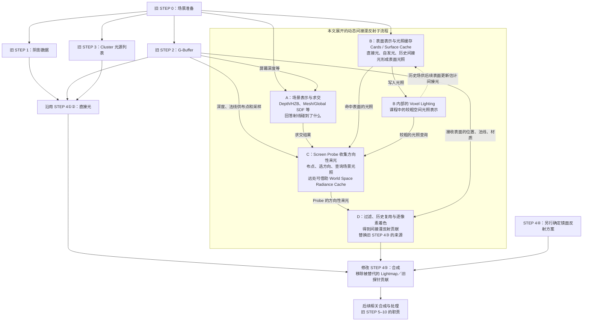

# GAMES104 第21节：动态全局光照与 Lumen 知识体系总结

> 阅读目标：不依赖视频画面，理解课程的技术主线、主要算法和工程取舍，并能把本节放回第4–7节的完整渲染流程。
>
> 材料范围：用户提供的 Part 1、Part 2 字幕正文；旧渲染总结仅用于知识衔接。本文以课程所讲的早期 Lumen 架构为对象，不作为当前 UE 版本的配置或源码指南。标为“补充解释”“澄清”的内容用于补齐推理或纠正转写，不冒充讲师原话。原有文档均保持不变。

## 阅读导航

- [0. 先看全景：本节到底在完成哪件事](#c0)
- [1. GI 的物理目标：从一盏灯到整个场景互相照亮](#c1)
- [2. 蒙特卡洛与重要性采样：为什么少量射线也可能有用](#c2)
- [3. RSM：把第一次照亮的表面变成次级光源](#c3)
- [4. LPV、SVO 与 VXGI：让光照拥有可查询的空间表示](#c4)
- [5. 屏幕空间方法：先用已经付过钱的数据](#c5)
- [6. Lumen 阶段 A：用 SDF 高效回答射线碰到了什么](#c6)
- [7. Lumen 阶段 B：Surface Cache 保存表面与光照](#c7)
- [8. 阶段 B 的跨帧反馈：从单次传递得到多次反弹](#c8)
- [9. Lumen 阶段 C：Screen Probe 放在哪里](#c9)
- [10. 阶段 C 的方向选择：把射线预算花在重要方向](#c10)
- [11. 阶段 C 的远处接力：World Space Radiance Cache](#c11)
- [12. Lumen 阶段 D：过滤、SH 与逐像素着色](#c12)
- [13. 从光源到像素：完整走一遍，再讨论动态变化](#c13)
- [14. 工程取舍与课程问答](#c14)
- [附录 A：术语与数据结构速查](#appendix-a)
- [附录 B：关键纠错、历史参数与证据边界](#appendix-b)
- [附录 C：复习问题与参考答案](#appendix-c)
- [附录 D：来源与课程覆盖索引](#appendix-d)

<a id="c0"></a>

## 0. 先看全景：本节到底在完成哪件事

**课程定位：Part 1 00:05:18–00:09:12、01:14:14–01:20:08；Part 2 00:35:00–00:35:47。**

### 0.1 一句话抓住主线

第4–7节告诉你：一个像素的着色需要知道“从各方向来了多少光”，然后由材质决定这些光怎样反射到相机。第21节继续追问：**场景、光源和物体都可能变化时，怎样在几毫秒量级的预算里，近似得到这些来自整个环境的光？**

本课中的 Lumen 不是一条神奇公式。它把一个昂贵的问题拆开：用适合求交的数据找几何，用适合复用的数据存光照，再把少量采样结果在空间和时间上谨慎共享。

全文使用同一个例子：一间有窗的房间，左墙红色，地面灰色，中间放一只白盒子；墙边有一块蓝色自发光板，门口有人移动。太阳直接照亮一块地面，地面和红墙再照亮盒子背光面。相机可能转身，门可能关上，灯也可能突然熄灭。每项技术都要回答这个场景中的某个具体困难。

### 0.2 技术演进图：这些是思路来源，不是顺次执行的 Pass

```text
目标：求解渲染方程中的环境来光及其多次传播
  |
  +-- RSM：先保存被光照亮的表面，作为次级光源
  |       +-- 低分辨率收集 + 有效性检查 + 局部补算
  |
  +-- LPV：在空间格子里保存方向性光照，以 SH 压缩并传播
  |
  +-- SVO / Voxel Cone Tracing：层级体素 + 预过滤 + 锥形查询
  |       +-- VXGI 中的 Clipmap 思路：近密远疏、规则存储、增量更新
  |
  +-- 屏幕空间 GI / 反射：复用深度和颜色，层级追踪，复用邻居样本
  |
  +-- 光线追踪、距离场、重要性采样、时空重用等基础工具
          |
          v
  Lumen：把场景表示、光照缓存、探针采样、重建与预算管理组织起来
```

箭头表示概念上的联系。它不意味着 Lumen 每帧先跑 RSM、再跑 LPV、再跑 VXGI；也不表示课程提出的历史联系都能当作严格的发明优先权结论。

### 0.3 把 Lumen 放回旧管线：阶段分工与逐步改动

**先确定关系：本文主要把旧文“查询现成间接光”的步骤，展开为“动态准备、采样并重建间接光”的子流程。**整帧仍需要几何绘制、直接光、天空、雾和后处理等工作。下面以“在旧流程上具体改哪里”为线索阅读。

#### 0.3.1 对照哪一套管线：以旧文的延迟渲染实例为准

旧文介绍了两种组织方式。这里的术语是**前向渲染与延迟渲染**；“后处理”是另外一件事。

| 旧文位置                                                                                                          | 几何与光照怎样组织                                | 本文怎样与它对应                                                                         |
| ----------------------------------------------------------------------------------------------------------------- | ------------------------------------------------- | ---------------------------------------------------------------------------------------- |
| [§15.2 前向渲染](../第04-07节_渲染部分总结/AI梳理2/GAMES104_第4-7节_渲染部分知识体系总结.md#152-forward-rendering前向渲染)  | 绘制物体时，在着色过程中计算该表面的光照          | 从职责上说，动态 GI 仍要提供着色所需的间接光；但不能把下面依赖 G-Buffer 的步骤原样搬过去 |
| [§15.3 延迟渲染](../第04-07节_渲染部分总结/AI梳理2/GAMES104_第4-7节_渲染部分知识体系总结.md#153-deferred-rendering延迟渲染) | 先写 G-Buffer，再读取表面信息计算光照             | 可以直接对照本文使用深度、法线布置 Screen Probe，并重建逐像素间接光的过程                |
| [§15.7“完整一帧”][old-flow]                                                                                    | 明确采用“延迟渲染 + Cluster”，编号为 STEP 0–10 | **下文所有 STEP 编号都来自这里**；这是本节的主对照流程                             |

旧文先导章“七、一张终极总图”把 Lighting Pass 编成第6步，§15.7 则编成 STEP 4。二者编号不同；下文统一使用 **STEP 4**，避免来回切换。

**概念对应与引擎支持要分开：**前向／延迟描述着色怎样组织，动态 GI 描述间接光怎样获得；二者讨论的层次不同。但这不代表具体实现可以任意组合。截至本次核对（2026-09-27），Epic 文档仍明确说明 **Lumen 不兼容 UE 的 Forward Shading**。因此，下面是对旧文延迟渲染实例的教学展开，不是给前向渲染接入 Lumen 的操作指南。[Epic：Lumen Technical Details](https://dev.epicgames.com/documentation/en-us/unreal-engine/lumen-technical-details-in-unreal-engine)

#### 0.3.2 先认识新增工作的 A–D：给旧 STEP 4③ 准备什么

旧 STEP 4③ 要得到“当前像素的间接漫反射贡献”。本文把动态计算这部分结果的工作分成 A–D，呼应课程的四阶段讲法。**A–D 是本文的教学编号，不是 UE 源码 Pass 名称，也不是旧 STEP 0–10 的另一套编号。**

以“红墙反射太阳光，照亮白盒子”为例：

| 教学阶段                        | 负责回答的问题                                   | 使用或产出的数据                                                                                                               | 与旧流程的关系                                                |
| ------------------------------- | ------------------------------------------------ | ------------------------------------------------------------------------------------------------------------------------------ | ------------------------------------------------------------- |
| **A：场景表示与求交**     | 从盒子附近沿某方向查询，会碰到红墙还是别的物体？ | 屏幕深度/HZB、Mesh SDF、Global SDF，或硬件追踪使用的几何表示；查询得到命中位置等信息                                           | 新增或复用求交能力，供 GI 查询使用；其中屏幕数据来自旧 STEP 2 |
| **B：表面表示与光照缓存** | 命中的红墙能向外提供多少光？                     | Cards 捕获材质、深度；Surface Cache 保存表面信息和更新后的光照；课程中的 Voxel Lighting 提供较粗的空间光照表示                 | 新增旧图未展开的场景光照准备，供后续采样查询                  |
| **C：光照收集**           | 盒子附近各个方向分别来了多少光？                 | 按旧 STEP 2 的深度、法线布置 Screen Probe；用历史光照和周边法线选择方向，借助 A、B 查询；远处可使用 World Space Radiance Cache | 新增为当前画面收集间接光的工作，产出 Probe 的方向性来光       |
| **D：重建与着色**         | 怎样从稀疏采样得到盒子每个像素的间接漫反射？     | 检查邻居样本、过滤和历史复用，用 SH 等表示来光，再结合像素的位置、法线和材质计算贡献                                           | 形成旧 STEP 4③ 的新结果，交给 STEP 4⑤ 合成                  |

**A 找表面，B 提供该表面的光照，C 收集接收位置的来光，D 求接收像素的贡献。**例如，知道“射线碰到了红墙”还不够，必须知道红墙的光照；知道“红墙有多亮”也还不够，必须从盒子处考虑方向、遮挡和材质响应。

这里也有一条**跨更新步骤的反馈**：B 已算出的表面光照写入课程中的 Voxel Lighting，后续表面更新再从历史场估计间接光，于是较长的反弹路径逐步进入结果。它不是在同一次更新里等待自己的最终答案，也不是最终画面的 TAA。具体机制见 §8。

因此，“缓存”“体素”“Probe”应结合存储量理解：B 主要提供被查询表面的光照，C 的 Probe 表示某个接收位置的方向性来光；二者不能只因都保存光照就视为同一种数据。

<a id="flow-comparison"></a>

#### 0.3.3 接入本文的 Lumen 方案后，旧渲染流程有哪些变化

本表以“由本文的 Lumen 链路提供间接漫反射”为前提，沿着旧文 STEP 0–10，说明哪些职责继续保留，哪些数据被 Lumen 使用，以及间接光的计算方式如何变化。**沿用**表示原职责仍需要，不承诺实现、资源和调度完全不变；**新增**表示旧流程没有展开、现在必须说明的工作。

**STEP 编号定位旧流程中的工作，A–D 划分本文 Lumen 链路内部的职责，两者没有一一对应关系。**例如，STEP 2 的几何数据既可用于 A 的屏幕追踪，也可用于 C 的 Probe 布点和 D 的重建；A、B 的资源准备则属于旧文未详述、在本表中单独列出的新增工作。阅读本表时，先看某项工作发生什么变化；查找各章用途时，再看 [0.3.6 章节阅读路线](#chapter-route)。

| 旧流程中的工作                                    | 接入后的变化                             | 具体说明                                                                                                                                                             |
| ------------------------------------------------- | ---------------------------------------- | -------------------------------------------------------------------------------------------------------------------------------------------------------------------- |
| **STEP 0：CPU 帧开始／场景准备**            | **沿用，并扩展更新范围**           | 继续更新变换、动画和主相机可见物体；另外跟踪 GI 所需的场景变化。主相机看不见的墙也可能向可见物体反光，不能只用主相机可见列表代表整个 GI 场景                         |
| **STEP 1：Shadow Pass**                     | **沿用直接光阴影职责**             | 仍为太阳、火把等直接光提供遮挡信息。Lumen 求交不等于取消主画面的阴影系统；Surface Cache 表面照明也要判断到光源的可见性，但不能假设它只需原样读取主相机的全部阴影结果 |
| **STEP 2：Geometry Pass**                   | **沿用，并增加数据使用者**         | 继续生成当前画面的深度、法线、材质。本文还会读取这些数据做屏幕追踪、Screen Probe 布点、有效性检查和最终像素着色                                                      |
| **STEP 3：Cluster 预处理**                  | **沿用**                           | 继续为直接光着色筛选光源。Cluster 光源列表不承担环境多次反弹的求解，不能直接代替 GI                                                                                  |
| **旧文未展开：GI 场景和光照资源的准备**     | **新增：A、B 相关工作**            | 维护 Mesh／Global SDF、Cards／Surface Cache；更新缓存表面的直接光、自发光和间接光，以及课程中的 Voxel Lighting 与历史反馈。部分资源预先生成，运行时按变化和预算更新  |
| **旧文未展开：当前画面的间接光收集**        | **新增：C、D 相关工作**            | 布置 Screen Probe，选择方向，追踪并查询缓存；按需借助 World Space Radiance Cache；过滤、复用历史并重建间接光。这些结果供 STEP 4③ 使用                               |
| **STEP 4①②：太阳、火把的直接光**          | **沿用**                           | 仍用光源、材质响应与可见性计算直接贡献；本文的间接漫反射结果不替代这部分                                                                                             |
| **STEP 4③：从 Light Probe 读取间接漫反射** | **替换其光照来源**                 | 把“查询旧方案的预存探针光照”替换为“使用本文 C、D 收集和重建的动态间接光，并结合接收像素的法线、材质形成贡献”                                                     |
| **STEP 4④：CubeMap 环境镜面反射**          | **单独选择方案**                   | 本文的间接漫反射链路不能直接替换这一项。若采用 Lumen Reflections，需要相应的镜面反射追踪与重建链路；本文未完整展开它                                                 |
| **STEP 4⑤：合成；静态建筑改查 Lightmap**   | **修改输入和分支**                 | 采用上述动态 GI 的表面使用新的间接漫反射贡献，不再因“建筑是静态的”就沿用旧 Lightmap 分支；同一部分间接光不能再从旧 Lightmap／探针重复相加                          |
| **STEP 5：天空 Pass**                       | **保留背景绘制职责，区分照明输入** | 画出背景天空仍是一项工作；天空照亮盒子则属于环境来光。后者可进入 GI 查询，不能因为另有天空 Pass 就再给盒子加一遍相同的天空照明                                       |
| **STEP 6：云 Pass**                         | **保留其职责**                     | 云的绘制与合成仍需相应系统；本文没有提供云渲染的替代链路                                                                                                             |
| **STEP 7：AO Pass**                         | **重新核对组合方式**               | 旧例子用 AO 压暗间接光。动态 GI 已包含部分遮挡，不能机械照搬“再乘同一套 AO”；是否补充局部遮蔽，要看覆盖范围，避免重复压暗                                          |
| **STEP 8：体积雾 Pass**                     | **保留其职责**                     | Froxel 中的介质散射、积分与合成仍需相应系统；本文的表面 GI 链路不替代它                                                                                              |
| **STEP 9：TAA**                             | **保留最终画面重建职责**           | GI 内部的历史复用先服务于光照计算；最终画面的抗锯齿／时域重建仍是另一项工作                                                                                          |
| **STEP 10：后处理链**                       | **沿用其职责**                     | 已合成的 HDR 画面仍需 Bloom、Tone Mapping、调色等相应处理                                                                                                            |

这张表按旧编号定位职责，不规定严格的 GPU 执行顺序。特别是新增资源更新可跨帧；AO、天空照明等数据也要按实际依赖提前准备，不能把旧文的教学排列当作唯一调度。

各章开头会说明其在本表中的位置或用途：直接参与流程的章节说明输入、工作和结果去向；基础章节说明知识用于哪些计算；前导章节说明其他方案怎样承担相关职责。**一个章节不一定对应一个独立执行步骤。**

##### 0.3.3.1 跟着一个白盒子走完流程：为什么背光面也能带一点红色

**场景：**太阳从窗户照进房间，照亮红墙和一部分地面。中间有一个白盒子，我们盯住它侧面的一个像素 P：这里照不到太阳，却能接收到红墙反射的光。先忽略蓝色自发光板，把注意力集中在这一条光路上：

```text
太阳 → 红墙 → 白盒子上的 P → 相机
       反射     再反射
```

最终希望看到：**P 没有太阳直射，仍然略亮，并带一点红色。白盒子的材质依然是白色，变化的是照到它上面的光。**下面沿着 P 的间接光如何产生来组织讲解，其中可复用的 GI 资源已经存在，不假设每帧都从零重建。

各段按数据依赖展开说明，旧 STEP 编号与 [0.3.3 表格](#flow-comparison) 一致。**讲解顺序不代表 GPU 必须依次执行，资源更新也可以跨帧进行。**表中“新增：当前画面的间接光收集”包含 C、D，下面分开讲采样与重建，便于看清它们各自的作用。

**旧 STEP 0：先确定“这一帧房间是什么样”。**

引擎更新相机、盒子和其他物体的位置，确定当前画面需要绘制哪些物体。同时，GI 系统要知道哪些相关几何、材质或光源发生了变化。即使相机只拍盒子、红墙在画面外，红墙仍可能影响盒子的光照，不能因此把它从 GI 所需场景里一并删除。

**旧 STEP 1：准备直接光的遮挡信息。**

阴影数据帮助后面的直接光计算判断：“太阳能不能直接照到这个位置？”本例中红墙能被照到，P 不能。到这里，仅靠太阳直接光还不能解释 P 为什么带红色；还需要计算红墙到 P 的那段传光。

**旧 STEP 2：给屏幕像素登记表面信息。**

G-Buffer 记录：“P 属于白盒子，位置在这里，表面朝这个方向，材质是粗糙白漆。”此时登记的是位置、法线、材质等信息，还没有决定 P 最终显示什么颜色。后面的直接光与间接光都要使用这份信息。

**旧 STEP 3：列出需要考虑的直接光源。**

Cluster 光源列表帮助着色时筛选相关的太阳、灯等光源。红墙虽然可以反光，但本文并不是把墙上每个小区域都作为普通点光源塞进这个列表；它的贡献通过下面的 GI 查询获得。

**新增：GI 场景和光照资源的准备（A、B）——让红墙的几何和光照可查询。**

A 提供求交能力：例如从盒子附近朝左查询，能够知道途中是否有遮挡，最后是否碰到红墙。你可以先把它理解为一份适合查询的几何表示。

B 则维护表面的光照记录。计算红墙受到的太阳照明、考虑红墙材质后，记录它能向外提供的偏红光照。Surface Cache 可以先理解为这类表面信息和光照的缓存；课程中的 Voxel Lighting 提供更粗的查询表示，并参与历史反馈。**A 回答“在那里的是红墙”，B 回答“这面红墙现在提供怎样的光”。**

这里红墙受到的太阳光，对红墙是直接光；红墙把光反射给盒子后，对盒子就是间接光。因此，B 也要计算直接照明与到光源的可见性。它计算的是缓存中的红墙表面，旧 STEP 4①② 计算的则是当前待着色像素；两者服务于不同位置。

**新增：当前画面的间接光收集（C）——在代表位置收集来光。**

为了控制成本，不让每个屏幕像素都独立向所有方向做昂贵查询，而是根据屏幕深度、法线布置一些 Screen Probe。把盒子附近的一个 Probe 想成一个采样位置：它向不同方向查询来光，供合适的周围像素使用。

其中一次查询可以这样理解：“朝左查 → A 找到红墙 → B 提供命中处的偏红光照 → 记下这个方向的来光。”其他方向可能对应地板、天花板或窗口。远处的部分查询可以借助 World Space Radiance Cache 复用结果。查询射线从盒子附近指向墙，是为了寻找来光来源；物理上的光沿相反方向从墙传来。

**上述新增工作的重建与着色部分（D），接入旧 STEP 4③：把采样结果用于 P。**

一个 Probe 的结果会服务于周围合适的像素，但不能把墙另一侧的结果随便平均进来。D 检查哪些邻近样本可用，进行过滤和历史复用，再结合 P 自己的位置、法线和白漆材质，得到 P 的间接漫反射贡献。

现在得到的结论是：“P 虽然没有太阳直射，但收到了红墙方向的光，因此会呈现一点红色。”**旧方案在 STEP 4③ 查预存探针，静态建筑在 STEP 4⑤ 改用 Lightmap；本文由 A–D 的资源准备、查询与重建共同提供 STEP 4③ 所需的动态间接漫反射贡献。**

**旧 STEP 4①②、④、⑤：把这个像素的各项贡献合起来。**

对 P，本例太阳直射项为零；新的间接漫反射项带来淡淡的红色。若材料还有需要表现的镜面反射，则由所选的反射方案提供④；白盒子没有自发光。⑤把这些适用的贡献合成，得到后续处理前的 HDR 颜色。已经由动态 GI 算过的那部分红墙反光，不再叠加旧 Lightmap 中的同一贡献。

**旧 STEP 5–10：完成其他画面内容和显示处理。**

窗外可见的天空仍由天空相关绘制负责；场景若有云或雾，也需要各自的计算与合成。AO 是否补充局部遮蔽，要检查已有 GI 覆盖了什么。最终画面的 TAA 等时域处理帮助稳定图像，Tone Mapping 等把 HDR 结果转换到显示范围。**这些工作按实际数据依赖安排；P 的红色间接光由上面解释的 GI 链路提供。**

**再关上窗前的遮光板，看看“动态”发生在哪里。**

太阳被挡住后，红墙失去原先的直射照明。STEP 0 跟踪遮光板的变化，相关几何和可见性数据随之更新；B 更新红墙的光照，C 后续查询到较弱的红墙来光，D 再更新 P 的间接漫反射贡献。于是 P 上的红色变淡、亮度降低，降低多少还取决于其他来光。

这个过程中，**P 的太阳直射项原本就是零；让它变暗的是“照亮它的红墙变暗了”**。只更新主画面的太阳阴影、继续读取旧的烘焙间接光，并不能自动得到这个变化。Lumen 需要更新的是从场景光照到接收像素的整条依赖；由于缓存预算和历史复用，变化可能经过若干次更新才稳定，而不是光在房间里物理传播得慢。

阅读后文时，可以沿着这个例子追问：**怎样查询几何（[§5 屏幕方法](#c5)、[§6 SDF](#c6)）→ 怎样保存并更新表面光照（[§7](#c7)–[§8](#c8)）→ 在哪里、朝哪些方向收集来光（[§9](#c9)–[§11](#c11)）→ 怎样得到 P 的间接漫反射贡献（[§12](#c12)）**。

[§1](#c1) 明确求解目标，[§2](#c2) 提供采样基础，[§3](#c3)–[§4](#c4) 通过其他 GI 方案介绍相关思路。完整阅读路线见 [0.3.6](#chapter-route)。

#### 0.3.4 一张接入图：A–D 怎样汇入旧 STEP 4

读图时先找最下方的 **STEP 4⑤ 合成**，再向上追它的三个输入：直接光来自①②，间接漫反射来自 D／③，镜面反射来自④。随后沿 D 向上看 C，再看 C 使用的 A、B，就能把新增工作接回旧流程。



实线表示数据或查询结果由谁提供、给谁使用；**虚线表示历史数据参与后续更新**。例如 A → C 表示 C 发起查询时使用 A 的求交结果，不表示所有 A 工作必须一次性做完，再统一执行 C。

图中省略了部分内部依赖，例如 B 的间接光更新也需要求交和采样，镜面反射也需要表面信息。实际资源更新可分摊到多帧，各查询路径也可有不同安排；这张图用于定位职责，不是引擎逐 Pass 的执行表。

#### 0.3.5 只展开改动最大的 STEP 4：前后到底差哪几行

下面都是职责级伪代码。`L_indirect_diffuse` 表示已结合接收材质的间接漫反射贡献，不把原始 SH 系数或未经材质响应的辐照度直接当成最终颜色。

```text
旧文 STEP 4：
  ①② L_direct = 太阳、火把的直接光（材质 + 阴影）
  ③  动态物体：L_indirect_diffuse = 用旧 Light Probe 数据求间接漫反射
  ④  L_indirect_specular = 用 Reflection Probe / CubeMap 求环境镜面反射
  ⑤  静态建筑：用 Lightmap 结果替代③
      合成各项光照

采用本文的动态间接漫反射链路后：
  前置准备：A、B 维护可查询场景；C、D 收集并重建当前画面所需的来光
  ①② L_direct = 太阳、火把的直接光（职责沿用）
  ③  L_indirect_diffuse = 用动态 GI 来光 + 当前像素法线、材质求贡献
  ④  L_indirect_specular = 所选镜面反射方案的结果（另行确定）
  ⑤  合成 L_direct + L_indirect_diffuse + L_indirect_specular
      适用时加上当前可见表面的自发光
      对已由③覆盖的间接光，不再追加旧 Lightmap / Light Probe 的同一贡献
```

例如太阳照亮红墙，红墙再照亮白盒子：旧方案在③查询预存结果；本文在新增链路中更新红墙的光照、收集盒子附近的来光，再由③得到盒子的间接漫反射。太阳熄灭后，这条链路需要逐步更新缓存和采样结果，变化才会反映到③；①②的直接光则有自己的更新路径。**本文增加的大量工作，正是为了让旧文看起来只有几行的③，能够随场景变化而更新。**

<a id="chapter-route"></a>

#### 0.3.6 章节阅读路线：各章解决什么问题，怎样用于后文

[0.3.3](#flow-comparison) 按旧流程说明职责变化；本节按章节说明阅读用途。§1–2 建立物理目标与数学基础，§3–4 介绍其他 GI 方案及相关思路，§5 衔接屏幕空间方法，§6–12 展开本文所讲的 Lumen 机制，§13–14 串联流程并讨论工程取舍。

| 章节                                                               | 本章解决的问题                                     | 在全文中的作用                                                                      |
| ------------------------------------------------------------------ | -------------------------------------------------- | ----------------------------------------------------------------------------------- |
| [§1 GI 的物理目标](#c1)                                            | 间接光到底要求解什么？                             | 明确 STEP 4③ 所需的间接漫反射贡献，以及 A–D 共同服务的目标。                      |
| [§2 蒙特卡洛与重要性采样](#c2)                                     | 怎样用有限次采样估计光照积分？                     | 为 B 的间接光更新和 C 的来光收集提供数学基础；本身没有独立的 STEP。                 |
| [§3 RSM](#c3)                                                      | 能否保存受光表面，用来估计它对其他表面的照明？     | 介绍另一种间接光方案，引出表面缓存、稀疏估计等思路，帮助理解 §7–8。               |
| [§4 LPV、SVO 与 VXGI](#c4)                                         | 怎样组织空间中的几何和光照，降低查询成本？         | 通过不同方案介绍方向表示、层级结构和 Clipmap 等思想，帮助理解后文的场景表示与缓存。 |
| [§5 屏幕空间方法](#c5)                                             | 当前屏幕已有的数据能帮助做哪些查询？               | 解释怎样利用 STEP 2 等工作产生的屏幕数据，并衔接 Lumen 的屏幕追踪。                 |
| [§6 SDF 与求交](#c6)                                               | 射线如何找到场景表面？                             | 展开 A：准备和使用适合求交的场景表示，支持 B、C 的查询。                            |
| [§7 Surface Cache](#c7)、[§8 跨帧反馈](#c8)                        | 表面光照如何保存、更新，并包含多次反弹？           | 展开 B：准备可供查询的表面与光照缓存。                                              |
| [§9 Screen Probe](#c9)、[§10 方向选择](#c10)、[§11 远处接力](#c11) | 在哪里采样、朝哪些方向采样，怎样降低远处查询成本？ | 展开 C：为当前画面收集来光。                                                        |
| [§12 过滤、SH 与逐像素着色](#c12)                                  | 如何把稀疏采样结果用于每个像素？                   | 展开 D：重建来光并结合接收材质，形成 STEP 4③ 的贡献，交给 STEP 4⑤ 合成。          |
| [§13 完整流程与动态变化](#c13)                                     | 上述工作怎样共同产生并更新间接光？                 | 用同一个场景串联 A–D，并放回旧 STEP 0–10。                                        |
| [§14 工程取舍](#c14)                                               | 为什么这样分配预算，会有哪些限制？                 | 回顾整条链路的成本、效果和职责范围。                                                |

§3–4 中的完整算法并非 Lumen 内部必经的执行步骤。例如，RSM 有助于理解“保存受光表面供别人查询”，不表示阶段 B 就是运行 RSM；第4章讨论的 SH、Clipmap 等思想会在后文再次出现，也不表示整套 LPV 或 VXGI 被直接搬入 Lumen。

各章开头的“旧知识回顾”可按需阅读：回顾渲染方程是为了明确积分目标，回顾 SH 是为了理解方向信号表示，回顾 BRDF 是为了理解材质响应。**旧知识链接说明需要什么基础；流程位置说明本章的工作或知识用在哪里。**

**阅读旧图时的必要澄清：**“直接光＋IBL＋GI＋天空＋后处理”是功能分类，不能当成统一的物理加法公式。IBL 可以已经在估计某部分间接光，天空也可能已经作为环境来光被积分；应按光路与反射分量避免重复计光。AO 是遮蔽修正，Tone Mapping 是颜色映射，也不是额外的发光项。

<a id="c1"></a>

## 1. GI 的物理目标：从一盏灯到整个场景互相照亮

> **在 0.3.3 流程中的位置：** 本章解释 [0.3.3](#flow-comparison) 中 STEP 4③ 要得到的间接漫反射贡献，以及它如何交给 STEP 4⑤ 与其他光照分量合成。A–D 都为求得这部分动态光照服务；本章先确定计算目标，没有独立的执行步骤。
>
> **本章要解决的问题：** 为什么只有光源的直接照明和材质响应，还不能解释红墙照亮白盒子？明确要算什么后，第2章再讨论怎样用采样估计它。
>
> **旧知识回顾：**[旧文渲染方程][old-equation]用于回顾来光、材质响应和出射光的关系；本章进一步展开间接来光的来源。
>
> **字幕依据：Part 1 00:09:12–00:15:41。**

### 1.1 一个像素需要的是朝相机离开的光

对不透明表面，在常见的稳态、非参与介质设定下，反射渲染方程可写为：

$$
L_o(x,\omega_o)=L_e(x,\omega_o)+\int_{\Omega^+(n)} f_r(x,\omega_i,\omega_o)L_i(x,\omega_i)\max(0,n\cdot\omega_i)\,\mathrm d\omega_i.
$$

| 符号               | 含义                                 | 房间里的对应物                       |
| ------------------ | ------------------------------------ | ------------------------------------ |
| $x$              | 当前表面点                           | 白盒子侧面的一小点                   |
| $\omega_o$       | 从表面朝观察者的方向                 | 指向相机                             |
| $\omega_i$       | 从表面指向来光所在方向               | 指向窗户、红墙或地面                 |
| $L_i$            | 沿该方向到达的辐亮度 Radiance        | 红墙沿这条光路送来的光               |
| $f_r$            | BRDF，材料对入射／出射方向的反射响应 | 白漆与金属的反应不同                 |
| $n\cdot\omega_i$ | 投影余弦项                           | 正面来的光比擦着表面来的光投影贡献大 |
| $L_e$            | 表面的自发光                         | 蓝色发光板的自身发射                 |
| $L_o$            | 朝相机离开的辐亮度                   | 摄像机最终接收到的表面信号           |

这里有两个独立问题：**光照系统负责提供 $L_i$；材质模型负责给出 $f_r$。** 光照很好但材质不对，结果仍不对；PBR 再精细，如果把环境来光硬写成常数，也不会自动出现红墙染红白盒子的效果。

“半球积分”中的方向域通常以表面法线为中心。Probe 可以存整球方向信号，真正给某个不透明像素着色时，再按该像素的法线取有效半球。

### 1.2 直接光、间接光与 bounce 怎么数

用光路最容易区分：

```text
太阳/灯 -> 白盒子 -> 相机                 盒子的直接光
太阳/灯 -> 红墙 -> 白盒子 -> 相机         盒子的一次间接反弹
太阳/灯 -> 地面 -> 红墙 -> 白盒子 -> 相机   盒子的两次间接反弹
```

本文将“到达当前待着色点前，已在其他非发光表面反射一次”称为一次间接反弹。有些口头讲法把光照到第一个表面也叫第一次 bounce；因此看时间迭代图时应认光路，而不只认数字。

GI 在广义上讨论全局的光传输；引擎功能中的“GI”常特指间接光照部分。因此“已经算了直接光，还需要 GI”没有矛盾，只是术语使用范围不同。

红墙上的点被太阳照亮后，便能把光反射给盒子。从盒子的角度，红墙上的许多小区域都像次级光源。严格说它们是反射表面，不是新创造能量的灯；这种“把表面看成无数小灯泡”的类比，后面会贯穿 RSM 和 Surface Cache。

### 1.3 为什么它递归，为什么它昂贵

要知道盒子从红墙方向收到多少光，必须知道红墙向盒子发出多少光；而红墙的亮度又取决于地面、窗户、其他墙面。**一个点的答案依赖其他点的答案，其他点的答案又会反过来依赖它。**

如果每个命中点都向周围发 $m$ 条射线，并递归 $b$ 层，朴素分叉查询会出现 $m^b$ 量级的增长。字幕用这一例子说明成本爆炸。

**补充解释：这不是所有路径追踪实现都必然指数增长。** 常见路径追踪会随机延伸少量路径，而不是在每个顶点展开整棵树；单条路径的成本通常随路径长度增加。难点转为：需要多少条路径，才能在可接受噪声下估计完整积分？[PBRT：路径追踪](https://pbr-book.org/4ed/Light_Transport_I_Surface_Reflection/Path_Tracing)

实时系统还要对大量像素重复这个过程。即使几何求交很快，材质求值、采样、缓存访问和降噪也要花钱。因此“有光追硬件”不等于“可以廉价算完所有 GI”。

### 1.4 看效果时必须分清的三个现象

| 现象                     | 发生了什么                                 | 是否应当保留                 |
| ------------------------ | ------------------------------------------ | ---------------------------- |
| Color Bleeding，颜色串染 | 红墙反射的红光照到白盒子                   | 是，真实的间接光效果         |
| Light Leaking，错误漏光  | 本应被墙挡住的光穿墙，或从另一侧插值过来   | 否，表示或复用的误差         |
| 常数 Ambient             | 不管是否有窗、遮挡如何，都给暗处加固定亮度 | 可作近似，但不能表达完整光路 |

字幕在 Cornell Box 一段把颜色串染也叫作 leaking。本文将二者严格区分，避免后文讨论“修复漏光”时误以为应当消除红墙的正常反射。

### 1.5 三种光学量，后面不能混着叫“亮度”

- **Flux，辐射通量 $\Phi$：**总共传递多少辐射功率。RSM 的次级光源权重与其采样区域的反射通量有关。
- **Radiance，辐亮度 $L$：**某位置沿某方向的光，包含方向信息。Probe 记录的方向信号和表面出射光都与它有关。
- **Irradiance，辐照度 $E$：**从半球各方向入射并按余弦积起来，单位表面积收到的功率。

$$
E(x,n)=\int_{\Omega^+(n)}L_i(x,\omega)\max(0,n\cdot\omega)\,\mathrm d\omega,
\qquad L_{o,\mathrm{diffuse}}=\frac{\rho}{\pi}E.
$$

$\rho$ 是 Lambert 漫反射率，可按 RGB 分通道理解。**入射辐照度还不是像素最终颜色**：这里还需乘材料响应；之后还可能有镜面反射、自发光、曝光与显示变换。

“越远贡献越小”也不能一律写成“Radiance 随距离平方衰减”。无吸收的真空中，沿一条光线传播的 Radiance 保持不变；有限小光源对接收面积的贡献变化，与其张开的立体角等几何因素有关。第3章会用 RSM 的公式把这个区别具体化。[PBRT：辐射度量](https://pbr-book.org/4ed/Radiometry,_Spectra,_and_Color/Radiometry)

<a id="c2"></a>

## 2. 蒙特卡洛与重要性采样：为什么少量射线也可能有用

> **在 0.3.3 流程中的位置：** 本章为 [0.3.3](#flow-comparison) 的两项新增工作提供采样基础：阶段 B 更新缓存的间接光，以及阶段 C 为当前画面收集来光。这些计算最终服务 STEP 4③；采样方法本身没有独立的 STEP。
>
> **本章要解决的问题：** 怎样用有限次查询估计光照积分，为什么需要按采样概率加权？第8章的间接光更新和第10章的方向选择会用到这些基础。
>
> **旧知识回顾：**[旧文渲染方程][old-equation]与[漫反射环境光积分][old-ibl]说明需要积分什么；本章解释怎样用有限样本估计积分。
>
> **字幕依据：Part 1 00:15:41–00:25:23。**

### 2.1 从“所有方向都看”变成“问一部分方向”

把渲染方程积分中的乘积记为 $g(\omega)=L_i(\omega)f_r(\omega,\omega_o)\max(0,n\cdot\omega)$。我们要算：

$$
I=\int_\Omega g(\omega)\,\mathrm d\omega.
$$

从概率密度 $p(\omega)$ 抽取 $N$ 个方向，基本蒙特卡洛估计是：

$$
\widehat I=\frac1N\sum_{k=1}^N\frac{g(\omega_k)}{p(\omega_k)}.
$$

**PDF 是什么？** PDF 是 *Probability Density Function*，概率密度函数，这里就是 $p(\omega)$。它描述采样方向的分布：某方向附近的密度越大，通常采到的射线越多。它表示“怎样选方向”，而非该方向有多亮；亮度可以作为设计采样分布的依据。

这里的密度相对于立体角定义。某片方向区域 $A$ 被采到的概率为 $P(\omega\in A)=\int_A p(\omega)\,\mathrm d\omega$，全部采样范围上的积分为1。因此，$p(\omega)$ 本身不是某个方向的离散概率。

**PDF 怎么用？** 从白盒子上的点 P 出发，可按下面三步估计光照：

1. 选择采样分布 $p$，按它抽取 $N$ 个方向；对有贡献的方向保留非零采样密度。
2. 沿每个方向查询来光 $L_i$，结合 BRDF 和余弦项计算 $g(\omega_k)$，同时取得与实际采样方式一致的密度 $p(\omega_k)$。
3. 每个样本按 $g(\omega_k)/p(\omega_k)$ 加权，再对 $N$ 个结果取平均。

**为什么要除以 PDF？** 因为我们主动多问了某些方向；若只把答案平均，常被抽到的方向会被重复放大。除以抽样密度是在补偿这种偏向：常采到的方向每次权重较小，少采到的方向每次权重较大。不能按一种分布采样，却用另一种分布的 PDF 加权。

若在半球立体角上均匀采样，$p=1/(2\pi)$，于是结果是样本值平均再乘 $2\pi$。经纬角各自均匀不等于立体角均匀，不能看到“均匀”二字就省去分布定义。[PBRT：蒙特卡洛估计](https://pbr-book.org/4ed/Monte_Carlo_Integration/Monte_Carlo_Basics)

### 2.2 噪声从哪里来：小窗户的例子

假设从盒子看出去，窗户只占半球很小的方向区域。一个像素的射线碰巧打中窗户，另一个像素全部打中暗墙，估计值便一亮一暗。这不是材料突然变化，而是有限样本产生了方差。

增加样本通常能降低误差，但经典独立采样、有限方差条件下，标准误差约按 $1/\sqrt N$ 缩小。想把噪声幅度降一半，往往要约四倍样本。实时系统很难靠无限增加射线解决问题。

更有效的方向有四个，后文会反复看到：

```text
更少的待估计位置：低分辨率 Probe，自适应补点
更聪明的方向：重要性采样
更便宜的单次查询：屏幕/SDF/缓存/近远分工
更充分地用已有结果：空间复用 + 时间复用 + 过滤重建
```

下面逐项展开。这四条都在解决同一个问题：**怎样减少计算量，同时尽量算准间接光？**不过，它们节省计算量的方式不同。

先想一种很贵的做法：为了知道白盒子怎么被环境照亮，**每个像素都向许多方向发射查询射线，每条射线都独立寻找表面、计算来光，而且每帧重新做一遍。**下面分别从采样位置、方向、单次查询成本和结果复用四个方面改进。

#### 2.2.1 更少的待估计位置：减少“在哪里算”

白盒子上一小片平坦表面，相邻位置收到的间接光可能很接近，没必要每个像素都完整计算一次。

可以先选少量代表位置，放置 Probe，计算这些位置的来光，再让周围合适的像素使用这些结果。

例如，原本有100个像素各自查询环境，现在先在几个代表位置查询，再根据像素的位置、法线等重建结果。这个数量只是帮助理解，不是固定的采样比例。

“自适应补点”就是：**平坦且光照变化平缓的区域少放一些；盒子边缘、遮挡变化大的地方多放一些。**如果一个像素在盒子上，另一个在后面的墙上，即使屏幕位置相邻，也未必能共享同一份来光。

这里减少的是独立查询环境的**位置数量**，最终仍然要给每个像素着色。后面的[第9章](#c9)会介绍 Screen Probe 的布点与自适应补点，[第12章](#c12)再说明怎样把结果用于像素。

#### 2.2.2 更聪明的方向：改变“朝哪里算”

已经确定一个 Probe 的位置，假设它只能发64条射线。

如果来光主要来自一扇小窗，随意选择方向，可能大多数射线都打到暗墙，只有很少几条碰巧找到窗户。

重要性采样会参考已有信息，把更多射线分配给可能有较大贡献的方向。仍然发64条，但更容易采到重要来光。这里64条用于说明“预算不变，分配方式改变”，不表示任何实现都固定使用这个数量。

这就是前面 PDF 的用途：**按设计的分布选方向，再用正确的 PDF 加权。**不能只挑亮方向然后直接平均；其他仍有贡献的方向也需要保留采样机会。此外，方向是否重要还要看接收表面的朝向和材质响应，而不只看那里是否明亮。

这里改变的是每个采样位置的**方向分配**。[§2.3](#sampling-importance)继续解释分布应该考虑哪些因素，[第10章](#c10)再说明 Lumen 怎样利用历史来光与周边法线安排方向预算。

#### 2.2.3 更便宜的单次查询：降低“查一次多少钱”

现在位置和方向都确定了。沿这个方向查询来光，需要回答：

- 射线碰到了哪里？
- 命中的表面提供多少光？

可以用不同方式降低成本：

| 手段     | 怎样省计算                                                           |
| -------- | -------------------------------------------------------------------- |
| 屏幕数据 | 利用已经生成的深度、颜色等信息帮助查询，复用已有的绘制结果。         |
| SDF      | 利用距离信息跨过空旷区域，帮助寻找表面。                             |
| 光照缓存 | 命中红墙后，读取已经计算的表面光照，避免每次命中都重新计算整套照明。 |
| 近远分工 | 近处保留较多细节，远处使用较粗表示或共享的来光缓存。                 |

这一条的重点是：**即使查询次数相同，每次查询也可以更便宜。**这些手段各有覆盖范围和精度限制，需要按条件选择和组合。例如，屏幕数据不知道的表面要由其他场景表示补足，缓存结果也需要及时更新。

[第5–6章](#c5)介绍屏幕和 SDF 查询，[第7–8章](#c7)介绍表面光照缓存，[第11章](#c11)介绍远处来光的缓存接力。

#### 2.2.4 更充分地用已有结果：减少“重新算”

一次来光采样已经花过计算成本，可以考虑让它发挥更多作用：

- **空间复用：**附近位置的结果满足条件时，可以借来使用。
- **时间复用：**上一帧的结果仍然有效时，可以与本帧结果结合。
- **过滤重建：**结合相容样本，降低噪声，并得到最终像素所需的光照。

例如，相机和房间都没怎么变化，上一帧采到的红墙来光仍可能有用，就不必完全丢掉。当前帧附近位置采到的结果，如果在几何与可见性上相容，也可能帮助估计 P 的来光。

但关门、物体移动后，旧结果可能失效，需要检查并降低权重或弃用。同样，墙两侧的点即使距离很近，也不能随便共享结果，否则可能把本该被挡住的光混进来。

这里提高的是已有样本的**利用程度**。过滤与历史累积可以降低噪声，但不能保证恢复从未采到的信息，错误共享还可能造成漏光或拖影。[第12章](#c12)会进一步讨论相容性检查、过滤和逐像素重建；这里的时间复用服务于 GI 估计，与旧 STEP 9 对最终画面进行 TAA 的职责不同。

#### 2.2.5 用四个问题区分，并理解它们怎样组合

| 方法         | 它主要改变什么？                               |
| ------------ | ---------------------------------------------- |
| 更少的位置   | **多少个地方**需要独立采样？             |
| 更聪明的方向 | 每个地方的射线**朝哪里发**？             |
| 更便宜的查询 | 每条射线**怎样更快取得结果**？           |
| 更充分地复用 | 已经取得的结果**还能用在哪里、用多久**？ |

第一条和第四条有联系：**因为结果可以在合适的位置间共享，才有机会只在少量位置采样。**但关注点不同：第一条决定在哪里安排新的查询，第四条决定怎样使用已经取得的结果。

这四条可以组合使用：先在白盒子附近布置少量 Probe，再把每个 Probe 的射线更多地分配给重要方向；每条射线借助屏幕、SDF 和缓存降低查询成本，最后结合有效的邻近样本与历史结果，重建每个像素的间接光。它们共同解释了 Lumen 为什么需要多种机制配合，而不只是增加射线数量。

<a id="sampling-importance"></a>

### 2.3 重要性采样：密度应该跟什么走

本节继续展开 §2.2.2 的“更聪明的方向：重要性采样”。前面说明它在射线预算不变的情况下，通过重新分配采样方向提高效率；这里进一步讨论：**采样密度 $p(\omega)$ 应该依据哪些信息来设计？**两节讲的是同一种方法，先说明作用，再深入解释方向选择的依据。

理想情况是，让 $p$ 接近被积函数的贡献分布。对光照而言，不只要看“哪里亮”，还要看“这个表面会不会接收并反射那里的光”。

例如窗户在盒子的背面，即使很亮，对该面正半球的直接贡献也可能为零；而光滑金属关注的是与出射方向和微表面分布相匹配的狭窄方向区域。**亮光分布、法线朝向、BRDF 响应共同决定重要性。**

并不是任意名为 importance sampling 的分布都一定优于均匀分布。如果历史估计错了、重要方向被设成零概率，或者计算密度时漏了权重，也可能更差。正确估计要求对有贡献的区域保留合适的采样支持，并使用与真实采样过程一致的概率权重。

### 2.4 Lambert 漫反射与余弦采样

对于 $f_r=\rho/\pi$，取余弦加权半球密度 $p(\omega)=\cos\theta/\pi$，其中 $\theta$ 是方向与法线夹角，则：

$$
\widehat L_{o,\mathrm{diffuse}}
=\frac1N\sum_k\frac{(\rho/\pi)L_i(\omega_k)\cos\theta_k}{\cos\theta_k/\pi}
=\frac{\rho}{N}\sum_kL_i(\omega_k).
$$

这解释了为什么靠近法线多采一些，经常更适合漫反射。式中余弦已经通过采样分布体现出来，不应再额外乘一次同样的补偿。

但余弦采样只利用了材质／几何这一侧的知识。窗户若又小又偏，它仍可能漏采。因此 Lumen 后面还会引入历史 Radiance 估计，与一片区域的法线分布一起决定方向预算。[PBRT：重要性采样](https://pbr-book.org/4ed/Monte_Carlo_Integration/Improving_Efficiency)

**字幕澄清：**此处法线夹角的投影项是 cosine，不是 sine；“GS”等转写结合上下文涉及 GGX 等微表面分布，但本文不把含糊词逐个强行还原为源码符号。

### 2.5 “低频间接光”允许省什么，不允许省什么

漫反射会把多个方向的来光积分，很多区域的结果随位置变化较平缓，因此可以降低光照采样密度，再用每个像素的法线和材质恢复细节。地板有细密法线纹理，不代表每个纹理凸凹都必须独立做一整套高样本 GI。

但墙角、门缝、近处遮挡、小而亮的发光面以及焦散都可能产生强变化。“间接光通常较平滑”是一项可利用的统计观察，不是全局低频保证。

因此，实时 GI 的省钱方法几乎总要配套一条规则：**先判断能否共享；共享失败，再局部补算。** 第3章的 RSM、第9章的自适应 Probe、第12章的过滤，分别在不同层面执行这条规则。

### 2.6 本章串联：从光照积分到 Probe、材质着色与旧流程

本章从“怎样用少量查询估计光照”出发，逐步讨论了采样、成本与共享。将这些内容放回渲染流程时，需要继续分清：样本用于估计什么量，这个量怎样保存，以及最终怎样形成像素的光照贡献。本节在前面各节的基础上串联这些问题，并联系后文的 Probe 与旧流程中的 Lightmap／IBL。

**本节的阅读定位：先理解采样结果的用途，再到后文学习实现。**§2.1–2.5 已经说明怎样估计积分与控制成本，但还没有展开 Probe 的布点、光照来源、存储和重建。在这里提前介绍 Probe、Lightmap 与 IBL，是为了让采样公式与最终着色建立联系。本文的动态间接漫反射机制将在第6–12章逐步展开；镜面反射的讨论用于说明数据的其他可能用途及本篇范围，不表示后文会完整讲解一套镜面 IBL 替代方案。第一次阅读时，先抓住“采到什么、保存什么、最终算什么”，不必在这里推导完整的 Lumen 执行流程。

下文包含三个层次：**通用原理**说明方向性来光可能怎样用于材质着色；**本文方案**说明 A–D 怎样提供动态间接漫反射；**后文预告**指出 Probe 收集、缓存和重建机制在哪里展开。镜面反射的扩展原理单独说明其适用条件，不能仅凭“数据具备某种用途”就把它当作本文已经采用并完整讲解的路径。

#### 2.6.1 回看 §2.1–2.5：先明确目标，再安排查询与复用

| 小节                       | 已经解决的问题                                     | 对后续计算的意义                                                     |
| -------------------------- | -------------------------------------------------- | -------------------------------------------------------------------- |
| §2.1 蒙特卡洛与 PDF       | 用有限方向样本估计积分，按实际采样密度加权         | 先明确被积函数和 PDF，才能把查询结果组合成所需的光照量。             |
| §2.2 四种降成本方法       | 减少位置、优化方向、降低单次查询成本、复用已有结果 | 采样预算不仅是射线数量，还涉及查询位置、单次查询方式和结果如何共享。 |
| §2.3 重要性采样           | 根据来光、法线与 BRDF 响应设计方向分布             | 将有限样本更多地分配给可能有较大贡献的方向。                         |
| §2.4 Lambert 与余弦采样   | 给出一种具体的材质模型与匹配的采样分布             | 得到该模型下的漫反射出射光估计，并说明余弦如何通过采样分布体现。     |
| §2.5 低频间接光与共享边界 | 判断哪些区域可以减少采样位置，哪些位置需要补算     | 将空间复用建立在几何与光照相容的条件上，避免跨遮挡错误共享。         |

**采样决定怎样取得信息，光照表示决定保存哪些信息，材质着色决定怎样把这些信息转成反射贡献。**这三项工作可以有不同的组织方式：

```text
在接收表面点直接估计：
  选择方向并查询来光
  -> 按该点的 BRDF、余弦与 PDF 加权
  -> 得到该点的反射贡献（§2.4 给出了漫反射实例）

先在代表位置保存来光，再供像素使用：
  选择代表位置与查询方向
  -> 查询并构建方向性来光表示
  -> 在有效性检查下过滤、共享或重建
  -> 按接收像素的法线与材质求反射贡献
```

例如，白盒子附近的 Probe 可以记录红墙方向的来光；白盒子上的像素再根据自己的位置、法线和白漆材质求漫反射。若保存的是方向性来光，就应保留相应的方向信息；若像 §2.4 那样已经完成积分，结果表示的就是接收表面的漫反射贡献。PDF 用于与采样过程匹配的积分估计；单条查询得到的 $L_i$ 本身表示来光，不能把加权后的 $L_i/p$ 直接当作该方向的物理辐亮度存储。

#### 2.6.2 采样位置与存储内容：Probe 记录的是哪一种光照量

§2.1–2.4 的采样方法既可以在某个像素对应的表面点使用，也可以在少量代表位置使用。§2.2 与 §2.5 说明了后一种做法的动机和条件：减少独立查询位置，并在几何与光照相容时共享结果。后文的 Probe（光照探针）就在选定位置组织和保存光照信息，供后续查询或插值；重要性采样及其 PDF 则决定在这些位置怎样选择查询方向。

以方向性 Radiance Probe 为例，它记录或近似表示位置 $x$ 处随方向变化的入射辐亮度 $L_i(x,\omega)$。这种表示可以覆盖整个球面，着色某个不透明表面时再使用法线朝向的半球。实际保存的方向数量和精度有限，过滤、插值与压缩也会影响细节；不同 Probe 方案还可能直接保存积分后的光照量。因此，判断一份 Probe 数据能做什么，首先要看它存的量：

| 光照量                                   | 含义                                                               | 后续怎样使用                                                                             |
| ---------------------------------------- | ------------------------------------------------------------------ | ---------------------------------------------------------------------------------------- |
| 方向性 Radiance：$L_i(x,\omega)$       | 某位置从各方向收到的来光，尚未乘接收表面的 BRDF 并完成积分         | 可按接收材质分别估计漫反射与镜面反射；精度取决于保留的方向细节及数据对接收位置的适用性。 |
| Irradiance：$E(x,n)$                   | 针对法线$n$，将半球来光按余弦加权积分得到的辐照度                | 对 Lambert 表面，再乘$\rho/\pi$ 得到漫反射出射光。                                     |
| 漫反射出射光：$L_{o,\mathrm{diffuse}}$ | 已经包含接收材质响应的漫反射贡献；§2.4 的蒙特卡洛公式估计的就是它 | 进入像素光照合成，不再当作原始来光重复乘材质、重复积分。                                 |

这张表用于区分可能保存或计算的光照量，并不表示本文的每一种 Probe 都同时保存这三项。本文的 Screen Probe 主线是收集方向性来光，再经过过滤、表示转换与逐像素着色形成间接漫反射。采样位置怎样确定见[第9章](#c9)，方向怎样选择见[第10章](#c10)，远处来光怎样复用见[第11章](#c11)，如何得到像素贡献见[第12章](#c12)。

#### 2.6.3 着色用途：方向性来光的通用能力与本文的漫反射主线

**先区分来光与材质响应。** 方向性 Radiance 描述接收位置从各方向收到多少光；漫反射、镜面反射描述材质怎样把这些光反射出去。若保留了足够精细、适用于接收位置的方向性来光，原则上可以分别使用漫反射 BRDF 和镜面反射 BRDF 对它积分。因此，Probe 保存的数据可以参与反射计算，材质响应仍需在着色时处理。

例如，白漆表面综合较宽范围的窗户来光而变亮；光滑镜面则依赖反射方向附近的细节，才能显示清晰的窗户形状。低分辨率、经过平滑的来光通常更适合漫反射或较粗糙的镜面反射。这里说明的是**光照数据在满足精度条件时可能支持哪些用途**，并不意味着任意 Probe 都能同时高质量地完成这两类着色。

**本文实际展开的是间接漫反射。** 第9–11章安排 Screen Probe 的位置、方向和远处来光查询，第12章将结果过滤、表示和重建，再结合像素的法线与材质形成间接漫反射贡献。用足够精细的同一份来光计算镜面反射，是有条件成立的扩展原理；本文没有因此展开一套“同一套 Probe 全面替换漫反射 IBL 与镜面 IBL”的方案。

Lumen 系统中确实存在部分复用：Epic 的2022年技术介绍说明，粗糙表面反射可以复用屏幕空间 Radiance Cache，更光滑的反射则需要额外追踪射线。[Epic：Lumen 技术介绍](https://www.unrealengine.com/tech-blog/unreal-engine-5-goes-all-in-on-dynamic-global-illumination-with-lumen) 这个实例说明不同反射需求可以选择不同的数据与查询路径；它不能作为“本篇已经完整讲解镜面反射替代方案”的依据。本文对反射范围的说明见第12章 §12.8。

**§2.4 的结果为什么不能直接用于镜面反射？** 该节按 Lambert BRDF 和余弦权重，将各方向来光积分成了一个漫反射 RGB 值。结果已经包含接收材质的漫反射响应，也已合并方向信息；镜面反射还需要根据观察方向、粗糙度等决定哪些来光方向更重要。

例如，在其他条件对称时，同样明亮的窗户分别位于法线左侧和右侧，可以让白漆产生相同的漫反射结果；但朝左取光的镜面反射，在两种环境中可能分别显示窗户和暗墙。仅凭那个相同的漫反射 RGB，无法恢复这种差别。

如果保留了原始样本的方向、来光和 PDF，则可以在采样支持等条件满足时，用镜面 BRDF 重新加权估计光泽反射；余弦采样对光滑表面可能效率很低、噪声很大。这里可能复用的是**尚保留方向信息的样本**，而不是 §2.4 已经求和得到的漫反射结果。

#### 2.6.4 接回旧流程：实际替换的光照来源与 IBL 的功能联系

**本文明确采用的主线，是 A–D 动态 GI 链路接替旧探针／Lightmap 的相应间接漫反射贡献。** 这在 [0.3.3 流程表](#flow-comparison) 中已经给出，也是后文 Probe 与重建工作的目标。为了理解这里的“接替”，先沿用旧 STEP 4 的编号比较输入与输出：

| 旧流程中的工作                                    | 本文采用动态 GI 后的做法                                                                 | 保留的计算目标                             |
| ------------------------------------------------- | ---------------------------------------------------------------------------------------- | ------------------------------------------ |
| STEP 4③：从旧 Light Probe 的预存光照求间接漫反射 | 使用 A–D 更新、收集和重建的动态来光，结合当前像素的法线与材质求贡献                     | 得到该像素的间接漫反射出射光。             |
| STEP 4⑤：静态建筑改用 Lightmap 分支              | 对采用本文动态 GI 的表面，使用新链路提供的间接漫反射，不再从旧 Lightmap 重复加入同一贡献 | 将间接漫反射与其他分工明确的光照分量合成。 |

Lightmap 按物体表面位置保存烘焙光照。本文所说的“接替 Lightmap”特指其中相应的间接漫反射贡献；若某种 Lightmap 还包含其他烘焙分量，那些分量也需要另行安排。新方案不必生成一张同样形式的贴图，关键是提供原先那一部分光照，并使它能够随场景变化更新。

**这里改变的是漫反射的光照来源和计算方式，漫反射本身仍然是材质响应。** 白盒子的白漆材质没有被 Probe 替换；改变的是用于计算白漆反射的来光，从预存结果变为动态求得的结果。因此，“提供漫反射所需的光照”与“替换漫反射”需要分清。

**完成替换的是整条链路，Probe 是其中一部分。** 仍以红墙照亮白盒子为例：A 提供场景求交能力，B 保存并更新红墙的光照，C 在 Probe 处查询各方向来光，D 过滤、重建并结合白盒子的材质形成像素贡献。少了红墙光照的来源或最终的重建着色，仅有 Probe 的位置和存储空间，也无法得到白盒子的动态间接光。第2章讲的是这条链路会用到的采样基础，后文才具体展开这些职责如何完成。

**与漫反射 IBL 的联系成立，但属于功能层面的类比。** 环境贴图按方向表示环境辐亮度，IBL（基于图像的照明）利用它计算材质受到的环境照明。对漫反射 IBL，通常先对环境来光做漫反射所需的积分或预计算，再结合接收材质；动态 GI 则从场景查询并更新来光，再求相应的漫反射贡献。两者可以为同一类光照积分提供不同来源的数据。

所以，动态来光可以承担原先由漫反射 IBL 提供的相应贡献，这个理解在功能上成立。但本文最直接的旧流程对照对象是预存 Light Probe 与 Lightmap，正文并没有另设一个独立的“替换漫反射 IBL”步骤。二者的空间覆盖、遮挡信息和更新方式也未必相同，不能据此认为数据可以原样互换，或新旧结果可以无条件相加。

**镜面 IBL 是本节用于说明范围的扩展，不是本文已展开的另一项替代方案。** 镜面 IBL 也利用环境的方向性信息，但其结果还取决于观察方向、粗糙度和镜面 BRDF。§2.6.3 解释了：足够精细的来光在原理上可以支持这类计算，漫反射积分后的结果则不能直接承担它。

从这一原理继续推导到“本文用同一套 Probe 完整替代镜面 IBL”，会越过本篇已经讲解的内容。按 [0.3.3](#flow-comparison)，旧 STEP 4④ 的环境镜面反射需要单独选择方案；若使用 Lumen Reflections，也需要相应的镜面追踪和重建路径。本篇重点展开的是动态间接漫反射，并未完整展开这条镜面路径。粗糙反射可以复用部分缓存的实例，也不能推广为所有镜面反射都由同一套 Probe 直接完成。

各项说法在本文中的地位，可以据此区分：

| 说法                                                       | 在本文中的地位                                                                           |
| ---------------------------------------------------------- | ---------------------------------------------------------------------------------------- |
| A–D 动态 GI 链路提供旧探针／Lightmap 原先承担的间接漫反射 | **实际展开的方案。**是旧 STEP 4③ 及 STEP 4⑤ 相应分支的变化。                           |
| Probe 来光经重建与材质计算，形成像素的间接漫反射           | **实际展开的机制。**见第9–12章，并依赖前面的场景表示与光照缓存。                        |
| 动态来光承担漫反射 IBL 原先提供的相应照明贡献              | **成立的功能联系。**帮助理解不同光照来源如何服务漫反射积分，不是额外声明了一项实现步骤。 |
| 足够精细的方向性来光也可用于镜面反射积分                   | **有条件成立的通用原理。**用于解释数据精度与材质响应的关系。                             |
| 本文用同一套 Probe 全面替代镜面 IBL                        | **不属于本文已展开的方案。**不能由前一条通用原理推导出这一结论。                         |

因此，在阅读后文时，应将“动态间接漫反射”作为本文的实际主线，将 IBL 的讨论用于理解功能联系与适用范围。新旧方案组合时，按光路和反射分量明确分工，避免把已经由动态 GI 计算过的同一贡献，再从 Lightmap、旧探针或 IBL 中重复加入。

本章提供的是估计光照积分、分配采样预算和复用结果的基础。要真正让白盒子被红墙照亮，还需要具体方法取得来光：第3章从 RSM 入手，说明如何记录受光表面并估计它对其他表面的贡献；后面的 Lumen 章节再展开场景求交、光照缓存、Probe 收集和逐像素重建。这些方法把本章的采样工具用于阶段 B 的间接光更新、阶段 C 的来光收集，并为阶段 D 的重建与着色提供数据。

<a id="c3"></a>

## 3. RSM：把第一次照亮的表面变成次级光源

> **在 0.3.3 流程中的位置：** 本章介绍的 RSM 是为 STEP 4③ 提供间接光的一种方案。若采用它，就需要从光源视角额外记录受光表面，并估计这些表面对接收点的贡献。[0.3.3](#flow-comparison) 采用后文的 Lumen 方案，因此没有单独的 RSM 步骤。
>
> **本章要解决的问题：** 怎样让第一次受光的表面成为其他表面的间接光来源？其中“保存受光表面供别人查询”的思路帮助理解第7–8章的阶段 B；完整 RSM 还包括接收点的光照估计，不能把整套算法等同于 B。
>
> **旧知识回顾：**[旧文 Shadow Map][old-shadow]记录光源视角下的深度；本章从这一基础出发，解释增加表面属性后怎样进一步用于间接光估计。
>
> **字幕依据：Part 1 00:25:23–00:39:33。**

### 3.1 普通 Shadow Map 多存一点，就能换一个用途

普通 Shadow Map 从光源视角记录可见表面的深度，用于判断某点能否被该光源直接照到。RSM（Reflective Shadow Maps）进一步记录这些受光点的**位置、法线和反射光通量信息**。

为什么光源视角重要？假设是聚光灯，在它覆盖的范围内，从灯的位置能看见的表面，也正是没有被其他物体挡住、能够第一次接收它的表面。若灯照到红墙，RSM 不只知道“红墙挡在这里”，还知道“这片红墙收到光后，会向外反射带红色的能量”。

```text
从灯看场景
  -> 光源视角的受光表面：位置 + 法线 + 反射通量
  -> 每个有效 texel 近似成一个 Virtual Point Light（虚拟点光源）
  -> 当前待着色点抽样一部分 VPL(Virtual Point Light，中文叫“虚拟点光源”)
  -> 累加各 VPL 的几何和方向贡献
  -> 得到一次间接光估计，再结合接收表面的材质
```

“光注入场景”是指构造可查询的光照表示，不是程序真的生成并保存了一批物理光子。讲师将它与 Photon Mapping 类比，是因为两者都有从光源一侧组织传输结果的思路；RSM 不是完整的 Photon Mapping，也不自动模拟任意多次反弹。

### 3.2 一个受光点如何照亮另一个点

设红墙上的采样点为 $x_p$，法线为 $n_p$；接收点为 $x$，法线为 $n$。定义 $d=x-x_p$、$r=\|d\|$、$\hat d=d/r$。其几何贡献可写为：

$$
E_p(x)=C_p\frac{(n_p\cdot\hat d)_+(n\cdot(-\hat d))_+}{r^2}V(x,x_p),
\qquad (a)_+=\max(0,a).
$$

- $C_p$：该次级光源的反射能量权重，包含光源照明、反射颜色与采样面积等因素。
- 第一个点乘：红墙是否朝接收点反射。
- 第二个点乘：接收表面是否朝向红墙。
- $1/r^2$：点光源近似下的几何扩散因子。
- $V$：二者之间是否有遮挡。

为了不混淆原论文的实现记号和严格的总通量定义，这里用 $C_p$。若把小片面近似为 Lambert 发射体、$\Phi_p$ 表示它向半球发出的总通量，则对应 $C_p=\Phi_p/\pi$。接收端若也为 Lambert 漫反射，还要用 $\rho_x/\pi$ 将辐照度转换为出射辐亮度。

字幕重点讨论的“四次方分母”来自另一种写法：

$$
\frac{(n_p\cdot d)_+(n\cdot(-d))_+}{\|d\|^4}
=\frac{(n_p\cdot\hat d)_+(n\cdot(-\hat d))_+}{r^2}.
$$

未归一化的两个点乘各带一个 $r$，分子已经有 $r^2$。所以不是物理上按四次方衰减，也不是论文随意多除了一次平方。读图形学公式时，先检查向量是否单位化，是非常实用的习惯。

### 3.3 RSM 为什么仍然会漏光

基础 RSM 为了效率，省略了 VPL 到接收点这段的可见性检测，相当于把上式这一段的 $V$ 近似为1。上面的几何公式与这里的可见性限制，可对照 [RSM 原论文](https://doi.org/10.1145/1053427.1053460)。

这与 Shadow Map 已经处理了光源到红墙的遮挡并不矛盾：

```text
灯 --------> 红墙 --------> 盒子
   第一段遮挡已处理   第二段不一定检查
```

如果红墙与盒子之间有另一堵墙，次级光可能仍被累加过去，形成错误漏光。**第一段光路可见，不能推出后面每一段都可见。** 此外，RSM 只覆盖该光源视图中的受光表面，分辨率、灯的覆盖范围和采样分布也都限制结果。

#### 3.3.1 与第2章的关系：通用采样原理，不是一套必须顺次执行的 Probe 流程

读到这里，很容易产生一个疑问：**“第2章不是说在接收点附近放 Probe、向各个方向采样吗？射线如果碰到挡板，不就已经判断了光能不能到达？为什么第3章还会漏光？”**

对“发射射线时应该能发现遮挡”的理解是对的。这里需要分清章节层次：第2章同时介绍了**通用采样原理**，以及**后面 Lumen 的 Probe 方案预告**。第3章则介绍 RSM 这一具体的间接光方案，并不是接着第2章预告的 Probe 流程继续执行。

因此，二者既不是完全没有交集，也不是前后串联的两个执行步骤：

- **通用工具有交集：**都可以只选取部分样本，并按实际采样规则加权，以估计整体光照贡献。
- **取得样本值的方式可以不同：**可以从接收位置沿方向追踪、找到表面；也可以直接从 RSM 纹理中抽取一个已知表面的记录。
- **遮挡是否得到处理，取决于具体查询过程：**不能仅凭用了“采样”或“重要性采样”这个词，就认为已经做过可见性检测。

#### 3.3.2 把三项工作拆开：放 Probe、选样本、检查遮挡

第2章中的相关操作可以分成三件事：

| 工作                     | 回答的问题                                 | 是否单凭这一步就知道光路畅通                                 |
| ------------------------ | ------------------------------------------ | ------------------------------------------------------------ |
| 选取代表位置、放置 Probe | 在哪里计算和保存来光？                     | 否；确定位置不等于检查了各方向的遮挡。                       |
| 采样方向或 VPL           | 选哪些方向、哪些次级光源参与估计？         | 否；选中了候选，不等于该候选对接收点可见。                   |
| 求交与遮挡检测           | 沿途先碰到什么？指定的两点之间是否被挡住？ | 这一步才提供相应光路的可见性信息，精度取决于使用的场景表示。 |

这里“采样”的基本含义是：**从大量候选中选取一部分，用来估计整体贡献。**候选可以是方向，也可以是 RSM 中的 VPL。算法中一次完整的“光照采样”可能包含随后的追踪和查询，但抽样这个动作本身并不自动包含它们。

Probe 也不是为每个像素对应的表面点 $x$ 都单独在周围放一圈。第2章描述的是：在少量代表位置计算来光，再让附近符合条件的像素共享结果。这样减少的是独立计算来光的位置数量；每个 Probe 怎样取得来光，以及它的结果能否用于某个像素，仍是另外需要解决的问题。

#### 3.3.3 从 Probe 发射方向射线时，寻找第一个命中表面就处理了沿途遮挡

假设 Probe 位于盒子附近，朝红墙方向查询，而两者之间有一块不透明挡板：

```text
Probe ─────→ 挡板 ─────→ 红墙
                ↑
           射线首先命中这里
```

**如果求交使用的场景表示正确包含挡板，射线会先命中挡板。**这时应查询的是挡板朝 Probe 提供的光，而不是直接读取后面红墙朝 Probe 提供的光。挡板本身可能有光照，所以“红墙被挡住”不等于“这个方向的来光一定为零”；被排除的是穿过不透明挡板、直接连接到红墙的那份贡献。

因此，对于第2章预告的这种方向射线查询，“有没有判断可达性”的答案是：**有，寻找第一个命中表面的过程，就处理了 Probe 到该命中表面这一段的可见性。**不一定需要先找到红墙，再单独进行一次遮挡测试；前面的挡板已经在求交时决定了这条查询应当在哪里结束。

但还要区分两个位置：

- **在 Probe 位置查询来光：**射线处理的是从 Probe 出发看到的遮挡。
- **把 Probe 的结果用于像素对应的表面点 $x$：**需要判断这些结果对 $x$ 是否仍然适用。

例如，Probe 能从门缝看见红墙，而旁边的 $x$ 被门板挡住，就不能把 Probe 记录的这份红墙来光原样交给 $x$。二者距离近，不保证可见性相同。这也是后文需要几何与可见性相容性检查、必要时补点或补算的原因。**在 Probe 处正确追踪，并不自动保证随后对所有邻近像素的共享都正确。**

此外，射线求交能否发现挡板，还受场景表示的覆盖范围和精度限制。例如，挡板如果没有被所用表示记录下来，查询仍可能出错。因此这里解释的是“方向追踪如何处理遮挡”，不是宣称采用 Probe 或射线就绝不会漏光。

#### 3.3.4 基础 RSM 可以直接抽取 VPL 的记录，整个过程不必发射连接射线

RSM 在接收点 $x$ 估计间接光时，可以按照下面的流程工作。这里以 $P$ 表示 §3.2 中红墙上的点 $x_p$：

```text
从 RSM 纹理里抽取一个 texel
    ↓
得到红墙点 P 的位置、法线、反射能量
    ↓
根据 P 与 x 的距离、朝向计算贡献，并按采样规则加权
    ↓
累加到 x 的间接光估计中
```

关键区别是：**从纹理中抽到 P，不等于从 $x$ 发射了一条射线并成功命中 P。**

程序已经从 RSM 中取得 P 的坐标、法线和反射能量，所以不需要先追踪找到 P，就能直接计算 §3.2 的距离与点乘项。即使 P 与 $x$ 之间有一块不透明挡板，这些数学运算仍然可以得到一个正值；位置、距离和两端法线本身不能说明中间是否有障碍物。

要排除挡板造成的遮挡，还需要补上：

```text
检查 x 到 P 的线段是否被挡住
    ↓
被不透明物体挡住：V(x, P) = 0，去掉这份贡献
没有遮挡：        V(x, P) = 1，保留这份贡献
```

§3.3 所讲的基础 RSM，为了效率省略的正是这一步，相当于直接把 $V(x,P)$ 设为1。因此它不是“射线已经撞到挡板，却还继续把红墙算进来”，而是**直接抽到红墙的记录并计算贡献，根本没有发起这次连接路径的遮挡查询。**

原来的 Shadow Map 也不能直接补齐这一步。它从原始灯光的视角记录遮挡，能够帮助回答“灯到 P 是否畅通”，但不能仅凭这一视角的深度就回答“P 到 $x$ 是否畅通”。如果对大量接收位置与大量 VPL 的连接都额外进行可见性查询，计算开销就会增加；基础 RSM 的近似正是在这里作出了取舍。

#### 3.3.5 两种采样方式的对照，以及漏光与样本不足的区别

| 对比项                   | 第2章预告的 Probe 方向射线查询           | 第3章所讲的基础 RSM                                          |
| ------------------------ | ---------------------------------------- | ------------------------------------------------------------ |
| 在哪里估计来光           | 选定的 Probe 位置，随后供合适的像素使用  | 接收位置；§3.4 还会介绍低分辨率计算与共享                   |
| 抽取什么                 | 查询方向                                 | RSM 纹理中的 VPL                                             |
| 如何取得贡献表面         | 沿选定方向追踪，找到首先命中的表面       | 直接读取抽中的 VPL 记录                                      |
| 接收位置到贡献表面的遮挡 | 由求交处理，精度取决于场景表示           | 基础版本省略这段检测，近似令$V=1$                          |
| 与第2章通用工具的关系    | 可以使用蒙特卡洛与重要性采样思想         | 也可以使用抽样、加权及重要性采样思想，但需匹配自己的样本分布 |
| 共享结果时是否仍需检查   | 需要；Probe 的可见性不一定适用于附近像素 | 需要；低分辨率结果也不能跨不相容表面随意插值                 |

两种方式的采样对象不同，因此不能把第2章针对方向、相对于立体角定义的 PDF，原样当作 RSM 中抽取 texel 或 VPL 的概率。共同的是“按实际抽样方式正确加权”的原则，具体权重应与各自的采样对象和估计式一致。

还要区分**样本不足产生的噪声**和**省略可见性产生的漏光**。增加 VPL 样本数，可以减少抽样带来的随机波动；但如果每次都把被挡住的 VPL 当作可见，更多样本只会更稳定地估计这个省略遮挡的近似结果，不能自动补回缺失的 $V$。

所以，阅读第2章到第3章时，应把“怎样选少量样本”和“怎样取得每个样本的正确贡献”分开：前者决定计算预算怎样分配，后者必须面对光照来源、几何求交和可见性。RSM 与后面的 Probe 方案共享采样思想，但各自的查询方式与近似决定了它们怎样处理遮挡。

### 3.4 两次省钱：少选光源，少选接收位置

假如 RSM 有 $512^2$ 个 texel，为每个屏幕像素累加所有 texel 会非常昂贵。第一层优化是只抽样部分 VPL，并按抽样规则加权。字幕提到约数百个样本，是历史实验量级，不是适用于任何场景的固定常数。

第二层优化利用漫反射间接光通常较平滑：先在低分辨率屏幕上算间接光，再给全分辨率像素插值。

但插值前要检查几何关系。盒子轮廓边缘的左右两像素虽然在屏幕上相邻，实际可能一个在盒子上，另一个在数米外墙上。位置差太大、法线不相容，就不能直接共享。检测失败的像素再单独补算，避免全屏都使用最高成本。

字幕在这里出现了 Cone Tracing 的口头类比，并随后对是否使用 Mipmap 作了自我修正。应记住的算法本体是**抽样 VPL＋低分辨率估计与有效性检查**，不要把它直接等同于下一章的三维 Voxel Cone Tracing。

RSM 留给 Lumen 的重要启发是：被照亮的表面可以缓存；查询位置可以稀疏；复用必须检查几何相容性。它并不是 Lumen 内部必定运行的一个完整子算

> **在 0.3.3 流程中的位置：** 本章介绍的 RSM 是为 STEP 4③ 提供间接光的一种方案。若采用它，就需要从光源视角额外记录受光表面，并估计这些表面对接收点的贡献。[0.3.3](#flow-comparison) 采用后文的 Lumen 方案，因此没有单独的 RSM 步骤。
>
> **本章要解决的问题：** 怎样让第一次受光的表面成为其他表面的间接光来源？其中“保存受光表面供别人查询”的思路帮助理解第7–8章的阶段 B；完整 RSM 还包括接收点的光照估计，不能把整套算法等同于 B。
>
> **旧知识回顾：**[旧文 Shadow Map][old-shadow]记录光源视角下的深度；本章从这一基础出发，解释增加表面属性后怎样进一步用于间接光估计。
>
> **字幕依据：Part 1 00:25:23–00:39:33。**

### 3.1 普通 Shadow Map 多存一点，就能换一个用途

普通 Shadow Map 从光源视角记录可见表面的深度，用于判断某点能否被该光源直接照到。RSM（Reflective Shadow Maps）进一步记录这些受光点的**位置、法线和反射光通量信息**。

为什么光源视角重要？假设是聚光灯，在它覆盖的范围内，从灯的位置能看见的表面，也正是没有被其他物体挡住、能够第一次接收它的表面。若灯照到红墙，RSM 不只知道“红墙挡在这里”，还知道“这片红墙收到光后，会向外反射带红色的能量”。

```text
从灯看场景
  -> 光源视角的受光表面：位置 + 法线 + 反射通量
  -> 每个有效 texel 近似成一个 Virtual Point Light（虚拟点光源）
  -> 当前待着色点抽样一部分 VPL
  -> 累加各 VPL 的几何和方向贡献
  -> 得到一次间接光估计，再结合接收表面的材质
```

“光注入场景”是指构造可查询的光照表示，不是程序真的生成并保存了一批物理光子。讲师将它与 Photon Mapping 类比，是因为两者都有从光源一侧组织传输结果的思路；RSM 不是完整的 Photon Mapping，也不自动模拟任意多次反弹。

### 3.2 一个受光点如何照亮另一个点

设红墙上的采样点为 $x_p$，法线为 $n_p$；接收点为 $x$，法线为 $n$。定义 $d=x-x_p$、$r=\|d\|$、$\hat d=d/r$。其几何贡献可写为：

$$
E_p(x)=C_p\frac{(n_p\cdot\hat d)_+(n\cdot(-\hat d))_+}{r^2}V(x,x_p),
\qquad (a)_+=\max(0,a).
$$

- $C_p$：该次级光源的反射能量权重，包含光源照明、反射颜色与采样面积等因素。
- 第一个点乘：红墙是否朝接收点反射。
- 第二个点乘：接收表面是否朝向红墙。
- $1/r^2$：点光源近似下的几何扩散因子。
- $V$：二者之间是否有遮挡。

为了不混淆原论文的实现记号和严格的总通量定义，这里用 $C_p$。若把小片面近似为 Lambert 发射体、$\Phi_p$ 表示它向半球发出的总通量，则对应 $C_p=\Phi_p/\pi$。接收端若也为 Lambert 漫反射，还要用 $\rho_x/\pi$ 将辐照度转换为出射辐亮度。

字幕重点讨论的“四次方分母”来自另一种写法：

$$
\frac{(n_p\cdot d)_+(n\cdot(-d))_+}{\|d\|^4}
=\frac{(n_p\cdot\hat d)_+(n\cdot(-\hat d))_+}{r^2}.
$$

未归一化的两个点乘各带一个 $r$，分子已经有 $r^2$。所以不是物理上按四次方衰减，也不是论文随意多除了一次平方。读图形学公式时，先检查向量是否单位化，是非常实用的习惯。

### 3.3 RSM 为什么仍然会漏光

基础 RSM 为了效率，省略了 VPL 到接收点这段的可见性检测，相当于把上式这一段的 $V$ 近似为1。上面的几何公式与这里的可见性限制，可对照 [RSM 原论文](https://doi.org/10.1145/1053427.1053460)。

这与 Shadow Map 已经处理了光源到红墙的遮挡并不矛盾：

```text
灯 --------> 红墙 --------> 盒子
   第一段遮挡已处理   第二段不一定检查
```

如果红墙与盒子之间有另一堵墙，次级光可能仍被累加过去，形成错误漏光。**第一段光路可见，不能推出后面每一段都可见。** 此外，RSM 只覆盖该光源视图中的受光表面，分辨率、灯的覆盖范围和采样分布也都限制结果。

### 3.4 两次省钱：少选光源，少选接收位置

假如 RSM 有 $512^2$ 个 texel，为每个屏幕像素累加所有 texel 会非常昂贵。第一层优化是只抽样部分 VPL，并按抽样规则加权。字幕提到约数百个样本，是历史实验量级，不是适用于任何场景的固定常数。

第二层优化利用漫反射间接光通常较平滑：先在低分辨率屏幕上算间接光，再给全分辨率像素插值。

但插值前要检查几何关系。盒子轮廓边缘的左右两像素虽然在屏幕上相邻，实际可能一个在盒子上，另一个在数米外墙上。位置差太大、法线不相容，就不能直接共享。检测失败的像素再单独补算，避免全屏都使用最高成本。

字幕在这里出现了 Cone Tracing 的口头类比，并随后对是否使用 Mipmap 作了自我修正。应记住的算法本体是**抽样 VPL＋低分辨率估计与有效性检查**，不要把它直接等同于下一章的三维 Voxel Cone Tracing。

RSM 留给 Lumen 的重要启发是：被照亮的表面可以缓存；查询位置可以稀疏；复用必须检查几何相容性。它并不是 Lumen 内部必定运行的一个完整子算法。

<a id="c4"></a>

<a id="c5"></a>

## 4. LPV、SVO 与 VXGI：让光照拥有可查询的空间表示

> **在 0.3.3 流程中的位置：**本章介绍其他 GI 方案如何准备空间数据，并据此估计 STEP 4③ 所需的间接光。从职责看，这涉及 [0.3.3](#flow-comparison) 中的“GI 场景和光照资源的准备”以及后续查询；LPV、SVO／Voxel Cone Tracing、VXGI 是不同方法，没有作为一串步骤列入本文的 Lumen 流程。
>
> **本章要解决的问题：**几何和光照怎样存储，才能兼顾查询效率、更新成本与精度？方向压缩、层级表示和 Clipmap 等思想，会帮助理解后文 A 的场景表示与 B 的光照缓存；联系在于所解决的问题和数据组织思想。
>
> **旧知识回顾：**[旧文 SH][old-sh]帮助理解方向信号的压缩，[空间 Probe][old-probe]帮助回顾在空间位置保存并查询光照的思想。
>
> **字幕依据：Part 1 00:39:33–01:03:57。**

### 4.0 结合红墙与白盒子的例子：先理解各方案，再看数据结构与查询过程

> **补充解释：**本节将本章的总体思路、锥追踪的具体过程、SVO 的粗细层级，以及 SVO 与 Clipmap 的区别串联起来。示例尺寸、查询数值和伪代码用于解释原理，不是具体引擎的固定参数；§4.1–§4.5 继续保留各项技术的课程说明与证据边界。

第4节主要在讨论：**怎样把场景和光照整理成方便查询的数据，让我们能快速算出一个物体受到的间接光。**

继续用同一个例子：

> 太阳照亮红墙，红墙把一部分红光反射到白盒子上；红墙与盒子之间可能有一块挡板。我们想计算盒子表面点 $x$ 收到多少间接光。

首先要明确：**这一节不是让你依次执行“LPV → SVO → 锥追踪 → Clipmap”。**它介绍了不同方案，以及这些方案使用的数据结构和查询方法。

可以先看成两条路线：

```text
路线一：LPV
受光表面的光照
    → 注入空间网格
    → 在格子之间传播
    → x 查询附近格子中的光照结果

路线二：体素锥追踪
场景表面的几何与光照
    → 保存到体素结构，准备粗细层级
    → 从 x 向周围进行锥追踪
    → 收集并估计 x 收到的光

路线二中的体素数据，可以采用不同组织方式：
    SVO：稀疏八叉树
    课程中介绍的 VXGI：采用 Clipmap
```

下面沿着这个框架，逐步解释。

#### 4.0.1 共同基础：把空间划分成格子，但必须分清格子里存什么

想象给整个房间套上一张三维网格。每个小格子对应一块空间，这种三维格子叫 **Voxel，体素**。

同样叫“格子”，里面可以保存不同的数据：

| 保存的数据                 | 回答的问题                               |
| -------------------------- | ---------------------------------------- |
| 几何、占据或覆盖信息       | 这里有没有物体？会挡住多少光？           |
| 表面的材质和向外提供的光照 | 这里的红墙能向外反射多少光？             |
| 某个位置的方向性来光       | 这里从四面八方收到的光，大致是什么分布？ |

后两种都叫光照信息，但含义不同。

例如，在红墙与盒子之间插入挡板，同时不影响太阳照亮红墙：

- 红墙仍然向外反射红光。
- 盒子却不能再沿被挡住的路径收到这份红光。

因此，**知道红墙向外提供多少光，不等于知道盒子收到多少光。**还要考虑两者之间的空间关系和遮挡。

这也是“为什么不能直接读 $x$ 所在格子”的关键：**要先看格子存的是光照来源，还是已经计算好的接收结果。**

#### 4.0.2 LPV：提前把光照传播到空间各处，着色时查询附近结果

LPV 的思路是：**先在三维网格中建立一份粗略的方向性光照分布。**

以红墙为例：

```text
太阳照亮红墙
    ↓
用 RSM 等方法取得红墙的反射光信息
    ↓
将信息注入红墙附近的格子
    ↓
向相邻格子传播方向性光照贡献
    ↓
重复若干轮，形成更大范围的光照分布
    ↓
盒子表面点 x 查询附近格子
    ↓
结合 x 的法线和材质，计算间接光
```

**对于传播完成后的 LPV，“直接查 $x$ 附近格子获取来光”的理解是正确的。**

实际通常会对附近几个格子的结果进行插值，避免跨越格子边界时光照突然变化。这里不需要再接着执行后面介绍的体素锥追踪。

格子为什么不能只存一个平均 RGB？

因为需要区分：

> 红光主要从左侧红墙方向来，右侧柜子后面则比较暗。

如果只存一个平均颜色，接收表面的朝向就难以正确影响结果。

因此，LPV 使用 **SH，球谐函数**，将方向分布压缩成少量数字。可以先把它理解成：

> 用一份简短的记录，描述哪边亮、哪边暗，以及亮暗怎样平缓变化。

这种压缩适合宽而平滑的分布，不擅长极窄的门缝来光和锐利遮挡。

LPV 通过提前传播和缓存，让后续查询变便宜，但空间和方向精度都较粗，薄墙、窄通道等地方容易出现问题。

另外，“传播几轮”是数值计算过程，**不代表现实中的光要花几帧才能穿过房间，也不能把每轮格子传播当成一次表面反弹。**

#### 4.0.3 SVO：换一条路线，先高效组织场景表面的数据

进入 SVO 与锥追踪时，要暂时放下 LPV 的流程。

现在考虑的是：

> 先保存场景表面的几何、遮挡和光照，再让接收点查询周围表面对自己的贡献。

如果整个房间都使用同样小的体素，会保存大量空区域。SVO，即**稀疏体素八叉树**，通过层级细分减少这种浪费。

假设整个房间是一个边长8米的立方体：

```text
第0层：整个房间，边长8米
    ↓ 沿长、宽、高各切一半
第1层：8个子区域，每个边长4米
    ↓ 有需要的区域继续细分
第2层：更小的区域，每个边长2米
    ↓ 继续细分
第3层：更小的区域，每个边长1米
```

每次得到 $2×2×2=8$ 个子区域，所以叫“八叉树”。

“稀疏”表示空区域等地方可以不继续展开，或省去相应存储：

```text
整个房间
├── 空区域：不继续展开
├── 有椅子的区域：继续细分
│   ├── 空区域：不继续展开
│   └── 有椅子表面的区域：继续细分
└── 有红墙的区域：继续细分
```

具体细分到多细，取决于分辨率和实现规则；它不是自动理解“哪件物体重要”。

这里保存的内容可以想成：

```text
红墙附近：
    这里有红墙表面
    它会挡光
    它能向外提供一定的红色光照

挡板附近：
    这里有挡板
    它会挡住后面的光
    它也有自己的表面光照

空区域：
    这里没有表面
```

**这些数据还不等于每个位置已经计算好的环境来光。**

例如，空气中的位置 $x$ 所在格子是空的，但光仍然可以经过这里。只读出“这里没有物体”，并不能知道这里从红墙方向收到多少光。

#### 4.0.4 SVO 的“不同粗细数据”是什么意思？

关键是：**细分后，大区域并没有消失，而是作为父节点保留在树中。**

假设红墙上的位置 $P$ 落在一个小区域里：

```text
包含 P 的4米区域
└── 包含 P 的2米区域
    └── 包含 P 的1米区域
        └── P
```

同一个位置 $P$，在多个层级都有包含它的区域。

但是，必须区分两项工作：

```text
建立 SVO：
    建立大区域、小区域之间的包含关系

准备各层数据：
    细层保存细节
    对细层信息进行过滤、汇总
    将结果保存到较粗层
```

**父节点存在，并不意味着它自动拥有汇总好的光照。**如果父节点只记录“我的子节点在哪里”，仍然不能直接读出整个区域的光照概况。

用于锥追踪时，还要额外准备各层的过滤光照与遮挡数据。

举个例子，一个大区域中：

- 左边的小区域包含很亮的红墙；
- 右边的小区域包含较暗的表面。

细层可以分别保存左右两侧的信息；粗层则用更少的数据概括较大范围。具体过滤可能保留一定的方向信息，不一定是简单平均，但都会牺牲部分细节。

| 查询尺度         | 能得到的信息                       |
| ---------------- | ---------------------------------- |
| 较小范围的细数据 | 更容易区分局部的亮暗和遮挡         |
| 较大范围的粗数据 | 快速取得整体近似，但局部差异更模糊 |

所以，“不同粗细”的意思是：

> **一份数据代表的空间范围不同，保留的细节程度也不同。**

查询时不必重新划分空间，而是在已经建立的层级里，选择需要的尺度。

#### 4.0.5 体素锥追踪：从 x 出发，查询周围表面的贡献

前面准备了场景数据，现在才开始计算盒子表面点 $x$ 的来光。

先想一条普通查询射线：

```text
从 x 朝左查询
    → 穿过空区域
    → 遇到红墙
    → 查询红墙朝 x 提供的光照
```

如果途中有挡板，则会先遇到挡板，不能直接取得后面的红墙贡献。

但漫反射需要收集半球范围内的光，发射大量细射线很贵。**锥追踪用一个圆锥形查询范围，近似处理一束方向。**

```text
接收点 x       近处范围小          远处范围大
    ● ─────────( )────────────────(       )──→
                 细层数据             粗层数据
```

圆锥是查询范围，不是在说真实的光必须沿圆锥传播。

它的具体执行过程如下。

**第一步：确定一个圆锥。**

指定：

- 起点 $x$；
- 中心方向 $d$，例如朝左；
- 圆锥半角 $\theta$，决定查询范围有多宽。

这表示：“估计左侧这一片方向范围的来光。”

**第二步：沿中心线选择查询位置。**

从起点走了距离 $t$，当前位置为：

$$
q=x+t\,d
$$

圆锥在这里的截面直径约为：

$$
D=2t\tan\theta
$$

也就是说，越往远处，查询范围越宽。

**第三步：根据宽度，选择合适的粗细层级。**

假设已有以下数据尺度：

```text
细层：10厘米
上一层：20厘米
再上一层：40厘米
更粗层：80厘米
```

如果当前圆锥约80厘米宽，就读取当前位置附近约80厘米尺度的过滤结果。

**不需要把这片范围内所有10厘米小格子重新遍历一遍。**大范围的近似已经提前计算好了。

实际查询可能还需要邻近数据及层级间插值。粗样本也不等于圆锥截面的精确答案，这正是近似误差的来源之一。

**第四步：读取光照和遮挡，按从近到远的顺序累加。**

为了说明，可以将每次查询结果简化成：

```text
L：当前范围内表面提供的光照
α：当前范围的有效遮挡程度
```

追踪时维护：

```text
C：已经累计得到的光照，初始为0
T：后方贡献还能通过的比例，初始为1
```

使用文档中的简化合成式：

$$
C\leftarrow C+T\alpha L
$$

$$
T\leftarrow T(1-\alpha)
$$

含义是：

1. 将当前这部分可见光照加入结果。
2. 当前区域挡住了一部分，后面的贡献相应减少。

这里假设 $L$ 尚未预乘 $\alpha$，否则不能重复乘。

用一组假设数据，只看一个颜色通道：

| 查询区域         | $L$ | $\alpha$ |             本次贡献 | 剩余$T$ |                      |     |
| ---------------- | ----: | --------------------------------------------: | -------------------: | --: |
| 空区域           |     0 |                                             0 |                    0 |   1 |
| 部分覆盖的暗挡板 |   0.1 |                                           0.7 | $1×0.7×0.1=0.07$ | 0.3 |
| 后方红墙         |   0.8 |                                             1 | $0.3×1×0.8=0.24$ |   0 |

结果为 $C=0.31$。

挡板贡献了一点光，同时挡住70%的后方贡献；红墙只按剩余30%计入。如果挡板完全遮住查询范围，$T$ 变为0，后面的红墙就不再贡献。

**第五步：继续向前，直到停止。**

步长通常参考当前查询尺度：近处范围小，使用较小步长；远处范围大，可以使用较大步长。

当剩余透射率很低、达到最大距离或离开有效数据范围时，停止查询。

整体可以写成示意流程：

```text
累计光照 C = 0
剩余透射率 T = 1

从略微离开表面的位置开始，避免立即采到自身

重复：
    计算当前中心线位置 q
    计算这里的圆锥宽度 D
    选择合适的粗细层级
    查询光照 L 和遮挡 α

    C = C + T * α * L
    T = T * (1 - α)

    根据当前查询尺度向前走一步

直到遮挡充分、距离足够或离开数据范围
```

**第六步：用多个圆锥覆盖半球。**

一个朝左的圆锥只负责一片方向。还需要朝其他方向查询，再根据各锥代表的方向范围、余弦等因素加权，估计漫反射需要的辐照度，最后结合盒子的材质形成间接光贡献。

NVIDIA 的技术报告将锥追踪描述为沿给定方向行进、收集光照并累计遮挡；漫反射使用多个锥覆盖半球。[NVIDIA 技术报告，第14页](https://developer.download.nvidia.com/assets/events/GDC15/GEFORCE/VXGI_Dynamic_Global_Illumination_GDC15.pdf)

#### 4.0.6 Clipmap：另一种组织体素数据的方式

SVO 可以省去大量空区存储，但树的寻址、邻近数据过滤和动态更新也有成本。

课程介绍的 VXGI 使用了 Clipmap：**用几层规则三维网格，以不同精度覆盖相机周围。**

假设每层都有 $8×8×8$ 个格子，但格子尺寸不同：

| 层级 | 每格边长 | 整层覆盖边长 |
| ---- | -------: | -----------: |
| 细层 |    0.5米 |          4米 |
| 中层 |      1米 |          8米 |
| 粗层 |      2米 |         16米 |

格子数量一样，格子越大，覆盖范围越大。

```text
┌──────────── 粗层：16米 ────────────┐
│                                   │
│      ┌──── 中层：8米 ─────┐        │
│      │                   │        │
│      │   ┌─细层：4米─┐   │        │
│      │   │   相机    │   │        │
│      │   └───────────┘   │        │
│      └───────────────────┘        │
└───────────────────────────────────┘
```

这些范围是重叠的，不是互不相交的外壳。近处位置可能在三层中都有数据，远处位置可能只被粗层覆盖。

与 SVO 对比：

| 对比项               | SVO                          | 这里的 Clipmap             |
| -------------------- | ---------------------------- | -------------------------- |
| 基本组织             | 父子节点构成的树             | 多层规则网格               |
| 空区域               | 可以省去大量分支和细格子     | 基础规则网格仍为它保留位置 |
| 细数据在哪里         | 在已建立的细分分支中         | 在细网格覆盖范围内         |
| 查询方式             | 在树中定位适当节点           | 计算网格坐标并读取         |
| 固定场景下，相机移动 | 固定世界空间的树不必因此改变 | 跟随相机的覆盖窗口需要更新 |

以一把椅子为例：

- 用固定世界空间 SVO 保存它时，相机远离，不代表原有细节点必须消失。
- 用跟随相机的 Clipmap 保存它时，细网格移走后，椅子可能只剩粗层表示。

相机移动也不必把全部数据从头生成。例如：

```text
原来覆盖：A B C D
移动后：    B C D E

B、C、D 可以复用
补充 E 的数据
```

实际还要更新场景变化影响的区域，并维护数据的世界位置与有效范围。

**SVO 和 Clipmap 都可以服务锥追踪，区别主要在数据的组织、精度分布和更新方式。**课程中的 VXGI 报告明确介绍了用 Clipmap 替代八叉树的选择。[NVIDIA 技术报告，第11页](https://developer.download.nvidia.com/assets/events/GDC15/GEFORCE/VXGI_Dynamic_Global_Illumination_GDC15.pdf)

这里还要分清两个“远近”：

- 锥追踪的距离，是相对于接收点 $x$：越远，圆锥越宽。
- Clipmap 的精度分布，通常围绕相机：远离相机的位置，可能没有细网格数据。

因此，查询层级既要适合圆锥宽度，也必须在当前位置实际可用。

#### 4.0.7 为什么体素中的“部分透明”不一定表示玻璃？

一个较大的体素里可能只有一根细柱子：

```text
┌──────────┐
│    ██    │
│    ██    │
│    ██    │
└──────────┘
```

柱子完全不透明，但这个格子覆盖的范围中：

- 一部分方向被柱子挡住；
- 其余方向能从旁边通过。

因此，格子里的“部分遮挡”可能表示**覆盖率**，不是材料透光率。

锥追踪遇到这种数据，可以加入当前贡献、减少剩余透射率，然后继续查询后方。

但平均覆盖率会丢失遮挡的具体位置。例如：

```text
前一层挡住左半边
后一层挡住右半边
```

在文中的示意条件下，两层合起来完全挡光。但如果只记录两次“透过50%”，就可能计算成：

$$
50\%\times50\%=25\%
$$

于是错误地留下后方贡献，产生漏光。

这与基础 RSM 的问题有所区别：

| 方法         | 此处讨论的漏光原因                           |
| ------------ | -------------------------------------------- |
| 基础 RSM     | 省略了 VPL 到接收点的遮挡检测                |
| 粗体素锥追踪 | 已经考虑遮挡，但粗表示丢失了遮挡细节和相关性 |

**光照颜色可以在一定程度上平滑共享，不代表遮挡也能同样粗略地处理。**门缝、薄墙、细柱子，往往就是这些近似最容易出问题的地方。

#### 4.0.8 最后回到“能不能直接查询 x 所在格子”

现在可以明确回答：

**如果使用传播完成后的 LPV，可以查询 $x$ 附近的格子。**因为算法已经提前建立了这一带的方向性光照近似。

**如果使用这里讨论的 SVO／Clipmap 体素锥追踪方案，仅查询本地格子通常不够。**它们保存的是供查询的场景几何、遮挡和表面光照，还需要从 $x$ 出发收集周围贡献。

对应到整个第4节：

| 内容       | 它承担的工作                                       |
| ---------- | -------------------------------------------------- |
| LPV        | 将光照注入空间网格并传播，随后查询局部结果         |
| SVO        | 稀疏地组织体素层级，配合预过滤数据支持不同尺度查询 |
| 锥追踪     | 从接收点出发，收集周围表面的光照并累计遮挡         |
| Clipmap    | 用规则多层网格兼顾精度、范围和移动更新             |
| 体素覆盖率 | 近似表示查询范围内的遮挡程度，但会丢失细节         |

读这一节时，可以始终问自己两个问题：

**“这里存的是什么数据？”以及“从这些数据到 $x$ 收到的光，还剩哪一步没有计算？”**

### 4.1 LPV：在格子里保存方向信号，再向邻居传播

LPV（Light Propagation Volumes）的直观流程是：

```text
RSM 等提供受光表面样本
  -> 注入世界空间规则网格
  -> 每个 cell 用少量 SH 系数表达方向性光照
  -> 多轮向邻近 cell 传播并累积贡献
  -> 待着色点查询附近 cell，得到间接光近似
```

为什么格子里不只存一个 RGB？因为“从窗户方向很亮，从柜子背面很暗”是带方向的信号。只存平均值就失去了方向差别。

SH（Spherical Harmonics，球谐函数）可以理解为球面上的一组基础图案。把复杂方向分布写成这些图案的加权和，便能用少量系数近似它。低阶 SH 擅长宽而平滑的亮暗分布，不擅长极小的亮点和锐利边界。

它在这里还有一个重要性质：**线性。** 多份方向分布相加，对应系数相加；空间插值也可以直接插值系数。这比每次处理一张高分辨率球面图便宜得多。

红墙附近的 cell 收到红色光照注入，再把方向性贡献传播到邻居，于是远离红墙的盒子也能得到红色间接光近似。代价是空间与角度都变粗，薄墙、窄通道和精细遮挡难保留。

讲师质疑传播次数与传播范围的关系，并坦承没有完全推清该方法。这应理解为课程中的讨论问题，不能据此断言“LPV 一定能量不守恒”。传播缓冲、累积缓冲与几何阻挡各有定义，必须按具体算法检查；**迭代传播半径有限是数值算法的预算特征，也不等于声称现实中的光按格子慢慢移动。** 作者的[2009年原始讲义 §5.4](https://www.advances.realtimerendering.com/s2009/Light_Propagation_Volumes.pdf)给出了邻接 cell 的方向通量传播；应从这些实际运算判断，而不是只凭“扩散”的动画类比。

LPV 对本课的价值在于三个思想：空间缓存、方向压缩、反复传播。Lumen 并非直接采用整套 LPV 作为最终解法。

### 4.2 SVO 与 Voxel Cone Tracing：不把空房间存得和墙面一样细

课程约00:45:14起先讲稀疏体素八叉树与锥追踪，约00:50:18后转向 Clipmap 的 VXGI 思路。字幕将多个名称转写为“GI”，应分开理解。Crassin 等人的2011年工作明确使用稀疏八叉树；NVIDIA 的2015年 VXGI 报告说明以 Clipmap 替代 Octree。[原论文介绍](https://research.nvidia.com/publication/2011-09_interactive-indirect-illumination-using-voxel-cone-tracing)、[VXGI 原报告](https://developer.download.nvidia.com/assets/events/GDC15/GEFORCE/VXGI_Dynamic_Global_Illumination_GDC15.pdf)

Voxel 是三维小格子。若将整个房间均匀分成极小格子，大量空间实际是空的，存储浪费很大。稀疏八叉树（SVO）把一个区域沿三个维度各二分，得到8个子区：空区可以粗略表示，有细节的表面附近再继续分。

表面体素化必须处理很薄的三角形。保守光栅化可帮助避免与像素格相交但中心未被覆盖的细小图元被普通采样漏掉；结合投影和覆盖处理，建立体素占据／材质信息。它改善覆盖，不意味着体素分辨率已经足够表达所有薄结构。

层级结构的另一个收益是预过滤：细层记录局部，粗层聚合更大区域。于是可以用粗层样本近似一个较宽方向范围的贡献。

### 4.3 为什么追踪圆锥，而不只追踪细线

一条数学射线没有宽度；对漫反射积分，却需要许多方向。Voxel Cone Tracing 用圆锥表示一个随距离扩大的查询范围：

```text
表面点 x     近处截面小          远处截面大
    * --------( )----------------(       )---->
              细体素/细层级        粗体素/粗层级
```

若锥半角为 $\theta$，距离 $t$ 处截面直径约为 $2t\tan\theta$。查询时选与该足迹大小相匹配的过滤层级，用一个过滤后的样本近似一束方向的信息。这是概念关系，实际 LOD 选择还受具体数据布局影响。

漫反射可用多个宽锥覆盖半球；光滑镜面关注反射方向附近，可使用更窄的锥。窄锥更依赖精细几何和高频光照，成本也更高。预过滤节约了积分成本，同时引入了平滑和近似误差。

稀疏树在 GPU 上并不免费：层级寻址、邻居取样、跨节点过滤、更新一致性都会增加复杂度。课程提到为方便过滤保存邻居信息，正是在用存储换查询便利。

### 4.4 VXGI 的 Clipmap：同样的格子数量，覆盖不同尺度

Clipmap 可以用数层规则三维网格表示相机附近的空间，每层格子数量相近，但越外层每个格子越大。

```text
层0：小格子，覆盖近处一小片区域，细节较多
层1：格子边长扩大，覆盖更大区域
层2：再扩大，表示较远场景
层3：更粗、更远
```

这利用了一个预算判断：近处几何和光照变化值得较高空间精度；远处通常可以接受更粗的表示。规则网格便于索引、过滤和 GPU 访问，避免一些稀疏树管理成本。但它也会存储一部分空区，并在层级切换与远处细节上作妥协。

**Clipmap 与 Mipmap 不应混为一词。** 两者都有多分辨率；本课的 Clipmap 还强调有限覆盖区域随观察位置移动。数据结构内部是否另有 Mipmap、具体如何过滤，是另一层选择。

相机移动时，也不必把整个三维纹理搬一遍。以一维8格缓冲类比：

```text
当前覆盖世界格 10..17
相机前进一格后覆盖 11..18
11..17 仍在原存储槽；只把失效的10所在槽写成18
物理槽位可用 world_cell mod 8 查找，另维护当前有效范围
```

三维中对 XYZ 分别使用环绕寻址，更新新进入的边界切片和被物体变化弄脏的区域。地址可以复用，**数据的世界位置与有效性不能忘记更新**，否则会把旧地点的光误认成新地点的光。

### 4.5 体素里的“半透明”往往是覆盖率，不是真玻璃

一个粗体素中只放了一条细柱，它并没有从所有方向完全挡住体素截面。因此体素可以保存方向相关的不透明度／覆盖率：从左看遮了多少，从上看遮了多少，不必一样。

沿锥从近到远走时，遇到这种体素不一定停止；可以继续采远处，并用剩余透射率衰减其贡献。一个便于理解的前向合成形式是：

$$
C\leftarrow C+T\alpha_iL_i,\qquad T\leftarrow T(1-\alpha_i),\qquad T_0=1.
$$

这里 $\alpha_i$ 是不透明度，$T$ 是剩余透射率，$L_i$ 是该层代表的颜色／光照。若存储已预乘 alpha，不能再重复乘一次。应在 $T$ 很小时终止；字幕把“alpha 接近0”和“不透明”混用，实际上要分清这两个量。

**漏光的直观例子：**前一层挡住截面左半边，后一层挡住右半边，真实合起来完全挡光；但若只保存两个平均覆盖率0.5，乘法会估成仍透过 $0.5\times0.5=0.25$。原因是粗表示丢掉了遮挡在横向上的相关性。薄墙被体素化漏掉、远处过滤把两侧混合，也会引起类似问题。

这解释了一个反复出现的现象：**低频颜色可以共享，不代表高频可见性也可以同样共享。** 下一章的屏幕空间方法恰好能提供一部分近处细节补充。

<a id="c6"></a>

## 5. 屏幕空间方法：先用已经付过钱的数据

> **在 0.3.3 流程中的位置：** 本章从 [0.3.3](#flow-comparison) 的 STEP 2 所生成的深度等几何数据出发，说明屏幕空间查询怎样帮助取得 STEP 4③ 所需的来光。在 Lumen 链路中，屏幕追踪是 A 的一种查询途径，供后续光照收集使用。
>
> **本章要解决的问题：** 屏幕上已经绘制出的几何和颜色能提供什么信息，又会遗漏什么？深度等几何数据与用于查询的已着色颜色需要分别准备；第6章继续介绍补充屏幕外查询的场景表示。
>
> **旧知识回顾：**[旧文 Geometry Pass 与 Lighting Pass][old-flow]帮助区分屏幕几何数据和着色结果；这里说明怎样复用它们支持新的查询。
>
> **字幕依据：Part 1 01:02:37–01:14:14。**

### 5.0 结合红墙与白盒子的例子：屏幕空间方法怎样找光照，为什么只能解决一部分问题

> **补充解释：**本节先用贯穿场景串联屏幕数据、射线查询、HZB、样本复用与信息缺失，建立总体理解；§5.1–§5.5 继续保留各项技术的课程说明与实现边界。

第5节的核心是：**屏幕上已经画出来的东西，能不能再利用一次，帮助我们计算间接光和反射？**

前面第4节为 GI 准备体素、SVO 或 Clipmap。第5节换了一个思路：

> 当前画面已经记录了可见表面的位置、朝向和光照颜色，可以先利用这些数据查询，减少额外计算。

我们继续用同一个例子：

> 相机同时看见红墙和白盒子。太阳照亮红墙，红墙向白盒子反射红光；二者之间可能有挡板。

这次我们要利用**当前画面的数据**，估计盒子上的点 $x$ 收到多少红墙反射的光。

#### 5.0.1 “屏幕上已经有的数据”具体是什么？

不要把屏幕空间方法理解成“只看一张普通截图”。

渲染过程中，通常有几份与屏幕像素对应的数据：

| 数据             | 可以告诉我们什么                               |
| ---------------- | ---------------------------------------------- |
| 深度             | 这个像素对应的可见表面，在相机前方什么位置     |
| 法线             | 这个表面朝向哪里                               |
| 材质属性         | 表面的底色、粗糙度等                           |
| 已着色的场景颜色 | 这个表面在已有光照下，朝相机呈现什么颜色和亮度 |

例如，红墙占据的像素中，可以查到：

```text
这里对应红墙上的位置 P
表面朝向房间内部
已有光照结果是较亮的红色
```

白盒子占据的像素中，则可以查到：

```text
这里对应白盒子上的位置 x
表面朝向红墙一侧
材质是白色
```

有了深度以及相机的投影关系，就能从屏幕像素还原对应的三维位置。

所以，**屏幕数据虽然按二维像素存储，却携带了可见表面的三维信息。**

不过，“已有颜色”必须来自流程中已经准备好的光照缓冲，例如已完成的某些着色结果，或经过处理的历史数据。不能一边计算最终颜色，一边无条件读取尚未算好的同一份最终颜色。

#### 5.0.2 怎样用这些数据，让红墙照亮白盒子？

先假设直接在盒子表面点 $x$ 估计来光，暂时不引入 Probe。

选择一个朝向红墙的查询方向，从 $x$ 发出一条查询射线：

```text
白盒子上的 x ─────────────→ 红墙上的 P
```

真实的光是从红墙传向盒子。算法反过来从盒子出发查询，是为了回答：

> “沿这个方向看出去，哪个表面能够向我提供光？”

如果知道射线碰到了红墙上的 $P$，就可以：

1. 找到 $P$ 对应的屏幕位置；
2. 读取那里已有的光照颜色；
3. 把它作为这个方向的来光近似；
4. 结合盒子表面的法线、材质和采样权重，计算贡献。

查询多个方向之后，就能估计盒子受到的间接光。

```text
朝左查询 → 找到亮红墙 → 获得偏红的来光样本
朝上查询 → 找到天花板 → 获得天花板的来光样本
朝右查询 → 找到较暗区域 → 获得较暗的来光样本
```

这里读取的应当是**受光后的表面颜色**，不能只拿红墙的材质底色。

因为：

> 红墙在太阳下和红墙在黑暗里，材质都可以是同一种红色，但能照亮盒子的程度完全不同。

#### 5.0.3 没有完整三维模型，怎么知道射线碰到了红墙？

屏幕空间追踪的关键，是**让射线在三维中前进，再把沿途位置投影到屏幕，与深度缓冲比较。**

可以拆成几步：

```text
从 x 沿选定方向前进到位置 q
    ↓
把三维位置 q 投影到屏幕，得到像素位置 u
    ↓
读取 u 处的屏幕深度
    ↓
比较：
q 相对于相机的深度
与
该像素所记录表面相对于相机的深度
    ↓
判断是否接近或穿过了屏幕记录的表面
```

注意，比较时用的是**同一套相机深度表示**，不是拿“从 $x$ 走了多远”直接比较。

可以想象红墙在相机视线下形成了一层深度表面：

```text
查询点还在这层表面前面
    → 暂时没有碰到

查询轨迹逐渐接近这层表面
    → 可能接近交点

相邻查询位置跨过这层表面
    → 找到候选交点，再进行验证
```

如果挡板也被相机看见、正确记录在深度中，查询就可能先遇到挡板，阻止我们直接取得它后方的红墙贡献。

但这里有一个重要限制：**深度图只告诉我们相机看见的那层表面，不是完整的实体模型。**

例如，某个查询点在深度表面后方，并不能直接证明它进入了实体内部：

- 前面的东西可能是一片很薄的板；
- 查询点可能已经在板后面的空气中；
- 相机却没有记录板后面完整的空间结构。

所以需要步进、厚度容差和命中验证等处理。屏幕空间追踪是在有限信息下寻找可信的交点。

#### 5.0.4 HZB：给深度建立层级，减少无用查询

假设每次只向前移动一点、检查一个像素：

- 步子小，查询次数很多；
- 步子大，又可能跨过细物体。

HZB，即**层级深度缓冲**，为深度数据建立粗细层级。

可以把它理解成：

```text
细层：每个像素的深度

粗一层：概括一小块像素的保守深度信息

更粗层：概括更大一块像素的保守深度信息
```

这里的“概括”不是把颜色那样随便平均。它需要保留适合排除交点的深度界限。

查询时先检查较大区域：

```text
根据深度界限，可以确定这一段不会相交
    → 跨过这个区域

无法排除相交
    → 进入更细层检查

在细层找到满足条件的位置
    → 得到候选交点
```

例如，从盒子到红墙途中，有一大段查询区域不会碰到屏幕记录的表面，就没有必要每个像素都检查一遍。

它和第4节的层级结构有共同思想：**先利用粗数据降低查询成本，需要细节时再深入。**但用途不同：

| 层级数据           | 主要用途                                   |
| ------------------ | ------------------------------------------ |
| 体素的过滤光照层级 | 用较粗数据近似较大范围的光照与遮挡         |
| HZB 深度层级       | 判断哪些屏幕区域可以跳过，哪些需要仔细检查 |

HZB 不会补出屏幕之外的几何，也不负责提供红墙的光照颜色。它主要帮助**更快地找可能的交点**。

#### 5.0.5 邻居已经找到红墙，我能不能借用它的结果？

假设白盒子上有两个相邻点 A、B：

```text
A 查询到了红墙上的亮点 P
B 就在 A 旁边
```

我们可能希望：

> A 已经花钱找到 P，B 能不能借用这个样本，少查一次？

可以尝试，但要分清借用什么。

**借用“红墙上的位置 P，以及 P 的光照信息”，与直接照搬“A 最后算出的光照贡献”，不是同一件事。**

因为 B 的情况可能不同：

- B 的法线朝向不同；
- B 与 P 的方向、距离关系不同；
- B 的材质不同；
- B 到 P 的路径可能被挡住。

例如：

```text
A ─────────────→ P
B ─────→ 柱子 ─→ P
```

A 看得见红墙，不代表 B 也看得见。

因此，复用时仍需要检查适用性，并按 B 的条件计算贡献；否则可能把被柱子挡住的光错误地加给 B。

时间复用也是类似的：

> 上一帧已经查到的红墙样本，当前帧是否还有效？

相机移动、门关上、物体移动或灯光变化后，都可能需要降低旧结果权重或丢弃它。

#### 5.0.6 为什么屏幕空间方法会随着相机转动而出问题？

这是它最根本的限制：**它所掌握的场景，只是相机当前可见的一部分。**

先看正常情况：

```text
画面同时包含红墙和盒子
    ↓
有红墙的深度与光照颜色
    ↓
盒子可以通过屏幕查询找到红墙
```

现在相机转动，仍然看着盒子，但红墙移出了屏幕：

```text
现实场景：
    红墙仍在那里，仍应照亮盒子

屏幕数据：
    红墙没有对应像素了
```

仅靠当前屏幕数据，算法就缺少了这份光照来源。

另一种情况是：红墙被某个前景物体挡住，**相机看不见红墙，但盒子从自己的位置可以看见红墙**。深度缓冲通常仍只记录相机看到的前景物体，无法完整回答盒子视角下的查询。

因此会出现：

- 画面边缘的反射或间接光消失；
- 被遮挡表面的贡献缺失；
- 相机转动后，原本不该变化的光照发生变化。

**这不是单纯的样本数量不足，而是输入数据中缺少那部分场景。**多发一些同样依赖屏幕数据的查询，也不能凭空恢复完整的屏幕外信息。

此外，读取屏幕颜色还有一个方向近似：

> 屏幕记录的是红墙朝相机提供的光，我们却想知道红墙朝盒子提供的光。

对于近似漫反射的红墙，两个方向的出射光较容易接近；如果命中的是强镜面表面，朝相机很亮，朝盒子却未必同样亮，直接复用颜色就更容易出错。

#### 5.0.7 那它为什么仍然有用？

因为这些数据已经为了当前画面准备过，而且能保留相机可见区域中的很多细节：

- 一条细桌腿；
- 角色当前姿势；
- 盒子边缘；
- 可见的薄挡板；
- 接触处的精细几何关系。

这些细节在粗体素或粗距离场里可能不够清楚，却已经体现在屏幕深度中。

因此，第5节的思路是：

> **屏幕数据能回答的查询，先利用它的细节和较低的额外成本；屏幕数据缺失或不可信时，再使用其他场景表示。**

这也是它与后面 Lumen 的联系：屏幕追踪可以成为查询途径之一，屏幕外的几何则需要距离场或其他追踪表示补充。

还要区分几个名字：

| 名称                   | 含义                                                     |
| ---------------------- | -------------------------------------------------------- |
| SSR，屏幕空间反射      | 通常围绕镜面／光泽反射所需方向进行屏幕查询               |
| SSGI，屏幕空间全局光照 | 利用屏幕数据估计更一般的间接光贡献                       |
| Screen Trace           | 在屏幕数据中寻找交点的一种查询方法                       |
| Screen Probe           | 为收集光照而安排的一组采样位置，其查询不必局限于屏幕数据 |

对于本节，可以先把流程记成：

```text
已有的屏幕深度、法线与光照颜色
    ↓
从接收点选择查询方向
    ↓
利用深度和 HZB 寻找可信的屏幕交点
    ↓
读取命中表面的已有光照
    ↓
结合接收点的条件，估计间接光或反射
    ↓
在有效性检查下复用邻居与历史结果
```

**第4节主要是在建立额外的三维场景表示；第5节则是在问：当前画面已经记录的这部分场景，能不能先拿来用？**

### 5.1 把可见表面的颜色作为来光来源

屏幕已经有深度、法线和某种已计算的场景颜色。对一个待着色点，沿若干方向查找屏幕上对应的几何，若找到命中，就读取那里已有的颜色作为来光近似。

```text
当前表面位置与方向
  -> 射线在三维中前进，并投影到屏幕
  -> 与屏幕深度比较，寻找可能的交点
  -> 读取命中处已有光照颜色
  -> 作为反射/间接光的一个样本
```

SSR（Screen Space Reflections）通常特别关注镜面／光泽反射方向；SSGI 面向更一般的间接光估计。课程把屏幕空间反射的思想扩展到 GI 来讲，不能把相关名词全压成同一个“GI”。

屏幕颜色通常是从相机方向观察的出射光。如果把它拿去当作另一接收点方向的出射光，隐含了方向近似；漫反射较容易接受，强镜面表面更容易出错。还要明确读哪个缓冲，不能一边计算当前像素的最终结果、一边把尚未完成的同一结果当输入，制造不受控的循环。

### 5.2 深度不是完整几何

屏幕深度只记录相机视线下可见的一层信息。射线深度和深度缓冲发生穿越，可以提示可能命中，但还需要厚度容差、命中验证等处理。不能只用一句“射线比深度更远了就一定命中实体”替代完整判断。

屏幕空间方法的优点也来自这种压缩：不论背后是普通网格还是非常复杂的几何，查询看到的主要是固定分辨率图像。**这是查询成本对原始三角形数量较不敏感，不是整帧渲染完全不受场景复杂度影响。**

近处的轮廓、接触遮挡、可见动态物体已经被光栅化进深度，因此常能提供比粗体素／距离场更细的局部信息。

### 5.3 HZB：跳过不可能相交的大片区域

固定步长很难选择：步子小慢，步子大会跨过细物体。HZB（Hierarchical Z-Buffer）为深度建立层级包围：一个粗单元概括其下细单元的深度范围。

```text
检查一个区域
  +-- 根据保守深度界，确定无交点 -> 用粗层跨过更大屏幕区域
  +-- 可能有交点 -> 下钻到细层检查
  +-- 到最细层仍满足命中条件 -> 得到候选交点
```

课程用每层取近深度来解释。实际应根据普通 Z／反向 Z 的编码和查询目的，选择正确的 min/max 或范围；不能机械记成“永远取数值最小”。这是为屏幕追踪构建的层级数据，也不能假定底层硬件内部的所有 Hi-Z 内容都直接暴露给 Shader。

层级通常可以大幅减少空域步数，但不能保证任何射线都以严格 $O(\log N)$ 完成：穿过多少单元、细节如何分布、是否反复下钻都会影响实际成本。课程的“十几步走很远”是理想直觉，不是通用复杂度上界。

### 5.4 邻居找到的亮点，我能不能借用

若相邻点 A 已经追踪到一片亮红墙，B 可以尝试复用这个命中位置和光照，省掉一部分查询。但 B 到红墙的方向和可见性可能不同：A 看得到，B 可能被柱子挡住。

所以要区分：复用**光源位置／光照样本**，与直接复用**最终加权贡献**。后者还依赖接收点的法线、材质、距离关系以及采样规则。空间复用有价值，前提是承认并检查这些变化。Lumen 后面会更细致地检查方向和命中距离。

时间复用也是同一个思路：上一帧的结果不是过期废料，但物体移动、相机转身或光源变化后，必须判断还能用多少。

### 5.5 为什么它只能成为组合方案的一部分

相机看不见桌子底面，屏幕缓冲就没有那一面的光照。盒子移到屏幕外，屏幕空间方法也失去了它，即使它仍应照亮屏幕里的地面。

由此产生典型问题：画面边缘丢信息、被遮挡面缺失、相机一转反射或间接光就变化。它们来自表示不完整，不是多采几根同样的屏幕射线就能根治。

因此 Lumen 的思路是：**屏幕信息可信时先利用它的细节，缺失时转向世界空间表示。** Screen Trace 和 Screen Probe 也不是一个词：前者是一种求交方法，后者是一组放置和收集光照的采样点；Screen Probe 的射线可以使用屏幕外的场景信息。

<a id="c7"></a>

## 6. Lumen 阶段 A：用 SDF 高效回答射线碰到了什么

> **在 0.3.3 流程中的位置：** 本章展开阶段 A 的 SDF 表示与求交，涉及 [0.3.3](#flow-comparison) 的“新增：GI 场景和光照资源的准备”。B 更新光照和 C 收集来光时都可调用这项求交能力。旧 STEP 2 仍负责生成主视图的几何数据，STEP 1 仍承担直接光阴影职责。
>
> **本章要解决的问题：** 怎样快速判断射线在场景中碰到了什么？求交得到命中位置等信息后，第7章继续说明如何取得命中表面的光照。
>
> **旧知识回顾：**[旧文 Shadow Pass][old-shadow]帮助回顾可见性为什么影响光照；这里另行讨论 GI 查询所需的几何表示与求交能力。
>
> **字幕依据：Part 1 01:18:51–01:35:19；Part 2 01:15:16–01:20:16。**

### 6.1 SDF 是什么：以距离来表达一个形状

SDF（Signed Distance Field，有符号距离场）给空间位置 $x$ 一个数：到最近表面的距离，并区分内外。对通常的闭合实体约定：外部为正，内部为负，表面为零。

半径 $R$、中心 $c$ 的球，其精确 SDF 是：

$$
d(x)=\|x-c\|-R.
$$

网格用顶点与三角形连接关系表达表面；SDF 用空间函数的零等值面表达表面。GPU 可以把采样后的 SDF 存进三维纹理，再通过过滤得到中间位置的近似值。

**补充解释：三维纹理是什么？** 二维纹理用两个坐标查询一张网格中的数据；三维纹理再增加一个维度，可以想成多张二维切片叠成的一块规则三维数据，用 $(u,v,w)$ 查询。它不一定存颜色：这里每个纹素保存一个采样位置的有符号距离。例如，球外某采样点距表面0.5米，就保存 $+0.5$；内部采样点距表面0.2米，就保存 $-0.2$（假设以米为单位存储）。把二维图片贴到三维模型表面，仍然是二维纹理，与这里的三维数据存储不同。

查询时，先将空间位置 $x$ 换算到这份 SDF 的坐标空间，再根据纹理覆盖区域得到 $(u,v,w)$。若位置落在采样点之间，可以通过**三线性插值**，按位置关系加权周围8个采样点的距离，估计当前距离。“通过过滤得到中间位置的近似值”就是这个意思；它只组合已有样本，不会重新求解原始三角形的精确距离。下一节的 Sphere Tracing 会反复查询这些距离来安排步长。

因此，**三维纹理是存储与查询方式，SDF 是其中数据的含义**；三维纹理也可以保存密度、温度或光照。插值不能补回未采到的细节，距离近似也未必是安全步长的保守下界，仍需遵守 §6.2 的安全条件。

它的优势是规则查询、易于分层、能提供距离信息。**解析 SDF 与离散 SDF 纹理不是同一精度**：插值不能创造丢失的细节，低分辨率纹理也不是无限精度几何。精确距离函数通常连续，但在最近表面不唯一等位置并非处处可微；不能由“连续”直接推出“到处可导”。

### 6.2 Sphere Tracing：每一步为什么能走那么远

在物体外，若当前位置到最近表面的精确距离是2米，则以此点为球心、2米为半径的开球里没有表面。沿任意单位方向向前走这段距离，不会穿过这个空球内部的表面。

$$
x_k=o+t_k\omega,\qquad t_{k+1}=t_k+d(x_k),\quad \|\omega\|=1.
$$

```text
远离表面：d 很大 -> 大步跳过空空间
接近表面：d 变小 -> 自然缩短步长
d 小于命中容差 -> 视为接近表面
超过距离/步数预算 -> 返回未命中或未完成，需要对应策略
```

这与固定间隔一点点试探相比，避免了在大空区里浪费许多步。实际引擎还要处理起点偏移、自相交、最大步数和保守容差。

**安全前提不能省：** 距离值必须是可信的距离或保守下界。离散化、压缩和插值后的值不一定仍满足这一条件；非均匀缩放也不能简单乘平均比例。负值只说明已进入某种内部区域，并不能自动保证“沿负值退一步就精确回到射线交点”。这些都需要工程修正。[Hart：Sphere Tracing 原论文](https://3dvar.com/Hart1996Sphere.pdf)

### 6.3 除了求交，距离还能提供什么

在光滑且可微的位置，表面法线可由梯度近似：

$$
n\approx\frac{\nabla d}{\|\nabla d\|}.
$$

离散场可用相邻样本的差分估计梯度，但它得到的是**距离场几何法线**，不等于材质 Normal Map 中的着色法线。

距离还可帮助估计锥附近的遮挡：沿射线前进时，观察周围表面距离与锥宽的关系，可近似软阴影或 AO。但这不是精确追踪了锥内每条光线，也不等同于已经积分出真实面光源阴影。

#### 6.3.1 用白盒子理解：根据距离怎样变化，推算表面法线

**补充解释：**本节主要讲两件事：SDF 不仅能帮助射线找到表面，还能帮助我们判断**“表面朝哪里”和“附近是否容易被遮挡”**。它们都来自同一份距离数据，并不是 SDF 中另外保存了法线或阴影结果。

法线就是垂直于表面、指向外侧的方向。例如白盒子顶面的法线朝上：

```text
        ↑ 顶面法线
        |
    ┌────────┐
    │ 白盒子 │
    └────────┘
```

假设已经通过射线追踪找到盒子顶面上的点 $P$，而且该点远离边缘。现在不用读取三角形的法线，而是在 $P$ 周围查询几个 SDF 值：

| 查询位置               | SDF 值，示意 | 说明       |
| ---------------------- | -----------: | ---------- |
| $P$                  |            0 | 在表面上   |
| 从$P$ 向上移动1厘米  |  $+0.01$米 | 在盒子外   |
| 从$P$ 向下移动1厘米  |  $-0.01$米 | 在盒子内   |
| 沿顶面向左、右移动一点 |      仍约为0 | 仍在表面上 |

这说明：

- 沿顶面移动，距离值几乎不变。
- 垂直顶面向上移动，距离值增加。
- 垂直顶面向下移动，距离值减小。

于是，可以从这些变化判断：**向上是距离值增加最快的方向，也就是这个表面的朝外法线方向。**这里依赖文档的符号约定：外正、内负。示例中的数值用于说明原理；实际离散距离场会存在采样与插值误差。

#### 6.3.2 “梯度”和“差分”：把附近的距离变化组合成一个方向

公式中的 $\nabla d$ 可以先理解成：

> 描述 SDF 在三个坐标方向上怎样变化，并由此指出“距离值增加最快的方向”。

它是一个向量。将其长度归一化为1，就得到单位法线：

$$
n\approx\frac{\nabla d}{\|\nabla d\|}.
$$

所谓“差分”，就是用附近两次查询的差，近似变化率。例如沿横向：

$$
\frac{\partial d}{\partial x}(P)
\approx
\frac{d(P+\varepsilon e_x)-d(P-\varepsilon e_x)}{2\varepsilon}.
$$

这里 $e_x$ 是横向单位向量，$\varepsilon$ 是一小段采样间隔。可以先不背公式，而把过程理解成：

```text
查询 P 左右两边的距离 → 估计横向变化
查询 P 上下两边的距离 → 估计竖向变化
查询 P 前后两边的距离 → 估计纵向变化
    ↓
将三个变化组成一个向量
    ↓
归一化，得到法线近似
```

这就是用邻近样本估计梯度，再获得法线的基本思路。[NVIDIA GPU Gems：梯度与法线计算](https://developer.nvidia.com/gpugems/gpugems3/part-i-geometry/chapter-1-generating-complex-procedural-terrains-using-gpu)

对于球面，同样的办法会得到从球心向外的法线方向。

不过，在盒子的尖锐棱角处，本来就没有唯一的光滑表面法线；离散 SDF 的分辨率和插值也会影响结果。因此，本节特意限定了“光滑且可微的位置”。

#### 6.3.3 为什么它不等于 Normal Map 中的法线？

假设白盒子的真实顶面很平，但材质上使用了一张凹凸纹理，让它看起来有细小皱褶。

```text
SDF 表示的几何：
    顶面大体是平的
    → 推算出的法线大体朝上

Normal Map：
    描述材质的细小凹凸朝向
    → 不同像素的着色法线略有倾斜
```

如果那些小皱褶没有进入 SDF 的几何表示，就不能从 SDF 中查询出来。

所以：

- **SDF 梯度得到的法线：**对应距离场所表示的几何形状。
- **Normal Map 提供的法线：**用于材质着色，可以包含没有改变实际几何的细节。

#### 6.3.4 射线没撞到东西，也能知道它离遮挡物有多近

普通的“命中／未命中”只告诉我们：

> 这条细线有没有碰到物体？

SDF 还可以告诉我们：

> 这条线在前进时，离旁边的物体还有多远？

例如，从盒子上的点 $x$ 向灯的中心查询：

```text
                   挡板
                   ███
x ─────────────────────────→ 灯的中心
```

查询线从挡板旁边擦过，没有直接撞上。

如果灯是有面积的灯板，光不只来自它的中心：

```text
                   挡板        面光源
               ╱───███─────── 上部
x ────────────────────────── 中部
               ╲──────────── 下部
```

中心方向畅通，但朝灯上部的某些路径可能被挡住。于是 $x$ 只看得见灯的一部分，形成半影。

**SDF 可以利用“查询线经过挡板时离它很近”这个信息，帮助估计附近方向是否受到遮挡。**Epic 的距离场介绍也将这一性质用于近似锥形可见性、软阴影和环境遮蔽。[Epic：Mesh Distance Fields](https://dev.epicgames.com/documentation/unreal-engine/mesh-distance-fields-in-unreal-engine)

#### 6.3.5 “比较距离与锥宽”是什么意思？

把朝向一片光源或一组方向的查询，想成一个圆锥。沿中心线走到位置 $q$ 时：

- 圆锥在这里有一个半径 $r$；
- SDF 告诉我们，$q$ 离最近表面的距离是 $d(q)$。

这里考虑查询点在物体外部、距离值为正的情形。可以直观地比较：

| 情况                     | 能说明什么                             |
| ------------------------ | -------------------------------------- |
| $d(q)$ 比 $r$ 大很多 | 当前截面附近比较空旷，表面离中心线较远 |
| $d(q)$ 小于 $r$      | 附近已有表面，不能排除它影响这一束方向 |
| 中心线已经接近或碰到表面 | 中心方向也可能被挡住                   |

例如：

```text
当前锥半径：10厘米

查询到最近表面距离为50厘米：
    当前截面周围比较空旷

查询到最近表面距离为2厘米：
    有表面靠近中心线，可能遮住部分方向
```

但第二种情况**并不能直接告诉我们“挡住了80%”**。

一个距离数值没有完整描述挡板的大小、朝向和轮廓。小柱子和大墙面，都可能离查询点2厘米，但遮住的方向范围完全不同。

因此，这种方法只能根据沿途距离与查询尺度，**近似估计可见性**，并没有精确追踪锥内的每一条光线，也没有因此得到真实面光源阴影的精确积分。单个采样位置附近空旷，也不表示整条路径都无遮挡，还需要继续查询沿途位置。

#### 6.3.6 它又怎样帮助计算 AO？

软阴影主要问：

> 朝这盏有面积的灯，有多少方向被挡住？

AO 则更接近：

> 从这个表面朝外看，周围多少方向被附近几何挡住？

例如比较白盒子上的两个位置：

- **顶面中央：**周围通常比较开阔。
- **靠近墙面的缝隙处：**许多方向很快就接近墙或盒子表面。

可以向半球中的多个方向或锥形范围查询，利用沿途距离估计各方向的遮蔽，再汇总成 AO 近似。

这里不是“离一个物体近，所以一定很暗”。还要看物体挡住了多大的方向范围，以及查询使用的距离范围。

**AO 也不负责告诉我们附近红墙会反射多少红光。**距离场在这里主要提供几何遮挡信息，具体的彩色间接光仍需要光照数据。

所以，本节可以这样对应：

| 从 SDF 中利用什么信息        | 能帮助计算什么     |
| ---------------------------- | ------------------ |
| 表面附近的距离变化方向       | 几何法线           |
| 射线沿途离周围表面有多近     | 附近方向的遮挡近似 |
| 朝光源方向的遮挡近似         | 软阴影             |
| 朝表面外侧多个方向的遮挡近似 | AO                 |

**SDF 的额外价值在于：它不只说“这里有没有物体”，还说“表面离这里有多远”。**距离在空间中的变化，以及射线沿途的距离记录，都能提供更多几何信息。

### 6.4 Mesh SDF：资源可共享，实例变换分开

场景有一千把椅子，不一定需要一千份独立的椅子距离场。同一个 Mesh 资源可以有一份局部 SDF，多个实例各有变换；求交时把查询位置变换到对应局部空间。

平移、旋转和统一缩放较容易处理。非均匀缩放改变了不同方向上的距离度量，原来的欧氏距离不能靠一个任意比例精确变成世界距离；需要保守处理或额外限制。这也是字幕明确提出而没有完整展开的问题。

Mesh SDF 能保留相对细的物体形状，并知道在测试哪个实例，所以命中后更容易继续找该物体的表面缓存。但一条长射线若要测试大量对象，会花很多时间；先用包围体或空间分区剔除不相关对象很重要。

### 6.5 Global SDF：以更粗的统一表示换远处查询效率

将局部距离场合成一个较粗的全局距离表示，并采用相机附近的 Clipmap 层级，射线就不必逐个询问远处所有实例。收益是长距离和复杂场景下的查询效率；代价是几何更粗、薄结构更易丢失。

**关键区别：** 纯粹的 Global SDF 数值告诉你“最近表面还有多远”，并不天然保存原始三角形、材质和实例身份。Mesh SDF 命中可以沿正在查询的实例去找缓存；合并后的 Global SDF 命中，在课程架构里需要另一套配套光照表示。这正是第8章 Voxel Lighting 的动机。

距离场也要管理更新：相机移动可能引入新覆盖区域，物体移动／出现／消失会使原位置与新位置附近的全局数据失效。稀疏存储、LOD、Streaming 和脏区更新控制内存与更新量，但稀疏化后如何保留安全跳步信息同样需要设计。

### 6.6 薄墙为什么仍然是难题

墙薄到小于采样间隔时，墙两侧的采样点可能都在外面，插值重建便看不到内部或正确的零面。给距离场表面作适度膨胀可以改善漏检，却会让几何比真实物体更厚，引入接触遮挡等偏差。

因此 SDF 不是“低成本且完全正确”的几何替代。它提供另一种质量／速度取舍，常与精细的屏幕追踪互补。采用硬件三角形追踪时，可以改变求交表示，但后续的光照缓存与采样问题仍然存在。

### 6.7 条件回退：不是每条射线把所有方法都跑一遍

```text
为了知道某个方向来的光，可以先用屏幕数据寻找表面；
如果屏幕数据回答不了，再用 Mesh SDF 或 Global SDF 补充查询。
找到可信答案后，就不必把后面的方法全部再跑一遍。

一个待估计的方向
  -> 屏幕追踪有可信命中？是 -> 取适用的屏幕光照结果
  -> 否：若启用软件细节追踪，且在预算覆盖内 -> 近处 Mesh SDF
         有命中 -> 用实例/位置等信息查表面光照
  -> 需要更远的几何查询 -> Global SDF + 配套的光照表示
  -> 确认没有相关遮挡且通向环境 -> 使用相应天空/环境来光
```

这是课程软件路径的概念图。实际可以选不同模式，也可以用硬件光追承担后备查询；某些远处查询由世界空间 Radiance Cache 复用，不是又一种必须经过的几何求交级别。**达到步数上限或数据缺失，不等于物理上确定看到了天空。**

讲师末尾提到 HZB 50步、Mesh SDF 约1.8米、相机附近约40米、Global 查询约200米，都是其当时演示／代码观察的参数。不要把它们作为 Lumen 定义，更不要把“先便宜后昂贵”当成所有设备上固定的速度排名。[Epic 对软件／硬件路径与缓存职责的说明](https://www.unrealengine.com/tech-blog/unreal-engine-5-goes-all-in-on-dynamic-global-illumination-with-lumen)

<a id="c8"></a>

## 7. Lumen 阶段 B：Surface Cache 保存表面与光照

> **在 0.3.3 流程中的位置：** 本章属于 [0.3.3](#flow-comparison) 的“新增：GI 场景和光照资源的准备”中的阶段 B。Surface Cache 保存供 GI 查询的表面信息和光照，支持后续来光收集，最终帮助得到 STEP 4③ 的间接漫反射贡献。它展开的是旧流程未详述的光照准备工作。
>
> **本章要解决的问题：** 射线找到红墙后，怎样快速取得红墙能向外提供的光照？本章说明表面数据如何保存，第8章继续说明缓存光照如何更新。
>
> **旧知识回顾：**[旧文 STEP 2 的 G-Buffer][old-flow]帮助回顾表面属性如何保存；本章的 Surface Cache 还要覆盖 GI 查询所需的离屏表面，保存范围和用途与屏幕 G-Buffer 不同。
>
> **字幕依据：Part 2 00:00:04–00:08:42、00:25:01–00:26:45、00:29:14–00:35:00。**

### 7.1 为什么命中一个三角形还没算完

盒子向红墙发出一条采样射线，SDF 告诉我们命中了红墙。接下来要查询的是：**红墙沿这条光路能给盒子送来多少光？**

如果每次命中都重新求材质、遍历灯光、算阴影，再递归追它的间接光，前面节省的成本很快又花回去。更合理的办法是把红墙上可复用的材质与光照预先保存在缓存里，让多个查询者共享。

这个缓存必须包含一部分相机当前看不到的表面。相机可能只看见盒子，而盒子背后的亮墙仍会影响它；只保存屏幕可见像素不够。

### 7.2 Cards：给表面建立方便查询的二维表示

可以把 Card 理解为一个选定方向的表面捕获视图／参数化片。从多个方向捕获一件物体，将其表面信息摊成可存进纹理的小块。它保存的可能包括 Albedo、Normal、Depth、Emissive 等，随后再计算光照。

```text
复杂 Mesh 表面
  -> 一组适合覆盖其表面的 Cards
  -> 捕获各 Card 对应的材质与深度
  -> 放入 Surface Cache 的纹理图集
  -> 在缓存坐标上更新光照
  -> 射线命中后把世界位置对应到有效 Card，查光照
```

讲师用“六个方向拍快照”和 Impostor 类比帮助理解：把复杂表面换成便于采样的表达。但不能据此记成“一张 Card 有六个面”“每个物体永远六张 Card”或“围着当前相机拍 CubeMap”。**Card 是表面捕获位置／视图，不是一个六面体，也不是一个光照 Probe。** Epic 的技术文档描述了为 Mesh 从多个角度生成 Cards，并据此捕获材质。[Surface Cache 官方说明](https://dev.epicgames.com/documentation/en-us/unreal-engine/lumen-technical-details-in-unreal-engine#surfacecache)

应再拆开两个时间尺度：静态 Mesh 的 Card 布局等预处理可以离线生成；运行时的表面捕获、分配与照明可以更新。**离线生成捕获布局，不等于把 GI 烘焙死了。**

**补充理解：§7.2–§7.4 讲的是同一套表面缓存机制，但关注点不同。** Card 规定从哪里、朝哪个方向捕获表面，并建立表面到二维坐标的对应；Surface Cache 则保存这些捕获结果及后续计算的光照。因此，“Card 上的光照”可以理解为“该 Card 对应的缓存区域中的光照数据”。

| 小节           | 主要回答什么                                               |
| -------------- | ---------------------------------------------------------- |
| §7.2 Cards    | 怎样把复杂表面变成方便存储和查询的二维表示？               |
| §7.3 实例管理 | 相同模型放在不同位置，哪些数据可以共享，哪些光照必须分开？ |
| §7.4 缓存内容 | 对应区域保存哪些属性与光照，射线命中后应该读取什么？       |

例如，两把同款椅子可以使用相同 Mesh 的预生成 Card 布局，但窗边椅子 A 与柜后椅子 B 的照明不同，不能直接共享同一份实例光照结果。椅子本身的材质底色与当前受光结果也要区分：太阳被云挡住时，底色可以不变，照明与表面 Final Lighting 却需要更新；§7.4 的分组是逻辑职责，不要求每组恰好对应一张独立纹理。

一次查询可以把三节串起来：**射线命中椅子 A → 找到覆盖命中位置的有效 Card，并换算缓存坐标（§7.2）→ 确定使用 A 的实例光照，而不是同款 B 的光照（§7.3）→ 读取该表面的 Final Lighting，作为间接光查询的来源（§7.4）。**

### 7.3 同样的椅子放两次，为什么光照不能只存一份

两把椅子共享相同 Mesh 和局部 SDF，但一把在窗边，一把在柜子后面。它们的直接光、遮挡和间接光都不同，实例光照不能简单共享。

这就是课程强调按 Instance 管理缓存的原因：几何资源共享与场景实例光照共享是不同问题。缓存还要随重要性分配分辨率：近处或影响较大的表面值得细一些，远处表面可粗一些，超出预算时部分数据需要换出或更新。

相机改变的是缓存覆盖、分辨率和优先级，不意味着物体的真实表面光照在物理上必须随相机改变。为适应相机而调度数据，与屏幕空间方法缺少离屏信息，是两类不同问题。

### 7.4 Surface Cache 不是一张“最终颜色贴图”

可以从逻辑上分为三组数据：

| 数据                   | 回答什么                                                     | 为什么要有它             |
| ---------------------- | ------------------------------------------------------------ | ------------------------ |
| 材质与几何属性         | 表面是什么颜色、法线怎样、位置在哪里、自身发光多少           | 重新计算照明需要这些输入 |
| 直接／间接照明相关缓存 | 当前哪些光到达表面                                           | 支持分开更新和复用       |
| 表面 Final Lighting    | 被直接光、间接光和自发光共同影响后，表面提供怎样的出射光近似 | 供其他点的射线命中后查询 |

**这里的 Final 是“该表面缓存的光照合成完成”，不是显示器上的最终画面。** 表面缓存中的主要漫反射出射近似可供不同观察方向复用，但不能理解成保存了任意视角、任意复杂 BRDF 的全部精确结果。

课程提到的 $4096\times4096$ 是纹理图集容量示例。它大约有1678万个 texel，不等于无条件只占16 MB：如果某一层每 texel 为8字节，仅该层便约128 MiB，另有其他属性层、格式压缩与开销。重点是**图集容量固定，而场景规模和更新需求可能很大**。

### 7.5 蓝色发光板怎样真正照亮墙

前面以红墙反射太阳光为例说明表面缓存。本章要解决的共同问题是：**射线命中一个表面后，怎样知道它能向外提供多少光？** 这份光既可以来自对外来光的反射，也可以来自表面自身发光，对应 §7.4 的表面 Final Lighting。下面换成蓝色发光板，说明 Surface Cache 不仅能保存反射光，也能让材质自发光成为其他表面可查询的光照来源。例子中的光路是“蓝板自发光 → 白墙接收并反射蓝光”，仍然是在讨论同一套表面光照缓存与查询机制。

仅在发光板自身像素上加一个很大的 RGB，或在屏幕后处理里做 Bloom，并不会自动让旁边的墙收到蓝光。Bloom 主要扩散图像中的亮部，不替代场景中的光传输。

如果 Emissive（发光板） 被记录到表面缓存，发光板就成为可被采样的光照来源。其他表面或 Probe 的射线命中它时，可以取得发光贡献，再通过 GI 更新与重建影响墙面。

```text
发光板自身的 Le
  -> 写入可查询的表面光照
  -> 墙面/Probe 采样到它
  -> 墙面得到间接照明
  -> 墙面再成为其他表面的反射来源
```

从物理路径分类看，“发光板→墙”是墙从发光体收到的一段直接照明；工程系统可能通过 GI 采样通路处理它。不要把工程通道名字当成严格的光路分类。

若发光条很小很亮，少量射线仍可能难以命中，噪声和时间延迟依然存在。统一表示让它能进入算法，并不保证任何尺寸、亮度和运动方式都零成本且稳定。

### 7.6 为什么材质缓存与最终像素仍要分开

> **Surface Cache 中的表面光照，是给其他位置查询间接光用的；相机最终看到这个表面时，仍需要按当前像素的材质、法线和观察方向进行着色。**
> 它不是把缓存里的颜色直接贴到屏幕上，就完成了渲染。

旧文 STEP 4 是给当前相机看到的像素着色。Surface Cache 是为**别人的间接查询**准备表面近似。两者不是同一层精度目标：当前像素仍需自己的法线纹理、粗糙度、金属度与出射方向。

例如灰地面有细密凹凸法线，缓存照明可以较平滑；最终像素利用各自法线响应来光，仍能出现细节。反过来，如果几何可见性本身在门缝处剧烈变化，只靠更精细的像素材质不能补回丢失的遮挡。

## 8. 阶段 B 的跨帧反馈：从单次传递得到多次反弹

> **在 0.3.3 流程中的位置：** 本章继续展开 [0.3.3](#flow-comparison) 中阶段 B 的光照资源准备：更新缓存表面的直接光、自发光和间接光，并利用历史场逐步纳入多次反弹。计算结果供后续 GI 查询使用，最终服务 STEP 4③。这里着色的对象是缓存表面；STEP 4①② 则计算当前画面接收表面的直接光。
>
> **本章要解决的问题：** 间接光依赖其他表面的光照时，第一份结果从哪里来，后续怎样逐步包含更长的光路？本章解释这一反馈过程，为第9章开始的来光收集提供可查询的光照。
>
> **旧知识回顾：**[旧文 TAA][old-taa]可用于回顾历史数据复用的思想；本章的历史反馈用于推进光照传输，STEP 9 的 TAA 则处理最终画面。
>
> **字幕依据：Part 2 00:08:42–00:29:14、00:32:28–00:35:00。**

### 8.0 结合红墙、白盒子与地面的例子：体素的职责与 Surface Cache 的动态更新

> **补充解释：**本节将 §8.1–§8.7 的缓存更新、体素对应、多次反弹与更新预算串起来，并对照 §4.0 的两条技术路线。以下按课程所讲的早期 Lumen 架构解释；示例数值、更新轮次与公式用于理解原理，不是当前 UE 的固定参数或源码调度。§8.1–§8.7 继续保留各项机制的课程说明与证据边界。

第8节可以先抓住一句话：**让每块表面读取“上一轮别的表面有多亮”，算出自己这一轮有多亮，再把结果存下来，供下一轮使用。**这样，多次反弹就能逐步进入光照结果。

本章的体素表示与动态更新，都是在为这个循环服务。

#### 8.0.1 阶段 B 到底要算什么：表面既接收光，也为其他表面提供光

还是这个房间：

> 太阳照亮红墙，红墙照亮白盒子，白盒子又把一部分光反射到旁边的灰地面。

对应光路：

```text
太阳 → 红墙 → 白盒子 → 灰地面
```

阶段 B 要为这些表面维护一份可查询的记录：

| 表面   | 缓存要表达的结果                               |
| ------ | ---------------------------------------------- |
| 红墙   | 我受到太阳等光照后，向外提供多少红色的光       |
| 白盒子 | 我收到红墙等环境来光后，向外提供多少光         |
| 灰地面 | 我收到太阳、红墙、盒子等光照后，向外提供多少光 |

这就是 Surface Cache 中的表面光照。**同一块表面既是光的接收者，也是其他表面的光照来源。**

困难在于：算盒子需要知道红墙，算红墙又可能需要知道盒子反射回来的光。第8节用“读取历史结果、更新当前结果”解决这个相互依赖。

#### 8.0.2 与 §4.0 的两条路线对照：更接近路线二，但不是原样搬过来

第4节的两条路线，区别在于“提前算好了什么”：

| 方案                  | 体素里的主要含义                                      | 怎样得到盒子接收的光                     |
| --------------------- | ----------------------------------------------------- | ---------------------------------------- |
| 路线一：LPV           | 在网格中传播后形成的方向性光照分布                    | 查询盒子附近格子，结合盒子朝向计算       |
| 路线二：体素锥追踪    | 场景表面的几何、遮挡和光照，并准备粗细层级            | 从盒子向外进行锥追踪，收集周围表面的贡献 |
| 第8节：Voxel Lighting | 从 Surface Cache 整理出来的、世界空间中的粗略表面光照 | 配合场景追踪，在命中区域查询光照         |

因此，§8.2、§8.3 的体素思路与第4节的联系可以这样理解：

- **它与路线二共享“先存表面光照，再从接收位置向外查询”的思路。**
- 它采用的 **Clipmap**，也能联系到第4节“近处细、远处粗”的体素组织方式。
- **但使用体素和 Clipmap，不代表就在执行 VXGI 那套体素锥追踪。**第8节这里强调的是距离场追踪与命中位置的光照查询。
- 它也不是 LPV 那种“把光从这个格子传给相邻格子，再继续向外传播”。

尤其要分清两种“传播”：

```text
LPV：
格子 → 相邻格子 → 更远的格子

第8节的反馈：
红墙表面光照
    → 被盒子采样，更新盒子的表面光照
    → 被地面采样，更新地面的表面光照
```

**后者推进的是表面之间的反射关系，不是按格子邻接关系扩散光。**不能只看到“体素”和“传播”两个词，就把两种算法视为同一件事。

#### 8.0.3 有 Surface Cache，为什么还要 Voxel Lighting，二者又怎样对应

因为两种数据的“查找方式”不同。

Surface Cache 可以想成一本按“物体、Card、表面位置”编排的详细记录：

> 红墙这个实例，某张 Card 的这个 texel，现在能提供多少光。

Voxel Lighting 则把这些结果整理成按世界空间位置查找的粗略记录：

> 房间这个空间格子里，相关表面大致能提供多少光。

近处用 Mesh SDF 追踪时，系统知道正在查询哪个物体。命中红墙后，就可以尝试找到红墙对应的 Card，再查 Surface Cache。

远处用 Global SDF 时，很多物体的距离场已经合并。它可以帮助确定：

> 射线在这里碰到了表面。

但**单独一个距离值，并不会附带“这是红墙的第几张 Card、第几个 texel”**。于是，课程中的方案提前准备 Voxel Lighting，让这类命中可以按空间位置查到粗略光照。

```text
近处的查询：
Mesh SDF 命中 → 知道实例 → 找有效 Card → 查 Surface Cache

课程中的远处查询：
Global SDF 命中 → 得到空间位置 → 查 Voxel Lighting
```

这里的两份数据不是两份要相加的光，而是**同一类表面光照的不同查询表示**。Voxel Lighting 记录的也不是“站在这个空间位置，向整个球面看去会收到什么光”；那是第11章 World Space Radiance Cache 所承担的另一类职责。

接下来就能理解 §8.3：它在解决“怎样把详细记录整理成空间格子里的记录”。

以靠近红墙的一个体素为例：

1. 先检查这个体素所在的空间块附近有哪些物体，例如红墙、柜子。
2. 对这些候选物体做局部几何查询，例如用 Mesh SDF 追踪。
3. 找到相关表面后，建立到该实例、Card 和缓存位置的对应。
4. 从 Surface Cache 读取表面光照，填入体素相应方向的光照表示。

这里先筛选候选物体，是为了避免每个小格子都检查全场景上万个物体。SDF 提供的是几何线索，颜色与光照仍需从对应表面数据取得，不能从一个距离值直接算出。

既然建体素时仍然要找物体和 Card，成本节省在哪里？**这种对应关系可以提前建立、重复使用。**后面大量远处射线命中时，就可以查已经整理好的体素光照，避免每次都重新完成同样的查找。

还有一个非常关键的区别：

> **红墙没动，只是太阳变暗：表面对应关系可以仍然有效，但格子里存的光照数值必须更新。**

所以，§8.3 中“物体移动后更新脏区域”，主要帮助理解空间对应关系的维护，不能理解成“物体不动，Voxel Lighting 就永远不用更新”。相机移动使 Clipmap 引入新的边界区域时，也需要为这些区域建立相应数据。

#### 8.0.4 阶段 B 如何动态更新 Surface Cache：跟着盒子的一块表面走一遍

最好把更新分成两层：

| 更新层次           | 更新内容                                           | 例子                                         |
| ------------------ | -------------------------------------------------- | -------------------------------------------- |
| 表面属性与对应关系 | 材质颜色、法线、深度、自发光，以及表面如何对应缓存 | 红墙换成蓝色，新增物体，需要重新捕获的表面   |
| 光照结果           | 直接光、间接光，以及合成后的表面出射光             | 太阳转动、灯被关闭、挡板挡住红墙到盒子的光路 |

**灯光改变，不代表一定要把物体材质重新捕获一遍；已有表面属性可以继续用于重新计算光照。**Epic 的说明也把材质捕获和后续光照计算区分开，并指出这些更新会分摊到多帧执行。[Surface Cache 官方说明](https://dev.epicgames.com/documentation/en-us/unreal-engine/lumen-technical-details-in-unreal-engine#surfacecache)

现在只盯住“白盒子的一小块缓存表面”，看它怎样更新。

**第1步：取得这块表面的信息。**

系统已经有它的位置、法线、白色反射率等数据。这里处理的是 Surface Cache 中的表面区域，不要求它此刻出现在屏幕上。

**第2步：计算它的直接光和自发光。**

例如：

- 太阳照不到盒子这个侧面，太阳直接光为零。
- 附近有灯，则计算灯能否照到这里、贡献多少。
- 白盒子没有自发光，自发光为零。

这一步不依赖“别的表面最后算得多亮”，所以可以独立得到。

**第3步：从盒子表面向外采样，估计间接来光。**

在课程描述的这条缓存更新路径中，查询的是历史 Voxel Lighting：

```text
从盒子表面选取采样位置
    ↓
沿若干方向追踪场景
    ↓
例如某个方向命中红墙
    ↓
读取历史体素中红墙的表面光照
    ↓
结合采样方向、盒子法线等，估计盒子收到的间接光
```

注意：**查询起点在盒子附近，但要读的是射线命中处——红墙附近的光照。**不是直接读取“盒子所在体素的亮度”，就算出了盒子收到的光。

而且，采样射线从盒子指向红墙，是在反向查找光的来源；实际贡献的方向是红墙向盒子传光。

**第4步：让盒子的材质对这些来光作出响应，更新表面光照。**

对简单漫反射表面，可以用下面这个概念式理解：

$$
L_{o,\mathrm{new}}(x)
=L_e(x)+\frac{\rho(x)}{\pi}
\left[E_{\mathrm{direct,current}}(x)+E_{\mathrm{indirect,history}}(x)\right].
$$

其中，$L_e$ 是自发光，$\rho$ 是漫反射反射率；两个 $E$ 分别是当前直接辐照度，以及由历史光照场估计的间接辐照度。这个表达式只用于解释漫反射缓存的职责，实际采样还需要正确处理方向、可见性、采样权重和积分；各项的光路范围也必须避免重复计光，见 §8.5。

通俗地说：

> 我自己发的光，加上我把收到的直接光、间接光反射出去的部分。

白盒子收到红光，就会反射出带红色的光。它的材质底色依然是白色，变的是缓存中的光照结果。

**第5步：把更新后的 Surface Cache 光照写入相关 Voxel Lighting。**

这样，下一轮地面查询盒子时，便能读到：

> 这个盒子现在也能提供一点红色的光。

整条反馈关系就是：

```text
历史 Voxel Lighting
        ↓ 采样来光
当前 Surface Cache 的间接光
        + 当前直接光、自发光
        ↓
当前 Surface Cache 的表面光照
        ↓ 整理到世界空间
更新后的 Voxel Lighting
        ↓
供后续更新使用
```

这是依赖关系示意，不要求引擎每帧按这个顺序完整更新全场景。

#### 8.0.5 用几轮更新看多次反弹怎样出现，以及关灯后为什么可能延迟变暗

先做一个简化：只看“太阳 → 红墙 → 盒子 → 地面”这条链，忽略其他光路。假设红墙能提供的光照数值为100，盒子接收并反射后得到20，地面再得到4。数值只是帮助理解，不是由真实房间参数算出的测量值。

| 更新轮次                   | 红墙缓存 | 白盒子缓存 | 灰地面缓存 |
| -------------------------- | -------- | ---------- | ---------- |
| 初始：只建立直接光         | 100      | 0          | 0          |
| 第一轮：读取上一轮光照     | 100      | 20         | 0          |
| 第二轮：再次读取上一轮光照 | 100      | 20         | 4          |

地面晚一轮出现光，是因为第一轮计算地面时，它读到的还是“盒子为0”的历史版本。等盒子收到红墙的光并更新后，下一轮地面才能利用这份结果。

真实房间里还有“盒子反射回红墙”等很多路径。不断迭代，就能逐步包含更长的反弹路径。

这里特别容易误解成：每轮把上一轮亮度再加上去，岂不是越来越亮？实际的概念是：

$$
S_{\mathrm{new}}=D_{\mathrm{current}}+T(S_{\mathrm{old}}).
$$

其中，$S$ 表示表面出射光，$D$ 是已知的直接反射与自发光等贡献；$T$ 表示把旧的表面光照传到别处，再经过接收表面的反射。**它不是把旧亮度原封不动加回来。**

例如笔记 §8.5 中的简化数值：

```text
直接贡献始终为10，反馈传输比例为0.2：

初始：10
更新：10 + 0.2 × 10    = 12
更新：10 + 0.2 × 12    = 12.4
更新：10 + 0.2 × 12.4  = 12.48
```

在这个例子里会趋近12.5。

如果突然关灯，直接贡献变成零：

```text
0 + 0.2 × 12.5 = 2.5
0 + 0.2 × 2.5  = 0.5
0 + 0.2 × 0.5  = 0.1
……
```

这也解释了为什么缓存反馈可能带来光照变化的延迟。**这是计算结果更新、收敛的延迟，不是现实中的光需要几帧才能穿过房间。**这些数值只演示递推结构；真实传输关联很多表面、方向、反射率与遮挡，不能一律用0.2代替。

实际系统还会分批更新、进行历史处理，所以不要把上表理解成“一帧精确增加一次反弹”。十帧也不保证得到准确的十次反弹。

#### 8.0.6 稀疏采样与分帧预算：这个循环怎样算得起，又怎样响应遮挡变化

§8.6、§8.7 解决的是更新成本。如果每帧都让 Surface Cache 的每个 texel 向四周发大量射线，成本仍然很高。因此课程又加了两层节省。

**第一层：一小片表面只选少量代表位置采样。**

例如，把缓存里一块 $8\times8$ 的 texel 区域分成一个 Tile：

```text
少量代表位置向外采样
    ↓
得到方向性来光，用 SH 压缩
    ↓
为区域内其他 texel 插值
    ↓
各 texel 用自己的法线、反射率计算反射结果
```

可以理解为：同一小片平坦墙面的环境来光往往相似，可以共享部分计算。但隔着墙、跨越明显几何边界，就不能随便插值；低阶 SH 也不擅长保留窄而亮的方向信号。

这里的 Tile 是**二维缓存纹理上的一块区域**；§8.3 的 Tile 是**世界空间中的三维分块**。它们承担不同职责。

**第二层：每帧只更新一部分缓存。**

各 Card 根据重要性等规则排队，在预算内更新直接光和间接光，暂时未更新的区域继续使用已有结果。课程中的直接光、间接光更新预算也不同，不能假设两者总是同步刷新。

这意味着，“动态”指的是**系统在运行时持续响应变化**，不代表每次变化都能让所有缓存瞬间完成更新。提高更新预算通常能加快响应，但也增加当前帧成本；相机突然转向或场景大幅变化时，需要更新的内容还可能同时增多。

以“把挡板插到红墙和盒子之间，但不挡太阳”为例：

1. 更新挡板影响区域的几何表示、相关空间对应。
2. 红墙仍受到太阳照射，因此红墙的直接光可以基本不变。
3. 盒子重新采样时，原来通向红墙的路径被挡板截住，来自红墙的贡献减少。
4. 盒子的 Surface Cache 光照随之变暗。
5. 更新后的盒子光照进入 Voxel Lighting，后续地面等表面也会受到影响。

所以，**局部几何变化的影响可以通过光照反馈传到更远处，不能只更新挡板附近格子的光照就结束。**这个例子只说明变化如何通过更新链路被反映，不指定实际引擎必须采用哪一种脏标记或优先级算法。

最后，把它接回阶段 C：阶段 B 已经让红墙、盒子、地面各自拥有可查询的表面光照；阶段 C 再为当前画面的接收位置收集周围来光，阶段 D 重建逐像素结果。B 中的采样是为了**更新光照来源本身**，C 中的采样是为了**给当前画面取得所需的来光**。缓存表面的照明与最终画面的光照收集，是两个层次的工作。[Epic 的 Lumen 技术介绍](https://www.unrealengine.com/tech-blog/unreal-engine-5-goes-all-in-on-dynamic-global-illumination-with-lumen)

### 8.1 第一份光照不需要等别人：直接光与自发光

对 Surface Cache 对应的某个表面点，可以根据位置、法线、反射率和灯光参数计算直接受光；对多个光源累加，并乘各自的可见性。遮挡可由合适的阴影数据或追踪查询获得。

与旧文 Shadow Pass 的关系是：**都是为光照提供可见性，但不要求在这里再完整复制一遍主相机的所有 Pass。** 字幕先用 Shadow Map 类比，再用 SDF 射线说明另一种得到可见性的方式，应理解为查询职责，而不是两套阴影必须重复计算。

这里可以先得到：

$$
D(x)=L_e(x)+L_{o,\mathrm{direct}}(x).
$$

即使还没有历史间接光，蓝色发光板的 $L_e$ 和红墙从太阳反射出的直接受光都可以存在。缓存冷启动时可以从这些已知量开始。

### 8.2 为什么有 Surface Cache，还要 Voxel Lighting

近处查询 Mesh SDF 时，我们知道当前正在测试哪个实例，命中后可尝试映射到对应 Card。远处使用合并的 Global SDF 时，单个距离值不天然给出这些身份与纹理坐标。

课程为这个缺口引入 **Voxel Lighting**：把表面光照进一步组织到世界空间的较粗体素表示，使全局距离场命中位置也有光照可查。

```text
表面位置/实例与 Card 对应关系
          |
Surface Cache Final Lighting
          |
          v
合并到世界空间 Clipmap 的 Voxel Lighting
          |
Global SDF 命中某个空间区域 -> 查询该处光照近似
```

课程的实现描述中，体素记录若干方向／面的光照，近细远粗，空间布局与全局查询配套。它的职责是“这里的表面能够提供什么光”，不是“站在这里看整个球面，各方向有什么光”。后者才是第11章 World Space Radiance Cache 的职责。

这套 Voxel Lighting 是课程所讲历史架构的一部分。后续 UE 实现怎样直接查询、替换或调整光照数据，不应反过来抹掉课程的逻辑，也不应把课程内部结构当成永久不变的 API。

### 8.3 怎样建立这些体素与表面的对应

字幕描述的步骤是：先做空间分块，找出每个块中可能相交的 Mesh；再用 Mesh SDF 等做局部查询，得到体素里相关表面的命中信息，随后从表面缓存获取光照。

例如一个 $4\times4\times4$ 体素组成的 Tile 只与几件物体相关，就只需要测试这些候选物体，而不是全场景上万个实例。之后相机移动引入边界区域，或物体变化弄脏局部区域，再作增量更新。

不要把“有 SDF 就能拿到颜色”理解为颜色由距离值计算出来：**SDF 给几何线索；材质和光照还要从对应表面数据取得。** Tile 在这里是三维空间分块，也不是后面 Surface Cache 上的二维 texel Tile。

### 8.4 鸡和蛋问题：为什么循环依赖可以启动

困难是：Surface Cache 想用体素光照求间接光；体素光照又来自 Surface Cache。答案是使用历史版本，把同一时刻的循环变成跨更新步骤的依赖：

```text
上一轮体素光照 V[t-1]
       |
       v
采样间接光 I[t] + 当前直接光/自发光 D[t]
       |
       v
当前表面缓存 S[t]
       |
       v
刷新相关体素光照 V[t]
       |
       +---- 留给下一轮使用
```

冷启动时，历史间接项可先按零理解：先把直接照亮的表面和自发光记录下来；下一轮，其他表面采到它们，就出现第一层间接传递；再下一轮，又能采到已带间接光的表面。

### 8.5 用一个递推式看懂多次反弹

**补充解释，非源码逐行公式：** 固定场景下，把“把已有表面出射光传播到别处、并经接收材质反射”记作算子 $T$。忽略缓存近似和分批更新，可写：

$$
S^{(0)}=D,\qquad S^{(k+1)}=D+TS^{(k)}.
$$

展开：

$$
S^{(1)}=D+TD,\qquad
S^{(2)}=D+TD+T^2D,\qquad
S^{(3)}=D+TD+T^2D+T^3D.
$$

这不是每轮都把上轮总亮度无条件再加一遍。新的结果仍由**一次已知直接／发射项＋对上一轮场做一次传输**组成，避免同一个直接项被反复裸加。

用极简标量类比：$D=10$，每轮传输保留0.2，则为 $10\rightarrow12\rightarrow12.4\rightarrow12.48$，趋近12.5，而不是 $10\rightarrow20\rightarrow30$。真实 $T$ 关联很多位置、方向、反射率和遮挡，标量例子只用于说明递推结构。

红墙从太阳得到的光写入缓存后，盒子能采到红墙；盒子的反射再进入缓存后，其他表面也能采到它。由此，多次反弹无需每个像素在当前帧独立展开一整棵递归射线树。

这个推理依赖场景变化不太快、传输与能量处理合理。真实引擎的部分更新、历史混合和缓存误差意味着**一帧不严格等于多一次准确 bounce，十帧也不保证得到准确十次反弹**。关灯后旧光逐渐消退，是更新和收敛的时间特征，不是模拟现实光速。

**算子范围的限定：** 这里 $D$ 与 $T$ 所计入的光源贡献必须分工清楚。若某个发光面到接收点的贡献已作为显式直接光放进 $D$，就不能又从 $TS$ 中重复加入同一条贡献。若采用包含全部表面传输的完整算子，常见基本形式是 $S=L_e+TS$，外部光照另作为边界输入。这里的 $D+TS$ 是为了说明引擎“已知光照＋历史传输”的组织方式，不授权把不同估计结果无条件叠加。

### 8.6 Surface Cache 的间接光也要稀疏采样与插值

如果图集每个 texel 都向整个环境发大量射线，成本还是太大。课程使用 Tile 内少量代表位置收集来光，再压缩成 SH，给附近 texel 插值。

这里再次利用两个事实：一片表面区域的漫反射间接光常可共享；SH 系数方便做线性插值。得到局部方向性来光后，用目标 texel 自己的法线和反射率求响应，再与直接光、自发光合成表面光照。

字幕描述了 $8\times8$ texel Tile、4个代表采样与16条射线相关的配置。它们表达的是“空间稀疏位置＋方向采样”的两层预算。字幕不足以独立确认16条射线到底对应哪一级调度，本文不据此推算整个图集的确切射线数。

同理，插值 SH 不意味着能跨墙共享：几何不连续处仍需相容性检查。低阶表示也不擅长保留窄而亮的方向信号。

### 8.7 更新预算：实时性来自“不是每个地方都立刻算完”

课程给出的历史例子是：总图集约 $4096^2$ texel，每帧直接光更新量约 $1024^2$，间接光约 $512^2$。前者相当于图集面积的1/16，后者约1/64，足以说明完整每帧重算不是其策略。

Card 根据重要性等规则排队，通过优先级和分桶选择当次要更新的部分。课程未展开完整评分函数，不应臆造精确常数。图集占用、每项更新成本和优先级都影响结果，不能从面积比例推断“固定16帧全场景必更新完”。

这一策略把性能和延迟联系起来：小预算通常更快但更新滞后；更高预算通常响应更快但帧成本更高。相机突然转向、灯光突变、物体快速运动，正好会同时增加需要更新的内容并削弱历史的有效性。

至此，我们已经有了可查询的表面光照。**仍未完成的是：对当前每个可见表面，怎样把来自周围的光收集起来？** 这就是阶段 C。

<a id="c9"></a>

## 9. Lumen 阶段 C：Screen Probe 放在哪里

> **在 0.3.3 流程中的位置：** 本章属于 [0.3.3](#flow-comparison) 的“新增：当前画面的间接光收集”中的阶段 C。它使用旧 STEP 2 生成的深度等几何信息，确定 Screen Probe 的采样位置；后续收集并重建的光照将用于 STEP 4③ 的间接漫反射计算。
>
> **本章要解决的问题：** 怎样用较少的 Probe 覆盖当前可见表面，并在几何变化复杂的位置增加采样？本章确定位置，第10章继续安排每个 Probe 的采样方向。
>
> **旧知识回顾：**[旧文 Light Probe][old-probe]帮助回顾“在一些位置记录光照、供附近位置使用”的思想；本章另行说明 Screen Probe 的布点与更新方式。
>
> **字幕依据：Part 1 01:16:44–01:18:51；Part 2 00:35:00–00:47:39。**

### 9.1 为什么不在世界里均匀撒满探针

> 第 8 节通过采样入射光，更新 Surface Cache 中供其他位置查询的表面出射光；第 9 节开始的 Screen Probe 也通过射线采样入射光，但其结果主要用于当前画面的逐像素着色。两者计算有相似之处，分开是为了分别控制场景光照维护与当前画面重建的成本和质量。

旧文的 Light Probe 给出了基本思路：在空间中采样光场，待着色物体从附近探针插值。但对复杂几何，固定间距有两个问题：空处可能放很多无用探针；门框、桌角、盒子与墙的缝隙又可能不够密。

为了最终画出当前屏幕，最直接的预算分配对象是**当前可见表面**。Screen Probe 在屏幕上选择像素位置，再利用深度重建对应的世界位置，把查询点放在这些表面附近。

它名字里有 Screen Space，指的是采样位置的组织方式；它不是一张只允许查询屏幕内容的二维贴图。其射线可以使用 Mesh SDF、Global SDF、表面缓存和世界空间缓存，看到屏幕外的信息。

### 9.2 两个分辨率：16×16 与8×8不是同一件事

| 数字（课程示例）           | 属于哪个空间          | 含义                         |
| -------------------------- | --------------------- | ---------------------------- |
| 每16×16屏幕像素一个 Probe | 屏幕位置分辨率        | 在哪里放采样点               |
| 每 Probe 8×8方向表示      | 球面方向分辨率        | 每个位置怎样组织各方向的来光 |
| 局部16→8→4像素间距       | 屏幕位置的自适应细分  | 增加 Probe 数量              |
| 固定64条射线的方向重分配   | 单个 Probe 的采样预算 | 向哪些方向多问几次           |

**补充理解：表格第2项与第4项不冲突，分别描述同一个 Probe 的“存储组织”和“采样预算”。** $8\times8$ 是方向光照记录表：每个方向格对应从 Probe 看出去的一小片方向范围，不是场景中的实际表面，也不是另一个 Probe。射线则沿某个具体方向查询，取得一个光照样本，用于估计这些方向范围内的光照。

最简单时，64个方向格各采1条射线；重要性重分配后，二者不必一一对应。例如，窗户所在的方向区域原来采1条，改为采4条；另一组相邻的4个暗处方向区域原来各采1条，改用较粗区域的1次查询表示，合计仍是5条。其他查询不变，就能保持总共64条的预算。这里调整的是**方向采样密度**，不是增加 Probe 数量，具体组织见 §10.5。

追踪后，再把不同方向与粗细区域的样本合成、重建回规则的 Probe 方向布局，供后续过滤和积分。多个样本可以改善同一方向格的估计：例如同时采到小窗与周围暗墙，比单次碰巧命中其中一处更稳定；但不能直接相加而使它凭空变亮，必须按所代表的方向范围和采样方式处理权重。因此，**64个存储格与64次查询数量相同，不意味着每格永久绑定一条射线。**

不能把前两项相乘后说成“16×16个像素各自都追64条射线”。以1920×1080为例，粗网格约有 $120\times68=8160$ 个 Probe，若每个追64条，基础量约52万次方向查询，而不是约207万像素各追64条。这里向上取整了边缘，且未计自适应 Probe、其他缓存更新、复用和不同追踪路径，只用于理解量级。

### 9.3 低分辨率光照为什么还能配高分辨率几何

在一片平整灰墙上，邻近像素看到的环境来光分布常变化不大，Probe 可以共享。但各像素的法线、反射率可能有细微差异，最终着色仍逐像素使用这些信息。

因此降低的是昂贵的**来光估计密度**，不是一定把整幅图以低分辨率渲染。类似旧文中的 Irradiance Map／SH 提供光照，像素再根据自身法线响应；区别是这里的来光随动态场景更新，而且位置分布更贴近可见几何。

### 9.4 Octahedral Mapping：把方向球面放进二维小纹理

每个 Probe 需要保存许多方向的 Radiance，课程还记录方向上的命中距离，供后续过滤使用。为便于存储，可用八面体映射将三维单位方向映射到二维方形。

直观上，先将方向投影到八面体表面，再把上下部分折叠展开到一个方形里。好处是编码和解码较便宜、适合纹理图集；经纬度图在极区过密的问题也能有所改善。

不过**常见八面体映射并不严格等面积**，接缝和过滤边界仍需处理。“UV 邻近”也不能不加条件地当成球面上完全一样的插值。若要从纹理格子推导严格的方向概率密度，还要考虑每格的立体角。这一点将在下一章连接到 PDF。

### 9.5 自适应加密：屏幕近，不等于世界近

想象16×16像素区域跨过盒子的轮廓：一半像素在盒子上，另一半在三米外的墙上。让一个 Probe 代表这块区域，就容易把盒子的阴影与墙的亮光混到一起。

课程的处理是先检查现有 Probe 能否有效支持插值：

```text
尝试用周边粗 Probe 表示区域中的表面点
  -> 位置/深度/切平面关系相容：继续复用
  -> 无法获得足够有效权重：该区域需要更多 Probe
  -> 16像素间距细化到8，必要时再到4
```

切平面检查的几何直觉是：对目标点 $p$ 和法线 $n$，另一个位置 $q$ 偏离目标切平面的距离可用 $|n\cdot(q-p)|$ 衡量。若偏差过大，二者很可能不在适合共享来光的一片表面上。实际评分还需尺度、深度和阈值处理；字幕中的具体拟合常数不清楚，本文不复制为精确判定公式。

**这里不是先算出真实光照误差，再自适应。** 算法先利用便宜的几何相容性指标，估计现有采样可能是否足够；它因此有效，也因此不是绝对正确的证明。

### 9.6 自适应 Probe 怎么存

粗网格可规则索引；额外 Probe 放入图集的附加区域或预留容量，再由索引指向细化结果。课程用宽屏与方形图集之间的剩余空间说明这种打包思路。

应记住的是：**规则基础层＋有界的额外采样池＋间接索引**。它避免为了少量困难区域把全屏密度提高。额外容量和细分次数仍有限，不是任何画幅下都天然获得免费、无限的存储。

这与 RSM 的联系很直接：RSM 在无效插值像素上补算；Lumen 则进一步在表面几何复杂处增加可共享的 Probe。

### 9.7 Jitter：每帧问得略有不同

如果永远在相同子像素或相同方向取样，一些细节可能稳定漏掉，并形成固定图案。Jitter 让采样位置／方向略作扰动，把固定走样转成可以利用时间逐步积累的变化。

但抖动本身不会自动消除噪声；只有配合有效的历史对齐、失效检测和重建，才能从多帧样本获益。这与[旧文 TAA][old-taa]的基本动机相关，却发生在 GI 内部采样层，而不等于最后的图像 TAA。

<a id="c10"></a>

## 10. 阶段 C 的方向选择：把射线预算花在重要方向

> **在 0.3.3 流程中的位置：** 本章继续展开 [0.3.3](#flow-comparison) 中阶段 C 的来光收集。在第9章确定 Probe 位置后，本章根据历史光照和周边表面的接收需求分配方向预算，帮助降低送往 STEP 4③ 的间接光估计噪声。
>
> **本章要解决的问题：** 有限的射线应当朝哪些方向发出，才能更多采到有贡献的来光？本章应用第2章的采样基础，第11章进一步降低远处来光的查询成本。每个probe有四面八方各个面的采样，每个面采用射线采样，这里就是讨论probe某个面的射线采样。
>
> **旧知识回顾：**[旧文渲染方程][old-equation]和[BRDF/PBR][old-pbr]帮助理解为何重要性同时取决于来光与接收表面的响应。
>
> **字幕依据：Part 2 00:47:39–00:58:44。**

### 10.1 重要的方向＝有光，并且附近表面需要它

在第2章中，理想采样密度接近 $L_i f_r\cos\theta$。难题是：如果已经知道 $L_i$，为什么还需要追踪？Lumen 的办法不是提前知道真值，而是使用便宜的近似来指引昂贵采样。

课程将估计拆成两部分：

```text
上一帧附近 Probe 的 Radiance -> 猜本帧哪些方向比较亮
当前 Probe 服务区域的法线分布 -> 猜哪些方向对这些表面比较有用
                |
                v
         组合成方向重要性
                |
                v
       固定总数下重新分配射线
```

红墙反射可能在一个方向形成宽亮区，窗户可能形成窄亮区。相比平均往所有方向问一遍，让更多样本集中到这些区域，更可能用相同预算找到主要贡献。

### 10.2 用上一帧找窗户：历史既是结果，也是先验

相邻帧的光场通常有相关性。通过适当对应、插值历史 Probe，可以得到当前位置的一张粗略方向亮度图，作为当前 Radiance 的估计。

这与“直接拿上一帧结果当本帧答案”不同：**它先用来决定本帧该朝哪里采样，本帧仍会查询场景。** 这也是为什么历史错误不仅会留下残影，还可能把新的采样引到错误方向。

第一帧没有历史、相机突然转身、门打开后出现新亮窗，都需要新信息进入系统。具体实现可有初始化、基础探索或失效重采等策略；课程未完整说明其全部规则，因此不能据“历史重要性”推断从此不再探索历史中较暗的方向。

### 10.3 为什么不能只看 Probe 落点的一个法线

**先看一个像素：法线为什么会影响采样方向？** 对一小块法线朝上的漫反射表面，在来光强度及其他条件相同时，正上方的光照得最正，接收作用最强；斜上方来光的作用随倾斜减弱；水平方向来光与表面相切，余弦项为零；从背面来的光不计入这里的普通不透明表面正面响应。这由 $\max(0,n\cdot\omega)$ 表示：$n$ 是单位法线，$\omega$ 是从表面指向来光来源的单位方向，取最大值是为了把背面贡献截成零。因此，只为这个像素分配采样时，其他条件相同通常更值得查询靠近法线的方向；实际还要结合各方向的光照强弱。**射线朝来光来源查询，真实的光则从那个方向传向表面。**

一个 Probe 会通过插值服务一片像素，而不是只服务自己的落点。假如它恰好落在粗糙石块朝上的小凸面，附近许多像素却朝左，按落点法线分配射线会偏离真正的整体需求。

课程因此采样 Probe 影响范围内的多个法线，并作深度／几何权重筛选，避免把屏幕上恰好邻近、实际隔很远的表面混进来。每个法线贡献一个余弦形接收分布，将这些分布合起来，得到“这片表面总体需要哪些方向”。

一个用于理解的表达是：

$$
A_p(\omega)=\sum_{j\in\mathcal N(p)}w_j\max(0,n_j\cdot\omega).
$$

$w_j$ 表示样本对该 Probe 的相关性，$n_j$ 是不同像素的法线。这是**方向函数之和**，不只是“先平均法线，再套一个余弦”。两组朝向差很大的表面可能需要两个方向范围，平均成一根法线会丢掉这一特征。

课程用 SH 近似这些方向函数，便于累加；提到约32×32像素范围、抽取64个法线样本，是当时的计算预算示例，不意味着需要读取并精确积分全部1024个像素。

### 10.4 从重要性变成概率：是乘积，不是随口说的卷积

**补充解释，概念模型：** 对方向格 $k$，可用下式理解归一化前的离散权重：

$$
W_k\sim\operatorname{luminance}(L_{\mathrm{history},k})\,A_p(\omega_k)\,\Delta\omega_k,
\qquad P_k=\frac{W_k}{\sum_jW_j}.
$$

其中 $\Delta\omega_k$ 是该方向格代表的立体角；实际还需考虑有效性与零权重处理。这个式子用来解释数据关系，不是 UE 源码的精确实现。

字幕说把两个函数“卷积在一起”时，这里真正应抓住的是**按方向组合亮度与接收响应，形成被积函数的近似重要性**。逐方向相乘与卷积不是同一个数学运算。

若从离散方向格内继续采样，最终的 PDF 还要包含格子被选中的概率和格内分布。工程上使用结构化方向分配时，也必须让样本权重与它实际代表的方向区域相匹配，不能照搬一个与真实采样过程不一致的 $1/p$。

### 10.5 固定64条：通过合并与细分重新分配方向预算

字幕的直观例子是：给低重要性方向减少样本，把节约出的3条转到重要方向，使原来1个样本的区域有4个更细样本。总数不变，重要区域的角度分辨率提高。

```text
均匀预算：方向区域 A、B、C、D，各1条
重分配：低贡献区域少取或用更粗表示；高贡献区域细分，多取几条
目标：让同样的射线总数捕捉更有价值的变化
```

采样组织与最终存储组织也可不同：重要方向中的多个细样本，可以在后续重建时合到较粗的方向表示里。并不是每增加一个细样本，就必须永久增加一个完整的新 Probe。

**不要把这段读成“把不重要方向删掉，剩下样本随便平均仍然无偏”。** 若让实际有贡献的区域完全失去采样支持，又无其他估计，会引入偏差；若没有正确的区域权重，也会错误计光。课程展示的是实时结构化预算分配思路，不是对此简化叙述的无偏性证明。

### 10.6 两种自适应一起看

第9章决定**在哪里多放 Probe**，处理空间变化；本章决定**一个 Probe 朝哪里多发射线**，处理方向变化。两者不能互相替代：门框附近即使方向分配很好，一个 Probe 也未必能同时代表门内和门外；平整墙面上即使 Probe 很密，均匀方向仍可能反复漏掉小窗。

<a id="c11"></a>

## 11. 阶段 C 的远处接力：World Space Radiance Cache

> **在 0.3.3 流程中的位置：** 本章仍属于 [0.3.3](#flow-comparison) 中阶段 C 的来光收集。World Space Radiance Cache 保存可复用的远处方向性来光，供 Screen Probe 查询；结果继续交给第12章处理，再用于 STEP 4③。它是收集过程内部的缓存，没有单独增加一次最终像素着色。
>
> **本章要解决的问题：** 怎样让多个 Screen Probe 共享远处来光，并控制近远接力时的误差？它保存的是空间位置的来光；第8章的 Voxel Lighting 则为较粗的场景命中提供表面光照。
>
> **旧知识回顾：**[旧文空间 Probe][old-probe]帮助回顾采样、存储与插值的思想；本章进一步说明远处来光的缓存范围与按需更新。
>
> **字幕依据：Part 2 01:02:25–01:12:38。**

### 11.1 为什么 Screen Probe 不把每条射线一直追到底

许多相邻 Screen Probe 都面向同一堵远墙。它们若独立追几十米甚至更远，重复做了大量近似相同的工作。远处物体相对于这些相邻位置的方向变化通常较小，因而更有机会共享。

光追成本也不只由“射线条数”决定。射线长度、访问的场景区域、候选实例、缓存命中和求交结构都会影响成本。把每条近处射线都无限延长，可能非常昂贵。

办法是在世界空间设置另一组 Probe，较低空间密度、较高方向分辨率，专门缓存远处来光。Screen Probe 负责附近细节，远处部分通过它们复用。

### 11.2 世界空间 Probe 存的究竟是什么

站在一个世界空间 Probe 位置，向不同方向看，记录相应的来光。它可以采得更远、方向采得更密，并跨多次屏幕查询复用。

课程给出约32×32方向分辨率，与 Screen Probe 的8×8相对照；空间上则用 Clipmap 布局。字幕后段明确说到48×48×48、约4层，前段“48×3”应按这一上下文理解，而不是48乘3个探针。

这些是课堂配置。其目的不是要求记住数字，而是形成一对互补：

|              | Screen Probe                       | World Space Radiance Cache Probe       |
| ------------ | ---------------------------------- | -------------------------------------- |
| 位置选择     | 贴近当前可见表面，屏幕组织并自适应 | 世界空间的稀疏分层网格                 |
| 主要任务     | 保留附近可见性与光照变化           | 重用较远处的方向性来光                 |
| 方向预算     | 较少，需求定向                     | 可较高，供多个消费者复用               |
| 随相机变化   | 新可见表面改变采样分布             | 可保留仍有效的世界区域，按需求增量更新 |
| 最终输出去向 | 给屏幕像素重建间接光               | 给 Screen Probe 等查询者提供输入       |

### 11.3 “接力”是近远查询分工，不是撞到一个发光球

```text
Screen Probe 发出方向查询
  -> 先检查局部范围
      +-- 遇到近处遮挡物：用该处光照，远处贡献被挡住
      +-- 局部未命中，达到约定交接范围：
              查询/插值附近世界空间 Probe 的远处方向信号
```

Probe 不是场景里会发光的实体，也不要求射线正好穿过某个 Probe 的中心。所谓“沿途向大哥借光”，实际上是在空间与方向上查询缓存，并作适当的近远分离、插值和视差处理。

课程用世界 Probe 所在 cell 的尺度决定近处追踪范围，并描述了“约两倍 cell 对角线”等实现量级。其意图是：近处网格密，局部追踪可短；远处格子大，局部范围也应变大。不能把所有位置一律写死成2米。

世界空间 Probe 还可以跳过由局部查询负责的范围，再去收集远处信息，避免重复工作。不过近远两部分必须衔接好，不能留空洞，也不能让局部遮挡被跳过后完全失去作用。具体交接系数是版本相关细节，课堂未给出完整可实现规范。

### 11.4 漏光与“弯一下光线”的真正含义

Screen Probe 位于门内，附近 World Probe 可能偏到门外。两者用完全平行的方向查远处，看到的遮挡就不一样：门内被门框挡住的亮墙，门外 Probe 却直接看得到。

课程展示通过参考局部交接位置、调整世界 Probe 查询方向的办法，俗称“让光线拐弯”。它属于**视差／查询方向修正**：想用一个不同起点的缓存，较好近似原射线想看的区域。它不是物理折射，也不是证明被转接的光路真实存在。

这种修正可能减少部分漏光，但缓存起点不同、分辨率有限、遮挡复杂的问题不会因此全部消失。理解这一点，比死记一张示意图里的折线更重要。

### 11.5 为什么能给 World Probe 更高的方向预算

如果48³个位置、4层全部各追1024条射线，量级约为4.5亿条，显然不能从“稀疏”二字就推断便宜。

课程强调按需求标记：一个 Screen Probe 需要查询周围世界网格节点，便将相关节点标成需要；只为被实际使用的节点分配和更新资源。三线性插值的直观情况涉及包围一个位置的8个角点，但靠墙等复杂位置不意味着可以盲目使用8个等价有效样本。

```text
Screen Probe 的远处查询需求
  -> 标记相关 World Probe
  -> 为活跃节点分配/复用缓存
  -> 按有效性和预算选择需要更新的节点
  -> 将结果供多处 Screen Probe 查询
```

场景稳定时历史更可用；相机移动时更新新区域；光源或几何变化时旧缓存可能失效。所谓“不动就不用算”，应理解为有条件地降低刷新需求，而不是系统无需任何变化检测或周期更新。

### 11.6 三套容易混淆的数据，最后再对齐一次

| 数据                       | 它的“位置”是什么                 | 它回答的问题                              |
| -------------------------- | ---------------------------------- | ----------------------------------------- |
| Surface Cache              | 物体表面经过 Card 参数化后的 texel | 这个表面能给外界提供多少光？              |
| 课程 Voxel Lighting        | 粗世界格子中表面的方向／面光照近似 | Global SDF 命中这里后，到哪里取表面光照？ |
| World Space Radiance Cache | 空间中的采样位置及其方向图         | 从这个位置看远处，各方向来了什么光？      |

后两者都可以使用 Clipmap，但**共享存储布局思想，不等于共享数据语义**。两者也都有可能间接依赖 Surface Cache 的内容，所以命名相似时更应沿数据的生产者和消费者辨认。

**补充理解：World Probe 可以通过查询远处命中位置的 Voxel Lighting，建立自己的方向性来光记录。** 按课程中的这条查询路径，World Probe 向远处追踪，命中场景表面后，可以读取该处的 Voxel Lighting，得到那个方向的来光；Voxel Lighting 使用 Clipmap 组织存储。

```text
World Probe 沿某方向发出查询
    ↓
通过 Global SDF 等几何表示确定远处命中位置
    ↓
读取命中处的 Voxel Lighting
    ↓
把取得的光照记录到 World Probe 的相应方向
```

理解这条关系时，需要保留三个区别：

- **“远处”是相对于查询位置而言的。** Voxel Lighting 并不是只存远处物体的光照，只是课程中的远处追踪路径会使用它。
- **采集的是 Voxel Lighting 中的光照，不能说采集 Clipmap。** Clipmap 是空间组织方式，本身不规定里面存的是距离、表面光照还是 Probe。
- **不是所有方向都必然读取 Voxel Lighting。** 例如没有命中表面、通向天空的方向，可以取得天空来光；具体查询来源还取决于追踪路径和实现。

此外，**World Probe 自己的位置也可以按另一套 Clipmap 布置**。所以两边都出现 Clipmap，但它们分别组织“表面光照体素”和“空间探针”，不是同一份缓存，也不意味着一个体素必须对应一个 World Probe。

<a id="c12"></a>

## 12. Lumen 阶段 D：过滤、SH 与逐像素着色

> **在 0.3.3 流程中的位置：** 本章展开 [0.3.3](#flow-comparison) 中新增工作的阶段 D：处理 C 收集的方向样本，结合 STEP 2 提供的接收表面信息重建逐像素来光，并计算 STEP 4③ 的间接漫反射贡献，交给 STEP 4⑤ 合成。部分过滤在 Probe 处理过程中就发生，D 是教学上的职责归组。
>
> **本章要解决的问题：** 怎样把稀疏、有噪声的采样结果用于每个像素，同时保留几何与材质差异？本章连接 Probe 的来光与最终像素的着色贡献。
>
> **旧知识回顾：**[旧文 SH][old-sh]帮助理解方向表示，[漫反射环境光积分][old-ibl]帮助理解来光怎样转成辐照度，再结合接收材质得到出射光。
>
> **字幕依据：Part 2 00:58:44–01:02:59、01:12:38–01:14:37。**

**整体理解：本章把阶段 C 收集到的 Probe 光照，经过过滤、重建和材质计算，变成当前屏幕各像素的间接漫反射贡献。** 可以沿这条概念流程理解：Probe 的方向来光样本 → 过滤并复用有效邻居与历史 → 用 SH 等表示整理光照 → 为像素选择、插值几何上相容的 Probe 结果 → 结合像素法线计算接收的辐照度 → 结合像素材质得到间接漫反射贡献。

这里共享的是来光估计，最终响应仍逐像素计算。例如，白盒子上两个相邻像素可以使用同一组 Probe，但朝向红墙的像素可能比背离红墙的像素收到更多红光，材质反射率也会影响最终结果。因此不能把 Probe 的颜色直接贴到像素上。直接服务屏幕像素的主要是 **Screen Probe**，World Probe 通常先为它提供远处来光；本章结果之后还需与直接光、镜面反射等分量合成，才逐步形成最终画面。

**与旧 STEP 4 对齐：本章最终算出了哪项光照？**

本章得到的**间接漫反射贡献，就是旧 STEP 4③“间接光（环境光）”中的 `L_indirect_diffuse`**，不是在旧流程之外新增的一种光。

以白盒子为例：

| 旧 STEP 4 的分项 | 对应效果 | 本文的关系 |
| --- | --- | --- |
| ①② 直接光 | 太阳、火把直接照亮盒子 | 仍由直接光照计算负责 |
| **③ 间接光（环境光）** | 红墙反射的光照亮盒子，使盒子泛红 | **本文 Lumen A–D 重点求解，并在本章形成逐像素的间接漫反射贡献** |
| ④ 环境镜面反射（IBL） | 盒子表面映出红墙的清晰或模糊倒影 | 完整 Lumen 的 Reflections 功能可以处理，但本文没有完整展开 |
| ⑤ 叠加 | 合成各项光照贡献 | 将本章得到的③项结果与其他分量合成 |

“间接”表示光到达盒子前经过了其他表面的反射；“漫反射”表示盒子对这些来光的响应。**红墙把盒子照亮、染红属于③，盒子映出红墙的倒影属于④。**

旧文通过 Light Probe／Lightmap 提供③所需的照明；本文用 Lumen 的场景表示、缓存更新、Probe 收集与重建，动态求得这项贡献。因此，红墙变色或中间插入挡板后，盒子的间接照明能够随之更新。

```text
像素光照 =
    ① 太阳直接光
  + ② 火把直接光
  + ③ 间接漫反射       ← 本文管线主要提供这一项
  + ④ 环境镜面反射
```

**这里是替换③的获取方式，不是再额外叠加一份“Lumen 光”。** 阶段 B 内部计算缓存表面的直接光，是为了给间接查询准备光照来源，不意味着本章输出替代了①②的当前像素直接光贡献。

### 12.1 为什么采样聪明了，仍要降噪

重要性采样降低的是有限预算下的估计方差，不会让每次估计都精确。Probe 数量有限，方向预算有限，一些亮区域依然可能只被少数射线找到。滤波通过共享适合共享的信息，提高稳定性。

课程使用周围约3×3个 Probe 的邻域。问题是：每个 Probe 存的是方向信号，且起点不同，不能把同一方向纹理格直接相加后就认为万事大吉。

### 12.2 第一重检查：邻居的那个方向，从我这里看还对吗

设当前 Probe 位置为 $p$，邻居为 $q$。邻居沿方向 $\omega_q$ 走距离 $h_q$ 命中点 $y=q+h_q\omega_q$。同一个 $y$ 从当前 Probe 看，方向为：

$$
\omega_{p\to y}=\frac{y-p}{\|y-p\|}.
$$

如果命中物很远，$p$ 与 $q$ 的相对位移影响较小，两方向可能相近；如果命中物很近，方向变化可能很大。

例子：邻居在桌边，向下看见一块亮桌面；你在桌面下方，同一片表面可能位于上方，甚至它对你不可见。把邻居的“向下亮”直接当成你的“向下亮”，就把光填进了错误的方向。

课程检查这种方向差异，差异过大时拒绝或降低复用。字幕中的角度常数属于历史实现说明，精确取值不影响理解这条原则。

### 12.3 第二重检查：方向接近，也可能被近处挡住

邻居沿某方向在100米处看见亮墙，而你的同方向射线在5米处已被柜子拦住。两个方向几乎相同，但远处亮墙并不能照到你。

这解释了为什么 Probe 不只存 Radiance，还存 **Hit Distance**：命中距离差异为可见性不一致提供了线索。若强行混合，就会把远处亮光插到柜子后面，形成漏光。

可以用一个抽象滤波式概括：

$$
\widetilde L_p(k)=\frac{\sum_q w_{pqk}\,L_q(\operatorname{mapped}(k))}{\sum_q w_{pqk}}.
$$

$w$ 不只是二维距离权重，还应反映几何关系、方向一致性和命中距离相容性。这里省略的 mapped 表示不同起点之间的方向对应，不是简单复制同一 texel 索引。

如果没有可靠邻居，就更多依靠本身样本或适当后备策略。不能为了看上去平滑，把本应隔离的两侧混在一起。

### 12.4 三类“使用上一帧”，不能全部叫 TAA

**TAA 是 Temporal Anti-Aliasing，中文叫“时间抗锯齿”或“时域抗锯齿”。** 它结合当前帧和前面帧的图像信息，减少边缘锯齿与闪烁。例如，远处一根很细的栏杆，这一帧某个像素采到了它，下一帧因相机轻微移动又没采到，画面就可能闪烁。TAA 会把历史图像中对应位置的信息对齐到当前帧，经过有效性检查后融合，让结果更稳定；历史使用不当则可能产生拖影。

**本节标题强调：“使用上一帧”不一定就是 TAA。** 第8节利用旧光照继续计算表面间传输，逐步包含多次反弹；第10节根据过去哪里亮，决定当前帧向哪里多发射线；GI 内部的时域滤波则累积有效光照样本，减少采样噪声。它们与最终图像 TAA 都利用时间信息，但对象和目的不同，不能把所有历史复用统称为 TAA。

| 历史信息用途        | 复用什么           | 解决什么                   | 主要风险                 |
| ------------------- | ------------------ | -------------------------- | ------------------------ |
| 表面光照反馈（§8） | 上一轮场景光照     | 避免本帧递归追完整多次反弹 | 光照变化后的收敛延迟     |
| 重要性先验（§10）  | 上一帧方向亮度     | 指引本帧往重要方向采样     | 新亮区可能被低估         |
| 时域滤波／累积      | 可对应的旧采样结果 | 降低随机噪声               | 拖影、遮挡变化后用错历史 |

它们可以同时存在，但目标不同。最终图像 TAA 属于[旧文 STEP 9][old-flow]，可能继续处理已着色画面；它无法可靠修复前面根本没有采到、或已经被错误过滤成稳定漏光的 GI。

**补充解释：**历史重用通常需要位置／运动对应、深度和法线等一致性检查。相机转身露出的新区域没有合适历史，就不能强行沿用旧屏幕坐标的颜色。字幕没有逐项展开完整的 GI 时域重建实现，因此这里只补齐必要的因果关系。

### 12.5 SH 为什么能让方向信号稳定下来

对每个 Probe 的方向性 Radiance，可投影到 SH 基函数 $Y_{lm}$：

$$
L_{lm}=\int_{S^2}L(\omega)Y_{lm}(\omega)\,\mathrm d\omega,
\qquad L(\omega)\approx\sum_{l,m}L_{lm}Y_{lm}(\omega).
$$

每个 $l$ 是一个频带；保留 $l=0,1,2$ 共 $1+3+5=9$ 个基函数，每个保存 RGB 就是27个标量。这是常见的教学配置，不能断言所有 Lumen 内部 SH 缓冲都恰好用这一阶数。

只保留低阶，等于去掉一些尖锐方向变化，噪声中的高频成分也会一起减弱。但“投影到 SH”本身不是魔法：只有**截断到低阶**才产生这种低频近似；它会同时损失真实高频信号，有限样本对低阶系数的估计也仍可能有噪声。

为什么对漫反射常有用？因为漫反射本来就要把许多方向按宽余弦核积起来。对于光滑镜面反射，则不能指望少量低阶 SH 保留一个清晰的窗户倒影。

### 12.6 来光 SH 与辐照度 SH，差一步卷积

如果存的是 Radiance 系数 $L_{lm}$，求某法线方向的漫反射辐照度，还需要把方向信号与截断余弦核积分。采用常用实 SH 约定，可写为：

$$
E(n)\approx\sum_{l=0}^{2}\sum_{m=-l}^{l}A_lL_{lm}Y_{lm}(n),
\quad A_0=\pi,\ A_1=\frac{2\pi}{3},\ A_2=\frac{\pi}{4}.
$$

如果缓存已经存了卷积后的 Irradiance SH 系数，就直接评价它，不要再乘一遍 $A_l$。随后对 Lambert 接收表面计算 $L_{o,d}=\rho E/\pi$；如果某缓冲已经包含材质因子，也不能再重复乘。**读代码时先问“这个变量里已包含了什么”，比凭变量名字猜更可靠。** [Ramamoorthi 与 Hanrahan：低阶 SH 与漫反射环境照明](https://graphics.stanford.edu/papers/envmap/envmap.pdf)

一个校验例子：若整个半球的 Radiance 都是常数2，则 $E=2\pi$；反射率 $\rho=0.5$ 的 Lambert 表面出射 Radiance 为1。若算法多乘了一次余弦卷积或漏了材料因子，这个简单场景就可能不对。

### 12.7 终于回到旧文 STEP 4：一个像素如何使用这些结果

```text
读取像素位置、法线、材质（来自当前主视图数据）
  -> 找到可为该位置服务的 Screen Probe（含自适应层）
  -> 用几何相容权重插值光照表示
  -> 按该像素法线求辐照度，并结合其漫反射响应
  -> 得到间接漫反射贡献
  -> 与明确分工的直接光、镜面反射、自发光等合成 HDR 表面颜色
```

这对应旧文 STEP 4③中“读 Probe、插值并求间接光”，以及⑤的合成。但本节把原来简短的“读取探针”展开为一个动态维护、追踪、过滤和重建系统。

前面的 Probe 还可以插值 SH 系数，因为线性展开支持这样做；真正决定能否插值的是几何和可见性条件，而不是“系数能相加”这一数学事实。

### 12.8 本课的漫反射主线，不等于 Lumen 没有反射功能

课程重点是动态 GI 的缓存和 Final Gather 思路，尤其低频间接光。Lumen 作为系统还提供反射，但清晰镜面／光泽反射不能简单套用“低阶 SH 一把梭”的同一路径。旧文 STEP 4④的环境镜面反射，属于需要单独明确的光照分量。

若用 Lumen 的某条路径估计了这一分量，就不能又把同一份 Reflection Probe/IBL 估计无条件相加。两者可以有替代、回退或混合关系，具体由渲染方案定义。本文不根据课程未展开的内容虚构一整套现代 Lumen 反射实现。

<a id="c13"></a>

## 13. 从光源到像素：完整走一遍，再讨论动态变化

> **在 0.3.3 流程中的位置：** 本章把前面的 A–D 放回 [0.3.3 的完整对照流程](#flow-comparison)，沿旧 STEP 0–10 检查数据从哪里来、如何形成 STEP 4③ 的贡献，以及如何进入 STEP 4⑤ 的合成与后续处理。它用于串联已有工作，没有新增一个执行步骤。
>
> **本章要解决的问题：** 太阳经红墙照亮白盒子时，各项工作怎样配合？灯光、物体或相机变化后，哪些数据需要更新？本章用同一个例子检查整条链路。
>
> **旧知识回顾：**[旧文 §15.7 的完整一帧][old-flow]提供 STEP 编号与原职责，便于对照新增的动态 GI 工作。
>
> **字幕依据：Part 1、Part 2 技术主体的综合；本章场景追演为辅助理解。**

### 13.1 先看一次宏观帧，不误认成逐 Pass 源码顺序

```text
旧文 STEP 0：场景状态更新
   -> 相机、光源、实例变换发生变化；标记相关缓存失效/脏区

旧文 STEP 1：为实时直接光准备适用的阴影信息
旧文 STEP 2：当前视图几何数据，生成深度/法线/材质等
旧文 STEP 3：按需要组织多光源查询

新增展开的 GI 内部工作（按资源依赖调度，可部分使用历史）：
   A 更新相关求交表示
   B 捕获/更新相关表面属性与光照，维护历史反馈
   C 生成/细化 Screen Probe，建立方向重要性
     标记并更新需要的 World Radiance Cache
     追踪与查光照，完成近远来光收集
   D 检查复用、过滤、形成可用于像素的光照表示

旧文 STEP 4：使用上述结果得到当前像素的间接光并合成表面颜色
   -> 后续天空/云/雾等按各自数据依赖参与渲染与合成
旧文 STEP 9、10：适用的最终抗锯齿、曝光与显示映射等
```

旧图为教学简化，AO、天空照明、体积光等实际依赖未必严格按图中编号发生。例如天光作为 GI 的输入，必须能在相关采样时获得；不能因为“天空背景 Pass”编号在后，就以为天空不能参与前面的照明。各数据的生产与消费关系，比死记一条列表更重要。

### 13.2 追一条贡献：太阳→红墙→白盒子→相机

1. **红墙先受光。** 场景和阴影查询确定红墙某些位置能看到太阳；根据红墙材质算出带红色的出射贡献，记录到适当表面缓存。
2. **缓存变成可查询场。** 近处可以从对应表面查光；课程中的粗世界光照还会从表面结果更新，供全局查询和后续反馈使用。
3. **盒子附近放置 Screen Probe。** 深度确定位置，轮廓处若与背景不相容便补 Probe；不是在空房间里毫无目的地均匀撒点。
4. **选择方向。** 历史提示红墙方向有光，周边像素的法线分布提示它对盒子侧面有贡献，因而给这一方向分配适当预算。
5. **找到或复用红墙。** 屏幕信息可用时利用它；否则使用场景表示找到墙面。若需要远处来光，可借助世界空间 Radiance Cache；具体样本不会必须通过所有路径。
6. **保持可见性。** 如果盒子与红墙之间被柜子挡住，不能因为邻居看到了墙就照搬亮光；命中距离和几何检查帮助拒绝错误复用。
7. **重建盒子的来光。** 对适合的样本过滤，以低阶表示支持稳定漫反射；每个像素使用自己的法线和反射率。
8. **进入最终颜色。** 这部分红色是盒子的间接漫反射，与它自己的直接光和其他明确分工的分量合成，再经后续图像处理显示。

随着表面反馈继续更新，红墙也可能带上地面反射的贡献，盒子收到的便不只是一层反弹。没有必要让这一像素在当帧独立追完所有祖先光路。

### 13.3 相机、光源、物体变化，各自打破了什么

| 变化                     | 可以继续复用什么                   | 哪些内容需要重建或检查                                    | 容易看见的误差                   |
| ------------------------ | ---------------------------------- | --------------------------------------------------------- | -------------------------------- |
| 相机平移／转身，场景静止 | 仍覆盖有效区域的世界几何和光照缓存 | 当前 G-Buffer、Probe 分布、历史对应、新覆盖区域与需求标记 | 新显露区历史不足、缓存追不上视角 |
| 太阳或灯光变化           | 几何表示、部分材质数据             | 直接受光、相关间接缓存、方向先验和光照历史                | 暗处慢慢变亮，关灯后余光短暂残留 |
| 门／盒子移动             | 不受影响区域的缓存                 | 旧位置与新位置的几何、遮挡、Card/光照及相关历史有效性     | 拖影、旧阴影、短暂漏光           |
| 发光板打开或改变颜色     | 几何与参数化可能不变               | Emissive、传输到周围的光、重要性分布                      | 小光源漏采、闪烁或响应滞后       |
| 相机快速穿越场景         | 尚在有效覆盖内的资源               | Streaming、Clipmap 边界、Probe 需求和大量新区域           | 质量和更新预算同时承压           |

“世界空间”只说明数据依附的坐标，不自动保证数据永远不变；“屏幕空间”也不说明全部数据都无法复用。应该逐项问：位置对应还成立吗？几何和材料变了吗？光照变了吗？缓存是否仍覆盖这个位置？

### 13.4 同样叫“缓存”，失效原因不同

- SDF 缓存主要担心几何变化、覆盖和精度。
- Surface Cache 属性担心捕获覆盖、材质和形变；其 Lighting 还担心光源与间接传输变化。
- 方向重要性历史担心光照先验失效。
- World Radiance Cache 担心空间覆盖、需求变化、远处光照与遮挡失效。
- 时域滤波历史担心重投影不对应、反遮挡和信号变化。

因此缓存不是“存起来就结束了”。实时 GI 的大量工程工作，正是确定**哪些旧信息仍可相信，以及应该先更新谁**。

<a id="c14"></a>

## 14. 工程取舍与课程问答

> **在 0.3.3 流程中的位置：** 本章回看 [0.3.3](#flow-comparison) 中新增的 A–D 工作，以及保留或需要重新核对的旧流程职责，讨论计算预算、效果和系统边界。它是对整条方案的工程分析，没有独立的执行位置。
>
> **本章要解决的问题：** 为什么要组合多种表示、缓存与采样方法，哪些成本和误差仍然存在？本章也说明本文间接漫反射链路与镜面反射、云、体积雾等工作的范围关系。
>
> **旧知识回顾：**[旧文第1章的 GPU／缓存与第15章的管线组织][old]提供理解存储、计算预算和调度取舍的背景。
>
> **字幕依据：Part 2 01:14:37–01:34:04；结合前文各算法局限。**

### 14.1 Lumen 的主要收益，是把贵事少做、分开做、共享做

| 手段                        | 节省什么                           | 付出什么                           |
| --------------------------- | ---------------------------------- | ---------------------------------- |
| 屏幕追踪                    | 利用已有精细图像，减少额外场景查询 | 信息不完整且依赖视角               |
| Mesh/Global SDF 分工        | 以不同精度控制几何求交成本         | 薄结构与复杂动态几何表示受限       |
| Surface Cache               | 多次查询共享材质／表面光照         | 参数化、捕获、图集、更新与覆盖管理 |
| Voxel/Clipmap 等粗世界表示  | 远处查询和有限范围更新更便宜       | 空间精度下降、可能漏光             |
| 稀疏且自适应的 Screen Probe | 减少光照求解位置数                 | 插值、无效检测与额外索引           |
| 重要性采样                  | 相同射线数捕捉更主要贡献           | 分布估计与历史失效问题             |
| World Radiance Cache        | 重用远距离、高方向分辨率查询       | 位置偏移、视差、缓存更新误差       |
| SH、空间／时间过滤          | 稳定有限样本结果                   | 平滑真实高频、拖影或响应延迟       |
| 每帧更新预算                | 限制成本尖峰                       | 一部分变化不能立即完全反映         |

这些取舍彼此补偿：粗场景表示便宜，屏幕细节补一部分；稀疏采样便宜，自适应加密补困难处；历史提高稳定性，失效检测限制错误历史。任何一项单独提高质量，都可能把成本移到另一项。

### 14.2 为什么“几种算法拼起来”仍然很难

真正困难的不是把算法名称列在一张图里，而是保证它们之间的契约成立：命中位置能找到正确缓存；缓存尺度和射线范围匹配；插值不跨墙；更新延迟可接受；预算爆满时仍有合理后备。

课程多次称某处是 hack。理解时可把它翻译成“有特定假设、用可控误差换速度的近似”，然后问清楚假设何时会失效。一个有明确适用范围、能稳定交付的近似，比一个只在单张截图上漂亮的方法更有工程价值。

### 14.3 问：硬件光追越来越强，为什么还需要这一整套系统

硬件主要加速某些几何求交和遍历，不能自动决定应该采多少方向、怎样找到小窗户、怎样共享多次反弹、怎样去噪。采用硬件求交后，光照缓存和 Final Gather 仍可能有价值。

软件距离场路径则提供另一种硬件覆盖与成本选择，但也不是任意设备都能运行。应该根据几何、性能和目标平台选择，不能把“Lumen”和“硬件光追”当作两个互斥概念。[Epic 对两类追踪路径的说明](https://www.unrealengine.com/tech-blog/unreal-engine-5-goes-all-in-on-dynamic-global-illumination-with-lumen)

讲师对当时显卡吞吐、未来硬件趋势和软件方案寿命的判断，属于课程当时的讨论，不是今天的性能保证。

### 14.4 问：是不是应该自己完整实现一套 Lumen

课程的回答是可以按目标实现其中一部分思想，但完整工程化要求很高。若目的是学习，选择一个受控场景验证单个机制，比一开始要求支持所有材质、动态物体和大世界更容易弄清原因。

比如先在静态房间验证“表面光照可查询→Probe 收集→逐像素着色”，再观察低分辨率导致的问题、加入有效性检查。这里是解释课程的取舍，不是本任务要额外开发的渲染器。

维护复杂度来自场景边界：植被、地形、形变物体、薄片、透明体和参与介质不一定能用同一种几何与光照表示处理。课程没有完整展开它们的专用路径；不能将讲师提出的疑问改写成“Lumen 永久不支持这些类型”。

### 14.5 问：如何判断一个演示真正稳定

不要只看累积很久后的静态室内图。围绕本文案例观察：

- 相机转身后，之前离屏的红墙是否仍正确影响盒子？
- 打开或关上门后，遮挡与间接光多久更新？
- 发光板快速移动或熄灭后，是否噪声、拖影或余光明显？
- 盒子轮廓与墙角是否被插值抹亮，薄墙是否漏光？
- 帧时间和显存成本是否随这些变化突然上升？

这些问题分别检验表示覆盖、采样、可见性复用和预算管理，能直接连回前面各章。

### 14.6 问：实时 GI 是否已经把渲染问题全部解决了

没有。即使间接漫反射表现很好，锐利镜面反射、焦散、透明／折射、多层参与介质等仍有不同难点。低阶 SH 与低频复用也不适合直接覆盖所有现象。

讲师认为动态 GI 会成为重要方向，同时承认 Lumen 仍有许多妥协；这两点并不矛盾。其学习价值在于：展示如何围绕渲染方程，在有限预算下组织一个完整的近似求解系统。

### 14.7 历史性能数字应怎样读

字幕引用 PS5 上约3.74 ms、降低采样密度后约2.15 ms等演示数据。它们只应作为当时配置下的案例，不等于完整游戏帧耗时，也不能与另一版本、另一分辨率、另一场景的数字直接比较。

评价性能至少要同时问清：处理了哪部分 GI／反射、内部分辨率、Probe 密度、质量档位、场景内容、更新预算以及测量硬件。课程没有提供足以复现所有数字的条件，因此本文不据此承诺性能。

<a id="appendix-a"></a>

## 附录 A：术语与数据结构速查

### A.1 先分清“位置空间”和“方向空间”

| 术语            | 可以怎样记                                 | 不要混成什么                             |
| --------------- | ------------------------------------------ | ---------------------------------------- |
| Screen Pixel    | 当前画面上一个像素，对应一个可见表面或背景 | 不一定是世界中的固定位置                 |
| Surface Texel   | Card/表面参数化中一小片表面的样本          | 不等于当前屏幕像素                       |
| Voxel           | 世界或局部空间的小体积单元                 | 不一定存光，也可存距离、占据等           |
| Probe           | 在某位置采集方向性来光的采样装置           | 不是物理灯，也不必是 CubeMap             |
| Direction Texel | 一个 Probe 方向图中的小格                  | 不是一个新的空间 Probe                   |
| Card            | 某个表面捕获方向／参数化片                 | 不是六面 Cube，也不是整球来光图          |
| Atlas           | 把许多小块打包进一组纹理的图集             | 不是某一种固定光照量                     |
| Clipmap         | 有限覆盖、近密远疏的分层表示               | 不等于任意 Mipmap，更不等于光照算法      |
| Tile            | 算法为批处理或组织数据划分的块             | 不同 Pass 的 Tile 未必同一维度、同一大小 |

### A.2 光照和估计相关术语

| 术语                    | 本文中的含义                             | 重点章节              |
| ----------------------- | ---------------------------------------- | --------------------- |
| GI，Global Illumination | 全局光传输；引擎语境常侧重间接光         | §1                   |
| Radiance，辐亮度        | 与位置及方向有关的光学量                 | §1.5                 |
| Irradiance，辐照度      | 来光按余弦在半球上积分后的接收功率密度   | §1.5、§12.6         |
| Flux，辐射通量          | 总辐射功率；RSM 权重与反射通量有关       | §3.2                 |
| BRDF                    | 材料怎样把入射光反射向给定出射方向       | §1.1、§2.4          |
| Visibility              | 一条相关光路是否被遮挡                   | §3.3、§6、§12      |
| PDF                     | 抽样相对于规定测度的概率密度             | §2、§10             |
| Importance Sampling     | 向预期贡献较大的区域分配更多采样         | §2、§10             |
| SH                      | 球面基函数展开；低阶用于平滑方向信号     | §4.1、§12.5–12.6   |
| VPL                     | 将受光小片面近似成次级点光源             | §3                   |
| Ray Marching            | 沿射线推进并查询场景表示                 | §5、§6              |
| Sphere Tracing          | 利用距离界控制步长的追踪                 | §6.2                 |
| Cone Tracing            | 用扩大足迹与预过滤表示近似一束方向       | §4.3                 |
| HZB / Hi-Z              | 层级深度表示，用于跳过不可能命中的区域等 | §5.3                 |
| Final Gather            | 为待着色位置收集和积分环境来光的阶段     | §9–12               |
| Temporal Reuse          | 复用有效历史，可服务更新、采样指引或滤波 | §12.4                |
| Color Bleeding          | 表面颜色通过真实间接光影响别处           | §1.4                 |
| Light Leaking           | 遮挡丢失或错误复用造成的非物理漏光       | §4.5、§11.4、§12.3 |

### A.3 用“谁生产、谁消费”记住整个系统

| 数据                   | 主要生产者                       | 主要消费者                               | 核心失效因素                   |
| ---------------------- | -------------------------------- | ---------------------------------------- | ------------------------------ |
| 屏幕 Depth/Normal/材质 | 当前视图的几何阶段               | 屏幕追踪、Probe 布点、插值检查、最终像素 | 视图和可见表面变化             |
| Mesh SDF               | 几何资源处理与实例查询机制       | 局部软件求交                             | 几何与变换适用性、分辨率       |
| Global SDF             | 场景距离场合并/更新              | 粗场景和远处求交                         | 场景变化、新覆盖区域           |
| Surface Cache 属性     | Card 捕获                        | 表面光照更新                             | 材质、形变、捕获覆盖变化       |
| Surface Cache Lighting | 直接光、间接反馈、自发光计算     | 命中光照查询、其他缓存更新               | 光源、遮挡、传输变化           |
| 历史 Voxel Lighting    | 表面光照到粗体素的映射           | 全局命中光照、课程的缓存反馈             | 所依赖表面与覆盖变化           |
| World Radiance Cache   | 按需追踪远处方向来光             | Screen Probe 的远处收集                  | 位置有效性、远处光照／遮挡     |
| Screen Probe 光照      | 当前表面附近的方向采样与缓存查询 | 过滤、SH投影、逐像素重建                 | 几何分布、采样噪声、历史不一致 |

<a id="appendix-b"></a>

## 附录 B：关键纠错、历史参数与证据边界

### B.1 会影响知识体系的澄清

本表汇总正文已有说明，便于以后回看字幕时对照。

| 容易从字幕／旧总结形成的理解                  | 本文采用的准确理解                                                 |
| --------------------------------------------- | ------------------------------------------------------------------ |
| 红墙把盒子染红就是漏光                        | 这是正常颜色串染；穿墙或错误插值才是这里要避免的漏光               |
| 蒙特卡洛就是把样本直接平均                    | 要按采样密度和积分测度加权；特殊分布下才可化简                     |
| PDF 是 Probability Distribution Function      | 此处使用 Probability Density Function，概率密度函数                |
| 法线夹角的投影项是 sine                       | 常用法线夹角定义下是 cosine                                        |
| 所有路径追踪都必须指数分叉                    | 这是朴素递归展开的例子；路径采样可避免展开整棵树                   |
| RSM 分母四次方代表异常衰减                    | 分子使用了两个未单位化的位移向量，净几何项仍为平方反比             |
| 物体之间的 Radiance 一定平方反比衰减          | 无介质吸收时沿光线 Radiance 不变；接收贡献中的距离因子来自几何关系 |
| RSM 已有 Shadow Map，所以次级光必定有遮挡     | 第一段光路的可见性不等于第二段也检查过                             |
| LPV 保留旧值就必定能量不守恒                  | 需区分传播量与累积量，按具体算法判断；讲师在此保留了疑问           |
| 字幕中所有“GI”都是同一个算法                | 上下文分别涉及 SVO/VCT、VXGI、SSGI，以及一般意义的 GI              |
| SDF 连续，所以到处可导、无限精度              | 解析场有不可微位置；离散纹理有精度与距离保守性问题                 |
| 走到 SDF 负值就能自动精确退回交点             | 仍需可靠的步长、命中和修正机制                                     |
| Card 必定是相机周围的六面快照                 | Cards 表示表面捕获视图／参数化；数量和生成规则依实现而定           |
| Surface Cache Final Lighting 就是屏幕最终颜色 | 它是供光传输查询复用的表面光照结果                                 |
| 体素 alpha 趋近0表示完全不透明                | alpha 与透射率不能混用；前向合成中是剩余透射率趋近0时可停止        |
| Screen Probe 只能看屏幕内                     | Probe 的放置依屏幕，查询可以使用世界空间场景                       |
| 方向上的亮度乘接收响应就是卷积                | 构造重要性主要是函数组合／乘积与归一化；与卷积不同                 |
| 低阶 SH 可以保存任何清晰反射                  | 它会丢失高频方向信息，适合的主要是平滑信号与漫反射积分             |
| 一帧增加一次准确 bounce                       | 仅是简化迭代模型；实际还受分批更新、历史滤波与缓存误差影响         |
| IBL、Lightmap、Lumen、天空项都能直接相加      | 必须按负责的光路与反射分量分工，防止重复计光                       |

### B.2 数字用来理解预算，不用来背版本常量

| 字幕中的量                             | 属于哪个层面           | 本文如何使用                                                          |
| -------------------------------------- | ---------------------- | --------------------------------------------------------------------- |
| RSM 数百样本、少量无效像素补算         | 历史算法实验           | 说明抽样与局部补算，不保证固定样本数或失败比例                        |
| 4096² Surface Cache                   | 二维图集容量           | 解释实例分配和存储成本                                                |
| 每帧1024²直接、512²间接更新量        | 表面缓存预算           | 解释分帧更新，不推断固定完成周期                                      |
| 4层、每层64³体素、约0.78米细层        | 世界空间体素布局       | 按三维范围理解；64×0.78≈49.92米，约50米是边长量级，不是自动等于半径 |
| 4×4×4 Tile                           | 体素选择／候选物体分块 | 与二维缓存 Tile 分开                                                  |
| Surface Cache 8×8 Tile、4样本、16射线 | 表面缓存间接采样       | 说明稀疏位置与方向预算；16条的具体调度单位未独立确认                  |
| Screen Probe 间距16→8→4              | 屏幕位置自适应         | 与方向图8×8分开                                                      |
| 每 Screen Probe 8×8方向、64条预算     | 方向采样               | 说明固定预算的重要性重分配，不作为无偏性证明                          |
| 32×32影响区域、64个法线样本           | 方向重要性估计         | 说明一组法线的接收分布，而非落点单法线                                |
| 3×3 Probe 邻域、角度阈值              | 过滤                   | 说明有效性检测；转写中的1度／10度不作为统一常数                       |
| World Probe 48³、约4层、32×32方向    | 世界空间缓存           | 说明空间较稀、方向较密和按需更新                                      |
| 约两倍 cell 对角线的局部追踪           | 近远衔接               | 说明距离与网格尺度关联，精确系数按历史实现理解                        |
| HZB 50步、1.8米／40米／200米           | 追踪路径预算           | 区分射线长度、相机覆盖与步数；不混成单一全局距离                      |
| 3.74 ms／2.15 ms                       | 当时演示性能           | 缺完整复现条件，不作跨版本或整帧性能承诺                              |
| SDF 稀疏/LOD 节省约40%–60%存储        | 课堂中的实现观察       | 未给出完整基线和条件，不作为压缩率保证                                |

### B.3 哪些地方有意不补成“精确实现”

课程没有完整展开 Card 生成、具体更新优先级、所有采样权重、全部交接阈值，以及地形、植被、形变、透明和参与介质的专门路径。本文把能确定的机制讲清，但不补造不存在于材料中的源码细节。

相应地，“每个物体固定六面”“任何硬件都可运行”“当时还是技术演示”“未来若干年必然怎样”等表述，不能当作无时间限制的事实。可普遍学习的是数据分工与工程思想；版本参数和行业判断应保留其历史背景。

<a id="appendix-c"></a>

## 附录 C：复习问题与参考答案

建议先独立回答，再核对下面的答案。能把每题放回 A–D 和旧文 STEP 4，说明主线已经连起来了。

**1. 为什么 PBR 不能自动产生红墙对白盒子的颜色串染？**

PBR 给的是材料响应。还需要光照系统求出来自红墙方向的来光及其可见性，再把它送入接收表面的积分。

**2. 为什么 Shadow Map 正确，RSM 的间接光仍可能穿墙？**

Shadow Map 检查光源到首次受光表面；基础 RSM 省略的可能是该表面到另一个接收点之间的遮挡，两段光路不同。

**3. RSM 分母的四次方如何变回平方反比？**

两个点乘中的位移向量没有归一化，各带一个距离因子。分子合计 $r^2$，除以 $r^4$ 后剩下 $1/r^2$。

**4. 为什么把低贡献方向删掉后随便平均，不等于重要性采样？**

重要性采样需要正确的采样支持和权重。漏掉仍有贡献的方向、或不补偿概率变化，都会改变估计目标。

**5. Mesh SDF 与 Global SDF 各擅长什么？**

Mesh SDF 较细且查询时知道实例，适合局部精确些的求交；Global SDF 统一且较粗，便于更大范围查询，但不天然保留原表面身份与材质。

**6. SDF 找到了墙，为什么还要 Surface Cache？**

找到位置只解决几何问题。间接光还需要知道墙面提供什么出射光；缓存避免每次命中都重新计算全部照明。

**7. 缓存依赖间接光，间接光又依赖缓存，怎么启动？**

先从直接照明和自发光等已知量建立初值，再使用历史场推进下一次传输。它是跨更新步骤的递推，不是同一时刻必须同时解开的死循环。

**8. Voxel Lighting 与 World Radiance Cache 都在世界空间，区别是什么？**

前者在课程架构中为粗场景命中提供表面光照；后者保存某空间位置面向远处的方向性来光，供其他采样点复用。

**9. Screen Probe 为什么能看到当前画面以外？**

Screen 描述布点方式。布点后得到世界位置，发出的射线可以使用完整于屏幕的场景表示和光照缓存。

**10. 16→8→4与固定64条射线分别解决什么？**

前者让困难位置有更多 Probe，解决空间变化；后者在一个 Probe 内重新分配方向预算，解决角度上的贡献不均匀。

**11. 为什么重要性分布不能只看 Probe 落点法线？**

该 Probe 会为周边一片表面服务，那里可能有多个朝向。需要近似这组表面的接收方向分布，而不是假设它们都具有一个法线。

**12. 两个邻居沿几乎相同方向看，为什么不能直接平均？**

它们的起点不同，可能命中不同距离的表面；一方看到远处光，另一方却被近处挡住。必须检查位置、方向对应和命中距离。

**13. 为什么 World Probe 可以较少，却保存更多方向？**

远处信号对邻近位置的变化通常较小，适合低空间密度；一个节点又供多个消费者复用，因而值得给更高方向预算，并按需求更新。

**14. 为什么 Radiance SH 不能直接当作 Irradiance SH 使用？**

两者之间有按余弦的半球积分。若保存的是前者，需要相应卷积；若已经保存后者，就不能重复卷积。最终还要正确处理接收材质因子。

**15. Lumen 内部累积与旧文 STEP 9 TAA 是什么关系？**

都利用时间相关性，但对象和目的不同。GI 内部还用历史推进传输、指引采样与降噪；最终 TAA 处理已着色画面，不负责替代 GI 求解。

**16. 把本课压回旧文，最主要展开的是哪一步？**

§15.7 STEP 4③的间接光获取和⑤的光照合成，以及它们之前被简化掉的场景表示、缓存更新和采样重建依赖。当前几何输入来自 STEP 2，可见性与 STEP 1／STEP 4①②有关，但不能把整个 Lumen 限定为一个独立 Pass。

<a id="appendix-d"></a>

## 附录 D：来源与课程覆盖索引

### D.1 原始材料与阅读定位

- [Part 1 字幕式笔记][part1]：GI 基础、采样、前导算法、SDF 场景表示。
- [Part 2 字幕式笔记][part2]：Surface Cache、反馈、Probe、重要性采样、过滤、世界空间缓存、最终着色与问答。
- [第4–7节渲染知识体系总结][old]：只用作知识衔接与流程定位，不作为无须复核的权威来源。

正文的“字幕依据”使用各 Part 自己的时间，不把 Part 2 的时间误接到 Part 1 的计时上。下面的区间将连续技术段落归组；同一概念在课程后半段重新出现时，可能对应多个章节。

| 材料与时间            | 技术内容                                                     | 本文对应                  |
| --------------------- | ------------------------------------------------------------ | ------------------------- |
| P1 00:05:18–00:09:12 | 课程定位、先 GI 再 Lumen、paper reading 的边界               | §0、附录B                |
| P1 00:09:12–00:15:41 | 渲染方程、递归、Cornell Box、颜色串染与价值                  | §1                       |
| P1 00:15:41–00:25:23 | 蒙特卡洛、噪声、PDF、余弦与材质重要性                        | §2                       |
| P1 00:25:23–00:34:01 | Photon Mapping 类比、RSM 受光表面、次级光源、四次方          | §3.1–3.2                |
| P1 00:34:01–00:39:33 | RSM 抽样、低分辨率插值、补算、局限                           | §3.3–3.4                |
| P1 00:39:33–00:45:14 | LPV、SH、传播及讲师疑问                                      | §4.1                     |
| P1 00:45:14–00:50:18 | 体素化、稀疏八叉树、过滤邻域、锥追踪                         | §4.2–4.3                |
| P1 00:50:18–00:57:23 | VXGI、Clipmap、环绕更新、方向覆盖率                          | §4.4–4.5                |
| P1 00:57:23–01:03:57 | 注入光照、锥查询、粗细层、透射累积与漏光                     | §4.3–4.5                |
| P1 01:03:57–01:09:27 | 屏幕反射到 GI、Ray Marching、HZB                             | §5.1–5.3                |
| P1 01:09:27–01:14:14 | 空间／时间复用、屏幕局限、近处细节与动态几何                 | §5.4–5.5                |
| P1 01:14:14–01:20:08 | Lumen 动机、预算、低分辨率 Probe、四阶段                     | §0、§9、§14            |
| P1 01:20:08–01:25:23 | SDF 定义、连续场、实例变换、薄结构                           | §6.1、§6.4、§6.6       |
| P1 01:25:23–01:30:46 | Sphere Tracing、软遮挡、稀疏/LOD、梯度法线                   | §6.2–6.5、附录B         |
| P1 01:30:46–01:35:19 | 全局距离场、对象测试成本、分层覆盖                           | §6.5–6.7                |
| P2 00:00:04–00:08:42 | 离屏表面、Cards、属性图集、实例、Final Lighting目标          | §7.1–7.4                |
| P2 00:08:42–00:14:14 | 直接光、可见性、多光源、三步缓存循环                         | §8.1、§8.4–8.5         |
| P2 00:14:14–00:19:48 | 远处命中缺身份、体素Clipmap、SDF选择与脏区                   | §8.2–8.3                |
| P2 00:19:48–00:26:45 | 表面→体素→下一帧，多次传输，两类缓存区别                   | §8.2–8.5、§11.6        |
| P2 00:26:45–00:29:14 | Tile 间接采样、SH 插值、光照合成                             | §8.6                     |
| P2 00:29:14–00:35:00 | 自发光、规则表达、更新预算、从表面到 Probe                   | §7.5–7.6、§8.7         |
| P2 00:35:00–00:39:45 | Screen Probe 动机、两种分辨率、Radiance/Distance、八面体映射 | §9.1–9.4                |
| P2 00:39:45–00:47:39 | 几何不连续、自适应、有效插值、图集索引、Jitter               | §9.5–9.7                |
| P2 00:47:39–00:54:16 | 找窗户、历史 Radiance、区域法线与SH                          | §10.1–10.4              |
| P2 00:54:16–00:58:44 | 固定预算的重要性重分配及效果                                 | §10.5–10.6              |
| P2 00:58:44–01:02:59 | Probe 过滤、方向检查、命中距离检查                           | §12.1–12.3              |
| P2 01:02:59–01:08:36 | 远处查询成本、世界Probe、近远接力、范围与跳过近场            | §11.1–11.3              |
| P2 01:08:36–01:12:38 | 视差修正、漏光、按需标记与更新                               | §11.4–11.6              |
| P2 01:12:38–01:14:37 | 光收集到 Screen Probe、SH、最终逐像素着色                    | §12.5–12.8              |
| P2 01:14:37–01:21:24 | 求交成本、条件回退、天空、屏幕细节与系统组合                 | §6.7、§13、§14.1–14.2 |
| P2 01:21:24–01:26:46 | 历史性能、渲染边界、未来方向                                 | §14.5–14.7、附录B       |
| P2 01:26:46–01:34:04 | 软硬件光追、维护/实现难度、动态GI展望                        | §14.3–14.6              |

P1 00:00:04–00:05:18 的社区消息、作业和预告，以及两部分结尾的致谢、闲聊，不属于技术学习目标，未扩写。课程仅提及而未展开的 DDGI、其他研究方向，不伪造成已经讲授的完整章节。

### D.2 定点核验与进一步阅读

这些资料用于核对关键定义和纠错，不要求读者另读完才能理解本文。

| 资料                                                                                                                                              | 本文使用范围                                                               |
| ------------------------------------------------------------------------------------------------------------------------------------------------- | -------------------------------------------------------------------------- |
| [PBRT：Radiometry](https://pbr-book.org/4ed/Radiometry,_Spectra,_and_Color/Radiometry)                                                             | Radiance、Irradiance、Flux 与几何衰减区别                                  |
| [PBRT：Monte Carlo Basics](https://pbr-book.org/4ed/Monte_Carlo_Integration/Monte_Carlo_Basics)                                                    | PDF、估计权重与基本收敛关系                                                |
| [PBRT：Improving Efficiency](https://pbr-book.org/4ed/Monte_Carlo_Integration/Improving_Efficiency)                                                | 重要性采样的目的与限制                                                     |
| [PBRT：Path Tracing](https://pbr-book.org/4ed/Light_Transport_I_Surface_Reflection/Path_Tracing)                                                   | 区分朴素分叉递归与路径采样                                                 |
| [Reflective Shadow Maps，2005，原论文 DOI](https://doi.org/10.1145/1053427.1053460)                                                                | RSM 数据含义、距离公式与省略次级可见性；正文还原时区分原文权重与严格总通量 |
| [Kaplanyan：Light Propagation Volumes，2009](https://www.advances.realtimerendering.com/s2009/Light_Propagation_Volumes.pdf)                       | LPV 的注入、方向表示、传播与累积背景                                       |
| [Crassin 等：Voxel Cone Tracing，2011](https://research.nvidia.com/publication/2011-09_interactive-indirect-illumination-using-voxel-cone-tracing) | SVO-VCT 与字幕中泛称“GI”的历史定位                                       |
| [NVIDIA：VXGI，GDC 2015](https://developer.download.nvidia.com/assets/events/GDC15/GEFORCE/VXGI_Dynamic_Global_Illumination_GDC15.pdf)             | Clipmap 与 Octree 的实现选择区别                                           |
| [Hart：Sphere Tracing 原论文](https://3dvar.com/Hart1996Sphere.pdf)                                                                                | 距离／距离界控制步长的安全前提                                             |
| [Ramamoorthi–Hanrahan：环境照明的低阶表示](https://graphics.stanford.edu/papers/envmap/envmap.pdf)                                                | SH 系数、漫反射余弦卷积与低频近似                                          |
| [Epic：UE5 与 Lumen 技术博客，2022](https://www.unrealengine.com/tech-blog/unreal-engine-5-goes-all-in-on-dynamic-global-illumination-with-lumen)  | 几何追踪、表面缓存与系统职责分离                                           |
| [Epic：Lumen Technical Details](https://dev.epicgames.com/documentation/en-us/unreal-engine/lumen-technical-details-in-unreal-engine)              | 校正 Cards 定义、条件回退、跨帧更新；该页会随版本改变                      |
| [Wright 等：Lumen，SIGGRAPH 2022 原报告](<https://advances.realtimerendering.com/s2022/SIGGRAPH2022-Advances-Lumen-Wright%20et%20al.pdf>)          | 历史架构的进一步阅读入口；不冒称本文所有课堂参数都已逐页复核               |

**证据边界：**本文的全面覆盖依据是用户提供的详细字幕，而不是外部报告的逐页翻译。RSM 作者旧站全文链接访问不稳定，公式核对使用了原文镜像，正式文献以 DOI 定位。2022 Lumen 大型 PDF 在本次网页工具中未能完整获取，只能定点读取索引；故本文对课堂具体参数和未展开实现保留了上述限定，不编造页码或源码依据。

[part1]: <../第21节/第21节-AI总结文章1/21.动态全局光照和Lumen (Part 1) _ GAMES104-现代游戏引擎：从入门到实践.md>
[part2]: <../第21节/第21节-AI总结文章2/21.动态全局光照和Lumen (Part 2) _ GAMES104-现代游戏引擎：从入门到实践.md>
[old]: ../第04-07节_渲染部分总结/AI梳理2/GAMES104_第4-7节_渲染部分知识体系总结.md
[old-flow]: ../第04-07节_渲染部分总结/AI梳理2/GAMES104_第4-7节_渲染部分知识体系总结.md#157-串联渲染流程
[old-equation]: ../第04-07节_渲染部分总结/AI梳理2/GAMES104_第4-7节_渲染部分知识体系总结.md#11-渲染方程一切的开端
[old-probe]: ../第04-07节_渲染部分总结/AI梳理2/GAMES104_第4-7节_渲染部分知识体系总结.md#34-light-probe光照探针
[old-shadow]: ../第04-07节_渲染部分总结/AI梳理2/GAMES104_第4-7节_渲染部分知识体系总结.md#601-它在渲染流程中的位置为实时直接光照提供可见性
[old-sh]: ../第04-07节_渲染部分总结/AI梳理2/GAMES104_第4-7节_渲染部分知识体系总结.md#32-数学工具球谐函数spherical-harmonics-sh
[old-ibl]: ../第04-07节_渲染部分总结/AI梳理2/GAMES104_第4-7节_渲染部分知识体系总结.md#52-diffuse部分irradiance-map
[old-pbr]: ../第04-07节_渲染部分总结/AI梳理2/GAMES104_第4-7节_渲染部分知识体系总结.md#40-概念先导brdfpbribl-是什么
[old-taa]: ../第04-07节_渲染部分总结/AI梳理2/GAMES104_第4-7节_渲染部分知识体系总结.md#135-taatemporal-aa-主流方案
